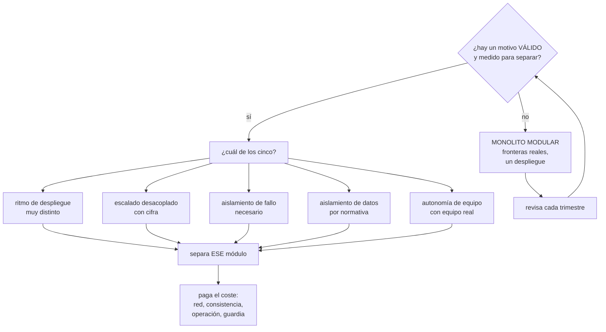

# 184 — Arquitectura monolítica, modular y de microservicios

> [← Clase anterior](../../part-15-systems-architecture-engineering/183-acoplamiento-cohesion-modularidad-y-fronteras/README.md) · [Índice de la parte](../README.md) · [Clase siguiente →](../../part-15-systems-architecture-engineering/185-disponibilidad-confiabilidad-y-analisis-de-puntos-de-fallo/README.md)

**Parte:** 15 — Arquitectura de sistemas e ingeniería de requisitos<br>
**Nivel:** intermedio-avanzado · **Horas estimadas:** 4<br>
**Laboratorio:** `decision` · **Estado:** `EXECUTABLE_CORE`

## 🎯 Propósito

Elegir cuántas unidades desplegables materializan las fronteras de la clase 183: una, unas pocas o muchas. La clase trata el monolito modular como opción por defecto legítima y no como fracaso, enumera los cinco motivos que **de verdad** justifican separar en servicios, cuantifica lo que cuesta cada separación, y da el orden de migración que evita los dos desastres habituales: el monolito distribuido y la reescritura completa.

## 📚 Resultados de aprendizaje

Al finalizar podrás:

1. **Elegir** entre monolito modular, unos pocos servicios y muchos con criterios comprobables.
2. **Aplicar** los cinco motivos válidos para separar, y descartar los inválidos.
3. **Cuantificar** el coste operativo de cada servicio adicional.
4. **Reconocer** un monolito distribuido antes de haberlo construido.
5. **Migrar** por partes, empezando por la que más lo justifica.

## 🧩 Conceptos centrales

| Concepto | Comprensión verificable |
|---|---|
| `monolito modular` | Un despliegue con fronteras internas reales: esquemas separados, un escritor por dato, dependencias controladas. |
| `monolito distribuido` | Muchos servicios que hay que desplegar juntos y comparten datos. Suma los costes de ambos modelos y no da las ventajas de ninguno. |
| `motivo válido de separación` | Razón medible: ritmo de despliegue, escalado desacoplado, aislamiento de fallo, aislamiento de datos o autonomía de equipo. |
| `coste marginal por servicio` | Lo que cuesta al mes tener un servicio más: canalización, telemetría, guardia, cuota, seguridad. |
| `estrangulamiento` | Migración por partes en la que lo nuevo intercepta tráfico y lo viejo se retira poco a poco. |
| `latencia de frontera` | Lo que añade cada salto de red: milisegundos, fallos parciales y consistencia eventual. |

## 🧠 Modelo mental

Una arquitectura es un conjunto de decisiones sobre estructuras, interfaces y atributos de calidad, respaldadas por escenarios y evidencia.

Aplicado a esta clase, separa siempre cuatro planos: **intención** (qué necesita el usuario),
**configuración** (qué declaramos), **estado observado** (qué existe de verdad) y
**evidencia** (cómo sabemos que cumple). Confundirlos produce diseños que se ven correctos
en un diagrama pero fallan al operar.

## 🗺️ Flujo de razonamiento



## 📖 Desarrollo

### 1. El monolito modular como opción por defecto

La discusión suele plantearse como «monolito o microservicios», y el planteamiento ya es el error: la frontera y el despliegue son decisiones distintas.

```text
FRONTERA          dónde está la línea            clase 183
DESPLIEGUE        cuántas unidades hay           esta clase

→ se puede tener 12 fronteras y 1 despliegue
→ y se puede tener 12 despliegues y 0 fronteras reales
   (que es el peor caso de todos)
```

Y el monolito modular no es un paso intermedio ni una derrota:

```text
QUÉ DA
  fronteras reales, propiedad clara, un escritor por dato
  transacciones locales, sin coordinación distribuida
  una canalización, una telemetría, una guardia
  latencia de llamada en nanosegundos
  refactorizar fronteras es barato

QUÉ NO DA
  despliegue independiente
  escalado por parte
  aislamiento de fallo
  autonomía de equipos grandes
```

Y el dato que más pesa en la decisión, con el tamaño de equipo real:

```text
hasta ~8 personas   el coste de coordinación humana es bajo
                    → un despliegue casi siempre gana
8 a 25              zona de decisión; separa lo que lo pida
> 25                la coordinación de un solo despliegue empieza
                    a dominar; separar por equipo tiene sentido
```

Y una advertencia sobre la comparación habitual:

```text
se compara «monolito heredado sin fronteras» contra
«microservicios bien hechos»
→ la comparación honesta es monolito MODULAR contra servicios,
  y entonces la ventaja se reduce mucho
```

### 2. Los cinco motivos válidos, y los inválidos

Separar un módulo en su propio servicio tiene que justificarse con uno de estos cinco, **con una cifra**:

```text
1. RITMO DE DESPLIEGUE MUY DISTINTO
   este módulo cambia 9 veces al mes y el resto 1
   → y los despliegues del resto lo bloquean, o al revés
   cifra   despliegues/mes de cada parte             clase 183

2. ESCALADO DESACOPLADO
   este módulo consume 8× los recursos del resto, o su carga
   sube 20× en campaña mientras el resto no se mueve
   cifra   uso de CPU/memoria por módulo y su perfil temporal
   ojo     si el ahorro es de 200 €/mes, no compensa

3. AISLAMIENTO DE FALLO
   un fallo aquí no debe poder tirar lo demás
   cifra   incidentes originados en este módulo que afectaron
           al resto
   ojo     dentro de un proceso también se puede aislar
           (límites, mamparos, tiempos de espera)   clase 153

4. AISLAMIENTO DE DATOS POR NORMATIVA
   estos datos deben vivir en otra región, otra cuenta u otro
   régimen de acceso                                clase 177
   → es el motivo menos discutible de los cinco

5. AUTONOMÍA DE EQUIPO
   hay un equipo REAL, con personas, que lo posee y lo opera
   ojo     «vamos a contratar» no cuenta; un servicio sin
           equipo es un servicio sin dueño            ley 20
```

Y los motivos que se usan mucho y no aguantan:

```text
«ES LA BUENA PRÁCTICA»                        ley 17
«ASÍ ESCALAMOS EN EL FUTURO»
  → el futuro rara vez llega con la forma prevista, y mientras
    tanto se paga todos los meses
«CADA SERVICIO EN SU LENGUAJE»
  → multiplica la operación por el número de lenguajes
«EL MONOLITO ESTÁ HECHO UN DESASTRE»
  → el desastre es la falta de fronteras; separarlo sin
    arreglarlas produce un monolito distribuido
«PARA QUE LOS EQUIPOS NO SE PISEN»
  → si el problema es el fichero compartido, la frontera
    modular ya lo resuelve                          clase 183
```

Y el criterio que resume todo:

```text
separa UN módulo cuando UNO de los cinco lo pide, con cifra
no separes «el sistema» de golpe
```

### 3. Lo que cuesta cada servicio

El coste de un servicio adicional se subestima siempre porque es difuso: no aparece en ninguna factura con su nombre.

```text
POR CADA SERVICIO, AL MES
  canalización y su mantenimiento
  telemetría: paneles, alertas, objetivos          clase 125
  procedimientos y turno de guardia                clase 127
  actualizaciones de base y de dependencias
  identidad, permisos, secretos                    clase 134
  presupuesto y etiquetas                          clase 142
  cuota y límites
  documentación y contrato                         clase 188

y los costes que no se ven hasta el incidente
  un salto de red más en el camino crítico
  un modo de fallo parcial más
  consistencia eventual donde antes había transacción
  una correlación más que mantener                 clase 121
```

Y el orden de magnitud, medido en organizaciones reales:

```text
un servicio bien operado cuesta entre 2 y 6 días-persona al
mes de mantenimiento, sin contar el desarrollo
→ 20 servicios ≈ una persona entera solo en mantenerlos
→ y ese es el mecanismo de la ley 23
```

**La latencia de frontera**, que se paga en cada llamada:

```text
llamada dentro del proceso            ~100 ns
llamada de red en la misma zona       0,5 - 2 ms
llamada entre zonas                   1 - 4 ms
con serialización y TLS               +0,3 - 1 ms

→ una operación que antes hacía 6 llamadas internas y ahora
  cruza 4 fronteras pasa de microsegundos a ~8 ms
→ y si alguna es una llamada por elemento, a segundos  clase 124
```

Y el efecto sobre la disponibilidad, que es el más olvidado:

```text
cada dependencia síncrona dura multiplica                clase 185
  6 servicios al 99,9 % en serie → 99,4 %
→ separar sin convertir las llamadas en asíncronas BAJA la
  disponibilidad
```

**El monolito distribuido**, que es el resultado de separar mal, se reconoce por estas señales:

```text
hay que desplegar varios servicios a la vez, en orden
varios servicios comparten base de datos
un cambio de esquema requiere coordinar equipos
las pruebas necesitan todo el sistema levantado
cada operación de usuario cruza más de 4 servicios
hay una transacción distribuida o una saga por operación normal
nadie puede desplegar en viernes
```

Y el diagnóstico:

```text
si tres o más de esas señales están presentes, se pagan los
costes de los servicios y los del monolito a la vez
→ y la salida suele ser JUNTAR, no separar más
```

### 4. Cómo migrar sin reescribir

Cuando la separación está justificada, el modo importa tanto como la decisión.

**Lo que no funciona:**

```text
LA REESCRITURA COMPLETA
  se congela el sistema viejo, se construye el nuevo
  → el viejo sigue cambiando porque el negocio no se para
  → el nuevo persigue un objetivo móvil durante 18 meses
  → y la mitad de estos proyectos se abandonan
```

**Lo que funciona: estrangulamiento.**

```text
1. poner una fachada delante del sistema actual
   → todo el tráfico pasa por ahí; nada cambia todavía

2. elegir UN módulo, el que más lo justifique
   → normalmente el de ritmo de cambio más alto

3. hacer que el dato tenga un solo escritor
   → esto es la parte cara, y se hace ANTES de mover código

4. desviar el tráfico de ese módulo al servicio nuevo
   → con despliegue escalonado y vuelta atrás    clase 102

5. RETIRAR el código y los datos viejos
   → sin este paso, la migración solo añade      clase 171

6. medir, y decidir si el siguiente módulo lo merece
```

Y el paso 3 es el que decide el resultado:

```text
mover el código sin dividir los datos produce dos servicios
que escriben la misma tabla
→ acoplamiento tipo 7, el más caro                 clase 183
→ y es exactamente el monolito distribuido
```

Y el paso 5 es el que más se salta:

```text
migración sin retirada = dos sistemas que mantener
→ y la capacidad del equipo se consume manteniendo      ley 23
→ la migración no termina cuando lo nuevo funciona:
  termina cuando lo viejo ya no existe
```

Y la lista de comprobación de la clase:

```text
☐ las fronteras están decididas antes que el despliegue
☐ cada separación tiene uno de los cinco motivos, con cifra
☐ hay un equipo real para cada servicio propuesto
☐ está calculado el coste marginal mensual por servicio
☐ está calculado el efecto en latencia y en disponibilidad
☐ ninguna operación normal exige transacción distribuida
☐ ningún par de servicios comparte almacén
☐ no hay servicios que deban desplegarse en orden
☐ la migración es por partes, no reescritura
☐ los datos se dividen antes de mover el código
☐ cada paso termina con la retirada de lo viejo
```

Y el cierre que enlaza con la clase siguiente: cada frontera que se materializa en un servicio añade un punto que puede fallar y una dependencia que se hereda. Calcular a cuánto asciende eso —y dónde está el techo real de disponibilidad— es la materia de la clase 185.

## 🔬 Ejemplo trabajado

**El equipo de reservas decide cuántos despliegues materializan las cuatro fronteras de la clase 183. Lo que sigue es la evaluación de los cinco motivos módulo por módulo, el cálculo del coste, y la migración de los dos que se separaron.**

**Punto de partida**: 6 personas, un monolito sin fronteras internas, 214 despliegues al año.

**Evaluación módulo por módulo, con cifras.**

```text
PRECIOS
  1 ritmo         9 despliegues/mes frente a 2 del resto     ✓
                  y 4 veces el mes pasado un despliegue de
                  precios se retrasó por esperar a reservas
  2 escalado      no; consume el 6 % de la CPU               ✗
  3 fallo         un error de reglas tiró el sistema entero
                  2 veces en el año                          ✓
  4 datos         no                                         ✗
  5 equipo        lo lleva 1 persona con revenue             ~
  DECISIÓN        SEPARAR — motivos 1 y 3, ambos con cifra

BÚSQUEDA
  1 ritmo         1 despliegue/mes                           ✗
  2 escalado      3.000/s en pico frente a 40/s del resto;
                  perfil temporal completamente distinto;
                  ahorro estimado 3.100 €/mes                ✓
  3 fallo         una búsqueda lenta agotaba el grupo de
                  conexiones y afectaba a reservas           ✓
  4 datos         no                                         ✗
  5 equipo        no hay equipo propio                       ✗
  DECISIÓN        SEPARAR — motivo 2 con cifra clara

RESERVAS + PAGOS
  1 ritmo         2/mes                                      ✗
  2 escalado      es el resto                                 ✗
  3 fallo         es el núcleo; aislarlo de qué                ✗
  4 datos         los datos de tarjeta no se guardan, se
                  tokenizan en la pasarela                    ✗
  5 equipo        4 personas, el mismo equipo                 ✗
  DECISIÓN        NO SEPARAR — y además el 71 % de cambios
                  acoplados lo desaconseja               clase 183

CATÁLOGO
  1 ritmo         1/mes                                      ✗
  2 escalado      no                                         ✗
  3 fallo         no ha causado incidentes                   ✗
  4 datos         no                                         ✗
  5 equipo        no                                         ✗
  DECISIÓN        NO SEPARAR — queda como módulo

CLIENTES (contacto, preferencias, consentimientos)
  4 datos         los consentimientos deben ser auditables y
                  con acceso restringido a legal              ~
  DECISIÓN        NO SEPARAR todavía — el aislamiento se
                  consigue con esquema y permisos propios,
                  sin un despliegue más

NOTIFICACIONES
  ya estaba separada; 6 % de cambios acoplados; se mantiene
```

**Resultado: 4 despliegues, no 12.**

```text
monolito modular   reservas+pagos, catálogo, clientes (3 módulos)
precios            servicio
búsqueda           servicio
notificaciones     servicio
```

**El coste, calculado antes de decidir.**

```text
coste marginal por servicio, estimado con el histórico
  canalización y mantenimiento         0,8 día-persona/mes
  telemetría y alertas                 0,5
  actualizaciones y dependencias       0,7
  identidad, secretos, permisos        0,3
  documentación y contrato             0,4
  TOTAL                                2,7 días-persona/mes

3 servicios además del monolito       8,1 días-persona/mes
equipo de 6 personas ≈ 120 días/mes   → 6,8 % de la capacidad

contraste: si se hubieran separado los 12 módulos
  12 × 2,7 = 32,4 días/mes            → 27 % de la capacidad
  y el equipo no habría podido construir nada         ley 23
```

**Efecto en latencia y disponibilidad, calculado antes:**

```text
el flujo de reserva cruza ahora 1 frontera nueva (precios)
  +1,4 ms de p50, +6 ms de p99
  aceptable frente al QA-1 de 500 ms                clase 181

disponibilidad
  precios era dependencia DURA en el flujo de reserva
  → 99,9 × 99,9 = 99,8 %, por debajo del QA-2 de 99,7 %  ✓ justo
  → decisión: el precio se CACHEA con validez de 10 min y
    si precios no responde se usa el último válido
  → pasa a dependencia BLANDA, y el techo vuelve a 99,9 %
```

Y esa decisión —convertir la dependencia dura en blanda— fue la que hizo viable la separación, y no se habría visto sin el cálculo.

**La migración de precios, por estrangulamiento.**

```text
semana 1   fachada delante del monolito; nada cambia
semanas 2-5  DIVIDIR EL DATO   ← la parte cara
  el precio vivía en la tabla de catálogo
  se crea el almacén de precios y se escribe en los dos
  se compara durante 2 semanas: 3 discrepancias, todas por
    un trabajo programado olvidado que escribía precios
  catálogo deja de escribir el precio
semana 6   el servicio de precios lee de su almacén
semana 7   la fachada desvía el 5 %, luego 25 %, luego 100 %
semana 8   se publica el evento de cambio de precio
semanas 9-10  RETIRADA
  columna de precio eliminada del catálogo
  código viejo borrado
  trabajo programado retirado
```

Y lo que costó y lo que se descubrió:

```text
dividir el dato                    4 semanas de las 10
mover el código                    1 semana
hallazgo   un trabajo programado escribía precios desde 2021
           y nadie lo sabía; explicaba 3 incidentes de
           «precio incorrecto» sin causa conocida
```

**El resultado, seis meses después.**

```text                                        antes    después
despliegues de precios bloqueados/mes            4         0
incidentes originados en reglas de precios       2/año     0
coste de cómputo en pico                    -3.100 €/mes
p99 del flujo de reserva                    412 ms    438 ms
disponibilidad del flujo                    99,71 %   99,74 %
capacidad consumida en mantenimiento          n/d       6,8 %
servicios que comparten almacén                 4         0
```

**Y la decisión que no se tomó**, registrada para no rediscutirla cada trimestre:

```text
no separar reservas y pagos
revisar si   el equipo pasa de 12 personas
             o el 71 % de cambios acoplados baja del 30 %
```

**La lección que esta clase deja**: de doce módulos, solo tres cumplían alguno de los cinco motivos con una cifra detrás, y separar los doce habría consumido el 27 % de la capacidad del equipo en mantenimiento. Y la parte cara de separar un servicio **no fue mover el código —una semana— sino dividir el dato: cuatro**. Quien separa código sin dividir datos no ha separado nada.

## 🧪 Laboratorio guiado

Ejecuta desde la raíz:

```bash
python classes/part-15-systems-architecture-engineering/184-arquitectura-monolitica-modular-y-de-microservicios/lab.py
```

El laboratorio selecciona el motor de práctica **`decision`** y produce
`lab_result.json`. El escenario, sus comprobaciones y el artefacto esperado corresponden a
esta clase; no requiere credenciales y deja explícito qué debe revalidarse en un sandbox real.

1. Lee `exercise.steps` y formula una predicción antes de ejecutar.
2. Ejecuta la práctica y verifica todos los elementos de `checks`.
3. Provoca el caso de `negative_test` y explica la señal observada.
4. Materializa `architecture-style-adr` en `evidence/` usando la plantilla indicada.
5. Para proveedor real, sigue `sandbox.requires`, registra costo y ejecuta `destroy`.

### Evidencia esperada

El artefacto principal es una matriz de decisión ponderada y un ADR. Además, la entrega debe incluir el comando ejecutado,
la salida estructurada y una conclusión que no exceda lo observado.

## 🏆 Reto verificable

Construye **`architecture-style-adr`** para el caso CloudShop. Incluye una alternativa descartada,
un supuesto que pueda falsarse, una prueba de fallo y una decisión de rollback.

## ✅ Criterio de aceptación

- [ ] `lab.py` termina con código 0 y genera JSON válido.
- [ ] La entrega conecta al menos tres requisitos con mecanismos verificables.
- [ ] Existe una prueba positiva y una prueba negativa con evidencia.
- [ ] Seguridad, costo y operación aparecen como decisiones, no como anexos.
- [ ] Se declara una limitación y una condición que obligaría a revisar el diseño.
- [ ] Otra persona puede repetir el recorrido sin conocimiento tácito.

## ⚠️ Errores frecuentes

| Síntoma | Causa probable | Corrección |
|---|---|---|
| Hay muchos servicios pero hay que desplegarlos en orden y comparten base | Monolito distribuido: se separó el código sin dividir los datos | Divide primero los datos con un escritor único; si ya está hecho al revés, plantea juntar en vez de separar más. |
| El equipo apenas construye nada nuevo | El coste de mantener los servicios consume la capacidad | Calcula el coste marginal por servicio y retira; separa solo lo que cumpla uno de los cinco motivos con cifra. |
| La disponibilidad bajó tras separar en servicios | Las llamadas nuevas son síncronas y duras, y se multiplican | Calcula el techo antes de separar y convierte las dependencias del camino crítico en blandas con caché o valor por defecto. |
| La reescritura completa lleva año y medio y no sale | El sistema viejo sigue cambiando mientras se construye el nuevo | Migra por estrangulamiento: fachada, un módulo cada vez, y retirada al final de cada paso. |
| Tras la migración hay que mantener el sistema nuevo y el viejo | No hubo paso de retirada | La migración termina cuando lo viejo deja de existir, no cuando lo nuevo funciona. |
| Se separa un servicio y acaba sin quien lo atienda | Se contó con un equipo que no existía | Exige equipo real y dueño escrito antes de crear un despliegue nuevo. |

## 🛡️ Seguridad, ética y costo

Trabaja con cuentas propias o sandboxes autorizados. No publiques secretos, identificadores
reales ni datos personales. Antes de crear recursos pagos define presupuesto, etiquetas y
comando de destrucción; después verifica que no queden recursos huérfanos. Los ejemplos
locales enseñan contratos, pero no certifican cumplimiento ni disponibilidad de producción.

## ❓ Preguntas de comprobación

1. ¿Por qué frontera y despliegue son decisiones distintas?
2. ¿Cuáles son los cinco motivos válidos para separar y qué cifra respalda cada uno?
3. ¿Cuánto cuesta al mes un servicio adicional y por qué no aparece en ninguna factura?
4. ¿Por qué separar sin convertir llamadas en asíncronas baja la disponibilidad?
5. ¿Cuál es el paso caro del estrangulamiento y cuál el que más se salta?

## 🔗 Referencias

- Newman, S. (2021). *Building Microservices*, 2.ª ed. — cuándo separar y qué cuesta. <https://www.oreilly.com/library/view/building-microservices-2nd/9781492034018/>
- Fowler, M. (2015). *MonolithFirst* — empezar junto y separar con evidencia. <https://martinfowler.com/bliki/MonolithFirst.html>
- Fowler, M. (2004). *StranglerFigApplication* — migración por estrangulamiento. <https://martinfowler.com/bliki/StranglerFigApplication.html>
- Shopify Engineering (2019). *Deconstructing the monolith* — monolito modular a escala. <https://shopify.engineering/deconstructing-monolith-designing-software-maximizes-developer-productivity>
- Skelton, M. y Pais, M. (2019). *Team Topologies* — servicios, equipos y carga cognitiva. <https://teamtopologies.com/book>
- Documentación oficial vigente del servicio implementado; registra URL y fecha de consulta.

---

> [Evaluación](assessment.md) · [Contrato de clase](lesson.yaml) · [Índice de la parte](../README.md)
