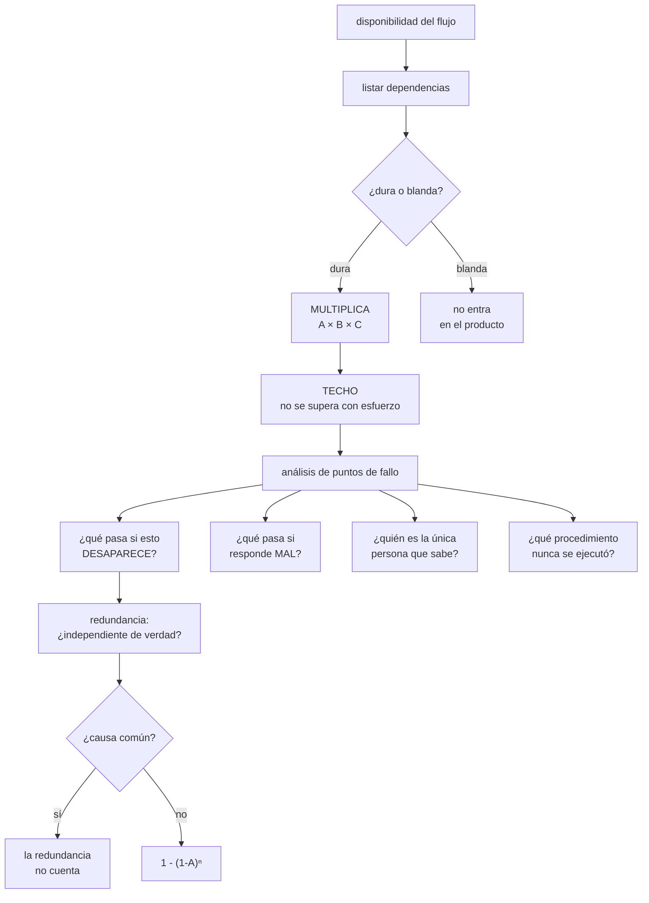

# 185 — Disponibilidad, confiabilidad y análisis de puntos de fallo

> [← 184 · Arquitectura monolítica, modular y de microservicios](../../part-15-systems-architecture-engineering/184-arquitectura-monolitica-modular-y-de-microservicios/README.md) · [Índice de la parte](../README.md) · [186 · Capacidad, latencia, throughput y teoría de colas →](../../part-15-systems-architecture-engineering/186-capacidad-latencia-throughput-y-teoria-de-colas/README.md)

**Parte:** 15 — Arquitectura de sistemas e ingeniería de requisitos<br>
**Nivel:** intermedio-avanzado · **Horas estimadas:** 4<br>
**Laboratorio:** `reliability` · **Estado:** `EXECUTABLE_CORE`

## 🎯 Propósito

Calcular a cuánto asciende la disponibilidad que se puede prometer, y descubrir por qué casi siempre es menor de lo que se cree. La clase da la aritmética de dependencias en serie y en paralelo, el análisis de puntos de fallo hecho como se hace de verdad —no listando componentes sino preguntando qué pasa si cada uno desaparece—, y sostiene con la evidencia del programa que **la mayoría de los puntos únicos de fallo no son de infraestructura, sino de conocimiento y de procedimiento**.

## 📚 Resultados de aprendizaje

Al finalizar podrás:

1. **Calcular** el techo de disponibilidad a partir de las dependencias.
2. **Distinguir** dependencia dura de blanda y convertir unas en otras.
3. **Ejecutar** un análisis de puntos de fallo que encuentre los que no son técnicos.
4. **Cuantificar** qué aporta cada redundancia y cuánto cuesta.
5. **Decidir** dónde no invertir en disponibilidad, con cifras.

## 🧩 Conceptos centrales

| Concepto | Comprensión verificable |
|---|---|
| `dependencia dura` | Si falla, la operación falla. Su disponibilidad se multiplica con la del sistema. |
| `dependencia blanda` | Si falla, la operación continúa degradada. No entra en el producto. |
| `techo de disponibilidad` | Máximo que se puede prometer dadas las dependencias duras. No se supera con esfuerzo. |
| `punto único de fallo` | Elemento cuya desaparición interrumpe el servicio. Puede ser una máquina, un dato, una persona o un procedimiento. |
| `fallo correlacionado` | Dos réplicas que caen a la vez por una causa común. Anula la redundancia calculada. |
| `modo de fallo gris` | El componente no cae: responde mal o lento. La redundancia clásica no lo cubre. |

## 🧠 Modelo mental

Una arquitectura es un conjunto de decisiones sobre estructuras, interfaces y atributos de calidad, respaldadas por escenarios y evidencia.

Aplicado a esta clase, separa siempre cuatro planos: **intención** (qué necesita el usuario),
**configuración** (qué declaramos), **estado observado** (qué existe de verdad) y
**evidencia** (cómo sabemos que cumple). Confundirlos produce diseños que se ven correctos
en un diagrama pero fallan al operar.

## 🗺️ Flujo de razonamiento



## 📖 Desarrollo

### 1. La aritmética que casi nadie hace

La disponibilidad prometida se calcula, no se declara. Y el cálculo es elemental, lo que hace más llamativo que se omita.

**En serie**, que es el caso normal de una llamada síncrona dura:

```text
A depende de B, B de C, todas duras
  disponibilidad = A × B × C

ejemplo real de un flujo de reserva
  balanceador          99,99 %
  API de reservas      99,95 %
  base de datos        99,99 %
  servicio de precios  99,90 %
  pasarela de pago     99,95 %
  identidad            99,99 %
  ────────────────────────────
  techo                99,77 %      ← ~100 min/mes de parada

y la promesa que había en el contrato   99,9 %
→ imposible de cumplir por aritmética, no por calidad
```

Y el efecto acumulativo es lo que sorprende:

```text
 5 dependencias al 99,9 %  →  99,50 %
10 dependencias al 99,9 %  →  99,00 %
20 dependencias al 99,9 %  →  98,02 %

→ y por eso separar en servicios sin convertir llamadas en
  asíncronas baja la disponibilidad                clase 184
```

**En paralelo**, que es lo que aporta la redundancia:

```text
n réplicas independientes, cualquiera sirve
  disponibilidad = 1 - (1 - A)ⁿ

2 réplicas al 99 %    →  99,99 %
2 réplicas al 99,9 %  →  99,9999 %

→ la redundancia da mucho MÁS de lo que quita la serie
→ siempre que las réplicas sean INDEPENDIENTES
```

Y aquí está el engaño más frecuente de todo el cálculo:

```text
FALLO CORRELACIONADO
  dos réplicas en la misma zona          ← comparten energía
  dos réplicas con el mismo despliegue   ← comparten el error
  dos réplicas con el mismo certificado  ← caduca a la vez
  dos réplicas con la misma configuración errónea
  dos réplicas que dependen del mismo servicio de identidad

→ en todos esos casos la fórmula del paralelo NO aplica
→ y la disponibilidad real es la de UNA réplica
```

Y la comprobación práctica:

```text
por cada redundancia, preguntar
  ¿qué causa haría caer a las dos a la vez?
  → si existe alguna, la redundancia solo cubre el resto
```

### 2. Duras, blandas y cómo convertir

La palanca más barata para subir el techo no es añadir réplicas: es **reducir el número de dependencias duras**.

```text
DURA     si falla, la operación falla
BLANDA   si falla, la operación continúa degradada

y la mayoría de las dependencias que se creen duras no lo son
```

Las cuatro formas de convertir dura en blanda:

```text
1. VALOR POR DEFECTO
   si recomendaciones no responde, no hay recomendaciones
   coste   ninguno; solo decidirlo

2. ÚLTIMO VALOR VÁLIDO
   si precios no responde, se usa el precio cacheado con
   validez declarada
   coste   posible precio desactualizado unos minutos
   ojo     hay que decidir CUÁNTO tiempo es aceptable

3. DIFERIR
   si el correo no sale, se encola y sale luego     clase 118
   coste   complejidad de cola y reintentos

4. ACEPTAR Y RECONCILIAR
   se acepta la operación y se verifica después
   coste   hay que manejar el caso de rechazo posterior
   ojo     la compensación hace invisible el fallo    ley 19
```

Y las que **no** se pueden convertir, y hay que aceptar como techo:

```text
el almacén donde vive el dato que se escribe
la identidad, si cada petición la necesita
el cobro, si el negocio no acepta reservar sin cobrar
→ y sobre estas se decide con redundancia o con contrato
```

Y el ejemplo del efecto, con el mismo flujo de antes:

```text
antes    6 dependencias duras         techo 99,77 %

conversiones
  precios      → último valor válido, 10 min
  identidad    → validación local del testigo, sin llamada

después  4 dependencias duras         techo 99,88 %
coste    dos decisiones y un caché; cero euros de infraestructura
```

Y una advertencia que este programa ha demostrado dos veces:

```text
una dependencia declarada blanda que nunca se ha probado
suele ser dura                                       ley 22
→ la prueba: apagarla y ver si la operación sigue
→ en la clase 179, el catálogo estaba declarado blando
  y no lo era
```

### 3. Análisis de puntos de fallo, hecho de verdad

El análisis que se hace habitualmente lista componentes y marca los que tienen redundancia. Encuentra poco porque hace la pregunta fácil.

Las cuatro preguntas que sí encuentran:

```text
1. ¿QUÉ PASA SI ESTO DESAPARECE?
   la pregunta clásica; encuentra los puntos únicos técnicos

2. ¿QUÉ PASA SI RESPONDE MAL O LENTO?
   el fallo gris; la redundancia no lo cubre porque el
   elemento sigue «vivo»                            clase 130
   → una réplica lenta puede ser peor que una caída

3. ¿QUIÉN ES LA ÚNICA PERSONA QUE SABE ESTO?
   punto único de conocimiento
   → no aparece en ningún diagrama                  clase 180

4. ¿QUÉ PROCEDIMIENTO NUNCA SE HA EJECUTADO?
   punto único de procedimiento                       ley 22
   → el que se descubre cuando hace falta
```

Y la evidencia de este programa sobre el reparto:

```text
en la clase 179, de los puntos únicos encontrados
  de infraestructura                                   2
  de datos (un escritor sin réplica)                   1
  de conocimiento (una sola persona sabía)             1
  de procedimiento (nunca ejecutado)                   5

→ la mayoría NO eran de infraestructura
```

**Los puntos únicos que se olvidan siempre**, por categoría:

```text
TÉCNICOS NO EVIDENTES
  el registro de artefactos: si cae, no hay despliegues
  el proveedor de identidad: si cae, no entra nadie
  el DNS y los certificados: caducan a la vez en todas partes
  el servicio de secretos
  la cuenta de un proveedor externo con un solo pagador

DE DATOS
  la única copia, aunque haya réplicas             clase 166
  el único escritor sin plan de sustitución

HUMANOS Y DE PROCESO
  la persona que conoce el despliegue manual
  la aprobación que solo puede dar una persona
  el procedimiento de recuperación nunca ensayado
  el acceso de emergencia nunca usado              clase 179
  el contrato con un proveedor sin alternativa
```

Y la forma práctica de hacer el análisis, que cabe en una tabla:

```text
elemento │ ¿qué pasa si cae? │ ¿si responde mal? │ detección │
         │ ¿cuánto tarda en  │ ¿quién sabe?      │ ¿probado? │
         │ notarse?          │                   │           │
```

Y la columna que más encuentra es la última:

```text
¿PROBADO?
  «sí, en 2023»    → no está probado             ley 22
  «está documentado» → no está probado
  «debería funcionar» → no está probado
```

### 4. Dónde no invertir

Subir la disponibilidad cuesta, y el coste crece más rápido que el beneficio. Decidir **dónde parar** es parte del diseño.

```text
coste aproximado de cada nueve, misma carga
  99,0 %   →  99,9 %      ×1,3   (reintentos, escalado, alertas)
  99,9 %   →  99,95 %     ×1,6   (multizona real)
  99,95 %  →  99,99 %     ×2,5   (multirregión, ensayos)
  99,99 %  →  99,999 %    ×6+    (y suele ser inalcanzable por
                                  el techo de dependencias)
```

Y el criterio para decidir, que es el mismo de la clase 164:

```text
coste de la indisponibilidad al mes
  = minutos esperados × pérdida por minuto

y se compara con el coste de la nueve siguiente
→ si la nueve cuesta 6.400 €/mes y evita 1.900 € de pérdida,
  no se compra
```

Y tres sitios donde casi nunca compensa invertir:

```text
CAMINOS QUE NO SON CRÍTICOS
  el panel interno, los informes, la exportación nocturna
  → degradar es correcto

POR ENCIMA DEL TECHO DE DEPENDENCIAS
  si la pasarela de pago da 99,95 %, invertir en llegar al
  99,99 % propio no cambia nada                     clase 181

DONDE EL PROBLEMA ES LA DETECCIÓN
  si la mitad del tiempo caído es tiempo hasta enterarse,
  la inversión rentable es la alerta, no la réplica
  → en la clase 132, la detección era el 70 % del tiempo
```

Y una consecuencia que ordena las prioridades:

```text
disponibilidad observada = f(frecuencia, detección, mitigación)

y reducir el tiempo de detección suele ser lo más barato
→ antes de duplicar infraestructura, mira cuánto se tarda
  en enterarse
```

Y la lista de comprobación de la clase:

```text
☐ están listadas todas las dependencias del flujo crítico
☐ cada una está marcada como dura o blanda
☐ las blandas se han probado apagándolas
☐ el techo está calculado y comparado con lo prometido
☐ cada redundancia tiene identificada su causa común
☐ el análisis pregunta también por respuesta lenta o errónea
☐ están listados los puntos únicos de conocimiento
☐ están listados los procedimientos nunca ejecutados
☐ el coste de la nueve siguiente está comparado con la pérdida
☐ se sabe qué parte del tiempo caído es detección
```

Y el cierre que enlaza con la clase siguiente: la disponibilidad supone que el sistema, cuando está en pie, responde a tiempo. Cuánta carga aguanta antes de que eso deje de ser cierto —y por qué el punto de ruptura llega antes de lo que sugiere el uso de CPU— es la materia de la clase 186.

## 🔬 Ejemplo trabajado

**El equipo de reservas calcula el techo de su flujo crítico y hace el análisis de puntos de fallo. Lo que sigue es el cálculo, las conversiones que hicieron, los once puntos únicos encontrados —de los cuales solo tres eran de infraestructura— y la decisión de dónde no invertir.**

**El cálculo inicial del flujo de reserva, con lo que había:**

```text
componente              disp.      dura   nota
CDN / balanceador       99,99 %     sí
API de reservas         99,95 %     sí    2 instancias, 1 zona
base de reservas        99,99 %     sí    zonal, sin réplica
servicio de precios     99,90 %     sí    nuevo, clase 184
pasarela de pago        99,95 %     sí    externa, contrato
proveedor de identidad  99,99 %     sí    valida cada petición
servicio de catálogo    99,90 %     sí    ← se creía blando
notificaciones          99,50 %     no    asíncrona
────────────────────────────────────────
techo                   99,68 %
prometido en el QA-2    99,70 %           ← incumplido por
                                            aritmética
```

Y el hallazgo del cálculo:

```text
catálogo estaba declarado como dependencia blanda
la prueba negativa de la clase 179 lo desmintió: al inyectar
latencia, el flujo de reserva se caía
→ el código lo llamaba de forma síncrona sin plazo ni
  alternativa                                        ley 22
```

**Las conversiones, por orden de coste:**

```text
1  IDENTIDAD → sin llamada
   validación local del testigo firmado; la llamada solo en
   renovación
   coste   0 €; 3 días de trabajo
   efecto  sale del producto

2  PRECIOS → último valor válido
   caché con validez de 10 min; si no responde, precio anterior
   coste   0 €; riesgo de precio desactualizado 10 min
   acepta  revenue, por escrito
   efecto  sale del producto

3  CATÁLOGO → blando de verdad
   plazo de 300 ms y, si no responde, se sirve la ficha
   cacheada; si no hay caché, se muestra sin detalle
   coste   0 €; 5 días
   efecto  sale del producto

4  BASE DE RESERVAS → multizona
   réplica síncrona en otra zona, conmutación automática
   coste   +840 €/mes
   efecto  99,99 % → 99,995 %

5  API DE RESERVAS → dos zonas
   coste   +310 €/mes
   efecto  99,95 % → 99,98 %

NO CONVERTIBLE
   pasarela de pago: el negocio no acepta reservar sin cobrar
   → queda como techo de 99,95 %
```

**El techo después:**

```text
CDN                   99,99 %
API (2 zonas)         99,98 %
base (multizona)      99,995 %
pasarela de pago      99,95 %
────────────────────────────
techo                 99,92 %      frente a 99,68 % antes
coste añadido         1.150 €/mes
y de las 5 mejoras, 3 costaron 0 €
```

**El análisis de puntos de fallo: once encontrados.**

```text
INFRAESTRUCTURA (3)
  1  el registro de artefactos es de una sola región
     si cae   no hay despliegues ni escalado con imagen nueva
     probado  no
  2  los certificados caducan el mismo día en los 4 servicios
     si cae   caen los cuatro a la vez → fallo correlacionado
     probado  no
  3  el servicio de secretos es zonal
     si cae   los servicios que arrancan no obtienen credenciales
     probado  no

DATOS (1)
  4  la copia de seguridad está en la misma cuenta
     si cae   un borrado con credencial comprometida se lleva
              las dos                                clase 166
     probado  sí, y falló

RESPUESTA LENTA, NO CAÍDA (2)
  5  una réplica de lectura degradada seguía recibiendo tráfico
     el reparto era rotatorio                        clase 152
  6  la pasarela de pago responde en 8 s en vez de fallar
     el plazo estaba en 30 s → el hilo se ocupaba

CONOCIMIENTO (2)
  7  una sola persona sabe reconstruir el índice de búsqueda
     si no está   entre 4 y 8 h de indisponibilidad de búsqueda
  8  una sola persona conoce la relación entre el inventario
     de consumidores y los informes de negocio       clase 180

PROCEDIMIENTO (3)
  9  el acceso de emergencia nunca se había usado
     probado  sí, en la clase 179, y NO funcionaba
 10  la conmutación de región nunca se había cronometrado
     probado  sí, y tardaba 2 h 10 frente a 1 h declarada
 11  la restauración de la base de precios (nueva) no se
     había ensayado nunca
     probado  no
```

Y el reparto, que es la conclusión de esta clase:

```text
de infraestructura                3 de 11        27 %
de datos                          1 de 11         9 %
de respuesta degradada            2 de 11        18 %
de conocimiento                   2 de 11        18 %
de procedimiento                  3 de 11        27 %

→ 8 de 11 no se habrían encontrado mirando el diagrama
```

**Las correcciones y su coste:**

```text
punto   corrección                              coste
1       réplica del registro en 2ª región       120 €/mes
2       renovación escalonada, 3 fechas          0 €
3       secretos regionales                      0 €
4       copia en cuenta separada e inmutable     90 €/mes
5       reparto por menor número de peticiones   0 €
6       plazo a 3 s con reintento                0 €
7       procedimiento escrito + ejecutado por    2 días
        otra persona                             de trabajo
8       inventario de consumidores documentado   3 días
9       acceso de emergencia corregido y con     0 €
        prueba trimestral                        + calendario
10      conmutación optimizada a 38 min          clase 179
11      ensayo de restauración de precios        1 día
```

Y el detalle que resume la clase:

```text
de las once correcciones, siete costaron 0 € de infraestructura
y las tres más peligrosas —acceso de emergencia, conocimiento
único y certificados simultáneos— no aparecían en ningún
diagrama de arquitectura
```

**Dónde se decidió NO invertir:**

```text
1  segunda región activa para el flujo de reserva
   subiría de 99,92 % a 99,96 %
   coste                            6.400 €/mes
   pérdida evitada estimada           390 €/mes
   decisión   no; se mantiene la segunda región en frío

2  redundancia del servicio de búsqueda
   la búsqueda degradada permite reservar por referencia
   decisión   no; es dependencia blanda y ya está probado

3  alta disponibilidad del panel interno y los informes
   decisión   no; degradar es correcto

4  subir del 99,92 % con la pasarela de pago al 99,95 %
   decisión   imposible; es el techo. Se negocia en contrato
              o se acepta
```

**La lección que esta clase deja**: el techo real era **99,68 %** frente al 99,70 % prometido, y se incumplía por aritmética antes de que nadie cometiera un error. Subirlo a 99,92 % costó 1.150 €/mes, y **tres de las cinco mejoras costaron cero euros**: consistieron en dejar de llamar a cosas de forma síncrona. Y de los once puntos únicos de fallo, **ocho no eran de infraestructura**.

## 🧪 Laboratorio guiado

Ejecuta desde la raíz:

```bash
python classes/part-15-systems-architecture-engineering/185-disponibilidad-confiabilidad-y-analisis-de-puntos-de-fallo/lab.py
```

El laboratorio selecciona el motor de práctica **`reliability`** y produce
`lab_result.json`. El escenario, sus comprobaciones y el artefacto esperado corresponden a
esta clase; no requiere credenciales y deja explícito qué debe revalidarse en un sandbox real.

1. Lee `exercise.steps` y formula una predicción antes de ejecutar.
2. Ejecuta la práctica y verifica todos los elementos de `checks`.
3. Provoca el caso de `negative_test` y explica la señal observada.
4. Materializa `failure-mode-analysis` en `evidence/` usando la plantilla indicada.
5. Para proveedor real, sigue `sandbox.requires`, registra costo y ejecuta `destroy`.

### Evidencia esperada

El artefacto principal es un escenario de fallo con objetivo y recuperación medida. Además, la entrega debe incluir el comando ejecutado,
la salida estructurada y una conclusión que no exceda lo observado.

## 🏆 Reto verificable

Construye **`failure-mode-analysis`** para el caso CloudShop. Incluye una alternativa descartada,
un supuesto que pueda falsarse, una prueba de fallo y una decisión de rollback.

## ✅ Criterio de aceptación

- [ ] `lab.py` termina con código 0 y genera JSON válido.
- [ ] La entrega conecta al menos tres requisitos con mecanismos verificables.
- [ ] Existe una prueba positiva y una prueba negativa con evidencia.
- [ ] Seguridad, costo y operación aparecen como decisiones, no como anexos.
- [ ] Se declara una limitación y una condición que obligaría a revisar el diseño.
- [ ] Otra persona puede repetir el recorrido sin conocimiento tácito.

## ⚠️ Errores frecuentes

| Síntoma | Causa probable | Corrección |
|---|---|---|
| Se promete una disponibilidad que se incumple sin que nadie cometa errores | No se calculó el techo que imponen las dependencias duras | Multiplica la disponibilidad de todas las dependencias duras del flujo y compara con lo prometido antes de firmarlo. |
| Hay redundancia y aun así el servicio cae entero | Fallo correlacionado: misma zona, mismo despliegue, mismo certificado o misma configuración | Por cada redundancia, identifica qué causa tiraría a las dos a la vez; si existe, la fórmula del paralelo no aplica. |
| Una dependencia declarada blanda tumba la operación | Nunca se probó apagándola | Apaga cada dependencia blanda en una prueba negativa; si la operación se cae, era dura. |
| Una réplica degradada hace más daño que una caída | El análisis solo preguntó qué pasa si el elemento desaparece | Pregunta también qué pasa si responde mal o lento, y reparte por menor número de peticiones en vuelo. |
| En un incidente resulta que solo una persona sabía hacer algo | El análisis se limitó a componentes técnicos | Añade las preguntas por punto único de conocimiento y por procedimiento nunca ejecutado. |
| Se gasta mucho en redundancia y la disponibilidad observada apenas mejora | La mayor parte del tiempo caído es tiempo hasta enterarse | Mide qué fracción del tiempo es detección; si domina, invierte en alertas antes que en réplicas. |

## 🛡️ Seguridad, ética y costo

Trabaja con cuentas propias o sandboxes autorizados. No publiques secretos, identificadores
reales ni datos personales. Antes de crear recursos pagos define presupuesto, etiquetas y
comando de destrucción; después verifica que no queden recursos huérfanos. Los ejemplos
locales enseñan contratos, pero no certifican cumplimiento ni disponibilidad de producción.

## ❓ Preguntas de comprobación

1. ¿Cómo se calcula el techo de disponibilidad de un flujo con dependencias duras en serie?
2. ¿Qué invalida la fórmula del paralelo y cómo se detecta?
3. ¿Cuáles son las cuatro formas de convertir una dependencia dura en blanda?
4. ¿Qué cuatro preguntas hace un análisis de puntos de fallo que encuentre los no técnicos?
5. ¿En qué tres situaciones no compensa invertir en más disponibilidad?

## 🔗 Referencias

- Beyer, B. y otros (2016). *Site Reliability Engineering*, cap. «Embracing risk» — aritmética de disponibilidad y coste de cada nueve. <https://sre.google/sre-book/embracing-risk/>
- AWS (2025). *Reliability Pillar: failure management* — modos de fallo y dependencias. <https://docs.aws.amazon.com/wellarchitected/latest/reliability-pillar/welcome.html>
- Huang, P. y otros (2017). *Gray failure: the Achilles' heel of cloud-scale systems*. <https://www.microsoft.com/en-us/research/publication/gray-failure-the-achilles-heel-of-cloud-scale-systems/>
- Nygard, M. (2018). *Release It!*, 2.ª ed. — mamparos, plazos y fallo en cascada. <https://pragprog.com/titles/mnee2/release-it-second-edition/>
- Google Cloud (2025). *Designing resilient systems* — dependencias duras, blandas y degradación. <https://cloud.google.com/architecture/framework/reliability>
- Documentación oficial vigente del servicio implementado; registra URL y fecha de consulta.

---

> [Evaluación](assessment.md) · [Contrato de clase](lesson.yaml) · [Índice de la parte](../README.md)

| Anterior | Índice | Siguiente |
|---|---|---|
| [← 184 · Arquitectura monolítica, modular y de microservicios](../../part-15-systems-architecture-engineering/184-arquitectura-monolitica-modular-y-de-microservicios/README.md) | [Parte 15](../README.md) · [Programa](../../README.md) | [186 · Capacidad, latencia, throughput y teoría de colas →](../../part-15-systems-architecture-engineering/186-capacidad-latencia-throughput-y-teoria-de-colas/README.md) |
