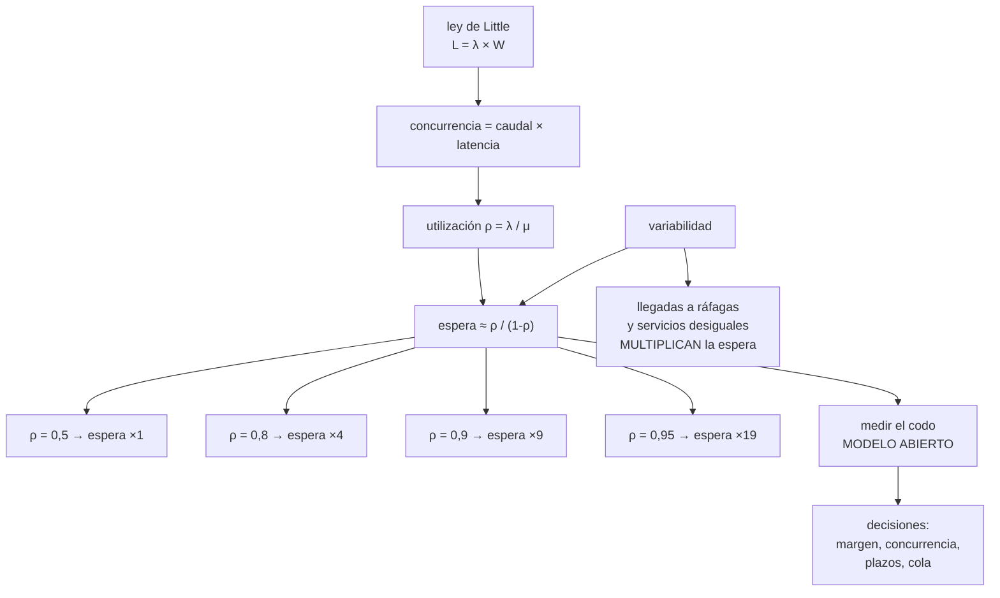

# 186 — Capacidad, latencia, throughput y teoría de colas

> [← Clase anterior](../../part-15-systems-architecture-engineering/185-disponibilidad-confiabilidad-y-analisis-de-puntos-de-fallo/README.md) · [Índice de la parte](../README.md) · [Clase siguiente →](../../part-15-systems-architecture-engineering/187-consistencia-particiones-relojes-y-consenso/README.md)

**Parte:** 15 — Arquitectura de sistemas e ingeniería de requisitos<br>
**Nivel:** intermedio-avanzado · **Horas estimadas:** 4<br>
**Laboratorio:** `performance` · **Estado:** `EXECUTABLE_CORE`

## 🎯 Propósito

Entender por qué un sistema al 70 % de uso responde bien y al 85 % deja de responder, y poder predecirlo antes de que ocurra. La clase da la teoría de colas mínima que hace falta —ley de Little, la curva de espera frente a utilización y por qué la variabilidad la empeora—, explica la diferencia entre modelo cerrado y abierto en las pruebas de carga, y convierte todo eso en decisiones de capacidad, plazos y concurrencia que se pueden escribir en un diseño.

## 📚 Resultados de aprendizaje

Al finalizar podrás:

1. **Aplicar** la ley de Little para relacionar concurrencia, caudal y latencia.
2. **Explicar** por qué la latencia se dispara cerca de la saturación.
3. **Medir** el codo con una prueba de modelo abierto y datos realistas.
4. **Dimensionar** grupos de conexiones, hilos y plazos con criterio.
5. **Decidir** el margen de capacidad con una cifra y no con una costumbre.

## 🧩 Conceptos centrales

| Concepto | Comprensión verificable |
|---|---|
| `ley de Little` | L = λ × W. La concurrencia media es el caudal por el tiempo medio en el sistema. Se cumple siempre, sin supuestos. |
| `utilización (ρ)` | Fracción del tiempo que el recurso está ocupado. La espera crece como 1/(1-ρ). |
| `codo` | Zona de utilización donde la latencia empieza a crecer sin control. Suele estar entre 0,6 y 0,8, no en 0,95. |
| `variabilidad` | Dispersión de llegadas y de servicio. Duplicar la variabilidad duplica la espera a la misma utilización. |
| `modelo abierto` | Prueba en la que las llegadas no dependen de las respuestas. Es la única que reproduce un pico real. |
| `modelo cerrado` | Prueba con N usuarios virtuales que esperan la respuesta. Se autolimita y oculta la saturación. |

## 🧠 Modelo mental

Una arquitectura es un conjunto de decisiones sobre estructuras, interfaces y atributos de calidad, respaldadas por escenarios y evidencia.

Aplicado a esta clase, separa siempre cuatro planos: **intención** (qué necesita el usuario),
**configuración** (qué declaramos), **estado observado** (qué existe de verdad) y
**evidencia** (cómo sabemos que cumple). Confundirlos produce diseños que se ven correctos
en un diagrama pero fallan al operar.

## 🗺️ Flujo de razonamiento



## 📖 Desarrollo

### 1. Ley de Little, que se cumple siempre

La única fórmula de esta clase que no tiene supuestos:

```text
L = λ × W

  L   elementos en el sistema (concurrencia media)
  λ   caudal (llegadas por segundo, en régimen estable)
  W   tiempo medio en el sistema (latencia)
```

Y su utilidad práctica es que despeja incógnitas que nadie suele calcular:

```text
¿cuántas conexiones a la base necesito?
  λ = 400 consultas/s, W = 25 ms
  L = 400 × 0,025 = 10 conexiones en uso de media
  → el grupo de 200 conexiones no hacía falta
  → y era la causa de la saturación de la base

¿cuántos hilos necesita el servicio?
  λ = 1.200 pet/s, W = 80 ms
  L = 96 peticiones simultáneas

¿qué latencia implica mi límite de concurrencia?
  L = 50 (límite del grupo), λ = 1.000/s
  W = 50 / 1.000 = 50 ms
  → si el trabajo real tarda 80 ms, el caudal máximo es 625/s
    y por encima se forma cola, haga lo que haga el escalado
```

Y la lectura que más decisiones cambia:

```text
si la latencia sube y el caudal se mantiene, la concurrencia
SUBE proporcionalmente
→ y los grupos de conexiones, hilos y sockets se agotan
→ por eso una dependencia lenta agota recursos aguas arriba
  aunque no falle nada                                clase 185
```

Y una aplicación al revés, útil para dimensionar colas:

```text
si el consumidor procesa 200 msg/s y llegan 250/s
  la cola crece 50/s, indefinidamente
  → el retraso no se estabiliza; no es un pico, es un déficit
  → y el tiempo de recuperación tras un pico de N mensajes
    es N / (capacidad - llegada)                     clase 117
```

### 2. Por qué la latencia se dispara

La intuición dice que un sistema al 90 % de uso va «un poco peor» que al 45 %. La realidad es otra.

```text
utilización ρ = λ / μ    (llegadas / capacidad de servicio)

espera en cola ≈ (ρ / (1 - ρ)) × tiempo de servicio

  ρ = 0,50   espera ≈ 1,0 × servicio
  ρ = 0,70   espera ≈ 2,3 ×
  ρ = 0,80   espera ≈ 4,0 ×
  ρ = 0,90   espera ≈ 9,0 ×
  ρ = 0,95   espera ≈ 19,0 ×
  ρ = 0,99   espera ≈ 99,0 ×
```

Y la consecuencia operativa:

```text
de 0,50 a 0,70 de utilización, la latencia poco más que dobla
de 0,90 a 0,95, se dobla otra vez
→ el sistema no se degrada linealmente: cae por un acantilado
→ y el panel de CPU al 85 % parece «margen» y no lo es
```

**La variabilidad**, que es lo que hace que el codo llegue antes de lo que dice la fórmula:

```text
la fórmula anterior supone llegadas y servicios «medios»
en la realidad
  las llegadas vienen a ráfagas (no son uniformes)
  los tiempos de servicio son desiguales (una consulta pesada
    entre mil ligeras)

y la espera crece con la SUMA de las dos variabilidades
  → duplicar la variabilidad duplica la espera a la misma
    utilización
```

Y de ahí salen tres decisiones de diseño concretas:

```text
1. SEPARAR TRABAJOS DESIGUALES
   una cola para lo corto y otra para lo largo
   → una petición de 2 s detrás de la cual esperan 200 de 20 ms
     arruina el percentil de todas                  clase 152

2. SUAVIZAR LAS LLEGADAS
   limitación de ritmo y encolado deliberado
   → una ráfaga admitida es una ráfaga que se paga en p99

3. NO APUNTAR A UTILIZACIÓN ALTA
   el objetivo razonable está en 0,6-0,7 para servicio
   interactivo, no en 0,9
   → 0,9 es para trabajo por lotes, donde la espera no importa
```

Y el efecto que explica los incidentes más confusos:

```text
fallo en cascada por cola
  el servicio se ralentiza → sube la concurrencia (Little)
  → se agotan hilos o conexiones → suben los plazos vencidos
  → los clientes reintentan → sube λ
  → el sistema entra en una realimentación que no sale sola

→ y por eso el remedio es RECHAZAR pronto, no esperar más
```

### 3. Medir el codo: abierto frente a cerrado

La prueba de carga habitual miente, y miente siempre en la misma dirección: hacia el optimismo.

```text
MODELO CERRADO
  N usuarios virtuales; cada uno envía, ESPERA la respuesta,
  y envía otra
  → si el sistema se ralentiza, el generador envía menos
  → la carga se autolimita
  → nunca se ve la saturación
  → sirve para simular usuarios con pensamiento, no picos

MODELO ABIERTO
  las llegadas ocurren a un ritmo dado, respondan o no
  → si el sistema se ralentiza, la cola crece, como en la vida
  → es el único que encuentra el codo
```

Y la diferencia medida, que suele ser de varios múltiplos:

```text
en la clase 179, el codo medido con modelo abierto estaba en
1.850 peticiones/s; la prueba cerrada anterior decía 6.000
```

**Cómo medir bien**, en seis puntos:

```text
1. modelo abierto, con ritmo creciente en escalones
2. datos realistas: el catálogo entero, no 1.000 filas
   → la clase 179 tuvo un incidente por probar con 1.000
3. mezcla de operaciones realista, con su proporción
4. con los cachés en estado realista (fríos y calientes)
5. midiendo en el BORDE, no en el servidor          clase 126
6. registrando percentiles, no medias
```

Y qué buscar en el resultado:

```text
el punto donde el p99 empieza a crecer más rápido que el p50
  → ese es el codo, y suele estar bastante por debajo del
    punto donde suben los errores

el caudal máximo sostenible
  → no el pico instantáneo

qué recurso se agota primero
  → CPU, memoria, conexiones, hilos, ancho de banda, IOPS
  → casi nunca es la CPU
```

Y el error de interpretación más común:

```text
«aguantó 3.000/s»
→ ¿con qué latencia? ¿durante cuánto tiempo? ¿con qué mezcla?
→ un caudal sin latencia asociada no es un dato
```

### 4. De la cola a las decisiones

Todo lo anterior sirve si se traduce en números que van al diseño.

**Margen de capacidad:**

```text
objetivo de utilización en servicio interactivo   0,6 - 0,7
y el margen debe cubrir
  el tiempo que tarda el escalado en reaccionar     clase 129
  la pérdida de una zona (si son 3, cada una al 66 % máximo)
  el crecimiento hasta la próxima revisión

regla práctica con 3 zonas
  utilización máxima por zona = 0,66 × 0,7 ≈ 0,46
  → parece bajo, y es lo que permite perder una zona sin
    cruzar el codo
```

**Concurrencia y grupos:**

```text
tamaño del grupo de conexiones = L calculado con Little,
  más un margen pequeño
→ un grupo demasiado GRANDE no protege: traslada la
  saturación a la base
→ un grupo pequeño con cola corta y rechazo rápido protege

límite de concurrencia por servicio
  → es la forma más simple de mamparo               clase 153
```

**Plazos, que son decisiones de cola:**

```text
un plazo largo mantiene ocupada la concurrencia
  plazo de 30 s con W real de 200 ms = 150 veces el trabajo
  → en saturación, los hilos se llenan de peticiones muertas

regla   plazo ≈ p99 esperado × 3, no más
        y con presupuesto de plazo que se propaga     clase 121
        → si al llamado le quedan 40 ms, que no empiece
```

**Rechazo y degradación:**

```text
en saturación, rechazar rápido es mejor que encolar
  → devuelve error o respuesta degradada en milisegundos
  → mantiene la latencia de los que sí se atienden

y la señal para rechazar no es la CPU: es la longitud de cola
y el tiempo de espera en ella
```

Y la lista de comprobación de la clase:

```text
☐ está calculada la concurrencia con la ley de Little
☐ los grupos de conexiones se dimensionaron con ese cálculo
☐ el objetivo de utilización está entre 0,6 y 0,7, no en 0,9
☐ el margen cubre la pérdida de una zona
☐ el codo se midió con modelo abierto
☐ la prueba usó volumen y mezcla realistas
☐ se midió en el borde y por percentiles
☐ se sabe qué recurso se agota primero
☐ los trabajos largos y cortos no comparten cola
☐ los plazos son múltiplos pequeños del p99 esperado
☐ hay rechazo rápido, y su señal es la cola, no la CPU
```

Y el cierre que enlaza con la clase siguiente: la teoría de colas describe un sistema que responde a tiempo. Qué significa que responda **lo correcto** cuando hay varias copias del dato, y qué hay que renunciar a cambio, es la materia de la clase 187.

## 🔬 Ejemplo trabajado

**El servicio de búsqueda de la clase 184 se cae en cada campaña pese a tener CPU de sobra. Lo que sigue es el diagnóstico con la ley de Little, la medición del codo con modelo abierto —que dio la tercera parte de lo que decía la prueba anterior— y las cinco decisiones que salieron.**

**El síntoma:**

```text
en campaña, a partir de ~1.900 búsquedas/s
  p50 pasa de 60 ms a 90 ms          ← poco
  p99 pasa de 180 ms a 4.200 ms      ← acantilado
  CPU de las instancias                       48 %
  memoria                                     51 %
  errores                                     0,02 %

«hay CPU de sobra, no entiendo qué pasa»
```

**Diagnóstico con la ley de Little.**

```text
en régimen normal
  λ = 900 búsquedas/s
  W = 60 ms
  L = 900 × 0,060 = 54 peticiones simultáneas

en campaña, antes del acantilado
  λ = 1.850/s
  W = 90 ms
  L = 1.850 × 0,090 = 166 simultáneas

y el límite real del servicio
  grupo de conexiones al almacén         200
  hilos de trabajo                       200
  → a 166 ya se está al 83 % del grupo
```

Y entonces la utilización del recurso que importa:

```text
el recurso saturado NO era la CPU: era el grupo de conexiones

ρ del grupo a 1.850/s                 0,83
espera esperada ≈ 0,83/(1-0,83)       ×4,9 sobre el servicio
→ y a 2.100/s, ρ = 0,94 → ×15,7

→ eso explica el p99 de 4.200 ms con CPU al 48 %
```

**La variabilidad, que era la mitad del problema.**

```text
al separar las búsquedas por tipo
  búsqueda por ciudad y fechas       92 % · 40 ms de media
  búsqueda con filtros múltiples      7 % · 210 ms
  búsqueda sin filtros («todo»)       1 % · 1.900 ms

el 1 % de consultas largas ocupaba
  1.850 × 0,01 × 1,9 = 35 conexiones de las 200
  → el 17,5 % del grupo para el 1 % del tráfico

y peor: bloqueaban la cola de las cortas
```

**La medición del codo, hecha dos veces.**

```text
PRUEBA ANTERIOR (modelo cerrado, 500 usuarios virtuales)
  resultado   «aguanta 6.000/s»
  por qué mentía
    los usuarios virtuales esperaban la respuesta
    al ralentizarse el sistema, enviaban menos
    la carga real nunca superó 2.400/s efectivos
    y la latencia media reportada era 200 ms, sin percentiles

PRUEBA NUEVA (modelo abierto, escalones de 200/s cada 3 min)
  datos       catálogo completo, 4,1 M de registros
  mezcla      92/7/1 como en producción
  caché       precalentado al 60 %, como en un pico real
  medida      en el borde, p50/p95/p99

  1.200/s     p50 58 ms   p99 165 ms    ρ grupo 0,42
  1.600/s     p50 62 ms   p99 210 ms    ρ grupo 0,58
  1.850/s     p50 90 ms   p99 480 ms    ρ grupo 0,83   ← codo
  2.100/s     p50 140 ms  p99 4.200 ms  ρ grupo 0,94
  2.400/s     p50 900 ms  p99 timeout   ρ grupo 1,00

  codo real                    ~1.750/s
  lo que decía la prueba vieja  6.000/s
  factor de error               ×3,4
```

**Las cinco decisiones.**

```text
1  SEPARAR COLAS POR TIPO DE TRABAJO
   grupo de 160 conexiones para búsquedas cortas
   grupo de 24 para filtros múltiples
   grupo de 6 para búsquedas sin filtros, con cola propia
   efecto   el 1 % pesado deja de arruinar el p99 del 92 %
   coste    0 €

2  REDIMENSIONAR EL GRUPO CON LITTLE, NO A OJO
   objetivo   ρ ≤ 0,65 a 2.500/s con W de 60 ms
   L = 2.500 × 0,060 = 150
   grupo = 150 / 0,65 ≈ 230
   pero el almacén solo admite 250 conexiones en total
   → decisión: 230 no cabe con 3 réplicas del servicio
   → se añade una réplica de lectura y se reparte

3  PLAZOS PROPORCIONALES
   antes    plazo único de 30 s
   después  cortas 400 ms, filtros 900 ms, sin filtros 5 s
   razón    30 s con W de 60 ms ocupaba una conexión 500 veces
            el trabajo útil durante la saturación
   efecto   en el pico, las conexiones dejan de llenarse de
            peticiones muertas

4  RECHAZO RÁPIDO POR LONGITUD DE COLA
   señal    espera en cola > 150 ms, no CPU
   acción   responder con resultados cacheados o error 503
            con reintento sugerido
   efecto   el p99 de los atendidos se mantiene bajo 500 ms

5  MARGEN DE CAPACIDAD CON CRITERIO
   pico observado                     1.850/s
   crecimiento previsto a 12 meses    +35 %  → 2.500/s
   objetivo de utilización            0,65
   pérdida de una zona de tres        capacidad × 0,66
   capacidad necesaria = 2.500 / (0,65 × 0,66) ≈ 5.830/s
   → 4 réplicas por zona en lugar de 3
   coste                              +680 €/mes
```

**El resultado, en la campaña siguiente:**

```text                                antes        después
pico atendido                     1.850/s      3.100/s
p50 en el pico                     90 ms        61 ms
p99 en el pico                  4.200 ms       290 ms
CPU en el pico                      48 %         44 %
ρ del grupo de conexiones           0,94         0,61
peticiones rechazadas               0 %          0,4 %  ← a propósito
incidentes de búsqueda en campaña      3            0
```

Y la línea que resume el diagnóstico:

```text
el sistema no tenía un problema de capacidad de cómputo
tenía un problema de COLA, y el panel de CPU no podía verlo
```

**Lo que se descubrió por el camino y no se buscaba:**

```text
la búsqueda «sin filtros» la generaba un enlace de una campaña
de marketing de 2022 que seguía activo en un correo antiguo
→ 18 peticiones/s de un enlace que nadie mantenía    ley 20
→ al retirarlo, el 1 % pesado bajó al 0,3 %
```

**La lección que esta clase deja**: el servicio se caía con la CPU al 48 % porque el recurso saturado era el grupo de conexiones, y la relación entre concurrencia, caudal y latencia **se podía calcular con una multiplicación** antes de tocar nada. Y la prueba de carga que decía «aguanta 6.000/s» no estaba mal ejecutada: **estaba midiendo otra cosa**, porque el modelo cerrado se autolimita y nunca llega al codo.

## 🧪 Laboratorio guiado

Ejecuta desde la raíz:

```bash
python classes/part-15-systems-architecture-engineering/186-capacidad-latencia-throughput-y-teoria-de-colas/lab.py
```

El laboratorio selecciona el motor de práctica **`performance`** y produce
`lab_result.json`. El escenario, sus comprobaciones y el artefacto esperado corresponden a
esta clase; no requiere credenciales y deja explícito qué debe revalidarse en un sandbox real.

1. Lee `exercise.steps` y formula una predicción antes de ejecutar.
2. Ejecuta la práctica y verifica todos los elementos de `checks`.
3. Provoca el caso de `negative_test` y explica la señal observada.
4. Materializa `capacity-model` en `evidence/` usando la plantilla indicada.
5. Para proveedor real, sigue `sandbox.requires`, registra costo y ejecuta `destroy`.

### Evidencia esperada

El artefacto principal es una prueba de carga con baseline y cuello de botella. Además, la entrega debe incluir el comando ejecutado,
la salida estructurada y una conclusión que no exceda lo observado.

## 🏆 Reto verificable

Construye **`capacity-model`** para el caso CloudShop. Incluye una alternativa descartada,
un supuesto que pueda falsarse, una prueba de fallo y una decisión de rollback.

## ✅ Criterio de aceptación

- [ ] `lab.py` termina con código 0 y genera JSON válido.
- [ ] La entrega conecta al menos tres requisitos con mecanismos verificables.
- [ ] Existe una prueba positiva y una prueba negativa con evidencia.
- [ ] Seguridad, costo y operación aparecen como decisiones, no como anexos.
- [ ] Se declara una limitación y una condición que obligaría a revisar el diseño.
- [ ] Otra persona puede repetir el recorrido sin conocimiento tácito.

## ⚠️ Errores frecuentes

| Síntoma | Causa probable | Corrección |
|---|---|---|
| El sistema se cae con la CPU al 50 % | El recurso saturado es otro: conexiones, hilos, IOPS o ancho de banda | Calcula la concurrencia con la ley de Little y mide la utilización del recurso que realmente limita. |
| La latencia se dispara sin que suba mucho el tráfico | El sistema entró en la zona de utilización alta, donde la espera crece como 1/(1-ρ) | Fija el objetivo de utilización entre 0,6 y 0,7 y dimensiona el margen para perder una zona. |
| El p99 es pésimo aunque el p50 esté bien | Trabajos largos y cortos comparten la misma cola | Separa colas y grupos por tipo de trabajo, con límites propios. |
| La prueba de carga dice que aguanta el triple de lo que aguanta | Modelo cerrado: los usuarios virtuales esperan la respuesta y la carga se autolimita | Mide con modelo abierto, volumen y mezcla realistas, en el borde y por percentiles. |
| En saturación los hilos se llenan de peticiones que ya no interesan a nadie | Plazos muy largos comparados con el trabajo útil | Plazo del orden de tres veces el p99 esperado, con presupuesto de plazo propagado. |
| Un pico deja al sistema en un bucle del que no sale solo | Realimentación: cola, plazos vencidos y reintentos suben el caudal | Rechaza rápido usando la longitud de cola como señal, y limita los reintentos con retroceso. |

## 🛡️ Seguridad, ética y costo

Trabaja con cuentas propias o sandboxes autorizados. No publiques secretos, identificadores
reales ni datos personales. Antes de crear recursos pagos define presupuesto, etiquetas y
comando de destrucción; después verifica que no queden recursos huérfanos. Los ejemplos
locales enseñan contratos, pero no certifican cumplimiento ni disponibilidad de producción.

## ❓ Preguntas de comprobación

1. ¿Qué relaciona la ley de Little y para qué sirve al dimensionar un grupo de conexiones?
2. ¿Por qué la espera crece de forma no lineal con la utilización?
3. ¿Cómo afecta la variabilidad a la latencia a igual utilización?
4. ¿Por qué una prueba de modelo cerrado no encuentra el codo?
5. ¿Qué señal debe disparar el rechazo rápido y por qué no la CPU?

## 🔗 Referencias

- Little, J. D. C. (1961). *A proof for the queuing formula L = λW*. <https://pubsonline.informs.org/doi/10.1287/opre.9.3.383>
- Gunther, N. (2007). *Guerrilla Capacity Planning* — utilización, escalabilidad y sus límites. <https://link.springer.com/book/10.1007/978-3-540-31010-5>
- Schroeder, B., Wierman, A. y Harchol-Balter, M. (2006). *Open versus closed: a cautionary tale*. <https://www.usenix.org/legacy/event/nsdi06/tech/schroeder.html>
- Harchol-Balter, M. (2013). *Performance Modeling and Design of Computer Systems* — colas y variabilidad. <https://www.cambridge.org/core/books/performance-modeling-and-design-of-computer-systems/8E5B6F1D9E2E1E4B2A4C0B9B1B0E3E0D>
- Google (2016). *SRE Book: addressing cascading failures* — realimentación, rechazo y plazos. <https://sre.google/sre-book/addressing-cascading-failures/>
- Documentación oficial vigente del servicio implementado; registra URL y fecha de consulta.

---

> [Evaluación](assessment.md) · [Contrato de clase](lesson.yaml) · [Índice de la parte](../README.md)
