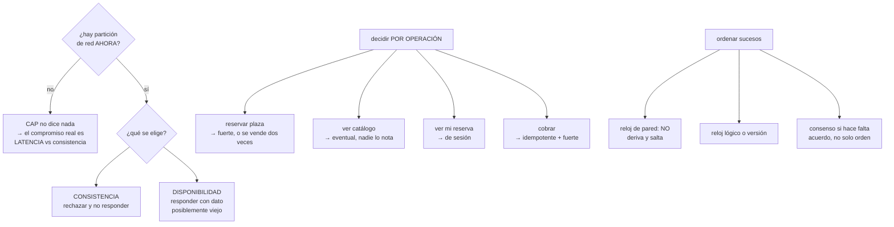

# 187 — Consistencia, particiones, relojes y consenso

> [← Clase anterior](../../part-15-systems-architecture-engineering/186-capacidad-latencia-throughput-y-teoria-de-colas/README.md) · [Índice de la parte](../README.md) · [Clase siguiente →](../../part-15-systems-architecture-engineering/188-contratos-de-api-eventos-y-compatibilidad-evolutiva/README.md)

**Parte:** 15 — Arquitectura de sistemas e ingeniería de requisitos<br>
**Nivel:** intermedio-avanzado · **Horas estimadas:** 4<br>
**Laboratorio:** `distributed` · **Estado:** `EXECUTABLE_CORE`

## 🎯 Propósito

Decidir qué se garantiza cuando hay varias copias del dato y la red puede partirse. La clase pone en su sitio el teorema CAP —que se cita mucho y se aplica mal—, explica por qué los relojes no sirven para ordenar sucesos, presenta el consenso como la herramienta cara que resuelve el acuerdo, y sostiene lo que este programa lleva demostrando desde la clase 149: **la consistencia se decide por operación, nunca para el sistema entero**.

## 📚 Resultados de aprendizaje

Al finalizar podrás:

1. **Enunciar** CAP correctamente y evitar los dos errores habituales al citarlo.
2. **Elegir** el modelo de consistencia por operación, con su justificación de negocio.
3. **Explicar** por qué los relojes de pared no ordenan sucesos distribuidos.
4. **Reconocer** cuándo hace falta consenso y cuánto cuesta.
5. **Diseñar** con consistencia eventual sin que el usuario vea incoherencias.

## 🧩 Conceptos centrales

| Concepto | Comprensión verificable |
|---|---|
| `CAP` | Bajo partición de red hay que elegir entre responder (disponibilidad) y garantizar la última escritura (consistencia). Solo aplica durante la partición. |
| `linealizabilidad` | Toda lectura ve la última escritura confirmada. La garantía más fuerte y la más cara. |
| `consistencia eventual` | Sin escrituras nuevas, todas las réplicas convergen. No dice cuándo. |
| `consistencia de sesión` | Un cliente ve sus propias escrituras y no retrocede en el tiempo. Suele ser lo que el usuario percibe como correcto. |
| `reloj lógico` | Contador que ordena sucesos por causalidad sin depender de la hora. |
| `consenso` | Acuerdo entre réplicas sobre un valor. Requiere mayoría y cuesta al menos un viaje de red. |

## 🧠 Modelo mental

Una arquitectura es un conjunto de decisiones sobre estructuras, interfaces y atributos de calidad, respaldadas por escenarios y evidencia.

Aplicado a esta clase, separa siempre cuatro planos: **intención** (qué necesita el usuario),
**configuración** (qué declaramos), **estado observado** (qué existe de verdad) y
**evidencia** (cómo sabemos que cumple). Confundirlos produce diseños que se ven correctos
en un diagrama pero fallan al operar.

## 🗺️ Flujo de razonamiento



## 📖 Desarrollo

### 1. CAP, bien enunciado

El teorema se cita constantemente y casi siempre mal. Su enunciado correcto es estrecho:

```text
CUANDO LA RED SE PARTE y dos grupos de réplicas no pueden
hablarse, un sistema debe elegir entre
  responder a las peticiones (disponibilidad), aceptando que
    la respuesta pueda no reflejar la última escritura
  o garantizar la última escritura (consistencia), aceptando
    no responder
```

Y los dos errores habituales:

```text
ERROR 1   «elegimos AP» o «somos CP» como propiedad del sistema
  → la elección se hace por operación, y solo importa DURANTE
    la partición
  → el mismo sistema puede ser fuerte al reservar y eventual
    al listar

ERROR 2   creer que sin partición hay que elegir
  → sin partición se puede tener las dos
  → pero se paga en LATENCIA, que es el compromiso que
    importa el 99,99 % del tiempo
```

Y por eso la formulación práctica es PACELC, que sí describe el día a día:

```text
si hay Partición   →  elegir entre Availability y Consistency
Else (lo normal)   →  elegir entre Latency y Consistency

→ una escritura con confirmación en tres regiones es coherente
  y cuesta ~120 ms
→ la misma con confirmación local cuesta ~2 ms y puede perderse
```

Y la observación de este programa:

```text
casi ninguna discusión de CAP en un proyecto real trata de
particiones: trata de si se acepta pagar latencia
→ y disfrazarlo de CAP impide medir el compromiso
```

**El espectro de garantías**, de más fuerte a más débil:

```text
LINEALIZABLE           toda lectura ve la última escritura
  coste   mayoría en cada operación; latencia de la red

SERIALIZABLE           las transacciones equivalen a un orden
  coste   coordinación; conflictos y reintentos

DE SESIÓN              veo mis escrituras, no retrocedo
  coste   afinidad o testigo de versión; barato

MONÓTONA               nunca leo algo más viejo que lo ya leído
  coste   muy bajo

EVENTUAL               converge, sin plazo
  coste   el más bajo; y el que más sorprende al usuario
```

Y el punto que cambia diseños:

```text
la mayoría de los sistemas que «necesitan consistencia fuerte»
necesitan CONSISTENCIA DE SESIÓN
→ el usuario no compara su vista con la de otro usuario:
  compara con lo que él mismo acaba de hacer
```

### 2. Los relojes no ordenan nada

Ordenar sucesos por la hora de la máquina es una fuente inagotable de errores sutiles.

```text
PROBLEMAS DEL RELOJ DE PARED
  deriva entre máquinas: decenas de ms es normal
  saltos hacia atrás al sincronizar
  segundos intercalares y ajustes
  máquinas virtuales que se congelan y despiertan

CONSECUENCIAS
  «el último gana» elige al que tenía el reloj adelantado
  dos sucesos con la misma marca de tiempo
  un suceso posterior con marca anterior
  registros que parecen fuera de orden y no lo están
```

Y el fallo clásico, con la evidencia habitual:

```text
resolución de conflictos por marca de tiempo
  A escribe a las 10:00:00,120 (reloj adelantado 80 ms)
  B escribe a las 10:00:00,090 (reloj correcto), DESPUÉS
  → gana A, y la escritura real más reciente se pierde
  → en silencio                                       ley 13
```

**Lo que sí ordena:**

```text
RELOJ LÓGICO (Lamport)
  contador que se incrementa y se propaga
  → da orden causal: si A causó B, A < B
  → no distingue sucesos concurrentes

RELOJ VECTORIAL
  un contador por réplica
  → detecta la concurrencia: dice «estos dos son conflictivos»
  → coste: tamaño proporcional al número de réplicas

NÚMERO DE VERSIÓN POR ENTIDAD
  el más práctico; base de la escritura condicionada
  → «actualiza si la versión sigue siendo 7»       clase 149

RELOJ CON INCERTIDUMBRE ACOTADA
  el sistema conoce su error máximo y espera ese margen
  → lo usan bases distribuidas con hardware de tiempo
  → permite orden global pagando latencia
```

Y la regla práctica:

```text
no uses la hora para decidir quién gana
úsala para diagnosticar, y aun así con desconfianza
→ para decidir, usa versiones o consenso
```

### 3. Consenso: qué resuelve y qué cuesta

El consenso resuelve un problema concreto: **que varias réplicas acuerden un valor aunque algunas fallen**. No resuelve la latencia ni el particionado de datos.

```text
CÓMO FUNCIONA, en una frase
  una mayoría de réplicas debe confirmar antes de considerar
  un valor decidido

POR QUÉ MAYORÍA
  dos mayorías cualesquiera se solapan
  → imposible que dos grupos decidan cosas distintas

CONSECUENCIA DIRECTA
  con 3 réplicas se tolera 1 fallo
  con 5 réplicas se toleran 2
  con 2 réplicas se tolera 0    ← el error más común
```

Y el coste, que es lo que decide dónde se usa:

```text
cada decisión cuesta al menos un viaje a la mayoría
  misma zona          ~1 ms
  entre zonas         ~2-4 ms
  entre regiones      ~30-120 ms

→ por eso el consenso entre regiones se usa para METADATOS
  (quién es el líder, qué configuración está activa) y no
  para cada escritura de negocio
```

Y las cuatro cosas para las que realmente se usa:

```text
1. elegir líder (quién escribe)
2. acordar la configuración del grupo
3. registrar un orden total de operaciones (registro replicado)
4. bloqueos y arrendamientos distribuidos
```

Y una advertencia sobre los arrendamientos, que es donde más se falla:

```text
un arrendamiento con expiración NO garantiza exclusión mutua
si el titular se congela y despierta
→ hace falta un testigo monótono que el almacén compruebe
→ sin eso, dos procesos se creen líderes a la vez
```

**Cuándo NO hace falta consenso**, que es la mayoría de las veces:

```text
si la operación es idempotente y conmutativa
  → basta con entregar al menos una vez              clase 117
si el conflicto se puede detectar y resolver después
  → versiones y reconciliación
si hay un solo escritor por dato
  → no hay nada que acordar                            ley 21
```

Y esa última línea es la más importante de la clase:

```text
la mayoría de los problemas de consistencia se evitan
decidiendo bien QUIÉN ESCRIBE, no añadiendo coordinación
```

### 4. Consistencia eventual sin que se note

La consistencia eventual es barata y correcta para casi todo, y produce quejas solo cuando se implementa sin cuidar la percepción.

```text
LO QUE EL USUARIO NOTA
  hace un cambio y no lo ve            ← lo más grave
  ve un valor y luego uno más viejo    ← retroceso
  dos pantallas muestran cosas distintas a la vez
  un contador que baja

LO QUE EL USUARIO NO NOTA
  que su cambio tarde 200 ms en verse en OTRA sesión
  que un panel agregado vaya 5 s por detrás
  que un buscador tarde 30 s en indexar
```

Y las técnicas que resuelven cada caso:

```text
VER LO PROPIO                consistencia de sesión
  leer del primario tras escribir, durante N segundos
  o llevar un testigo de versión en la sesión

NO RETROCEDER               lectura monótona
  fijar la réplica por sesión, o exigir versión ≥ la última
  vista

ESCRITURA PROPIA VISIBLE YA  actualización optimista en cliente
  mostrar el resultado esperado y corregir si falla
  ojo   si falla a menudo, es peor que esperar

CONTADORES                  tipos que convergen (CRDT) o
  agregación con marca de «aproximado»

OPERACIONES CRÍTICAS        fuerte, y solo esas
```

Y una regla de diseño que evita la mitad de los problemas:

```text
no mezcles en la misma pantalla datos con garantías distintas
sin decirlo
→ «disponibilidad actualizada hace 12 s» es honesto y suficiente
→ mostrar un dato viejo como si fuera actual no lo es
```

Y la lista de comprobación de la clase:

```text
☐ cada operación tiene su nivel de consistencia decidido
☐ el nivel está justificado por consecuencia de negocio
☐ no se cita CAP fuera de una partición real
☐ el compromiso normal (latencia vs consistencia) está medido
☐ ningún conflicto se resuelve por marca de tiempo
☐ hay versión por entidad y escritura condicionada
☐ el consenso se usa para metadatos, no para cada escritura
☐ ningún grupo de consenso tiene 2 miembros
☐ los arrendamientos usan testigo monótono
☐ el usuario ve siempre sus propias escrituras
☐ ninguna lectura retrocede dentro de una sesión
☐ los datos aproximados se muestran marcados como tales
```

Y el cierre que enlaza con la clase siguiente: decidir la consistencia de una operación obliga a escribir qué promete cada interfaz y qué pasa cuando cambia. Convertir eso en contratos que puedan evolucionar sin romper a nadie es la materia de la clase 188.

## 🔬 Ejemplo trabajado

**El equipo de reservas decide la consistencia de sus once operaciones. Lo que sigue es la tabla de decisiones, los dos errores que había en el sistema anterior —uno de ellos vendía plazas dos veces— y lo que costó cada garantía.**

**El problema que disparó la revisión:**

```text
en campaña, 14 reservas duplicadas sobre la misma plaza en
3 días

causa investigada
  la comprobación de disponibilidad leía de una réplica de
  lectura con retraso de 200-900 ms
  dos peticiones simultáneas veían la misma plaza libre
  ambas escribían
  → la restricción de unicidad no existía porque el inventario
    se guardaba como un contador, no como plazas
```

Y el segundo error, más sutil:

```text
las modificaciones de reserva se resolvían por marca de tiempo
  «gana la escritura más reciente»
  → dos servidores con 140 ms de deriva
  → 6 casos en el año en que una cancelación se perdía porque
    una modificación anterior tenía marca posterior
  → nadie lo detectó; se atribuyó a error del agente  ley 13
```

**La tabla de decisiones, operación por operación.**

```text
operación                    garantía        por qué
────────────────────────────────────────────────────────────
1  reservar plaza            LINEALIZABLE    vender dos veces
                                             cuesta dinero y
                                             reputación
2  cobrar                    fuerte +        el cobro doble es
                             idempotente     inaceptable
3  cancelar                  fuerte          libera inventario
4  modificar reserva         fuerte con      dos agentes editan
                             versión         a la vez
5  ver mi reserva            DE SESIÓN       el usuario debe ver
                                             lo que acaba de
                                             hacer
6  listar mis reservas       DE SESIÓN       lo mismo
7  buscar disponibilidad     EVENTUAL        200 ms de retraso
                             ≤ 2 s           es aceptable; se
                                             confirma al reservar
8  ver catálogo              EVENTUAL        cambia 1 vez/mes
9  ver precio                EVENTUAL        con validez de
                             ≤ 10 min        10 min          clase 185
10 panel de ocupación        EVENTUAL        marcado «hace N s»
                             ≤ 30 s
11 informe de negocio        EVENTUAL        diario
                             ≤ 24 h
```

Y la lectura de la tabla:

```text
de 11 operaciones, 4 necesitan garantía fuerte
y esas 4 son el 3 % del tráfico
→ pagar consistencia fuerte para todo habría costado
  latencia en el 97 % restante sin ninguna ventaja
```

**Cómo se implementó cada garantía, y qué costó.**

```text
1  RESERVAR PLAZA — linealizable
   antes    contador de plazas + lectura de réplica
   después  fila por plaza con clave única
            (hotel, tipo, fecha, nº de plaza)
            escritura condicionada: INSERT que falla si existe
            lectura desde el primario en el momento de reservar
   coste    +14 ms de p50 en el paso de confirmación
   efecto   duplicados imposibles por construcción, no por
            comprobación previa
   nota     esta es la corrección que importa: se pasó de
            «comprobar y luego escribir» a «escribir con
            restricción»                                clase 149

2  COBRAR — idempotente
   clave de idempotencia = id de reserva + intento
   la pasarela devuelve el mismo resultado si se repite
   coste    0; ya estaba, pero sin usarse en los reintentos

4  MODIFICAR — versión, no reloj
   antes    resolución por marca de tiempo
   después  cada reserva tiene versión; la escritura envía la
            versión leída y falla si cambió
            el cliente reintenta con el estado nuevo
   coste    0 € y 4 días de trabajo
   efecto   los 6 casos anuales de cancelación perdida
            desaparecen; ahora dan conflicto visible

5-6  VER LO MÍO — sesión
   tras escribir, la sesión lleva un testigo de versión
   las lecturas exigen réplica con versión ≥ testigo
   si ninguna réplica la tiene, lee del primario
   coste    ~4 % de las lecturas van al primario

7  BUSCAR — eventual con límite declarado
   retraso máximo aceptado                     2 s
   alerta si el retraso de réplica supera      5 s     ley 13
   y en la respuesta se indica la hora del dato

9  PRECIO — eventual con validez
   caché de 10 min; si precios no responde, último válido
   → esto es lo que lo convirtió en dependencia blanda  clase 185

10 PANEL — eventual, marcado
   la pantalla dice «ocupación a fecha de hace 18 s»
   → las quejas de «el panel está mal» cayeron a cero sin
     cambiar ni un dato
```

**Dónde se usó consenso, y dónde no.**

```text
SÍ
  elección de primario de la base de reservas   gestionado
  arrendamiento del trabajo de reconciliación   3 réplicas
    con testigo monótono comprobado por el almacén

NO
  en ninguna escritura de negocio
  → porque hay un solo escritor por dato, y con eso no hay
    nada que acordar                                    ley 21
```

Y un error que se corrigió al revisar:

```text
el arrendamiento del reconciliador estaba con 2 réplicas
  tolerancia a fallos = 0
  y sin testigo monótono
→ una pausa larga del recolector de basura hizo que dos
  procesos se creyeran titulares en enero
→ se corrigió a 3 réplicas y testigo comprobado en el almacén
```

**El compromiso normal, medido**, que es lo que CAP no describe:

```text
confirmación de escritura de reserva
  local en la zona                        2,1 ms   pérdida posible
  mayoría multizona                       4,8 ms   sin pérdida zonal
  mayoría multirregión                   118 ms    sin pérdida regional

decisión   mayoría multizona
motivo     el objetivo de pérdida es de 1 minuto, no de cero;
           118 ms en cada reserva no compensa       clase 166
```

**El resultado, tres meses después:**

```text                                     antes      después
reservas duplicadas por campaña             14           0
cancelaciones perdidas al año                6           0
p50 del paso de confirmación             31 ms       45 ms
p50 de la búsqueda                       58 ms       58 ms
lecturas servidas por el primario           100 %       4 %
quejas por «el panel está mal»            9/mes         0
```

**La lección que esta clase deja**: de once operaciones solo cuatro necesitaban garantía fuerte, y **la corrección que eliminó las reservas duplicadas no fue elegir un nivel de consistencia: fue dejar de guardar el inventario como un contador**. Y de las dos quejas más ruidosas, una se resolvió escribiendo en la pantalla la antigüedad del dato.

## 🧪 Laboratorio guiado

Ejecuta desde la raíz:

```bash
python classes/part-15-systems-architecture-engineering/187-consistencia-particiones-relojes-y-consenso/lab.py
```

El laboratorio selecciona el motor de práctica **`distributed`** y produce
`lab_result.json`. El escenario, sus comprobaciones y el artefacto esperado corresponden a
esta clase; no requiere credenciales y deja explícito qué debe revalidarse en un sandbox real.

1. Lee `exercise.steps` y formula una predicción antes de ejecutar.
2. Ejecuta la práctica y verifica todos los elementos de `checks`.
3. Provoca el caso de `negative_test` y explica la señal observada.
4. Materializa `consistency-model` en `evidence/` usando la plantilla indicada.
5. Para proveedor real, sigue `sandbox.requires`, registra costo y ejecuta `destroy`.

### Evidencia esperada

El artefacto principal es una traza de consistencia, reintento o fallo parcial. Además, la entrega debe incluir el comando ejecutado,
la salida estructurada y una conclusión que no exceda lo observado.

## 🏆 Reto verificable

Construye **`consistency-model`** para el caso CloudShop. Incluye una alternativa descartada,
un supuesto que pueda falsarse, una prueba de fallo y una decisión de rollback.

## ✅ Criterio de aceptación

- [ ] `lab.py` termina con código 0 y genera JSON válido.
- [ ] La entrega conecta al menos tres requisitos con mecanismos verificables.
- [ ] Existe una prueba positiva y una prueba negativa con evidencia.
- [ ] Seguridad, costo y operación aparecen como decisiones, no como anexos.
- [ ] Se declara una limitación y una condición que obligaría a revisar el diseño.
- [ ] Otra persona puede repetir el recorrido sin conocimiento tácito.

## ⚠️ Errores frecuentes

| Síntoma | Causa probable | Corrección |
|---|---|---|
| Se venden dos veces los mismos recursos pese a comprobar disponibilidad antes | Comprobar y luego escribir no es atómico, y la lectura venía de una réplica retrasada | Modela el recurso como fila única y usa escritura condicionada que falle; no compruebes antes, deja que la restricción decida. |
| Se pierden actualizaciones sin que nadie lo note | Los conflictos se resuelven por marca de tiempo y los relojes derivan | Usa versión por entidad y escritura condicionada; reserva los relojes para diagnóstico. |
| El usuario hace un cambio y no lo ve | Se lee de una réplica sin consistencia de sesión | Lleva un testigo de versión en la sesión y exige una réplica al menos tan reciente, o lee del primario durante unos segundos. |
| Cada discusión de arquitectura acaba citando CAP sin llegar a nada | Se aplica CAP fuera de una partición, donde el compromiso real es latencia contra consistencia | Mide el coste en milisegundos de cada nivel de confirmación y decide por operación. |
| Dos procesos se creen titulares del mismo trabajo | Arrendamiento con expiración sin testigo monótono, o grupo de dos réplicas | Usa un número de mandato monótono que el almacén compruebe, y grupos de consenso impares de al menos tres. |
| Los usuarios se quejan de que un panel «está mal» | Se muestra un dato eventual como si fuera actual | Indica la antigüedad del dato en la propia pantalla y declara el retraso máximo aceptado, con alerta si se supera. |

## 🛡️ Seguridad, ética y costo

Trabaja con cuentas propias o sandboxes autorizados. No publiques secretos, identificadores
reales ni datos personales. Antes de crear recursos pagos define presupuesto, etiquetas y
comando de destrucción; después verifica que no queden recursos huérfanos. Los ejemplos
locales enseñan contratos, pero no certifican cumplimiento ni disponibilidad de producción.

## ❓ Preguntas de comprobación

1. ¿Cuáles son los dos errores habituales al citar CAP?
2. ¿Qué describe PACELC que CAP no describe?
3. ¿Por qué no se debe resolver un conflicto por marca de tiempo?
4. ¿Cuántos fallos tolera un grupo de consenso de dos réplicas?
5. ¿Qué garantía suele bastar cuando alguien pide «consistencia fuerte»?

## 🔗 Referencias

- Gilbert, S. y Lynch, N. (2002). *Brewer's conjecture and the feasibility of consistent, available, partition-tolerant web services*. <https://dl.acm.org/doi/10.1145/564585.564601>
- Abadi, D. (2012). *Consistency tradeoffs in modern distributed database system design (PACELC)*. <https://ieeexplore.ieee.org/document/6127847>
- Lamport, L. (1978). *Time, clocks, and the ordering of events in a distributed system*. <https://dl.acm.org/doi/10.1145/359545.359563>
- Ongaro, D. y Ousterhout, J. (2014). *In search of an understandable consensus algorithm (Raft)*. <https://raft.github.io/raft.pdf>
- Kleppmann, M. (2017). *Designing Data-Intensive Applications*, caps. 5 y 9 — replicación, consistencia y consenso. <https://dataintensive.net/>
- Documentación oficial vigente del servicio implementado; registra URL y fecha de consulta.

---

> [Evaluación](assessment.md) · [Contrato de clase](lesson.yaml) · [Índice de la parte](../README.md)
