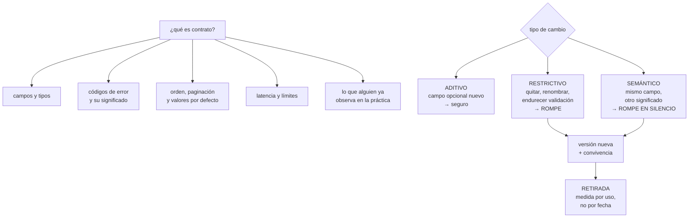

# 188 — Contratos de API, eventos y compatibilidad evolutiva

> [← 187 · Consistencia, particiones, relojes y consenso](../../part-15-systems-architecture-engineering/187-consistencia-particiones-relojes-y-consenso/README.md) · [Índice de la parte](../README.md) · [189 · Modelado de amenazas y arquitectura de confianza cero →](../../part-15-systems-architecture-engineering/189-modelado-de-amenazas-y-arquitectura-de-confianza-cero/README.md)

**Parte:** 15 — Arquitectura de sistemas e ingeniería de requisitos<br>
**Nivel:** intermedio-avanzado · **Horas estimadas:** 4<br>
**Laboratorio:** `api` · **Estado:** `EXECUTABLE_CORE`

## 🎯 Propósito

Escribir contratos —de API y de eventos— que puedan cambiar durante años sin romper a nadie. La clase define qué forma parte del contrato y qué no (que es donde nacen casi todas las roturas), da las reglas de compatibilidad hacia atrás y hacia delante, explica por qué la versión en la ruta se usa mal y qué hacer en su lugar, y trata la retirada de una versión como un proceso con datos y no como un aviso por correo.

## 📚 Resultados de aprendizaje

Al finalizar podrás:

1. **Delimitar** qué forma parte del contrato y qué es detalle interno.
2. **Aplicar** las reglas de compatibilidad hacia atrás y hacia delante.
3. **Versionar** sin multiplicar el mantenimiento.
4. **Evolucionar** esquemas de eventos con productores y consumidores independientes.
5. **Retirar** una versión con datos de uso y no con un aviso.

## 🧩 Conceptos centrales

| Concepto | Comprensión verificable |
|---|---|
| `contrato` | Todo aquello de lo que un consumidor puede depender legítimamente. Incluye más de lo que suele documentarse. |
| `compatibilidad hacia atrás` | Un consumidor antiguo sigue funcionando con un productor nuevo. |
| `compatibilidad hacia delante` | Un consumidor nuevo funciona con datos producidos por una versión antigua. |
| `cambio aditivo` | Añadir algo opcional. Es el único tipo de cambio seguro por defecto. |
| `ley de Hyrum` | Con suficientes usuarios, todo comportamiento observable acaba siendo del que alguien depende. |
| `retirada` | Proceso de sacar de servicio una versión, guiado por uso medido y no por fechas anunciadas. |

## 🧠 Modelo mental

Una arquitectura es un conjunto de decisiones sobre estructuras, interfaces y atributos de calidad, respaldadas por escenarios y evidencia.

Aplicado a esta clase, separa siempre cuatro planos: **intención** (qué necesita el usuario),
**configuración** (qué declaramos), **estado observado** (qué existe de verdad) y
**evidencia** (cómo sabemos que cumple). Confundirlos produce diseños que se ven correctos
en un diagrama pero fallan al operar.

## 🗺️ Flujo de razonamiento



## 📖 Desarrollo

### 1. Qué es contrato y qué no

Casi todas las roturas vienen de creer que el contrato es solo el esquema. El contrato es **aquello de lo que alguien puede depender**, y eso es más amplio:

```text
EVIDENTEMENTE CONTRATO
  nombres de campos, tipos, obligatoriedad
  rutas, métodos, códigos de estado
  significado de cada código de error

CONTRATO Y CASI NUNCA DOCUMENTADO
  el ORDEN de los resultados sin ordenación explícita
  el tamaño de página por defecto
  qué campos vienen ausentes y cuáles nulos
  el formato exacto de un identificador
  la precisión de un decimal
  que dos llamadas seguidas devuelvan lo mismo
  la latencia habitual
  los límites de ritmo
  el mensaje de texto de un error, si alguien lo compara
```

Y la ley que gobierna esto, con el nombre que se le suele dar:

```text
LEY DE HYRUM
  con suficientes usuarios de una interfaz, no importa lo que
  prometa el contrato: cualquier comportamiento observable
  acabará teniendo alguien que dependa de él

→ y por eso los cambios «internos» rompen clientes
```

Y la consecuencia práctica, que es una decisión de diseño:

```text
reduce lo observable
  no devuelvas campos que no forman parte del contrato
  ordena explícitamente o aleatoriza a propósito
  no expongas identificadores con estructura adivinable
  declara qué NO es contrato, por escrito
```

Y una técnica que funciona muy bien y se usa poco:

```text
rompe a propósito lo que no es contrato, pronto y a menudo
  → variar el orden cuando no se pide ordenación
  → variar el relleno de un identificador opaco
→ así nadie llega a depender de ello                clase 172
```

### 2. Reglas de compatibilidad

Hay tres tipos de cambio, y solo uno es seguro.

```text
ADITIVO — seguro
  añadir un campo OPCIONAL a una respuesta
  añadir un parámetro opcional con valor por defecto
  añadir un valor nuevo a un enumerado ← ojo, ver abajo
  añadir un endpoint nuevo

RESTRICTIVO — rompe, y se nota
  quitar o renombrar un campo
  hacer obligatorio algo opcional
  endurecer una validación
  cambiar un tipo
  cambiar un código de estado

SEMÁNTICO — rompe EN SILENCIO, y es el peor
  el campo «precio» pasa de incluir impuestos a no incluirlos
  «estado: activo» cambia de significado
  la fecha pasa de local a UTC
  → el consumidor no falla: hace algo incorrecto
```

Y el tercero merece su propia regla:

```text
si cambia el SIGNIFICADO, cambia el NOMBRE
  precio → precio_con_impuestos / precio_sin_impuestos
→ un campo con significado nuevo y nombre viejo es una trampa
```

**Los enumerados**, que rompen más de lo que parece:

```text
añadir un valor nuevo es aditivo para el productor
y RESTRICTIVO para el consumidor que hace un switch exhaustivo

regla   los consumidores deben tolerar valores desconocidos
        desde el primer día, y el contrato debe decirlo
```

**Las dos direcciones**, que hacen falta cuando productor y consumidor se despliegan por separado:

```text
HACIA ATRÁS   consumidor viejo + productor nuevo
  → necesaria siempre que el productor despliegue primero

HACIA DELANTE consumidor nuevo + datos viejos
  → necesaria siempre que el consumidor despliegue primero
  → y en eventos, SIEMPRE, porque hay datos históricos

y como no se controla el orden, hacen falta las dos
```

Y el patrón que resuelve los cambios restrictivos sin versión nueva:

```text
EXPANDIR Y CONTRAER, en tres despliegues
  1  añadir lo nuevo, manteniendo lo viejo; escribir en ambos
  2  migrar consumidores a lo nuevo, y MEDIR que nadie usa
     lo viejo
  3  retirar lo viejo

→ funciona para campos, tablas, colas y endpoints
→ y el paso 2 es el que se salta y el que da los sustos
```

### 3. Versionar sin multiplicar el trabajo

La versión en la ruta —`/v1/`, `/v2/`— es lo más usado y suele aplicarse mal:

```text
EL ERROR
  v2 se crea como copia de v1 y se mantienen las dos enteras
  → dos bases de código, dos conjuntos de pruebas, dos alertas
  → y v1 no se retira nunca                            ley 23

LO QUE SUELE FUNCIONAR MEJOR
  una sola implementación, con una capa de traducción fina
  para las versiones antiguas
  → la lógica vive una vez; la versión solo transforma
```

Y los mecanismos, con su uso adecuado:

```text
VERSIÓN EN LA RUTA        cambios grandes y poco frecuentes
  fácil de enrutar y de medir; visible en los registros

VERSIÓN POR CABECERA      evolución continua
  menos visible; exige disciplina de medida

SIN VERSIÓN, SOLO ADITIVO cuando se puede sostener
  el mejor de todos si la disciplina aguanta

SELECCIÓN DE CAMPOS       el consumidor pide lo que quiere
  reduce el acoplamiento; complica el caché
```

Y la regla de cuántas versiones mantener:

```text
dos, como máximo, salvo obligación contractual
→ y con una fecha de retirada de la antigua ya fijada al
  publicar la nueva
```

**En eventos**, el problema es distinto porque los datos persisten:

```text
los mensajes antiguos siguen existiendo en el registro
y se reprocesan meses después                        clase 116

→ hace falta compatibilidad hacia delante SIEMPRE
→ y un registro de esquemas que valide en el PRODUCTOR,
  no en el consumidor                                clase 148

reglas mínimas para un esquema de evento
  todo campo nuevo, opcional y con valor por defecto
  nunca reutilizar un nombre de campo retirado
  nunca cambiar el tipo de un campo
  el identificador del suceso y su clave, inmutables
  la versión del esquema, en el propio mensaje
```

Y una decisión de diseño de eventos que evita la mitad de los cambios:

```text
publica HECHOS, no órdenes ni estado completo
  «reserva_confirmada» con su identificador y sus datos propios
  no «actualiza el panel de ocupación»
→ un hecho no cambia; la interpretación sí, y esa es del
  consumidor                                          clase 148
```

### 4. Retirar de verdad

Anunciar una retirada no retira nada. Este programa ha visto varias veces la misma escena: la versión antigua sigue viva años después del aviso.

**Lo que no funciona:**

```text
el correo a «todos los equipos»
la nota en la documentación
la fecha en el registro de cambios
→ nadie lee nada de eso hasta que se rompe
```

**Lo que funciona, en orden:**

```text
1. MEDIR QUIÉN LA USA
   por consumidor identificado, no solo volumen total
   → sin identidad por consumidor, no hay retirada posible

2. CONTACTAR A LOS QUE QUEDAN, con su nombre
   y saber por qué no han migrado
   → a veces la razón es que lo nuevo no cubre su caso

3. DEGRADAR PROGRESIVAMENTE
   añadir latencia artificial creciente
   devolver una cabecera de aviso
   apagar durante ventanas cortas y anunciadas
   → los «apagados de ensayo» encuentran a los que no responden
     al correo

4. APAGAR, con vuelta atrás preparada

5. BORRAR EL CÓDIGO
   → sin esto, sigue costando mantenimiento           ley 23
```

Y el dato que decide cuándo se puede apagar:

```text
no «pasó la fecha»
sino «el uso es cero durante N días, y los consumidores
identificados han confirmado»
```

Y una advertencia sobre el paso 1:

```text
si las llamadas llegan sin identidad de consumidor, no se
puede saber a quién romper
→ exigir identidad por consumidor desde el primer día es
  lo que hace posible retirar después
```

**Las pruebas de contrato**, que son lo que impide romper sin querer:

```text
el consumidor declara qué espera
el productor ejecuta esas expectativas en su canalización
→ si un cambio del productor rompe a un consumidor, falla
  la canalización del productor, no la producción
→ y el catálogo de consumidores deja de ser una suposición
```

Y la lista de comprobación de la clase:

```text
☐ está escrito qué NO forma parte del contrato
☐ no se devuelven campos que no son contrato
☐ el orden es explícito o deliberadamente variable
☐ todo cambio está clasificado: aditivo, restrictivo, semántico
☐ ningún campo cambia de significado conservando el nombre
☐ los consumidores toleran valores de enumerado desconocidos
☐ los cambios restrictivos usan expandir y contraer
☐ el paso intermedio se cierra midiendo uso, no suponiendo
☐ los eventos son hechos y su esquema solo crece
☐ hay registro de esquemas validando en el productor
☐ cada llamada trae identidad de consumidor
☐ hay pruebas de contrato en la canalización del productor
☐ cada versión publicada nace con fecha de retirada
☐ la retirada se decide por uso medido y termina borrando código
```

Y el cierre que enlaza con la clase siguiente: un contrato define qué se promete a quien llama, pero no dice quién puede llamar ni qué pasa si el que llama no es quien dice ser. Modelar eso —amenazas y confianza— es la materia de la clase 189.

## 🔬 Ejemplo trabajado

**La plataforma de reservas tiene una API v1 usada por la app móvil, tres socios y un sistema interno. Lo que sigue es la evolución de un año: dos cambios semánticos que rompieron en silencio, la migración de un campo con expandir y contraer, y la retirada de v1 que llevaba tres años anunciada.**

**Punto de partida:**

```text
api-v1    publicada en 2021, «a retirar» desde 2023
api-v2    publicada en 2023
consumidores identificados                    ninguno
→ las llamadas llegaban sin cabecera de consumidor
→ por tanto, imposible saber a quién se rompía
```

**Primer incidente: cambio semántico, marzo.**

```text
cambio    el campo «precio» pasó a incluir impuestos
motivo    unificar con la web, que ya los incluía
revisión  aprobada; se consideró «no rompe, mismo tipo»

consecuencia
  un socio facturó 3 semanas con precios un 21 % más altos
  no hubo ningún error: el sistema funcionaba
  se detectó por una reclamación del socio
  coste    4.100 € de abonos y una relación tocada

qué lo habría evitado
  regla: si cambia el significado, cambia el nombre
  → precio_sin_impuestos + precio_con_impuestos, y retirar
    «precio» con expandir y contraer
```

**Segundo incidente: contrato no escrito, mayo.**

```text
cambio    se sustituyó la consulta de listado y el resultado
          dejó de venir ordenado por fecha
motivo    optimización; la consulta no pedía ordenación

consecuencia
  la app móvil mostraba las reservas desordenadas
  la app NUNCA había pedido ordenación: dependía del orden
  accidental de la base                                Hyrum
  1 versión de app rota; 9 días hasta la corrección en tiendas

decisión posterior
  todos los listados ordenan explícitamente y lo declaran
  y en los entornos de prueba, el orden se ALEATORIZA a
  propósito cuando no se pide
```

**La migración del campo «precio», hecha bien:**

```text
despliegue 1   se añaden precio_sin_impuestos y
               precio_con_impuestos; «precio» se mantiene
               con su significado ORIGINAL
               y se marca como en retirada en la respuesta

medida         se instrumenta qué consumidores leen «precio»
               → requiere identidad por consumidor  ← ver abajo

despliegue 2   migran los consumidores
               app móvil       semana 3
               socio A         semana 5
               socio B         semana 6
               socio C         semana 14   ← el que faltaba
               interno         semana 4

cierre         14 días con 0 lecturas de «precio»

despliegue 3   «precio» retirado de la respuesta
tiempo total   18 semanas
```

**Identidad por consumidor: el cambio que hizo posible todo lo demás.**

```text
antes   las llamadas llegaban con un testigo, sin identificar
        la aplicación cliente
después cada consumidor tiene su propia credencial y una
        cabecera obligatoria de identificación

qué reveló el primer mes
  consumidores esperados                              5
  consumidores reales                                11

  los 6 no esperados
    un panel interno de finanzas creado en 2022
    dos scripts de analítica de marketing
    un servicio de un socio que se creía retirado
    la herramienta de pruebas de un proveedor externo
    un trabajo programado del propio equipo

→ y dos de ellos usaban v1                            ley 20
```

**La retirada de v1, tres años después del aviso.**

```text
situación al empezar
  peticiones/día a v1                             41.000
  anuncios de retirada enviados desde 2023             7
  efecto de esos anuncios                       ninguno

PASO 1 · medir por consumidor
  app móvil, versiones < 4.2                      38.100/día
  socio C                                          2.700/día
  panel de finanzas                                  190/día
  script de analítica                                 10/día

PASO 2 · contactar con nombre
  app: el 6 % de instalaciones seguía en < 4.2, y no se
       actualiza sola en dispositivos antiguos
  socio C: no había migrado porque v2 no devolvía un campo
       que necesitaba          ← razón legítima, y desconocida
  finanzas: no sabían que existía ese panel
  analítica: script de una persona que ya no está     ley 20

PASO 3 · degradar progresivamente
  semana 1   cabecera de aviso y registro por consumidor
  semana 3   +200 ms de latencia artificial
  semana 5   +800 ms
  semana 7   apagado de ensayo de 15 min, anunciado
             → aparecieron 2 consumidores más que nadie
               había detectado
  semana 9   apagado de 2 h
             → el panel de finanzas se quejó; ahí se supo
               quién lo mantenía

PASO 4 · apagar
  semana 14, con vuelta atrás preparada y sin usarla
  uso residual en el momento del apagado          0,3 %
  → clientes de app muy antiguos, con mensaje de
    actualización obligatoria

PASO 5 · borrar el código
  semana 16
  líneas eliminadas                             11.400
  pruebas eliminadas                               340
  alertas retiradas                                  9
  ahorro de mantenimiento estimado     1,4 días/mes
```

Y los dos hallazgos del proceso:

```text
el apagado de ensayo de 15 minutos encontró en una tarde
dos consumidores que siete correos en tres años no habían
encontrado                                            ley 22

y la razón real por la que el socio C no migraba no era
desidia: v2 no cubría su caso. Nadie lo había preguntado
```

**Las pruebas de contrato que se montaron después:**

```text
cada consumidor declara sus expectativas
  app móvil        14 expectativas
  socio A           6
  socio B           9
  socio C           7
  interno          11

se ejecutan en la canalización del PRODUCTOR
resultado en los 6 meses siguientes
  cambios bloqueados antes de salir                    5
  de ellos, cambios semánticos                         2
  incidentes de contrato en producción                 0
```

**La lección que esta clase deja**: los dos incidentes del año no fueron por cambios que rompieran nada visible —el sistema respondió 200 en los dos casos— sino por **un significado que cambió conservando el nombre y por un orden del que alguien dependía sin que estuviera en el contrato**. Y la retirada de v1 no avanzó en tres años de anuncios y se resolvió en catorce semanas en cuanto hubo **identidad por consumidor y un apagado de quince minutos**.

## 🧪 Laboratorio guiado

Ejecuta desde la raíz:

```bash
python classes/part-15-systems-architecture-engineering/188-contratos-de-api-eventos-y-compatibilidad-evolutiva/lab.py
```

El laboratorio selecciona el motor de práctica **`api`** y produce
`lab_result.json`. El escenario, sus comprobaciones y el artefacto esperado corresponden a
esta clase; no requiere credenciales y deja explícito qué debe revalidarse en un sandbox real.

1. Lee `exercise.steps` y formula una predicción antes de ejecutar.
2. Ejecuta la práctica y verifica todos los elementos de `checks`.
3. Provoca el caso de `negative_test` y explica la señal observada.
4. Materializa `contract-evolution` en `evidence/` usando la plantilla indicada.
5. Para proveedor real, sigue `sandbox.requires`, registra costo y ejecuta `destroy`.

### Evidencia esperada

El artefacto principal es un contrato versionado con pruebas positivas y negativas. Además, la entrega debe incluir el comando ejecutado,
la salida estructurada y una conclusión que no exceda lo observado.

## 🏆 Reto verificable

Construye **`contract-evolution`** para el caso CloudShop. Incluye una alternativa descartada,
un supuesto que pueda falsarse, una prueba de fallo y una decisión de rollback.

## ✅ Criterio de aceptación

- [ ] `lab.py` termina con código 0 y genera JSON válido.
- [ ] La entrega conecta al menos tres requisitos con mecanismos verificables.
- [ ] Existe una prueba positiva y una prueba negativa con evidencia.
- [ ] Seguridad, costo y operación aparecen como decisiones, no como anexos.
- [ ] Se declara una limitación y una condición que obligaría a revisar el diseño.
- [ ] Otra persona puede repetir el recorrido sin conocimiento tácito.

## ⚠️ Errores frecuentes

| Síntoma | Causa probable | Corrección |
|---|---|---|
| Un consumidor empieza a calcular mal sin que aparezca ningún error | Cambio semántico: el campo mantuvo el nombre y cambió el significado | Si cambia el significado, cambia el nombre; retira el antiguo con expandir y contraer. |
| Un cambio interno inofensivo rompe a un cliente | El cliente dependía de un comportamiento observable que no estaba en el contrato | Declara qué no es contrato, no devuelvas lo que no prometes y varía a propósito lo accidental para que nadie dependa de ello. |
| Un consumidor falla al recibir un valor de enumerado nuevo | El consumidor hacía un tratamiento exhaustivo de los valores conocidos | Exige en el contrato que los valores desconocidos se toleren, desde la primera versión. |
| Hay que mantener v1 y v2 completas y nadie retira nada | La versión nueva se creó copiando la implementación | Una sola implementación con capa de traducción para lo antiguo, máximo dos versiones y fecha de retirada al publicar. |
| El reproceso de mensajes antiguos falla con el consumidor nuevo | Falta compatibilidad hacia delante en el esquema de eventos | Campos nuevos siempre opcionales con valor por defecto, sin reutilizar nombres ni cambiar tipos, y validación en el productor. |
| Una versión lleva años anunciada como retirada y sigue viva | Se avisó por correo y no se midió el uso por consumidor | Exige identidad por consumidor, degrada progresivamente, haz apagados de ensayo y apaga cuando el uso sea cero; después borra el código. |

## 🛡️ Seguridad, ética y costo

Trabaja con cuentas propias o sandboxes autorizados. No publiques secretos, identificadores
reales ni datos personales. Antes de crear recursos pagos define presupuesto, etiquetas y
comando de destrucción; después verifica que no queden recursos huérfanos. Los ejemplos
locales enseñan contratos, pero no certifican cumplimiento ni disponibilidad de producción.

## ❓ Preguntas de comprobación

1. ¿Qué dice la ley de Hyrum y qué decisión de diseño se deriva de ella?
2. ¿Por qué el cambio semántico es peor que el restrictivo?
3. ¿En qué consisten los tres pasos de expandir y contraer, y cuál se salta siempre?
4. ¿Por qué los esquemas de eventos necesitan compatibilidad hacia delante siempre?
5. ¿Qué hace falta antes de poder retirar una versión de verdad?

## 🔗 Referencias

- Wright, H. (2017). *Hyrum's Law*. <https://www.hyrumslaw.com/>
- Confluent (2025). *Schema evolution and compatibility* — reglas hacia atrás y hacia delante en eventos. <https://docs.confluent.io/platform/current/schema-registry/fundamentals/schema-evolution.html>
- Pact (2025). *Consumer-driven contract testing*. <https://docs.pact.io/>
- Google (2025). *API Improvement Proposals: versioning and compatibility*. <https://google.aip.dev/180>
- Ambler, S. y Sadalage, P. (2006). *Refactoring Databases* — expandir y contraer aplicado a esquemas. <https://www.oreilly.com/library/view/refactoring-databases-evolutionary/0321293533/>
- Documentación oficial vigente del servicio implementado; registra URL y fecha de consulta.

---

> [Evaluación](assessment.md) · [Contrato de clase](lesson.yaml) · [Índice de la parte](../README.md)

| Anterior | Índice | Siguiente |
|---|---|---|
| [← 187 · Consistencia, particiones, relojes y consenso](../../part-15-systems-architecture-engineering/187-consistencia-particiones-relojes-y-consenso/README.md) | [Parte 15](../README.md) · [Programa](../../README.md) | [189 · Modelado de amenazas y arquitectura de confianza cero →](../../part-15-systems-architecture-engineering/189-modelado-de-amenazas-y-arquitectura-de-confianza-cero/README.md) |
