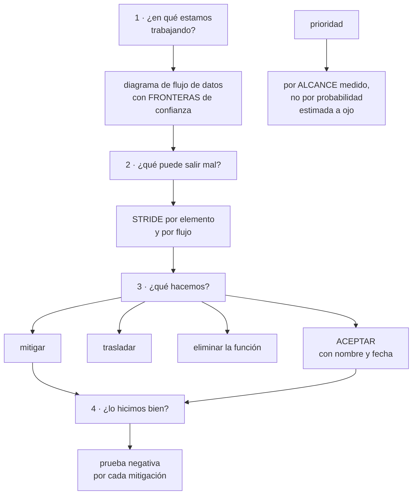
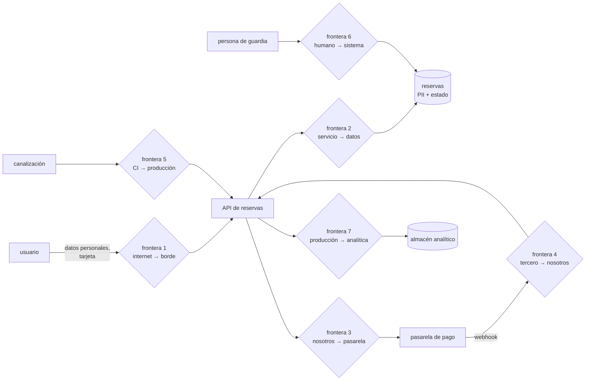

# 189 — Modelado de amenazas y arquitectura de confianza cero

> [← Clase anterior](../../part-15-systems-architecture-engineering/188-contratos-de-api-eventos-y-compatibilidad-evolutiva/README.md) · [Índice de la parte](../README.md) · [Clase siguiente →](../../part-15-systems-architecture-engineering/190-adrs-fitness-functions-y-gobierno-de-decisiones/README.md)

**Parte:** 15 — Arquitectura de sistemas e ingeniería de requisitos<br>
**Nivel:** intermedio-avanzado · **Horas estimadas:** 4<br>
**Laboratorio:** `security` · **Estado:** `EXECUTABLE_CORE`

## 🎯 Propósito

Modelar amenazas de forma que produzca decisiones y no un documento, y traducir «confianza cero» de eslogan a arquitectura concreta. La clase da el método de modelado en cuatro preguntas, la clasificación que evita olvidar categorías enteras, y la parte que casi siempre falta: **decidir qué amenazas se aceptan sin mitigar, por escrito y con nombre**, porque un modelo que mitiga todo no se ha usado nunca.

## 📚 Resultados de aprendizaje

Al finalizar podrás:

1. **Modelar** amenazas con las cuatro preguntas y un diagrama de flujo de datos.
2. **Clasificar** amenazas por categoría para no olvidar familias enteras.
3. **Traducir** confianza cero en decisiones de identidad, red y datos.
4. **Priorizar** por alcance y no por probabilidad estimada a ojo.
5. **Aceptar** amenazas por escrito, con nombre, riesgo y fecha de revisión.

## 🧩 Conceptos centrales

| Concepto | Comprensión verificable |
|---|---|
| `modelado de amenazas` | Ejercicio estructurado para responder qué puede salir mal y qué se hace al respecto, antes de construir. |
| `frontera de confianza` | Línea que cruza un dato al pasar a un ámbito con distinto nivel de confianza. Es donde se validan cosas. |
| `STRIDE` | Clasificación de amenazas: suplantación, manipulación, repudio, revelación, denegación y elevación. |
| `confianza cero` | Ninguna petición se confía por su origen de red: se autentica, se autoriza y se registra siempre. |
| `alcance` | Lo que se puede tocar desde un punto comprometido. Es la medida que ordena la prioridad. |
| `amenaza aceptada` | La que se decide no mitigar, con motivo, quien la acepta y fecha de revisión. |

## 🧠 Modelo mental

Una arquitectura es un conjunto de decisiones sobre estructuras, interfaces y atributos de calidad, respaldadas por escenarios y evidencia.

Aplicado a esta clase, separa siempre cuatro planos: **intención** (qué necesita el usuario),
**configuración** (qué declaramos), **estado observado** (qué existe de verdad) y
**evidencia** (cómo sabemos que cumple). Confundirlos produce diseños que se ven correctos
en un diagrama pero fallan al operar.

## 🗺️ Flujo de razonamiento



## 📖 Desarrollo

### 1. Las cuatro preguntas

El modelado de amenazas se convierte en burocracia cuando se plantea como un formulario. Planteado como cuatro preguntas, cabe en una sesión de dos horas y produce decisiones.

```text
1. ¿EN QUÉ ESTAMOS TRABAJANDO?
   un diagrama de flujo de datos, no de componentes
   → qué datos, por dónde viajan, dónde se guardan, quién
     los toca
   → y sobre todo: DÓNDE ESTÁN LAS FRONTERAS DE CONFIANZA

2. ¿QUÉ PUEDE SALIR MAL?
   por elemento y por flujo, con una clasificación que evite
   olvidar familias enteras

3. ¿QUÉ VAMOS A HACER?
   mitigar · trasladar · eliminar la función · ACEPTAR

4. ¿LO HICIMOS BIEN?
   una prueba negativa por cada mitigación         ley 22
```

Y la pregunta 1 merece detalle porque de ella depende todo:

```text
LA FRONTERA DE CONFIANZA está donde cambia quién puede
hacer qué

  internet → borde                 la más evidente
  borde → servicio interno
  servicio → base de datos
  cuenta de producción → cuenta de datos
  código propio → biblioteca de terceros
  persona → sistema (consola, acceso temporal)
  canalización → producción      ← la más olvidada  clase 108
  proveedor externo → nuestro sistema (webhook)  ← olvidada también
```

Y el hallazgo de la clase 182 vuelve aquí:

```text
el webhook de la pasarela era un punto de ENTRADA externo
no dibujado
→ y por tanto no estaba en ningún modelo de amenazas
→ lo que no está en el diagrama no se analiza
```

Y una regla sobre cuándo hacerlo:

```text
al diseñar, no al terminar
→ un modelo de amenazas después de construir produce una
  lista de cosas caras de arreglar

y se revisa cuando
  aparece un punto de entrada nuevo
  cambia quién puede escribir un dato
  se integra un tercero
  se cruza una frontera nueva de cuenta o de región
```

### 2. Qué puede salir mal, sin olvidar categorías

Preguntar «qué puede salir mal» sin estructura produce siempre las mismas tres respuestas. Una clasificación fuerza a recorrer todas las familias:

```text
S  SUPLANTACIÓN        alguien se hace pasar por otro
   contramedida        autenticación fuerte, credenciales de
                       corta vida, identidad de carga    clase 134

T  MANIPULACIÓN        alguien altera datos o código
   contramedida        integridad, firma, permisos de escritura,
                       artefactos firmados               clase 106

R  REPUDIO             alguien niega haber hecho algo
   contramedida        registro de auditoría inalterable  clase 141

I  REVELACIÓN          alguien ve lo que no debe
   contramedida        cifrado, permisos, minimización de datos

D  DENEGACIÓN          alguien impide el servicio
   contramedida        límites, cuotas, aislamiento       clase 186

E  ELEVACIÓN           alguien obtiene más permisos
   contramedida        privilegio mínimo, separación de
                       ámbitos, sin permisos comodín      clase 134
```

Y el modo práctico de aplicarlo sin que dure una semana:

```text
recorre los FLUJOS, no los componentes
por cada flujo que cruza una frontera, pregunta las seis
y apunta solo las que sean plausibles en ESTE sistema

→ un flujo interno entre dos módulos del mismo despliegue
  casi nunca merece las seis
→ un flujo que cruza de internet, siempre
```

Y las amenazas que este programa ha visto materializarse y que casi nunca aparecen en los modelos:

```text
la canalización como vector                          clase 108
  un cambio en la definición del despliegue llega a producción
  sin revisión

la credencial de larga duración compartida           clase 179
  cuatro servicios usando la misma clave de tres años

el trabajo programado sin dueño                        ley 20
  con permisos amplios y sin nadie que lo mire

el acceso de emergencia                              clase 179
  que existe, nadie prueba, y a veces no funciona

el dato copiado a un entorno inferior
  la copia de producción en preproducción, sin ofuscar

el proveedor externo que llama de vuelta
  webhooks sin verificación de firma
```

Y una prioridad que ordena mejor que la probabilidad:

```text
no preguntes «¿qué probabilidad tiene?» — nadie lo sabe
pregunta «¿HASTA DÓNDE SE LLEGA desde aquí?»

→ el alcance se mide, la probabilidad se inventa    clase 133
→ y reducir alcance protege contra amenazas que no se
  han imaginado
```

### 3. Confianza cero, en concreto

«Confianza cero» se vende como un producto y es una decisión de arquitectura. Su contenido real cabe en cinco reglas:

```text
1. LA RED NO AUTORIZA
   estar dentro no da permiso
   → toda petición se autentica y se autoriza, también las
     internas
   → la red sigue importando, pero como contención, no como
     autorización                                    clase 135

2. IDENTIDAD DE CARGA, NO CREDENCIAL GUARDADA
   cada servicio tiene identidad propia, de corta vida
   → sin claves estáticas compartidas               clase 159

3. PERMISO MÍNIMO Y ESPECÍFICO
   por recurso y por acción; sin comodines
   → y revisado con permisos concedidos y no usados  clase 134

4. CUANTO OCURRE SE REGISTRA Y ES ATRIBUIBLE
   quién, qué, cuándo, desde dónde
   → y el registro va a una cuenta donde el comprometido no
     puede borrarlo                                  clase 141

5. VERIFICACIÓN CONTINUA
   el permiso no es permanente: caduca, se renueva y se revisa
   → acceso temporal con aprobación y caducidad
```

Y lo que confianza cero **no** es:

```text
no es «quitar la red privada»
  → la segmentación sigue reduciendo alcance
no es un producto que se compra
no es aplicable de golpe a todo
  → se aplica primero donde el alcance es mayor
```

Y el orden práctico de adopción, por retorno:

```text
1. eliminar credenciales de larga duración
2. identidad por carga y por consumidor            clase 188
3. autorización en cada salto, no solo en el borde
4. registro atribuible fuera del alcance del comprometido
5. segmentación por alcance, empezando por los datos
6. acceso humano temporal y aprobado
```

Y la comprobación que dice si está de verdad implantado:

```text
toma la credencial de un servicio cualquiera y pregunta
  ¿a cuántos recursos llega?
  ¿cuánto dura?
  ¿queda registrado su uso en un sitio que ese servicio no
    puede tocar?
→ si la respuesta a la primera es «a casi todo», lo demás
  da igual
```

### 4. Lo que se acepta sin mitigar

Un modelo de amenazas donde todo está mitigado no se ha usado: se ha escrito para pasar una revisión.

```text
LAS CUATRO RESPUESTAS POSIBLES
  MITIGAR      añadir un control
  TRASLADAR    contrato, seguro, proveedor
  ELIMINAR     quitar la función que crea la amenaza
               ← la más infravalorada
  ACEPTAR      no hacer nada, a propósito
```

Y «eliminar» merece atención porque resuelve más de lo que parece:

```text
¿hace falta guardar este dato?          → si no, no se guarda
¿hace falta que este servicio escriba?  → si no, se le quita
¿hace falta exponer este endpoint?      → si no, se retira
→ el dato que no existe no se filtra                  ley 20
```

**La aceptación, escrita:**

```text
qué amenaza
qué pasaría si se materializa, en términos de negocio
por qué no se mitiga (coste, complejidad, no compensa)
quién la acepta, con nombre y cargo
en qué fecha se revisa
qué señal la convertiría en prioritaria
```

Y la última línea es la que hace útil la aceptación:

```text
«se acepta mientras el negocio de empresa sea < 15 % de los
 ingresos»
→ convierte una decisión estática en una que se revisa sola
```

**Comprobar que las mitigaciones funcionan**, que es la pregunta 4 y la que más se salta:

```text
por cada mitigación, una prueba negativa
  ¿se puede llegar a producción desde un entorno inferior?
  ¿se puede sacar un dato a un destino no declarado?
  ¿se puede desactivar el registro?
  ¿se puede usar una credencial fuera de su ámbito?
  ¿se detecta la técnica que decimos detectar?    clase 174

y la evidencia del programa: en la clase 179, de 10 pruebas
de seguridad, 3 fallaron; todas correspondían a controles
documentados como implantados                        ley 22
```

Y la lista de comprobación de la clase:

```text
☐ hay diagrama de flujo de datos, no de componentes
☐ las fronteras de confianza están dibujadas
☐ están incluidas la canalización y los webhooks externos
☐ cada flujo que cruza frontera se ha recorrido con las seis
  categorías
☐ la prioridad se fijó por alcance medido
☐ cada amenaza tiene una de las cuatro respuestas
☐ se consideró eliminar la función, no solo mitigar
☐ las aceptadas tienen nombre, motivo, fecha y señal de revisión
☐ cada mitigación tiene una prueba negativa
☐ las pruebas se han ejecutado, no razonado
☐ ninguna credencial de servicio llega «a casi todo»
```

Y el cierre que enlaza con la clase siguiente: todas las decisiones de esta parte —fronteras, consistencia, contratos, amenazas aceptadas— necesitan quedar escritas de forma que se puedan revisar y hacer cumplir. Registrarlas y comprobarlas automáticamente es la materia de la clase 190.

## 🔬 Ejemplo trabajado

**El equipo de reservas hace el modelo de amenazas antes de construir. Lo que sigue es la sesión de dos horas: el diagrama con fronteras, las diecinueve amenazas encontradas, las cinco que se aceptaron por escrito y las tres pruebas negativas que fallaron.**

**El diagrama de flujo de datos, con fronteras:**



Y la observación de la sesión:

```text
las fronteras 4, 5 y 7 no estaban en el diagrama de
arquitectura original
→ y de las 19 amenazas encontradas, 8 estaban en esas tres
```

**Las diecinueve amenazas, por frontera y categoría.**

```text
FRONTERA 1 · internet → borde
  S1  robo de sesión por testigo sin caducidad     MITIGAR
  D1  saturación de búsqueda desde una IP          MITIGAR
  I1  enumeración de reservas por identificador     MITIGAR
      secuencial
  T1  manipulación de precio en la petición         MITIGAR

FRONTERA 2 · servicio → datos
  E1  la credencial de la API permite leer TODAS    MITIGAR
      las tablas, incluidas las de consentimientos
  I2  copia de producción en preproducción sin      MITIGAR
      ofuscar
  R1  no se puede saber qué servicio hizo un        MITIGAR
      cambio concreto

FRONTERA 3 · nosotros → pasarela
  I3  datos de tarjeta en nuestros registros        ELIMINAR
  D2  la pasarela responde lento y agota hilos      MITIGAR

FRONTERA 4 · pasarela → nosotros (webhook)   ← no estaba
  S2  cualquiera puede llamar al webhook            MITIGAR
      haciéndose pasar por la pasarela
  T2  reproducción de un webhook antiguo            MITIGAR
  D3  ausencia de webhooks sin detección            MITIGAR

FRONTERA 5 · canalización → producción       ← no estaba
  E2  quien modifica la definición del despliegue   MITIGAR
      cambia producción sin revisión
  T3  artefacto sustituido entre construcción y     MITIGAR
      despliegue
  S3  credencial de despliegue de larga duración    MITIGAR

FRONTERA 6 · humano → sistema
  E3  acceso permanente de guardia a la base        MITIGAR
  R2  consulta directa sin registro atribuible      MITIGAR

FRONTERA 7 · producción → analítica          ← no estaba
  I4  el almacén analítico contiene PII completa    MITIGAR
      y lo consultan 40 personas
  I5  exportación a hoja de cálculo sin control      ACEPTAR
```

**La prioridad, por alcance medido:**

```text
amenaza  alcance desde el punto comprometido
E1       11 tablas, incluidas consentimientos y pagos   ← máximo
E2       cualquier cambio en producción                 ← máximo
I4       PII de 2,3 M de clientes                        ← máximo
S3       despliegue en 4 servicios
E3       lectura y escritura en toda la base
S2       creación de reservas confirmadas falsas
...
D1       degradación de búsqueda                         ← bajo
```

Y la decisión de orden que salió de ahí:

```text
se empieza por E1, E2 e I4, no por las más «probables»
motivo   el alcance se mide; la probabilidad se inventa
```

**Las mitigaciones más significativas:**

```text
E1  la API pasa a tener 3 identidades, una por módulo
    reservas   → tablas de reservas e inventario
    contacto   → esquema de contacto
    consent.   → solo lectura, y escritura solo desde legal
    alcance    de 11 tablas a 4                       clase 183

E2  la definición del despliegue exige 2 revisiones y firma
    la identidad de la canalización no puede modificar
      políticas ni identidades
    despliegue solo desde artefacto firmado          clase 106

I4  el almacén analítico deja de recibir PII completa
    identificador seudonimizado, sin nombre ni correo
    la reidentificación exige una petición con aprobación
    consultantes con acceso a PII    de 40 a 3

I3  ELIMINAR: nunca se reciben datos de tarjeta
    el formulario de pago es de la pasarela; nosotros
    recibimos un testigo
    → la amenaza desaparece, no se mitiga

S2  verificación de firma del webhook + marca de tiempo
    con ventana de 5 min
T2  identificador de suceso único con registro de vistos
D3  alerta de ausencia de webhooks                      ley 13
```

**Las cinco amenazas aceptadas, por escrito:**

```text
I5  exportación a hoja de cálculo desde el panel interno
    si ocurre   un empleado se lleva datos agregados sin PII
    por qué no  el control de exportación cuesta 3 semanas y
                bloquea el trabajo de negocio
    acepta      dirección de datos, María Alonso
    revisa      en 6 meses
    señal       si el panel llega a mostrar PII, deja de
                aceptarse

D1  saturación de búsqueda desde muchas IP distintas
    mitigado parcialmente con límite por IP; el ataque
    distribuido no
    por qué no  el servicio de protección cuesta 900 €/mes;
                la búsqueda degradada no impide reservar
    acepta      dirección de tecnología
    revisa      si hay un incidente real

R3  los registros de la aplicación se conservan 90 días,
    no 365
    por qué no  coste de almacenamiento
    acepta      dirección de tecnología
    señal       si aparece requisito de auditoría, cambia

S4  el socio C sigue usando una credencial de larga duración
    por qué no  su plataforma no soporta rotación automática
    acepta      dirección de alianzas, con nombre
    revisa      trimestral; alcance limitado a 2 endpoints
    señal       si su volumen supera el 10 % del tráfico

T4  no se firma el contenido de los eventos internos
    por qué no  viajan por un canal privado y el coste de
                verificación en cada consumidor no compensa
    acepta      arquitectura
    señal       si un consumidor externo llega a leerlos
```

Y la observación sobre esta lista:

```text
cinco amenazas aceptadas de diecinueve
→ un modelo con cero aceptadas habría sido señal de que
  nadie lo miró con intención de decidir
```

**Las pruebas negativas: 14 ejecutadas, 3 fallaron.**

```text
✓  llegar a producción desde preproducción            bloqueado
✓  desplegar artefacto sin firmar                     rechazado
✓  usar credencial de reservas sobre consentimientos  denegado
✓  desactivar el registro de auditoría                rechazado
✗  llamar al webhook sin firma válida
   → la verificación estaba implementada y DESACTIVADA por
     una variable de entorno puesta en pruebas y nunca
     revertida
✓  reproducir un webhook antiguo                      rechazado
✓  enumerar reservas por identificador                identificadores
                                                      opacos
✗  sacar datos a un destino externo no declarado
   → no había control de salida en la subred nueva  clase 135
✓  acceso temporal caduca en 60 min                   sí
✓  usar acceso de emergencia                          corregido
                                                      desde 179
✗  consultar la base como persona sin registro atribuible
   → el acceso por el túnel administrativo no registraba
     la identidad de la persona, solo la del túnel
✓  simular exfiltración de PII → detectada            9 min
✓  identidad de canalización modificando una política rechazado
✓  copia de producción en preproducción               ofuscada
```

Y lo que enseñaron los tres fallos:

```text
los tres controles estaban DOCUMENTADOS como implantados
dos de los tres estaban implementados y desactivados
y el tercero se implantó en una subred y no en la nueva
→ ninguno se habría detectado revisando la documentación
                                                       ley 22
```

**La lección que esta clase deja**: de las diecinueve amenazas, **ocho estaban en las tres fronteras que no aparecían en el diagrama de arquitectura** —el webhook del proveedor, la canalización y el flujo hacia analítica—. La amenaza más grave se resolvió **eliminando la función**: al no recibir nunca datos de tarjeta, la categoría entera desapareció. Y de catorce pruebas, tres fallaron sobre controles que constaban como implantados.

## 🧪 Laboratorio guiado

Ejecuta desde la raíz:

```bash
python classes/part-15-systems-architecture-engineering/189-modelado-de-amenazas-y-arquitectura-de-confianza-cero/lab.py
```

El laboratorio selecciona el motor de práctica **`security`** y produce
`lab_result.json`. El escenario, sus comprobaciones y el artefacto esperado corresponden a
esta clase; no requiere credenciales y deja explícito qué debe revalidarse en un sandbox real.

1. Lee `exercise.steps` y formula una predicción antes de ejecutar.
2. Ejecuta la práctica y verifica todos los elementos de `checks`.
3. Provoca el caso de `negative_test` y explica la señal observada.
4. Materializa `system-threat-model` en `evidence/` usando la plantilla indicada.
5. Para proveedor real, sigue `sandbox.requires`, registra costo y ejecuta `destroy`.

### Evidencia esperada

El artefacto principal es un control con amenaza, mitigación y evidencia. Además, la entrega debe incluir el comando ejecutado,
la salida estructurada y una conclusión que no exceda lo observado.

## 🏆 Reto verificable

Construye **`system-threat-model`** para el caso CloudShop. Incluye una alternativa descartada,
un supuesto que pueda falsarse, una prueba de fallo y una decisión de rollback.

## ✅ Criterio de aceptación

- [ ] `lab.py` termina con código 0 y genera JSON válido.
- [ ] La entrega conecta al menos tres requisitos con mecanismos verificables.
- [ ] Existe una prueba positiva y una prueba negativa con evidencia.
- [ ] Seguridad, costo y operación aparecen como decisiones, no como anexos.
- [ ] Se declara una limitación y una condición que obligaría a revisar el diseño.
- [ ] Otra persona puede repetir el recorrido sin conocimiento tácito.

## ⚠️ Errores frecuentes

| Síntoma | Causa probable | Corrección |
|---|---|---|
| El modelo de amenazas no encuentra nada relevante | Se dibujaron componentes en vez de flujos de datos y no se marcaron las fronteras de confianza | Haz un diagrama de flujo de datos, marca cada frontera e incluye canalización, webhooks de terceros y salidas hacia analítica. |
| Se priorizan amenazas poco importantes | Se ordenó por probabilidad estimada a ojo | Ordena por alcance medido desde cada punto comprometido; reducir alcance protege también de lo que no se imaginó. |
| El documento de amenazas no tiene ninguna aceptada | Se escribió para pasar una revisión, no para decidir | Acepta explícitamente lo que no compensa mitigar, con motivo, nombre, fecha y señal que lo reabra. |
| Un control documentado como implantado no funciona | Nunca se probó; a veces está implementado y desactivado por configuración | Una prueba negativa por mitigación, ejecutada en el entorno real y repetida periódicamente. |
| Confianza cero se quedó en comprar un producto | Se confundió el eslogan con las decisiones de identidad, permiso y registro | Aplica las cinco reglas por orden de retorno y comprueba a cuántos recursos llega la credencial de un servicio cualquiera. |
| Una categoría entera de riesgo no aparece en el análisis | Se preguntó «qué puede salir mal» sin clasificación | Recorre las seis categorías por cada flujo que cruce una frontera de confianza. |

## 🛡️ Seguridad, ética y costo

Trabaja con cuentas propias o sandboxes autorizados. No publiques secretos, identificadores
reales ni datos personales. Antes de crear recursos pagos define presupuesto, etiquetas y
comando de destrucción; después verifica que no queden recursos huérfanos. Los ejemplos
locales enseñan contratos, pero no certifican cumplimiento ni disponibilidad de producción.

## ❓ Preguntas de comprobación

1. ¿Cuáles son las cuatro preguntas del modelado de amenazas y cuál se salta más?
2. ¿Qué fronteras de confianza suelen faltar en los diagramas?
3. ¿Por qué se prioriza por alcance y no por probabilidad?
4. ¿Qué cinco decisiones concretas contiene «confianza cero»?
5. ¿Qué debe incluir una amenaza aceptada para ser útil?

## 🔗 Referencias

- Shostack, A. (2014). *Threat Modeling: Designing for Security*. <https://shostack.org/books/threat-modeling-book>
- Threat Modeling Manifesto (2020) — las cuatro preguntas. <https://www.threatmodelingmanifesto.org/>
- NIST SP 800-207 (2020). *Zero Trust Architecture*. <https://csrc.nist.gov/pubs/sp/800/207/final>
- Microsoft (2025). *STRIDE threat model*. <https://learn.microsoft.com/en-us/azure/security/develop/threat-modeling-tool-threats>
- Google (2024). *BeyondProd* — confianza cero aplicada a cargas y canalizaciones. <https://cloud.google.com/docs/security/beyondprod>
- Documentación oficial vigente del servicio implementado; registra URL y fecha de consulta.

---

> [Evaluación](assessment.md) · [Contrato de clase](lesson.yaml) · [Índice de la parte](../README.md)
