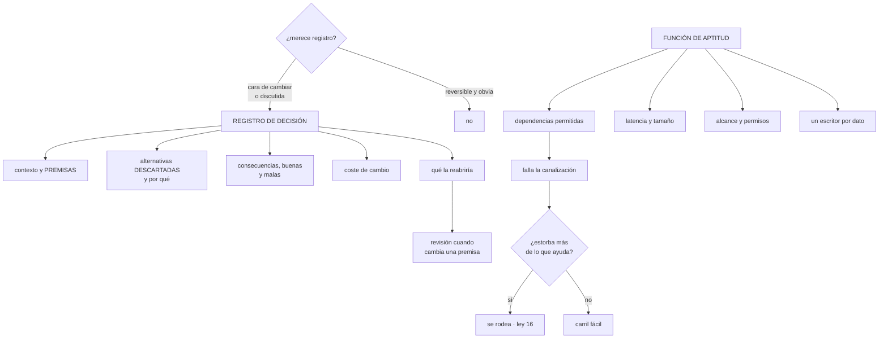

# 190 — ADRs, fitness functions y gobierno de decisiones

> [← 189 · Modelado de amenazas y arquitectura de confianza cero](../../part-15-systems-architecture-engineering/189-modelado-de-amenazas-y-arquitectura-de-confianza-cero/README.md) · [Índice de la parte](../README.md) · [191 · Architecture review y comunicación con stakeholders →](../../part-15-systems-architecture-engineering/191-architecture-review-y-comunicacion-con-stakeholders/README.md)

**Parte:** 15 — Arquitectura de sistemas e ingeniería de requisitos<br>
**Nivel:** intermedio-avanzado · **Horas estimadas:** 4<br>
**Laboratorio:** `architecture` · **Estado:** `EXECUTABLE_CORE`

## 🎯 Propósito

Dejar por escrito las decisiones de arquitectura de forma que sirvan años después, y comprobarlas automáticamente para que no se erosionen. La clase da el formato de registro de decisión que funciona —premisas y alternativas descartadas, no justificaciones—, define las funciones de aptitud como pruebas ejecutables de propiedades arquitectónicas, y aborda de frente el motivo por el que ambas cosas suelen fracasar: **si estorban más de lo que ayudan, se rodean**.

## 📚 Resultados de aprendizaje

Al finalizar podrás:

1. **Escribir** un registro de decisión con premisas, alternativas y coste de cambio.
2. **Distinguir** qué decisiones merecen registro y cuáles no.
3. **Implementar** funciones de aptitud que fallen la canalización.
4. **Elegir** qué propiedades se comprueban automáticamente y cuáles no.
5. **Evitar** que el registro y las comprobaciones se conviertan en trámite.

## 🧩 Conceptos centrales

| Concepto | Comprensión verificable |
|---|---|
| `registro de decisión (ADR)` | Documento corto que fija una decisión con su contexto, alternativas descartadas y consecuencias. |
| `premisa` | Lo que se creía cierto al decidir. Cuando cambia, la decisión se revisa; sin premisas escritas, no hay forma de saberlo. |
| `función de aptitud` | Comprobación ejecutable de una propiedad arquitectónica: dependencias, latencia, alcance, cobertura. |
| `erosión arquitectónica` | Deriva entre la arquitectura decidida y la construida. Ocurre por acumulación de excepciones pequeñas. |
| `decisión superada` | La que fue correcta y dejó de serlo. Se marca como tal, no se borra. |
| `gobierno útil` | El que ayuda a decidir más rápido. El que solo pide papeles se rodea. |
| `carril fácil` | Camino por defecto que cumple lo decidido sin esfuerzo. Es lo que hace innecesario vigilar. |

## 🧠 Modelo mental

Una arquitectura es un conjunto de decisiones sobre estructuras, interfaces y atributos de calidad, respaldadas por escenarios y evidencia.

Aplicado a esta clase, separa siempre cuatro planos: **intención** (qué necesita el usuario),
**configuración** (qué declaramos), **estado observado** (qué existe de verdad) y
**evidencia** (cómo sabemos que cumple). Confundirlos produce diseños que se ven correctos
en un diagrama pero fallan al operar.

## 🗺️ Flujo de razonamiento



## 📖 Desarrollo

### 1. El registro de decisión que sirve

Un registro de decisión útil se lee dentro de tres años, por alguien que no estaba, y le permite entender **si la decisión sigue siendo correcta**. Eso exige una forma concreta.

```text
TÍTULO      una frase que diga la decisión, no el tema
            «Un escritor por dato en el módulo de precios»
            no «Arquitectura de precios»

ESTADO      propuesta · aceptada · superada por [otra]

CONTEXTO Y PREMISAS
            qué se sabía, con cifras
            «el catálogo cambia 1 vez/mes y los precios 9»
            ← esto es lo que hará revisable la decisión

DECISIÓN    en imperativo, sin adornos

ALTERNATIVAS DESCARTADAS
            cada una, con el motivo del descarte
            ← la parte más valiosa y la que más se omite

CONSECUENCIAS
            lo bueno Y lo malo que se acepta

COSTE DE CAMBIO
            qué costaría revertirla dentro de un año  clase 181

QUÉ LA REABRIRÍA
            la señal concreta que obliga a revisarla
```

Y los dos campos que separan un registro útil de uno decorativo:

```text
PREMISAS
  sin ellas no se puede saber si la decisión caducó
  «decidimos X porque el tráfico era 900/s» permite ver que
  a 5.000/s hay que rediscutirlo

ALTERNATIVAS DESCARTADAS
  evitan que alguien vuelva a proponer lo mismo dentro de
  dos años y se pierda un mes
  y si la alternativa se descartó por una premisa que ya no
  se cumple, se recupera sola
```

**Qué merece registro y qué no:**

```text
SÍ
  lo caro de cambiar                              clase 181
  lo que se discutió y hubo desacuerdo
  lo que sorprendería a alguien de fuera
  lo que se decidió NO hacer
  las amenazas aceptadas                          clase 189
  las cesiones entre atributos de calidad

NO
  lo reversible y obvio
  lo que el código ya dice
  lo que solo tiene una opción razonable
```

Y el error de proceso que arruina el registro:

```text
escribirlo DESPUÉS de decidir, para cumplir
→ sale una justificación, no un registro
→ y las alternativas descartadas se inventan

escribirlo ANTES, como borrador, y usarlo para decidir
→ el propio ejercicio de escribir las alternativas cambia
  decisiones
```

Y una decisión que casi nunca se registra y siempre hace falta:

```text
la que se toma y resulta EQUIVOCADA
  se marca como superada, se enlaza la nueva y se escribe
  qué premisa falló
→ borrarla pierde la información más útil del archivo
```

### 2. Funciones de aptitud

Una decisión escrita se erosiona: nadie la incumple de golpe, se incumple una excepción cada vez. Las funciones de aptitud la convierten en algo que falla solo.

```text
QUÉ ES
  una comprobación ejecutable de una propiedad arquitectónica
  que corre en la canalización y falla el cambio

QUÉ NO ES
  una prueba unitaria (que comprueba comportamiento)
  un panel (que informa y nadie mira)              ley 15
```

**Las que más valor dan**, agrupadas por lo que protegen:

```text
FRONTERAS Y DEPENDENCIAS                            clase 183
  ningún módulo importa el interior de otro
  ninguna consulta cruza esquemas
  el grafo de dependencias no tiene ciclos
  ningún módulo depende de más de N módulos

DATOS                                                 ley 21
  cada tabla tiene exactamente un escritor
  ningún esquema nuevo sin dueño declarado
  ningún campo de PII sin clasificación

RENDIMIENTO                                         clase 186
  el p99 del flujo crítico no supera X en la prueba
  ninguna operación hace más de N llamadas de red
  ninguna consulta sin índice sobre tablas grandes

SEGURIDAD                                           clase 189
  ninguna identidad con permisos comodín
  ningún almacén público
  ninguna credencial de larga duración
  ningún recurso sin etiqueta de dueño

OPERACIÓN
  todo servicio expone las cuatro señales           clase 121
  toda alerta tiene procedimiento enlazado          clase 125
  todo servicio nuevo tiene objetivo declarado

CONTRATOS                                           clase 188
  ningún cambio rompe las expectativas declaradas
  todo esquema de evento es compatible hacia delante
```

Y las tres propiedades de una función de aptitud que funciona:

```text
1. FALLA, no informa
   un panel en verde no impide nada

2. ES RÁPIDA
   si tarda 20 minutos, alguien la desactivará

3. TIENE SALIDA DECLARADA
   una excepción con motivo, dueño y fecha
   → sin salida, la gente rodea la comprobación   ley 16
   → con salida registrada, las excepciones se pueden contar
```

Y la métrica que dice si el sistema de comprobaciones está sano:

```text
número de excepciones vivas, y su antigüedad
  → si crece siempre, la regla está mal calibrada
  → si hay excepciones de más de un año, o se arreglan o
    la regla se retira                             clase 170
```

### 3. Por qué esto fracasa, y cómo evitarlo

Registros de decisión y funciones de aptitud fracasan por el mismo mecanismo que los controles de la parte 14, y conviene decirlo antes de implantarlos:

```text
si cuesta más rellenar el registro que tomar la decisión,
se rellena después y mal

si la comprobación bloquea sin explicar cómo cumplirla,
se busca la forma de saltársela

si el órgano que revisa tarda dos semanas, la gente decide
y pide perdón                                        ley 16
```

**Lo que hace que funcione**, en cinco puntos:

```text
1. EL CARRIL FÁCIL CUMPLE SOLO                     clase 171
   la plantilla de servicio nuevo ya trae señales, objetivo,
   etiquetas, identidad mínima
   → así la comprobación casi nunca falla, y cuando falla
     señala algo real

2. LA COMPROBACIÓN DICE CÓMO ARREGLARLO
   mensaje con el motivo, el enlace a la decisión y el
   comando o el cambio concreto

3. REGISTRO CORTO Y EN EL REPOSITORIO
   una página, junto al código, en el mismo cambio
   → no en una herramienta aparte que nadie abre

4. LA REVISIÓN ES SÍNCRONA Y CORTA
   30 minutos con las personas que deciden, no un comité
   que se reúne cada quince días                   clase 191

5. SE RETIRAN REGLAS
   una regla que genera excepciones constantes está mal
   → retirarla es una decisión legítima, y se registra
```

Y una comprobación honesta que conviene hacer cada seis meses:

```text
¿cuántos registros se han leído en el último año?
  → si la respuesta es «ninguno», el formato o el sitio
    están mal
  → los registros útiles se leen cuando alguien propone algo
    parecido, y eso ocurre

¿cuántas veces una función de aptitud paró algo que era
un problema real?
  → si nunca, o la regla sobra o el carril ya lo impide
```

Y la relación con lo aprendido en la parte 14:

```text
un gobierno de decisiones es un control
y un control que estorba se rodea
→ la diferencia entre gobierno útil e inútil no está en las
  reglas, está en si el camino que las cumple es el más fácil
```

### 4. Mantener vivo el archivo

Un archivo de decisiones crece y, sin cuidado, se vuelve inutilizable por acumulación.

```text
ORGANIZACIÓN QUE FUNCIONA
  numeración correlativa, sin carpetas por tema
  índice con título y estado, generado automáticamente
  enlaces entre decisiones relacionadas y superadas
  búsqueda por texto: es como se usa de verdad

LO QUE NO FUNCIONA
  reorganizar por categorías
  borrar las superadas
  editar una decisión pasada en vez de superarla
```

Y el ciclo de revisión, que es lo que evita el archivo muerto:

```text
se revisa una decisión cuando
  cambia una de sus premisas               ← el disparador real
  alguien propone lo que ya se descartó
  una función de aptitud falla repetidamente
  llega la fecha escrita en «qué la reabriría»

no se revisa «periódicamente todas»
→ eso produce reuniones sin objeto
```

Y una práctica que este programa ha usado en todas sus partes:

```text
escribir lo que se espera que ocurra, y volver a corregirlo
con evidencia
→ aplicado a decisiones: anotar qué se espera que pase tras
  la decisión, y a los seis meses comparar
→ es la única forma de mejorar el criterio, y casi nadie
  lo hace
```

Y la lista de comprobación de la clase:

```text
☐ cada decisión cara de cambiar tiene registro
☐ el registro incluye premisas con cifras
☐ incluye alternativas descartadas con su motivo
☐ incluye consecuencias malas, no solo buenas
☐ incluye coste de cambio y qué la reabriría
☐ se escribió antes de decidir, no después
☐ las decisiones erróneas están marcadas como superadas
☐ las propiedades importantes tienen función de aptitud
☐ las comprobaciones fallan, no informan
☐ cada comprobación dice cómo cumplirla
☐ hay salida declarada con dueño y fecha
☐ se cuentan las excepciones vivas y su antigüedad
☐ el carril por defecto cumple sin esfuerzo
☐ se han retirado reglas que no aportaban
```

Y el cierre que enlaza con la clase siguiente: las decisiones registradas hay que defenderlas ante quien las paga, quien las opera y quien las sufre, y cada uno pregunta cosas distintas. Comunicar arquitectura a esas audiencias es la materia de la clase 191.

## 🔬 Ejemplo trabajado

**El equipo de reservas implanta registro de decisiones y funciones de aptitud. Lo que sigue son dos registros reales —uno de ellos superado a los ocho meses—, las once funciones que montaron, y el motivo por el que tres se retiraron.**

**Registro 007 · Un escritor por dato en precios**

```text
ESTADO      aceptada · 2024-03-11

CONTEXTO Y PREMISAS
  los precios se guardan en la tabla de catálogo
  precios cambia 9 veces al mes; catálogo, 1
  el 64 % de los cambios de catálogo son en realidad
    cambios de precio
  3 incidentes de «precio incorrecto» sin causa conocida
  volumen: 4,1 M de registros de catálogo

DECISIÓN
  el precio sale de la tabla de catálogo a un almacén propio
  del servicio de precios, que es su único escritor
  catálogo recibe los cambios por evento

ALTERNATIVAS DESCARTADAS
  1 dejarlo donde está y añadir validación
    → no resuelve el acoplamiento; lo hace más lento de
      descubrir
  2 vista materializada en catálogo
    → sigue habiendo dos escritores durante la transición,
      y la transición no termina nunca
  3 sacar precios a servicio pero compartiendo la tabla
    → monolito distribuido                         clase 184

CONSECUENCIAS
  buenas   precios se despliega sin bloquear a catálogo;
           desaparece el acoplamiento por datos
  malas    una llamada más en el flujo de reserva (+1,4 ms);
           consistencia eventual del precio en catálogo
           (≤ 10 min, aceptado por revenue)

COSTE DE CAMBIO
  alto. Volver atrás exige migrar el dato de nuevo: ~4 semanas

QUÉ LA REABRIRÍA
  si los cambios de precio bajan por debajo de 2/mes
  si el retraso de propagación resulta inaceptable para
    revenue
```

Y lo que este registro evitó nueve meses después:

```text
un ingeniero nuevo propuso «simplificar» volviendo a guardar
el precio en catálogo
→ el registro 007 estaba enlazado desde el módulo
→ la discusión duró 10 minutos en vez de dos semanas
```

**Registro 011 · Réplica de lectura para el panel de ocupación**

```text
ESTADO      SUPERADA por 019 · 2024-11-04

CONTEXTO Y PREMISAS (marzo 2024)
  el panel de ocupación hace 40 consultas pesadas/min
  la base primaria está al 71 % de utilización
  el panel lo usan 12 personas de operaciones
  presupuesto disponible: sí

DECISIÓN
  añadir una réplica de lectura dedicada al panel

ALTERNATIVAS DESCARTADAS
  1 caché de 60 s → «los datos deben ser exactos»  ← premisa
  2 vista materializada → complejidad de refresco

CONSECUENCIAS
  +410 €/mes; retraso de réplica de 200-900 ms
```

Y por qué se superó:

```text
QUÉ FALLÓ (registrado en el 019)
  la premisa «los datos deben ser exactos» nunca se comprobó
  con nadie
  al preguntar a las 12 personas en octubre: ninguna
  necesitaba exactitud al segundo; la decisión de negocio
  que tomaban con ese panel era de turno, no de minuto

DECISIÓN NUEVA (019)
  caché de 30 s con la antigüedad mostrada en pantalla

EFECTO
  réplica retirada          -410 €/mes
  carga en el primario      -18 %
  quejas por el panel       de 9/mes a 0             clase 187

LECCIÓN REGISTRADA
  la premisa venía de una suposición del equipo técnico,
  no de una pregunta a los usuarios
  → desde entonces, toda premisa sobre lo que «necesita»
    alguien lleva el nombre de quien lo dijo
```

**Las once funciones de aptitud, y qué encontró cada una.**

```text
regla                                    fallos    resultado
────────────────────────────────────────────────────────────
1  ninguna consulta cruza esquemas         17     todas reales
   → 17 consultas cruzadas acumuladas en 2 años   clase 183

2  cada tabla tiene un solo escritor         4     todas reales
   → incluida una que nadie conocía

3  sin permisos comodín en identidades       9     8 reales

4  sin credenciales de larga duración        6     todas reales

5  todo recurso con etiqueta de dueño       23     todas reales

6  todo servicio expone las 4 señales        3     reales

7  toda alerta con procedimiento enlazado   11     reales

8  ninguna operación > 6 llamadas de red     2     1 real,
                                                   1 excepción

9  el p99 del flujo crítico < 500 ms         0     nunca falló
   → RETIRADA: la prueba de carga ya lo cubre y esta
     duplicaba 9 min de canalización

10 ningún fichero de más de 800 líneas      41     0 reales
   → RETIRADA: medía tamaño, no acoplamiento; 41 excepciones
     en 3 meses                                      ley 17

11 el grafo de módulos sin ciclos            1     real
```

Y las tres reglas retiradas o corregidas:

```text
RETIRADA 9    nunca falló y costaba 9 min por cambio
RETIRADA 10   41 excepciones y ningún problema real detectado
              → la regla medía lo fácil de medir      ley 17
CORREGIDA 3   generaba 1 falso positivo de cada 9 por un
              patrón legítimo; se ajustó el patrón
```

**El dato que decidió si el sistema estaba sano, a los seis meses:**

```text
excepciones vivas                                     14
  con dueño y fecha                                   14
  vencidas y sin renovar                               2  → arregladas
  de más de 6 meses                                    0

registros de decisión escritos                        23
registros consultados al menos una vez                17
discusiones cerradas citando un registro               6
decisiones superadas                                   3

funciones que pararon un problema real                 9 de 11
tiempo añadido a la canalización                   2,4 min
```

Y la comprobación que evitó que esto se volviera trámite:

```text
el carril fácil se ajustó tres veces
  la plantilla de servicio nuevo pasó a traer etiquetas,
  señales, objetivo y alerta con procedimiento
  → los fallos de las reglas 5, 6 y 7 en servicios NUEVOS
    bajaron a cero
  → los que siguen fallando son servicios antiguos, que es
    exactamente lo que se quiere ver
```

**La lección que esta clase deja**: de las once funciones de aptitud, **dos se retiraron y una de ellas —el límite de tamaño de fichero— había generado cuarenta y una excepciones sin detectar un solo problema real**, que es el ejemplo perfecto de optimizar la medida en lugar del objetivo. Y del archivo de decisiones, la entrada más valiosa fue **la que se superó**: no porque la decisión fuera mala, sino porque dejó escrito que su premisa central nunca se había comprobado con nadie.

## 🧪 Laboratorio guiado

Ejecuta desde la raíz:

```bash
python classes/part-15-systems-architecture-engineering/190-adrs-fitness-functions-y-gobierno-de-decisiones/lab.py
```

El laboratorio selecciona el motor de práctica **`architecture`** y produce
`lab_result.json`. El escenario, sus comprobaciones y el artefacto esperado corresponden a
esta clase; no requiere credenciales y deja explícito qué debe revalidarse en un sandbox real.

1. Lee `exercise.steps` y formula una predicción antes de ejecutar.
2. Ejecuta la práctica y verifica todos los elementos de `checks`.
3. Provoca el caso de `negative_test` y explica la señal observada.
4. Materializa `adr-library` en `evidence/` usando la plantilla indicada.
5. Para proveedor real, sigue `sandbox.requires`, registra costo y ejecuta `destroy`.

### Evidencia esperada

El artefacto principal es un diagrama acompañado por decisiones y trade-offs. Además, la entrega debe incluir el comando ejecutado,
la salida estructurada y una conclusión que no exceda lo observado.

## 🏆 Reto verificable

Construye **`adr-library`** para el caso CloudShop. Incluye una alternativa descartada,
un supuesto que pueda falsarse, una prueba de fallo y una decisión de rollback.

## ✅ Criterio de aceptación

- [ ] `lab.py` termina con código 0 y genera JSON válido.
- [ ] La entrega conecta al menos tres requisitos con mecanismos verificables.
- [ ] Existe una prueba positiva y una prueba negativa con evidencia.
- [ ] Seguridad, costo y operación aparecen como decisiones, no como anexos.
- [ ] Se declara una limitación y una condición que obligaría a revisar el diseño.
- [ ] Otra persona puede repetir el recorrido sin conocimiento tácito.

## ⚠️ Errores frecuentes

| Síntoma | Causa probable | Corrección |
|---|---|---|
| Los registros de decisión no ayudan a nadie tres años después | No incluyen premisas, así que no se puede saber si la decisión caducó | Escribe el contexto con cifras concretas y añade qué señal reabriría la decisión. |
| Se vuelve a proponer una opción que ya se había descartado | No se registraron las alternativas ni el motivo del descarte | Incluye siempre las alternativas descartadas con su razón; si el motivo era una premisa que ya no se cumple, la opción vuelve legítimamente. |
| El registro suena a justificación | Se escribió después de decidir, para cumplir | Redáctalo como borrador antes de decidir y úsalo para decidir; el propio ejercicio cambia decisiones. |
| La arquitectura decidida se erosiona sin que nadie la incumpla de golpe | No hay comprobación automática de las propiedades importantes | Convierte las decisiones estructurales en funciones de aptitud que fallen la canalización. |
| Una comprobación acumula decenas de excepciones y no encuentra problemas | Mide algo fácil de medir en lugar de la propiedad que importa | Cuenta excepciones vivas y su antigüedad; retira la regla si no detecta problemas reales. |
| La gente rodea el gobierno de decisiones | Cuesta más que decidir, bloquea sin explicar y la revisión tarda semanas | Haz que el carril por defecto cumpla solo, que el mensaje diga cómo arreglarlo, y revisa en sesiones cortas y síncronas. |

## 🛡️ Seguridad, ética y costo

Trabaja con cuentas propias o sandboxes autorizados. No publiques secretos, identificadores
reales ni datos personales. Antes de crear recursos pagos define presupuesto, etiquetas y
comando de destrucción; después verifica que no queden recursos huérfanos. Los ejemplos
locales enseñan contratos, pero no certifican cumplimiento ni disponibilidad de producción.

## ❓ Preguntas de comprobación

1. ¿Qué dos campos separan un registro de decisión útil de uno decorativo?
2. ¿Por qué conviene escribir el registro antes de decidir?
3. ¿Qué tres propiedades tiene una función de aptitud que funciona?
4. ¿Qué indica que una regla está mal calibrada?
5. ¿Qué hace innecesario vigilar el cumplimiento de una decisión?

## 🔗 Referencias

- Nygard, M. (2011). *Documenting architecture decisions*. <https://cognitect.com/blog/2011/11/15/documenting-architecture-decisions>
- Ford, N., Parsons, R. y Kua, P. (2017). *Building Evolutionary Architectures* — funciones de aptitud. <https://www.oreilly.com/library/view/building-evolutionary-architectures/9781491986356/>
- ThoughtWorks (2025). *Technology Radar: lightweight ADRs*. <https://www.thoughtworks.com/radar/techniques/lightweight-architecture-decision-records>
- ArchUnit (2025). *Testing architecture rules in the build*. <https://www.archunit.org/>
- Open Policy Agent (2025). *Policy as code* — comprobaciones ejecutables en la canalización. <https://www.openpolicyagent.org/docs/latest/>
- Documentación oficial vigente del servicio implementado; registra URL y fecha de consulta.

---

> [Evaluación](assessment.md) · [Contrato de clase](lesson.yaml) · [Índice de la parte](../README.md)

| Anterior | Índice | Siguiente |
|---|---|---|
| [← 189 · Modelado de amenazas y arquitectura de confianza cero](../../part-15-systems-architecture-engineering/189-modelado-de-amenazas-y-arquitectura-de-confianza-cero/README.md) | [Parte 15](../README.md) · [Programa](../../README.md) | [191 · Architecture review y comunicación con stakeholders →](../../part-15-systems-architecture-engineering/191-architecture-review-y-comunicacion-con-stakeholders/README.md) |
