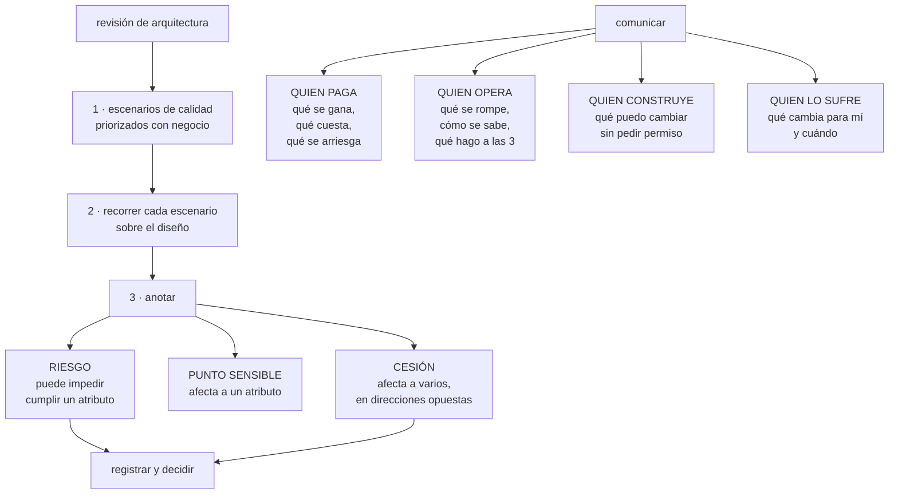

# 191 — Architecture review y comunicación con stakeholders

> [← 190 · ADRs, fitness functions y gobierno de decisiones](../../part-15-systems-architecture-engineering/190-adrs-fitness-functions-y-gobierno-de-decisiones/README.md) · [Índice de la parte](../README.md) · [192 · Proyecto: arquitectura completa de CloudShop →](../../part-15-systems-architecture-engineering/192-proyecto-arquitectura-completa-de-cloudshop/README.md)

**Parte:** 15 — Arquitectura de sistemas e ingeniería de requisitos<br>
**Nivel:** intermedio-avanzado · **Horas estimadas:** 4<br>
**Laboratorio:** `governance` · **Estado:** `EXECUTABLE_CORE`

## 🎯 Propósito

Someter una arquitectura a revisión de forma que encuentre problemas, y comunicarla a audiencias que preguntan cosas distintas. La clase da el método de revisión basado en escenarios —que encuentra riesgos donde la revisión por opinión no encuentra nada—, la forma de traducir decisiones técnicas a las tres preguntas que hace cada audiencia, y la disciplina que hace útil una revisión: **buscar riesgos y puntos sensibles, no aprobar o rechazar**.

## 📚 Resultados de aprendizaje

Al finalizar podrás:

1. **Ejecutar** una revisión de arquitectura basada en escenarios de calidad.
2. **Distinguir** riesgo, punto sensible y cesión, y registrarlos.
3. **Traducir** una decisión técnica a lo que cada audiencia necesita saber.
4. **Presentar** una arquitectura con la estructura que resiste preguntas.
5. **Evitar** que la revisión se convierta en un trámite de aprobación.

## 🧩 Conceptos centrales

| Concepto | Comprensión verificable |
|---|---|
| `revisión por escenarios` | Someter la arquitectura a escenarios de calidad concretos y ver cómo responde, en vez de opinar sobre el diagrama. |
| `riesgo` | Decisión que puede impedir cumplir un atributo de calidad. Es el producto principal de una revisión. |
| `punto sensible` | Decisión de la que depende un solo atributo. Cambiarla lo afecta directamente. |
| `punto de cesión` | Decisión de la que dependen varios atributos en direcciones opuestas. Es donde se decide de verdad. |
| `audiencia` | Quien paga, quien opera, quien construye y quien lo sufre. Cada una pregunta cosas distintas. |
| `revisión de aprobación` | La que solo dice sí o no. No encuentra nada y se convierte en trámite. |

## 🧠 Modelo mental

Una arquitectura es un conjunto de decisiones sobre estructuras, interfaces y atributos de calidad, respaldadas por escenarios y evidencia.

Aplicado a esta clase, separa siempre cuatro planos: **intención** (qué necesita el usuario),
**configuración** (qué declaramos), **estado observado** (qué existe de verdad) y
**evidencia** (cómo sabemos que cumple). Confundirlos produce diseños que se ven correctos
en un diagrama pero fallan al operar.

## 🗺️ Flujo de razonamiento



## 📖 Desarrollo

### 1. Revisión por escenarios

La revisión habitual —presentar el diagrama y pedir comentarios— produce observaciones sobre nombres, tecnologías preferidas y detalles visibles. No encuentra riesgos porque no pregunta nada concreto.

La revisión por escenarios sí:

```text
1. SE PARTE DE LOS ESCENARIOS DE CALIDAD           clase 181
   los medibles, no los adjetivos

2. SE PRIORIZAN CON NEGOCIO
   importancia para el negocio × dificultad técnica percibida
   → se revisan los 5 u 8 primeros, no los veinte

3. SE RECORRE CADA ESCENARIO SOBRE EL DISEÑO
   «entra este estímulo, en estas condiciones: ¿qué pasa,
    componente por componente?»
   → y se anota dónde el diseño no tiene respuesta

4. SE CLASIFICA LO ENCONTRADO
   riesgo · punto sensible · cesión · no-riesgo

5. SE DECIDE QUÉ HACER CON CADA RIESGO
   y quién, y para cuándo
```

Y la distinción que ordena los hallazgos:

```text
RIESGO
  «si el pico llega a 3.000/s, el grupo de conexiones se
   agota y la latencia se dispara»
  → tiene consecuencia y probabilidad; se decide

PUNTO SENSIBLE
  «el tamaño del grupo de conexiones determina el caudal
   máximo»
  → una sola decisión afecta a un atributo; se documenta

CESIÓN
  «leer del primario garantiza ver lo propio y aumenta la
   carga del primario»
  → afecta a dos atributos en direcciones opuestas; es donde
    hay que decidir explícitamente               clase 181

NO-RIESGO
  también se anota: «esto está resuelto, y así»
  → evita revisarlo otra vez dentro de seis meses
```

Y la regla que hace útil la revisión:

```text
el producto de una revisión es una LISTA DE RIESGOS con dueño
y fecha, no un veredicto
→ «aprobado» no dice nada y no mejora el diseño
→ y una revisión que no encuentra riesgos no se hizo bien
```

Y una advertencia de método:

```text
quien presenta no puede ser quien modera
y quien revisa debe poder decir «no lo sé» sin coste
→ si la revisión evalúa a la persona, deja de encontrar cosas
```

### 2. Cómo se conduce, en la práctica

Una revisión útil dura entre dos y cuatro horas y tiene un orden concreto.

```text
ANTES
  el material se reparte con 3 días de antelación
  → diagrama C1 y C2                             clase 182
  → escenarios de calidad medibles
  → registros de decisión relevantes             clase 190
  → lo que ya se sabe que es riesgo

  quien revisa llega con preguntas escritas
  → sin esto, la sesión se llena de preguntas de contexto

DURANTE
  20 min   contexto y objetivo de negocio, con cifras
  20 min   arquitectura: C1, C2, y las decisiones caras
  30 min   priorización de escenarios con negocio presente
  90 min   recorrido de los 5-8 escenarios elegidos
  20 min   riesgos, dueños y fechas

DESPUÉS
  lista de riesgos publicada en 48 h
  cada riesgo con dueño, acción y fecha
  los no-riesgos también anotados
```

Y los cuatro papeles que hacen falta:

```text
QUIEN PRESENTA        conoce el diseño
QUIEN MODERA          controla el tiempo y evita el desvío
QUIEN REVISA (2-4)    de fuera del equipo, con experiencia
                      distinta: operación, datos, seguridad
NEGOCIO               prioriza los escenarios ← imprescindible
```

Y el papel que más falta y más cambia el resultado:

```text
sin negocio en la sala, los escenarios se priorizan por
criterio técnico
→ y se revisa lo interesante en vez de lo que importa
```

**Las preguntas que más encuentran**, por si hay poco tiempo:

```text
¿qué pasa si esta dependencia responde en 5 s en vez de
  fallar?                                        clase 185
¿quién escribe este dato?                          ley 21
¿qué se rompe si desplegamos esto y aquello en orden
  distinto?
¿cómo nos enteramos de que esto ha fallado?        ley 13
¿qué pasa el día que haya que volver atrás?
¿esto se ha probado o se ha razonado?              ley 22
¿cuánto cuesta al mes y por qué esa cifra?
¿qué decisión de aquí es la más cara de cambiar?
```

Y un patrón que aparece en casi todas las revisiones:

```text
el equipo conoce sus riesgos técnicos
y NO conoce los de operación ni los de retirada
→ por eso quien revisa debe venir de operación, no solo
  de arquitectura
```

### 3. Cuatro audiencias, cuatro preguntas

La misma arquitectura se cuenta de cuatro formas, porque cada audiencia decide algo distinto.

```text
QUIEN PAGA (dirección, negocio, finanzas)
  qué se gana, en términos de negocio
  qué cuesta, al mes y de una vez
  qué se arriesga, y qué pasa si sale mal
  cuándo se nota

  NO quiere    nombres de tecnologías, diagramas de cajas
  SÍ quiere    una cifra de antes y una de después,
               con su origen                       clase 179

QUIEN OPERA (guardia, plataforma, soporte)
  qué se rompe y con qué frecuencia
  cómo me entero
  qué hago a las 3 de la mañana
  qué he de aprender y cuánto trabajo nuevo me traes

  NO quiere    la justificación de la decisión
  SÍ quiere    procedimientos, alertas y quién es el dueño

QUIEN CONSTRUYE (equipos que usarán esto)
  qué puedo cambiar sin pedir permiso
  dónde están las fronteras
  qué contrato tengo que respetar
  cómo pruebo mi parte

  SÍ quiere    fronteras claras y un camino fácil  clase 171

QUIEN LO SUFRE (usuarios, socios, otros equipos)
  qué cambia para mí
  cuándo, y qué tengo que hacer
  qué pasa si no hago nada

  SÍ quiere    fechas y una lista de acciones
```

Y el error más frecuente de comunicación:

```text
contar a dirección el porqué técnico
y a operación el porqué de negocio
→ ambos escuchan educadamente y no deciden nada
```

**La estructura que resiste preguntas**, para cualquiera de las cuatro:

```text
1. el problema, con la cifra que lo demuestra
2. lo que se descubrió que no se sabía          clase 178
3. la decisión, en una frase
4. las alternativas descartadas y por qué
5. lo que se acepta a cambio         ← lo que da credibilidad
6. cómo sabremos si funcionó, y cuándo
```

Y el punto 5 es el que más se omite y el que más confianza genera:

```text
una propuesta sin desventajas no se cree
→ decir «esto añade 1,4 ms y consistencia eventual de
  10 minutos, aceptado por revenue» hace creíble el resto
```

Y una técnica que funciona con dirección:

```text
presentar DOS opciones viables, no una
  con su coste, su riesgo y su plazo
  y una recomendación clara
→ una sola opción parece una decisión ya tomada que se viene
  a ratificar, y genera resistencia
```

### 4. Que no se convierta en trámite

La revisión de arquitectura degenera en comité de aprobación con una facilidad notable, y entonces cumple la ley 16 como cualquier otro control.

```text
SEÑALES DE QUE YA ES UN TRÁMITE
  la revisión no ha rechazado ni cambiado nada en un año
  los equipos la convocan cuando ya está construido
  la salida es un «aprobado» sin lista de riesgos
  se revisa todo, sin criterio de umbral
  tarda semanas en conseguirse una fecha
  quien revisa no ha operado nada nunca
```

Y las correcciones, una por señal:

```text
UMBRAL CLARO DE QUÉ SE REVISA
  lo caro de cambiar y lo que cruza fronteras de equipo
  → el resto, no                                 clase 181

PRONTO Y EN BORRADOR
  se revisa el diseño, no lo construido
  → una revisión sobre algo ya hecho solo puede aprobar o
    generar rencor

SALIDA = RIESGOS, NO VEREDICTO
  quien decide sigue siendo el equipo
  → la revisión aporta riesgos que el equipo no vio; lo que
    haga con ellos es suyo, y queda registrado

DISPONIBILIDAD RÁPIDA
  si conseguir fecha tarda tres semanas, se decide sin
  revisión y se pide perdón                        ley 16

REVISORES QUE HAN OPERADO
  quien nunca ha estado de guardia no pregunta lo que
  importa a las 3 de la mañana
```

Y una medida honesta del valor de la revisión:

```text
¿cuántos riesgos encontrados por revisión se materializaron
después?
  → alto: la revisión ve bien
¿cuántos incidentes tuvieron una causa que la revisión no vio?
  → esos son los que enseñan a revisar mejor
```

Y la lista de comprobación de la clase:

```text
☐ la revisión parte de escenarios medibles, no del diagrama
☐ negocio estuvo presente para priorizar
☐ se recorrieron los escenarios sobre el diseño, uno a uno
☐ lo encontrado está clasificado en riesgo, sensible o cesión
☐ los no-riesgos también están anotados
☐ cada riesgo tiene dueño, acción y fecha
☐ la salida no es «aprobado» sino una lista
☐ quien presenta no modera
☐ al menos un revisor viene de operación
☐ la revisión ocurrió sobre el diseño, no sobre lo construido
☐ cada audiencia recibió lo que necesita decidir
☐ se dijo explícitamente qué se acepta a cambio
```

Y el cierre que enlaza con la clase siguiente: con requisitos, fronteras, disponibilidad, capacidad, consistencia, contratos, amenazas, decisiones registradas y revisión, queda aplicarlo todo a un sistema completo y comprobar si se sostiene. Es la materia de la clase 192, que además cierra la parte 15.

## 🔬 Ejemplo trabajado

**La arquitectura de reservas se somete a revisión antes de construir. Lo que sigue son los escenarios priorizados con negocio, el recorrido de los cinco primeros, los nueve riesgos encontrados —tres de los cuales el equipo no había visto— y cómo se contó la misma decisión a cuatro audiencias.**

**La priorización, hecha con negocio en la sala:**

```text
escenario                       negocio   dificultad   revisar
QA-1 latencia de búsqueda          alta      media        sí
QA-2 disponibilidad de reserva     alta      alta         sí
QA-3 añadir método de pago         alta      alta         sí
QA-5 recuperar tras borrado        alta      alta         sí
QA-6 diagnóstico sin guardia       media     alta         sí
QA-4 alcance tras compromiso       alta      media        no*
QA-7 coste en campaña              media     baja         no

* QA-4 se revisó por separado en el modelo de amenazas
```

Y una sorpresa de la priorización:

```text
el equipo había puesto QA-1 (latencia) como el más importante
negocio puso QA-3 (añadir método de pago) igual de alto
motivo: había dos integraciones comprometidas por contrato
para el año siguiente, y el equipo no lo sabía
→ eso cambió el orden del trabajo                clase 181
```

**Recorrido del escenario QA-2 · disponibilidad de reserva.**

```text
estímulo   pico de campaña; el servicio de recomendaciones cae
recorrido
  el borde recibe la petición                     ok
  la API llama a precios                          ← ¿y si tarda?
  la API llama a catálogo                         ← ¿y si tarda?
  la API escribe la reserva                       ok
  la API llama a la pasarela                      dura, aceptada
  la API publica el evento                        asíncrona, ok

HALLAZGOS
  RIESGO 1   catálogo estaba declarado blando y la llamada no
             tenía plazo ni alternativa
             → el equipo lo sabía desde la clase 185
  RIESGO 2   el plazo hacia la pasarela era de 30 s
             → en saturación llena los hilos      clase 186
             → EL EQUIPO NO LO HABÍA VISTO
  CESIÓN     precio cacheado 10 min: gana disponibilidad,
             pierde exactitud → decidida y registrada
```

**Recorrido del escenario QA-3 · añadir un método de pago en 5 días.**

```text
recorrido, paso a paso, sobre el diseño
  añadir el proveedor nuevo en el coordinador de pago
  → el coordinador vive DENTRO de reservas          ok
  añadir la opción en la app                         ok
  añadir la conciliación contable
  → la conciliación está en facturación heredada    ← aquí

HALLAZGOS
  RIESGO 3   el escenario NO se cumple: la parte contable
             depende de un equipo externo con su propio
             calendario, y su plazo típico es de 6 semanas
             → EL EQUIPO NO LO HABÍA VISTO
             → 5 días es imposible mientras la conciliación
               viva ahí
  acción     definir un contrato de evento hacia facturación
             para que los métodos nuevos no requieran cambios
             en el heredado                        clase 188
```

**Recorrido del escenario QA-6 · diagnóstico sin guardia nocturna.**

```text
estímulo   suben los errores de pago un martes a las 3:00
recorrido
  ¿salta una alerta?                    sí, ritmo de consumo
  ¿llega al móvil?                      sí
  ¿identifica el servicio?              sí
  ¿identifica el cambio responsable?    ← ¿hay línea de cambios?
  ¿se puede diagnosticar sin acceso de escritura?

HALLAZGOS
  RIESGO 4   la línea de cambios solo incluye despliegues
             propios; los cambios de configuración de la
             pasarela y las banderas de función no aparecen
             → EL EQUIPO NO LO HABÍA VISTO
  RIESGO 5   el panel de diagnóstico no es usable en móvil
  NO-RIESGO  la correlación por identificador de traza está
             bien resuelta; se anota para no revisarlo otra vez
```

**Los nueve riesgos, con dueño y fecha:**

```text
#  riesgo                              dueño       fecha    est.
1  catálogo dependencia dura sin plazo  reservas    sem 2   alto
2  plazo de 30 s hacia la pasarela      reservas    sem 1   alto
3  QA-3 imposible por conciliación      arquitect.  sem 6   alto
4  línea de cambios incompleta          plataforma  sem 4   medio
5  panel no usable en móvil             plataforma  sem 8   medio
6  restauración de precios sin ensayar  datos       sem 5   alto
7  sin control de salida en la subred   seguridad   sem 3   alto
   nueva
8  el socio C con credencial estática   alianzas    trim    bajo
   (amenaza aceptada, se anota)                     revisión
9  precios: un solo escritor, sin plan  reservas    sem 10  medio
   si esa persona no está

de los nueve, los que el equipo NO había visto     3, 4, 5
y los tres venían de revisores de operación
```

Y la observación del moderador, anotada en el acta:

```text
los riesgos que el equipo ya conocía eran todos técnicos
los tres nuevos eran de operación y de dependencia
organizativa
→ confirma que un revisor que ha estado de guardia encuentra
  lo que el equipo no ve
```

**La misma decisión, contada a cuatro audiencias.** Decisión: sacar precios a su propio servicio.

```text
A DIRECCIÓN (5 minutos)
  «Los cambios de precio tardan hoy entre 2 y 6 semanas
   porque hay que coordinar con catálogo, y 4 veces este
   año una promoción salió tarde. Separando precios, pasan
   a 5 días. Cuesta 10 semanas de trabajo y unos 210 €/mes
   más. A cambio, el precio que se ve en el catálogo puede
   ir hasta 10 minutos por detrás; revenue lo ha aceptado
   por escrito. Sabremos si funcionó en el primer trimestre:
   la medida es días desde que se aprueba un precio hasta
   que está vivo.»

A OPERACIÓN (5 minutos)
  «Un servicio más, con su guardia. Se rompe si su almacén
   no responde: entonces reservas usa el último precio válido
   y sigue funcionando, así que no es una llamada de
   madrugada. La alerta que sí lo es: retraso de propagación
   por encima de 15 minutos. Procedimiento escrito y probado
   por alguien de fuera del equipo. Dueño: equipo de
   reservas. Y os quitamos tres alertas de ‹precio
   incorrecto› que llevaban dos años sin causa conocida.»

A LOS EQUIPOS QUE CONSTRUYEN
  «El precio ya no está en la tabla de catálogo. Se pide al
   servicio de precios o se escucha su evento. Contrato
   versionado, compatible hacia delante, con pruebas de
   contrato en nuestra canalización: si rompemos algo, falla
   nuestro despliegue, no el vuestro. Podéis cambiar vuestra
   parte sin pedirnos nada mientras respetéis el contrato.»

AL SOCIO Y AL EQUIPO DE INFORMES (quien lo sufre)
  «A partir del 14 de octubre, el campo precio del catálogo
   deja de actualizarse en tiempo real y puede ir hasta 10
   minutos por detrás. Si necesitáis el precio exacto en el
   momento, usad el endpoint de precios, que os damos ahora.
   Si no hacéis nada, veréis precios con hasta 10 minutos de
   retraso. Contacto para dudas: X.»
```

Y el detalle que hizo que dirección aprobara sin discusión:

```text
se presentaron DOS opciones
  A  separar precios              10 semanas, 210 €/mes
  B  mantener y añadir validación  3 semanas, 0 €
     → no resuelve el bloqueo; los 5 días siguen siendo
       6 semanas
  recomendación: A, con el motivo

→ y la pregunta de dirección fue sobre el plazo, no sobre
  si hacerlo
```

**La lección que esta clase deja**: la revisión encontró nueve riesgos y **los tres que el equipo no había visto no eran técnicos**: un plazo demasiado largo hacia un tercero, una línea de cambios incompleta y un escenario de negocio que resultaba imposible por depender de un equipo externo. Los tres los encontraron revisores que habían estado de guardia. Y el escenario que negocio priorizó más alto —añadir un método de pago— **el equipo ni siquiera sabía que estaba comprometido por contrato**.

## 🧪 Laboratorio guiado

Ejecuta desde la raíz:

```bash
python classes/part-15-systems-architecture-engineering/191-architecture-review-y-comunicacion-con-stakeholders/lab.py
```

El laboratorio selecciona el motor de práctica **`governance`** y produce
`lab_result.json`. El escenario, sus comprobaciones y el artefacto esperado corresponden a
esta clase; no requiere credenciales y deja explícito qué debe revalidarse en un sandbox real.

1. Lee `exercise.steps` y formula una predicción antes de ejecutar.
2. Ejecuta la práctica y verifica todos los elementos de `checks`.
3. Provoca el caso de `negative_test` y explica la señal observada.
4. Materializa `architecture-review` en `evidence/` usando la plantilla indicada.
5. Para proveedor real, sigue `sandbox.requires`, registra costo y ejecuta `destroy`.

### Evidencia esperada

El artefacto principal es una jerarquía de política, ownership y evidencia. Además, la entrega debe incluir el comando ejecutado,
la salida estructurada y una conclusión que no exceda lo observado.

## 🏆 Reto verificable

Construye **`architecture-review`** para el caso CloudShop. Incluye una alternativa descartada,
un supuesto que pueda falsarse, una prueba de fallo y una decisión de rollback.

## ✅ Criterio de aceptación

- [ ] `lab.py` termina con código 0 y genera JSON válido.
- [ ] La entrega conecta al menos tres requisitos con mecanismos verificables.
- [ ] Existe una prueba positiva y una prueba negativa con evidencia.
- [ ] Seguridad, costo y operación aparecen como decisiones, no como anexos.
- [ ] Se declara una limitación y una condición que obligaría a revisar el diseño.
- [ ] Otra persona puede repetir el recorrido sin conocimiento tácito.

## ⚠️ Errores frecuentes

| Síntoma | Causa probable | Corrección |
|---|---|---|
| La revisión solo produce comentarios sobre nombres y tecnologías | Se presentó el diagrama y se pidieron opiniones, sin escenarios concretos | Parte de escenarios de calidad medibles y recórrelos uno a uno sobre el diseño. |
| Se revisa lo interesante en vez de lo que importa | Los escenarios se priorizaron con criterio técnico | Prioriza con negocio presente, cruzando importancia de negocio y dificultad técnica. |
| La revisión no ha cambiado nada en un año | Es un comité de aprobación que llega cuando ya está construido | Revisa el diseño en borrador, con umbral claro de qué se revisa, y que la salida sea una lista de riesgos con dueño y fecha. |
| El equipo sale de la revisión sin haber aprendido nada nuevo | Los revisores tienen el mismo perfil que quien presenta | Incluye al menos un revisor que haya estado de guardia; los riesgos de operación y de retirada son los que el equipo no ve. |
| Dirección escucha la propuesta y no decide | Se le contó el porqué técnico en vez de coste, riesgo y plazo | Presenta dos opciones viables con su coste y riesgo, y una recomendación clara. |
| Una propuesta genera desconfianza pese a ser buena | Se presentó sin desventajas | Di explícitamente qué se acepta a cambio y quién lo ha aceptado. |

## 🛡️ Seguridad, ética y costo

Trabaja con cuentas propias o sandboxes autorizados. No publiques secretos, identificadores
reales ni datos personales. Antes de crear recursos pagos define presupuesto, etiquetas y
comando de destrucción; después verifica que no queden recursos huérfanos. Los ejemplos
locales enseñan contratos, pero no certifican cumplimiento ni disponibilidad de producción.

## ❓ Preguntas de comprobación

1. ¿Qué diferencia hay entre riesgo, punto sensible y punto de cesión?
2. ¿Por qué el producto de una revisión no debe ser un veredicto?
3. ¿Qué aporta tener a negocio en la sala durante la priorización?
4. ¿Qué necesita saber quien opera y qué no le interesa?
5. ¿Qué señales indican que la revisión se ha convertido en trámite?

## 🔗 Referencias

- Clements, P., Kazman, R. y Klein, M. (2001). *Evaluating Software Architectures: Methods and Case Studies* (ATAM). <https://www.oreilly.com/library/view/evaluating-software-architectures/9780201704822/>
- SEI (2000). *ATAM: Method for Architecture Evaluation*. <https://insights.sei.cmu.edu/library/atam-method-for-architecture-evaluation/>
- Bass, L., Clements, P. y Kazman, R. (2021). *Software Architecture in Practice*, cap. de evaluación. <https://www.oreilly.com/library/view/software-architecture-in/9780136886051/>
- Brown, S. (2019). *Software Architecture for Developers, vol. 2* — comunicación por audiencias. <https://leanpub.com/visualising-software-architecture>
- Google (2025). *Architecture review practices* en Cloud Architecture Framework. <https://cloud.google.com/architecture/framework>
- Documentación oficial vigente del servicio implementado; registra URL y fecha de consulta.

---

> [Evaluación](assessment.md) · [Contrato de clase](lesson.yaml) · [Índice de la parte](../README.md)

**📥 Descargar:** [Parte 15 en PDF](../../../site/downloads/partes/manual-parte-15-systems-architecture-engineering.pdf) · [Manual integral](../../../site/downloads/multi-cloud-engineering-manual-v2.0.pdf)

| Anterior | Índice | Siguiente |
|---|---|---|
| [← 190 · ADRs, fitness functions y gobierno de decisiones](../../part-15-systems-architecture-engineering/190-adrs-fitness-functions-y-gobierno-de-decisiones/README.md) | [Parte 15](../README.md) · [Programa](../../README.md) | [192 · Proyecto: arquitectura completa de CloudShop →](../../part-15-systems-architecture-engineering/192-proyecto-arquitectura-completa-de-cloudshop/README.md) |
