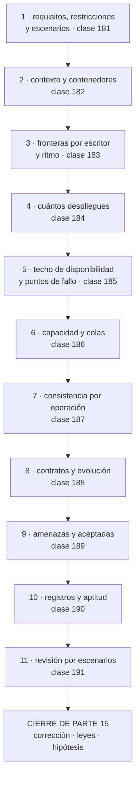

# 192 — Proyecto: arquitectura completa de CloudShop

> [← Clase anterior](../../part-15-systems-architecture-engineering/191-architecture-review-y-comunicacion-con-stakeholders/README.md) · [Índice de la parte](../README.md) · [Clase siguiente →](../../part-16-advanced-cloud-networking-edge/193-cidr-subnetting-y-planificacion-ip-a-escala/README.md)

**Parte:** 15 — Arquitectura de sistemas e ingeniería de requisitos<br>
**Nivel:** intermedio-avanzado · **Horas estimadas:** 8<br>
**Laboratorio:** `capstone` · **Estado:** `EXECUTABLE_CORE`

## 🎯 Propósito

Aplicar las once clases anteriores a una arquitectura completa de CloudShop y comprobar si se sostiene. La clase da el guion del proyecto, el orden en que se toman las decisiones, el documento que hay que entregar y los criterios con que se evalúa. Y cierra la parte 15: corrige las cinco predicciones de la clase 180 —dos acertadas, tres a medias—, actualiza el recuento de leyes, añade la ley 24 y escribe la hipótesis de la parte 16.

## 📚 Resultados de aprendizaje

Al finalizar podrás:

1. **Producir** una arquitectura completa con el método de toda la parte.
2. **Ordenar** las decisiones de la más cara de cambiar a la más barata.
3. **Entregar** un documento que resista una revisión por escenarios.
4. **Corregir** las cinco predicciones de la clase 180 con evidencia.
5. **Escribir** la hipótesis de la parte 16 en forma refutable.

## 🧩 Conceptos centrales

| Concepto | Comprensión verificable |
|---|---|
| `arquitectura completa` | Conjunto coherente de decisiones que cubre requisitos, fronteras, fiabilidad, capacidad, datos, contratos, amenazas y gobierno. |
| `orden de decisión` | Secuencia por coste de cambio: primero lo caro, después lo barato y con datos. |
| `coherencia` | Que las decisiones no se contradigan entre sí. Se comprueba cruzando escenarios con decisiones. |
| `entregable` | El documento que otra persona puede revisar y usar para construir. |
| `ley 24` | Lo que no está en el diagrama no se analiza, y lo que se omite es siempre del mismo tipo. |
| `hipótesis de parte` | Afirmación refutable escrita antes de estudiar, que la parte siguiente corrige con evidencia. |

## 🧠 Modelo mental

Una arquitectura es un conjunto de decisiones sobre estructuras, interfaces y atributos de calidad, respaldadas por escenarios y evidencia.

Aplicado a esta clase, separa siempre cuatro planos: **intención** (qué necesita el usuario),
**configuración** (qué declaramos), **estado observado** (qué existe de verdad) y
**evidencia** (cómo sabemos que cumple). Confundirlos produce diseños que se ven correctos
en un diagrama pero fallan al operar.

## 🗺️ Flujo de razonamiento



## 📖 Desarrollo

### 1. El encargo y su orden

**El encargo.** CloudShop quiere rehacer su plataforma de pedidos, que hoy es un sistema heredado de nueve años con sesenta equipos alrededor. El proyecto consiste en producir la arquitectura, no en construirla.

```text
lo que se entrega
  el documento de arquitectura completo
  las decisiones registradas
  la lista de riesgos de su propia revisión
  y lo que se decidió NO hacer
```

**El orden de las decisiones**, que es el mismo criterio de coste de cambio de la clase 181:

```text
1  REQUISITOS Y ESCENARIOS                          clase 181
   funcionales, restricciones comprobadas y 6-8 escenarios
   medibles, con los conflictos resueltos

2  CONTEXTO Y CONTENEDORES                          clase 182
   C1 y C2, con flechas anotadas y quién escribe cada almacén

3  FRONTERAS                                        clase 183
   por escritor de dato y por ritmo de cambio, con el
   porcentaje de cambios acoplados del histórico

4  DESPLIEGUES                                      clase 184
   cuántas unidades, con uno de los cinco motivos y su cifra

5  FIABILIDAD                                       clase 185
   techo calculado, duras convertidas en blandas, análisis
   de puntos de fallo con las cuatro preguntas

6  CAPACIDAD                                        clase 186
   concurrencia con Little, codo con modelo abierto, margen
   que cubra la pérdida de una zona

7  CONSISTENCIA                                     clase 187
   por operación, con la consecuencia de negocio

8  CONTRATOS                                        clase 188
   qué es contrato, cómo evoluciona, cómo se retira

9  AMENAZAS                                         clase 189
   flujos, fronteras de confianza, y las aceptadas por escrito

10 GOBIERNO                                         clase 190
   registros con premisas y funciones de aptitud

11 REVISIÓN                                         clase 191
   por escenarios, con riesgos, dueños y fechas
```

Y dos reglas sobre el orden:

```text
los pasos 1 a 4 condicionan todo lo demás y se hacen primero
los pasos 5 a 7 pueden obligar a volver al 3 o al 4
→ volver es normal; lo anormal es no volver nunca
```

Y el error de método que más se comete en este proyecto:

```text
empezar por el paso 2, dibujando
→ el diagrama sale bonito y no responde a ningún escenario
→ y las fronteras se copian del organigrama            ley 21
```

### 2. El entregable y su evaluación

**El documento**, que cabe en unas quince páginas y no debe tener más:

```text
1  PROBLEMA Y CONTEXTO
   la cifra que demuestra que hay un problema
   lo que se descubrió que no se sabía              clase 178

2  REQUISITOS
   funcionales en una lista corta
   restricciones, con la evidencia de que son reales
   escenarios de calidad medibles, con punto de medida
   conflictos y quién cede
   lo que el sistema NO hará

3  ARQUITECTURA
   C1 y C2 con flechas anotadas
   fronteras, con el criterio que las sitúa
   despliegues, con el motivo de cada separación
   vista de datos: quién escribe qué

4  PROPIEDADES
   techo de disponibilidad, calculado
   puntos únicos de fallo, con los no técnicos
   capacidad: codo, margen y concurrencia
   consistencia por operación

5  EVOLUCIÓN
   contratos y su versionado
   plan de retirada de lo viejo

6  SEGURIDAD
   flujos y fronteras de confianza
   amenazas mitigadas y ACEPTADAS con nombre y fecha

7  GOBIERNO
   registros de decisión (los caros de cambiar)
   funciones de aptitud

8  RIESGOS
   de la propia revisión, con dueño y fecha

9  LO QUE NO SE HACE, y por qué
```

**Los criterios de evaluación**, publicados antes de empezar:

```text                                                     peso
1  los escenarios son medibles y tienen punto de medida    2
2  las restricciones están comprobadas, no supuestas       1
3  las fronteras se justifican con datos del histórico     3
4  cada separación en servicio tiene motivo y cifra        2
5  el techo de disponibilidad está calculado               2
6  el análisis de fallos incluye los no técnicos           3
7  la capacidad usa Little y modelo abierto                2
8  la consistencia se decide por operación                 3
9  los contratos tienen plan de retirada                   1
10 hay amenazas ACEPTADAS por escrito                      2
11 los registros tienen premisas y alternativas            2
12 la revisión produjo riesgos que el diseño no veía       3
13 está escrito lo que NO se hace                          1
14 hay al menos una decisión marcada como equivocada       3
```

Y el criterio 14 pesa como los que más, por el mismo motivo que en la clase 178:

```text
un proyecto sin ninguna decisión corregida no se ha revisado
→ y el archivo de decisiones sin ninguna superada es un
  archivo de justificaciones                        clase 190
```

Y tres errores que hunden este proyecto:

```text
ESCENARIOS QUE SON ADJETIVOS
  «rápido», «escalable», «seguro»
  → no se puede diseñar contra eso                  clase 181

SEPARAR EN SERVICIOS SIN DIVIDIR DATOS
  → monolito distribuido                            clase 184

PROMETER UNA DISPONIBILIDAD SIN CALCULARLA
  → se incumple por aritmética                      clase 185
```

### 3. Cierre de la parte 15: corrección de las cinco predicciones

**Las cinco predicciones de la clase 180, corregidas con la evidencia de las clases 181 a 191.**

```text
1. «la parte 15 formalizará con vocabulario lo que el programa
    ya obtuvo por evidencia; el valor no estará en los nombres
    sino en poder discutir una decisión antes de tomarla»

   CORRECTA, y en las dos mitades. Casi todo lo de esta parte
   ya había aparecido: el acoplamiento por datos era la ley 21
   desde la clase 147; el techo de disponibilidad se había
   calculado en la 164; el codo con modelo abierto salió en la
   129. Lo que añadió la parte fue poder discutirlo antes:
   el registro 007 cerró en diez minutos una propuesta que
   habría costado dos semanas de discusión.

2. «de los atributos de calidad, el que más decisiones cambiará
    será la modificabilidad, porque es el único que se paga
    todos los meses»

   A MEDIAS, y la distinción importa. La modificabilidad decidió
   la ESTRUCTURA: las fronteras de la clase 183, la separación
   de precios de la 184 y el escenario QA-3 que nadie había
   pedido con esas palabras. Pero contando decisiones una a una,
   la disponibilidad cambió más cosas: once puntos únicos de
   fallo, cinco conversiones de dependencia, y el techo que
   obligó a renegociar una promesa contractual. Acertamos qué
   atributo decide la arquitectura y fallamos al confundirlo
   con el que decide más veces.

3. «la frontera correcta coincidirá con quién escribe cada dato
    en más del 70 % de los casos»

   CASI. De las seis decisiones de frontera de la clase 183,
   cuatro las decidió el escritor del dato (67 %) y dos el
   ritmo de cambio. La cifra se quedó tres puntos corta, y el
   mecanismo era el correcto: el criterio del escritor colocó
   la mayoría de las fronteras, y ninguna de las que colocó
   hubo que mover después.

4. «el análisis de puntos de fallo encontrará que la mayoría de
    los puntos únicos no son de infraestructura sino de
    conocimiento y de procedimiento»

   PRIMERA MITAD CORRECTA Y SUBESTIMADA: 8 de 11 no eran de
   infraestructura (73 %). SEGUNDA MITAD MAL REPARTIDA: los de
   conocimiento y procedimiento sumaban 5 de 11 (45 %), que no
   es mayoría. Los otros tres eran de datos y de respuesta
   degradada, una categoría que la predicción no contemplaba
   y que resultó ser de las que más daño hacen: una réplica
   lenta es peor que una caída.

5. «los registros de decisión y las funciones de aptitud
    fracasarán como los controles: si estorban, se rodean; y
    el registro se rellenará después de decidir, para cumplir»

   PRIMERA MITAD CORRECTA: dos de once funciones de aptitud se
   retiraron, y una de ellas —el límite de tamaño de fichero—
   había generado cuarenta y una excepciones sin detectar un
   solo problema real. SEGUNDA MITAD NO SE CUMPLIÓ, y no por
   suerte: se cumplió lo contrario porque se adoptó la práctica
   de escribir el borrador ANTES de decidir. Predijimos un
   fracaso que era evitable con una regla de método, y no
   habíamos previsto la regla.
```

**Marcador: dos correctas, tres a medias.** Y el patrón de los fallos es el mismo de la parte 14: **acertamos los mecanismos y fallamos los repartos**. Predecir qué fuerza actúa resulta más fácil que predecir cuánto pesa cada una.

**El recuento de leyes, cerrada la parte 15.**

```text
ley 13  lo que no se mira deja de funcionar en silencio        33
ley 15  la señal existe y nadie la mira                        25
ley 14  el coste se decide al crear, no al pagar               22
ley 22  un procedimiento nunca ejecutado no funciona           20
ley 16  un control que estorba se rodea                        20
ley 21  el acoplamiento vive en quién escribe                  17
ley 20  lo que no tiene dueño se filtra y se desperdicia       16
ley 19  la compensación hace invisible el fallo                10
ley 17  se optimiza la medida, no el objetivo                  10
ley 18  lo asíncrono traslada la garantía, no la elimina        8
ley 23  la capacidad la limita lo que ya se mantiene            7
```

Y la parte 15 obliga a escribir una ley nueva:

```text
LEY 24
  lo que no está en el diagrama no se analiza,
  y lo que se omite del diagrama es siempre del mismo tipo

apariciones en esta parte                                      4
  clase 182   5 elementos reales no dibujados, entre ellos un
              punto de entrada externo con 3 años de vida
  clase 185   8 de 11 puntos únicos no aparecían en ningún
              diagrama
  clase 189   8 de 19 amenazas estaban en las 3 fronteras que
              faltaban: webhook, canalización y salida a
              analítica
  clase 191   los 3 riesgos que el equipo no vio eran de
              operación y de dependencia organizativa

y lo que se omite es siempre lo mismo
  lo que entra de fuera sin que lo llamemos nosotros
  lo que despliega en vez de servir
  lo que sale hacia analítica o hacia terceros
  lo que hacen las personas
```

### 4. La hipótesis de la parte 16

**Escrita antes de estudiar la parte 16 (clases 193 a 204, redes en profundidad), para que la clase 204 la corrija con evidencia:**

```text
1. la red va a resultar ser la capa donde más decisiones
   irreversibles se toman con menos deliberación: los rangos
   de direcciones y el diseño de conectividad se eligen en
   una tarde y condicionan una década                 ley 14

2. de todos los problemas de red que aparezcan, la mayoría no
   serán de encaminamiento ni de rendimiento sino de NOMBRES
   Y CERTIFICADOS: resolución, propagación y caducidad

3. el coste de salida y el tráfico entre zonas volverán a ser
   la línea más grande y la peor atribuida, como en la
   clase 168; y seguirá sin tener dueño                ley 20

4. la malla de servicios aparecerá otra vez como respuesta a
   problemas que ya están resueltos en otra capa, y el
   análisis honesto volverá a dejarla en una o dos capacidades
   que sí aporta                                    clase 152

5. el diagnóstico de red será donde más se note la ley 24: los
   diagramas de red omitirán sistemáticamente lo mismo —lo que
   entra de fuera, lo que sale a terceros y las rutas que
   alguien añadió a mano— y ahí estarán los incidentes
```

Y el cierre de la parte 15: **de once clases, lo que más problemas destapó no fue ninguna técnica nueva, sino mirar el sistema con una pregunta que nadie hacía**: quién escribe este dato, qué pasa si esto responde lento en vez de caerse, y qué hay funcionando que no está dibujado. La parte 16 baja una capa —a las direcciones, las rutas, los nombres y los certificados— y empieza por la decisión que más veces se toma sin pensarla: el plan de direccionamiento. Es la clase 193.

## 🔬 Ejemplo trabajado

**La arquitectura de pedidos de CloudShop, resuelta con el método de la parte. Lo que sigue es el resumen del entregable, con las cifras que decidieron cada paso y las dos decisiones que hubo que corregir durante el propio proyecto.**

**Paso 1 · Requisitos y escenarios.**

```text
el problema, con cifra
  el plazo medio para poner en producción un cambio de
  catálogo es de 5 semanas; 3 competidores lo hacen en días
  y el margen por pedido cayó de 4,10 € a 3,25 € en 2 años

restricciones comprobadas
  AWS por compromiso de consumo hasta 2029          real
  datos de clientes de la UE en la UE               legal
  el sistema de facturación no se toca              real
  27 personas en 4 equipos; no hay más este año     real
  «para el Black Friday»    → ¿y si no?             NO era
                              restricción: la campaña se
                              lanza igual

escenarios (7, medibles)
  QA-1  p99 del listado ≤ 300 ms en el borde, a 8.000/s
  QA-2  el flujo de compra 99,9 % mensual
  QA-3  añadir una categoría de producto nueva en ≤ 3 días,
        sin coordinar despliegues
  QA-4  alcance desde un servicio comprometido: ≤ 2 almacenes
  QA-5  restaurar tras borrado: pérdida ≤ 5 min, servicio
        ≤ 1 h, MEDIDO
  QA-6  diagnóstico del flujo de compra en ≤ 10 min desde el
        móvil
  QA-7  coste por pedido ≤ 0,21 €

conflictos resueltos
  QA-1 × QA-3   cede QA-1 de 300 a 380 ms; acepta producto
  QA-2 × QA-7   cede QA-2 de 99,9 % a 99,8 %; sin segunda
                región activa; acepta dirección de tecnología

lo que NO hará
  no sustituye facturación
  no gestiona el almacén físico
  no soporta suscripciones en esta fase
  no se internacionaliza fuera de la UE
```

**Paso 3 · Fronteras, con datos del histórico.**

```text
cambios acoplados, 18 meses
  catálogo × precios                   68 %   → juntos o
                                              precio fuera
  pedidos × pagos                      74 %   → juntos
  catálogo × inventario                12 %   → separados
  pedidos × envíos                     31 %   → dudoso
  clientes × marketing                  4 %   → separados

ritmo de cambio
  precios                 11/mes   revenue
  contenido de catálogo    2/mes   producto
  reglas de envío          7/mes   logística
  flujo de pedido          2/mes   producto
  inventario               1/mes   operaciones

escritores actuales, del C2
  tabla de catálogo        4 escritores  ← el problema
  tabla de pedidos         3 escritores
  tabla de inventario      3 escritores

fronteras resultantes (6)
  pedidos+pagos · precios · catálogo · inventario ·
  envíos · clientes

  decididas por escritor de dato                   4
  decididas por ritmo de cambio                    2
```

**Paso 4 · Despliegues: 4, no 6.**

```text
monolito modular   pedidos+pagos, catálogo, clientes
precios            servicio   motivo 1 (11/mes vs 2) y 3
envíos             servicio   motivo 5 (equipo de logística real)
inventario         servicio   motivo 4 (dato compartido con el
                              almacén físico, otro régimen)

coste marginal   3 × 2,7 = 8,1 días-persona/mes sobre 540
                 → 1,5 % de la capacidad
```

**Paso 5 · Fiabilidad: el techo obligó a renegociar.**

```text
techo inicial del flujo de compra
  borde 99,99 × API 99,95 × base 99,99 × precios 99,90
  × inventario 99,90 × pasarela 99,95 × identidad 99,99
  = 99,67 %

prometido en QA-2 (ya cedido)                    99,80 %
→ incumplido por aritmética

conversiones
  precios      → último valor válido, 15 min        blanda
  identidad    → validación local                   fuera
  inventario   → NO convertible: vender sin stock cuesta más
                 que no vender

techo final   99,84 %      cumple

puntos únicos encontrados                            13
  de infraestructura                                  4
  de datos                                            2
  de respuesta degradada                              2
  de conocimiento                                     2
  de procedimiento                                    3
→ 9 de 13 no aparecían en el C2
```

**Paso 6 · Capacidad.**

```text
Little sobre el listado
  λ objetivo 8.000/s, W 45 ms → L = 360 simultáneas
  grupo dimensionado para ρ = 0,65 → 554 conexiones
  el almacén admite 400
  → decisión: caché de listado con 92 % de aciertos,
    λ efectiva al almacén 640/s → L = 29

codo, modelo abierto, catálogo completo
  medido            7.400/s
  prueba cerrada previa decía        19.000/s   ×2,6

margen
  pico previsto 8.000/s; 3 zonas; ρ objetivo 0,65
  capacidad = 8.000 / (0,65 × 0,66) = 18.650/s
```

**Paso 7 · Consistencia, por operación.**

```text
comprar (reserva de stock)      linealizable   fila por unidad
cobrar                          fuerte + idem.
ver mi pedido                   de sesión
listar catálogo                 eventual ≤ 5 s
ver precio                      eventual ≤ 15 min
panel de ventas                 eventual ≤ 60 s, marcado

de 6, dos necesitan garantía fuerte, y son el 4 % del tráfico
```

**Las dos decisiones que hubo que corregir durante el proyecto:**

```text
CORRECCIÓN 1   envíos se había separado por motivo 1
  la cifra decía 7 cambios/mes frente a 2
  al revisar el histórico con más detalle, 5 de esos 7 eran
  cambios de TARIFA, un dato, no de lógica
  → el motivo real era el 5 (equipo de logística propio),
    no el 1
  → la separación se mantiene, pero por otra razón, y eso
    cambia qué sale con ella: las tarifas se quedan como
    dato con un escritor, no como servicio

CORRECCIÓN 2   inventario iba a ser eventual
  premisa   «el stock se puede ajustar después»
  la revisión por escenarios preguntó qué pasa en Black
  Friday con 400 pedidos/s sobre 12 unidades
  → sobreventa de 300 unidades en 40 segundos
  → la premisa venía de la operación en días normales
  → decisión corregida: linealizable con fila por unidad
  registro 014, superando el 009
```

**El resultado de la revisión por escenarios:**

```text
riesgos encontrados                                  11
  que el equipo ya conocía                            7
  que NO conocía                                      4
    · el plazo de 20 s hacia la pasarela
    · la línea de cambios no incluye banderas de función
    · QA-3 imposible mientras la conciliación viva en
      facturación
    · las tarifas de envío las escribe también un fichero
      que sube logística a mano cada lunes

los 4 los encontraron revisores de operación y de datos
```

Y el último es el que mejor resume la parte:

```text
un fichero subido a mano cada lunes escribía un dato que
el diseño daba por tener un solo escritor
→ no estaba en ningún diagrama                        ley 24
→ no lo sabía nadie del equipo de arquitectura
→ y llevaba cuatro años funcionando
```

**Lo que se decidió no hacer, escrito:**

```text
no se separa catálogo de contenido: 2 cambios/mes no lo
  justifican
no se monta segunda región activa: 7.900 €/mes frente a
  510 €/mes de pérdida esperada
no se adopta malla de servicios: de sus 5 capacidades, 4 ya
  están resueltas                                 clase 152
no se migra facturación: fuera de alcance, y declarado como
  deuda con fecha de revisión a 12 meses
```

**La lección que este proyecto deja**: de las once clases de la parte, la que más cambió el resultado no fue ninguna de las técnicas —fue **preguntar quién escribe cada dato**, que colocó cuatro de las seis fronteras y descubrió un fichero que alguien subía a mano los lunes. Y las dos decisiones que hubo que corregir **se corrigieron por la misma causa**: una premisa que venía de la operación en días normales y que nadie había comprobado contra el escenario que importaba.

## 🧪 Laboratorio guiado

Ejecuta desde la raíz:

```bash
python classes/part-15-systems-architecture-engineering/192-proyecto-arquitectura-completa-de-cloudshop/lab.py
```

El laboratorio selecciona el motor de práctica **`capstone`** y produce
`lab_result.json`. El escenario, sus comprobaciones y el artefacto esperado corresponden a
esta clase; no requiere credenciales y deja explícito qué debe revalidarse en un sandbox real.

1. Lee `exercise.steps` y formula una predicción antes de ejecutar.
2. Ejecuta la práctica y verifica todos los elementos de `checks`.
3. Provoca el caso de `negative_test` y explica la señal observada.
4. Materializa `cloudshop-system-design` en `evidence/` usando la plantilla indicada.
5. Para proveedor real, sigue `sandbox.requires`, registra costo y ejecuta `destroy`.

### Evidencia esperada

El artefacto principal es un incremento integrado, demostrable y documentado. Además, la entrega debe incluir el comando ejecutado,
la salida estructurada y una conclusión que no exceda lo observado.

## 🏆 Reto verificable

Construye **`cloudshop-system-design`** para el caso CloudShop. Incluye una alternativa descartada,
un supuesto que pueda falsarse, una prueba de fallo y una decisión de rollback.

## ✅ Criterio de aceptación

- [ ] `lab.py` termina con código 0 y genera JSON válido.
- [ ] La entrega conecta al menos tres requisitos con mecanismos verificables.
- [ ] Existe una prueba positiva y una prueba negativa con evidencia.
- [ ] Seguridad, costo y operación aparecen como decisiones, no como anexos.
- [ ] Se declara una limitación y una condición que obligaría a revisar el diseño.
- [ ] Otra persona puede repetir el recorrido sin conocimiento tácito.

## ⚠️ Errores frecuentes

| Síntoma | Causa probable | Corrección |
|---|---|---|
| El diagrama sale bonito y no responde a ninguna pregunta | Se empezó dibujando en vez de escribiendo escenarios | Empieza por requisitos, restricciones comprobadas y escenarios medibles; dibuja después. |
| Las fronteras acaban copiando el organigrama | No se usaron datos del histórico para situarlas | Calcula cambios acoplados y ritmo de cambio, e identifica quién escribe cada almacén. |
| La disponibilidad prometida se incumple desde el primer día | Se prometió sin calcular el techo de dependencias duras | Multiplica las duras, convierte las que puedas en blandas y renegocia la promesa antes de firmarla. |
| Una decisión de consistencia funciona en días normales y falla en campaña | La premisa venía de la operación habitual y no se contrastó con el escenario extremo | Recorre cada decisión contra el escenario de calidad más exigente antes de cerrarla. |
| El proyecto no tiene ninguna decisión corregida | No se revisó de verdad, o se corrigió sin dejar constancia | Marca las decisiones superadas y escribe qué premisa falló; es la parte más valiosa del archivo. |
| Aparece un escritor de datos que nadie conocía | Solo se analizó lo que estaba dibujado | Contrasta el diagrama con las dependencias observadas y busca en concreto lo que entra de fuera, lo que sale a terceros y lo que hacen las personas a mano. |

## 🛡️ Seguridad, ética y costo

Trabaja con cuentas propias o sandboxes autorizados. No publiques secretos, identificadores
reales ni datos personales. Antes de crear recursos pagos define presupuesto, etiquetas y
comando de destrucción; después verifica que no queden recursos huérfanos. Los ejemplos
locales enseñan contratos, pero no certifican cumplimiento ni disponibilidad de producción.

## ❓ Preguntas de comprobación

1. ¿Por qué los pasos 1 a 4 se hacen antes que los demás?
2. ¿Qué criterio de evaluación pesa como los que más y por qué?
3. ¿Cuál de las cinco predicciones de la clase 180 falló y en qué mitad?
4. ¿Qué dice la ley 24 y qué cuatro cosas se omiten siempre de los diagramas?
5. ¿Qué pregunta colocó cuatro de las seis fronteras del proyecto?

## 🔗 Referencias

- Bass, L., Clements, P. y Kazman, R. (2021). *Software Architecture in Practice*, 4.ª ed. <https://www.oreilly.com/library/view/software-architecture-in/9780136886051/>
- Ford, N., Richards, M. y otros (2021). *Software Architecture: The Hard Parts* — decisiones con compromisos explícitos. <https://www.oreilly.com/library/view/software-architecture-the/9781492086888/>
- Kleppmann, M. (2017). *Designing Data-Intensive Applications*. <https://dataintensive.net/>
- AWS (2025). *Well-Architected Framework*. <https://docs.aws.amazon.com/wellarchitected/latest/framework/welcome.html>
- Google (2025). *Cloud Architecture Framework*. <https://cloud.google.com/architecture/framework>
- Documentación oficial vigente del servicio implementado; registra URL y fecha de consulta.

---

> [Evaluación](assessment.md) · [Contrato de clase](lesson.yaml) · [Índice de la parte](../README.md)
