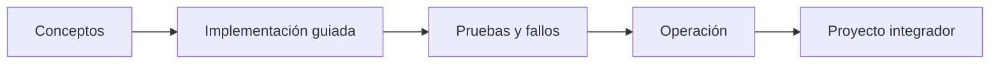

# Parte 15 — Arquitectura de sistemas e ingeniería de requisitos

> [← Parte 14](../part-14-advanced-platform-capstones-career/README.md) · [Índice completo](../README.md) · [Parte 16 →](../part-16-advanced-cloud-networking-edge/README.md)

**Nivel:** intermedio-avanzado · **Clases:** 12 · **Duración sugerida:** 6–8 semanas

Pasar de requisitos ambiguos a arquitecturas comprobables antes de elegir servicios cloud.

## Resultados de la parte

Al completar esta parte podrás explicar el dominio con lenguaje independiente del proveedor,
implementar sus mecanismos esenciales, diagnosticar fallos y defender decisiones mediante
evidencia, costo, seguridad y objetivos de confiabilidad.

## Modelo mental

Una arquitectura es un conjunto de decisiones sobre estructuras, interfaces y atributos de calidad, respaldadas por escenarios y evidencia.

## Secuencia

## Clases

| ID | Clase | Laboratorio | Horas |
|---:|---|---|---:|
| 181 | [Requisitos funcionales, restricciones y atributos de calidad](181-requisitos-funcionales-restricciones-y-atributos-de-calidad/README.md) | `architecture` | 4 |
| 182 | [Contexto, contenedores, componentes y código con C4](182-contexto-contenedores-componentes-y-codigo-con-c4/README.md) | `architecture` | 4 |
| 183 | [Acoplamiento, cohesión, modularidad y fronteras](183-acoplamiento-cohesion-modularidad-y-fronteras/README.md) | `architecture` | 4 |
| 184 | [Arquitectura monolítica, modular y de microservicios](184-arquitectura-monolitica-modular-y-de-microservicios/README.md) | `decision` | 4 |
| 185 | [Disponibilidad, confiabilidad y análisis de puntos de fallo](185-disponibilidad-confiabilidad-y-analisis-de-puntos-de-fallo/README.md) | `reliability` | 4 |
| 186 | [Capacidad, latencia, throughput y teoría de colas](186-capacidad-latencia-throughput-y-teoria-de-colas/README.md) | `performance` | 4 |
| 187 | [Consistencia, particiones, relojes y consenso](187-consistencia-particiones-relojes-y-consenso/README.md) | `distributed` | 4 |
| 188 | [Contratos de API, eventos y compatibilidad evolutiva](188-contratos-de-api-eventos-y-compatibilidad-evolutiva/README.md) | `api` | 4 |
| 189 | [Modelado de amenazas y arquitectura de confianza cero](189-modelado-de-amenazas-y-arquitectura-de-confianza-cero/README.md) | `security` | 4 |
| 190 | [ADRs, fitness functions y gobierno de decisiones](190-adrs-fitness-functions-y-gobierno-de-decisiones/README.md) | `architecture` | 4 |
| 191 | [Architecture review y comunicación con stakeholders](191-architecture-review-y-comunicacion-con-stakeholders/README.md) | `governance` | 4 |
| 192 | [Proyecto: arquitectura completa de CloudShop](192-proyecto-arquitectura-completa-de-cloudshop/README.md) | `capstone` | 8 |

## Evaluación de la parte

- 35 % laboratorios y evidencia reproducible.
- 25 % retos verificables.
- 20 % decisiones y ADR.
- 10 % seguridad, confiabilidad y costo.
- 10 % proyecto integrador de la parte.

Se aprueba con 80 % de clases en nivel B o superior y el proyecto integrador reproducible.

## Pauta bibliográfica

- Software Architecture in Practice — Bass, Clements y Kazman.
- Fundamentals of Software Architecture — Richards y Ford.
- Designing Data-Intensive Applications — Martin Kleppmann.
