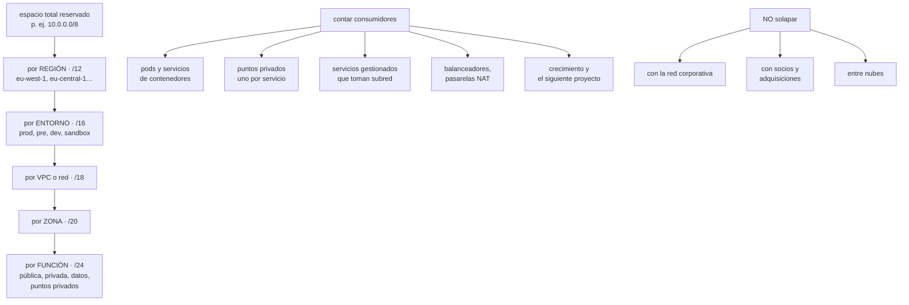

# 193 — CIDR, subnetting y planificación IP a escala

> [← Clase anterior](../../part-15-systems-architecture-engineering/192-proyecto-arquitectura-completa-de-cloudshop/README.md) · [Índice de la parte](../README.md) · [Clase siguiente →](../../part-16-advanced-cloud-networking-edge/194-routing-bgp-transito-y-propagacion-de-rutas/README.md)

**Parte:** 16 — Redes cloud avanzadas, conectividad híbrida y edge<br>
**Nivel:** avanzado · **Horas estimadas:** 4<br>
**Laboratorio:** `network` · **Estado:** `EXECUTABLE_CORE`

## 🎯 Propósito

Diseñar un plan de direccionamiento que aguante diez años, porque es la decisión que más veces se toma en una tarde y menos veces se puede deshacer. La clase da la aritmética de CIDR sin rodeos, el método de asignación jerárquica que evita el solapamiento, la lista de consumidores de direcciones que siempre se olvidan, y el procedimiento de renumeración para cuando ya es tarde.

## 📚 Resultados de aprendizaje

Al finalizar podrás:

1. **Calcular** rangos, máscaras y capacidad de un bloque CIDR sin herramientas.
2. **Asignar** direcciones jerárquicamente por región, entorno y función.
3. **Dimensionar** contando los consumidores que no se ven.
4. **Evitar** el solapamiento que impide interconectar más adelante.
5. **Renumerar** una red en producción cuando el plan se agotó.

## 🧩 Conceptos centrales

| Concepto | Comprensión verificable |
|---|---|
| `CIDR` | Notación de bloque de direcciones: prefijo y longitud. /24 son 256 direcciones, /16 son 65.536. |
| `asignación jerárquica` | Repartir un bloque grande en trozos por región, entorno y función, de forma que cada nivel resuma en una sola ruta. |
| `solapamiento` | Dos redes que usan el mismo rango. Impide conectarlas sin traducción y es el error más caro. |
| `resumen de rutas` | Anunciar un bloque grande en vez de muchos pequeños. Depende de que la asignación sea contigua. |
| `consumidor oculto` | Lo que gasta direcciones sin que nadie lo cuente: servicios gestionados, contenedores, puntos privados. |
| `renumeración` | Cambiar el direccionamiento de una red viva. Cara, larga y evitable con un plan inicial correcto. |

## 🧠 Modelo mental

La red cloud es un sistema distribuido de rutas, identidades y políticas; cada salto añade latencia, costo y una frontera de fallo.

Aplicado a esta clase, separa siempre cuatro planos: **intención** (qué necesita el usuario),
**configuración** (qué declaramos), **estado observado** (qué existe de verdad) y
**evidencia** (cómo sabemos que cumple). Confundirlos produce diseños que se ven correctos
en un diagrama pero fallan al operar.

## 🗺️ Flujo de razonamiento



## 📖 Desarrollo

### 1. La aritmética, sin herramientas

Un plan de direccionamiento se discute en una pizarra, y para eso hay que saber contar sin calculadora.

```text
la longitud del prefijo dice cuántos bits FIJA
32 - longitud = bits libres = direcciones

/8    16.777.216      /20     4.096
/12    1.048.576      /21     2.048
/16       65.536      /22     1.024
/17       32.768      /23       512
/18       16.384      /24       256
/19        8.192      /26        64
                      /28        16
```

Y dos reglas que evitan el 90 % de los errores de cálculo:

```text
cada bit menos de prefijo DUPLICA el tamaño
  /24 → /23 → /22 → /21   256, 512, 1.024, 2.048

un bloque siempre empieza en un múltiplo de su tamaño
  10.0.4.0/22 es válido      (4 es múltiplo de 4)
  10.0.5.0/22 NO es válido
```

Y lo que se pierde por bloque, que en subredes pequeñas es mucho:

```text
direcciones reservadas por subred
  red y difusión                                   2
  las nubes reservan además entre 3 y 5

  /24  →  ~251 usables
  /28  →  ~11 usables    ← el 31 % perdido
→ por eso no conviene bajar de /26 en subredes de trabajo
```

Y los espacios privados disponibles, que es lo primero que se reparte:

```text
10.0.0.0/8         16,7 M    el grande; el que se usa
172.16.0.0/12       1,0 M    ojo: muchos productos lo usan
                             por defecto
192.168.0.0/16     65 K      doméstico; no usar en empresa
100.64.0.0/10       4,2 M    espacio compartido; útil para
                             lo que nunca se enruta
```

Y una advertencia sobre el segundo:

```text
172.17.0.0/16 es el rango por defecto de un motor de
contenedores muy extendido
→ usarlo en la red corporativa produce fallos intermitentes
  y difíciles de diagnosticar
```

### 2. Asignación jerárquica

El plan que funciona reparte de arriba abajo, y su virtud no es la elegancia: es que **cada nivel se puede resumir en una sola ruta**.

```text
NIVEL 0   el espacio de la organización
  10.0.0.0/8, reservado entero aunque se use el 2 %
  → y ANOTADO en un registro central                clase 169

NIVEL 1   por región         /12   (1 M de direcciones)
  10.0.0.0/12    eu-west-1
  10.16.0.0/12   eu-central-1
  10.32.0.0/12   us-east-1
  10.48.0.0/12   reservado
  → una ruta por región en la tabla central

NIVEL 2   por entorno        /16
  10.0.0.0/16    producción
  10.1.0.0/16    preproducción
  10.2.0.0/16    desarrollo
  10.3.0.0/16    sandbox
  10.4-15        reservado para crecer

NIVEL 3   por red o cuenta   /18 o /20

NIVEL 4   por zona           /20 o /22

NIVEL 5   por función        /24
  .0/24   pública (balanceadores, NAT)
  .1/24   privada de aplicación
  .2/24   datos
  .3/24   puntos privados      ← el que siempre falta
```

Y las tres reglas que hacen que el plan sobreviva:

```text
1. RESERVA MÁS DE LO QUE NECESITAS
   reservar no cuesta nada; renumerar cuesta meses
   → si crees que necesitas un /20, reserva un /16

2. DEJA HUECOS ENTRE BLOQUES
   asignar consecutivo sin huecos impide ampliar sin partir
   → el bloque siguiente al tuyo debe estar libre

3. QUE CADA NIVEL SEA CONTIGUO
   sin contigüidad no hay resumen de rutas
   → y las tablas de encaminamiento tienen límite duro
```

Y el límite que sorprende a mitad de proyecto:

```text
las tablas de rutas de las nubes tienen máximos
  típicamente entre 50 y 1.000 rutas
→ sin resumen, se llega antes de lo que parece
→ y ampliar el límite no siempre es posible
```

Y una decisión que conviene tomar al principio:

```text
¿IPv6 desde el día uno?
  a favor   no hay escasez; simplifica el plan; obligatorio
            en algunos servicios nuevos
  en contra doble pila duplica reglas y diagnósticos; no
            todos los productos lo soportan
  práctica  reservar el plan IPv6 aunque no se despliegue,
            y activarlo donde no cueste
```

### 3. Contar lo que no se ve

El agotamiento de direcciones casi nunca lo causan las máquinas: lo causan los consumidores que nadie contó.

```text
LO QUE SE CUENTA
  máquinas virtuales
  bases de datos

LO QUE NO SE CUENTA Y GASTA MÁS
  PODS DE CONTENEDORES
    en algunos modelos de red, cada pod toma una dirección
    de la subred → 110 pods por nodo × 40 nodos = 4.400
    → una subred /24 se agota con 2 nodos

  PUNTOS PRIVADOS
    uno por servicio y por subred                clase 200
    → 30 servicios × 3 zonas = 90 direcciones

  SERVICIOS GESTIONADOS QUE PIDEN SUBRED PROPIA
    bases gestionadas, motores de análisis, pasarelas
    → algunos exigen un /27 o /26 vacío y exclusivo

  BALANCEADORES Y PASARELAS NAT
    varias direcciones cada uno, por zona

  DESPLIEGUES ESCALONADOS
    durante un despliegue conviven dos versiones
    → hasta el doble de direcciones durante horas  clase 102

  ESCALADO AUTOMÁTICO
    hay que dimensionar por el MÁXIMO, no por el habitual
```

Y la regla de dimensionado que resulta de todo eso:

```text
calcula el máximo previsible y MULTIPLICA POR 2
→ y si el resultado es un /24, usa un /23
```

**El solapamiento**, que es el error más caro y el más frecuente:

```text
DÓNDE OCURRE
  dos equipos eligen 10.0.0.0/16 por defecto
  la nueva nube usa el mismo rango que la corporativa
  una empresa adquirida usa el mismo espacio
  un socio pide conexión y coincide
  el proveedor gestionado usa 172.17 por dentro

QUÉ IMPIDE
  conectar las dos redes sin traducción
  y la traducción rompe el diagnóstico, los registros y
  cualquier control basado en origen                clase 135
```

Y la prevención, que es barata:

```text
un REGISTRO CENTRAL de bloques asignados
  quién, para qué, desde cuándo, y estado
  y ninguna red se crea sin pedir el bloque ahí
→ automatizado en la plantilla de red nueva      clase 171
→ si pedir el bloque tarda tres días, alguien lo elegirá
  a mano                                              ley 16
```

### 4. Renumerar, cuando ya es tarde

Antes o después aparece una red que hay que renumerar. Es caro, pero no imposible, y hacerlo mal lo convierte en un corte.

```text
CUÁNDO ES INEVITABLE
  el bloque se agotó y no hay contiguo libre
  hay solapamiento con algo que hay que conectar
  una adquisición trae la misma red
```

**El procedimiento que evita el corte**, que es siempre el mismo patrón de expandir y contraer:

```text
1  AÑADIR el rango nuevo a la red existente
   la mayoría de las nubes permiten varios bloques por red

2  CREAR subredes nuevas en el rango nuevo

3  MOVER cargas, una a una, con despliegue escalonado
   → lo que se mueve primero: lo que no tiene dependencias
     entrantes por dirección

4  ACTUALIZAR lo que referencia direcciones
   ← aquí está el trabajo real, y es donde se descubre
     lo que nadie sabía

5  VACIAR y retirar las subredes viejas

6  QUITAR el bloque antiguo de la red
```

Y el paso 4 merece su lista, porque es lo que rompe:

```text
reglas de cortafuegos con direcciones fijas
listas de permitidos de terceros                   ← las peores
configuraciones con la dirección escrita a mano
rutas estáticas y túneles
registros de nombres con direcciones                clase 195
certificados emitidos para una dirección
controles de acceso a bases por dirección de origen
cuadros de mando y alertas que filtran por rango
```

Y una realidad sobre las listas de terceros:

```text
cambiar una dirección que un socio tiene en su lista de
permitidos requiere SU calendario, no el tuyo
→ semanas o meses
→ por eso el tráfico saliente hacia terceros conviene que
  salga siempre por direcciones fijas y pocas, reservadas
  desde el principio
```

Y la lista de comprobación de la clase:

```text
☐ hay un espacio reservado para toda la organización
☐ hay un registro central de bloques, y es obligatorio
☐ la asignación es jerárquica: región, entorno, red, zona,
  función
☐ cada nivel es contiguo y se puede resumir
☐ hay huecos reservados junto a cada bloque asignado
☐ el dimensionado cuenta pods, puntos privados y servicios
  gestionados
☐ el dimensionado usa el máximo, multiplicado por dos
☐ ninguna subred de trabajo baja de /26
☐ no se usa 172.17.0.0/16
☐ se ha comprobado el solapamiento con la red corporativa,
  socios y otras nubes
☐ el tráfico saliente hacia terceros usa direcciones fijas
  y pocas
☐ el plan IPv6 está reservado aunque no se despliegue
☐ se conocen los límites de rutas por tabla
```

Y el cierre que enlaza con la clase siguiente: con las direcciones repartidas, queda decidir cómo se anuncian y por dónde va cada paquete. Encaminamiento, BGP y propagación de rutas es la materia de la clase 194.

## 🔬 Ejemplo trabajado

**CloudShop tiene 214 cuentas, tres nubes y una red corporativa de quince años. Lo que sigue es el estado del direccionamiento que se encontró, el plan nuevo, y la renumeración de la red que impedía conectar con la empresa adquirida.**

**Lo que había, levantado en dos semanas:**

```text
redes encontradas                                     87
  con bloque registrado en algún sitio                19
  con bloque documentado en una hoja de cálculo       31
  sin registro alguno                                 37

solapamientos detectados
  10.0.0.0/16 usado en 6 redes distintas
  192.168.1.0/24 en 11 redes de desarrollo
  172.17.0.0/16 en la red corporativa Y en el motor
    de contenedores → causaba fallos intermitentes
    desde 2022, con 3 incidentes sin causa conocida

la adquisición
  la empresa comprada usa 10.0.0.0/16 para su producción
  → imposible conectar sin traducción
```

Y el diagnóstico de por qué había pasado:

```text
no existía registro central obligatorio
y pedir un bloque al equipo de red tardaba 6 días
→ los equipos elegían el rango por defecto de la plantilla
→ es exactamente el mecanismo de la clase 169         ley 16
```

**El plan nuevo.**

```text
espacio reservado          10.0.0.0/8   entero

NIVEL 1 · región                                     /12
  10.0.0.0/12     eu-west-1        (AWS, principal)
  10.16.0.0/12    eu-central-1     (AWS, secundaria)
  10.32.0.0/12    westeurope       (Azure)
  10.48.0.0/12    europe-west1     (GCP)
  10.64.0.0/12    corporativa
  10.80.0.0/12    adquisiciones    ← reservado a propósito
  10.96.0.0/11    libre

NIVEL 2 · entorno, dentro de cada región             /16
  x.0.0.0/16      producción
  x.1.0.0/16      preproducción
  x.2.0.0/16      desarrollo
  x.3.0.0/16      sandbox
  x.4-15          libre

NIVEL 3 · red por dominio de producto                /18
  10.0.0.0/18     pedidos
  10.0.64.0/18    catálogo
  10.0.128.0/18   datos y análisis
  10.0.192.0/18   libre

NIVEL 4 · zona                                       /20
NIVEL 5 · función                                    /24
  x.x.0.0/24      pública
  x.x.1.0/23      privada de aplicación   ← /23, ver abajo
  x.x.4.0/24      datos
  x.x.5.0/24      puntos privados
  x.x.6-15        libre
```

**El dimensionado, contando lo que no se ve.** El cálculo que cambió el plan:

```text
subred privada de aplicación, zona de producción de pedidos

  cálculo ingenuo
    40 máquinas + margen           →  /26  (64)

  cálculo real
    nodos de contenedores                        40
    pods por nodo                               110
    direcciones por pods                      4.400
    durante despliegue escalonado (×2)        8.800
    balanceadores internos                       12
    puntos privados (30 servicios × 3 zonas)     90
    bases gestionadas con subred propia        3 × 32
    margen de escalado al máximo               +30 %
    ────────────────────────────────────────────────
    total por zona                          ~11.900

  → /18 por zona, no /26
  → el plan inicial se habría agotado en 4 meses
```

Y la corrección que se hizo en el plan:

```text
se cambió el modelo de red de contenedores para que los
pods usen un rango separado y no enrutado
  100.64.0.0/10 para pods, no enrutado fuera del clúster
  → la subred de aplicación vuelve a caber en un /22
  → y las direcciones enrutables se reservan para lo que
    de verdad necesita ser alcanzable
```

**El registro central**, montado antes que nada:

```text
un bloque no se puede usar sin estar registrado
  quién lo pide, para qué, desde cuándo, estado

y la parte que lo hace funcionar
  la plantilla de red nueva PIDE el bloque automáticamente
  → tiempo de espera: 40 segundos, no 6 días
  → función de aptitud: ninguna red con bloque no
    registrado                                    clase 190

resultado a los 3 meses
  redes creadas                                     23
  con bloque del registro                           23
  elegidas a mano                                    0
```

**La renumeración de la red de producción de la adquisición.**

```text
situación   10.0.0.0/16, solapando con CloudShop
destino     10.80.0.0/18, dentro del espacio reservado
cargas      41 servicios, 2 bases, 6 túneles a socios

semana 1    añadir 10.80.0.0/18 a la red existente
semanas 2-3 crear subredes nuevas y mover 12 servicios sin
            dependencias entrantes por dirección
semanas 4-8 mover los 29 restantes, de 4 en 4
semanas 3-14 ACTUALIZAR REFERENCIAS   ← el trabajo real
```

Y lo que apareció en el paso de referencias:

```text
reglas de cortafuegos con direcciones fijas          214
rutas estáticas                                       31
configuraciones con dirección escrita a mano          88
  de ellas, en ficheros que nadie sabía que existían  19
listas de permitidos de terceros                       9
  plazo del más lento                            11 semanas
certificado emitido para una dirección                 1
controles de base de datos por origen                 17
alertas que filtran por rango                         23

hallazgos no buscados
  4 servicios que se creían retirados seguían recibiendo
    tráfico
  1 túnel a un socio que dejó de operar en 2021       ley 20
  2 reglas de cortafuegos que permitían todo el tráfico
    desde un rango de un proveedor que ya no se usaba
```

Y el resultado:

```text
duración total                            14 semanas
cortes de servicio                             0
  → gracias a convivir los dos rangos durante la migración
el plazo lo marcó                     una lista de permitidos
                                      de un socio: 11 semanas
coste estimado                     1,8 personas × 14 semanas
```

**La comparación que cierra el caso:**

```text
reservar el espacio y registrar los bloques al principio
  coste            2 días de trabajo
renumerar después
  coste            25 personas-semana, y el calendario de
                   un tercero
→ y esta es la razón por la que el plan de direccionamiento
  se decide con cuidado y pronto                      ley 14
```

**La lección que esta clase deja**: el plan inicial habría durado **cuatro meses** porque nadie contó los pods, y la corrección no fue pedir más direcciones sino **sacar los pods del espacio enrutable**. Y de las catorce semanas de renumeración, el plazo no lo marcó ninguna decisión técnica: lo marcó **la lista de permitidos de un socio**, que tenía su propio calendario.

## 🧪 Laboratorio guiado

Ejecuta desde la raíz:

```bash
python classes/part-16-advanced-cloud-networking-edge/193-cidr-subnetting-y-planificacion-ip-a-escala/lab.py
```

El laboratorio selecciona el motor de práctica **`network`** y produce
`lab_result.json`. El escenario, sus comprobaciones y el artefacto esperado corresponden a
esta clase; no requiere credenciales y deja explícito qué debe revalidarse en un sandbox real.

1. Lee `exercise.steps` y formula una predicción antes de ejecutar.
2. Ejecuta la práctica y verifica todos los elementos de `checks`.
3. Provoca el caso de `negative_test` y explica la señal observada.
4. Materializa `ipam-plan` en `evidence/` usando la plantilla indicada.
5. Para proveedor real, sigue `sandbox.requires`, registra costo y ejecuta `destroy`.

### Evidencia esperada

El artefacto principal es una topología con rutas, puertos y controles. Además, la entrega debe incluir el comando ejecutado,
la salida estructurada y una conclusión que no exceda lo observado.

## 🏆 Reto verificable

Construye **`ipam-plan`** para el caso CloudShop. Incluye una alternativa descartada,
un supuesto que pueda falsarse, una prueba de fallo y una decisión de rollback.

## ✅ Criterio de aceptación

- [ ] `lab.py` termina con código 0 y genera JSON válido.
- [ ] La entrega conecta al menos tres requisitos con mecanismos verificables.
- [ ] Existe una prueba positiva y una prueba negativa con evidencia.
- [ ] Seguridad, costo y operación aparecen como decisiones, no como anexos.
- [ ] Se declara una limitación y una condición que obligaría a revisar el diseño.
- [ ] Otra persona puede repetir el recorrido sin conocimiento tácito.

## ⚠️ Errores frecuentes

| Síntoma | Causa probable | Corrección |
|---|---|---|
| Dos redes que hay que conectar usan el mismo rango | No hubo registro central obligatorio y cada equipo eligió el valor por defecto | Reserva un espacio para toda la organización, exige registro para crear cualquier red y automatiza la petición para que tarde segundos. |
| Una subred se agota a los pocos meses | Se dimensionó contando máquinas y no pods, puntos privados ni servicios gestionados | Cuenta todos los consumidores, dimensiona por el máximo y multiplica por dos; saca los pods a un rango no enrutado si el modelo lo permite. |
| No se puede ampliar un bloque sin partirlo en dos | Los bloques se asignaron consecutivos, sin huecos | Deja libre el bloque contiguo a cada asignación y reserva por nivel más de lo que se necesita. |
| La tabla de rutas alcanza su límite | La asignación no es contigua y no se puede resumir | Asigna jerárquicamente y de forma contigua para anunciar un bloque por nivel. |
| Fallos intermitentes de red imposibles de diagnosticar | Un rango usado internamente por un producto solapa con la red corporativa | Evita 172.17.0.0/16 y comprueba qué rangos usan por dentro los productos gestionados antes de asignar. |
| Una renumeración se alarga meses más de lo previsto | Hay direcciones escritas en listas de permitidos de terceros | Haz que todo el tráfico saliente hacia terceros use direcciones fijas y pocas, reservadas desde el principio. |

## 🛡️ Seguridad, ética y costo

Trabaja con cuentas propias o sandboxes autorizados. No publiques secretos, identificadores
reales ni datos personales. Antes de crear recursos pagos define presupuesto, etiquetas y
comando de destrucción; después verifica que no queden recursos huérfanos. Los ejemplos
locales enseñan contratos, pero no certifican cumplimiento ni disponibilidad de producción.

## ❓ Preguntas de comprobación

1. ¿Cuántas direcciones tiene un /22 y por qué 10.0.5.0/22 no es válido?
2. ¿Qué tres reglas hacen que un plan de direccionamiento sobreviva?
3. ¿Qué consumidores de direcciones se olvidan casi siempre?
4. ¿Por qué el solapamiento es el error más caro?
5. ¿Cuál es el paso de una renumeración donde está el trabajo real?

## 🔗 Referencias

- RFC 4632 — Classless Inter-Domain Routing (CIDR). <https://www.rfc-editor.org/rfc/rfc4632>
- RFC 1918 — Address allocation for private internets. <https://www.rfc-editor.org/rfc/rfc1918>
- RFC 6598 — IANA-reserved IPv4 prefix for shared address space (100.64.0.0/10). <https://www.rfc-editor.org/rfc/rfc6598>
- AWS (2025). *VPC sizing and IP address planning*. <https://docs.aws.amazon.com/vpc/latest/userguide/vpc-cidr-blocks.html>
- Microsoft (2025). *Plan for IP addressing in Azure landing zones*. <https://learn.microsoft.com/en-us/azure/cloud-adoption-framework/ready/azure-best-practices/plan-for-ip-addressing>
- Documentación oficial vigente del servicio implementado; registra URL y fecha de consulta.

---

> [Evaluación](assessment.md) · [Contrato de clase](lesson.yaml) · [Índice de la parte](../README.md)
