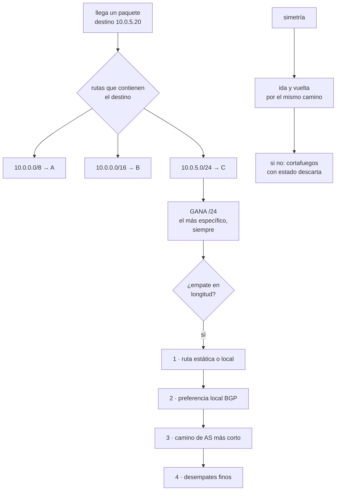

# 194 — Routing, BGP, tránsito y propagación de rutas

> [← 193 · CIDR, subnetting y planificación IP a escala](../../part-16-advanced-cloud-networking-edge/193-cidr-subnetting-y-planificacion-ip-a-escala/README.md) · [Índice de la parte](../README.md) · [195 · DNS autoritativo, recursivo, split-horizon y DNSSEC →](../../part-16-advanced-cloud-networking-edge/195-dns-autoritativo-recursivo-split-horizon-y-dnssec/README.md)

**Parte:** 16 — Redes cloud avanzadas, conectividad híbrida y edge<br>
**Nivel:** avanzado · **Horas estimadas:** 4<br>
**Laboratorio:** `network` · **Estado:** `EXECUTABLE_CORE`

## 🎯 Propósito

Entender por dónde va cada paquete y por qué, que es la pregunta que nadie sabe contestar durante los incidentes de red. La clase explica cómo se elige una ruta —longitud de prefijo primero, y solo después las preferencias—, qué es BGP y qué garantiza realmente, cómo se propagan las rutas entre la nube y la red corporativa, y por qué el mecanismo que anuncia una ruta es también el que la retira mal.

## 📚 Resultados de aprendizaje

Al finalizar podrás:

1. **Predecir** qué ruta elegirá un paquete dadas varias opciones.
2. **Explicar** qué decide BGP y qué no.
3. **Controlar** la propagación de rutas entre nube y red corporativa.
4. **Diagnosticar** los fallos de encaminamiento más comunes.
5. **Diseñar** la salida y la vuelta del tráfico de forma simétrica.

## 🧩 Conceptos centrales

| Concepto | Comprensión verificable |
|---|---|
| `prefijo más específico` | La ruta con máscara más larga gana siempre, antes que cualquier preferencia. |
| `BGP` | Protocolo con el que dos redes se anuncian qué prefijos alcanzan. Es de política, no de rendimiento. |
| `sistema autónomo (AS)` | Conjunto de redes bajo una misma política de encaminamiento, identificado por un número. |
| `propagación` | Difusión de una ruta aprendida hacia otras tablas. Lo que se propaga sin control acaba donde no debe. |
| `asimetría` | Que la ida y la vuelta usen caminos distintos. Rompe cortafuegos con estado y balanceadores. |
| `agujero negro` | Ruta que atrae tráfico hacia un destino que no lo entrega. Peor que no tener ruta. |

## 🧠 Modelo mental

La red cloud es un sistema distribuido de rutas, identidades y políticas; cada salto añade latencia, costo y una frontera de fallo.

Aplicado a esta clase, separa siempre cuatro planos: **intención** (qué necesita el usuario),
**configuración** (qué declaramos), **estado observado** (qué existe de verdad) y
**evidencia** (cómo sabemos que cumple). Confundirlos produce diseños que se ven correctos
en un diagrama pero fallan al operar.

## 🗺️ Flujo de razonamiento



## 📖 Desarrollo

### 1. Cómo se elige una ruta

La causa número uno de confusión en redes es creer que la métrica o la preferencia deciden. **No deciden mientras haya una ruta más específica.**

```text
ORDEN DE DECISIÓN

1. LONGITUD DE PREFIJO — el más específico gana
   destino 10.0.5.20
     10.0.0.0/8    → pasarela A
     10.0.0.0/16   → pasarela B
     10.0.5.0/24   → pasarela C     ← GANA

   y gana aunque A tenga mejor métrica, mejor preferencia
   o menos saltos

2. SOLO SI EMPATAN EN LONGITUD, se aplican preferencias
```

Y de aquí sale el ataque y el error más frecuentes:

```text
anunciar un /24 dentro del /16 de otro DESVÍA su tráfico
→ es el mecanismo de los secuestros de ruta en internet
→ y también el de «alguien añadió una ruta a mano y ahora
  el tráfico va por el sitio equivocado»
```

Y el orden de desempate, simplificado a lo que se usa:

```text
cuando dos rutas tienen la MISMA longitud
  1  origen: local o estática antes que aprendida
  2  preferencia local (política propia: por dónde salir)
  3  camino de AS más corto
  4  origen del anuncio, coste interno, y desempates finos
```

Y las dos rutas especiales que conviene tener claras:

```text
0.0.0.0/0        por defecto; la menos específica de todas
                 → es la que se usa cuando nada más encaja

ruta a agujero negro
                 apunta a ninguna parte a propósito
                 → útil para bloquear un rango
                 → peligrosa si se propaga por error
```

Y una comprobación práctica que resuelve la mitad de los incidentes:

```text
no preguntes «¿hay conectividad?»
pregunta «¿qué ruta coincide con este destino, en ESTA tabla?»
→ y luego la misma pregunta en la tabla de VUELTA
```

### 2. BGP: qué garantiza y qué no

BGP es el protocolo con el que dos redes se dicen qué prefijos alcanzan. Es lo que conecta internet y lo que conecta la nube con la red corporativa.

```text
QUÉ HACE
  anunciar prefijos y aprender los del vecino
  aplicar POLÍTICA: qué anuncio, qué acepto, qué prefiero
  detectar que un vecino dejó de estar y retirar sus rutas

QUÉ NO HACE
  no mide latencia ni ancho de banda
  no elige el camino «más rápido»
  no valida que quien anuncia un prefijo sea su dueño
  no garantiza simetría
```

Y la consecuencia práctica más importante:

```text
BGP es un protocolo de POLÍTICA, no de rendimiento
→ «el camino de AS más corto» no es el más rápido
→ y la mayoría de los problemas de latencia entre redes no
  se arreglan tocando BGP
```

**Los conceptos que hacen falta**, sin más:

```text
AS                 conjunto de redes con política común
                   → cada nube tiene el suyo; tu red
                     corporativa puede tener uno privado

SESIÓN             la conversación entre dos vecinos
                   → si cae, se retiran TODAS sus rutas

ANUNCIO            «yo alcanzo este prefijo»
RETIRADA           «ya no lo alcanzo»

PREFERENCIA LOCAL  qué salida prefiero YO   (entrante para mí)
PREPENDIENTE       repetir mi AS para parecer peor
                   → forma torpe pero habitual de influir en
                     cómo entra el tráfico
```

Y la asimetría del control, que es lo que más cuesta entender:

```text
controlas bien POR DÓNDE SALES     (preferencia local)
controlas mal POR DÓNDE ENTRAS     (depende del otro)

→ para influir en la entrada solo puedes hacerte parecer peor
  o anunciar prefijos más específicos por el camino que
  prefieres
```

**Lo que se rompe con BGP en la nube**, que es casi siempre lo mismo:

```text
LÍMITES DE PREFIJOS
  las pasarelas de nube aceptan un máximo (100, 200, 1.000)
  → si la corporativa anuncia 1.400 rutas, la sesión se CAE
  → y se cae entera, no parcialmente
  → solución: resumir en el origen                clase 193

ANUNCIO DEMASIADO AMPLIO
  anunciar 0.0.0.0/0 desde la corporativa hacia la nube
  → toda la salida a internet pasa por la corporativa
  → a veces se quiere; casi siempre es un accidente

LA SESIÓN SE RESTABLECE Y TARDA
  al recuperarse, reaprender miles de rutas lleva segundos
  o minutos, y durante ese tiempo hay agujeros
```

### 3. Propagación entre nube y corporativa

En la nube, las tablas de rutas son objetos que se asocian a subredes, y la propagación se activa o desactiva por decisión, no por protocolo.

```text
LO QUE HAY QUE DECIDIR EXPLÍCITAMENTE
  qué prefijos anuncia la nube a la corporativa
  qué prefijos acepta la nube de la corporativa
  qué tablas reciben las rutas aprendidas
  qué subredes usan qué tabla
```

Y el error de diseño más común:

```text
propagar todo a todas las tablas «para que funcione»
→ y entonces la subred de datos aprende la ruta a internet,
  o preproducción alcanza producción                clase 189
→ la propagación es un control de alcance, no una comodidad
```

**Los patrones que funcionan:**

```text
AISLAMIENTO POR TABLA
  una tabla por función: pública, privada, datos
  → datos NO recibe la ruta por defecto a internet
  → y por tanto no puede sacar nada, aunque quiera

SALIDA CENTRALIZADA
  todo el tráfico saliente pasa por una red de inspección
  → ruta 0.0.0.0/0 hacia el cortafuegos central
  → permite registrar y controlar la salida     clase 200

RUTA MÁS ESPECÍFICA PARA EXCEPCIONES
  la excepción se implementa con un prefijo más largo
  → y por eso funciona sin tocar lo demás
```

**La simetría**, que rompe cosas de forma difícil de diagnosticar:

```text
SI LA IDA Y LA VUELTA VAN POR CAMINOS DISTINTOS
  un cortafuegos con estado ve la respuesta sin haber visto
  la petición → la descarta
  el resultado: conexiones que se establecen y se cuelgan,
  o que funcionan en un sentido

CUÁNDO OCURRE
  dos túneles activos con políticas distintas en cada extremo
  una ruta más específica añadida en un solo sentido
  traducción de direcciones en un lado y no en el otro
  varias pasarelas NAT con reparto distinto
```

Y la comprobación:

```text
traza el camino en los DOS sentidos, no en uno
→ y compara las tablas de rutas de ambos extremos
```

Y tres diagnósticos frecuentes con su firma:

```text
SÍNTOMA                          CAUSA HABITUAL
funciona en un sentido           asimetría + cortafuegos con
                                 estado
funciona a ratos                 dos rutas iguales, reparto
                                 por flujo, una rota
deja de funcionar de golpe y     sesión BGP caída por exceso
todo a la vez                    de prefijos
alcanza un rango que no debería  propagación a una tabla que
                                 no tocaba
se pierde tráfico en silencio    ruta a agujero negro
                                 propagada           ley 13
```

### 4. Operar el encaminamiento

El encaminamiento es una de las pocas cosas cuyo fallo se manifiesta en todas partes a la vez, y por eso merece disciplina operativa propia.

```text
LO QUE HAY QUE VIGILAR
  estado de cada sesión BGP, y su antigüedad        ley 13
  número de prefijos recibidos, contra el límite
  cambios en las rutas anunciadas y aprendidas
  aparición de rutas más específicas inesperadas
  asimetría en los caminos de ida y vuelta
```

Y la alerta que más incidentes evita:

```text
«el número de prefijos recibidos está al 80 % del límite»
→ porque al 100 % la sesión se cae ENTERA y de golpe
→ y esa caída no avisa antes
```

**Los cambios de encaminamiento**, que merecen tratamiento especial:

```text
UN CAMBIO DE RUTA AFECTA A CUANTO PASA POR AHÍ
  no hay despliegue escalonado natural
  → se hace en ventana, con vuelta atrás preparada
  → y con alguien mirando en los dos extremos

Y LA VUELTA ATRÁS TIENE QUE ESTAR PROBADA
  quitar una ruta es fácil; volver a poner el estado exacto
  anterior, no tanto
  → guardar la configuración previa, no describirla
```

Y una regla que se aprende cara:

```text
las rutas añadidas «temporalmente» a mano no se quitan
→ y aparecen dos años después como causa de un incidente
→ toda ruta manual con fecha y dueño, o no se pone   ley 20
```

**Lo que hay que documentar** y casi nunca está:

```text
qué prefijos anuncia cada extremo, y por qué
qué se acepta y qué se filtra
qué tabla usa cada subred
qué rutas son manuales, quién las puso y hasta cuándo
cuál es el camino esperado para los flujos principales
  → sin esto, nadie sabe si lo que ve es correcto
```

Y la lista de comprobación de la clase:

```text
☐ está documentado qué anuncia y qué acepta cada extremo
☐ los anuncios están resumidos y por debajo del límite
☐ hay alerta al 80 % del límite de prefijos
☐ hay alerta de sesión caída y de antigüedad de la ruta
☐ cada tabla de rutas tiene una función clara
☐ la subred de datos no recibe ruta por defecto a internet
☐ el camino de ida y el de vuelta se han trazado
☐ no hay rutas manuales sin dueño ni fecha
☐ los cambios de ruta tienen ventana y vuelta atrás guardada
☐ está escrito el camino esperado de los flujos principales
```

Y el cierre que enlaza con la clase siguiente: saber por dónde va un paquete supone conocer la dirección de destino, y esa casi nunca se escribe: se resuelve por nombre. Cómo funciona esa resolución, y por qué es la primera sospechosa en tantos incidentes, es la materia de la clase 195.

## 🔬 Ejemplo trabajado

**CloudShop conecta su red corporativa con tres nubes. Lo que sigue son tres incidentes de encaminamiento del mismo año, con su diagnóstico, y el rediseño que los cerró.**

**Incidente 1 · «Todo dejó de funcionar a la vez», marzo.**

```text
síntoma   a las 11:14, toda la conectividad entre la nube
          principal y la corporativa dejó de funcionar
          simultáneamente
          nada se había desplegado

primera hipótesis   corte del enlace dedicado
          → descartada: el enlace estaba activo

diagnóstico
  la sesión BGP hacia la pasarela de nube estaba caída
  motivo: prefijos recibidos 1.043, límite de la pasarela 1.000
  a las 11:14, el equipo de red corporativa había añadido una
  sede nueva → 61 prefijos más
  → se superó el límite y la sesión se cerró ENTERA

lo que lo hizo confuso
  el enlace físico estaba bien
  el panel de red decía «enlace activo»
  la sesión BGP no estaba vigilada

corrección inmediata   resumir los prefijos de las sedes
  1.043 rutas → 31 rutas resumidas

corrección de fondo
  alerta al 80 % del límite
  alerta de sesión caída, con 60 s de umbral
  resumen obligatorio en el origen                clase 193

tiempo hasta restablecer                          2 h 40
  de las cuales, hasta identificar la causa        2 h 05
```

Y la observación del análisis posterior:

```text
el dato que resolvía el incidente —número de prefijos
recibidos— existía y se podía consultar en un comando
nadie lo miraba, y no había alerta                    ley 15
```

**Incidente 2 · «Funciona en un sentido», junio.**

```text
síntoma   el servicio de informes en la nube podía consultar
          la base corporativa, pero las respuestas no llegaban
          las conexiones se establecían y se colgaban a los
          30 s (plazo del cliente)

diagnóstico
  había DOS caminos entre nube y corporativa
    el enlace dedicado principal
    un túnel de respaldo, activo
  la ida usaba el enlace dedicado (más específico desde la
    nube)
  la vuelta usaba el túnel (preferencia local en la
    corporativa)
  el cortafuegos corporativo, con estado, veía la respuesta
    sin haber visto la petición → la descartaba

causa raíz
  dos semanas antes, alguien había subido la preferencia
  local del túnel «para probar el respaldo» y no lo revirtió
  → ruta manual sin dueño ni fecha                    ley 20

corrección
  preferencia alineada en los dos extremos
  el túnel de respaldo pasa a estar en espera, no activo
  comprobación periódica de simetría en los 6 flujos
    principales
```

**Incidente 3 · «Pérdida silenciosa hacia un rango», septiembre.**

```text
síntoma   un 4 % de las peticiones al servicio de inventario
          fallaban por plazo vencido; el resto funcionaba
          duró 11 días antes de detectarse

diagnóstico
  el inventario tiene 3 réplicas, en 10.0.132.0/24,
  10.0.133.0/24 y 10.0.134.0/24
  alguien había creado una ruta a agujero negro para
  10.0.134.0/24 durante una migración de agosto
  la ruta se propagó a la tabla de la subred de aplicación
  → un tercio del tráfico caía en el agujero
  → pero el reparto reintentaba, así que solo fallaba el
    4 % final

por qué tardó 11 días
  la tasa de error global era del 0,3 %, por debajo del
  umbral de alerta
  y el panel de disponibilidad seguía en verde       ley 13

corrección
  ruta retirada
  toda ruta a agujero negro exige etiqueta con dueño y fecha
  función de aptitud: ninguna ruta manual sin fecha de
    caducidad                                       clase 190
  alerta por tasa de error POR DESTINO, no solo global
```

**El rediseño que salió de los tres incidentes.**

```text
TABLAS DE RUTAS POR FUNCIÓN
  pública      0.0.0.0/0 → pasarela de internet
  aplicación   0.0.0.0/0 → cortafuegos central
               10.64.0.0/12 → pasarela corporativa
  datos        SIN 0.0.0.0/0     ← no puede salir
               solo prefijos de aplicación y puntos privados
  puntos priv. solo lo necesario

efecto medido en el modelo de amenazas
  destinos alcanzables desde la subred de datos
    antes    cualquiera de internet
    después  4 prefijos internos
  → la prueba negativa de «sacar datos a un destino no
    declarado» pasó de fallar a rechazar          clase 189
```

```text
ANUNCIOS Y FILTROS, DOCUMENTADOS
  la nube anuncia a la corporativa
    10.0.0.0/12   eu-west-1, resumido
    10.16.0.0/12  eu-central-1, resumido
    → 2 prefijos, no 340

  la nube ACEPTA de la corporativa
    10.64.0.0/12 y nada más
    → filtro explícito; 0.0.0.0/0 rechazado
    → antes se aceptaba todo, y en 2023 la corporativa
      anunció por error una ruta por defecto que desvió
      toda la salida a internet durante 40 minutos
```

```text
VIGILANCIA
  sesión BGP: estado y antigüedad                    ley 13
  prefijos recibidos: alerta al 80 % del límite
  cambios en rutas anunciadas y aprendidas: alerta
  rutas manuales sin fecha: función de aptitud, 0 permitidas
  simetría de los 6 flujos principales: comprobación semanal
  tasa de error por destino, no solo global
```

**El documento de caminos esperados**, que no existía y resolvió el cuarto incidente en once minutos:

```text
flujo                         camino esperado
app → base corporativa        enlace dedicado, ida y vuelta
app → internet                cortafuegos central → NAT
datos → puntos privados       sin salir de la red
informes → base corporativa   enlace dedicado, ida y vuelta
nube A → nube B               interconexión directa, no por
                              la corporativa
socios → nosotros             solo por el balanceador público
```

Y el resultado del año siguiente:

```text                                    antes      después
incidentes de encaminamiento                 3            1
tiempo medio hasta identificar causa      1 h 50      11 min
prefijos anunciados a la corporativa        340            2
prefijos aceptados de la corporativa      1.043           31
rutas manuales sin dueño                     17            0
flujos con camino documentado                 0            6
```

**La lección que esta clase deja**: los tres incidentes tuvieron causas distintas —un límite de prefijos, una preferencia que alguien cambió para probar, y una ruta a agujero negro de una migración— pero **los tres se diagnosticaron lento por lo mismo**: nadie había escrito cuál era el camino esperado, así que no había forma de saber si lo que se veía estaba mal. Y el tercero duró once días porque **el error se repartía entre tres réplicas y quedaba por debajo del umbral global**.

## 🧪 Laboratorio guiado

Ejecuta desde la raíz:

```bash
python classes/part-16-advanced-cloud-networking-edge/194-routing-bgp-transito-y-propagacion-de-rutas/lab.py
```

El laboratorio selecciona el motor de práctica **`network`** y produce
`lab_result.json`. El escenario, sus comprobaciones y el artefacto esperado corresponden a
esta clase; no requiere credenciales y deja explícito qué debe revalidarse en un sandbox real.

1. Lee `exercise.steps` y formula una predicción antes de ejecutar.
2. Ejecuta la práctica y verifica todos los elementos de `checks`.
3. Provoca el caso de `negative_test` y explica la señal observada.
4. Materializa `routing-lab` en `evidence/` usando la plantilla indicada.
5. Para proveedor real, sigue `sandbox.requires`, registra costo y ejecuta `destroy`.

### Evidencia esperada

El artefacto principal es una topología con rutas, puertos y controles. Además, la entrega debe incluir el comando ejecutado,
la salida estructurada y una conclusión que no exceda lo observado.

## 🏆 Reto verificable

Construye **`routing-lab`** para el caso CloudShop. Incluye una alternativa descartada,
un supuesto que pueda falsarse, una prueba de fallo y una decisión de rollback.

## ✅ Criterio de aceptación

- [ ] `lab.py` termina con código 0 y genera JSON válido.
- [ ] La entrega conecta al menos tres requisitos con mecanismos verificables.
- [ ] Existe una prueba positiva y una prueba negativa con evidencia.
- [ ] Seguridad, costo y operación aparecen como decisiones, no como anexos.
- [ ] Se declara una limitación y una condición que obligaría a revisar el diseño.
- [ ] Otra persona puede repetir el recorrido sin conocimiento tácito.

## ⚠️ Errores frecuentes

| Síntoma | Causa probable | Corrección |
|---|---|---|
| El tráfico va por un camino que la métrica no explica | Existe una ruta más específica que gana antes de que se apliquen las preferencias | Busca siempre primero la ruta con prefijo más largo que coincide con el destino, en la tabla concreta que aplica. |
| Toda la conectividad cae a la vez sin que nadie despliegue nada | La sesión BGP superó el límite de prefijos y se cerró entera | Resume en el origen y alerta al 80 % del límite; vigila también estado y antigüedad de la sesión. |
| Las conexiones se establecen y se cuelgan, o funcionan en un solo sentido | Asimetría de camino con un cortafuegos con estado en medio | Traza ida y vuelta, alinea preferencias en ambos extremos y comprueba la simetría de los flujos principales periódicamente. |
| Una subred alcanza destinos que no debería | Se propagaron las rutas a todas las tablas para que funcionara | Usa una tabla por función y trata la propagación como control de alcance: la subred de datos no recibe ruta por defecto. |
| Se pierde una fracción del tráfico sin errores visibles | Una ruta a agujero negro propagada, con reintentos que enmascaran el fallo | Prohíbe rutas manuales sin dueño y fecha, y alerta por tasa de error por destino además de la global. |
| Nadie sabe si el camino que se observa es el correcto | No está escrito el camino esperado de los flujos principales | Documenta qué anuncia y acepta cada extremo, qué tabla usa cada subred y el camino esperado de cada flujo. |

## 🛡️ Seguridad, ética y costo

Trabaja con cuentas propias o sandboxes autorizados. No publiques secretos, identificadores
reales ni datos personales. Antes de crear recursos pagos define presupuesto, etiquetas y
comando de destrucción; después verifica que no queden recursos huérfanos. Los ejemplos
locales enseñan contratos, pero no certifican cumplimiento ni disponibilidad de producción.

## ❓ Preguntas de comprobación

1. ¿Qué decide primero al elegir una ruta, y por qué las preferencias casi nunca importan?
2. ¿Qué garantiza BGP y qué no garantiza?
3. ¿Por qué se controla mal por dónde entra el tráfico?
4. ¿Qué ocurre cuando se supera el límite de prefijos de una pasarela?
5. ¿Qué documento hace que un incidente de encaminamiento se diagnostique en minutos?

## 🔗 Referencias

- RFC 4271 — A Border Gateway Protocol 4 (BGP-4). <https://www.rfc-editor.org/rfc/rfc4271>
- AWS (2025). *Route tables and route priority in VPC*. <https://docs.aws.amazon.com/vpc/latest/userguide/VpcSubnetRouting.html>
- Microsoft (2025). *Virtual network traffic routing*. <https://learn.microsoft.com/en-us/azure/virtual-network/virtual-networks-udr-overview>
- Google Cloud (2025). *Routes and routing order*. <https://cloud.google.com/vpc/docs/routes>
- Cloudflare (2025). *What is BGP? Route leaks and hijacks*. <https://www.cloudflare.com/learning/security/glossary/bgp-hijacking/>
- Documentación oficial vigente del servicio implementado; registra URL y fecha de consulta.

---

> [Evaluación](assessment.md) · [Contrato de clase](lesson.yaml) · [Índice de la parte](../README.md)

**📥 Descargar:** [Parte 16 en PDF](../../../site/downloads/partes/manual-parte-16-advanced-cloud-networking-edge.pdf) · [Manual integral](../../../site/downloads/multi-cloud-engineering-manual-v2.0.pdf)

| Anterior | Índice | Siguiente |
|---|---|---|
| [← 193 · CIDR, subnetting y planificación IP a escala](../../part-16-advanced-cloud-networking-edge/193-cidr-subnetting-y-planificacion-ip-a-escala/README.md) | [Parte 16](../README.md) · [Programa](../../README.md) | [195 · DNS autoritativo, recursivo, split-horizon y DNSSEC →](../../part-16-advanced-cloud-networking-edge/195-dns-autoritativo-recursivo-split-horizon-y-dnssec/README.md) |
