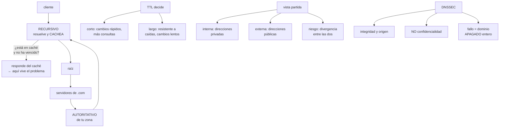

# 195 — DNS autoritativo, recursivo, split-horizon y DNSSEC

> [← 194 · Routing, BGP, tránsito y propagación de rutas](../../part-16-advanced-cloud-networking-edge/194-routing-bgp-transito-y-propagacion-de-rutas/README.md) · [Índice de la parte](../README.md) · [196 · Balanceo L4/L7, proxies, TLS y gestión de certificados →](../../part-16-advanced-cloud-networking-edge/196-balanceo-l4-l7-proxies-tls-y-gestion-de-certificados/README.md)

**Parte:** 16 — Redes cloud avanzadas, conectividad híbrida y edge<br>
**Nivel:** avanzado · **Horas estimadas:** 4<br>
**Laboratorio:** `network` · **Estado:** `EXECUTABLE_CORE`

## 🎯 Propósito

Entender el sistema de nombres lo suficiente para diagnosticarlo, porque es la primera sospecha de casi todos los incidentes raros y la última que se comprueba bien. La clase separa autoritativo de recursivo, explica por qué el tiempo de vida es una decisión de arquitectura y no un ajuste, aborda la vista partida entre red interna y externa, y trata DNSSEC con honestidad: qué resuelve, qué no, y por qué su modo de fallo es apagar el dominio entero.

## 📚 Resultados de aprendizaje

Al finalizar podrás:

1. **Distinguir** resolución autoritativa de recursiva y saber dónde mirar cada una.
2. **Elegir** tiempos de vida según lo que se vaya a cambiar y cuándo.
3. **Diseñar** vista partida sin que interno y externo se contradigan.
4. **Evaluar** si DNSSEC compensa, y operarlo sin apagar el dominio.
5. **Diagnosticar** los fallos de nombres por su firma característica.

## 🧩 Conceptos centrales

| Concepto | Comprensión verificable |
|---|---|
| `autoritativo` | Servidor que posee la zona y responde con la verdad. Es donde se cambian los registros. |
| `recursivo` | Servidor que resuelve en nombre del cliente y guarda en caché. Es donde vive la respuesta que el cliente ve. |
| `tiempo de vida (TTL)` | Cuánto puede cachearse una respuesta. Determina cuánto tarda un cambio en surtir efecto en todas partes. |
| `vista partida` | La misma zona responde distinto según quién pregunte: red interna o internet. |
| `DNSSEC` | Firma criptográfica de las respuestas. Garantiza integridad y origen, no confidencialidad. |
| `caché negativa` | Almacenamiento de la respuesta «no existe». Su duración la fija un campo que casi nadie mira. |

## 🧠 Modelo mental

La red cloud es un sistema distribuido de rutas, identidades y políticas; cada salto añade latencia, costo y una frontera de fallo.

Aplicado a esta clase, separa siempre cuatro planos: **intención** (qué necesita el usuario),
**configuración** (qué declaramos), **estado observado** (qué existe de verdad) y
**evidencia** (cómo sabemos que cumple). Confundirlos produce diseños que se ven correctos
en un diagrama pero fallan al operar.

## 🗺️ Flujo de razonamiento



## 📖 Desarrollo

### 1. Autoritativo y recursivo: dónde mirar

La mitad de los diagnósticos fallidos de nombres vienen de consultar el servidor equivocado.

```text
AUTORITATIVO
  posee la zona; responde con la verdad actual
  es donde se CAMBIAN los registros
  no cachea nada: lo que dice es lo que hay

RECURSIVO
  resuelve en nombre del cliente y GUARDA la respuesta
  es lo que el cliente configura
  puede estar devolviendo algo viejo durante horas

Y EN MEDIO
  el sistema operativo cachea
  la biblioteca del lenguaje cachea      ← el peor
  el navegador cachea
  el proxy o el balanceador cachea
```

Y de ahí la regla de diagnóstico:

```text
pregunta al AUTORITATIVO para saber qué hay configurado
pregunta al RECURSIVO que usa el cliente para saber qué ve
y compáralos

→ «yo lo veo bien» casi siempre significa «mi caché es otra»
```

Y una trampa concreta que aparece en producción:

```text
algunas bibliotecas y máquinas virtuales de lenguaje cachean
la resolución PARA SIEMPRE dentro del proceso
→ un cambio de dirección no surte efecto hasta reiniciar
→ y el servicio parece «no ver» el cambio aunque el TTL
  haya vencido hace horas
→ comprobar el comportamiento de caché del entorno de
  ejecución es parte del diseño, no del diagnóstico
```

**Los tipos de registro que hacen falta**, sin más:

```text
A / AAAA    nombre → dirección IPv4 / IPv6
CNAME       nombre → otro nombre
            ojo: no puede coexistir con otros registros del
            mismo nombre, y no vale en la raíz del dominio
ALIAS/ANAME registro propietario que resuelve eso último
NS          quién es autoritativo para la zona
MX          correo
TXT         verificaciones, políticas de correo
SRV         servicio, puerto y prioridad
CAA         qué autoridades pueden emitir certificados
            ← el que casi nadie pone y evita emisiones
              no autorizadas
PTR         dirección → nombre; usado por sistemas de correo
```

### 2. El tiempo de vida es una decisión de arquitectura

El TTL se rellena por costumbre y determina cosas importantes.

```text
TTL CORTO   (30-60 s)
  + un cambio surte efecto casi enseguida
  + permite conmutación por nombre               clase 166
  − más consultas y más dependencia del recursivo
  − si el autoritativo cae, todo expira rápido y se apaga

TTL LARGO   (1-24 h)
  + resistente: si el autoritativo cae, todo sigue
  + menos consultas
  − un cambio tarda hasta un día en verse en todas partes
  − y en una emergencia, ese día es el tiempo de recuperación
```

Y la regla que resuelve la elección:

```text
el TTL debe ser MENOR que el tiempo de recuperación que
prometes por ese nombre

→ si prometes conmutar en 15 minutos y el TTL es de 1 hora,
  no cumples, hagas lo que hagas               clase 185
```

Y el procedimiento para cambiar algo que tiene TTL largo:

```text
1  bajar el TTL a 60 s
2  ESPERAR el TTL antiguo entero (hasta 24 h)
3  hacer el cambio
4  comprobar
5  volver a subir el TTL

→ saltarse el paso 2 es el error clásico: parte del mundo
  sigue con la respuesta vieja
```

Y dos valores que casi nadie mira y causan incidentes:

```text
CACHÉ NEGATIVA
  cuánto se recuerda que un nombre NO existe
  se fija en el registro SOA de la zona, no por registro
  → si vale 3 h y creas un nombre nuevo tras haberlo
    consultado, tardará 3 h en verse
  → causa típica de «he creado el registro y no funciona»

TTL DE LOS REGISTROS NS
  cuánto se recuerda quién es autoritativo
  → un cambio de proveedor de DNS tarda ese tiempo, y suele
    ser de 24-48 h
```

Y una decisión de diseño que evita mucho dolor:

```text
no uses nombres con TTL largo para lo que va a cambiar
separa los nombres estables de los que conmutan
  api.cloudshop.com          TTL 60   ← conmuta
  docs.cloudshop.com         TTL 3600 ← estable
```

### 3. Vista partida y zonas internas

Casi toda organización acaba resolviendo el mismo nombre de dos formas: por dentro apunta a una dirección privada, por fuera a una pública.

```text
POR QUÉ SE HACE
  el tráfico interno no debe salir a internet para volver
  → latencia, coste de salida y exposición    clase 200
  y el certificado y el nombre siguen siendo los mismos

CÓMO SE HACE
  una zona privada, asociada a las redes internas
  con los mismos nombres y direcciones privadas
  → el resolutor interno la consulta primero
```

Y los tres problemas que trae, con su solución:

```text
1. DIVERGENCIA
   alguien añade un registro en la zona pública y no en la
   privada, o al revés
   → los internos ven una cosa y los externos otra
   solución   generar ambas del mismo origen, o comprobar
              la diferencia automáticamente        clase 190

2. NOMBRES QUE SOLO EXISTEN DENTRO
   y que se filtran en registros, correos o mensajes de error
   → revelan estructura interna                    clase 189

3. DIAGNÓSTICO CONFUSO
   «a mí me resuelve bien» según desde dónde se pregunte
   solución   decir SIEMPRE desde qué red se consultó
```

**La resolución en la nube**, que tiene sus propias reglas:

```text
cada red tiene un resolutor propio, en una dirección fija
  del rango de la red
las zonas privadas se ASOCIAN a redes concretas
  → una red sin asociar no ve la zona
la resolución desde la corporativa hacia la nube exige
  reenvío explícito, y viceversa
  → punto de entrada y de salida del resolutor
```

Y el fallo más común de este montaje:

```text
el reenvío está configurado en un sentido y no en el otro
→ desde la nube se resuelven los nombres corporativos
→ desde la corporativa no se resuelven los de la nube
→ y se descubre el día que un sistema corporativo tiene que
  llamar a un servicio nuevo
```

Y una decisión que ahorra trabajo:

```text
usa un subdominio propio para lo interno
  int.cloudshop.com     para todo lo privado
→ evita la vista partida en la mayoría de los nombres
→ y deja la partida solo donde de verdad hace falta
```

### 4. DNSSEC y los fallos característicos

**DNSSEC** firma las respuestas para que el resolutor pueda comprobar que no han sido alteradas.

```text
QUÉ RESUELVE
  que alguien altere la respuesta por el camino
  que un resolutor sea envenenado con datos falsos

QUÉ NO RESUELVE
  confidencialidad: la consulta viaja en claro igual
  → eso lo resuelven DNS sobre TLS o sobre HTTPS
  que el dominio esté mal configurado
  que alguien tome el control de tu cuenta de DNS
```

Y el motivo por el que se adopta despacio:

```text
SU MODO DE FALLO ES APAGAR EL DOMINIO ENTERO
  si una firma caduca o la cadena se rompe, los resolutores
  que validan RECHAZAN todas las respuestas
  → no es degradación: es desaparición
  → y el diagnóstico desde fuera parece «el dominio no existe»
```

Y por eso su operación tiene reglas propias:

```text
vigilar la caducidad de las firmas, con margen  ← ley 13
vigilar que el registro de delegación en el dominio padre
  coincide con la clave activa
cualquier cambio de proveedor de DNS exige un procedimiento
  específico, y es donde más se rompe
y la rotación de claves se ensaya antes                ley 22
```

**Los fallos de nombres por su firma**, que es lo que permite diagnosticar rápido:

```text
SÍNTOMA                              CAUSA HABITUAL
funciona en unos sitios y no en      caché con TTL vigente en
otros                                unos recursivos

funciona y de pronto deja de         registro cambiado; unos
funcionar, y luego vuelve            recursivos ya expiraron
                                     y otros no

creo un registro y no aparece        caché negativa del SOA

el servicio no ve la dirección       la biblioteca cachea
nueva tras horas                     dentro del proceso

resuelve distinto según el equipo    vista partida y red
                                     distinta

el dominio entero desaparece         DNSSEC roto, o los NS
                                     apuntan a un proveedor
                                     que ya no sirve la zona

latencia alta al conectar            resolución lenta o
solo la primera vez                  resolutor sin caché

resuelve pero con dirección de       registro huérfano de un
un servicio retirado                 recurso ya borrado
                                     ← peligro real
```

Y el último merece su propia advertencia:

```text
REGISTRO HUÉRFANO
  un nombre que apunta a una dirección o a un recurso que ya
  no es tuyo
  → alguien puede reclamar ese recurso y recibir tu tráfico
  → afecta a subdominios apuntando a servicios externos
    dados de baja
  → comprobación periódica obligatoria             ley 20
```

Y la lista de comprobación de la clase:

```text
☐ se sabe qué es autoritativo y qué recursivo en cada caso
☐ los TTL son menores que el plazo de recuperación prometido
☐ los nombres que conmutan están separados de los estables
☐ el TTL de caché negativa está revisado
☐ se conoce el comportamiento de caché del entorno de
  ejecución
☐ la vista partida se genera del mismo origen o se compara
☐ el reenvío entre nube y corporativa funciona en ambos
  sentidos
☐ hay registro CAA
☐ si hay DNSSEC, hay alerta de caducidad de firmas
☐ se comprueban periódicamente los registros huérfanos
☐ hay alerta si la zona deja de responder o cambia sola
```

Y el cierre que enlaza con la clase siguiente: resuelto el nombre, el tráfico llega a un punto de entrada que lo reparte y termina la conexión cifrada. Balanceo, proxies y gestión de certificados es la materia de la clase 196.

## 🔬 Ejemplo trabajado

**CloudShop sufre cuatro incidentes de nombres en un año. Lo que sigue es cada uno con su firma, el rediseño que salió, y el registro huérfano que encontraron por casualidad.**

**Incidente 1 · «El cambio no surte efecto», enero.**

```text
contexto  migración del balanceador de pedidos a uno nuevo
          se cambió el registro A de api.cloudshop.com

síntoma   a las 2 h, el 30 % del tráfico seguía llegando al
          balanceador viejo, que ya estaba apagado a medias

diagnóstico
  el TTL del registro era 86.400 (24 h)
  el equipo lo bajó a 60 s el mismo día del cambio
  → los recursivos que ya tenían la respuesta antigua la
    mantuvieron hasta 24 h

qué faltó   bajar el TTL y ESPERAR el TTL antiguo entero
            ANTES de cambiar

efecto      6 h de tráfico partido; 340 pedidos fallidos
```

**Incidente 2 · «He creado el registro y no aparece», marzo.**

```text
contexto  se creó pagos-v2.cloudshop.com para una prueba

síntoma   el equipo lo consultó antes de crearlo (por error),
          y después de crearlo seguía sin resolver durante
          casi tres horas, solo desde algunas redes

diagnóstico
  caché negativa: el campo mínimo del SOA valía 10.800 (3 h)
  el resolutor había guardado «este nombre no existe»

corrección
  caché negativa bajada a 300 s
  y una nota en el procedimiento: no consultar un nombre
  antes de crearlo
```

**Incidente 3 · «Resuelve bien desde la nube y mal desde la oficina», junio.**

```text
síntoma   el sistema corporativo de conciliación no podía
          llamar al servicio de inventario nuevo
          desde la nube todo funcionaba

diagnóstico
  zona privada int.cloudshop.com, asociada a las redes de
  la nube
  el reenvío desde la corporativa hacia el resolutor de la
  nube NO existía
  → el reenvío estaba montado solo en el sentido
    nube → corporativa

corrección
  punto de entrada del resolutor en la nube y regla de
  reenvío en la corporativa
  comprobación negativa añadida: resolver un nombre interno
  desde CADA red, en las dos direcciones
```

**Incidente 4 · «El servicio no ve la dirección nueva», septiembre.**

```text
contexto  conmutación de la base de datos a la réplica de
          otra zona; el nombre se actualizó y el TTL era 30 s

síntoma   4 de los 11 servicios siguieron conectando a la
          dirección antigua durante 40 minutos, hasta que
          se reiniciaron

diagnóstico
  los 4 servicios corrían sobre un entorno de ejecución que
  cachea la resolución dentro del proceso, sin respetar el
  TTL
  → el TTL de 30 s no servía de nada para esos 4

corrección
  configuración explícita de caducidad de caché en el
  entorno de ejecución
  y una prueba negativa nueva: cambiar el nombre y comprobar
  que CADA servicio lo sigue en menos de 60 s

y el hallazgo de método
  el plazo de recuperación prometido para la base era de
  5 minutos
  el TTL era correcto, y aun así no se cumplía
  → el plazo depende de la capa que más cachea, no del TTL
```

**El rediseño de nombres.**

```text
SEPARACIÓN POR VOLATILIDAD
  nombres que conmutan          TTL 30 s
    api, base de datos, balanceadores
  nombres estables              TTL 3.600 s
    documentación, sitio corporativo
  nombres de infraestructura    TTL 300 s

SUBDOMINIO INTERNO
  todo lo privado en int.cloudshop.com
  → la vista partida queda solo en 3 nombres, no en 60

GENERACIÓN ÚNICA
  las zonas pública e interna se generan del mismo origen
  declarativo
  → función de aptitud: ningún registro existe en una zona
    y no en la otra sin declararlo             clase 190

CACHÉ NEGATIVA         300 s
REGISTRO CAA           añadido; solo dos autoridades
DNSSEC                 evaluado y NO adoptado, ver abajo
```

**La decisión sobre DNSSEC, registrada:**

```text
CONTEXTO
  el dominio no maneja correo sensible
  el tráfico crítico va sobre TLS con validación de
  certificado, que ya detecta la suplantación
  el equipo tiene 4 personas y no hay guardia nocturna

DECISIÓN   no adoptar DNSSEC en esta fase

MOTIVO
  su modo de fallo apaga el dominio entero, y el equipo no
  tiene capacidad de vigilar caducidades de firma con la
  disciplina que exige
  el riesgo que mitiga está ya cubierto en su mayor parte
  por TLS para el tráfico que importa

QUÉ LA REABRIRÍA
  si aparece un requisito contractual
  si se empieza a manejar correo con datos sensibles
  si el proveedor pasa a gestionar la rotación de claves
  automáticamente y con alerta de caducidad

ACEPTA     dirección de tecnología, por escrito
REVISA     12 meses
```

Y la observación del registro:

```text
esta es una decisión de NO adoptar una buena práctica
→ y por eso lleva motivo, nombre y fecha             clase 189
→ «no lo hicimos» sin registro es un olvido; con registro
  es una decisión
```

**El registro huérfano, encontrado al inventariar:**

```text
se comprobaron los 214 registros de la zona pública

registros que apuntaban a recursos inexistentes            9
  de ellos, a direcciones que ya no eran de CloudShop      3
  de ellos, a un servicio externo dado de baja en 2023     1

el peligroso
  encuestas.cloudshop.com apuntaba por CNAME a una
  plataforma de formularios cuya cuenta se canceló en 2023
  → cualquiera que registrase ese identificador en esa
    plataforma habría servido contenido bajo el dominio de
    CloudShop
  → llevaba 19 meses así

corrección
  registros huérfanos eliminados
  comprobación mensual automatizada: todo CNAME y todo A
  debe apuntar a algo que existe y es nuestro
  → 3 más detectados en los 6 meses siguientes
```

**El resultado del año siguiente:**

```text                                        antes     después
incidentes de nombres                          4           1
tiempo medio de diagnóstico                 55 min      9 min
nombres con vista partida                      60           3
registros huérfanos                             9           0
tiempo real de conmutación por nombre       40 min      50 s
divergencias entre zona interna y pública       7           0
```

**La lección que esta clase deja**: de los cuatro incidentes, **tres tuvieron como causa una caché que nadie había considerado** —la de los recursivos con el TTL antiguo, la negativa del SOA y la del entorno de ejecución— y ninguna estaba en el diagrama de arquitectura. Y el hallazgo más grave del año no fue un incidente: fue **un CNAME olvidado durante diecinueve meses que apuntaba a una cuenta cancelada**, y lo encontró un inventario, no una alerta.

## 🧪 Laboratorio guiado

Ejecuta desde la raíz:

```bash
python classes/part-16-advanced-cloud-networking-edge/195-dns-autoritativo-recursivo-split-horizon-y-dnssec/lab.py
```

El laboratorio selecciona el motor de práctica **`network`** y produce
`lab_result.json`. El escenario, sus comprobaciones y el artefacto esperado corresponden a
esta clase; no requiere credenciales y deja explícito qué debe revalidarse en un sandbox real.

1. Lee `exercise.steps` y formula una predicción antes de ejecutar.
2. Ejecuta la práctica y verifica todos los elementos de `checks`.
3. Provoca el caso de `negative_test` y explica la señal observada.
4. Materializa `dns-design` en `evidence/` usando la plantilla indicada.
5. Para proveedor real, sigue `sandbox.requires`, registra costo y ejecuta `destroy`.

### Evidencia esperada

El artefacto principal es una topología con rutas, puertos y controles. Además, la entrega debe incluir el comando ejecutado,
la salida estructurada y una conclusión que no exceda lo observado.

## 🏆 Reto verificable

Construye **`dns-design`** para el caso CloudShop. Incluye una alternativa descartada,
un supuesto que pueda falsarse, una prueba de fallo y una decisión de rollback.

## ✅ Criterio de aceptación

- [ ] `lab.py` termina con código 0 y genera JSON válido.
- [ ] La entrega conecta al menos tres requisitos con mecanismos verificables.
- [ ] Existe una prueba positiva y una prueba negativa con evidencia.
- [ ] Seguridad, costo y operación aparecen como decisiones, no como anexos.
- [ ] Se declara una limitación y una condición que obligaría a revisar el diseño.
- [ ] Otra persona puede repetir el recorrido sin conocimiento tácito.

## ⚠️ Errores frecuentes

| Síntoma | Causa probable | Corrección |
|---|---|---|
| Un cambio de registro tarda horas en surtir efecto para parte del tráfico | Se bajó el TTL el mismo día del cambio, sin esperar a que expirara el antiguo | Baja el TTL, espera el TTL antiguo completo, haz el cambio, comprueba y vuelve a subirlo. |
| Se crea un registro y no resuelve durante horas | Caché negativa: el nombre se consultó antes de existir y se recordó como inexistente | Revisa el valor mínimo del SOA y bájalo; evita consultar nombres antes de crearlos. |
| Un servicio sigue conectando a la dirección antigua pese al TTL corto | La biblioteca o el entorno de ejecución cachea la resolución dentro del proceso | Configura explícitamente la caducidad de caché del entorno y añade una prueba negativa que cambie el nombre y mida cuánto tarda cada servicio en seguirlo. |
| Un nombre interno resuelve desde la nube y no desde la red corporativa | El reenvío entre resolutores está configurado en un solo sentido | Monta punto de entrada y de salida del resolutor, y comprueba la resolución desde cada red en ambas direcciones. |
| Internos y externos ven direcciones distintas y contradictorias | Las zonas pública y privada se mantienen por separado y divergen | Genera ambas del mismo origen declarativo y comprueba automáticamente que no haya registros en una y no en la otra. |
| Un subdominio sirve contenido que no es tuyo | Registro huérfano apuntando a un recurso o cuenta externa dada de baja | Inventaría periódicamente todos los registros y comprueba que cada destino existe y es tuyo. |

## 🛡️ Seguridad, ética y costo

Trabaja con cuentas propias o sandboxes autorizados. No publiques secretos, identificadores
reales ni datos personales. Antes de crear recursos pagos define presupuesto, etiquetas y
comando de destrucción; después verifica que no queden recursos huérfanos. Los ejemplos
locales enseñan contratos, pero no certifican cumplimiento ni disponibilidad de producción.

## ❓ Preguntas de comprobación

1. ¿A qué servidor se pregunta para saber qué hay configurado y a cuál para saber qué ve el cliente?
2. ¿Qué relación debe cumplir el TTL con el plazo de recuperación prometido?
3. ¿Qué campo fija la caché negativa y qué síntoma produce?
4. ¿Cuál es el modo de fallo de DNSSEC y por qué condiciona su adopción?
5. ¿Qué es un registro huérfano y por qué es peligroso?

## 🔗 Referencias

- RFC 1034 y 1035 — Domain names: concepts, facilities and implementation. <https://www.rfc-editor.org/rfc/rfc1034>
- RFC 2308 — Negative caching of DNS queries. <https://www.rfc-editor.org/rfc/rfc2308>
- RFC 4033 — DNS security introduction and requirements (DNSSEC). <https://www.rfc-editor.org/rfc/rfc4033>
- AWS (2025). *Route 53: private hosted zones and resolver endpoints*. <https://docs.aws.amazon.com/Route53/latest/DeveloperGuide/hosted-zones-private.html>
- OWASP (2025). *Subdomain takeover* — registros huérfanos. <https://owasp.org/www-community/attacks/Subdomain_Takeover>
- Documentación oficial vigente del servicio implementado; registra URL y fecha de consulta.

---

> [Evaluación](assessment.md) · [Contrato de clase](lesson.yaml) · [Índice de la parte](../README.md)

| Anterior | Índice | Siguiente |
|---|---|---|
| [← 194 · Routing, BGP, tránsito y propagación de rutas](../../part-16-advanced-cloud-networking-edge/194-routing-bgp-transito-y-propagacion-de-rutas/README.md) | [Parte 16](../README.md) · [Programa](../../README.md) | [196 · Balanceo L4/L7, proxies, TLS y gestión de certificados →](../../part-16-advanced-cloud-networking-edge/196-balanceo-l4-l7-proxies-tls-y-gestion-de-certificados/README.md) |
