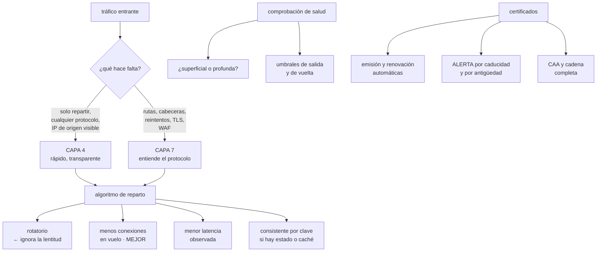

# 196 — Balanceo L4/L7, proxies, TLS y gestión de certificados

> [← 195 · DNS autoritativo, recursivo, split-horizon y DNSSEC](../../part-16-advanced-cloud-networking-edge/195-dns-autoritativo-recursivo-split-horizon-y-dnssec/README.md) · [Índice de la parte](../README.md) · [197 · CDN, caché, origin shielding y edge compute →](../../part-16-advanced-cloud-networking-edge/197-cdn-cache-origin-shielding-y-edge-compute/README.md)

**Parte:** 16 — Redes cloud avanzadas, conectividad híbrida y edge<br>
**Nivel:** avanzado · **Horas estimadas:** 4<br>
**Laboratorio:** `network` · **Estado:** `EXECUTABLE_CORE`

## 🎯 Propósito

Elegir y operar el punto de entrada del tráfico: qué reparte, en qué capa, con qué algoritmo, y cómo termina el cifrado. La clase separa balanceo de capa 4 y de capa 7 por lo que cada uno puede y no puede hacer, revisa los algoritmos de reparto con la evidencia de la clase 186 sobre por qué el rotatorio es mala idea, y trata la gestión de certificados como lo que en la práctica es: **la causa recurrente de caídas totales y previsibles**.

## 📚 Resultados de aprendizaje

Al finalizar podrás:

1. **Elegir** entre balanceo de capa 4 y de capa 7 según lo que haga falta.
2. **Seleccionar** el algoritmo de reparto y las comprobaciones de salud.
3. **Decidir** dónde termina TLS y qué se cifra por dentro.
4. **Automatizar** la emisión y renovación de certificados sin sorpresas.
5. **Diagnosticar** los fallos típicos de balanceador y de certificado.

## 🧩 Conceptos centrales

| Concepto | Comprensión verificable |
|---|---|
| `capa 4` | Reparto por dirección y puerto, sin ver el contenido. Rápido, transparente y ciego. |
| `capa 7` | Reparto entendiendo el protocolo: rutas, cabeceras, reintentos. Más capaz y más caro. |
| `comprobación de salud` | Sonda periódica que decide si un destino recibe tráfico. Determina cuánto tarda en salir uno roto. |
| `drenaje de conexiones` | Dejar terminar lo que está en curso antes de retirar un destino. |
| `terminación TLS` | Punto donde se descifra el tráfico. Decide qué ve cada capa y qué hay que cifrar por dentro. |
| `SNI` | Extensión que indica el nombre solicitado antes de descifrar. Permite varios certificados en una IP. |

## 🧠 Modelo mental

La red cloud es un sistema distribuido de rutas, identidades y políticas; cada salto añade latencia, costo y una frontera de fallo.

Aplicado a esta clase, separa siempre cuatro planos: **intención** (qué necesita el usuario),
**configuración** (qué declaramos), **estado observado** (qué existe de verdad) y
**evidencia** (cómo sabemos que cumple). Confundirlos produce diseños que se ven correctos
en un diagrama pero fallan al operar.

## 🗺️ Flujo de razonamiento



## 📖 Desarrollo

### 1. Capa 4 y capa 7

La elección no es de gusto: cada capa puede cosas que la otra no.

```text
CAPA 4  (transporte)
  ve   dirección y puerto
  no ve  rutas, cabeceras, cuerpo
  hace   reparte conexiones a destinos

  a favor
    latencia mínima; apenas añade nada
    funciona con cualquier protocolo, no solo HTTP
    puede preservar la dirección de origen del cliente
    escala a millones de conexiones
  en contra
    no puede reintentar una petición fallida
    no distingue una ruta de otra
    no termina TLS (salvo modos específicos)
    su comprobación de salud es superficial

CAPA 7  (aplicación)
  ve   ruta, cabeceras, método, cuerpo
  hace   enruta por contenido, reintenta, reescribe,
         termina TLS, aplica límites y filtros

  a favor
    reparto por ruta o cabecera → despliegues escalonados
    reintento de peticiones idempotentes
    plazos por ruta
    terminación TLS y certificados centralizados
    filtrado de aplicación
  en contra
    añade latencia (0,3-2 ms típicos)
    es un punto que hay que dimensionar y operar
    ve el tráfico en claro → decisión de seguridad
```

Y la regla de elección:

```text
¿necesitas decidir según el CONTENIDO de la petición?
  sí   capa 7
  no   capa 4, y te ahorras latencia y complejidad

¿el protocolo no es HTTP?
  capa 4, salvo que el producto entienda ese protocolo
```

Y la combinación habitual, que resuelve casi todo:

```text
internet → capa 4 (entrada, IP fija, escala)
         → capa 7 (rutas, TLS, reintentos)
         → servicios

→ y la IP fija del capa 4 es la que se pone en las listas
  de permitidos de terceros                        clase 193
```

### 2. Reparto y comprobaciones de salud

El algoritmo de reparto por defecto suele ser el rotatorio, y suele ser el peor.

```text
ROTATORIO
  una conexión a cada destino, por turno
  problema   ignora que un destino esté lento
  → una instancia degradada recibe la misma carga que una
    sana, y arruina el percentil de todos      clases 152, 186

MENOS CONEXIONES EN VUELO
  al destino con menos peticiones activas
  → un destino lento acumula peticiones y deja de recibir
  → es el que mejor se comporta ante degradación
  → suele ser la elección correcta por defecto

MENOR LATENCIA OBSERVADA
  usa la latencia medida reciente
  → bueno, pero puede oscilar si la ventana es corta

CONSISTENTE POR CLAVE (hash)
  la misma clave va siempre al mismo destino
  → necesario con caché local o estado por sesión
  → usar variante con anillo para que al perder un destino
    solo se reubique su parte, no todo

PESOS
  para instancias de tamaño distinto o para desplazar
  tráfico progresivamente                          clase 102
```

**Las comprobaciones de salud**, que deciden cuánto tarda en salir un destino roto:

```text
SUPERFICIAL   «¿responde el puerto?» o «¿devuelve 200 en /?»
  ventaja   barata
  problema  un proceso vivo con la base caída pasa la prueba

PROFUNDA      comprueba las dependencias críticas
  ventaja   detecta el destino inútil
  problema  si la dependencia común cae, TODOS fallan la
            comprobación y el servicio desaparece entero

LA PRÁCTICA QUE FUNCIONA
  dos puntos distintos
    /vivo    ¿el proceso está vivo?     → reinicio
    /listo   ¿puede atender ahora?      → reparto
  y /listo NO debe depender de dependencias blandas
```

Y los parámetros que importan más de lo que parece:

```text
intervalo × fallos para salir = tiempo hasta dejar de recibir
  10 s × 3 = 30 s de tráfico enviado a un destino roto

y para volver, más estricto que para salir
  2 fallos para salir, 5 aciertos para volver
  → evita el destino que entra y sale sin parar
```

Y dos comportamientos que hay que configurar siempre:

```text
DRENAJE DE CONEXIONES
  al retirar un destino, dejar terminar lo que está en curso
  → sin esto, cada despliegue corta peticiones vivas
  → y el plazo de drenaje debe superar el plazo más largo
    de las peticiones                              clase 186

EXPULSIÓN DE ATÍPICOS
  retirar temporalmente un destino que devuelve errores,
  aunque su comprobación de salud pase
  → cubre el fallo gris que la sonda no ve       clase 185
```

### 3. TLS: dónde termina y qué se cifra dentro

Decidir dónde se descifra el tráfico es una decisión de arquitectura con consecuencias de seguridad, latencia y diagnóstico.

```text
TERMINACIÓN EN EL BORDE
  el balanceador descifra; hacia dentro va en claro
  + certificados en un sitio; menos carga; se puede enrutar
    por contenido
  − el tráfico interno viaja sin cifrar

TERMINACIÓN EN EL BORDE Y RECIFRADO
  descifra, decide, y vuelve a cifrar hacia el destino
  + lo mejor de los dos, y es lo habitual hoy
  − doble coste de cifrado

PASO DIRECTO
  el balanceador no descifra; el destino termina TLS
  + confidencialidad extremo a extremo
  − no se puede enrutar por ruta ni cabecera; el certificado
    vive en cada destino

TLS MUTUO
  ambos extremos presentan certificado
  → identidad de carga sin credenciales           clase 201
```

Y la decisión práctica:

```text
en la nube, terminar en el borde y RECIFRAR hacia dentro es
la opción por defecto razonable
→ y el cifrado interno deja de ser opcional en cuanto el
  tráfico cruza una frontera de confianza          clase 189
```

**Los certificados**, que causan caídas totales con una regularidad notable:

```text
POR QUÉ CAEN
  caducan; el aviso llegó a un buzón que nadie lee   ley 15
  la renovación automática falla en silencio         ley 13
  falta un eslabón de la cadena y unos clientes fallan
    y otros no
  el certificado no cubre el nombre exacto solicitado
  se renovó en un sitio y no en los otros tres
```

Y las reglas que evitan casi todas:

```text
1  EMISIÓN Y RENOVACIÓN AUTOMÁTICAS
   sin intervención humana; con protocolo estándar

2  ALERTA POR ANTIGÜEDAD, NO SOLO POR CADUCIDAD    ley 13
   «este certificado no se ha renovado en X días»
   → detecta la automatización rota ANTES de caducar

3  ALERTA A 30, 14 Y 7 DÍAS, a un canal con guardia

4  INVENTARIO DE TODOS los certificados
   incluidos los de dispositivos, agentes y llamadas
   salientes
   → los que no están en el balanceador son los que caducan

5  CADENA COMPLETA SERVIDA
   comprobado desde un cliente sin almacén completo

6  REGISTRO CAA en el dominio                    clase 195

7  PRUEBA NEGATIVA: adelantar el reloj o usar un
   certificado caducado y comprobar que la alerta salta
                                                    ley 22
```

Y el caso que más se olvida:

```text
los certificados de CLIENTE que usamos para llamar a
terceros
→ no están en ningún balanceador
→ nadie los vigila
→ y su caducidad rompe una integración concreta, no la web
```

### 4. Diagnóstico y operación

Los fallos de balanceador tienen firmas reconocibles, y saberlas ahorra horas.

```text
SÍNTOMA                             CAUSA HABITUAL
errores 502 intermitentes           destino que cierra la
                                    conexión antes que el
                                    balanceador; plazos mal
                                    alineados

errores 504                         el destino no responde a
                                    tiempo; plazo del
                                    balanceador menor que el
                                    trabajo real

todos los destinos «no sanos»       la comprobación es
a la vez                            profunda y cayó la
                                    dependencia común

un destino recibe más carga         reparto consistente por
que los demás                       clave con clave sesgada

el p99 empeora y el p50 no          un destino degradado que
                                    sigue recibiendo
                                    (rotatorio)

cada despliegue corta peticiones    sin drenaje de conexiones

funciona en unos clientes y no      cadena de certificado
en otros                            incompleta

falla solo el primer intento        el destino nuevo aún no
tras escalar                        pasó la comprobación
```

Y una regla de coherencia que evita los dos primeros:

```text
plazo del cliente > plazo del balanceador > plazo del destino
  y el de conexión inactiva del destino MAYOR que el del
  balanceador
→ si el destino cierra antes, el balanceador reutiliza una
  conexión muerta y devuelve 502
```

**Lo que hay que vigilar** en el punto de entrada:

```text
peticiones por segundo y por código de estado
latencia por percentil, medida AQUÍ (es el borde) clase 126
destinos sanos frente a configurados               ley 13
conexiones activas y en cola
reintentos y expulsiones de atípicos
certificados: días hasta caducar y días desde la última
  renovación
```

Y la lista de comprobación de la clase:

```text
☐ la capa elegida corresponde a lo que hay que decidir
☐ el algoritmo no es rotatorio en servicios con latencia
  variable
☐ hay puntos separados de vivo y de listo
☐ /listo no depende de dependencias blandas
☐ el tiempo hasta retirar un destino roto está calculado
☐ volver es más estricto que salir
☐ hay drenaje de conexiones, mayor que el plazo más largo
☐ hay expulsión de atípicos para el fallo gris
☐ los plazos están ordenados cliente > balanceador > destino
☐ TLS termina donde se decidió, y hacia dentro va cifrado
☐ la emisión y renovación de certificados son automáticas
☐ hay alerta por antigüedad de renovación, no solo por
  caducidad
☐ el inventario incluye los certificados de cliente
☐ la cadena completa se sirve y se ha comprobado
```

Y el cierre que enlaza con la clase siguiente: el punto de entrada reparte lo que le llega, pero lo más barato es que buena parte del tráfico no llegue nunca hasta él. Distribución de contenido, caché en el borde y cómputo en el borde es la materia de la clase 197.

## 🔬 Ejemplo trabajado

**CloudShop revisa su punto de entrada tras dos caídas totales por certificado y un problema de percentiles que llevaba meses. Lo que sigue es el diagnóstico de los tres, y el rediseño con sus cifras.**

**Caída total 1 · certificado caducado, febrero.**

```text
síntoma   a las 03:12, todo el tráfico público empezó a
          fallar con error de certificado
          duración: 1 h 47

diagnóstico
  el certificado comodín *.cloudshop.com caducó
  la renovación automática existía y llevaba 71 días
  fallando en silencio
  motivo del fallo: la validación por DNS requería un
  registro TXT que se borró al reorganizar la zona en
  noviembre

por qué nadie lo supo
  la alerta de caducidad estaba configurada a 7 días
  y salía a un canal de correo que se creó en 2022 y no
  tenía suscriptores                        ley 15, clase 194

coste     1 h 47 de caída total; 2.100 pedidos perdidos
```

**Caída total 2 · el certificado renovado en un sitio, mayo.**

```text
síntoma   el 30 % de las peticiones fallaban por certificado,
          y el resto no

diagnóstico
  había 4 puntos de entrada: 2 balanceadores públicos, una
  distribución de contenido y una pasarela de API
  la renovación automática cubría los 2 balanceadores
  la pasarela de API tenía el certificado subido a mano en
  2023
  → caducó, y el 30 % del tráfico pasaba por ahí

el hallazgo del inventario posterior
  certificados en uso              31
  bajo renovación automática       12
  subidos a mano                   19
  de ellos, de CLIENTE (para llamar a terceros)     6
  → los 6 no estaban en ningún inventario
```

**El problema de percentiles, diagnosticado en junio.**

```text
síntoma   desde hacía meses, el p99 del listado era de
          2.100 ms mientras el p50 estaba en 70 ms
          se atribuía a «consultas pesadas»

diagnóstico
  el algoritmo de reparto era rotatorio
  una de las 12 instancias tenía un disco degradado y
  respondía 40 veces más lento
  su comprobación de salud (200 en /) pasaba perfectamente
  → recibía 1 de cada 12 peticiones y arruinaba el p99

comprobación
  al retirar esa instancia a mano, el p99 bajó a 240 ms
  en 4 minutos

y cuánto llevaba así
  se revisó el histórico: el patrón aparecía desde marzo
  → 3 meses                                       ley 13
```

**El rediseño del punto de entrada.**

```text
ARQUITECTURA
  internet
    → balanceador de capa 4, IP fija     ← lista de permitidos
      de socios
      → balanceador de capa 7
        · terminación TLS y recifrado hacia dentro
        · enrutado por ruta (api, web, estáticos)
        · reintento de GET idempotentes, máximo 1
        · plazo por ruta
        → servicios

motivo de la capa 4 delante
  las direcciones públicas quedan fijas y pocas
  → renumerar el capa 7 no obliga a tocar listas de terceros
                                                  clase 193
```

```text
REPARTO Y SALUD
  algoritmo        menos conexiones en vuelo
                   (antes: rotatorio)
  /vivo            proceso arriba
  /listo           puede atender: comprueba la base y el
                   caché propio, NO el servicio de
                   recomendaciones (blanda)
  salir            2 fallos × 5 s = 10 s
  volver           5 aciertos × 5 s = 25 s
  drenaje          45 s (plazo más largo: 30 s)
  expulsión de     5xx > 5 % en 30 s → fuera 30 s
  atípicos         ← esto es lo que cubre el fallo gris
```

Y el efecto del cambio de algoritmo, medido:

```text                                       antes     después
p50 del listado                            70 ms      68 ms
p99 del listado                         2.100 ms     235 ms
destinos degradados detectados                0/mes    1,3/mes
tiempo hasta retirar uno degradado        manual       35 s
```

Y la observación importante:

```text
el cambio no fue de capacidad ni de código
fue dejar de repartir por turnos y añadir expulsión de
atípicos
→ el problema llevaba 3 meses y costaba 0 € arreglarlo
```

```text
CERTIFICADOS
  inventario completo, generado del estado real         31
  bajo renovación automática                            31
    → incluidos los 6 de cliente hacia terceros

  alertas
    caducidad a 30, 14 y 7 días → canal de guardia
    ANTIGÜEDAD: «sin renovar desde hace más de 45 días»
      → esta es la que habría detectado el fallo de febrero
        26 días antes de la caída
    validación de la cadena completa, semanal, desde un
      cliente con almacén mínimo

  registro CAA con dos autoridades                clase 195

  prueba negativa trimestral
    romper a propósito la validación de un certificado de
    prueba y comprobar que la alerta de antigüedad salta
    → primera ejecución: la alerta salió a un canal
      equivocado; corregido                        ley 22
```

```text
PLAZOS, ORDENADOS
  cliente móvil            10 s
  balanceador capa 7        8 s
  servicio                  6 s
  conexión inactiva del servicio   75 s
  conexión inactiva del balanceador 60 s   ← menor, a propósito

  antes: el servicio cerraba a los 30 s y el balanceador
  mantenía 60 s → 502 intermitentes, ~180/día
  después: 502 intermitentes, 2/día
```

**El resultado del año siguiente:**

```text                                        antes     después
caídas totales por certificado                 2           0
certificados sin renovación automática        19           0
certificados fuera de inventario               6           0
p99 del listado                          2.100 ms      235 ms
502 intermitentes al día                     180           2
destinos degradados retirados solos            no      35 s
peticiones cortadas por despliegue          ~400           0
```

**La lección que esta clase deja**: las dos caídas totales del año fueron **por certificado, y ninguna por caducidad sorpresa**: la renovación automática llevaba 71 días rota en un caso y no cubría un cuarto punto de entrada en el otro. La alerta que las habría evitado no es la de caducidad —que existía— sino **la de antigüedad de la renovación**. Y el problema de percentiles llevaba tres meses, costaba cero euros y se resolvió **dejando de repartir por turnos**.

## 🧪 Laboratorio guiado

Ejecuta desde la raíz:

```bash
python classes/part-16-advanced-cloud-networking-edge/196-balanceo-l4-l7-proxies-tls-y-gestion-de-certificados/lab.py
```

El laboratorio selecciona el motor de práctica **`network`** y produce
`lab_result.json`. El escenario, sus comprobaciones y el artefacto esperado corresponden a
esta clase; no requiere credenciales y deja explícito qué debe revalidarse en un sandbox real.

1. Lee `exercise.steps` y formula una predicción antes de ejecutar.
2. Ejecuta la práctica y verifica todos los elementos de `checks`.
3. Provoca el caso de `negative_test` y explica la señal observada.
4. Materializa `traffic-entry` en `evidence/` usando la plantilla indicada.
5. Para proveedor real, sigue `sandbox.requires`, registra costo y ejecuta `destroy`.

### Evidencia esperada

El artefacto principal es una topología con rutas, puertos y controles. Además, la entrega debe incluir el comando ejecutado,
la salida estructurada y una conclusión que no exceda lo observado.

## 🏆 Reto verificable

Construye **`traffic-entry`** para el caso CloudShop. Incluye una alternativa descartada,
un supuesto que pueda falsarse, una prueba de fallo y una decisión de rollback.

## ✅ Criterio de aceptación

- [ ] `lab.py` termina con código 0 y genera JSON válido.
- [ ] La entrega conecta al menos tres requisitos con mecanismos verificables.
- [ ] Existe una prueba positiva y una prueba negativa con evidencia.
- [ ] Seguridad, costo y operación aparecen como decisiones, no como anexos.
- [ ] Se declara una limitación y una condición que obligaría a revisar el diseño.
- [ ] Otra persona puede repetir el recorrido sin conocimiento tácito.

## ⚠️ Errores frecuentes

| Síntoma | Causa probable | Corrección |
|---|---|---|
| El p99 es pésimo mientras el p50 está bien | Reparto rotatorio: una instancia degradada recibe la misma carga que las sanas | Reparte por menor número de conexiones en vuelo y añade expulsión de atípicos por tasa de error. |
| Todos los destinos aparecen como no sanos a la vez | La comprobación de disponibilidad es profunda y cayó una dependencia común | Separa /vivo de /listo y haz que /listo no dependa de dependencias blandas. |
| Errores 502 intermitentes sin causa aparente | El destino cierra las conexiones inactivas antes que el balanceador y este reutiliza una conexión muerta | Ordena los plazos cliente > balanceador > destino y haz que el destino mantenga la conexión inactiva más tiempo que el balanceador. |
| Cada despliegue corta peticiones en curso | No hay drenaje de conexiones o su plazo es menor que el de las peticiones largas | Configura drenaje con margen sobre el plazo más largo del servicio. |
| Un certificado caduca pese a tener renovación automática | La automatización llevaba semanas fallando en silencio | Alerta por antigüedad de la última renovación, no solo por caducidad, y prueba periódicamente que la alerta salta. |
| Solo falla una integración concreta con un tercero | Caducó un certificado de cliente que no está en ningún balanceador ni inventario | Inventaría todos los certificados, incluidos los de cliente y los de agentes, y ponlos bajo renovación automática. |

## 🛡️ Seguridad, ética y costo

Trabaja con cuentas propias o sandboxes autorizados. No publiques secretos, identificadores
reales ni datos personales. Antes de crear recursos pagos define presupuesto, etiquetas y
comando de destrucción; después verifica que no queden recursos huérfanos. Los ejemplos
locales enseñan contratos, pero no certifican cumplimiento ni disponibilidad de producción.

## ❓ Preguntas de comprobación

1. ¿Qué puede hacer un balanceador de capa 7 que uno de capa 4 no?
2. ¿Por qué el reparto rotatorio empeora los percentiles?
3. ¿Qué diferencia hay entre el punto de vivo y el de listo?
4. ¿En qué orden deben estar los plazos y qué pasa si se invierten?
5. ¿Qué alerta detecta una renovación automática rota antes de que caduque el certificado?

## 🔗 Referencias

- AWS (2025). *Elastic Load Balancing: types, health checks and connection draining*. <https://docs.aws.amazon.com/elasticloadbalancing/latest/userguide/what-is-load-balancing.html>
- Envoy (2025). *Load balancing and outlier detection*. <https://www.envoyproxy.io/docs/envoy/latest/intro/arch_overview/upstream/load_balancing/overview>
- RFC 8555 — Automatic Certificate Management Environment (ACME). <https://www.rfc-editor.org/rfc/rfc8555>
- Mozilla (2025). *Server side TLS configuration guidelines*. <https://wiki.mozilla.org/Security/Server_Side_TLS>
- Google (2016). *SRE Book: load balancing at the frontend*. <https://sre.google/sre-book/load-balancing-frontend/>
- Documentación oficial vigente del servicio implementado; registra URL y fecha de consulta.

---

> [Evaluación](assessment.md) · [Contrato de clase](lesson.yaml) · [Índice de la parte](../README.md)

| Anterior | Índice | Siguiente |
|---|---|---|
| [← 195 · DNS autoritativo, recursivo, split-horizon y DNSSEC](../../part-16-advanced-cloud-networking-edge/195-dns-autoritativo-recursivo-split-horizon-y-dnssec/README.md) | [Parte 16](../README.md) · [Programa](../../README.md) | [197 · CDN, caché, origin shielding y edge compute →](../../part-16-advanced-cloud-networking-edge/197-cdn-cache-origin-shielding-y-edge-compute/README.md) |
