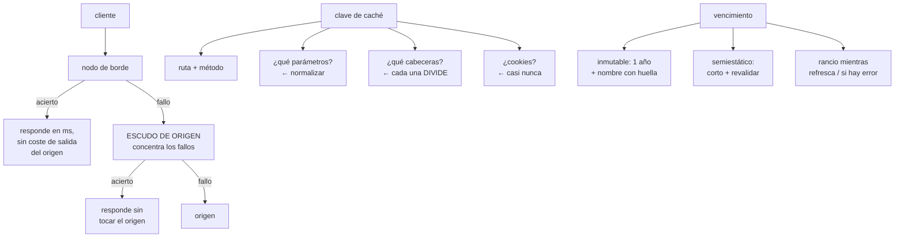

# 197 — CDN, caché, origin shielding y edge compute

> [← 196 · Balanceo L4/L7, proxies, TLS y gestión de certificados](../../part-16-advanced-cloud-networking-edge/196-balanceo-l4-l7-proxies-tls-y-gestion-de-certificados/README.md) · [Índice de la parte](../README.md) · [198 · VPN, Direct Connect, ExpressRoute e Interconnect →](../../part-16-advanced-cloud-networking-edge/198-vpn-direct-connect-expressroute-e-interconnect/README.md)

**Parte:** 16 — Redes cloud avanzadas, conectividad híbrida y edge<br>
**Nivel:** avanzado · **Horas estimadas:** 4<br>
**Laboratorio:** `performance` · **Estado:** `EXECUTABLE_CORE`

## 🎯 Propósito

Servir desde el borde lo que no hace falta calcular otra vez, que es la palanca más grande que existe sobre latencia y coste de salida a la vez. La clase explica qué determina de verdad la tasa de aciertos —la clave de caché, no el producto—, cómo se invalida sin tirar el origen, qué es y para qué sirve el escudo de origen, y dónde tiene sentido ejecutar código en el borde y dónde es una complicación cara.

## 📚 Resultados de aprendizaje

Al finalizar podrás:

1. **Diseñar** la clave de caché para maximizar aciertos sin servir contenido incorrecto.
2. **Elegir** los tiempos de validez y la revalidación adecuados a cada contenido.
3. **Invalidar** sin provocar una avalancha contra el origen.
4. **Aplicar** el escudo de origen y medir lo que ahorra.
5. **Decidir** qué ejecutar en el borde y qué no.

## 🧩 Conceptos centrales

| Concepto | Comprensión verificable |
|---|---|
| `clave de caché` | Conjunto de elementos de la petición que identifican una entrada. Determina la tasa de aciertos más que ningún otro factor. |
| `tasa de aciertos` | Proporción de peticiones servidas sin ir al origen. Se mide por ruta, no en global. |
| `revalidación` | Preguntar al origen si el contenido cambió sin volver a descargarlo, usando validadores. |
| `contenido rancio` | Servir una copia vencida mientras se refresca o cuando el origen falla. Convierte una caída en una degradación. |
| `escudo de origen` | Capa intermedia que concentra los fallos de caché de todos los nodos y protege al origen. |
| `avalancha` | Muchas peticiones simultáneas al origen tras una invalidación o un vencimiento común. |

## 🧠 Modelo mental

La red cloud es un sistema distribuido de rutas, identidades y políticas; cada salto añade latencia, costo y una frontera de fallo.

Aplicado a esta clase, separa siempre cuatro planos: **intención** (qué necesita el usuario),
**configuración** (qué declaramos), **estado observado** (qué existe de verdad) y
**evidencia** (cómo sabemos que cumple). Confundirlos produce diseños que se ven correctos
en un diagrama pero fallan al operar.

## 🗺️ Flujo de razonamiento



## 📖 Desarrollo

### 1. La clave de caché lo decide casi todo

La tasa de aciertos no depende del producto: depende de **cuántas entradas distintas se generan para el mismo contenido**.

```text
CADA ELEMENTO QUE ENTRA EN LA CLAVE MULTIPLICA LAS ENTRADAS

  ruta                                  1 entrada
  + 3 valores de idioma                 3
  + 4 valores de moneda                12
  + cabecera de agente de usuario     ×miles   ← desastre
  + cookie de sesión                  ×usuarios ← desastre
```

Y los errores que hunden la tasa de aciertos, por frecuencia:

```text
1. INCLUIR TODOS LOS PARÁMETROS DE CONSULTA
   ?id=7&utm_source=correo&fbclid=xyz
   → los de seguimiento crean una entrada por usuario
   solución   lista de parámetros que SÍ entran; el resto
              se ignora o se elimina

2. INCLUIR COOKIES
   una cookie de sesión o de analítica en la clave hace la
   caché inútil
   solución   no incluir cookies salvo en rutas concretas

3. INCLUIR EL AGENTE DE USUARIO
   miles de variantes
   solución   si hay que variar por dispositivo, usar una
              clasificación de 2-3 valores, no la cabecera

4. NO NORMALIZAR
   /producto?a=1&b=2 y /producto?b=2&a=1 son la misma cosa
   solución   ordenar y normalizar antes de construir la
              clave
```

Y el error simétrico, que es peor:

```text
CLAVE DEMASIADO CORTA
  no incluir el idioma cuando el contenido varía por idioma
  → se sirve contenido incorrecto a alguien
  → y se sirve DESDE CACHÉ, así que dura hasta que vence

→ el mecanismo correcto es declarar la variación en la
  respuesta, para que la caché sepa qué diferencia
```

Y la medida que hay que mirar:

```text
tasa de aciertos POR RUTA, no global
  la global la domina lo estático y esconde el problema
  → una ruta con 12 % de aciertos y mucho tráfico es donde
    está el dinero

y además: bytes servidos desde el borde frente a bytes desde
el origen
  → es lo que se traduce directamente en coste de salida
                                                  clase 168
```

### 2. Vencimiento, revalidación y contenido rancio

Hay tres decisiones distintas y suelen confundirse en un solo número.

```text
1. CUÁNTO PUEDE SERVIRSE SIN PREGUNTAR      (validez)
2. QUÉ HACER CUANDO VENCE                   (revalidar)
3. QUÉ HACER SI EL ORIGEN NO RESPONDE       (rancio)
```

**El patrón por tipo de contenido:**

```text
INMUTABLE (recursos con huella en el nombre)
  app.7f3a91.js
  validez   1 año, e inmutable
  cambio    nombre nuevo; no hay que invalidar nada
  → es la forma más eficaz y la más infrautilizada

SEMIESTÁTICO (páginas, listados, imágenes de producto)
  validez   corta (30-300 s)
  y además  rancio mientras refresca
  → el usuario nunca espera al origen

PERSONALIZADO
  no se cachea en el borde, o se cachea la parte común y se
  compone
  → separar la página en trozos cacheables y trozos propios

API DE LECTURA
  validez corta con revalidación por validador
  → respuesta 304 sin cuerpo: ahorra ancho de banda aunque
    no ahorre latencia

API DE ESCRITURA
  nunca
```

**Contenido rancio**, que es la función más valiosa y la menos configurada:

```text
RANCIO MIENTRAS REFRESCA
  al vencer, se sirve la copia vieja INMEDIATAMENTE y se
  refresca por detrás
  → el usuario nunca paga la latencia del origen
  → y desaparece la avalancha por vencimiento simultáneo

RANCIO SI HAY ERROR
  si el origen devuelve error o no responde, se sirve la
  copia vieja
  → convierte una caída del origen en contenido con unos
    minutos de antigüedad
  → esto es lo que hace que la caída no se note      clase 185
```

Y el dato que justifica configurarlo:

```text
un origen caído 20 minutos con rancio-si-error activo y
validez de 5 minutos
  → los usuarios ven contenido de hasta 25 minutos de
    antigüedad
  → en vez de una página de error
```

**La avalancha**, que es el fallo característico de las cachés:

```text
CÓMO OCURRE
  todo se cachea a la vez (tras un despliegue o una
  invalidación) y vence a la vez
  → miles de peticiones simultáneas al origen
  → el origen cae, y al recuperarse vuelve a pasar

CÓMO SE EVITA
  rancio mientras refresca
  colapso de peticiones: una sola petición al origen por
    clave; las demás esperan esa
  dispersión del vencimiento: validez ± un porcentaje al azar
  y no invalidar todo a la vez               ← ver abajo
```

### 3. Invalidar y proteger el origen

**La invalidación** es la operación más peligrosa de una caché.

```text
POR PREFIJO O COMODÍN
  /productos/*
  → invalida miles de entradas de golpe
  → todas las peticiones siguientes van al origen
  → es la causa de la avalancha de la clase 111

POR ETIQUETA
  cada respuesta lleva etiquetas: producto:7, categoría:3
  al cambiar el producto 7 se invalida solo lo suyo
  → es el mecanismo correcto y hay que diseñarlo desde el
    principio

POR NOMBRE NUEVO (versionado)
  no se invalida nada: el recurso nuevo tiene otro nombre
  → cero riesgo; es lo mejor cuando se puede
```

Y las reglas de operación:

```text
una invalidación masiva se hace con el origen preparado
  → o escalonada, por lotes
  → nunca en hora punta
y se mide el efecto en la carga del origen
```

**El escudo de origen**, que resuelve un problema concreto:

```text
SIN ESCUDO
  200 nodos de borde; cada uno falla su caché por separado
  → hasta 200 peticiones al origen por el mismo objeto

CON ESCUDO
  los fallos de todos los nodos van a una capa intermedia
  → el origen ve 1 petición por objeto

EFECTO TÍPICO
  reducción del tráfico al origen entre 3× y 10×
  y mejora de la tasa de aciertos global, porque el escudo
  acumula lo que cada nodo individualmente no vería
```

Y dónde ponerlo:

```text
cerca del origen, no cerca de los usuarios
→ y si hay varias regiones de origen, un escudo por región
```

**Lo que se ahorra**, que es la justificación de todo el capítulo:

```text
CADA ACIERTO EN EL BORDE
  no consume cómputo del origen
  no consume ancho de banda de salida del origen  ← el caro
  responde en 5-30 ms en vez de 80-300 ms

y el coste de salida desde el borde suele ser la mitad o
menos que desde el origen
→ subir 10 puntos la tasa de aciertos en la ruta de más
  tráfico suele valer más que cualquier optimización de
  código                                          clase 168
```

### 4. Cómputo en el borde: cuándo sí

Ejecutar código en los nodos de borde permite decidir cosas antes de llegar al origen. Es útil en un conjunto de casos concreto y una mala idea fuera de él.

```text
DONDE SÍ COMPENSA
  reescribir rutas y normalizar la clave de caché
  redirigir por país, idioma o dispositivo
  autenticar o rechazar antes de llegar al origen
  componer una página con trozos cacheados
  pruebas A/B decidiendo la variante en el borde
  firmar o validar testigos de acceso a contenido
  añadir cabeceras de seguridad

DONDE NO
  lógica de negocio con estado
  acceso a base de datos
  procesos largos
  cualquier cosa que necesite consistencia fuerte
```

Y las limitaciones que hay que conocer antes de empezar:

```text
tiempo de ejecución muy corto (milisegundos)
memoria pequeña
sin estado compartido fiable entre nodos
latencia alta hacia cualquier base de datos central
depuración difícil: cientos de nodos
despliegue global que tarda minutos en propagarse
```

Y la advertencia operativa:

```text
un error en el código de borde afecta a CUANTO tráfico pasa a
la vez, y no hay despliegue escalonado natural
→ desplegar por porcentaje de tráfico si el producto lo
  permite, y tener vuelta atrás rápida    clase 102
```

Y una decisión de diseño que evita mucho trabajo:

```text
lo que se pueda resolver con configuración de caché, no se
resuelve con código en el borde
→ normalizar parámetros, variar por idioma y añadir
  cabeceras suelen ser configuración
```

Y la lista de comprobación de la clase:

```text
☐ la tasa de aciertos se mide por ruta, no en global
☐ los parámetros de seguimiento no entran en la clave
☐ no hay cookies en la clave salvo en rutas concretas
☐ los parámetros se normalizan y se ordenan
☐ la variación por idioma o dispositivo está declarada
☐ los recursos versionados usan huella en el nombre y validez
  larga
☐ está activado rancio mientras refresca
☐ está activado rancio si hay error
☐ hay colapso de peticiones por clave
☐ el vencimiento está disperso
☐ la invalidación es por etiqueta, no por comodín
☐ hay escudo de origen y se ha medido lo que ahorra
☐ se miden bytes servidos desde el borde y desde el origen
☐ el código de borde no hace lógica de negocio con estado
```

Y el cierre que enlaza con la clase siguiente: el borde resuelve el tráfico que viene de internet, pero buena parte del tráfico de una empresa va contra su propia red. Conectar la nube con los centros de datos —túneles, enlaces dedicados y su operación— es la materia de la clase 198.

## 🔬 Ejemplo trabajado

**CloudShop tiene una tasa de aciertos global del 71 % y una factura de salida de 14.200 €/mes. Lo que sigue es el análisis por ruta, los cuatro cambios de clave de caché, y el resultado a los tres meses.**

**Lo que decía el panel:**

```text
tasa de aciertos global                         71 %
«está bien, la mayoría se sirve del borde»
```

**Lo que decía el desglose por ruta:**

```text
ruta                    peticiones/día   aciertos   bytes al origen
/estáticos/*                12,4 M         99,4 %      1,2 %
/imagenes/producto/*         8,1 M         96,1 %      6,4 %
/api/catalogo/listado        4,7 M          8,2 %     41,3 %  ←
/producto/{id}               3,2 M         34,0 %     22,7 %  ←
/api/precios/{id}            2,9 M          0 %       11,8 %
/buscar                      1,1 M          0 %        9,3 %
resto                        0,8 M         62 %        7,3 %
```

Y la lectura:

```text
el 71 % global lo produce lo estático, que ya estaba resuelto
las dos rutas que generan el 64 % del tráfico al origen
tienen tasas del 8 % y del 34 %
→ ahí está el dinero y la latencia
```

**Diagnóstico de /api/catalogo/listado: 8,2 % de aciertos.**

```text
la clave incluía
  ruta
  TODOS los parámetros de consulta
  cabecera de agente de usuario
  cookie de sesión

lo que eso producía
  parámetros reales que cambian el contenido        3
    categoria, pagina, orden
  parámetros de seguimiento que llegaban           11
    utm_source, utm_medium, utm_campaign, fbclid, gclid…
  variantes de agente de usuario observadas    ~14.000
  cookies de sesión                          1 por usuario

→ entradas distintas para el mismo contenido: prácticamente
  una por petición
→ por eso el 8,2 %, que venía de recargas inmediatas
```

**Los cuatro cambios.**

```text
CAMBIO 1 · lista blanca de parámetros
  entran   categoria, pagina, orden
  se ignoran los 11 de seguimiento y cualquiera nuevo
  además   se ordenan alfabéticamente antes de la clave

CAMBIO 2 · fuera el agente de usuario
  el contenido no variaba por dispositivo en esta ruta
  → eliminado de la clave

CAMBIO 3 · fuera las cookies
  el listado no es personalizado
  la personalización (los 3 productos recomendados) se
  extrajo a una llamada aparte que no se cachea
  → la página común se cachea; la parte propia, no

CAMBIO 4 · validez y rancio
  validez              60 s
  rancio mientras refresca   600 s
  rancio si hay error      86.400 s (1 día)
  dispersión del vencimiento  ±15 %
  colapso de peticiones    activado
```

Y el resultado de esa ruta:

```text                                    antes      después
tasa de aciertos                       8,2 %       94,1 %
p50 de la ruta                        112 ms         9 ms
p99 de la ruta                        890 ms        38 ms
peticiones/día al origen              4,31 M       0,28 M
```

**Diagnóstico de /producto/{id}: 34 % de aciertos.**

```text
causa    invalidación por comodín
         cada cambio de precio invalidaba /producto/*
         y los precios cambian 11 veces al mes… por producto
         → en la práctica, invalidaciones masivas casi diarias

y el efecto secundario
  tras cada invalidación, avalancha contra el origen
  → 3 incidentes de latencia en el año coincidían con
    invalidaciones                                clase 111

corrección
  etiquetado de respuestas: producto:{id}, categoria:{id}
  invalidación por etiqueta: cambiar el producto 4471
  invalida solo lo suyo
  y la invalidación por comodín se desactivó por política

resultado                              antes      después
tasa de aciertos                        34 %        88 %
entradas invalidadas por cambio     ~310.000           4
avalanchas contra el origen           3/año           0
```

**El escudo de origen.**

```text
antes   214 nodos de borde, cada uno fallando por su cuenta
        peticiones al origen por objeto nuevo: hasta 190

después escudo en la región del origen
        peticiones al origen por objeto nuevo: 1

efecto medido
  peticiones/s al origen en el pico     3.100  →  410
  ancho de banda de salida del origen   -78 %
  y un efecto no previsto: la tasa de aciertos global subió
    2,3 puntos más, porque el escudo acumula lo que un nodo
    con poco tráfico nunca llegaría a cachear
```

**Las dos rutas que no se cachearon, y por qué:**

```text
/api/precios/{id}
  se evaluó y se descartó cachear en el borde
  motivo   el precio ya se cachea 15 min en la aplicación
           (clase 187) y el volumen al origen es pequeño
  además   una caché más añade otra capa donde el precio
           puede quedarse viejo, y ya hay una decisión de
           consistencia tomada

/buscar
  las consultas son casi únicas: la tasa de aciertos
  estimada era del 4 %
  → no compensa
```

Y esa segunda decisión merece nota:

```text
se midió antes de configurar
→ configurar caché en una ruta con 4 % de aciertos añade
  complejidad y no ahorra nada
```

**El cómputo en el borde, donde se usó y donde no:**

```text
SÍ
  normalización de parámetros y de mayúsculas en la ruta
  redirección por país a la tienda correspondiente
  validación del testigo firmado para descargas privadas
    → rechaza el 100 % de las peticiones sin testigo válido
      sin tocar el origen
  cabeceras de seguridad

NO
  se propuso mover el cálculo de recomendaciones al borde
  → necesitaba consultar un almacén central en cada petición
  → la latencia hacia el almacén desde un nodo lejano era
    de 90-140 ms, peor que ir al origen
  → descartado, con el registro correspondiente  clase 190
```

**El resultado global, a los tres meses:**

```text                                        antes     después
tasa de aciertos global                     71 %       97,2 %
tasa de aciertos de /api/catalogo/listado  8,2 %       94,1 %
tasa de aciertos de /producto/{id}          34 %         88 %
peticiones/s al origen en el pico          3.100         410
p50 del listado en el borde               112 ms        9 ms
coste de salida                        14.200 €/mes  4.900 €/mes
coste de cómputo del origen             -3.400 €/mes (2 zonas
                                        menos de instancias)
avalanchas                                 3/año           0
```

Y el detalle que resume el capítulo:

```text
del ahorro de 9.300 €/mes, la mayor parte vino de un cambio
que no tocó ni una línea de código de la aplicación:
dejar de incluir en la clave once parámetros de seguimiento,
el agente de usuario y una cookie
```

**La lección que esta clase deja**: la tasa de aciertos global del 71 % **escondía dos rutas al 8 % y al 34 %** que generaban el 64 % del tráfico al origen, y ninguna de las dos tenía un problema de producto: una tenía la clave de caché mal construida y la otra se invalidaba con comodín. Y el mayor ahorro del año se consiguió **quitando cosas de la clave**, no añadiendo capacidad.

## 🧪 Laboratorio guiado

Ejecuta desde la raíz:

```bash
python classes/part-16-advanced-cloud-networking-edge/197-cdn-cache-origin-shielding-y-edge-compute/lab.py
```

El laboratorio selecciona el motor de práctica **`performance`** y produce
`lab_result.json`. El escenario, sus comprobaciones y el artefacto esperado corresponden a
esta clase; no requiere credenciales y deja explícito qué debe revalidarse en un sandbox real.

1. Lee `exercise.steps` y formula una predicción antes de ejecutar.
2. Ejecuta la práctica y verifica todos los elementos de `checks`.
3. Provoca el caso de `negative_test` y explica la señal observada.
4. Materializa `cdn-experiment` en `evidence/` usando la plantilla indicada.
5. Para proveedor real, sigue `sandbox.requires`, registra costo y ejecuta `destroy`.

### Evidencia esperada

El artefacto principal es una prueba de carga con baseline y cuello de botella. Además, la entrega debe incluir el comando ejecutado,
la salida estructurada y una conclusión que no exceda lo observado.

## 🏆 Reto verificable

Construye **`cdn-experiment`** para el caso CloudShop. Incluye una alternativa descartada,
un supuesto que pueda falsarse, una prueba de fallo y una decisión de rollback.

## ✅ Criterio de aceptación

- [ ] `lab.py` termina con código 0 y genera JSON válido.
- [ ] La entrega conecta al menos tres requisitos con mecanismos verificables.
- [ ] Existe una prueba positiva y una prueba negativa con evidencia.
- [ ] Seguridad, costo y operación aparecen como decisiones, no como anexos.
- [ ] Se declara una limitación y una condición que obligaría a revisar el diseño.
- [ ] Otra persona puede repetir el recorrido sin conocimiento tácito.

## ⚠️ Errores frecuentes

| Síntoma | Causa probable | Corrección |
|---|---|---|
| La tasa de aciertos es alta en global y el origen recibe mucho tráfico | La global la domina el contenido estático y esconde rutas con tasas bajas | Mide aciertos y bytes al origen por ruta, y ataca las rutas con más tráfico y peor tasa. |
| Casi cada petición genera una entrada nueva | La clave incluye parámetros de seguimiento, cookies o el agente de usuario | Usa lista blanca de parámetros, normaliza y ordena, y saca cookies y agente de usuario de la clave. |
| Se sirve contenido incorrecto a algunos usuarios | La clave es demasiado corta y no distingue una variación real | Declara la variación en la respuesta para que la caché sepa qué diferencia, en vez de ampliar la clave a ciegas. |
| Tras cada invalidación el origen se satura | Invalidación por comodín y vencimiento simultáneo | Invalida por etiqueta, activa rancio mientras refresca, colapso de peticiones y dispersión del vencimiento. |
| Una caída del origen se ve como página de error | No está activado servir contenido rancio si hay error | Configura rancio si hay error con una ventana amplia; convierte la caída en contenido con algo de antigüedad. |
| El código en el borde resulta más lento que ir al origen | Necesita consultar un almacén central en cada petición | Reserva el borde para decisiones sin estado; lo que dependa de datos centrales, déjalo en el origen. |

## 🛡️ Seguridad, ética y costo

Trabaja con cuentas propias o sandboxes autorizados. No publiques secretos, identificadores
reales ni datos personales. Antes de crear recursos pagos define presupuesto, etiquetas y
comando de destrucción; después verifica que no queden recursos huérfanos. Los ejemplos
locales enseñan contratos, pero no certifican cumplimiento ni disponibilidad de producción.

## ❓ Preguntas de comprobación

1. ¿Qué factor determina la tasa de aciertos más que ningún otro?
2. ¿Cómo se sirve contenido que varía por idioma sin destrozar la caché?
3. ¿Qué diferencia hay entre rancio mientras refresca y rancio si hay error?
4. ¿Por qué la invalidación por comodín provoca avalanchas y qué la sustituye?
5. ¿Qué problema concreto resuelve el escudo de origen?

## 🔗 Referencias

- RFC 9111 — HTTP caching. <https://www.rfc-editor.org/rfc/rfc9111>
- RFC 5861 — HTTP cache-control extensions for stale content. <https://www.rfc-editor.org/rfc/rfc5861>
- AWS (2025). *CloudFront: cache key and origin shield*. <https://docs.aws.amazon.com/AmazonCloudFront/latest/DeveloperGuide/understanding-the-cache-key.html>
- Fastly (2025). *Purging with surrogate keys*. <https://docs.fastly.com/en/guides/working-with-surrogate-keys>
- Cloudflare (2025). *Cloudflare Workers: what edge compute is good for*. <https://developers.cloudflare.com/workers/>
- Documentación oficial vigente del servicio implementado; registra URL y fecha de consulta.

---

> [Evaluación](assessment.md) · [Contrato de clase](lesson.yaml) · [Índice de la parte](../README.md)

**📥 Descargar:** [Parte 16 en PDF](../../../site/downloads/partes/manual-parte-16-advanced-cloud-networking-edge.pdf) · [Manual integral](../../../site/downloads/multi-cloud-engineering-manual-v2.0.pdf)

| Anterior | Índice | Siguiente |
|---|---|---|
| [← 196 · Balanceo L4/L7, proxies, TLS y gestión de certificados](../../part-16-advanced-cloud-networking-edge/196-balanceo-l4-l7-proxies-tls-y-gestion-de-certificados/README.md) | [Parte 16](../README.md) · [Programa](../../README.md) | [198 · VPN, Direct Connect, ExpressRoute e Interconnect →](../../part-16-advanced-cloud-networking-edge/198-vpn-direct-connect-expressroute-e-interconnect/README.md) |
