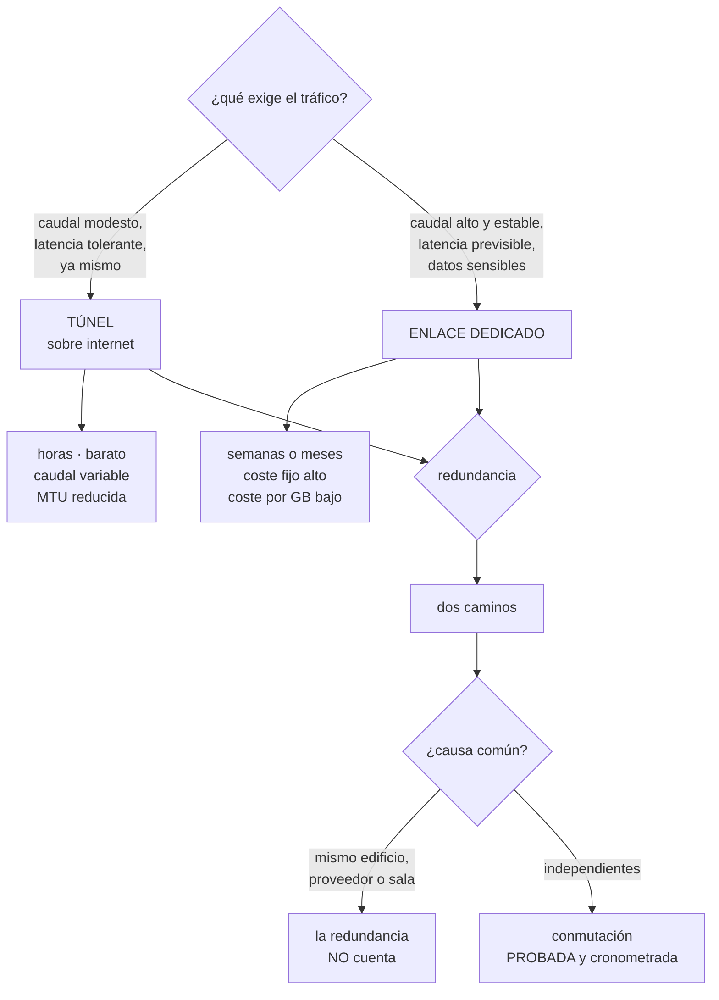

# 198 — VPN, Direct Connect, ExpressRoute e Interconnect

> [← 197 · CDN, caché, origin shielding y edge compute](../../part-16-advanced-cloud-networking-edge/197-cdn-cache-origin-shielding-y-edge-compute/README.md) · [Índice de la parte](../README.md) · [199 · Transit Gateway, Virtual WAN y Network Connectivity Center →](../../part-16-advanced-cloud-networking-edge/199-transit-gateway-virtual-wan-y-network-connectivity-center/README.md)

**Parte:** 16 — Redes cloud avanzadas, conectividad híbrida y edge<br>
**Nivel:** avanzado · **Horas estimadas:** 4<br>
**Laboratorio:** `network` · **Estado:** `EXECUTABLE_CORE`

## 🎯 Propósito

Conectar la nube con los centros de datos y las oficinas eligiendo bien entre túnel por internet y enlace dedicado, que se decide casi siempre por costumbre y casi nunca por cifras. La clase compara las dos opciones por lo que de verdad las diferencia —previsibilidad, plazo de provisión y coste por gigabyte—, explica cómo se construye la redundancia que sí protege, y detalla los fallos de operación que producen la mayoría de los incidentes: túneles con parámetros desalineados, ancho de banda mal dimensionado y enlaces sin conmutación probada.

## 📚 Resultados de aprendizaje

Al finalizar podrás:

1. **Elegir** entre túnel e enlace dedicado con criterios medibles.
2. **Dimensionar** el ancho de banda contando lo que de verdad va a cruzar.
3. **Diseñar** redundancia sin causas comunes ocultas.
4. **Operar** túneles y enlaces con la vigilancia que evita los fallos típicos.
5. **Probar** la conmutación antes de necesitarla.

## 🧩 Conceptos centrales

| Concepto | Comprensión verificable |
|---|---|
| `túnel sobre internet` | Conexión cifrada entre dos redes a través de internet. Barata, rápida de montar, con latencia y caudal variables. |
| `enlace dedicado` | Circuito físico privado hacia el proveedor. Previsible y con caudal garantizado; caro y lento de provisionar. |
| `asociación virtual` | Circuito lógico sobre un enlace físico, que separa el tráfico privado del de servicios públicos. |
| `MTU y fragmentación` | Tamaño máximo de paquete. Un túnel lo reduce, y si no se ajusta produce fallos parciales difíciles de diagnosticar. |
| `causa común` | Elemento compartido por dos caminos supuestamente redundantes: mismo edificio, mismo proveedor, misma sala. |
| `conmutación probada` | Cambio al camino de respaldo ejecutado de verdad y cronometrado, no descrito en un documento. |

## 🧠 Modelo mental

La red cloud es un sistema distribuido de rutas, identidades y políticas; cada salto añade latencia, costo y una frontera de fallo.

Aplicado a esta clase, separa siempre cuatro planos: **intención** (qué necesita el usuario),
**configuración** (qué declaramos), **estado observado** (qué existe de verdad) y
**evidencia** (cómo sabemos que cumple). Confundirlos produce diseños que se ven correctos
en un diagrama pero fallan al operar.

## 🗺️ Flujo de razonamiento



## 📖 Desarrollo

### 1. Túnel o enlace dedicado

Las dos opciones resuelven lo mismo y se diferencian en cinco cosas que se pueden medir.

```text
                        TÚNEL             ENLACE DEDICADO
plazo de provisión      horas             4-12 semanas
coste fijo              bajo (~50-300 €)  alto (500-5.000 €/mes
                                          + puerto + cruce)
coste por GB            el de salida      claramente menor
                        estándar          (a menudo la mitad
                                          o menos)
caudal                  limitado por la   garantizado por
                        pasarela          contrato
                        (1-10 Gbps según
                        producto)
latencia                variable,         estable,
                        depende de        previsible
                        internet
jitter                  alto              bajo
```

Y el criterio que decide de verdad:

```text
¿el tráfico es SENSIBLE A LA VARIABILIDAD?
  replicación de bases, escritorios remotos, voz, sistemas
  transaccionales antiguos
  → enlace dedicado

¿el volumen mensual es alto?
  calcula el punto de equilibrio:
    coste fijo del enlace / (ahorro por GB)
  → a partir de cierto volumen, el enlace sale más barato
    aunque no se necesite su previsibilidad

¿hace falta ya y el volumen es modesto?
  → túnel, y se decide después con datos
```

Y el patrón que evita elegir mal:

```text
empieza con túnel, mide durante 2-3 meses, y decide
→ y deja el túnel como respaldo del enlace cuando llegue
→ así el enlace no nace sin redundancia
```

**Las asociaciones virtuales**, que confunden al principio:

```text
un enlace físico transporta VARIOS circuitos lógicos
  uno privado hacia tu red virtual
  uno público hacia los servicios del proveedor sin pasar
    por internet                                   clase 200
  uno de tránsito hacia una pasarela central       clase 199

→ y cada uno tiene su propia sesión BGP y sus rutas
                                                   clase 194
```

Y una decisión que ahorra dinero y casi nadie hace:

```text
el tráfico hacia los almacenes de objetos y otros servicios
del proveedor puede ir por el circuito público del enlace
→ evita el coste de salida a internet
→ pero ojo: el circuito público anuncia MUCHOS prefijos
  → y ahí es donde se supera el límite de la sesión BGP
                                                   clase 194
```

### 2. Dimensionar y la trampa de la MTU

**El dimensionado** se hace mal por contar solo lo que se ve.

```text
LO QUE CRUZA Y NADIE CUENTA
  copias de seguridad y su ventana nocturna
  replicación de bases de datos                    clase 161
  sincronización de ficheros y de imágenes
  telemetría y registros hacia el recolector central
  actualizaciones de sistema operativo
  escritorios remotos, si los hay
  y el pico de una migración, que puede ser 20× lo normal

REGLA
  dimensiona por el percentil 95 del tráfico, no por la media
  → los proveedores facturan así, y el codo también está ahí
                                                   clase 186
```

Y el error de saturación, que se manifiesta raro:

```text
un enlace saturado no «va más lento» de forma uniforme
  se llenan las colas de los equipos
  sube la latencia y el jitter
  se descartan paquetes
  → y lo primero que falla es lo sensible a la variabilidad,
    no lo que consume el ancho de banda

→ síntoma típico: la replicación va bien y las sesiones
  interactivas se cortan
```

**La MTU**, que es la causa de una familia entera de fallos difíciles:

```text
un túnel AÑADE cabeceras y por tanto REDUCE el tamaño útil
  típico   1.500 → 1.436 o menos según el tipo de túnel

SI NO SE AJUSTA
  los paquetes grandes no caben y hay que fragmentar o
  descartar
  el mecanismo estándar de descubrimiento depende de mensajes
  de control que muchos cortafuegos bloquean
  → y entonces los paquetes se descartan EN SILENCIO

LA FIRMA DEL FALLO
  las conexiones se establecen (paquetes pequeños)
  las peticiones pequeñas funcionan
  las respuestas grandes se cuelgan
  el fichero de 2 KB baja y el de 2 MB no
  y a veces funciona con un cliente y no con otro
```

Y las correcciones, por orden:

```text
1  permitir los mensajes de control necesarios en los
   cortafuegos    ← lo correcto
2  ajustar la MTU en las interfaces de los extremos
3  ajustar el tamaño máximo de segmento en el punto de
   entrada del túnel
→ y comprobarlo con un paquete grande sin fragmentar, no
  suponerlo
```

### 3. Redundancia que sí protege

Duplicar el enlace es fácil; conseguir que los dos no caigan a la vez, no.

```text
LAS CAUSAS COMUNES QUE ANULAN LA REDUNDANCIA  clase 185
  los dos circuitos entran por el mismo edificio
  los dos usan el mismo proveedor de última milla
  los dos terminan en la misma sala o en el mismo equipo
  los dos van por la misma zanja      ← ocurre más de lo que
                                        parece
  los dos usan el mismo router de la nube
  las dos sesiones BGP tienen el mismo límite de prefijos
    → se caen juntas por el mismo motivo            clase 194
```

Y las preguntas que hay que hacer al proveedor, por escrito:

```text
¿por qué ruta física va cada circuito?
¿comparten alguna sección? ¿cuál?
¿en qué sala termina cada uno?
¿qué proveedor de última milla usa cada uno?
→ y si no contestan con precisión, la redundancia es una
  suposición
```

**Los niveles de redundancia**, con lo que cubre cada uno:

```text
UN ENLACE, SIN NADA
  → un corte es una caída total; plazo de reparación de
    horas o días

UN ENLACE + TÚNEL DE RESPALDO
  cubre el corte del enlace, con caudal y latencia peores
  → suficiente para la mayoría, y es lo más rentable
  → exige probar la conmutación                     ley 22

DOS ENLACES, MISMA UBICACIÓN
  cubre el fallo de un puerto o un equipo
  no cubre el corte de la fibra ni el fallo del edificio

DOS ENLACES, UBICACIONES DISTINTAS
  cubre casi todo
  → y es lo que exigen los acuerdos de nivel de servicio
    más altos de los proveedores

DOS ENLACES + DOS REGIONES DE NUBE
  para cuando el objetivo de continuidad lo exige
                                                  clase 166
```

Y una advertencia sobre los acuerdos de nivel de servicio:

```text
el proveedor promete un porcentaje SOLO si cumples su
topología de referencia
→ un solo enlace no tiene compromiso, aunque se pague
→ leerlo antes de prometer disponibilidad aguas arriba
                                                  clase 185
```

Y el reparto del tráfico entre dos caminos:

```text
ACTIVO-PASIVO   más simple; el respaldo se prueba poco
                → y por eso falla cuando hace falta
ACTIVO-ACTIVO   ambos en uso; el fallo se nota antes
                → pero exige cuidar la simetría     clase 194

y si es activo-pasivo, ejercitar el pasivo periódicamente
con tráfico real es lo único que garantiza que funcione
```

### 4. Operación y prueba

Los enlaces y túneles fallan poco, y por eso su operación se descuida.

```text
LO QUE HAY QUE VIGILAR
  estado del circuito físico (luz, errores de trama)
  estado de la sesión BGP y prefijos recibidos      clase 194
  utilización, en percentil 95, contra el contratado
  latencia y jitter entre extremos, continuamente
  pérdida de paquetes
  y para túneles: estado de la asociación de seguridad y
    renegociaciones
```

Y las alertas que más incidentes evitan:

```text
«utilización por encima del 70 % sostenida»
  → antes de que se note en la latencia
«el respaldo lleva N días sin llevar tráfico»       ley 13
  → detecta el respaldo que ya no funciona
«la latencia ha cambiado de forma sostenida»
  → suele significar que se conmutó a otro camino sin
    que nadie lo supiera
```

Y esa última merece detalle:

```text
un cambio de latencia de 4 ms a 28 ms sin aviso significa
que el tráfico está pasando por otro sitio
→ y muy a menudo, por el respaldo, sin que nadie lo sepa
→ el enlace principal lleva días caído y no ha saltado
  ninguna alerta                                    ley 15
```

**Los parámetros de túnel desalineados**, que causan cortes periódicos:

```text
SÍNTOMA CLÁSICO
  el túnel se cae y se levanta cada 8 horas, o cada 24
  → tiempos de vida de las claves distintos en cada extremo
  → o algoritmos negociados de forma distinta

OTROS PARÁMETROS QUE HAY QUE ALINEAR
  tiempos de vida de fase 1 y fase 2
  detección de par muerto y sus umbrales
  quién inicia la renegociación
  selectores de tráfico

→ y la configuración de los dos extremos debe estar en el
  mismo repositorio, no en dos consolas distintas
                                                  clase 190
```

**Las pruebas negativas** de esta clase:

```text
☐ desconectar el enlace principal y cronometrar la
  conmutación
☐ comprobar que tras conmutar, la ida y la vuelta siguen
  siendo simétricas                                clase 194
☐ enviar un paquete grande sin fragmentar por el túnel
☐ saturar el enlace al 100 % y ver qué se degrada primero
☐ dejar el respaldo llevando tráfico real durante 24 h
☐ simular la caída de una sesión BGP y medir el
  restablecimiento
☐ volver al principal y comprobar que no queda tráfico
  asimétrico
```

Y la lista de comprobación de la clase:

```text
☐ la elección entre túnel y enlace está justificada con
  cifras de volumen y de variabilidad
☐ el dimensionado usa el percentil 95 e incluye copias,
  replicación y telemetría
☐ la MTU está ajustada y comprobada con paquete grande
☐ está documentada la ruta física de cada circuito
☐ no hay causa común entre los dos caminos
☐ el acuerdo de nivel de servicio corresponde a la topología
  desplegada
☐ hay alerta de utilización al 70 %
☐ hay alerta de respaldo sin tráfico durante N días
☐ hay alerta de cambio sostenido de latencia
☐ los parámetros de túnel están alineados y versionados
☐ la conmutación se ha ejecutado y cronometrado
```

Y el cierre que enlaza con la clase siguiente: con varias redes, varias cuentas y varios enlaces, conectar cada cosa con cada cosa deja de funcionar. Las pasarelas de tránsito y los concentradores de conectividad son la materia de la clase 199.

## 🔬 Ejemplo trabajado

**CloudShop conecta dos centros de datos y once oficinas con tres nubes. Lo que sigue es la decisión entre túnel y enlace con sus cifras, el incidente de MTU que duró cinco meses, y la redundancia que resultó no serlo.**

**La decisión, con datos de tres meses de túnel.**

```text
tráfico medido entre el centro de datos principal y la nube

  medio                                    340 Mbps
  percentil 95                             820 Mbps
  pico durante la ventana de copias      1,9 Gbps
  volumen mensual                           94 TB

  desglose del percentil 95
    replicación de la base heredada          41 %
    copias de seguridad nocturnas            27 %
    telemetría hacia el recolector           14 %
    tráfico de aplicación                    11 %
    actualizaciones y otros                   7 %

y la variabilidad observada con el túnel
  latencia p50                              9 ms
  latencia p99                             84 ms
  jitter                                 hasta 60 ms
  pérdida de paquetes                      0,3 %
```

Y las dos consecuencias que decidieron:

```text
1  la replicación de la base heredada se retrasaba de forma
   irregular; el retraso llegaba a 11 minutos en horas de
   internet congestionado
   → el objetivo de pérdida era de 1 minuto        clase 166
   → el túnel NO podía cumplirlo

2  el coste
   94 TB/mes por salida a internet         ~7.500 €/mes
   enlace dedicado de 1 Gbps
     puerto + cruce + circuito              2.900 €/mes
     coste por GB del enlace                 ~1.900 €/mes
     total                                   4.800 €/mes
   → ahorro de 2.700 €/mes ADEMÁS de la previsibilidad

decisión   enlace dedicado de 1 Gbps, con el túnel
           existente como respaldo
plazo      9 semanas de provisión
```

Y una decisión adicional que salió del desglose:

```text
las copias de seguridad no necesitaban ir al centro de datos
→ se reconfiguraron para escribir directamente en el
  almacén de objetos de la nube por el circuito público
  del enlace
→ el percentil 95 bajó de 820 a 520 Mbps
→ y el enlace de 1 Gbps pasó de justo a holgado
```

**El incidente de MTU, que llevaba cinco meses.**

```text
síntoma reportado desde marzo
  «la exportación de informes desde la oficina de Lisboa
   falla a veces»
  se atribuyó a la aplicación; se revisó tres veces sin
  encontrar nada

lo que de verdad ocurría
  las peticiones pequeñas funcionaban siempre
  las respuestas de más de ~1,4 KB se colgaban
  el navegador esperaba hasta el plazo y fallaba

diagnóstico, en agosto
  el túnel de Lisboa tenía MTU efectiva de 1.398
  las interfaces estaban en 1.500
  el descubrimiento automático no funcionaba porque el
  cortafuegos de la oficina bloqueaba los mensajes de
  control necesarios
  → los paquetes grandes se descartaban EN SILENCIO

por qué tardó cinco meses
  el síntoma parecía de aplicación
  funcionaba desde las otras diez oficinas
  y funcionaba con ficheros pequeños, así que las pruebas
  manuales pasaban

corrección
  permitir los mensajes de control en el cortafuegos
  ajustar el tamaño máximo de segmento en el punto de
  entrada del túnel
  comprobación negativa nueva: enviar un paquete de 1.472
  bytes sin fragmentar desde CADA oficina, semanalmente
  → 2 oficinas más fallaron la primera ejecución
```

**La redundancia que no lo era.**

```text
en noviembre se contrataron DOS enlaces de 1 Gbps «para
tener redundancia»
  proveedor A, circuito 1
  proveedor A, circuito 2

la prueba negativa de diciembre
  se pidió al proveedor la ruta física de cada circuito
  respuesta, tras insistir dos semanas
    los dos circuitos entran por el MISMO edificio
    comparten los primeros 2,1 km de conducción
    y terminan en la MISMA sala del punto de presencia

→ una excavadora en esa calle habría cortado los dos
→ la redundancia no cubría el escenario más probable

corrección
  el segundo circuito se movió a otro proveedor de última
  milla y a otro punto de presencia
  coste adicional                             +610 €/mes
  y se documentó la ruta física de ambos, por escrito
```

Y el hallazgo adicional:

```text
las dos sesiones BGP tenían el mismo límite de prefijos
→ si la corporativa volvía a anunciar de más, se caían las
  dos a la vez, como en el incidente de marzo   clase 194
→ es una causa común que no es física
→ corregido con filtros y resumen en el origen
```

**La conmutación, probada.**

```text
primera ejecución, enero
  se desconectó el enlace principal a las 22:00

  detección de la caída                         14 s
  reconvergencia BGP                            41 s
  tráfico restablecido por el respaldo         55 s   ✓
  PERO
    la replicación de la base se detuvo y no se reanudó
    → su cliente tenía un plazo de 30 s y no reintentaba
    → hubo que reiniciarla a mano
    → 6 minutos de retraso acumulado

  y al VOLVER al principal
    durante 4 minutos, la ida iba por el principal y la
    vuelta por el respaldo
    → el cortafuegos con estado descartó tráfico
    → asimetría, exactamente como en la clase 194

correcciones
  reintento con retroceso en el cliente de replicación
  preferencias alineadas en ambos extremos para la vuelta
  procedimiento de vuelta escrito y probado por otra
  persona                                            ley 22

segunda ejecución, abril
  conmutación                                   52 s
  replicación                          reanudada sola
  vuelta al principal                  sin asimetría
  todo correcto
```

**La vigilancia que se montó después:**

```text
utilización p95 contra contratado, alerta al 70 %
latencia y jitter entre extremos, continuos
alerta por cambio sostenido de latencia
  → en marzo detectó que el tráfico llevaba 3 días por el
    respaldo sin que nadie lo supiera: el principal estaba
    caído desde una intervención del proveedor    ley 15
alerta «el respaldo lleva más de 45 días sin tráfico»
  → obliga a ejercitarlo
estado de sesiones BGP y prefijos recibidos
prueba de paquete grande sin fragmentar, semanal, por oficina
```

**El resultado del año siguiente:**

```text                                        antes     después
retraso máximo de replicación             11 min       38 s
incidentes atribuidos a «la aplicación»
  que eran de red                              3           0
coste mensual de conectividad          7.500 €     5.410 €
tiempo de conmutación                   sin medir      52 s
días con tráfico por el respaldo sin
  que nadie lo supiera                        3           0
circuitos con ruta física documentada          0           2
```

**La lección que esta clase deja**: la decisión entre túnel y enlace se tomó con tres meses de datos y resultó **ahorrar dinero además de resolver el problema de variabilidad**, que era lo que se buscaba. El incidente que más tiempo consumió —cinco meses— **no parecía de red**: era una MTU sin ajustar cuyo síntoma era «la exportación falla a veces». Y la redundancia contratada en noviembre **no era redundancia**: dos circuitos del mismo proveedor por la misma zanja, y hacía falta preguntarlo por escrito para saberlo.

## 🧪 Laboratorio guiado

Ejecuta desde la raíz:

```bash
python classes/part-16-advanced-cloud-networking-edge/198-vpn-direct-connect-expressroute-e-interconnect/lab.py
```

El laboratorio selecciona el motor de práctica **`network`** y produce
`lab_result.json`. El escenario, sus comprobaciones y el artefacto esperado corresponden a
esta clase; no requiere credenciales y deja explícito qué debe revalidarse en un sandbox real.

1. Lee `exercise.steps` y formula una predicción antes de ejecutar.
2. Ejecuta la práctica y verifica todos los elementos de `checks`.
3. Provoca el caso de `negative_test` y explica la señal observada.
4. Materializa `hybrid-connectivity` en `evidence/` usando la plantilla indicada.
5. Para proveedor real, sigue `sandbox.requires`, registra costo y ejecuta `destroy`.

### Evidencia esperada

El artefacto principal es una topología con rutas, puertos y controles. Además, la entrega debe incluir el comando ejecutado,
la salida estructurada y una conclusión que no exceda lo observado.

## 🏆 Reto verificable

Construye **`hybrid-connectivity`** para el caso CloudShop. Incluye una alternativa descartada,
un supuesto que pueda falsarse, una prueba de fallo y una decisión de rollback.

## ✅ Criterio de aceptación

- [ ] `lab.py` termina con código 0 y genera JSON válido.
- [ ] La entrega conecta al menos tres requisitos con mecanismos verificables.
- [ ] Existe una prueba positiva y una prueba negativa con evidencia.
- [ ] Seguridad, costo y operación aparecen como decisiones, no como anexos.
- [ ] Se declara una limitación y una condición que obligaría a revisar el diseño.
- [ ] Otra persona puede repetir el recorrido sin conocimiento tácito.

## ⚠️ Errores frecuentes

| Síntoma | Causa probable | Corrección |
|---|---|---|
| La replicación se retrasa de forma irregular pese a tener ancho de banda de sobra | El tráfico va por un túnel sobre internet, cuya latencia y jitter varían | Mide latencia, jitter y pérdida durante meses; si el tráfico es sensible a la variabilidad, pasa a enlace dedicado. |
| Las peticiones pequeñas funcionan y las respuestas grandes se cuelgan | MTU reducida por el túnel y descubrimiento automático bloqueado por un cortafuegos | Permite los mensajes de control, ajusta MTU y tamaño máximo de segmento, y comprueba con un paquete grande sin fragmentar desde cada sede. |
| El enlace saturado corta las sesiones interactivas mientras la replicación va bien | La saturación degrada primero lo sensible a latencia y jitter, no lo que consume el ancho de banda | Dimensiona por el percentil 95 contando copias, replicación y telemetría, y alerta al 70 % de utilización. |
| Los dos circuitos redundantes caen a la vez | Causa común: mismo edificio, misma zanja, mismo proveedor de última milla o mismo límite de prefijos | Exige por escrito la ruta física de cada circuito y separa proveedor, edificio y punto de presencia; revisa también las causas comunes lógicas. |
| El tráfico lleva días pasando por el respaldo y nadie lo sabe | No hay alerta de cambio sostenido de latencia ni de estado del camino principal | Alerta por variación sostenida de latencia y por respaldo sin tráfico durante N días. |
| El túnel se cae y se levanta con periodicidad exacta | Tiempos de vida o algoritmos desalineados entre los dos extremos | Alinea los parámetros de ambas fases y guarda la configuración de los dos extremos en el mismo repositorio. |

## 🛡️ Seguridad, ética y costo

Trabaja con cuentas propias o sandboxes autorizados. No publiques secretos, identificadores
reales ni datos personales. Antes de crear recursos pagos define presupuesto, etiquetas y
comando de destrucción; después verifica que no queden recursos huérfanos. Los ejemplos
locales enseñan contratos, pero no certifican cumplimiento ni disponibilidad de producción.

## ❓ Preguntas de comprobación

1. ¿Qué cinco factores diferencian un túnel de un enlace dedicado?
2. ¿Por qué el dimensionado se hace por percentil 95 y qué se olvida contar?
3. ¿Cuál es la firma característica de un problema de MTU?
4. ¿Qué preguntas hay que hacer al proveedor para saber si la redundancia es real?
5. ¿Qué alerta detecta que el tráfico lleva días por el camino de respaldo?

## 🔗 Referencias

- AWS (2025). *Direct Connect resiliency recommendations*. <https://docs.aws.amazon.com/directconnect/latest/UserGuide/high_resiliency.html>
- Microsoft (2025). *ExpressRoute design for high availability*. <https://learn.microsoft.com/en-us/azure/expressroute/designing-for-high-availability-with-expressroute>
- Google Cloud (2025). *Cloud Interconnect and HA VPN topologies*. <https://cloud.google.com/network-connectivity/docs/interconnect>
- RFC 4459 — MTU and fragmentation issues with in-the-network tunneling. <https://www.rfc-editor.org/rfc/rfc4459>
- RFC 7296 — Internet Key Exchange Protocol Version 2 (IKEv2). <https://www.rfc-editor.org/rfc/rfc7296>
- Documentación oficial vigente del servicio implementado; registra URL y fecha de consulta.

---

> [Evaluación](assessment.md) · [Contrato de clase](lesson.yaml) · [Índice de la parte](../README.md)

**📥 Descargar:** [Parte 16 en PDF](../../../site/downloads/partes/manual-parte-16-advanced-cloud-networking-edge.pdf) · [Manual integral](../../../site/downloads/multi-cloud-engineering-manual-v2.0.pdf)

| Anterior | Índice | Siguiente |
|---|---|---|
| [← 197 · CDN, caché, origin shielding y edge compute](../../part-16-advanced-cloud-networking-edge/197-cdn-cache-origin-shielding-y-edge-compute/README.md) | [Parte 16](../README.md) · [Programa](../../README.md) | [199 · Transit Gateway, Virtual WAN y Network Connectivity Center →](../../part-16-advanced-cloud-networking-edge/199-transit-gateway-virtual-wan-y-network-connectivity-center/README.md) |
