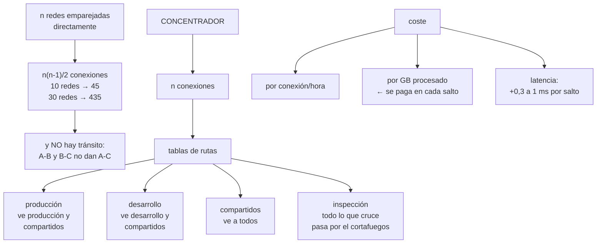

# 199 — Transit Gateway, Virtual WAN y Network Connectivity Center

> [← Clase anterior](../../part-16-advanced-cloud-networking-edge/198-vpn-direct-connect-expressroute-e-interconnect/README.md) · [Índice de la parte](../README.md) · [Clase siguiente →](../../part-16-advanced-cloud-networking-edge/200-private-endpoints-service-networking-y-egress-control/README.md)

**Parte:** 16 — Redes cloud avanzadas, conectividad híbrida y edge<br>
**Nivel:** avanzado · **Horas estimadas:** 4<br>
**Laboratorio:** `network` · **Estado:** `EXECUTABLE_CORE`

## 🎯 Propósito

Sustituir la maraña de conexiones punto a punto por un concentrador de conectividad, y hacerlo sin convertirlo en un punto único ni en una autopista donde todo alcanza a todo. La clase explica por qué el emparejamiento directo deja de escalar, cómo se usan las tablas de rutas del concentrador para segmentar de verdad, qué cuesta cada salto en dinero y latencia, y cuándo un concentrador es la respuesta equivocada.

## 📚 Resultados de aprendizaje

Al finalizar podrás:

1. **Explicar** por qué las conexiones punto a punto no escalan.
2. **Segmentar** con tablas de rutas del concentrador en vez de con reglas.
3. **Calcular** el coste de un concentrador en dinero y en latencia.
4. **Conectar** varias regiones y varias nubes sin crear caminos indeseados.
5. **Decidir** cuándo NO usar un concentrador.

## 🧩 Conceptos centrales

| Concepto | Comprensión verificable |
|---|---|
| `emparejamiento directo` | Conexión entre dos redes. Simple, barata y sin tránsito: no encadena. |
| `concentrador de conectividad` | Servicio central al que se conectan las redes y que encamina entre ellas. |
| `tabla de rutas del concentrador` | Conjunto de rutas asociado a un grupo de conexiones. Es el mecanismo de segmentación real. |
| `aislamiento por asociación` | Que una red solo vea las rutas de la tabla a la que está asociada. |
| `inspección centralizada` | Hacer pasar el tráfico entre segmentos por un cortafuegos común. |
| `coste por salto` | Lo que cobra el concentrador por conexión y por gigabyte procesado, que se paga en cada dirección. |

## 🧠 Modelo mental

La red cloud es un sistema distribuido de rutas, identidades y políticas; cada salto añade latencia, costo y una frontera de fallo.

Aplicado a esta clase, separa siempre cuatro planos: **intención** (qué necesita el usuario),
**configuración** (qué declaramos), **estado observado** (qué existe de verdad) y
**evidencia** (cómo sabemos que cumple). Confundirlos produce diseños que se ven correctos
en un diagrama pero fallan al operar.

## 🗺️ Flujo de razonamiento



## 📖 Desarrollo

### 1. Por qué el emparejamiento directo se acaba

Conectar dos redes directamente es lo más simple y lo más barato, y funciona muy bien hasta que deja de hacerlo.

```text
LO BUENO DEL EMPAREJAMIENTO DIRECTO
  sin salto intermedio: latencia mínima
  sin coste de procesamiento por gigabyte
  sin punto único añadido

LO QUE LO ROMPE
  1  NO HAY TRÁNSITO
     si A-B y B-C están emparejadas, A NO alcanza C
     → hay que emparejar A-C explícitamente

  2  CRECIMIENTO CUADRÁTICO
     n(n-1)/2 conexiones
       5 redes  →  10
      10 redes  →  45
      30 redes  → 435

  3  RUTAS EN CADA TABLA
     cada red necesita una ruta por cada otra red
     → se llega al límite de rutas por tabla       clase 194

  4  IMPOSIBLE DE CAMBIAR
     añadir una red exige tocar n tablas
```

Y el umbral práctico:

```text
hasta ~6-8 redes, emparejar directamente sigue siendo la
opción más simple y más barata
por encima, un concentrador se paga solo en trabajo evitado

y el patrón mixto funciona bien
  concentrador para lo general
  emparejamiento directo para los pares con MUCHO tráfico
  → evita pagar el procesamiento por gigabyte dos veces
```

**Lo que un concentrador aporta**, además de reducir conexiones:

```text
un punto donde ver el tráfico entre redes
un punto donde aplicar inspección                clase 200
segmentación por tabla de rutas, no por reglas
conexión con los enlaces dedicados en un solo sitio
                                                 clase 198
y conectividad entre regiones sin emparejar todo con todo
```

### 2. Segmentar con tablas, no con reglas

El error más común al montar un concentrador es asociarlo todo a una sola tabla de rutas. Entonces **todo alcanza a todo**, y la segmentación queda dependiendo de reglas de cortafuegos en cada extremo.

```text
UNA SOLA TABLA
  producción, desarrollo, socios y oficinas se ven entre sí
  → un fallo de configuración en cualquier extremo abre un
    camino                                       clase 189
  → y el alcance desde un punto comprometido es total

VARIAS TABLAS
  cada red se ASOCIA a una tabla (qué rutas ve)
  y PROPAGA sus rutas a las tablas que decidas (quién la ve)
  → asociación y propagación son cosas distintas
```

Y el patrón que resuelve la mayoría de los casos:

```text
TABLA producción
  asocia    redes de producción
  ve        producción + servicios compartidos + corporativa
  NO ve     desarrollo, preproducción, socios

TABLA no-producción
  asocia    desarrollo, preproducción
  ve        no-producción + servicios compartidos
  NO ve     producción              ← control estructural

TABLA compartidos
  asocia    servicios comunes (nombres, identidad, registro)
  ve        todos

TABLA socios
  asocia    conexiones de terceros
  ve        solo la red de intercambio
  → un socio no alcanza nada más, por construcción
```

Y la propiedad que hace esto valioso:

```text
«preproducción no puede alcanzar producción» deja de ser una
regla que alguien puede quitar
→ pasa a ser una ausencia de ruta
→ y las ausencias no se saltan por error de configuración
                                                 clase 189
```

**La inspección centralizada**, cuando hace falta:

```text
si el tráfico entre segmentos debe inspeccionarse
  las tablas apuntan al cortafuegos, no a la red destino
  el cortafuegos decide y devuelve al concentrador

coste
  un salto más: +0,3 a 1 ms
  el gigabyte se procesa DOS veces en el concentrador
  y el cortafuegos hay que dimensionarlo y hacerlo redundante

→ inspecciona lo que cruza fronteras de confianza, no todo
                                                 clase 189
```

Y un fallo de diseño frecuente:

```text
hacer pasar por el cortafuegos central el tráfico entre dos
redes del MISMO segmento
→ triplica el coste y añade latencia sin ganar nada
```

### 3. Lo que cuesta

Un concentrador tiene dos costes que se suman y uno que no se ve.

```text
POR CONEXIÓN Y HORA
  cada red conectada paga una tarifa fija
  → con 60 redes es una cifra apreciable al mes

POR GIGABYTE PROCESADO
  se cobra el tráfico que pasa por el concentrador
  → y se paga en CADA salto

Y EL QUE NO SE VE
  el tráfico que antes iba directo y ahora da un rodeo
  → dos redes en la misma zona que se hablaban directamente
    ahora pasan por el concentrador: se paga el proceso y
    se añade latencia
```

Y el cálculo que hay que hacer antes:

```text
por cada par de redes con tráfico importante
  volumen mensual × precio por GB × número de saltos

y compararlo con
  el coste de mantener un emparejamiento directo (casi cero)

→ los pares de mucho volumen suelen merecer emparejamiento
  directo ADEMÁS del concentrador
→ pero cuidado: entonces hay dos caminos, y hay que evitar
  la asimetría                                    clase 194
```

**La latencia**, que es pequeña pero se acumula:

```text
emparejamiento directo, misma zona          ~0,2 ms
concentrador                                 +0,3-1 ms
concentrador + inspección                    +1-3 ms
concentrador entre regiones                 el de la región

→ irrelevante para casi todo
→ importante si el camino crítico cruza varias veces
  clase 186
```

**Multirregión y multinube**, que es donde el concentrador aporta más:

```text
CONCENTRADORES EMPAREJADOS ENTRE REGIONES
  un concentrador por región, conectados entre sí
  → cada red se conecta solo a su concentrador local
  → y alcanza la otra región sin emparejar nada más

MULTINUBE
  cada nube tiene su propio concentrador
  la unión se hace con enlaces dedicados o túneles
                                                 clase 198
  → y el plan de direccionamiento tiene que estar limpio,
    o nada de esto funciona                       clase 193

Y LA REGLA QUE EVITA EL DESASTRE
  no encadenes tránsito entre nubes sin decidirlo
  → «la nube A alcanza la C a través de la B» suele ser un
    accidente de propagación, no una decisión
```

Y una consecuencia de coste que sorprende:

```text
el tráfico entre nubes atraviesa dos concentradores y una
salida
→ se paga proceso en los dos y salida en el origen
→ por eso el tráfico entre nubes conviene medirlo por
  separado y atribuirlo                          clase 168
```

### 4. Cuándo NO usar un concentrador

Un concentrador no siempre es la respuesta, y montarlo por defecto tiene costes.

```text
NO LO USES SI
  hay menos de 6-8 redes y no se prevé crecer
  el tráfico entre dos redes es enorme y directo
    → empareja esas dos y deja el resto
  el objetivo era aislar y se va a asociar todo a una tabla
    → entonces solo has creado un punto central sin ganar
      aislamiento
  no hay quien lo opere
    → un concentrador mal operado es un punto único   ley 20
```

Y el riesgo estructural que introduce:

```text
UN CONCENTRADOR ES UN PUNTO POR EL QUE PASA CUANTO SE MUEVE
  su fallo afecta a todas las redes conectadas
  un cambio de tabla erróneo puede aislar medio sistema
  y su límite de rutas o de ancho de banda es compartido

→ los proveedores lo hacen redundante por dentro, pero el
  error de configuración no lo cubre nadie
→ los cambios se hacen con ventana y vuelta atrás  clase 194
```

**La operación**, que tiene sus propias señales:

```text
rutas por tabla, contra el límite                 ley 13
tráfico procesado por conexión y su coste
conexiones en estado no disponible
cambios en asociaciones y propagaciones ← auditar siempre
latencia entre pares representativos
```

Y la alerta más útil:

```text
«ha aparecido una ruta hacia un segmento que no debería
 verse desde aquí»
→ detecta la propagación accidental, que es como se abren
  los caminos indeseados                         clase 189
```

Y la lista de comprobación de la clase:

```text
☐ el número de redes justifica el concentrador
☐ hay varias tablas de rutas, no una
☐ asociación y propagación están decididas por segmento
☐ producción no es alcanzable desde no-producción por
  ausencia de ruta
☐ los socios solo ven la red de intercambio
☐ la inspección se aplica a lo que cruza fronteras, no a todo
☐ los pares de mucho volumen se han evaluado para
  emparejamiento directo
☐ está calculado el coste por gigabyte y por salto
☐ no hay tránsito accidental entre nubes
☐ hay alerta de rutas por tabla contra el límite
☐ hay alerta de rutas inesperadas en una tabla
☐ los cambios de tabla se hacen con ventana y vuelta atrás
```

Y el cierre que enlaza con la clase siguiente: el concentrador resuelve la conectividad entre redes propias, pero el tráfico hacia los servicios del proveedor y hacia internet sigue saliendo por otro lado. Puntos privados y control de salida es la materia de la clase 200.

## 🔬 Ejemplo trabajado

**CloudShop tiene 63 redes en tres nubes, conectadas con 214 emparejamientos directos acumulados en cinco años. Lo que sigue es la migración a concentradores, la segmentación que cerró un camino que nadie sabía que existía, y los dos pares que se dejaron emparejados a propósito.**

**El punto de partida:**

```text
redes                                              63
emparejamientos directos                          214
  documentados                                     47
  creados «para una prueba» y nunca retirados      31
  sin dueño identificable                          52
rutas en la tabla de la red de producción         187
límite de la nube                                 200
→ a 13 rutas de no poder añadir una red más

tiempo medio para conectar una red nueva      6 días
  → y por eso 31 emparejamientos se hicieron «rápido»
                                                  ley 16
```

Y el hallazgo del inventario, que fue el que justificó el proyecto:

```text
se trazaron los caminos alcanzables desde cada red

  desde la red de DESARROLLO se alcanzaba
    la red de datos de PRODUCCIÓN

  cómo
    desarrollo ↔ herramientas (emparejado en 2021)
    herramientas ↔ datos-producción (emparejado en 2022)
    → y alguien había añadido rutas estáticas en ambos
      extremos «para una migración» que terminó en 2022

  llevaba así                              3 años
  aparecía en algún diagrama                   no    ley 24
  lo detectó                    el inventario, no una alerta
```

**La segmentación diseñada.**

```text
TABLA producción
  asocia      18 redes de producción
  propaga a   producción, compartidos
  ve          producción, compartidos, corporativa

TABLA no-producción
  asocia      29 redes (desarrollo, preproducción, pruebas)
  propaga a   no-producción, compartidos
  ve          no-producción, compartidos
  NO ve       producción             ← ausencia de ruta

TABLA compartidos
  asocia      7 redes (nombres, identidad, registro,
              artefactos, telemetría)
  propaga a   todas
  ve          todas

TABLA socios
  asocia      4 conexiones de terceros
  propaga a   solo intercambio
  ve          solo la red de intercambio

TABLA inspección
  el tráfico producción ↔ corporativa y todo lo de socios
  pasa por el cortafuegos central
```

Y la comprobación del diseño, hecha antes de migrar:

```text
se simuló, tabla por tabla, qué alcanza cada red

  desde desarrollo
    compartidos                                  sí
    otras redes de desarrollo                    sí
    producción                                   NO
    datos de producción                          NO
    corporativa                                  NO

  desde una red de socio
    red de intercambio                           sí
    cualquier otra cosa                          NO
```

**La migración, por lotes.**

```text
semana 1     concentrador en la región principal; tablas
             creadas y vacías
semanas 2-4  redes de desarrollo, 29, de 6 en 6
             y retirada del emparejamiento correspondiente
             en cada paso                        clase 184
semanas 5-8  redes de producción, 18, de 3 en 3, en ventana
semanas 6-9  compartidos y socios
semana 10    concentrador de la segunda región, emparejado
semanas 11-13 las otras dos nubes, por enlace dedicado
             clase 198
semanas 12-15 RETIRADA de los 214 emparejamientos
```

Y el paso de retirada, que es el que casi siempre falta:

```text
emparejamientos retirados                        212
conservados a propósito                            2   ← ver abajo

y durante la retirada
  4 emparejamientos resultaron estar en uso por algo que
  nadie había declarado
    · un trabajo de exportación nocturno
    · una herramienta de monitorización de un proveedor
    · un servidor de compilación antiguo
    · una réplica de base de datos de un proyecto cancelado
      que seguía copiando datos       ← se apagó, ley 20
```

**Los dos emparejamientos que se conservaron, con su cálculo:**

```text
PAR 1   aplicación ↔ base de datos de pedidos
  volumen mensual                          412 TB
  por el concentrador
    412.000 GB × 0,02 €/GB                8.240 €/mes
    latencia añadida                      +0,6 ms en el
                                          camino crítico
  emparejado directo
    coste de proceso                          0 €
    latencia                              0,2 ms
  decisión   emparejamiento directo, y ruta más específica
             para que gane al camino del concentrador
                                                 clase 194
  ahorro     8.240 €/mes

PAR 2   telemetría ↔ recolector central
  volumen mensual                          180 TB
  ahorro                                 3.600 €/mes
  decisión   igual
```

Y la precaución que hizo falta:

```text
al existir dos caminos posibles, hubo que comprobar simetría
  la ruta más específica gana en las DOS direcciones
  se verificó con una traza en ambos sentidos     clase 194
  y se añadió a la comprobación semanal
```

**El coste, antes y después:**

```text                                        antes     después
emparejamientos                               214           2
rutas en la tabla de producción               187          23
conexiones al concentrador                      0          63
coste fijo del concentrador                     0     2.840 €/mes
coste por GB procesado                          0     6.100 €/mes
  (tras excluir los 2 pares directos)
coste evitado por los 2 pares directos          —    11.840 €/mes
tiempo para conectar una red nueva          6 días      25 min
caminos indeseados detectables                 no          sí
```

Y la línea que resume el balance:

```text
el concentrador cuesta 8.940 €/mes
sin los dos emparejamientos directos costaría 20.780 €
→ la decisión de dejar dos pares fuera del concentrador
  valía más que todo el resto del proyecto en dinero
```

**La vigilancia montada:**

```text
rutas por tabla contra el límite, alerta al 75 %
cambios en asociaciones y propagaciones → auditados y
  con alerta
RUTA INESPERADA EN UNA TABLA
  se declara qué prefijos deben verse desde cada tabla
  cualquier otro dispara alerta
  → en el primer trimestre disparó 2 veces
    · una propagación mal configurada al añadir una red
    · un socio nuevo asociado a la tabla equivocada
  → las dos se corrigieron en minutos, no en años
```

**La lección que esta clase deja**: el proyecto se justificó por el límite de rutas, pero lo que encontró fue **un camino de desarrollo a los datos de producción que llevaba tres años abierto** a través de dos emparejamientos y unas rutas estáticas de una migración terminada. Ninguna regla de cortafuegos lo habría cerrado de forma duradera; lo cerró **la ausencia de ruta**. Y en dinero, la decisión que más valió fue la contraria a la del proyecto: **dejar dos pares fuera del concentrador**, porque su volumen hacía que el coste por gigabyte superara todo lo demás.

## 🧪 Laboratorio guiado

Ejecuta desde la raíz:

```bash
python classes/part-16-advanced-cloud-networking-edge/199-transit-gateway-virtual-wan-y-network-connectivity-center/lab.py
```

El laboratorio selecciona el motor de práctica **`network`** y produce
`lab_result.json`. El escenario, sus comprobaciones y el artefacto esperado corresponden a
esta clase; no requiere credenciales y deja explícito qué debe revalidarse en un sandbox real.

1. Lee `exercise.steps` y formula una predicción antes de ejecutar.
2. Ejecuta la práctica y verifica todos los elementos de `checks`.
3. Provoca el caso de `negative_test` y explica la señal observada.
4. Materializa `transit-comparison` en `evidence/` usando la plantilla indicada.
5. Para proveedor real, sigue `sandbox.requires`, registra costo y ejecuta `destroy`.

### Evidencia esperada

El artefacto principal es una topología con rutas, puertos y controles. Además, la entrega debe incluir el comando ejecutado,
la salida estructurada y una conclusión que no exceda lo observado.

## 🏆 Reto verificable

Construye **`transit-comparison`** para el caso CloudShop. Incluye una alternativa descartada,
un supuesto que pueda falsarse, una prueba de fallo y una decisión de rollback.

## ✅ Criterio de aceptación

- [ ] `lab.py` termina con código 0 y genera JSON válido.
- [ ] La entrega conecta al menos tres requisitos con mecanismos verificables.
- [ ] Existe una prueba positiva y una prueba negativa con evidencia.
- [ ] Seguridad, costo y operación aparecen como decisiones, no como anexos.
- [ ] Se declara una limitación y una condición que obligaría a revisar el diseño.
- [ ] Otra persona puede repetir el recorrido sin conocimiento tácito.

## ⚠️ Errores frecuentes

| Síntoma | Causa probable | Corrección |
|---|---|---|
| Añadir una red nueva exige tocar decenas de tablas | Topología de emparejamientos punto a punto, que crece de forma cuadrática | Migra a un concentrador cuando pases de seis u ocho redes, y retira los emparejamientos a medida que migras. |
| El concentrador no aporta aislamiento | Todas las redes están asociadas a una única tabla de rutas | Usa varias tablas y decide por separado a qué tabla se asocia cada red y a cuáles propaga sus rutas. |
| Un entorno inferior alcanza producción y nadie sabe por dónde | Tránsito accidental a través de emparejamientos encadenados y rutas estáticas olvidadas | Traza qué alcanza cada red, cierra por ausencia de ruta en vez de por regla y alerta ante rutas inesperadas en una tabla. |
| La factura del concentrador es enorme | Pares con muchísimo volumen atraviesan el concentrador y pagan proceso por gigabyte | Calcula el coste por par y deja emparejamiento directo para los de gran volumen, cuidando la simetría del camino. |
| La latencia del camino crítico empeora tras centralizar | Tráfico que antes iba directo ahora da un rodeo, a veces con inspección | Inspecciona solo lo que cruza fronteras de confianza y evita enrutar por el cortafuegos el tráfico dentro de un mismo segmento. |
| Un cambio de tabla aísla medio sistema | El concentrador es un punto por el que pasa todo y el cambio se hizo sin red | Cambios en ventana, con configuración previa guardada y vuelta atrás probada, y auditoría de asociaciones y propagaciones. |

## 🛡️ Seguridad, ética y costo

Trabaja con cuentas propias o sandboxes autorizados. No publiques secretos, identificadores
reales ni datos personales. Antes de crear recursos pagos define presupuesto, etiquetas y
comando de destrucción; después verifica que no queden recursos huérfanos. Los ejemplos
locales enseñan contratos, pero no certifican cumplimiento ni disponibilidad de producción.

## ❓ Preguntas de comprobación

1. ¿Por qué el emparejamiento directo deja de escalar y a partir de cuántas redes?
2. ¿Qué diferencia hay entre asociar una red a una tabla y propagar sus rutas a ella?
3. ¿Por qué cerrar un camino por ausencia de ruta es más robusto que por regla?
4. ¿Qué costes tiene un concentrador y cuál es el que no se ve?
5. ¿En qué casos conviene mantener un emparejamiento directo pese a tener concentrador?

## 🔗 Referencias

- AWS (2025). *Transit Gateway route tables and segmentation*. <https://docs.aws.amazon.com/vpc/latest/tgw/tgw-route-tables.html>
- Microsoft (2025). *Virtual WAN architecture and routing*. <https://learn.microsoft.com/en-us/azure/virtual-wan/virtual-wan-about>
- Google Cloud (2025). *Network Connectivity Center*. <https://cloud.google.com/network-connectivity/docs/network-connectivity-center>
- AWS (2025). *Building a scalable and secure multi-VPC network infrastructure*. <https://docs.aws.amazon.com/whitepapers/latest/building-scalable-secure-multi-vpc-network-infrastructure/welcome.html>
- Microsoft (2025). *Cloud Adoption Framework: network topology and connectivity*. <https://learn.microsoft.com/en-us/azure/cloud-adoption-framework/ready/landing-zone/design-area/network-topology-and-connectivity>
- Documentación oficial vigente del servicio implementado; registra URL y fecha de consulta.

---

> [Evaluación](assessment.md) · [Contrato de clase](lesson.yaml) · [Índice de la parte](../README.md)
