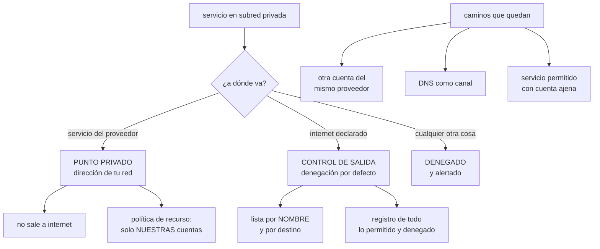

# 200 — Private endpoints, service networking y egress control

> [← Clase anterior](../../part-16-advanced-cloud-networking-edge/199-transit-gateway-virtual-wan-y-network-connectivity-center/README.md) · [Índice de la parte](../README.md) · [Clase siguiente →](../../part-16-advanced-cloud-networking-edge/201-service-mesh-mtls-y-gestion-de-trafico-este-oeste/README.md)

**Parte:** 16 — Redes cloud avanzadas, conectividad híbrida y edge<br>
**Nivel:** avanzado · **Horas estimadas:** 4<br>
**Laboratorio:** `security` · **Estado:** `EXECUTABLE_CORE`

## 🎯 Propósito

Cerrar el camino de salida, que es la mitad que casi nadie controla: se filtran las entradas con cuidado y el tráfico saliente sale por donde quiere. La clase explica los puntos privados hacia los servicios del proveedor —qué resuelven, qué cuestan y qué no cubren—, y desarrolla el control de salida como lo que de verdad es: **la última barrera contra la exfiltración**, y la que más veces aparece como prueba negativa fallida en todo este programa.

## 📚 Resultados de aprendizaje

Al finalizar podrás:

1. **Alcanzar** servicios del proveedor sin pasar por internet, con el mecanismo adecuado.
2. **Distinguir** punto privado de punto de servicio y saber qué protege cada uno.
3. **Cerrar** la salida por defecto y abrirla por destino declarado.
4. **Detectar** los caminos de exfiltración que quedan abiertos.
5. **Medir** lo que el control de salida ahorra en coste, además de en riesgo.

## 🧩 Conceptos centrales

| Concepto | Comprensión verificable |
|---|---|
| `punto privado` | Interfaz con dirección de tu red que representa un servicio del proveedor. El tráfico no sale a internet. |
| `punto de servicio` | Ruta hacia el servicio del proveedor sin dirección propia. Más barato y con menos control de origen. |
| `control de salida` | Filtrado del tráfico que sale de la red, por destino y por nombre, con denegación por defecto. |
| `exfiltración` | Sacar datos a un destino no autorizado. La salida abierta es su camino natural. |
| `política de perímetro de datos` | Regla que impide que un recurso sea alcanzado desde fuera de la organización o alcance recursos ajenos. |
| `inspección con nombre` | Filtrado por el nombre solicitado y no solo por dirección, necesario porque las direcciones de los servicios cambian. |

## 🧠 Modelo mental

La red cloud es un sistema distribuido de rutas, identidades y políticas; cada salto añade latencia, costo y una frontera de fallo.

Aplicado a esta clase, separa siempre cuatro planos: **intención** (qué necesita el usuario),
**configuración** (qué declaramos), **estado observado** (qué existe de verdad) y
**evidencia** (cómo sabemos que cumple). Confundirlos produce diseños que se ven correctos
en un diagrama pero fallan al operar.

## 🗺️ Flujo de razonamiento



## 📖 Desarrollo

### 1. Alcanzar servicios sin salir a internet

Un servicio en una subred privada que llama al almacén de objetos del proveedor sale, por defecto, a internet: hasta la pasarela NAT, hasta el punto público del servicio, y de vuelta.

```text
QUÉ TIENE DE MALO
  coste de salida por cada gigabyte              clase 168
  el tráfico atraviesa internet, aunque vaya cifrado
  la subred necesita ruta a internet, y esa ruta sirve
    también para sacar datos a cualquier otro sitio
  la pasarela NAT es un cuello y un coste por hora y por GB
```

**Las dos soluciones**, que no son equivalentes:

```text
PUNTO DE SERVICIO (ruta privilegiada)
  añade una ruta hacia el servicio; el tráfico no sale a
  internet
  la dirección de origen sigue siendo de la red
  + barato o gratuito, simple
  − no da una dirección propia; no se puede alcanzar desde
    la corporativa ni desde otra red
  − el filtrado por origen es más grosero

PUNTO PRIVADO (interfaz en tu red)
  crea una interfaz CON DIRECCIÓN de tu subred que representa
  al servicio
  + alcanzable desde la corporativa y desde otras redes
  + permite política por origen fina
  + resuelve por nombre a una dirección privada  clase 195
  − cuesta por hora y por gigabyte
  − uno por servicio y por zona → consume direcciones
                                                 clase 193
```

Y el criterio de elección:

```text
¿hace falta alcanzarlo desde fuera de esta red?
  sí → punto privado
  no → punto de servicio, si el proveedor lo ofrece

¿el volumen es enorme?
  compara el coste por GB del punto privado contra el de
  salida a internet; casi siempre gana el punto privado,
  pero no siempre
```

Y lo que un punto privado **no** resuelve, que es lo que más se malinterpreta:

```text
un punto privado te lleva al SERVICIO, no a TU recurso
→ desde ese punto se puede llegar al almacén de otra
  organización si nada lo impide
→ y por tanto sigue siendo un camino de exfiltración

LO QUE LO CIERRA
  política en el punto privado: solo hacia recursos de
    NUESTRAS cuentas
  política en el recurso: solo desde NUESTRAS redes
  → las dos direcciones, no una                  clase 189
```

### 2. Cerrar la salida

La entrada se filtra con cuidado desde siempre. La salida, casi nunca, y es por donde se van los datos.

```text
EL ESTADO HABITUAL
  la subred de aplicación tiene ruta 0.0.0.0/0
  el grupo de seguridad permite todo el tráfico saliente
  → un servicio comprometido puede enviar lo que quiera a
    donde quiera
  → y en este programa, la prueba negativa «sacar datos a
    un destino externo no declarado» ha fallado tres veces
                                        clases 179, 189, 194
```

**El diseño correcto**, en capas:

```text
1  SIN RUTA A INTERNET donde no haga falta
   la subred de datos no necesita salir             clase 194
   → es el control más fuerte: ausencia de camino

2  SALIDA CENTRALIZADA
   0.0.0.0/0 hacia un cortafuegos de salida, no hacia la
   pasarela NAT directamente
   → un solo punto donde ver y decidir

3  DENEGACIÓN POR DEFECTO, CON LISTA POR NOMBRE
   se permite lo declarado: repositorios de paquetes,
   proveedores concretos, servicios de terceros
   → por NOMBRE, porque las direcciones de esos servicios
     cambian constantemente

4  REGISTRO DE LO PERMITIDO Y DE LO DENEGADO
   → lo denegado es la señal que descubre lo que no sabías

5  PERÍMETRO DE DATOS
   políticas que impiden que un recurso propio sea alcanzado
   por identidades ajenas, y que una identidad propia alcance
   recursos ajenos
```

Y la parte 5 merece detalle porque es lo que cierra el hueco del punto privado:

```text
DOS REGLAS, EN LAS DOS DIRECCIONES
  «ninguna identidad de fuera de la organización puede
   acceder a nuestros recursos»
  «ninguna identidad nuestra puede acceder a recursos que no
   son de la organización»

→ la segunda es la que impide copiar datos al almacén de
  otro, y es la que casi nunca está
```

**Los caminos que quedan abiertos** aunque se cierre lo evidente:

```text
OTRA CUENTA DEL MISMO PROVEEDOR
  el punto privado alcanza el servicio, y el servicio
  alcanza cualquier cuenta
  → lo cierra el perímetro de datos, no el cortafuegos

DNS COMO CANAL
  las consultas de nombres salen aunque el resto esté
  cerrado, y se pueden usar para sacar datos poco a poco
  → obliga a que la resolución pase por el resolutor propio
    y a vigilar consultas anómalas                clase 195

UN SERVICIO PERMITIDO USADO CON OTRA CUENTA
  si se permite un servicio de almacenamiento por nombre,
  se permite también la cuenta de un atacante en ese mismo
  servicio
  → hace falta filtrar por recurso, no solo por nombre de
    servicio

CANALES DE ACTUALIZACIÓN Y TELEMETRÍA
  agentes que envían datos a un tercero por diseño
  → hay que saber qué envían                        ley 20
```

### 3. Lo que cuesta y lo que ahorra

Cerrar la salida suele presentarse como coste de seguridad, y en la práctica **ahorra dinero**.

```text
LO QUE SE AHORRA
  el tráfico hacia los servicios del proveedor deja de
  pagar salida a internet
  la pasarela NAT procesa mucho menos: menos coste por hora
  y por gigabyte
  y aparecen destinos que nadie sabía que se estaban
  pagando

LO QUE CUESTA
  puntos privados: por hora y por gigabyte
  cortafuegos de salida: instancia y proceso
  el trabajo de descubrir qué hace falta permitir
```

Y el orden de implantación que funciona, porque el error de cerrar de golpe es romper producción:

```text
1  REGISTRAR SIN BLOQUEAR, dos o cuatro semanas
   → produce la lista real de destinos, que nunca coincide
     con la que la gente cree

2  CLASIFICAR los destinos observados
   necesarios · innecesarios · desconocidos
   → los desconocidos son el hallazgo

3  PERMITIR lo necesario, por nombre

4  BLOQUEAR en un entorno inferior y observar qué se rompe

5  BLOQUEAR en producción, empezando por las subredes que
   menos salen

6  DEJAR EL REGISTRO de denegaciones vigilado    ley 13
   → cada denegación nueva es información
```

Y una advertencia sobre el paso 3:

```text
si permitir un destino nuevo tarda dos días, alguien pedirá
abrir «*.amazonaws.com» y se acabó el control    ley 16
→ el camino para pedir una excepción tiene que ser rápido,
  con dueño y caducidad                          clase 190
```

**Lo que hay que vigilar**, una vez cerrado:

```text
denegaciones por destino y por origen
destinos permitidos que dejan de usarse    → retirar
volumen saliente por servicio y por destino  ← el que sube
  sin motivo es la señal de exfiltración
consultas de nombres anómalas: muchas, largas o a dominios
  recién registrados
tráfico por la pasarela NAT: debería BAJAR mucho
```

Y la prueba negativa que cierra la clase, que es la que este programa ha visto fallar más veces:

```text
desde un servicio en la subred de aplicación, intentar
  subir un fichero a un almacén de otra organización
  enviar datos a un servidor externo por HTTPS
  sacar datos por consultas de nombres
  usar un servicio permitido con credenciales ajenas
→ las cuatro deben fallar y quedar registradas    ley 22
```

### 4. Puntos privados en la práctica

Montar puntos privados a escala tiene detalles que dan problemas si se descubren tarde.

```text
CONSUMO DE DIRECCIONES
  uno por servicio y por zona
  30 servicios × 3 zonas = 90 direcciones
  → hay que contarlo en el plan                    clase 193

RESOLUCIÓN
  el nombre público del servicio debe resolver a la dirección
  privada DENTRO de la red
  → zona privada asociada, y reenvío desde la corporativa
    si hace falta                                  clase 195
  → si esto falla, el tráfico sigue saliendo a internet sin
    que nadie lo note

COSTE
  por hora y por gigabyte procesado
  → con muchos servicios y poco tráfico, el coste fijo
    domina
  → conviene compartir puntos privados entre redes cuando el
    proveedor lo permita

CENTRALIZACIÓN
  un conjunto de puntos privados en una red compartida,
  alcanzable desde el concentrador                 clase 199
  → evita replicarlos en 60 redes
  → pero concentra el tráfico y su coste
```

Y la comprobación que evita el error silencioso:

```text
desde dentro de la red, resolver el nombre del servicio
  → debe devolver una dirección PRIVADA
  → si devuelve una pública, el punto privado existe y no
    se está usando: se paga por él y el tráfico sale igual

→ función de aptitud: para cada servicio con punto privado,
  comprobar que resuelve a privada desde cada red
                                                 clase 190
```

Y la lista de comprobación de la clase:

```text
☐ las subredes que no deben salir no tienen ruta a internet
☐ la salida pasa por un cortafuegos con denegación por
  defecto
☐ la lista de destinos permitidos es por nombre y está
  justificada
☐ hay perímetro de datos en las dos direcciones
☐ los puntos privados tienen política de recurso restringida
☐ los nombres de servicio resuelven a direcciones privadas
  desde cada red
☐ la resolución de nombres pasa por el resolutor propio
☐ se registran las denegaciones y alguien las mira
☐ pedir una excepción es rápido y deja dueño y caducidad
☐ se vigila el volumen saliente por destino
☐ las cuatro pruebas negativas de exfiltración se han
  ejecutado y fallan como deben
☐ se ha medido la reducción de coste de salida y de NAT
```

Y el cierre que enlaza con la clase siguiente: cerrada la salida hacia fuera, queda el tráfico entre servicios dentro del sistema, que en la mayoría de las redes sigue siendo abierto y sin identidad. Malla de servicios, TLS mutuo y gestión del tráfico este-oeste es la materia de la clase 201.

## 🔬 Ejemplo trabajado

**CloudShop cierra la salida de sus 63 redes. Lo que sigue es lo que apareció en las cuatro semanas de registro sin bloquear, los tres caminos de exfiltración que quedaban abiertos tras el primer cierre, y el ahorro que nadie esperaba.**

**Semanas 1-4: registrar sin bloquear.**

```text
destinos externos observados, únicos                 1.847

clasificación
  necesarios y conocidos                               61
    repositorios de paquetes, proveedores de pago,
    servicios de correo, actualizaciones de sistema
  del propio proveedor de nube                        340
    → deberían ir por punto privado, no por internet
  innecesarios                                        112
    servicios que se dejaron de usar y cuyos clientes
    seguían intentando conectar
  DESCONOCIDOS                                      1.334
```

Y el análisis de los desconocidos, que es donde estaba la información:

```text
1.291  dominios de publicidad y analítica alcanzados por
       una biblioteca de una aplicación interna
       → la biblioteca cargaba recursos de terceros en un
         panel de administración

   28  servicios de un proveedor de monitorización
       contratado por un equipo en 2022 y nunca dado de
       baja; el agente seguía enviando métricas       ley 20
       → incluidas métricas con nombres de tablas y de
         clientes

    9  un servicio de traducción automática al que un
       microservicio enviaba textos de descripciones de
       producto
       → no estaba declarado en ningún sitio; lo añadió un
         desarrollador en 2023 y funcionaba

    4  almacenes de objetos de OTRAS organizaciones
       → tres eran de socios, con acuerdo
       → UNO era el almacén personal de un antiguo
         empleado, con un script de exportación que seguía
         ejecutándose desde una máquina de análisis
         → llevaba 14 meses copiando un extracto diario
           de ventas

    2  dominios registrados hacía menos de 30 días
       → resultaron ser de una herramienta legítima que
         había cambiado de dominio
```

Y la conclusión del registro:

```text
el hallazgo más grave del proyecto apareció ANTES de
bloquear nada
→ registrar sin bloquear es la fase que más encuentra
→ y la exfiltración real llevaba 14 meses sin que ninguna
  alerta existiera                                  ley 15
```

**El cierre, por fases.**

```text
fase 1   subredes de datos: se les quitó la ruta a internet
         → 0 destinos externos legítimos; cierre limpio
         → y el script de exportación del antiguo empleado
           dejó de funcionar aquí

fase 2   340 destinos del proveedor → puntos privados
         puntos privados creados                      27
         centralizados en una red compartida, alcanzables
         desde el concentrador                  clase 199
         direcciones consumidas                       81

fase 3   subredes de aplicación: cortafuegos de salida con
         denegación por defecto
         destinos permitidos, por nombre               61
         → despliegue primero en preproducción: 4 cosas se
           rompieron, todas destinos legítimos no
           declarados
         → en producción, 1 más

fase 4   perímetro de datos, en las dos direcciones
```

**Los tres caminos que quedaban abiertos tras la fase 3.** Se descubrieron ejecutando las pruebas negativas:

```text
PRUEBA 1   subir un fichero al almacén de otra organización
  resultado   FUNCIONÓ
  por qué     el punto privado del almacén permitía llegar
              al servicio, y el servicio a cualquier cuenta
  corrección  política en el punto privado: solo recursos
              de nuestras cuentas
              + política en los recursos: solo desde
              nuestras redes

PRUEBA 2   sacar datos por consultas de nombres
  resultado   FUNCIONÓ
  por qué     las consultas salían al resolutor por defecto
              sin restricción; se pudieron sacar 40 KB en
              consultas codificadas
  corrección  toda resolución pasa por el resolutor propio
              alerta por consultas anómalas: longitud,
              volumen por origen, dominios recién
              registrados

PRUEBA 3   usar un servicio permitido con credenciales de
           otra cuenta
  resultado   FUNCIONÓ parcialmente
  por qué     el filtro era por nombre de servicio, no por
              recurso
  corrección  filtrado por recurso donde el producto lo
              permite; perímetro de datos donde no

PRUEBA 4   enviar datos a un servidor externo por HTTPS
  resultado   denegado y registrado                    ✓
```

Y la observación del equipo:

```text
tres de las cuatro pruebas fallaron después de haber
cerrado la salida
→ y las tres se habrían dado por resueltas leyendo la
  configuración                                      ley 22
```

**El coste, antes y después:**

```text                                        antes      después
tráfico por pasarelas NAT             71 TB/mes     9 TB/mes
coste de pasarelas NAT (proceso)       3.550 €      450 €
coste de salida a internet             5.900 €    1.100 €
coste de puntos privados                     0    1.780 €
coste del cortafuegos de salida              0      920 €
────────────────────────────────────────────────────────────
total                                  9.450 €    4.250 €

ahorro                                          5.200 €/mes
```

Y la línea que sorprendió a finanzas:

```text
cerrar la salida AHORRÓ dinero
→ porque el 82 % del tráfico saliente iba a servicios del
  propio proveedor y se estaba pagando como salida a
  internet                                        clase 168
→ y ese gasto no tenía dueño ni atribución          ley 20
```

**La operación posterior, a los seis meses:**

```text
denegaciones registradas                       1.400/mes
  de ellas, destinos legítimos no declarados            7
    → los 7 se añadieron; tiempo medio de aprobación 40 min
  de ellas, clientes de servicios ya retirados     1.290
    → se corrigieron 4 servicios; el ruido bajó a 110/mes
  de ellas, intentos que valía la pena investigar        3
    · un agente antiguo reinstalado por una imagen vieja
    · una biblioteca nueva que llamaba a un servicio de
      telemetría propio
    · un script de un becario apuntando a un servicio
      de conversión de ficheros externo

destinos permitidos que dejaron de usarse             11
  → retirados; la lista pasó de 68 a 57

puntos privados con resolución incorrecta               2
  → la función de aptitud los detectó: existían, se
    pagaban, y el tráfico salía igual por internet
  → 340 €/mes que se pagaban dos veces
```

**El resultado, con la evidencia:**

```text                                        antes      después
destinos externos alcanzables            ilimitado         57
pruebas de exfiltración que fallan            3 de 4    0 de 4
coste mensual de conectividad saliente     9.450 €    4.250 €
tiempo para autorizar un destino nuevo       n/a       40 min
exfiltraciones activas detectadas               1           0
destinos con dueño declarado                    0          57
```

**La lección que esta clase deja**: el hallazgo más grave —**un extracto diario de ventas que llevaba catorce meses copiándose al almacén personal de un antiguo empleado**— apareció en la fase de registrar sin bloquear, antes de cerrar nada. Y tras cerrar la salida, **tres de las cuatro pruebas de exfiltración seguían funcionando**, porque un punto privado lleva al servicio y no a tu recurso. Cerrar la salida, además, salió **5.200 € al mes más barato** que dejarla abierta.

## 🧪 Laboratorio guiado

Ejecuta desde la raíz:

```bash
python classes/part-16-advanced-cloud-networking-edge/200-private-endpoints-service-networking-y-egress-control/lab.py
```

El laboratorio selecciona el motor de práctica **`security`** y produce
`lab_result.json`. El escenario, sus comprobaciones y el artefacto esperado corresponden a
esta clase; no requiere credenciales y deja explícito qué debe revalidarse en un sandbox real.

1. Lee `exercise.steps` y formula una predicción antes de ejecutar.
2. Ejecuta la práctica y verifica todos los elementos de `checks`.
3. Provoca el caso de `negative_test` y explica la señal observada.
4. Materializa `private-connectivity` en `evidence/` usando la plantilla indicada.
5. Para proveedor real, sigue `sandbox.requires`, registra costo y ejecuta `destroy`.

### Evidencia esperada

El artefacto principal es un control con amenaza, mitigación y evidencia. Además, la entrega debe incluir el comando ejecutado,
la salida estructurada y una conclusión que no exceda lo observado.

## 🏆 Reto verificable

Construye **`private-connectivity`** para el caso CloudShop. Incluye una alternativa descartada,
un supuesto que pueda falsarse, una prueba de fallo y una decisión de rollback.

## ✅ Criterio de aceptación

- [ ] `lab.py` termina con código 0 y genera JSON válido.
- [ ] La entrega conecta al menos tres requisitos con mecanismos verificables.
- [ ] Existe una prueba positiva y una prueba negativa con evidencia.
- [ ] Seguridad, costo y operación aparecen como decisiones, no como anexos.
- [ ] Se declara una limitación y una condición que obligaría a revisar el diseño.
- [ ] Otra persona puede repetir el recorrido sin conocimiento tácito.

## ⚠️ Errores frecuentes

| Síntoma | Causa probable | Corrección |
|---|---|---|
| Un punto privado está montado y el tráfico sigue saliendo por internet | El nombre del servicio no resuelve a la dirección privada desde esa red | Asocia la zona privada correspondiente y comprueba con una función de aptitud que cada servicio resuelve a dirección privada desde cada red. |
| Se puede subir datos al almacén de otra organización pese a tener punto privado | El punto privado lleva al servicio, no a tus recursos | Aplica política en el punto privado hacia recursos propios y política en los recursos hacia redes propias; perímetro de datos en las dos direcciones. |
| Se sacan datos aunque el cortafuegos de salida esté cerrado | Las consultas de nombres salen sin restricción y sirven de canal | Fuerza la resolución por el resolutor propio y vigila consultas anómalas por longitud, volumen y antigüedad del dominio. |
| Alguien pide abrir un comodín enorme y se acaba el control | Autorizar un destino nuevo tarda días | Haz que pedir una excepción sea rápido y deje dueño y fecha de caducidad registrados. |
| Cerrar la salida rompe producción | Se bloqueó sin conocer los destinos reales | Registra sin bloquear varias semanas, clasifica lo observado, permite lo necesario y bloquea primero en entornos inferiores. |
| El control de salida se percibe como un gasto de seguridad | No se midió el tráfico que iba a servicios del propio proveedor pagando salida a internet | Mide antes y después el tráfico por pasarela NAT y el coste de salida; suele bajar más de lo que cuestan los puntos privados. |

## 🛡️ Seguridad, ética y costo

Trabaja con cuentas propias o sandboxes autorizados. No publiques secretos, identificadores
reales ni datos personales. Antes de crear recursos pagos define presupuesto, etiquetas y
comando de destrucción; después verifica que no queden recursos huérfanos. Los ejemplos
locales enseñan contratos, pero no certifican cumplimiento ni disponibilidad de producción.

## ❓ Preguntas de comprobación

1. ¿Qué diferencia hay entre un punto de servicio y un punto privado?
2. ¿Por qué un punto privado no impide por sí solo la exfiltración?
3. ¿En qué orden se implanta el control de salida sin romper producción?
4. ¿Qué tres caminos siguen abiertos tras cerrar el cortafuegos de salida?
5. ¿Por qué cerrar la salida suele ahorrar dinero?

## 🔗 Referencias

- AWS (2025). *Building a data perimeter on AWS*. <https://docs.aws.amazon.com/whitepapers/latest/building-a-data-perimeter-on-aws/building-a-data-perimeter-on-aws.html>
- AWS (2025). *VPC endpoints and endpoint policies*. <https://docs.aws.amazon.com/vpc/latest/privatelink/vpc-endpoints.html>
- Microsoft (2025). *Azure Private Link and private endpoints*. <https://learn.microsoft.com/en-us/azure/private-link/private-link-overview>
- Google Cloud (2025). *VPC Service Controls* — perímetros de servicio. <https://cloud.google.com/vpc-service-controls/docs/overview>
- MITRE ATT&CK (2025). *Exfiltration over alternative protocol* y *DNS tunneling*. <https://attack.mitre.org/tactics/TA0010/>
- Documentación oficial vigente del servicio implementado; registra URL y fecha de consulta.

---

> [Evaluación](assessment.md) · [Contrato de clase](lesson.yaml) · [Índice de la parte](../README.md)
