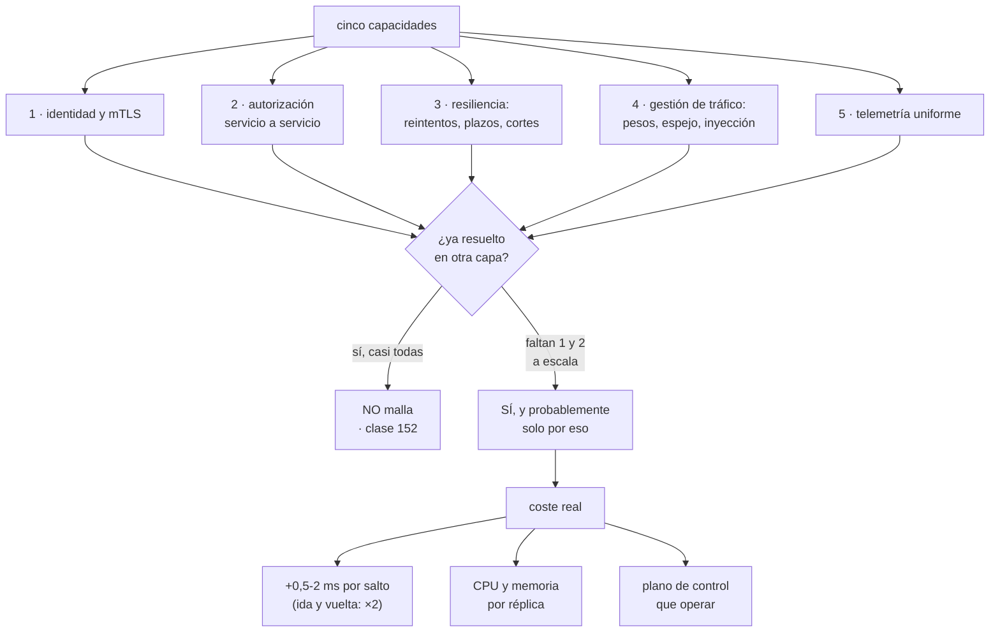

# 201 — Service mesh, mTLS y gestión de tráfico este-oeste

> [← Clase anterior](../../part-16-advanced-cloud-networking-edge/200-private-endpoints-service-networking-y-egress-control/README.md) · [Índice de la parte](../README.md) · [Clase siguiente →](../../part-16-advanced-cloud-networking-edge/202-ebpf-flow-logs-packet-capture-y-diagnostico/README.md)

**Parte:** 16 — Redes cloud avanzadas, conectividad híbrida y edge<br>
**Nivel:** avanzado · **Horas estimadas:** 4<br>
**Laboratorio:** `network` · **Estado:** `EXECUTABLE_CORE`

## 🎯 Propósito

Decidir si hace falta una malla de servicios, y si hace falta, qué parte de ella. La clase separa las cinco capacidades que una malla ofrece y comprueba cuáles están ya resueltas en otra capa —que fue el hallazgo de la clase 152 y el de la hipótesis de la parte 16—, explica el TLS mutuo como identidad de carga y no como cifrado, y advierte de lo que una malla cuesta de verdad: latencia por salto, recursos por réplica y un plano de control más que operar.

## 📚 Resultados de aprendizaje

Al finalizar podrás:

1. **Enumerar** las cinco capacidades de una malla y dónde más se resuelven.
2. **Decidir** si una malla compensa, con las capacidades que faltan.
3. **Implantar** identidad de carga con TLS mutuo y autorización por servicio.
4. **Configurar** reintentos, plazos y cortes sin empeorar la saturación.
5. **Medir** el coste real: latencia, recursos y operación.

## 🧩 Conceptos centrales

| Concepto | Comprensión verificable |
|---|---|
| `malla de servicios` | Capa que intercepta el tráfico entre servicios para aplicar identidad, política, resiliencia y telemetría. |
| `acompañante` | Proceso o biblioteca que intercepta el tráfico de un servicio. Añade latencia y consume recursos por réplica. |
| `TLS mutuo` | Ambos extremos presentan certificado. Da identidad criptográfica a cada carga, sin credenciales guardadas. |
| `autorización este-oeste` | Regla que dice qué servicio puede llamar a qué servicio y con qué método. |
| `plano de control` | Componente que distribuye configuración a los acompañantes. Su fallo tiene consecuencias propias. |
| `modo sin acompañante` | Variante que evita un proceso por réplica usando el nodo o el propio protocolo. Reduce coste y limita capacidades. |

## 🧠 Modelo mental

La red cloud es un sistema distribuido de rutas, identidades y políticas; cada salto añade latencia, costo y una frontera de fallo.

Aplicado a esta clase, separa siempre cuatro planos: **intención** (qué necesita el usuario),
**configuración** (qué declaramos), **estado observado** (qué existe de verdad) y
**evidencia** (cómo sabemos que cumple). Confundirlos produce diseños que se ven correctos
en un diagrama pero fallan al operar.

## 🗺️ Flujo de razonamiento



## 📖 Desarrollo

### 1. Las cinco capacidades, y dónde más se resuelven

Una malla se vende como un producto y en realidad son cinco cosas distintas. La pregunta útil no es «¿queremos malla?» sino **«¿cuáles de las cinco nos faltan?»**.

```text
1  IDENTIDAD Y CIFRADO ENTRE SERVICIOS (mTLS)
   dónde más se resuelve
     identidad de carga del proveedor + TLS en el balanceador
                                          clases 159, 196
     pero: eso cifra hasta el balanceador, no entre servicios
   → a escala, es la capacidad que MENOS alternativas tiene

2  AUTORIZACIÓN SERVICIO A SERVICIO
   dónde más se resuelve
     grupos de seguridad por servicio            clase 135
     comprobación en la aplicación
   → los grupos de seguridad autorizan por red, no por
     identidad; y con escalado dinámico se quedan cortos

3  RESILIENCIA: reintentos, plazos, cortes, mamparos
   dónde más se resuelve
     bibliotecas del lenguaje                    clase 153
     el balanceador de capa 7                    clase 196
   → si hay pocos lenguajes, la biblioteca basta
   → si hay siete, la malla evita implementarlo siete veces

4  GESTIÓN DE TRÁFICO: pesos, espejo, inyección de fallos
   dónde más se resuelve
     el balanceador de capa 7 y la canalización  clase 102
   → para el tráfico de entrada, el balanceador basta
   → para el tráfico interno entre servicios, no

5  TELEMETRÍA UNIFORME
   dónde más se resuelve
     instrumentación de la aplicación            clase 121
   → la malla da métricas de red por par de servicios sin
     tocar código, que es real y útil
   → pero NO da trazas de dentro de la aplicación
```

Y la conclusión del análisis, que coincide con lo que este programa ya encontró:

```text
de las cinco, en un sistema con balanceador de capa 7 bien
configurado y pocos lenguajes
  1  falta                     ← esta sí
  2  falta a escala            ← esta también
  3  resuelta
  4  resuelta para lo que importa
  5  parcialmente resuelta

→ la malla se justifica por 1 y 2, o no se justifica
→ y si se adopta, conviene adoptar SOLO eso al principio
```

Y la advertencia que da esta clase:

```text
adoptar una malla por las cinco capacidades cuando tres ya
están resueltas produce dos implementaciones de lo mismo
→ dos sitios donde configurar reintentos
→ y reintentos anidados, que multiplican la carga  ← ver abajo
```

### 2. Identidad de carga y autorización

**TLS mutuo** se explica mal como «cifrado entre servicios». Cifrar es lo de menos: lo importante es que cada carga tiene una **identidad criptográfica que no se puede robar y copiar**.

```text
CÓMO FUNCIONA
  cada carga recibe un certificado de corta vida (horas)
  emitido por una autoridad interna, en función de su
  identidad de despliegue
  al conectar, ambos extremos presentan y verifican

QUÉ DA
  identidad sin credenciales guardadas             clase 159
  rotación automática y corta
  autorización basada en QUIÉN llama, no en desde qué IP
  y cifrado, de propina
```

Y por qué la identidad por red no basta a escala:

```text
UN GRUPO DE SEGURIDAD DICE
  «desde esta subred se puede llegar al puerto 8080»

CON ESCALADO DINÁMICO Y CONTENEDORES
  en esa subred hay 40 servicios distintos
  → autorizar por red autoriza a los 40
  → y la dirección cambia cada pocos minutos

CON IDENTIDAD DE CARGA
  «el servicio pedidos puede llamar a POST /cobrar del
   servicio pagos»
  → y nada más
```

**La autorización este-oeste**, que es lo que convierte la identidad en control:

```text
regla por origen, destino, método y ruta
  origen   pedidos
  destino  pagos
  permite  POST /cobrar, POST /reembolsar
  deniega  el resto

y con denegación por defecto
  → el alcance desde un servicio comprometido pasa de
    «todo lo de la red» a «tres llamadas»          clase 189
```

Y el orden de implantación que no rompe nada:

```text
1  mTLS en modo PERMISIVO
   se acepta tráfico cifrado y sin cifrar
   → nada se rompe; se empieza a ver quién habla con quién

2  observar el grafo real de llamadas
   → y comprobarlo contra el diagrama              ley 24

3  mTLS ESTRICTO, servicio por servicio

4  autorización en modo REGISTRO
   se registra lo que se denegaría, sin denegar

5  autorización APLICADA, con denegación por defecto
```

Y el paso 2 suele ser el que más valor da:

```text
el grafo real de llamadas casi nunca coincide con el
diagrama
→ aparecen llamadas que nadie sabía                clase 182
→ y servicios que no habla con nadie: candidatos a retirar
                                                     ley 23
```

### 3. Resiliencia sin empeorar la saturación

Las funciones de resiliencia de una malla son fáciles de activar y fáciles de configurar mal.

```text
EL PELIGRO PRINCIPAL: REINTENTOS ANIDADOS
  el cliente reintenta 3 veces
  la malla reintenta 3 veces
  el balanceador reintenta 2 veces
  → una petición se convierte en 18 al destino
  → y en saturación, esto es lo que impide recuperarse
                                                  clase 186

REGLA
  los reintentos se hacen en UNA sola capa
  → decidir cuál, escribirlo, y desactivarlo en las demás
```

Y las reglas de configuración que este programa ya ha establecido y que aquí se aplican:

```text
REINTENTOS
  solo peticiones idempotentes                    clase 117
  máximo 1 o 2, con retroceso y dispersión
  con presupuesto: «como mucho el 10 % del tráfico puede
    ser reintento»            ← esto lo da la malla y es útil

PLAZOS
  propagados: el plazo restante viaja con la petición
  y cada salto no empieza si no le queda tiempo   clase 186

CORTES (interruptor)
  abre cuando la tasa de error o la latencia superan el
  umbral
  → deja de enviar y falla rápido
  → y hay que decidir qué hace el llamante cuando abre:
    valor por defecto, cacheado o error            clase 185

EXPULSIÓN DE ATÍPICOS
  retira réplicas concretas que fallan            clase 196
  → cubre el fallo gris
```

Y una capacidad que solo la malla da con facilidad:

```text
INYECCIÓN DE FALLOS
  «el 5 % de las llamadas a catálogo devuelven error»
  «el 10 % tardan 3 segundos»
  → permite ejecutar las pruebas negativas de dependencia
    sin tocar el código                              ley 22
  → es la forma más barata de comprobar si una dependencia
    declarada blanda lo es                        clase 185
```

Y el espejo de tráfico, útil para migraciones:

```text
ENVIAR UNA COPIA del tráfico real al servicio nuevo, sin
usar su respuesta
→ valida con carga real antes de desviar nada     clase 184
→ cuidado: si el servicio nuevo escribe, el espejo duplica
  escrituras
```

### 4. Lo que cuesta de verdad

El coste de una malla se subestima porque se reparte entre muchas partidas pequeñas.

```text
LATENCIA
  acompañante en el origen        +0,3-1 ms
  acompañante en el destino       +0,3-1 ms
  → una llamada añade 0,6-2 ms
  → una operación que cruza 4 servicios: +2,4-8 ms
  → y con TLS mutuo, algo más en el establecimiento

RECURSOS
  un acompañante por réplica: típicamente 50-150 MB de
  memoria y una fracción de CPU
  → 400 réplicas × 100 MB = 40 GB solo de acompañantes
  → y en cargas con muchas réplicas pequeñas, el
    acompañante puede consumir más que el propio servicio

OPERACIÓN
  un plano de control que actualizar y vigilar
  certificados internos que rotar
  una capa más donde diagnosticar
  y versiones que hay que ir subiendo

DIAGNÓSTICO
  «¿el error 503 lo devuelve mi servicio, el acompañante
   del destino o el mío?»
  → hay que aprender a leer los códigos propios de la malla
```

Y los modos que reducen coste, con lo que se pierde:

```text
SIN ACOMPAÑANTE, EN EL NODO
  un proxy por nodo en vez de por réplica
  + mucho menos consumo
  − aislamiento menor entre servicios del mismo nodo

SIN PROXY, EN EL PROTOCOLO
  el cifrado y la identidad se hacen en la capa de red
  + latencia casi nula
  − no da capacidades de capa 7 (reintentos por ruta,
    autorización por método)

BIBLIOTECA EN LA APLICACIÓN
  + sin salto extra
  − una por lenguaje; actualizarla exige redesplegar todo
```

Y la decisión práctica:

```text
si lo que hace falta son las capacidades 1 y 2, un modo
ligero (nodo o protocolo) suele bastar y cuesta mucho menos
→ adoptar el modo completo solo si se van a usar las
  capacidades de capa 7
```

**El plano de control como punto único**, que hay que entender antes:

```text
si el plano de control cae
  los acompañantes siguen con su última configuración
  → el tráfico NO se para
  PERO
  no se propagan cambios
  las réplicas NUEVAS pueden no obtener configuración ni
    certificado
  y si los certificados caducan antes de que vuelva, el
    tráfico SÍ se para                             ley 13

→ vigilar el plano de control y la antigüedad de la
  configuración distribuida es obligatorio
```

Y la lista de comprobación de la clase:

```text
☐ está escrito cuáles de las cinco capacidades faltan
☐ las que ya están resueltas no se duplican
☐ los reintentos se hacen en UNA sola capa
☐ hay presupuesto de reintentos
☐ los plazos se propagan
☐ mTLS se implantó en permisivo antes que en estricto
☐ el grafo real de llamadas se comparó con el diagrama
☐ la autorización pasó por modo registro antes de aplicar
☐ hay denegación por defecto entre servicios
☐ está medida la latencia añadida por salto
☐ está medido el consumo de los acompañantes
☐ se vigila el plano de control y la antigüedad de la
  configuración
☐ se usa inyección de fallos para las pruebas negativas
```

Y el cierre que enlaza con la clase siguiente: con identidad, política y telemetría entre servicios, sigue habiendo incidentes cuya causa no aparece en ninguna métrica. Ver el tráfico de verdad —flujos, captura y observación del núcleo— es la materia de la clase 202.

## 🔬 Ejemplo trabajado

**CloudShop evalúa adoptar una malla de servicios. Lo que sigue es el análisis capacidad por capacidad, la decisión de adoptar solo dos, y lo que apareció al ver el grafo real de llamadas.**

**El análisis, hecho con el método de la clase 152.**

```text
1  IDENTIDAD Y mTLS
   estado actual
     el tráfico entre servicios va sin cifrar dentro de la
     red
     la autorización es por grupo de seguridad: 40 servicios
     comparten subred
     3 servicios usan una clave estática compartida para
     autenticarse entre sí, de 2022
   veredicto   FALTA, y no hay alternativa razonable a escala

2  AUTORIZACIÓN SERVICIO A SERVICIO
   estado actual
     ninguna: cualquier servicio puede llamar a cualquier
     otro
     el modelo de amenazas dio alcance de 11 servicios desde
     uno comprometido                              clase 189
   veredicto   FALTA

3  RESILIENCIA
   estado actual
     biblioteca común en los 2 lenguajes principales, con
     plazos, reintentos y cortes
     el balanceador de capa 7 ya hace reintentos de entrada
   veredicto   RESUELTA — y duplicarla es peligroso

4  GESTIÓN DE TRÁFICO
   estado actual
     despliegue escalonado por el balanceador y por la
     canalización                                 clase 102
     lo que NO hay: espejo de tráfico e inyección de fallos
   veredicto   RESUELTA en un 80 %; falta lo de pruebas

5  TELEMETRÍA
   estado actual
     trazas instrumentadas, con contexto propagado
                                                  clase 121
     lo que falta: métricas por PAR de servicios sin tocar
     código
   veredicto   RESUELTA en su mayor parte
```

**La decisión:**

```text
se adopta una malla, EN MODO LIGERO, y solo para 1 y 2

  identidad y mTLS                          sí
  autorización servicio a servicio          sí
  reintentos, plazos y cortes de la malla   DESACTIVADOS
    → se quedan en la biblioteca, que ya funciona
  gestión de tráfico                        solo inyección
                                            de fallos, en
                                            entornos de
                                            prueba
  telemetría                                se acepta la que
                                            venga, sin
                                            sustituir la
                                            existente

modo   proxy por nodo, no acompañante por réplica
motivo 412 réplicas × 100 MB = 41 GB de memoria solo en
       acompañantes; con proxy por nodo son 38 nodos × 250 MB
       = 9,5 GB
coste  ahorro estimado 2.100 €/mes frente al modo completo
lo que se pierde   aislamiento entre servicios del mismo
       nodo → aceptado, y registrado                clase 190
```

**Fase 1: mTLS permisivo y el grafo real.**

```text
se activó en modo permisivo durante 5 semanas
nada se rompió
y se obtuvo el grafo de llamadas observado

  servicios declarados en el diagrama                 24
  servicios que emitieron o recibieron tráfico        29

  los 5 no declarados
    · un servicio de exportación creado en 2022, sin dueño
    · dos réplicas de un servicio que se creía retirado y
      seguía recibiendo el 0,4 % del tráfico
    · un trabajo programado que llamaba a la API interna
    · un panel interno de un equipo de negocio

  llamadas declaradas en el diagrama                  61
  llamadas observadas                                 96

  las 35 no declaradas, clasificadas
    18   llamadas legítimas nunca documentadas
     9   de servicios de prueba a servicios de producción
         ← hallazgo grave
     5   llamadas circulares que nadie sabía que existían
     3   de un servicio a otro que hacía de intermediario
         sin razón

  servicios que NO hablaron con nadie en 5 semanas       3
    → candidatos a retirada                          ley 23
```

Y la línea que resume la fase:

```text
el diagrama tenía 24 servicios y 61 llamadas
la realidad tenía 29 y 96
→ y las 9 llamadas de prueba a producción llevaban meses
                                              ley 24, clase 199
```

**Fase 2: autorización, en modo registro y luego aplicada.**

```text
modo registro, 3 semanas
  llamadas que se habrían denegado con la política escrita
    a partir del grafo observado                       340/día
  de ellas, legítimas y no previstas                     6
    → política corregida
  de ellas, de entornos de prueba a producción         310/día
    → cortadas a propósito
  de ellas, del servicio sin dueño                      24/día
    → se identificó al equipo, se declaró y se documentó

aplicación, servicio por servicio, 6 semanas
  denegación por defecto
  política por origen, destino, método y ruta
```

Y el efecto medido en el modelo de amenazas:

```text
alcance desde un servicio comprometido
  antes    11 servicios, cualquier método
  después   2 servicios, 3 métodos concretos

credenciales estáticas compartidas entre servicios
  antes     3
  después   0
```

**El coste real, medido:**

```text
latencia añadida por salto (proxy por nodo)
  p50                                    +0,4 ms
  p99                                    +1,1 ms
el flujo de compra cruza 3 saltos internos
  p99 del flujo                          +3,4 ms
  sobre un objetivo de 500 ms             aceptable

recursos
  memoria total de proxies                 9,5 GB
  CPU                                    ~4 % del clúster

operación
  actualizaciones del plano de control        1/trimestre
  incidentes atribuidos a la malla en 12 meses      2
    · una versión del proxy con una regresión de plazos
    · certificados internos que no rotaron en 3 nodos
      → detectado por la alerta de antigüedad       ley 13
```

**El uso que resultó más valioso y no estaba en la justificación:**

```text
INYECCIÓN DE FALLOS en preproducción
  se ejecutaron las pruebas negativas de dependencia sin
  tocar código                                       ley 22

  resultados de la primera tanda
    catálogo declarado blando → el flujo se caía      ✗
    recomendaciones blando → correcto                 ✓
    precios blando → correcto                         ✓
    envíos declarado blando → el listado se caía      ✗
    identidad → correcto (validación local)           ✓

  → 2 de 5 dependencias declaradas blandas eran duras
  → el cálculo del techo de disponibilidad estaba mal
                                                 clase 185
  → corregidas con plazo y alternativa; techo recalculado
```

Y la observación sobre esto:

```text
la capacidad que más problemas reales destapó no fue
ninguna de las dos por las que se adoptó la malla
→ fue poder romper cosas a propósito sin tocar código
```

**El resultado, a los doce meses:**

```text                                        antes     después
servicios con identidad criptográfica           0          29
credenciales estáticas entre servicios          3           0
alcance desde un servicio comprometido         11           2
llamadas de prueba a producción            310/día          0
servicios no declarados                         5           0
servicios retirados por no usarse               —           3
dependencias blandas que eran duras             2           0
latencia añadida en el flujo de compra          —      +3,4 ms
coste de la malla                               —   1.900 €/mes
```

**La lección que esta clase deja**: de las cinco capacidades, **tres ya estaban resueltas** y activarlas habría producido reintentos anidados; la malla se adoptó por dos y en el modo más barato que las daba. El hallazgo mayor de la implantación no fue de seguridad: fue que **el grafo real tenía 96 llamadas donde el diagrama declaraba 61**, incluidas nueve de entornos de prueba a producción. Y lo que más problemas destapó a lo largo del año fue **poder inyectar fallos sin tocar código**, que reveló que dos dependencias declaradas blandas no lo eran.

## 🧪 Laboratorio guiado

Ejecuta desde la raíz:

```bash
python classes/part-16-advanced-cloud-networking-edge/201-service-mesh-mtls-y-gestion-de-trafico-este-oeste/lab.py
```

El laboratorio selecciona el motor de práctica **`network`** y produce
`lab_result.json`. El escenario, sus comprobaciones y el artefacto esperado corresponden a
esta clase; no requiere credenciales y deja explícito qué debe revalidarse en un sandbox real.

1. Lee `exercise.steps` y formula una predicción antes de ejecutar.
2. Ejecuta la práctica y verifica todos los elementos de `checks`.
3. Provoca el caso de `negative_test` y explica la señal observada.
4. Materializa `service-mesh` en `evidence/` usando la plantilla indicada.
5. Para proveedor real, sigue `sandbox.requires`, registra costo y ejecuta `destroy`.

### Evidencia esperada

El artefacto principal es una topología con rutas, puertos y controles. Además, la entrega debe incluir el comando ejecutado,
la salida estructurada y una conclusión que no exceda lo observado.

## 🏆 Reto verificable

Construye **`service-mesh`** para el caso CloudShop. Incluye una alternativa descartada,
un supuesto que pueda falsarse, una prueba de fallo y una decisión de rollback.

## ✅ Criterio de aceptación

- [ ] `lab.py` termina con código 0 y genera JSON válido.
- [ ] La entrega conecta al menos tres requisitos con mecanismos verificables.
- [ ] Existe una prueba positiva y una prueba negativa con evidencia.
- [ ] Seguridad, costo y operación aparecen como decisiones, no como anexos.
- [ ] Se declara una limitación y una condición que obligaría a revisar el diseño.
- [ ] Otra persona puede repetir el recorrido sin conocimiento tácito.

## ⚠️ Errores frecuentes

| Síntoma | Causa probable | Corrección |
|---|---|---|
| Una petición fallida genera decenas de intentos contra el destino | Reintentos anidados en cliente, malla y balanceador | Reintenta en una sola capa, escríbelo, desactiva las demás y usa presupuesto de reintentos. |
| La malla consume más recursos que los propios servicios | Un acompañante por réplica en cargas con muchas réplicas pequeñas | Evalúa el modo por nodo o en la capa de protocolo si solo necesitas identidad y autorización. |
| Activar la autorización corta tráfico legítimo | La política se escribió sobre el diagrama y no sobre el grafo real | Pasa por modo permisivo y modo registro, construye la política con el tráfico observado y aplícala servicio por servicio. |
| Se adopta una malla y no mejora nada medible | Las capacidades que faltaban ya estaban resueltas en otra capa | Analiza las cinco por separado, adopta solo las que faltan y registra la decisión con sus premisas. |
| Las réplicas nuevas no arrancan correctamente | El plano de control está caído y no entrega configuración ni certificados | Vigila el plano de control y la antigüedad de la configuración distribuida, y alerta sobre certificados internos sin rotar. |
| Nadie sabe qué componente devuelve un error | La malla añade una capa con sus propios códigos | Aprende y documenta los códigos propios de la malla, y correlaciona por identificador de traza en las tres capas. |

## 🛡️ Seguridad, ética y costo

Trabaja con cuentas propias o sandboxes autorizados. No publiques secretos, identificadores
reales ni datos personales. Antes de crear recursos pagos define presupuesto, etiquetas y
comando de destrucción; después verifica que no queden recursos huérfanos. Los ejemplos
locales enseñan contratos, pero no certifican cumplimiento ni disponibilidad de producción.

## ❓ Preguntas de comprobación

1. ¿Cuáles son las cinco capacidades de una malla y cuáles suelen estar ya resueltas?
2. ¿Por qué la autorización por grupo de seguridad no basta a escala?
3. ¿Qué peligro tiene activar los reintentos de la malla sin desactivar los demás?
4. ¿Qué ocurre si cae el plano de control y qué lo convierte en un corte real?
5. ¿Qué capacidad permite ejecutar pruebas negativas de dependencia sin tocar código?

## 🔗 Referencias

- Istio (2025). *Security: mutual TLS and authorization policies*. <https://istio.io/latest/docs/concepts/security/>
- Linkerd (2025). *Architecture and performance*. <https://linkerd.io/2/reference/architecture/>
- SPIFFE (2025). *Workload identity specification*. <https://spiffe.io/docs/latest/spiffe-about/overview/>
- Cilium (2025). *Service mesh without sidecars*. <https://cilium.io/use-cases/service-mesh/>
- Google (2016). *SRE Book: addressing cascading failures* — reintentos y presupuestos. <https://sre.google/sre-book/addressing-cascading-failures/>
- Documentación oficial vigente del servicio implementado; registra URL y fecha de consulta.

---

> [Evaluación](assessment.md) · [Contrato de clase](lesson.yaml) · [Índice de la parte](../README.md)
