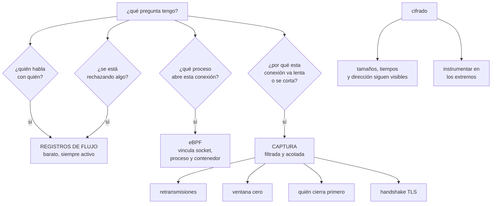

# 202 — eBPF, flow logs, packet capture y diagnóstico

> [← 201 · Service mesh, mTLS y gestión de tráfico este-oeste](../../part-16-advanced-cloud-networking-edge/201-service-mesh-mtls-y-gestion-de-trafico-este-oeste/README.md) · [Índice de la parte](../README.md) · [203 · SD-WAN, 5G, IoT y operación desconectada →](../../part-16-advanced-cloud-networking-edge/203-sd-wan-5g-iot-y-operacion-desconectada/README.md)

**Parte:** 16 — Redes cloud avanzadas, conectividad híbrida y edge<br>
**Nivel:** avanzado · **Horas estimadas:** 4<br>
**Laboratorio:** `observability` · **Estado:** `EXECUTABLE_CORE`

## 🎯 Propósito

Ver el tráfico de verdad cuando las métricas no bastan, que es exactamente cuando ocurren los incidentes que duran horas. La clase ordena las herramientas de diagnóstico de red por coste y por lo que cada una puede responder —registros de flujo, observación desde el núcleo, captura de paquetes—, da el método de descarte que evita perder tiempo, y aborda lo que casi nunca se explica: **qué hacer cuando el tráfico va cifrado y no se puede mirar dentro**.

## 📚 Resultados de aprendizaje

Al finalizar podrás:

1. **Elegir** la herramienta adecuada a la pregunta que se está haciendo.
2. **Leer** registros de flujo para responder qué habla con qué y qué se rechaza.
3. **Usar** observación desde el núcleo sin desplegar agentes intrusivos.
4. **Capturar** paquetes con filtro y de forma acotada, y saber qué buscar.
5. **Diagnosticar** cuando el contenido está cifrado y no se puede inspeccionar.

## 🧩 Conceptos centrales

| Concepto | Comprensión verificable |
|---|---|
| `registro de flujo` | Resumen por conexión: origen, destino, puerto, bytes, y si fue aceptada o rechazada. Barato y siempre disponible. |
| `eBPF` | Mecanismo que permite ejecutar código de observación dentro del núcleo, sin modificar aplicaciones ni añadir proxies. |
| `captura de paquetes` | Copia del tráfico real. La única que ve el detalle, y la más cara en recursos y en privacidad. |
| `muestreo` | Registrar una fracción de los flujos. Reduce coste y hace que los eventos raros no aparezcan. |
| `retransmisión` | Reenvío de un segmento perdido. Su tasa es la señal más directa de un problema de red. |
| `ventana cero` | El receptor anuncia que no puede recibir más. Indica que el problema está en el destino, no en la red. |

## 🧠 Modelo mental

La red cloud es un sistema distribuido de rutas, identidades y políticas; cada salto añade latencia, costo y una frontera de fallo.

Aplicado a esta clase, separa siempre cuatro planos: **intención** (qué necesita el usuario),
**configuración** (qué declaramos), **estado observado** (qué existe de verdad) y
**evidencia** (cómo sabemos que cumple). Confundirlos produce diseños que se ven correctos
en un diagrama pero fallan al operar.

## 🗺️ Flujo de razonamiento



## 📖 Desarrollo

### 1. Tres herramientas, tres preguntas

El error que más tiempo cuesta es empezar capturando paquetes. Cada herramienta responde preguntas distintas y hay que ir de la barata a la cara.

```text
REGISTROS DE FLUJO
  qué dan   por conexión: origen, destino, puertos, protocolo,
            bytes, paquetes, si fue aceptada o rechazada, y
            a menudo por qué regla
  coste     bajo; se pueden dejar siempre activos
  responden
    ¿quién habla con quién?
    ¿se está rechazando algo, y qué regla lo rechaza?
    ¿cuánto tráfico va a cada destino?      ← coste  clase 200
    ¿hay tráfico hacia sitios inesperados?
  NO responden
    por qué una conexión concreta va lenta
    qué ocurre dentro de la conversación

OBSERVACIÓN DESDE EL NÚCLEO (eBPF)
  qué da    eventos en el núcleo: sockets, llamadas al
            sistema, latencia por conexión, y —lo importante—
            QUÉ PROCESO Y QUÉ CONTENEDOR
  coste     bajo o medio; sin modificar aplicaciones
  responde
    ¿qué proceso abre esta conexión?
    ¿cuánto tarda cada fase: resolución, conexión, respuesta?
    ¿qué contenedor genera este tráfico?
    ¿dónde se pierden paquetes dentro del nodo?

CAPTURA DE PAQUETES
  qué da    el tráfico real
  coste     alto: CPU, disco, y contiene datos personales
  responde
    todo lo demás, pero solo si sabes qué buscar
```

Y el método de descarte, que es el orden correcto:

```text
1  ¿llega la conexión al destino?        → flujos
2  ¿la rechaza alguna regla?             → flujos
3  ¿qué proceso la abre y cuánto tarda   → eBPF
   cada fase?
4  ¿qué pasa dentro de la conversación?  → captura

→ y en la práctica, los pasos 1 y 2 resuelven la mayoría
```

Y una advertencia sobre los registros de flujo:

```text
EL MUESTREO
  muchos productos muestrean: 1 de cada N flujos
  → los eventos raros desaparecen
  → y precisamente lo que se busca en un incidente suele
    ser raro

→ conviene tener muestreo completo al menos en las subredes
  críticas, aunque cueste más
```

### 2. Leer registros de flujo

Los registros de flujo están casi siempre activados y casi nunca se usan bien.

```text
LO QUE SE PUEDE RESPONDER EN MINUTOS

¿este servicio habla con quien creemos?
  agrupar por par origen-destino y contar
  → y comparar con el diagrama                       ley 24

¿qué se está rechazando?
  filtrar por acción de rechazo y agrupar por regla
  → los rechazos son la señal más informativa y la que
    nadie mira                                       ley 15

¿a dónde va el tráfico saliente y cuánto?
  agrupar por destino externo y sumar bytes
  → esto es lo que descubre coste y exfiltración  clase 200

¿hay tráfico entre zonas que podría ser dentro de una?
  agrupar por zona de origen y de destino
  → suele ser la línea de coste más grande y peor
    atribuida                                     clase 168

¿qué habla con este recurso antes de retirarlo?
  filtrar por su dirección durante semanas
  → es la forma correcta de decidir si algo se puede
    apagar                                          ley 23
```

Y los patrones que se reconocen en los flujos:

```text
MUCHOS FLUJOS CORTOS AL MISMO DESTINO
  sin reutilización de conexión
  → cada petición abre una conexión nueva
  → coste de establecimiento y de TLS en cada una

FLUJOS RECHAZADOS REPETIDOS DESDE EL MISMO ORIGEN
  un cliente que no sabe que ya no puede
  → suele ser un servicio retirado a medias

TRÁFICO SALIENTE CONSTANTE Y PEQUEÑO A UN DESTINO ÚNICO
  la firma clásica de un agente o de una exfiltración lenta
                                                clase 200

UN ORIGEN QUE HABLA CON MUCHOS DESTINOS INTERNOS
  reconocimiento, o un servicio que hace de intermediario
  sin razón                                     clase 201
```

Y una limitación que hay que tener presente:

```text
los flujos dicen QUE hubo conexión, no si funcionó
  una conexión aceptada que devuelve errores de aplicación
  aparece igual que una correcta
→ para eso hacen falta las métricas de aplicación
                                                clase 121
```

### 3. Captura de paquetes: qué buscar

Capturar sin saber qué se busca produce gigabytes inútiles. Con cuatro cosas se resuelve casi todo.

```text
ANTES DE CAPTURAR
  filtra en el origen: host, puerto y protocolo
  acota el tiempo o el tamaño
  captura en los DOS extremos si es posible    ← clave
  y ten en cuenta que el contenido puede tener datos
    personales: la captura es un dato sensible  clase 189
```

**Las cuatro señales que hay que mirar:**

```text
1  RETRANSMISIONES
   segmentos reenviados porque no llegó confirmación
   tasa normal        < 0,1 %
   preocupante        > 1 %
   → indica pérdida en el camino: enlace saturado, MTU,
     equipo intermedio                          clase 198

2  VENTANA CERO
   el receptor anuncia que no puede recibir más
   → el problema está en el DESTINO, no en la red
   → el destino no consume lo que le llega: aplicación
     bloqueada, disco lento, hilos agotados     clase 186

3  QUIÉN CIERRA PRIMERO Y CÓMO
   cierre limpio     alguien terminó a propósito
   reinicio abrupto  algo cortó: cortafuegos, plazo, proceso
                     caído
   → y saber CUÁL de los dos extremos lo envió señala dónde
     está la causa
   → un reinicio desde un intermedio suele ser un cortafuegos
     con estado que perdió la sesión            clase 194

4  EL ESTABLECIMIENTO
   ¿cuánto tarda el saludo inicial?  → red
   ¿cuánto tarda el saludo TLS?      → certificados, cadena
   ¿se completa?                     → versión o cifrado
                                       incompatible
   → aquí se ven los fallos de certificado con precisión
                                                clase 196
```

Y los patrones que identifican causa directamente:

```text
SÍNTOMA EN LA CAPTURA           CAUSA
retransmisiones solo de         MTU sin ajustar    clase 198
paquetes grandes

ventana cero repetida           el destino no consume:
                                mirar el destino, no la red

reinicio abrupto tras 60 s      un intermedio con plazo de
exactos de inactividad          inactividad menor que los
                                extremos           clase 196

saludo TLS que empieza y no     cadena incompleta o versión
termina                         no soportada

muchos establecimientos por     sin reutilización de conexión
segundo al mismo destino

todo correcto en la captura     el problema es de aplicación,
                                no de red      ← también es
                                un resultado
```

Y el último merece énfasis:

```text
una captura limpia DESCARTA la red
→ y descartar es la mitad del diagnóstico
→ decir «la red está bien, con esta evidencia» vale tanto
  como encontrar la causa
```

### 4. Cuando el tráfico va cifrado

Con TLS en todas partes —y más aún con TLS mutuo— la captura ya no muestra el contenido. Eso cambia el método pero no lo impide.

```text
LO QUE SIGUE SIENDO VISIBLE CIFRADO
  quién habla con quién, y cuándo
  el nombre solicitado en el saludo, salvo que esté cifrado
  tamaños de los mensajes y su patrón temporal
  el establecimiento completo y sus errores
  retransmisiones, ventana cero y cierres

→ es decir: casi todo lo que hace falta para diagnosticar
  problemas de RED
```

Y lo que hay que hacer para lo demás:

```text
INSTRUMENTAR EN LOS EXTREMOS
  trazas con contexto propagado                  clase 121
  → dan lo que la captura ya no puede dar

OBSERVAR DESDE EL NÚCLEO
  eBPF puede ver los datos ANTES de cifrar y DESPUÉS de
  descifrar, dentro del proceso
  → sin claves, sin proxy y sin tocar la aplicación
  → es la razón principal por la que esta técnica se ha
    vuelto central

DESCIFRAR EN UN PUNTO CONTROLADO
  el balanceador o el proxy ya ven el tráfico en claro
  → registrar allí, con cuidado de no registrar datos
    personales                                   clase 189

Y LO QUE NO SE DEBE HACER
  guardar claves privadas para poder descifrar capturas
  → convierte el archivo de capturas en el activo más
    peligroso de la organización
```

**La operación del diagnóstico**, que evita el caos durante los incidentes:

```text
QUÉ HAY QUE TENER PREPARADO ANTES
  flujos activos y consultables, sin muestreo en lo crítico
  permiso y procedimiento para capturar, con quién autoriza
  un sitio donde guardar capturas, con caducidad automática
  las herramientas instaladas o disponibles al momento
  y el camino esperado de cada flujo, escrito     clase 194

→ conseguir un permiso de captura durante un incidente
  añade horas
```

Y el tratamiento de las capturas como dato sensible:

```text
contienen datos personales y a veces credenciales
→ acceso restringido, caducidad corta, y registro de quién
  las descarga
→ y nunca en un almacén compartido general        clase 189
```

Y la lista de comprobación de la clase:

```text
☐ los registros de flujo están activos y son consultables
☐ no hay muestreo en las subredes críticas
☐ los rechazos se revisan periódicamente, no solo en
  incidentes
☐ hay observación desde el núcleo capaz de vincular
  conexión, proceso y contenedor
☐ existe procedimiento y permiso previo para capturar
☐ las capturas se filtran y se acotan en origen
☐ las capturas caducan solas y su acceso queda registrado
☐ no se guardan claves privadas para descifrar capturas
☐ el diagnóstico de aplicación se apoya en trazas, no en
  contenido de paquetes
☐ el camino esperado de los flujos principales está escrito
```

Y el cierre que enlaza con la clase siguiente: hasta aquí la red ha sido de centros de datos y nubes, con enlaces estables. Cuando el extremo es una tienda, un vehículo o un dispositivo que se queda sin cobertura, las reglas cambian. Redes definidas por software, 5G y operación desconectada es la materia de la clase 203.

## 🔬 Ejemplo trabajado

**Tres incidentes de CloudShop que las métricas no explicaban. Lo que sigue es el diagnóstico de cada uno con la herramienta que correspondía, y el tiempo que costó cada vez que se empezó por la equivocada.**

**Incidente 1 · «El servicio de envíos falla al llamar al transportista», abril.**

```text
síntoma   el 12 % de las llamadas al API del transportista
          fallaban por plazo vencido
          las métricas de aplicación solo decían «timeout»

lo que se hizo primero (mal)
  2 h revisando el código del cliente HTTP
  1 h capturando paquetes sin filtro en el nodo
     → 3,2 GB de captura, imposible de leer

lo que lo resolvió, en 6 minutos
  REGISTROS DE FLUJO, filtrados por el destino del
  transportista

    flujos aceptados                          88 %
    flujos RECHAZADOS                         12 %
    regla que los rechazaba   el grupo de seguridad de
                              salida de una de las tres
                              subredes de la aplicación

  causa    al añadir una tercera subred en febrero, se copió
           la configuración de otra y faltaba la regla de
           salida hacia el rango del transportista
  → el 12 % era exactamente 1 de cada 3 réplicas

lección   la primera pregunta era «¿se rechaza algo?» y la
          responden los flujos en un minuto
```

**Incidente 2 · «Conexiones que se cuelgan cada 60 segundos exactos», julio.**

```text
síntoma   las conexiones de larga duración entre el servicio
          de informes y la base corporativa se cortaban con
          una regularidad exacta
          reintentaban y funcionaban, pero cada corte perdía
          la consulta en curso

flujos    mostraban conexiones establecidas y cerradas, sin
          rechazos → no bastaba

eBPF      mostró que el cierre venía de fuera del proceso
          y que el proceso no lo pedía

CAPTURA   filtrada por el par de direcciones y el puerto,
          durante 5 minutos: 4 MB

  lo que se vio
    tras exactamente 60 s sin datos, llegaba un reinicio
    abrupto
    el reinicio NO venía de ninguno de los dos extremos:
    los números de secuencia no correspondían
    → lo enviaba un intermedio

  causa   el cortafuegos del enlace dedicado tenía un plazo
          de inactividad de 60 s
          los dos extremos tenían 300 s y no enviaban nada
          entre consultas

  corrección
    mensajes de mantenimiento de conexión cada 30 s en el
    cliente
    y el plazo del cortafuegos documentado en el registro de
    caminos esperados                            clase 194

tiempo total    40 min, de los cuales 25 fueron conseguir
                permiso para capturar
→ desde entonces, el permiso está preautorizado con
  procedimiento
```

**Incidente 3 · «Latencia alta e intermitente solo en una zona», octubre.**

```text
síntoma   el p99 del servicio de catálogo en la zona C era
          4 veces el de las zonas A y B
          CPU, memoria y errores, normales en las tres

flujos    volumen y destinos idénticos en las tres zonas
          → no explicaba nada

eBPF      desglose de latencia por fase, por conexión

    fase                    zona A    zona B    zona C
    resolución de nombre     0,4 ms    0,4 ms   38 ms   ←
    establecimiento          0,6 ms    0,6 ms    0,7 ms
    saludo TLS               1,2 ms    1,2 ms    1,3 ms
    primera respuesta        41 ms     43 ms     44 ms

  → el problema era la RESOLUCIÓN DE NOMBRES, no el tráfico

  causa
    el resolutor de la zona C tenía una regla de reenvío
    apuntando a un servidor corporativo que respondía lento
    las otras dos usaban el resolutor local        clase 195
    y como la biblioteca no cacheaba, cada petición
    resolvía de nuevo

  corrección
    regla de reenvío corregida
    caché de resolución activada en el cliente
    p99 de la zona C                    de 84 ms a 46 ms

lección   sin el desglose por fase, esto se habría
          diagnosticado como «la red de la zona C va mal»
          y se habría escalado al proveedor
```

**Lo que se montó después de los tres.**

```text
FLUJOS
  activados en todas las subredes
  sin muestreo en producción y en datos
  con 30 días de retención y consulta indexada
  coste                                    +410 €/mes

  y un panel que nadie tenía: RECHAZOS POR REGLA
    revisión semanal
    en los 6 primeros meses encontró
      · 3 servicios retirados cuyos clientes seguían
        intentando conectar
      · 1 regla que rechazaba tráfico legítimo desde una
        subred nueva (el incidente 1, en otras dos subredes)
      · 2 orígenes internos intentando alcanzar producción
        desde preproducción                    clase 199

OBSERVACIÓN DESDE EL NÚCLEO
  desplegada en todos los nodos
  da: latencia por fase, proceso y contenedor por conexión,
      pérdidas dentro del nodo
  coste                          ~2 % de CPU, 180 €/mes

CAPTURA
  procedimiento preautorizado, con dos personas que pueden
  activarla
  filtro obligatorio en origen
  almacenamiento con caducidad de 7 días y acceso registrado
  prohibido guardar claves privadas para descifrar
```

**El efecto medido:**

```text                                        antes     después
tiempo medio de diagnóstico de red        1 h 55       12 min
incidentes en que se capturó sin filtro        3           0
tiempo perdido en conseguir permisos       25 min          0
rechazos revisados periódicamente             no       semanal
problemas encontrados por la revisión
  de rechazos, sin incidente previo            —           6
```

Y una observación sobre el último dato:

```text
seis problemas se encontraron mirando los rechazos, sin que
hubiera ningún incidente
→ tres de ellos habrían causado uno más adelante
→ la señal existía desde siempre y nadie la miraba  ley 15
```

**La lección que esta clase deja**: los tres incidentes se resolvieron con tres herramientas distintas, y en dos de ellos **se empezó por la más cara**: tres horas de código y captura ciega para un problema que los registros de flujo respondían en seis minutos. El incidente que parecía más de red —latencia alta en una zona— **no era de red**: era resolución de nombres, y solo se vio con el desglose de latencia por fase. Y el panel más útil del año no lo pidió ningún incidente: fue **mirar lo que se estaba rechazando**.

## 🧪 Laboratorio guiado

Ejecuta desde la raíz:

```bash
python classes/part-16-advanced-cloud-networking-edge/202-ebpf-flow-logs-packet-capture-y-diagnostico/lab.py
```

El laboratorio selecciona el motor de práctica **`observability`** y produce
`lab_result.json`. El escenario, sus comprobaciones y el artefacto esperado corresponden a
esta clase; no requiere credenciales y deja explícito qué debe revalidarse en un sandbox real.

1. Lee `exercise.steps` y formula una predicción antes de ejecutar.
2. Ejecuta la práctica y verifica todos los elementos de `checks`.
3. Provoca el caso de `negative_test` y explica la señal observada.
4. Materializa `network-evidence` en `evidence/` usando la plantilla indicada.
5. Para proveedor real, sigue `sandbox.requires`, registra costo y ejecuta `destroy`.

### Evidencia esperada

El artefacto principal es telemetría correlacionada con una pregunta operativa. Además, la entrega debe incluir el comando ejecutado,
la salida estructurada y una conclusión que no exceda lo observado.

## 🏆 Reto verificable

Construye **`network-evidence`** para el caso CloudShop. Incluye una alternativa descartada,
un supuesto que pueda falsarse, una prueba de fallo y una decisión de rollback.

## ✅ Criterio de aceptación

- [ ] `lab.py` termina con código 0 y genera JSON válido.
- [ ] La entrega conecta al menos tres requisitos con mecanismos verificables.
- [ ] Existe una prueba positiva y una prueba negativa con evidencia.
- [ ] Seguridad, costo y operación aparecen como decisiones, no como anexos.
- [ ] Se declara una limitación y una condición que obligaría a revisar el diseño.
- [ ] Otra persona puede repetir el recorrido sin conocimiento tácito.

## ⚠️ Errores frecuentes

| Síntoma | Causa probable | Corrección |
|---|---|---|
| Se pierden horas en un diagnóstico que los flujos resolvían en minutos | Se empezó capturando paquetes en vez de descartar por orden | Pregunta primero si la conexión llega y si algo la rechaza; los flujos responden eso al instante. |
| Un evento raro no aparece en los registros de flujo | El producto está muestreando una fracción de los flujos | Desactiva el muestreo al menos en las subredes críticas, aunque cueste más. |
| La captura ocupa gigabytes y no se puede analizar | Se capturó sin filtro ni límite de tiempo | Filtra por host, puerto y protocolo en el origen, acota la duración y captura en ambos extremos. |
| Las conexiones se cortan con periodicidad exacta | Un intermedio con plazo de inactividad menor que el de los extremos envía un reinicio | Comprueba en la captura de quién viene el reinicio y añade mensajes de mantenimiento de conexión por debajo de ese plazo. |
| Se atribuye a la red una latencia que no es de red | No se desglosó la latencia por fase de la conexión | Usa observación desde el núcleo para separar resolución, establecimiento, saludo TLS y primera respuesta. |
| El archivo de capturas se convierte en un riesgo | Se guardan capturas sin caducidad, o claves privadas para descifrarlas | Caducidad corta, acceso restringido y registrado, y nunca almacenar claves privadas para descifrar tráfico capturado. |

## 🛡️ Seguridad, ética y costo

Trabaja con cuentas propias o sandboxes autorizados. No publiques secretos, identificadores
reales ni datos personales. Antes de crear recursos pagos define presupuesto, etiquetas y
comando de destrucción; después verifica que no queden recursos huérfanos. Los ejemplos
locales enseñan contratos, pero no certifican cumplimiento ni disponibilidad de producción.

## ❓ Preguntas de comprobación

1. ¿Qué pregunta responde cada una de las tres herramientas y en qué orden se usan?
2. ¿Por qué el muestreo de flujos estorba precisamente en un incidente?
3. ¿Qué indica una ventana cero repetida y hacia dónde dirige el diagnóstico?
4. ¿Qué sigue siendo visible en una captura de tráfico cifrado?
5. ¿Qué hay que tener preparado antes de necesitar una captura?

## 🔗 Referencias

- AWS (2025). *VPC Flow Logs* — campos, acciones y limitaciones. <https://docs.aws.amazon.com/vpc/latest/userguide/flow-logs.html>
- Cilium (2025). *Hubble: eBPF-based network observability*. <https://docs.cilium.io/en/stable/overview/intro/>
- Gregg, B. (2019). *BPF Performance Tools*. <https://www.brendangregg.com/bpf-performance-tools-book.html>
- Wireshark (2025). *TCP analysis flags: retransmissions, zero window, resets*. <https://www.wireshark.org/docs/wsug_html_chunked/ChAdvTCPAnalysis.html>
- Google Cloud (2025). *Packet Mirroring and network diagnostics*. <https://cloud.google.com/vpc/docs/packet-mirroring>
- Documentación oficial vigente del servicio implementado; registra URL y fecha de consulta.

---

> [Evaluación](assessment.md) · [Contrato de clase](lesson.yaml) · [Índice de la parte](../README.md)

| Anterior | Índice | Siguiente |
|---|---|---|
| [← 201 · Service mesh, mTLS y gestión de tráfico este-oeste](../../part-16-advanced-cloud-networking-edge/201-service-mesh-mtls-y-gestion-de-trafico-este-oeste/README.md) | [Parte 16](../README.md) · [Programa](../../README.md) | [203 · SD-WAN, 5G, IoT y operación desconectada →](../../part-16-advanced-cloud-networking-edge/203-sd-wan-5g-iot-y-operacion-desconectada/README.md) |
