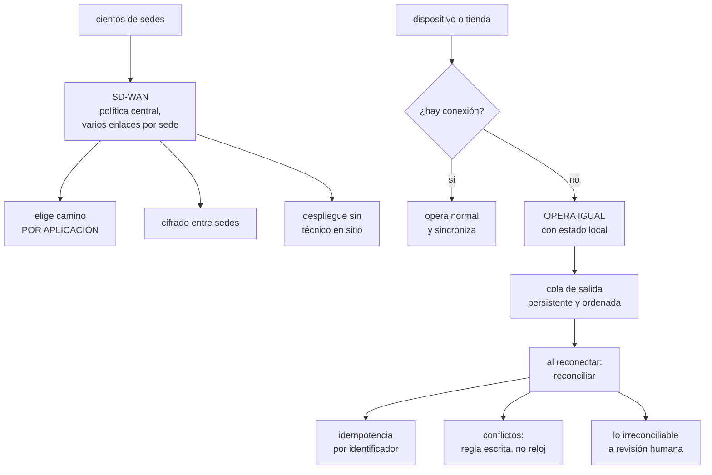

# 203 — SD-WAN, 5G, IoT y operación desconectada

> [← 202 · eBPF, flow logs, packet capture y diagnóstico](../../part-16-advanced-cloud-networking-edge/202-ebpf-flow-logs-packet-capture-y-diagnostico/README.md) · [Índice de la parte](../README.md) · [204 · Proyecto: red multi-región y multi-cloud →](../../part-16-advanced-cloud-networking-edge/204-proyecto-red-multi-region-y-multi-cloud/README.md)

**Parte:** 16 — Redes cloud avanzadas, conectividad híbrida y edge<br>
**Nivel:** avanzado · **Horas estimadas:** 4<br>
**Laboratorio:** `architecture` · **Estado:** `EXECUTABLE_CORE`

## 🎯 Propósito

Diseñar para el extremo, donde el enlace no es fiable, la latencia no es despreciable y el dispositivo puede pasar horas sin conexión. La clase cubre las redes definidas por software para conectar cientos de sedes, lo que 5G aporta de verdad y lo que se le atribuye sin fundamento, y —lo que más decisiones cambia— **cómo se diseña un sistema que tiene que seguir funcionando sin red y reconciliar después sin perder datos ni duplicarlos**.

## 📚 Resultados de aprendizaje

Al finalizar podrás:

1. **Conectar** muchas sedes con redes definidas por software y políticas centrales.
2. **Distinguir** lo que 5G aporta de lo que se le atribuye.
3. **Diseñar** operación desconectada con estado local y reconciliación.
4. **Resolver** conflictos de reconciliación sin perder ni duplicar.
5. **Operar** miles de extremos con actualizaciones seguras y vuelta atrás.

## 🧩 Conceptos centrales

| Concepto | Comprensión verificable |
|---|---|
| `red definida por software (SD-WAN)` | Capa que gestiona muchas sedes con política central y varios enlaces por sede, eligiendo camino por aplicación. |
| `cómputo en el extremo` | Procesamiento cerca del dispositivo, para no depender del enlace ni de la latencia hacia la nube. |
| `operación desconectada` | Capacidad de seguir prestando servicio sin conexión, con estado local y reconciliación posterior. |
| `reconciliación` | Fusión del estado local con el central al recuperar conexión. Es donde se pierden o duplican datos. |
| `cola de salida local` | Registro persistente de lo ocurrido sin conexión, que se envía en orden al reconectar. |
| `actualización segura` | Despliegue a dispositivos con verificación, doble partición y vuelta atrás automática. |

## 🧠 Modelo mental

La red cloud es un sistema distribuido de rutas, identidades y políticas; cada salto añade latencia, costo y una frontera de fallo.

Aplicado a esta clase, separa siempre cuatro planos: **intención** (qué necesita el usuario),
**configuración** (qué declaramos), **estado observado** (qué existe de verdad) y
**evidencia** (cómo sabemos que cumple). Confundirlos produce diseños que se ven correctos
en un diagrama pero fallan al operar.

## 🗺️ Flujo de razonamiento



## 📖 Desarrollo

### 1. Muchas sedes: redes definidas por software

Conectar tres oficinas se hace con túneles. Conectar cuatrocientas tiendas, no.

```text
EL PROBLEMA A ESCALA
  configurar cada sede a mano no escala
  cada sede tiene 2 o 3 enlaces de calidad distinta
    fibra, radio móvil, satélite
  y el tráfico ya no va al centro de datos: va a la nube y
    a servicios de terceros
  → el modelo de «todo al centro y de ahí a internet»
    añade latencia y coste sin dar nada

LO QUE APORTA UNA SD-WAN
  política CENTRAL aplicada a todas las sedes
  varios enlaces por sede, usados a la vez
  elección de camino POR APLICACIÓN
    · el punto de venta va por el enlace fiable
    · las actualizaciones van por el barato
    · el vídeo va por el de menos jitter
  cifrado entre sedes sin configurar túneles uno a uno
  y despliegue sin técnico en sitio: el equipo se autoconfigura
```

Y las decisiones que hay que tomar y suelen olvidarse:

```text
¿QUÉ PASA SI EL PLANO DE CONTROL NO RESPONDE?
  las sedes deben seguir funcionando con su última política
  → si no, el plano de control es un punto único que tira
    cuatrocientas tiendas                       clase 201

¿SALIDA LOCAL A INTERNET O CENTRALIZADA?
  local     menos latencia y coste
  central   inspección y control de salida        clase 200
  → lo habitual: salida local para servicios conocidos y
    central para el resto

¿QUÉ SE HACE CUANDO UN ENLACE SE DEGRADA SIN CAERSE?
  medir latencia, pérdida y jitter continuamente y cambiar
  de camino por umbral
  → es el fallo gris aplicado a los enlaces      clase 185
```

Y una advertencia sobre la elección de camino:

```text
cambiar de camino a mitad de una sesión rompe lo que
tenga estado
→ el cambio debe aplicarse a sesiones nuevas, salvo que
  el producto mantenga la sesión
→ y el cambio de camino cambia la dirección de origen, con
  lo que eso implica para listas de terceros    clase 193
```

### 2. 5G: lo que aporta y lo que se le atribuye

Conviene separar con cuidado, porque hay mucha atribución sin fundamento.

```text
LO QUE APORTA DE VERDAD
  ancho de banda alto sin obra civil
  → conectar una sede nueva en días, no en meses
  densidad de dispositivos por celda muy superior
  → útil en fábricas, almacenes y logística
  latencia menor que las generaciones anteriores
  segmentación de red por contrato: un canal con garantías
  distintas para tráfico crítico
  y redes privadas en instalaciones propias

LO QUE NO APORTA POR SÍ SOLO
  «latencia de un milisegundo» de extremo a extremo
    → la baja latencia es del tramo radio; el resto del
      camino sigue existiendo
    → si el servidor está a 600 km, la física manda
  fiabilidad garantizada sin contrato específico
  cobertura uniforme
  y desde luego no elimina la necesidad de operar
    desconectado
```

Y el criterio práctico:

```text
5G es una buena PRIMERA opción de conectividad para sedes
nuevas y una excelente SEGUNDA para redundancia
→ y su valor real suele estar en el plazo de despliegue,
  no en la latencia

y para latencia baja de verdad hace falta acercar el CÓMPUTO,
no solo mejorar el enlace                        clase 197
```

**Cómputo en el extremo**, que es lo que resuelve latencia y desconexión a la vez:

```text
CUÁNDO HACE FALTA
  la decisión debe tomarse en decenas de milisegundos
    (control industrial, seguridad, visión)
  el volumen de datos es tal que enviarlo todo no compensa
    (vídeo, sensores a alta frecuencia)
  el servicio DEBE seguir funcionando sin conexión
    (punto de venta, control de acceso)

CUÁNDO NO
  cuando la latencia de ir a la nube es aceptable
  → y entonces se evita operar una flota de dispositivos
```

Y el coste que introduce, que es el que decide:

```text
cada extremo es un sistema que hay que
  desplegar, actualizar, vigilar, asegurar y retirar
→ con cuatrocientos extremos, cualquier tarea manual es
  imposible                                        ley 23
```

### 3. Operar sin conexión

Esta es la parte que más cambia el diseño y la que más se improvisa.

```text
LA PREGUNTA QUE HAY QUE CONTESTAR PRIMERO
  ¿qué operaciones DEBEN funcionar sin conexión?

  ejemplo de una tienda
    cobrar                      SÍ, obligatoriamente
    consultar stock local       SÍ
    consultar stock de otra     no; se degrada
      tienda
    aplicar promoción           SÍ, con las reglas cacheadas
    devolver                    SÍ, con límite de importe
    consultar historial de un   no
      cliente
```

Y de esa lista sale todo lo demás:

```text
LO QUE DEBE FUNCIONAR SIN CONEXIÓN NECESITA
  1  los DATOS que necesita, cacheados localmente y con
     su antigüedad conocida
  2  las REGLAS que aplica, cacheadas y versionadas
  3  un registro PERSISTENTE de lo ocurrido, ordenado
  4  una política de LÍMITES para lo que no se puede
     verificar
  5  y una forma de RECONCILIAR al volver
```

Y el punto 4 es el que evita el fraude y las pérdidas:

```text
sin conexión no se puede verificar
  el saldo real de una tarjeta
  si un cupón ya se usó
  si un artículo está reservado

→ hay que decidir el límite de riesgo aceptable
  «devoluciones hasta 50 € sin conexión; por encima, no»
  «pagos sin conexión hasta 3 operaciones por tarjeta»
→ y esa decisión es de negocio, no técnica
```

**La cola de salida local**, que es el mecanismo central:

```text
cada operación local se escribe en un registro persistente
  con identificador único generado localmente
  con marca de tiempo local Y contador monótono
  y sobrevive a un reinicio o a un corte de luz

al reconectar se envía EN ORDEN, con reintentos
y el servidor la procesa de forma IDEMPOTENTE  clase 117
  → el mismo identificador dos veces no crea dos cosas
```

Y los errores clásicos:

```text
GUARDAR EN MEMORIA
  un corte de luz pierde las ventas de la tarde

SIN IDENTIFICADOR LOCAL ÚNICO
  el reintento crea duplicados

SIN ORDEN
  se procesa una devolución antes que la venta

COLA SIN LÍMITE NI VIGILANCIA
  el dispositivo se queda sin disco tras dos días
  → hay que alertar por antigüedad y tamaño de la cola
                                                    ley 13
```

### 4. Reconciliar, y operar la flota

**La reconciliación** es donde se pierden o duplican datos, y necesita reglas escritas antes.

```text
LOS CONFLICTOS QUE APARECEN
  el mismo artículo vendido en la tienda y reservado en la
    web mientras no había conexión
  un precio que cambió centralmente y la tienda aplicó el
    antiguo
  un cupón usado dos veces en dos tiendas desconectadas
  un cliente que cambió su dirección en dos sitios

Y LA REGLA QUE NO SIRVE
  «gana la marca de tiempo más reciente»
  → los relojes de los dispositivos derivan mucho más que
    los de un servidor                            clase 187
```

Y las reglas que sí funcionan, por tipo de dato:

```text
HECHOS INMUTABLES (una venta ocurrió)
  no hay conflicto: se acepta y se registra
  → por eso conviene modelar el extremo como generador de
    HECHOS, no de estado                          clase 188

CONTADORES (stock)
  se aplican las variaciones, no el valor final
  «−1 unidad» se puede aplicar en cualquier orden
  «stock = 4» no                                  ley 21

ESTADO EDITABLE (datos de cliente)
  regla explícita: gana el central, gana el local, o se
  marca para revisión

LO IRRECONCILIABLE
  a una cola de revisión humana, con contexto
  → y hay que medir cuántos casos llegan ahí; si crecen,
    la regla está mal
```

Y una consecuencia de diseño:

```text
el precio y la promoción aplicados se GUARDAN EN LA VENTA
→ así la venta es un hecho completo y no depende de
  reconstruir qué precio había                    clase 149
```

**Operar la flota**, que es lo que hace viable todo lo anterior:

```text
ACTUALIZACIONES
  firmadas y verificadas por el dispositivo       clase 106
  doble partición: se instala en la inactiva y se arranca
  vuelta atrás AUTOMÁTICA si no confirma tras arrancar
  → sin esto, una actualización mala exige visita física
  despliegue escalonado por grupos, nunca a todos  clase 102

VIGILANCIA
  cada dispositivo reporta: versión, antigüedad de datos,
  tamaño de cola, tiempo desconectado
  ALERTA POR ANTIGÜEDAD: «este dispositivo lleva N horas
  sin reportar»                                     ley 13
  → es la única forma de saber que uno murió

IDENTIDAD Y SECRETOS
  identidad por dispositivo, no compartida        clase 159
  credenciales de corta duración y renovables
  y capacidad de REVOCAR uno concreto
  → un dispositivo robado es un punto de entrada

RETIRADA
  procedimiento para dar de baja y borrar
  → sin él, la flota crece y nunca decrece          ley 23
```

Y la lista de comprobación de la clase:

```text
☐ está escrito qué operaciones deben funcionar sin conexión
☐ los datos y reglas necesarios están cacheados y con
  antigüedad conocida
☐ hay límites de riesgo escritos para lo no verificable
☐ la cola local es persistente, ordenada y con identificador
  único
☐ el servidor procesa de forma idempotente
☐ hay alerta por antigüedad y tamaño de la cola
☐ las reglas de reconciliación están escritas por tipo de
  dato
☐ no se resuelve ningún conflicto por marca de tiempo del
  dispositivo
☐ el stock se sincroniza por variaciones, no por valor final
☐ hay cola de revisión humana y se mide cuánto llega
☐ las actualizaciones son firmadas, con doble partición y
  vuelta atrás automática
☐ hay alerta por dispositivo que deja de reportar
☐ cada dispositivo tiene identidad propia y revocable
☐ existe procedimiento de retirada
```

Y el cierre que enlaza con la clase siguiente: con direccionamiento, encaminamiento, nombres, entrada, borde, conectividad, salida, tráfico interno, diagnóstico y extremo, queda montarlo todo junto en un diseño de red multirregión y multinube. Es la materia de la clase 204, que además cierra la parte 16.

## 🔬 Ejemplo trabajado

**CloudShop tiene 340 tiendas con punto de venta propio. Lo que sigue es el rediseño de conectividad, la decisión sobre qué debe funcionar sin conexión, y el incidente de reconciliación que costó 41.000 € antes de arreglarlo.**

**El punto de partida:**

```text
340 tiendas, cada una con
  1 enlace de fibra del proveedor local
  1 respaldo por radio móvil, configurado a mano
  todo el tráfico va al centro de datos y de ahí a la nube

problemas medidos
  latencia del punto de venta a la nube        180-240 ms
    · 40 ms tienda → centro de datos
    · 60 ms de cola en el enlace central saturado
    · 80 ms centro de datos → nube
  cortes de fibra al mes, en el conjunto              26
  tiempo medio de reparación                       6 h 20
  conmutación al respaldo                         MANUAL
    → una llamada del encargado y 40 min de media
  tiendas que en un corte NO podían cobrar         100 %
```

Y el dato que decidió el proyecto:

```text
cortes al mes                                       26
horas de tienda sin poder cobrar                   164/mes
venta perdida estimada                          38.000 €/mes
```

**El rediseño de conectividad.**

```text
SD-WAN con dos enlaces activos por tienda
  fibra local + radio móvil 5G
  elección de camino POR APLICACIÓN
    punto de venta        → fibra; conmuta a 5G por umbral
    actualizaciones       → el enlace más barato, siempre
    vídeo de seguridad    → 5G, para no ocupar la fibra
    navegación de empleados → salida local a internet

  conmutación automática por umbral de pérdida y latencia
    umbral   pérdida > 2 % o latencia > 150 ms durante 10 s
    tiempo de conmutación medido            2,4 s

  salida local para servicios conocidos, central para el
  resto                                          clase 200

  y la decisión que no se olvidó
    si el plano de control de la SD-WAN no responde, cada
    tienda mantiene su última política
    → probado desconectándolo 4 horas                ley 22
```

Y el efecto:

```text                                        antes     después
latencia del punto de venta a la nube    180-240 ms    70 ms
  (salida local, sin pasar por el centro de datos)
conmutación al respaldo                    40 min       2,4 s
horas de tienda sin conectividad          164/mes      9/mes
coste de conectividad                    41.000 €    36.500 €
```

Y una nota sobre el 5G:

```text
lo que aportó no fue la latencia, que en el tramo relevante
apenas cambió
fue que 47 tiendas nuevas se conectaron en 4 días en vez de
en 3 meses, y que el respaldo dejó de depender del mismo
proveedor de última milla que la fibra          clase 198
```

**Lo que debe funcionar sin conexión, decidido con negocio:**

```text
operación                          sin conexión   límite
cobrar con tarjeta                     SÍ         3 operaciones
                                                  por tarjeta,
                                                  máx. 300 €
cobrar en efectivo                     SÍ         sin límite
consultar stock de esta tienda         SÍ         antigüedad
                                                  mostrada
consultar stock de otras tiendas       NO         se degrada
aplicar promoción                      SÍ         reglas
                                                  cacheadas,
                                                  versionadas
devolución con ticket                  SÍ         máx. 50 €
devolución sin ticket                  NO
emitir tarjeta regalo                  NO         ← ver abajo
consultar historial de cliente         NO
```

Y la última fila tiene historia.

**El incidente de reconciliación, marzo.**

```text
situación   corte de fibra de 5 horas en 11 tiendas
            el punto de venta siguió funcionando

lo que pasó
  las tarjetas regalo SÍ se podían emitir y canjear sin
  conexión, porque nadie lo había excluido
  el saldo se comprobaba contra la copia local

  un cliente canjeó la misma tarjeta de 300 € en 4 tiendas
  desconectadas el mismo día
  y en las semanas siguientes, el patrón se repitió

  al reconciliar, el sistema central aplicó los 4 canjes
  → saldo negativo, y ninguna forma de recuperar el dinero

pérdida acumulada hasta detectarlo             41.000 €
tiempo hasta detectarlo                        7 semanas
cómo se detectó   un cuadre contable mensual, no una alerta
                                                    ley 15
```

Y el análisis de la causa:

```text
la lista de «qué funciona sin conexión» no se había escrito
→ funcionaba CUANTO técnicamente podía funcionar
→ y nadie había decidido el límite de riesgo

y la regla de reconciliación tampoco existía
→ el central aplicaba lo que llegaba, en orden de llegada
```

Y las correcciones:

```text
1  lista escrita de operaciones permitidas sin conexión,
   con límites, aprobada por negocio y por finanzas

2  tarjeta regalo: canje solo con conexión
   → si no hay conexión, se ofrece otro medio de pago

3  reglas de reconciliación por tipo de dato
     ventas          hechos: se aceptan todas
     stock           variaciones, no valor final
     saldos          verificación obligatoria en central
     devoluciones    hasta 50 €, aceptadas; el resto a
                     revisión

4  cola de revisión humana, con panel
   casos que llegan al mes                            18
   → estable; si superara 60, la regla estaría mal

5  alerta por patrón: «la misma tarjeta o el mismo cupón
   aparece en más de una tienda en la misma ventana de
   desconexión»
   → habría detectado el problema en 2 días, no en 7 semanas
```

**La cola de salida local, rediseñada:**

```text
antes   en memoria, con envío inmediato y sin identificador
        propio
        → un corte de luz en enero perdió 340 ventas

después
  registro persistente en disco, con sincronización forzada
  identificador único por operación, generado localmente
  contador monótono por dispositivo, además de la hora
  envío en orden, con reintentos y retroceso
  procesamiento idempotente en el central       clase 117
  alerta si la cola supera 500 elementos o 4 horas de
    antigüedad                                     ley 13

prueba negativa
  cortar la luz a mitad de una venta, 20 veces
  → 20 de 20 recuperadas al arrancar
```

**La operación de la flota:**

```text
actualizaciones
  firmadas y verificadas por el dispositivo
  doble partición con vuelta atrás automática si no
    confirma en 10 min
  despliegue por grupos: 5 tiendas → 40 → 340
  → en junio, una versión con un fallo de impresión de
    tickets se detectó en el grupo de 5 y no llegó a las
    otras 335

vigilancia por dispositivo
  versión, antigüedad de datos, tamaño de cola, horas
  desconectado
  alerta «lleva más de 2 h sin reportar»
  → detectó 3 puntos de venta muertos que las tiendas no
    habían reportado porque usaban el de al lado

identidad
  certificado por dispositivo, rotación automática
  revocación individual probada
  → en septiembre se robó un punto de venta; revocado en
    11 minutos

retirada
  procedimiento de baja con borrado
  dispositivos dados de baja en el año                62
  → antes, los antiguos se quedaban en el inventario y con
    credenciales válidas                             ley 23
```

**El resultado del año:**

```text                                        antes     después
horas de tienda sin poder cobrar          164/mes      0/mes
latencia del punto de venta            180-240 ms      70 ms
conmutación al respaldo                    40 min       2,4 s
ventas perdidas por corte de luz         340 (ene)         0
pérdidas por canje duplicado           41.000 € (7 sem)    0
tiempo de conexión de una tienda nueva    3 meses      4 días
dispositivos muertos sin detectar               3           0
coste de conectividad                    41.000 €    36.500 €
```

**La lección que esta clase deja**: el rediseño de red resolvió lo que se había planteado —**de 164 horas al mes sin poder cobrar a cero**— y aun así el problema más caro del año no fue de conectividad: fue que **nadie había escrito qué debía poder hacerse sin conexión**, así que se podía hacer todo, incluido canjear la misma tarjeta regalo en cuatro tiendas. Y tardó siete semanas en detectarse porque **la señal era un cuadre contable mensual y no una alerta**.

## 🧪 Laboratorio guiado

Ejecuta desde la raíz:

```bash
python classes/part-16-advanced-cloud-networking-edge/203-sd-wan-5g-iot-y-operacion-desconectada/lab.py
```

El laboratorio selecciona el motor de práctica **`architecture`** y produce
`lab_result.json`. El escenario, sus comprobaciones y el artefacto esperado corresponden a
esta clase; no requiere credenciales y deja explícito qué debe revalidarse en un sandbox real.

1. Lee `exercise.steps` y formula una predicción antes de ejecutar.
2. Ejecuta la práctica y verifica todos los elementos de `checks`.
3. Provoca el caso de `negative_test` y explica la señal observada.
4. Materializa `edge-topology` en `evidence/` usando la plantilla indicada.
5. Para proveedor real, sigue `sandbox.requires`, registra costo y ejecuta `destroy`.

### Evidencia esperada

El artefacto principal es un diagrama acompañado por decisiones y trade-offs. Además, la entrega debe incluir el comando ejecutado,
la salida estructurada y una conclusión que no exceda lo observado.

## 🏆 Reto verificable

Construye **`edge-topology`** para el caso CloudShop. Incluye una alternativa descartada,
un supuesto que pueda falsarse, una prueba de fallo y una decisión de rollback.

## ✅ Criterio de aceptación

- [ ] `lab.py` termina con código 0 y genera JSON válido.
- [ ] La entrega conecta al menos tres requisitos con mecanismos verificables.
- [ ] Existe una prueba positiva y una prueba negativa con evidencia.
- [ ] Seguridad, costo y operación aparecen como decisiones, no como anexos.
- [ ] Se declara una limitación y una condición que obligaría a revisar el diseño.
- [ ] Otra persona puede repetir el recorrido sin conocimiento tácito.

## ⚠️ Errores frecuentes

| Síntoma | Causa probable | Corrección |
|---|---|---|
| Un corte del plano de control deja sin servicio a cientos de sedes | Los equipos de sede no funcionan con su última política conocida | Exige operación autónoma con la política cacheada y pruébalo desconectando el plano de control durante horas. |
| Se espera latencia de milisegundos por usar 5G y no se consigue | La mejora es del tramo radio; el resto del camino hasta el servidor sigue igual | Si hace falta latencia baja de verdad, acerca el cómputo; valora 5G por plazo de despliegue y por independencia de la última milla. |
| Un corte de luz pierde las operaciones de horas | La cola de salida vive en memoria | Registro persistente con sincronización forzada, identificador único local y envío ordenado con reintentos. |
| Al reconectar aparecen operaciones duplicadas | Falta identificador local único o procesamiento idempotente en el central | Genera identificador en el dispositivo y haz que el servidor sea idempotente por ese identificador. |
| Sin conexión se realizan operaciones que no se pueden verificar y generan pérdidas | No hay lista escrita de qué se permite ni límites de riesgo | Decide con negocio qué opera sin conexión y con qué límites; lo no verificable, o se limita o se prohíbe. |
| Una actualización defectuosa obliga a visitar los dispositivos | Sin doble partición ni vuelta atrás automática, y desplegada a todos a la vez | Actualizaciones firmadas, instaladas en partición inactiva, con confirmación y reversión automática, y despliegue por grupos. |

## 🛡️ Seguridad, ética y costo

Trabaja con cuentas propias o sandboxes autorizados. No publiques secretos, identificadores
reales ni datos personales. Antes de crear recursos pagos define presupuesto, etiquetas y
comando de destrucción; después verifica que no queden recursos huérfanos. Los ejemplos
locales enseñan contratos, pero no certifican cumplimiento ni disponibilidad de producción.

## ❓ Preguntas de comprobación

1. ¿Qué aporta una SD-WAN que no dan los túneles configurados uno a uno?
2. ¿Qué aporta 5G de verdad y qué se le atribuye sin fundamento?
3. ¿Qué cinco cosas necesita una operación que debe funcionar sin conexión?
4. ¿Por qué no se resuelven los conflictos por la marca de tiempo del dispositivo?
5. ¿Qué diferencia hay entre sincronizar un contador por valor final y por variaciones?

## 🔗 Referencias

- Cisco (2025). *SD-WAN design guide* — política central y selección de camino por aplicación. <https://www.cisco.com/c/en/us/solutions/enterprise-networks/sd-wan/index.html>
- 3GPP (2025). *5G network slicing overview*. <https://www.3gpp.org/technologies/5g-system-overview>
- AWS (2025). *IoT Greengrass: local processing and offline operation*. <https://docs.aws.amazon.com/greengrass/v2/developerguide/what-is-iot-greengrass.html>
- Shapiro, M. y otros (2011). *Conflict-free replicated data types*. <https://inria.hal.science/inria-00609399>
- Microsoft (2025). *Azure IoT Edge deployment and safe rollout*. <https://learn.microsoft.com/en-us/azure/iot-edge/about-iot-edge>
- Documentación oficial vigente del servicio implementado; registra URL y fecha de consulta.

---

> [Evaluación](assessment.md) · [Contrato de clase](lesson.yaml) · [Índice de la parte](../README.md)

**📥 Descargar:** [Parte 16 en PDF](../../../site/downloads/partes/manual-parte-16-advanced-cloud-networking-edge.pdf) · [Manual integral](../../../site/downloads/multi-cloud-engineering-manual-v2.0.pdf)

| Anterior | Índice | Siguiente |
|---|---|---|
| [← 202 · eBPF, flow logs, packet capture y diagnóstico](../../part-16-advanced-cloud-networking-edge/202-ebpf-flow-logs-packet-capture-y-diagnostico/README.md) | [Parte 16](../README.md) · [Programa](../../README.md) | [204 · Proyecto: red multi-región y multi-cloud →](../../part-16-advanced-cloud-networking-edge/204-proyecto-red-multi-region-y-multi-cloud/README.md) |
