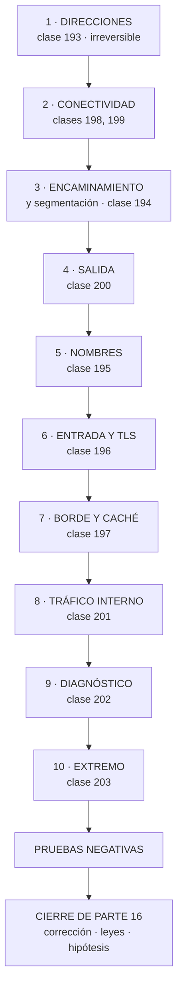

# 204 — Proyecto: red multi-región y multi-cloud

> [← 203 · SD-WAN, 5G, IoT y operación desconectada](../../part-16-advanced-cloud-networking-edge/203-sd-wan-5g-iot-y-operacion-desconectada/README.md) · [Índice de la parte](../README.md) · [205 · Hosting progresivo con Amplify, S3 y CloudFront →](../../part-17-aws-production-architecture/205-hosting-progresivo-con-amplify-s3-y-cloudfront/README.md)

**Parte:** 16 — Redes cloud avanzadas, conectividad híbrida y edge<br>
**Nivel:** avanzado · **Horas estimadas:** 8<br>
**Laboratorio:** `capstone` · **Estado:** `EXECUTABLE_CORE`

## 🎯 Propósito

Montar en un solo diseño lo de las once clases anteriores: direccionamiento, encaminamiento, nombres, entrada, borde, conectividad, salida, tráfico interno, diagnóstico y extremo, sobre varias regiones y varias nubes. La clase da el orden de decisión, el entregable y los criterios. Y cierra la parte 16: corrige las cinco predicciones de la clase 192 —tres acertadas, dos a medias—, actualiza el recuento de leyes, añade la ley 25 y escribe la hipótesis de la parte 17.

## 📚 Resultados de aprendizaje

Al finalizar podrás:

1. **Producir** un diseño de red multirregión y multinube coherente.
2. **Ordenar** las decisiones de red por coste de cambio.
3. **Comprobar** el diseño con las pruebas negativas de toda la parte.
4. **Corregir** las cinco predicciones de la clase 192 con evidencia.
5. **Escribir** la hipótesis de la parte 17 en forma refutable.

## 🧩 Conceptos centrales

| Concepto | Comprensión verificable |
|---|---|
| `diseño de red completo` | Conjunto coherente de decisiones desde el direccionamiento hasta el diagnóstico, sin huecos. |
| `orden por coste de cambio` | Direcciones primero, diagnóstico al final. Renumerar cuesta meses; añadir un panel, horas. |
| `coherencia entre nubes` | Que el plan de direcciones, los nombres y las políticas no se contradigan entre proveedores. |
| `prueba negativa de red` | Comprobación que provoca el fallo de red a propósito y verifica la respuesta declarada. |
| `ley 25` | Lo provisional sobrevive a su motivo; sin fecha de caducidad, para siempre. |
| `hipótesis de parte` | Afirmación refutable escrita antes de estudiar, que la parte siguiente corrige con evidencia. |

## 🧠 Modelo mental

La red cloud es un sistema distribuido de rutas, identidades y políticas; cada salto añade latencia, costo y una frontera de fallo.

Aplicado a esta clase, separa siempre cuatro planos: **intención** (qué necesita el usuario),
**configuración** (qué declaramos), **estado observado** (qué existe de verdad) y
**evidencia** (cómo sabemos que cumple). Confundirlos produce diseños que se ven correctos
en un diagrama pero fallan al operar.

## 🗺️ Flujo de razonamiento



## 📖 Desarrollo

### 1. El encargo y su orden

**El encargo.** CloudShop opera en tres nubes, dos regiones por nube, un centro de datos, once oficinas y trescientas cuarenta tiendas. El proyecto consiste en producir el diseño de red completo.

**El orden de decisión**, por coste de cambio:

```text
1  DIRECCIONAMIENTO                               clase 193
   espacio reservado, jerarquía, registro central
   → lo más caro de cambiar de todo el programa

2  CONECTIVIDAD FÍSICA Y LÓGICA            clases 198, 199
   enlaces y túneles con su redundancia sin causa común
   concentradores por región, unidos entre sí

3  ENCAMINAMIENTO Y SEGMENTACIÓN                 clase 194
   tablas por función; cerrar por ausencia de ruta
   anuncios resumidos y filtros explícitos

4  CONTROL DE SALIDA                             clase 200
   puntos privados, denegación por defecto, perímetro de
   datos

5  NOMBRES                                       clase 195
   zonas, vista partida, TTL atados al plazo de recuperación

6  ENTRADA Y CERTIFICADOS                        clase 196
   capas 4 y 7, reparto, salud, renovación automática

7  BORDE Y CACHÉ                                 clase 197
   clave de caché, rancio, escudo de origen

8  TRÁFICO INTERNO                               clase 201
   identidad de carga y autorización, con lo mínimo

9  DIAGNÓSTICO                                   clase 202
   flujos sin muestreo, observación del núcleo, captura
   preautorizada

10 EXTREMO                                       clase 203
   qué opera sin conexión, con qué límites y cómo reconcilia
```

Y las dos reglas del orden:

```text
los pasos 1 y 2 condicionan todo lo demás
los pasos 9 y 10 se pueden cambiar en semanas
→ y por eso la discusión debe gastarse en los primeros
```

Y el error de método que hunde este proyecto:

```text
empezar por el paso 6 o el 7, que son los visibles
→ y descubrir en el paso 1 que hay solapamiento y que nada
  de lo anterior se puede conectar                clase 193
```

### 2. El entregable y las pruebas

**El documento**, en unas quince páginas:

```text
1  PLAN DE DIRECCIONAMIENTO
   espacio, jerarquía, reservas y registro
   consumidores contados, incluidos pods y puntos privados

2  TOPOLOGÍA
   enlaces y túneles, con ruta física documentada
   concentradores y su unión entre regiones y nubes
   qué anuncia y qué acepta cada extremo

3  SEGMENTACIÓN
   tablas de rutas por función
   qué alcanza cada segmento, y qué NO por ausencia de ruta

4  SALIDA
   puntos privados, destinos permitidos con dueño y
   caducidad, perímetro de datos

5  NOMBRES
   zonas, vista partida, TTL por volatilidad, resolución
   entre nubes y corporativa

6  ENTRADA
   capas, algoritmos, comprobaciones, plazos ordenados
   inventario de certificados y su renovación

7  BORDE
   claves de caché por ruta, políticas de rancio, escudo

8  TRÁFICO INTERNO
   identidad, autorización, y qué capacidades NO se adoptan

9  DIAGNÓSTICO
   qué se registra, sin muestreo dónde, y procedimiento de
   captura

10 EXTREMO
   operaciones sin conexión, límites y reconciliación

11 CAMINOS ESPERADOS de los flujos principales  clase 194
12 PRUEBAS NEGATIVAS con su resultado
13 LO QUE NO SE HACE, y por qué
```

**Las pruebas negativas de la parte**, que son el criterio de terminado:

```text
☐ superar el límite de prefijos de una sesión y ver la caída
☐ trazar ida y vuelta de los flujos principales
☐ crear una ruta a un rango y comprobar que no se propaga
  donde no debe
☐ alcanzar producción desde no-producción
☐ sacar datos a un almacén de otra organización
☐ sacar datos por consultas de nombres
☐ cambiar un registro y medir cuánto tarda cada servicio
☐ enviar un paquete grande sin fragmentar por cada túnel
☐ desconectar el enlace principal y cronometrar la vuelta
☐ dejar caducar un certificado de prueba y ver la alerta
☐ degradar una réplica y ver si el reparto la evita
☐ invalidar caché en masa y medir la carga del origen
☐ inyectar fallo en una dependencia declarada blanda
☐ desconectar el plano de control de la SD-WAN
☐ cortar la luz a un dispositivo a mitad de operación
```

Y los criterios de evaluación, publicados antes:

```text                                                     peso
1  el plan de direcciones cuenta los consumidores ocultos  3
2  hay registro central obligatorio y automatizado         2
3  la redundancia no tiene causa común, documentada        3
4  la segmentación cierra por ausencia de ruta             3
5  la salida está cerrada y el perímetro de datos existe   3
6  los TTL están atados al plazo de recuperación           2
7  los certificados tienen alerta por antigüedad           2
8  la clave de caché está justificada por ruta             2
9  solo se adoptan las capacidades de malla que faltan     2
10 los flujos sin muestreo en lo crítico                   1
11 está escrito qué opera sin conexión y con qué límites   3
12 están escritos los caminos esperados                    2
13 las pruebas negativas se ejecutaron y hay fallos
   publicados                                              3
```

Y el 13 pesa como los que más, por el mismo motivo de siempre:

```text
en este programa, la proporción de pruebas negativas que
fallan la primera vez ha estado entre el 27 % y el 45 %
→ un proyecto con cero fallos no las ejecutó       ley 22
```

### 3. Cierre de la parte 16: corrección de las cinco predicciones

**Las cinco predicciones de la clase 192, corregidas con la evidencia de las clases 193 a 203.**

```text
1. «la red será la capa donde más decisiones irreversibles se
    toman con menos deliberación: los rangos y la conectividad
    se eligen en una tarde y condicionan una década»

   CORRECTA, y con las cifras más contundentes de la parte.
   87 redes, 37 sin registro alguno, 10.0.0.0/16 usado en 6
   sitios a la vez, y 172.17 solapando con un motor de
   contenedores desde 2022. Reservar el espacio y registrar
   los bloques al principio costaba 2 días; renumerar una
   sola red costó 25 personas-semana, y el plazo no lo marcó
   ninguna decisión técnica sino la lista de permitidos de
   un socio. Ley 14 en su forma más cara.

2. «la mayoría de los problemas de red no serán de
    encaminamiento ni de rendimiento sino de nombres y
    certificados»

   A MEDIAS, y la cuenta lo aclara. De los diecisiete
   incidentes de la parte: nombres 5, certificados 2,
   encaminamiento 5, y el resto repartido entre MTU,
   redundancia falsa, reparto, exfiltración y reconciliación.
   Nombres y certificados suman 7 de 17 (41 %): la familia
   más grande, pero no la mayoría, y empatados con
   encaminamiento en incidentes puros. Donde sí acertamos de
   pleno es en la GRAVEDAD: las dos únicas caídas TOTALES
   del año fueron de certificado, y ninguna por caducidad
   sorpresa sino por automatización rota en silencio.

3. «el coste de salida y el tráfico entre zonas volverán a
    ser la línea más grande y la peor atribuida, y seguirá
    sin tener dueño»

   PRIMERA MITAD CORRECTA: el 82 % del tráfico saliente iba
   a servicios del propio proveedor pagándose como salida a
   internet, y no lo miraba nadie. SEGUNDA MITAD FALLADA, y
   por un motivo que no habíamos previsto: cerrar la salida
   por seguridad OBLIGÓ a declarar cada destino con dueño y
   caducidad. Al final del año había 57 destinos con dueño
   donde antes había una salida abierta sin ninguno.
   Predijimos que seguiría sin dueño y le puso dueño un
   proyecto de seguridad, no uno de coste.

4. «la malla aparecerá otra vez como respuesta a problemas
    ya resueltos en otra capa, y el análisis honesto la
    dejará en una o dos capacidades»

   CORRECTA Y EXACTA: de las cinco capacidades, tres estaban
   resueltas, se adoptó por dos —identidad y autorización— y
   en el modo más barato. Pero incompleta en algo
   interesante: la capacidad que más problemas reales
   destapó no fue ninguna de las dos que justificaron la
   adopción, sino la inyección de fallos, que reveló que dos
   de cinco dependencias declaradas blandas eran duras.

5. «el diagnóstico de red será donde más se note la ley 24:
    los diagramas omitirán lo mismo, y ahí estarán los
    incidentes»

   CORRECTA Y SUBESTIMADA. Un camino de desarrollo a los
   datos de producción abierto tres años; 1.334 destinos
   externos desconocidos, entre ellos una exfiltración de
   catorce meses al almacén personal de un antiguo empleado;
   96 llamadas entre servicios donde el diagrama declaraba
   61; un registro de nombres huérfano de diecinueve meses.
   Las cuatro omisiones que la ley 24 nombra aparecieron las
   cuatro, y ninguna la detectó una alerta: las detectaron
   inventarios.
```

**Marcador: tres correctas, dos a medias.** Y por primera vez en el programa el fallo no fue de reparto sino de **mecanismo**: en la predicción 3 dimos por hecho que un problema de coste sin dueño seguiría sin dueño, y lo resolvió un proyecto de otra disciplina. Los problemas no siempre los arregla quien los sufre.

### 4. Recuento de leyes, ley 25 e hipótesis de la parte 17

**El recuento de leyes, cerrada la parte 16.**

```text
ley 13  lo que no se mira deja de funcionar en silencio        39
ley 15  la señal existe y nadie la mira                        29
ley 14  el coste se decide al crear, no al pagar               25
ley 22  un procedimiento nunca ejecutado no funciona           24
ley 16  un control que estorba se rodea                        23
ley 20  lo que no tiene dueño se filtra y se desperdicia       21
ley 21  el acoplamiento vive en quién escribe                  18
ley 19  la compensación hace invisible el fallo                10
ley 17  se optimiza la medida, no el objetivo                  10
ley 23  la capacidad la limita lo que ya se mantiene           10
ley 24  lo que no está en el diagrama no se analiza             9
ley 18  lo asíncrono traslada la garantía, no la elimina        8
```

Y la parte 16 obliga a escribir una ley nueva, que este programa lleva rozando desde la parte 08:

```text
LEY 25
  lo provisional sobrevive a su motivo;
  sin fecha de caducidad, para siempre

apariciones en esta parte                                      5
  clase 194   una preferencia cambiada «para probar el
              respaldo» que llevaba 2 semanas rompiendo la
              simetría; una ruta a agujero negro de una
              migración de agosto
  clase 195   un registro de nombres huérfano de 19 meses
  clase 199   31 emparejamientos creados «para una prueba»;
              rutas estáticas de una migración terminada en
              2022 que abrían desarrollo a producción
  clase 200   un agente de monitorización de un contrato
              cancelado, aún enviando datos; un script de
              exportación de un empleado que ya no estaba
  clase 203   nada excluido de la operación sin conexión,
              porque nunca se decidió qué excluir

y lo que la distingue de la ley 20
  la 20 dice que lo sin dueño se degrada
  la 25 dice que lo temporal NO se retira, tenga dueño o no
  → el remedio no es asignar dueño: es poner fecha
```

**La hipótesis de la parte 17** (clases 205 a 216, AWS en profundidad y proyecto productivo), escrita antes de estudiarla para que la clase 216 la corrija:

```text
1. bajar a un proveedor concreto va a revelar que buena parte
   de lo que este programa ha tratado como decisiones de
   arquitectura son, en ese proveedor, valores por defecto; y
   los valores por defecto van a resultar mal elegidos para
   producción en más de la mitad de los casos

2. el diseño de la base de datos por patrones de acceso será
   la decisión más cara de cambiar de toda la parte, y la
   que más veces se tome sin haber escrito los patrones
                                                    ley 14

3. la eliminación de secretos mediante federación resultará
   sencilla técnicamente y lenta organizativamente: el
   obstáculo no será la configuración sino quién tiene
   permiso para cambiarla                            ley 16

4. en el proyecto productivo, más de la mitad de los
   problemas que aparezcan no serán de AWS sino de lo mismo
   de siempre: algo provisional que no se retiró, una señal
   que nadie miraba y un procedimiento nunca ejecutado
                                          leyes 25, 15, 22

5. el coste real del sistema terminado será entre dos y
   cuatro veces la estimación inicial, y la diferencia
   estará casi toda en partidas que no son cómputo:
   transferencia, almacenamiento de registros y servicios
   gestionados facturados por petición
```

Y el cierre de la parte 16: **de once clases, lo que más problemas destapó no fue ninguna herramienta de diagnóstico, sino tres inventarios** —el de bloques de direcciones, el de destinos de salida y el de llamadas entre servicios—. Ninguno de los tres requería tecnología nueva; los tres encontraron cosas que llevaban años funcionando sin que nadie las hubiera dibujado. La parte 17 baja a un proveedor concreto y construye un sistema productivo entero, empezando por el alojamiento y la entrega. Es la clase 205.

## 🔬 Ejemplo trabajado

**El diseño de red de CloudShop, resuelto con el método de la parte. Lo que sigue es el resumen del entregable con las decisiones que costaron discusión, y el resultado de las quince pruebas negativas —de las que fallaron seis.**

**Paso 1 · Direccionamiento.**

```text
espacio reservado                          10.0.0.0/8
jerarquía                región /12 · entorno /16 ·
                         dominio /18 · zona /20 · función /24
reservados a propósito
  10.80.0.0/12   adquisiciones
  10.96.0.0/11   libre
pods en espacio no enrutado                100.64.0.0/10
  → esta decisión sola evitó pasar de /22 a /18 por zona

registro central obligatorio, automatizado en la plantilla
tiempo para obtener un bloque                    40 s
función de aptitud   ninguna red sin bloque registrado
```

**Paso 2 · Conectividad.**

```text
centro de datos ↔ nube principal
  2 enlaces dedicados de 1 Gbps
  proveedores de última milla DISTINTOS
  edificios de entrada DISTINTOS
  ruta física documentada por escrito, tras dos semanas de
  insistir                                        clase 198
  túnel de respaldo, ejercitado mensualmente

concentradores
  uno por región y por nube: 6 en total
  emparejados entre sí
  63 redes conectadas
  2 pares de gran volumen FUERA del concentrador
    → 11.840 €/mes evitados                       clase 199

tiendas
  SD-WAN, 2 enlaces por tienda (fibra + 5G)
  política central, autonomía si el plano no responde
```

**Paso 3 · Segmentación.**

```text
tablas de rutas
  producción · no-producción · compartidos · socios ·
  inspección

lo que NO se alcanza, por ausencia de ruta
  no-producción → producción
  socios → cualquier cosa que no sea la red de intercambio
  datos → internet

anuncios
  la nube anuncia 2 prefijos resumidos, no 340
  la nube acepta 31 prefijos filtrados, no 1.043
  alerta al 75 % del límite
```

**Paso 4 · Salida.**

```text
27 puntos privados centralizados en red compartida
cortafuegos de salida con denegación por defecto
57 destinos permitidos, cada uno con dueño y caducidad
perímetro de datos en las dos direcciones
resolución forzada por el resolutor propio

coste                    9.450 €/mes → 4.250 €/mes
```

**Pasos 5 a 10, resumidos con lo que costó discusión:**

```text
NOMBRES
  subdominio interno int.cloudshop.com → vista partida solo
  en 3 nombres
  TTL por volatilidad; 30 s en lo que conmuta
  DNSSEC evaluado y NO adoptado, con registro    clase 195

ENTRADA
  capa 4 con IP fija delante (listas de terceros)
  capa 7 detrás: TLS con recifrado, rutas, plazos ordenados
  reparto por menor número de conexiones + expulsión de
  atípicos
  31 certificados, todos automáticos, alerta por antigüedad

BORDE
  claves de caché con lista blanca por ruta
  rancio mientras refresca y si hay error
  invalidación por etiqueta; comodín prohibido
  escudo de origen
  aciertos globales                        71 % → 97,2 %

TRÁFICO INTERNO
  malla en modo por nodo, SOLO identidad y autorización
  reintentos y plazos siguen en la biblioteca
  alcance desde un servicio comprometido      11 → 2

DIAGNÓSTICO
  flujos sin muestreo en producción y datos
  observación del núcleo en todos los nodos
  captura preautorizada, con caducidad de 7 días
  panel de RECHAZOS revisado semanalmente

EXTREMO
  lista escrita de operaciones sin conexión, con límites
  cola persistente idempotente
  reglas de reconciliación por tipo de dato
  actualizaciones con doble partición y vuelta atrás
```

**Las quince pruebas negativas: seis fallaron.**

```text
✓  superar el límite de prefijos → sesión cae, alerta salta
✓  trazar ida y vuelta de los 6 flujos principales
✗  ruta que no debe propagarse
   → se propagó a la tabla de compartidos por una asociación
     mal configurada al añadir la sexta región
✓  alcanzar producción desde no-producción → sin ruta
✗  sacar datos al almacén de otra organización
   → funcionó: faltaba política en 4 de los 27 puntos
     privados                                      clase 200
✗  sacar datos por consultas de nombres
   → funcionó desde las tiendas: el resolutor forzado se
     aplicó en la nube y no en la SD-WAN
✓  cambiar un registro y medir seguimiento → 50 s máximo
✗  paquete grande sin fragmentar por cada túnel
   → 3 de 340 tiendas fallaron; equipos con configuración
     antigua
✓  desconectar el enlace principal → 52 s
✓  certificado de prueba caducado → alerta a los 4 min
✓  degradar una réplica → retirada en 35 s
✓  invalidar en masa → prohibido por política; se comprobó
   que la API lo rechaza
✗  inyectar fallo en dependencia blanda
   → 2 de 5 eran duras                             clase 201
✓  desconectar el plano de control de la SD-WAN 4 h
✗  cortar la luz a mitad de operación
   → 1 de 20 se perdió: un modelo de dispositivo no forzaba
     la sincronización a disco
```

Y el análisis de las seis:

```text
dos por aplicación incompleta de un control (puntos
  privados, resolutor forzado)
dos por equipos o dispositivos con configuración antigua
una por propagación mal configurada al crecer
una por una premisa no comprobada (dependencias blandas)

→ ninguna por un error de diseño
→ las seis por la distancia entre lo diseñado y lo
  desplegado                                       ley 22
```

**Lo que se decidió no hacer:**

```text
no adoptar DNSSEC: modo de fallo apaga el dominio y el
  riesgo está cubierto por TLS en lo que importa
no adoptar la malla completa: tres capacidades ya resueltas
no inspeccionar el tráfico dentro de un mismo segmento:
  triplica coste sin ganar nada
no montar segunda región activa para el flujo de compra:
  6.400 €/mes frente a 390 € de pérdida esperada  clase 185
no unificar el proveedor de DNS entre nubes: el riesgo del
  cambio supera la ventaja; revisar en 12 meses
```

**La lección que este proyecto deja**: de las quince pruebas negativas, **seis fallaron y ninguna por un error del diseño**. Todas por la distancia entre lo que estaba escrito y lo que estaba desplegado: cuatro puntos privados sin política, un resolutor forzado que solo se aplicó en una de las dos topologías, tres tiendas con configuración vieja y un modelo de dispositivo que no sincronizaba a disco. **El diseño se puede revisar leyendo; lo desplegado, solo rompiéndolo.**

## 🧪 Laboratorio guiado

Ejecuta desde la raíz:

```bash
python classes/part-16-advanced-cloud-networking-edge/204-proyecto-red-multi-region-y-multi-cloud/lab.py
```

El laboratorio selecciona el motor de práctica **`capstone`** y produce
`lab_result.json`. El escenario, sus comprobaciones y el artefacto esperado corresponden a
esta clase; no requiere credenciales y deja explícito qué debe revalidarse en un sandbox real.

1. Lee `exercise.steps` y formula una predicción antes de ejecutar.
2. Ejecuta la práctica y verifica todos los elementos de `checks`.
3. Provoca el caso de `negative_test` y explica la señal observada.
4. Materializa `multicloud-network` en `evidence/` usando la plantilla indicada.
5. Para proveedor real, sigue `sandbox.requires`, registra costo y ejecuta `destroy`.

### Evidencia esperada

El artefacto principal es un incremento integrado, demostrable y documentado. Además, la entrega debe incluir el comando ejecutado,
la salida estructurada y una conclusión que no exceda lo observado.

## 🏆 Reto verificable

Construye **`multicloud-network`** para el caso CloudShop. Incluye una alternativa descartada,
un supuesto que pueda falsarse, una prueba de fallo y una decisión de rollback.

## ✅ Criterio de aceptación

- [ ] `lab.py` termina con código 0 y genera JSON válido.
- [ ] La entrega conecta al menos tres requisitos con mecanismos verificables.
- [ ] Existe una prueba positiva y una prueba negativa con evidencia.
- [ ] Seguridad, costo y operación aparecen como decisiones, no como anexos.
- [ ] Se declara una limitación y una condición que obligaría a revisar el diseño.
- [ ] Otra persona puede repetir el recorrido sin conocimiento tácito.

## ⚠️ Errores frecuentes

| Síntoma | Causa probable | Corrección |
|---|---|---|
| Nada de lo diseñado se puede conectar entre sí | Se empezó por las capas visibles y el direccionamiento tenía solapamientos | Decide el plan de direcciones y el registro central antes que ninguna otra cosa de red. |
| Un control se aplica en una topología y no en la otra | El diseño se validó leyendo y no ejecutando | Ejecuta cada prueba negativa desde cada tipo de red: nube, corporativa y sedes. |
| La redundancia contratada no protege del fallo más probable | Causa común física o lógica no comprobada | Exige por escrito la ruta física de cada circuito y revisa también las causas comunes lógicas, como el límite de prefijos. |
| Al crecer, aparecen caminos que no deberían existir | Propagación mal configurada al añadir una región o una red | Declara qué prefijos deben verse desde cada tabla y alerta ante cualquier ruta inesperada. |
| El proyecto declara todas las pruebas superadas | No se ejecutaron: en este programa fallan entre el 27 % y el 45 % la primera vez | Ejecuta y publica los fallos; un resultado sin fallos indica que la prueba no se hizo. |
| Se acumulan rutas, reglas y excepciones que nadie recuerda por qué existen | Se crearon como provisionales y sin fecha de caducidad | Toda excepción, ruta manual o emparejamiento temporal nace con dueño y fecha; sin fecha, no se crea. |

## 🛡️ Seguridad, ética y costo

Trabaja con cuentas propias o sandboxes autorizados. No publiques secretos, identificadores
reales ni datos personales. Antes de crear recursos pagos define presupuesto, etiquetas y
comando de destrucción; después verifica que no queden recursos huérfanos. Los ejemplos
locales enseñan contratos, pero no certifican cumplimiento ni disponibilidad de producción.

## ❓ Preguntas de comprobación

1. ¿Por qué el direccionamiento se decide antes que cualquier otra cosa de red?
2. ¿Cuál de las cinco predicciones de la clase 192 falló y por qué motivo nuevo?
3. ¿Qué dice la ley 25 y en qué se distingue de la ley 20?
4. ¿Qué proporción de pruebas negativas ha fallado la primera vez en este programa?
5. ¿Qué encontraron los tres inventarios de esta parte que ninguna alerta detectó?

## 🔗 Referencias

- AWS (2025). *Building a scalable and secure multi-VPC network infrastructure*. <https://docs.aws.amazon.com/whitepapers/latest/building-scalable-secure-multi-vpc-network-infrastructure/welcome.html>
- Microsoft (2025). *Cloud Adoption Framework: network topology and connectivity*. <https://learn.microsoft.com/en-us/azure/cloud-adoption-framework/ready/landing-zone/design-area/network-topology-and-connectivity>
- Google Cloud (2025). *Network design decisions in the Architecture Framework*. <https://cloud.google.com/architecture/framework>
- Beyer, B. y otros (2018). *The Site Reliability Workbook* — verificación con pruebas reales. <https://sre.google/workbook/table-of-contents/>
- NIST SP 800-207 (2020). *Zero Trust Architecture*. <https://csrc.nist.gov/pubs/sp/800/207/final>
- Documentación oficial vigente del servicio implementado; registra URL y fecha de consulta.

---

> [Evaluación](assessment.md) · [Contrato de clase](lesson.yaml) · [Índice de la parte](../README.md)

**📥 Descargar:** [Parte 16 en PDF](../../../site/downloads/partes/manual-parte-16-advanced-cloud-networking-edge.pdf) · [Manual integral](../../../site/downloads/multi-cloud-engineering-manual-v2.0.pdf)

| Anterior | Índice | Siguiente |
|---|---|---|
| [← 203 · SD-WAN, 5G, IoT y operación desconectada](../../part-16-advanced-cloud-networking-edge/203-sd-wan-5g-iot-y-operacion-desconectada/README.md) | [Parte 16](../README.md) · [Programa](../../README.md) | [205 · Hosting progresivo con Amplify, S3 y CloudFront →](../../part-17-aws-production-architecture/205-hosting-progresivo-con-amplify-s3-y-cloudfront/README.md) |
