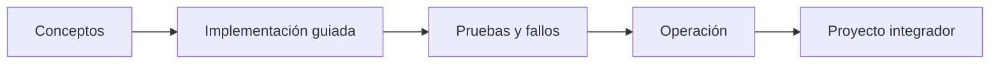

# Parte 16 — Redes cloud avanzadas, conectividad híbrida y edge

> [← Parte 15](../part-15-systems-architecture-engineering/README.md) · [Índice completo](../README.md) · [Parte 17 →](../part-17-aws-production-architecture/README.md)

**Nivel:** avanzado · **Clases:** 12 · **Duración sugerida:** 6–8 semanas

Diseñar conectividad segura y observable entre regiones, proveedores, centros de datos y edge.

## Resultados de la parte

Al completar esta parte podrás explicar el dominio con lenguaje independiente del proveedor,
implementar sus mecanismos esenciales, diagnosticar fallos y defender decisiones mediante
evidencia, costo, seguridad y objetivos de confiabilidad.

## Modelo mental

La red cloud es un sistema distribuido de rutas, identidades y políticas; cada salto añade latencia, costo y una frontera de fallo.

## Secuencia

## Clases

| ID | Clase | Laboratorio | Horas |
|---:|---|---|---:|
| 193 | [CIDR, subnetting y planificación IP a escala](193-cidr-subnetting-y-planificacion-ip-a-escala/README.md) | `network` | 4 |
| 194 | [Routing, BGP, tránsito y propagación de rutas](194-routing-bgp-transito-y-propagacion-de-rutas/README.md) | `network` | 4 |
| 195 | [DNS autoritativo, recursivo, split-horizon y DNSSEC](195-dns-autoritativo-recursivo-split-horizon-y-dnssec/README.md) | `network` | 4 |
| 196 | [Balanceo L4/L7, proxies, TLS y gestión de certificados](196-balanceo-l4-l7-proxies-tls-y-gestion-de-certificados/README.md) | `network` | 4 |
| 197 | [CDN, caché, origin shielding y edge compute](197-cdn-cache-origin-shielding-y-edge-compute/README.md) | `performance` | 4 |
| 198 | [VPN, Direct Connect, ExpressRoute e Interconnect](198-vpn-direct-connect-expressroute-e-interconnect/README.md) | `network` | 4 |
| 199 | [Transit Gateway, Virtual WAN y Network Connectivity Center](199-transit-gateway-virtual-wan-y-network-connectivity-center/README.md) | `network` | 4 |
| 200 | [Private endpoints, service networking y egress control](200-private-endpoints-service-networking-y-egress-control/README.md) | `security` | 4 |
| 201 | [Service mesh, mTLS y gestión de tráfico este-oeste](201-service-mesh-mtls-y-gestion-de-trafico-este-oeste/README.md) | `network` | 4 |
| 202 | [eBPF, flow logs, packet capture y diagnóstico](202-ebpf-flow-logs-packet-capture-y-diagnostico/README.md) | `observability` | 4 |
| 203 | [SD-WAN, 5G, IoT y operación desconectada](203-sd-wan-5g-iot-y-operacion-desconectada/README.md) | `architecture` | 4 |
| 204 | [Proyecto: red multi-región y multi-cloud](204-proyecto-red-multi-region-y-multi-cloud/README.md) | `capstone` | 8 |

## Evaluación de la parte

- 35 % laboratorios y evidencia reproducible.
- 25 % retos verificables.
- 20 % decisiones y ADR.
- 10 % seguridad, confiabilidad y costo.
- 10 % proyecto integrador de la parte.

Se aprueba con 80 % de clases en nivel B o superior y el proyecto integrador reproducible.

## Pauta bibliográfica

- Computer Networking: A Top-Down Approach — Kurose y Ross.
- Cloud Native Data Center Networking — Dinesh Dutt.
- AWS Advanced Networking Study Guide — S. Mahalingam.
