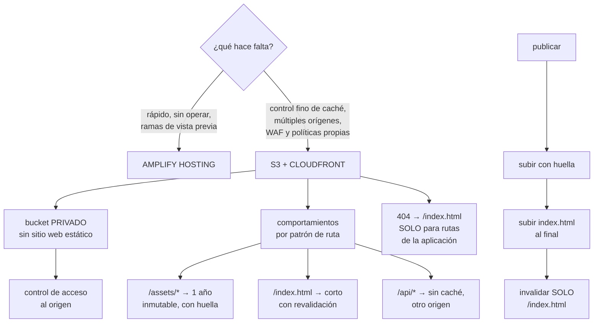

# 205 — Hosting progresivo con Amplify, S3 y CloudFront

> [← Clase anterior](../../part-16-advanced-cloud-networking-edge/204-proyecto-red-multi-region-y-multi-cloud/README.md) · [Índice de la parte](../README.md) · [Clase siguiente →](../../part-17-aws-production-architecture/206-oidc-de-github-y-gitlab-hacia-aws-sin-secretos/README.md)

**Parte:** 17 — AWS: arquitectura, automatización y operación en producción<br>
**Nivel:** avanzado · **Horas estimadas:** 4<br>
**Laboratorio:** `delivery` · **Estado:** `EXECUTABLE_CORE`

## 🎯 Propósito

Publicar una aplicación web en AWS eligiendo entre el camino gestionado y el montado a mano, y entender qué se gana y qué se pierde con cada uno. La clase compara Amplify Hosting con el montaje S3 + CloudFront pieza a pieza, fija los valores por defecto que hay que cambiar para producción —que son más de los que parece—, y trata los tres asuntos que rompen estos despliegues: el enrutado de aplicaciones de una sola página, la invalidación de caché en cada publicación y el acceso al bucket.

## 📚 Resultados de aprendizaje

Al finalizar podrás:

1. **Elegir** entre alojamiento gestionado y montaje propio con criterios claros.
2. **Configurar** S3 y CloudFront con los valores correctos para producción.
3. **Resolver** el enrutado de una aplicación de una sola página sin romper los 404 reales.
4. **Publicar** sin invalidaciones masivas, usando huellas en los nombres.
5. **Cerrar** el acceso al origen para que solo la distribución pueda leerlo.

## 🧩 Conceptos centrales

| Concepto | Comprensión verificable |
|---|---|
| `Amplify Hosting` | Servicio gestionado que construye y publica una aplicación web desde un repositorio, con distribución incluida. |
| `distribución` | Recurso de CloudFront que sirve el contenido desde el borde y define caché, orígenes y comportamiento. |
| `control de acceso al origen` | Mecanismo por el que solo la distribución puede leer el bucket, que queda privado. |
| `comportamiento de caché` | Regla por patrón de ruta que fija clave de caché, validez y política de origen. |
| `función de borde` | Código ligero que se ejecuta en el borde para reescribir peticiones o añadir cabeceras. |
| `huella en el nombre` | Sufijo derivado del contenido que hace innecesaria la invalidación al publicar. |

## 🧠 Modelo mental

AWS se aprende como una progresión operativa: identidad federada, infraestructura declarativa, entrega, señales, recuperación y costo controlado.

Aplicado a esta clase, separa siempre cuatro planos: **intención** (qué necesita el usuario),
**configuración** (qué declaramos), **estado observado** (qué existe de verdad) y
**evidencia** (cómo sabemos que cumple). Confundirlos produce diseños que se ven correctos
en un diagrama pero fallan al operar.

## 🗺️ Flujo de razonamiento



## 📖 Desarrollo

### 1. Gestionado o montado a mano

Las dos opciones sirven para lo mismo y se diferencian en control y en operación.

```text
AMPLIFY HOSTING
  construye desde el repositorio y publica
  da   ramas de vista previa por cada propuesta de cambio
       certificado y dominio gestionados
       reversión a una publicación anterior
       reescrituras y redirecciones por configuración
       distribución por debajo, sin gestionarla
  no da
       control fino de la clave de caché por ruta
       comportamientos con orígenes distintos
       políticas de origen propias
       WAF con reglas propias en muchos casos
       acceso a los registros de la distribución

S3 + CLOUDFRONT MONTADO
  da   control total: comportamientos, claves, políticas,
       WAF, registros, varios orígenes
  cuesta
       montarlo y mantenerlo
       y aprender los valores por defecto que hay que cambiar
```

Y el criterio:

```text
¿el sitio es estático o casi, y no hay requisitos de caché
 ni de seguridad especiales?
  → Amplify; se monta en una tarde y se opera solo

¿hay API en el mismo dominio, varias rutas con caché
 distinta, WAF propio o necesidad de registros?
  → S3 + CloudFront

¿el equipo ya opera CloudFront para otras cosas?
  → montarlo, por coherencia
```

Y una vía intermedia que funciona bien:

```text
Amplify para las ramas de vista previa (donde su valor es
mayor y los requisitos son bajos)
S3 + CloudFront para producción
→ y así se tiene rapidez donde importa la velocidad y
  control donde importa el control
```

Y la advertencia de coste que aparece con Amplify:

```text
factura por minuto de construcción y por gigabyte servido
→ con muchas ramas de vista previa y construcciones
  frecuentes, la partida de construcción sube deprisa
→ y las vistas previa no caducan solas               ley 25
```

### 2. Los valores por defecto que hay que cambiar

Montar S3 + CloudFront con los valores por defecto produce algo que funciona y no es apto para producción. Esta es la lista.

```text
EL BUCKET
  ✗ por defecto   se tiende a activar «alojamiento de sitio
                  web estático» y hacerlo público
  ✓ correcto      bucket PRIVADO, sin alojamiento estático,
                  accesible solo por control de acceso al
                  origen desde la distribución
  por qué         un bucket público es alcanzable saltándose
                  la distribución: sin WAF, sin registros,
                  sin caché y pagando salida  clases 189, 200

  ✓ además        bloqueo de acceso público activado
  ✓               cifrado en reposo
  ✓               versionado, para poder revertir una
                  publicación

LA DISTRIBUCIÓN
  ✗ por defecto   política de caché heredada que reenvía
                  cabeceras y cookies innecesarias
  ✓ correcto      política que NO incluye cookies ni
                  cabeceras salvo las que varían   clase 197

  ✗ por defecto   un solo comportamiento para todo
  ✓ correcto      comportamientos por patrón de ruta

  ✗ por defecto   HTTP permitido
  ✓ correcto      redirección a HTTPS y versión mínima de TLS

  ✗ por defecto   sin cabeceras de seguridad
  ✓ correcto      política de cabeceras de respuesta

  ✗ por defecto   sin compresión negociada en algunos casos
  ✓ correcto      compresión activada

  ✗ por defecto   registros desactivados
  ✓ correcto      registros a un bucket propio, con caducidad
```

Y los comportamientos que hay que definir, con sus valores:

```text
/assets/*   o /_next/static/*  (recursos con huella)
  validez           1 año, inmutable
  clave de caché    solo la ruta
  → nunca se invalidan: cambian de nombre       clase 197

/index.html  y las rutas de la aplicación
  validez           0 o muy corta, con revalidación
  → es el único fichero que hay que invalidar al publicar

/api/*
  otro origen (API Gateway o balanceador)
  sin caché, reenviando las cabeceras necesarias
  → tener la API en el mismo dominio evita CORS y cookies
    de terceros

/media/*  (imágenes subidas)
  validez media, con nombre versionado si se pueden
  reemplazar
```

Y una decisión de arquitectura que ahorra problemas:

```text
servir la aplicación y la API bajo el MISMO dominio, con
comportamientos distintos
→ sin CORS, sin cookies de terceros y con una sola
  distribución que registrar y proteger
```

### 3. Las tres cosas que rompen

**1 · El enrutado de una aplicación de una sola página.**

```text
EL PROBLEMA
  la aplicación tiene rutas como /pedidos/4471
  ese objeto NO existe en el bucket
  → S3 devuelve 404 y el usuario ve un error al recargar o
    al entrar por un enlace directo

LA SOLUCIÓN HABITUAL, Y SU DEFECTO
  configurar «404 → /index.html con código 200»
  funciona… y convierte TODOS los 404 en 200
  → incluidos los de recursos que faltan de verdad
  → los buscadores indexan páginas inexistentes
  → y los errores de despliegue se vuelven invisibles
                                                   ley 13

LA SOLUCIÓN CORRECTA
  una función de borde que reescribe la petición a
  /index.html SOLO si la ruta no tiene extensión de fichero
  → /pedidos/4471   → index.html, 200
  → /assets/x.js    → 404 real si no existe
  → y para rutas conocidas de la aplicación, mejor aún:
    lista explícita
```

**2 · La invalidación en cada publicación.**

```text
EL ANTIPATRÓN
  publicar y ejecutar «invalidar /*»
  → tira toda la caché en cada despliegue
  → avalancha contra el origen                   clase 197
  → y por encima de cierto número, las invalidaciones se
    facturan

EL PATRÓN CORRECTO
  1  construir con huella en el nombre de cada recurso
     app.7f3a91.js, estilos.2b91cd.css
  2  subir los recursos nuevos PRIMERO
  3  subir index.html AL FINAL
     → así nunca hay un index que apunte a algo que aún no
       está
  4  invalidar SOLO /index.html (y las rutas HTML)
  5  no borrar los recursos antiguos de inmediato
     → los usuarios con la página abierta siguen pidiéndolos
     → borrarlos con una regla de caducidad de 30 días
```

Y el fallo clásico que evita el paso 5:

```text
publicar y borrar lo antiguo a la vez
→ quien tenía la aplicación abierta pide un recurso que ya
  no existe y la página se rompe hasta recargar
```

**3 · El acceso al bucket.**

```text
CON CONTROL DE ACCESO AL ORIGEN
  la distribución firma sus peticiones al bucket
  la política del bucket permite SOLO a esa distribución
  el bucket no tiene acceso público
  → y el contenido solo se puede obtener por la
    distribución, con su WAF, sus registros y su caché

LO QUE HAY QUE COMPROBAR, NO SUPONER
  intentar leer un objeto directamente por la URL del bucket
  → debe fallar                                     ley 22
```

Y el fallo de configuración que deja el hueco:

```text
dejar activado el alojamiento de sitio web estático del
bucket «por si acaso»
→ expone un punto de entrada alternativo, público y sin
  control                                        clase 189
```

### 4. Publicar y operar

**La canalización de publicación**, que debe hacer lo mismo siempre:

```text
1  construir, con huella en los nombres
2  autenticarse sin secretos                       clase 206
3  subir recursos nuevos
4  subir HTML
5  invalidar solo HTML
6  comprobar que el sitio responde y sirve la versión nueva
7  y si no, revertir
```

Y la reversión, que hay que tener resuelta antes de necesitarla:

```text
con versionado del bucket y huellas
  revertir = volver a subir el index.html anterior e
  invalidarlo
  → los recursos antiguos siguen ahí (por eso no se borran)
  → tiempo de reversión: segundos

sin huellas ni versionado
  → reconstruir y volver a publicar: minutos u horas
```

**Lo que hay que vigilar:**

```text
tasa de aciertos por comportamiento, no global  clase 197
errores 4xx y 5xx desde el origen
bytes servidos desde el borde y desde el origen
latencia en el borde, por región
certificado: días hasta caducar y días desde la renovación
                                                clase 196
y el coste: peticiones, transferencia e invalidaciones
```

Y dos alertas que evitan sorpresas:

```text
«la tasa de aciertos ha caído más de 10 puntos»
  → suele significar que alguien cambió la clave de caché
    o que se está invalidando de más

«hay peticiones directas al bucket»
  → si el control de acceso al origen está bien, deben ser
    cero; cualquier cosa distinta es un hueco
```

Y una nota sobre el dominio y el certificado:

```text
el certificado de una distribución de CloudFront debe estar
en la región us-east-1, independientemente de dónde esté
todo lo demás
→ es una de esas particularidades que cuestan una tarde la
  primera vez
```

Y la lista de comprobación de la clase:

```text
☐ la elección entre gestionado y montado está justificada
☐ el bucket es privado y sin alojamiento estático activado
☐ el acceso solo es posible por la distribución, comprobado
☐ hay bloqueo de acceso público y versionado
☐ hay comportamientos por patrón de ruta
☐ la clave de caché no incluye cookies ni cabeceras
  innecesarias
☐ los recursos llevan huella y validez de un año
☐ el HTML tiene validez corta
☐ el enrutado de la aplicación no convierte todos los 404
  en 200
☐ la publicación sube HTML al final e invalida solo HTML
☐ los recursos antiguos caducan a 30 días, no se borran
☐ hay redirección a HTTPS y cabeceras de seguridad
☐ los registros están activados con caducidad
☐ la reversión está probada y tarda segundos
☐ hay alerta si aparecen peticiones directas al bucket
```

Y el cierre que enlaza con la clase siguiente: la canalización que publica necesita permisos en AWS, y el modo habitual de dárselos —una clave de acceso guardada como secreto— es exactamente lo que este programa lleva desaconsejando desde la parte 11. Federación desde el repositorio, sin secretos, es la materia de la clase 206.

## 🔬 Ejemplo trabajado

**CloudShop publica su tienda web. Lo que sigue es la comparación de las dos opciones con cifras, el montaje que eligieron, y los tres problemas que aparecieron —dos de ellos por valores por defecto.**

**La comparación, hecha con datos:**

```text
requisitos
  la tienda y la API deben estar bajo el mismo dominio
  WAF con reglas propias                          clase 209
  registros de la distribución para análisis de coste
  caché distinta por ruta: 4 comportamientos
  ramas de vista previa para cada propuesta de cambio

Amplify
  cubre    ramas de vista previa, certificado, reversión
  no cubre WAF propio, registros, comportamientos por ruta
           y otro origen para /api/*

decisión
  producción            S3 + CloudFront montado
  vistas previa         Amplify, con caducidad automática a
                        los 14 días
  motivo de la caducidad   las ramas de vista previa no se
                        borran solas y facturan       ley 25
```

**El montaje.**

```text
bucket
  privado, sin alojamiento estático
  bloqueo de acceso público activado
  versionado activado
  cifrado con clave gestionada
  regla de caducidad: versiones antiguas a 30 días

distribución
  origen 1   el bucket, con control de acceso al origen
  origen 2   API Gateway, para /api/*             clase 207
  TLS mínimo 1.2, redirección a HTTPS
  compresión activada
  registros a un bucket propio, caducidad de 90 días
  WAF asociado                                    clase 209

comportamientos
  /assets/*      caché 1 año, inmutable; clave = ruta
  /media/*       caché 7 días; clave = ruta
  /api/*         sin caché; origen 2; reenvía
                 Authorization y Content-Type
  por defecto    caché 0 con revalidación; función de borde
                 de enrutado
```

**Problema 1 · Todos los 404 devolvían 200.**

```text
montaje inicial
  página de error personalizada: 404 → /index.html con 200
  funcionaba: las rutas de la aplicación cargaban bien

lo que se descubrió tres semanas después
  · un despliegue subió el HTML sin uno de los recursos
    el navegador pidió /assets/app.9c2f1a.js
    la distribución devolvió index.html con código 200
    el navegador intentó ejecutar HTML como JavaScript
    → pantalla en blanco, sin ningún error en los paneles
    → la tasa de errores era del 0 %                ley 13

  · el buscador había indexado 1.900 rutas inexistentes
    generadas por enlaces rotos de una campaña

corrección
  función de borde con esta lógica
    si la ruta contiene un punto (tiene extensión) → pasa
      tal cual; si no existe, 404 real
    si no → reescribe a /index.html, código 200

  y una alerta nueva
    «peticiones a /assets/* que devuelven 404»
    → habría detectado el despliegue incompleto en 30 s
```

**Problema 2 · La invalidación masiva en cada publicación.**

```text
la canalización hacía
  aws s3 sync ... --delete
  aws cloudfront create-invalidation --paths "/*"

efectos medidos
  tasa de aciertos tras cada publicación   97 % → 12 %
  tiempo en recuperarla                    ~40 min
  peticiones al origen en ese periodo      ×31
  y dos veces, con despliegues en hora punta, el origen se
    saturó                                       clase 197
  invalidaciones facturadas al mes         1.100 rutas

y el efecto del --delete
  los recursos antiguos se borraban al publicar
  → quien tenía la tienda abierta veía la página romperse
  → 3 incidentes reportados por atención al cliente,
    clasificados como «error del navegador»

corrección
  construcción con huella en todos los recursos
  publicación en tres pasos
    1  subir /assets/* nuevos (sin borrar)
    2  subir HTML
    3  invalidar solo /index.html y /
  recursos antiguos: regla de caducidad a 30 días

resultado
  tasa de aciertos tras publicar    97 % → 96,4 %
  invalidaciones al mes             1.100 → 62
  incidentes por publicación             3 → 0
  tiempo de publicación             4 min → 1 min
```

**Problema 3 · El bucket seguía siendo alcanzable.**

```text
la prueba negativa, ejecutada en la revisión de seguridad
  pedir un objeto por la URL directa del bucket
  → FUNCIONÓ

causa
  el alojamiento de sitio web estático se había activado
  durante el montaje inicial y no se desactivó
  la política del bucket tenía una regla antigua que
  permitía lectura pública, añadida «para probar»  ley 25

qué implicaba
  se podía descargar todo el contenido saltándose
    el WAF
    los registros
    la caché → pagando salida a precio de S3   clase 200
  y en los registros del bucket aparecían 41.000 peticiones
    al mes por esa vía, de rastreadores

corrección
  alojamiento estático desactivado
  política del bucket reducida al control de acceso al
    origen
  bloqueo de acceso público activado
  alerta: «peticiones directas al bucket > 0»
  y la prueba negativa añadida al calendario trimestral
```

**La reversión, probada:**

```text
ensayo
  publicar una versión con un fallo evidente
  revertir subiendo el index.html anterior desde el
  versionado e invalidándolo

  tiempo medido                          38 s
  recursos antiguos disponibles          sí (no se borran)
  usuarios afectados durante la reversión  los que cargaron
                                         en esos 38 s
```

**El resultado, tres meses después:**

```text                                        antes     después
tasa de aciertos en régimen                 97 %       97,4 %
tasa de aciertos tras publicar              12 %       96,4 %
invalidaciones al mes                      1.100          62
peticiones directas al bucket            41.000/mes        0
404 reales que se veían como 200            todos          0
tiempo de reversión                     reconstruir      38 s
incidentes por publicación                   3/trim         0
coste mensual de la distribución         1.240 €       890 €
```

**La lección que esta clase deja**: dos de los tres problemas venían de **valores por defecto que funcionaban**: convertir los 404 en 200 hacía que las rutas de la aplicación cargasen, y el alojamiento estático del bucket hacía que el contenido se sirviera. Los dos escondían algo: un despliegue incompleto que no generaba ningún error y cuarenta y un mil peticiones al mes por un camino sin WAF ni registros. Y el tercero —invalidar todo en cada publicación— **costaba cuarenta minutos de caché fría por despliegue** y se resolvió cambiando el orden de tres comandos.

## 🧪 Laboratorio guiado

Ejecuta desde la raíz:

```bash
python classes/part-17-aws-production-architecture/205-hosting-progresivo-con-amplify-s3-y-cloudfront/lab.py
```

El laboratorio selecciona el motor de práctica **`delivery`** y produce
`lab_result.json`. El escenario, sus comprobaciones y el artefacto esperado corresponden a
esta clase; no requiere credenciales y deja explícito qué debe revalidarse en un sandbox real.

1. Lee `exercise.steps` y formula una predicción antes de ejecutar.
2. Ejecuta la práctica y verifica todos los elementos de `checks`.
3. Provoca el caso de `negative_test` y explica la señal observada.
4. Materializa `aws-static-platform` en `evidence/` usando la plantilla indicada.
5. Para proveedor real, sigue `sandbox.requires`, registra costo y ejecuta `destroy`.

### Evidencia esperada

El artefacto principal es un pipeline con gates, promoción y rollback. Además, la entrega debe incluir el comando ejecutado,
la salida estructurada y una conclusión que no exceda lo observado.

## 🏆 Reto verificable

Construye **`aws-static-platform`** para el caso CloudShop. Incluye una alternativa descartada,
un supuesto que pueda falsarse, una prueba de fallo y una decisión de rollback.

## ✅ Criterio de aceptación

- [ ] `lab.py` termina con código 0 y genera JSON válido.
- [ ] La entrega conecta al menos tres requisitos con mecanismos verificables.
- [ ] Existe una prueba positiva y una prueba negativa con evidencia.
- [ ] Seguridad, costo y operación aparecen como decisiones, no como anexos.
- [ ] Se declara una limitación y una condición que obligaría a revisar el diseño.
- [ ] Otra persona puede repetir el recorrido sin conocimiento tácito.

## ⚠️ Errores frecuentes

| Síntoma | Causa probable | Corrección |
|---|---|---|
| Los errores 404 reales se ven como respuestas correctas | La página de error personalizada convierte todos los 404 en 200 con index.html | Reescribe a index.html solo las rutas sin extensión, con una función de borde, y alerta sobre 404 en recursos. |
| La tasa de aciertos se hunde tras cada publicación | Se invalida con comodín en cada despliegue | Construye con huella en los nombres, sube el HTML al final e invalida solo el HTML. |
| La página se rompe para quien la tenía abierta al publicar | Se borran los recursos antiguos al sincronizar | No borres al publicar; retira los recursos viejos con una regla de caducidad a 30 días. |
| Se puede descargar el contenido saltándose la distribución | El bucket tiene alojamiento estático o una política pública heredada de las pruebas | Bucket privado con control de acceso al origen, bloqueo de acceso público, y prueba negativa que compruebe que la URL directa falla. |
| La factura de construcción sube sin control | Las ramas de vista previa no caducan y siguen construyendo | Pon caducidad automática a las vistas previa; lo provisional sin fecha se queda para siempre. |
| El certificado no se puede asociar a la distribución | Se emitió en una región distinta de us-east-1 | Emite el certificado de una distribución de CloudFront en us-east-1, aunque el resto del sistema esté en otra región. |

## 🛡️ Seguridad, ética y costo

Trabaja con cuentas propias o sandboxes autorizados. No publiques secretos, identificadores
reales ni datos personales. Antes de crear recursos pagos define presupuesto, etiquetas y
comando de destrucción; después verifica que no queden recursos huérfanos. Los ejemplos
locales enseñan contratos, pero no certifican cumplimiento ni disponibilidad de producción.

## ❓ Preguntas de comprobación

1. ¿En qué casos compensa el alojamiento gestionado y en cuáles el montaje propio?
2. ¿Qué valores por defecto del bucket y de la distribución hay que cambiar para producción?
3. ¿Cuál es el defecto de resolver el enrutado con la página de error 404?
4. ¿Qué cinco pasos evitan invalidar la caché entera en cada publicación?
5. ¿Qué prueba negativa comprueba que el bucket está realmente cerrado?

## 🔗 Referencias

- AWS (2025). *Amplify Hosting user guide*. <https://docs.aws.amazon.com/amplify/latest/userguide/welcome.html>
- AWS (2025). *Restricting access to an Amazon S3 origin (origin access control)*. <https://docs.aws.amazon.com/AmazonCloudFront/latest/DeveloperGuide/private-content-restricting-access-to-s3.html>
- AWS (2025). *CloudFront cache policies and cache key*. <https://docs.aws.amazon.com/AmazonCloudFront/latest/DeveloperGuide/controlling-the-cache-key.html>
- AWS (2025). *CloudFront Functions*. <https://docs.aws.amazon.com/AmazonCloudFront/latest/DeveloperGuide/cloudfront-functions.html>
- AWS (2025). *Blocking public access to your Amazon S3 storage*. <https://docs.aws.amazon.com/AmazonS3/latest/userguide/access-control-block-public-access.html>
- Documentación oficial vigente del servicio implementado; registra URL y fecha de consulta.

---

> [Evaluación](assessment.md) · [Contrato de clase](lesson.yaml) · [Índice de la parte](../README.md)
