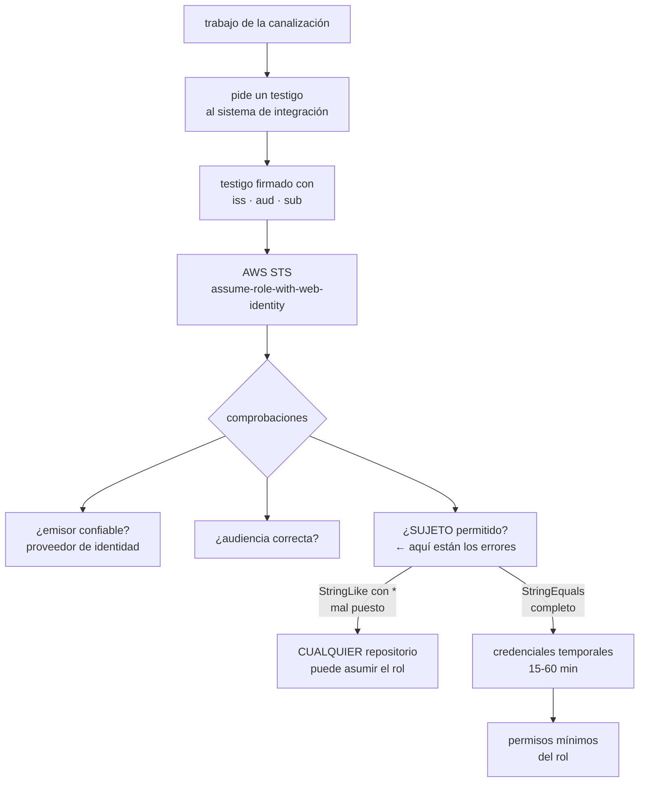

# 206 — OIDC de GitHub y GitLab hacia AWS sin secretos

> [← Clase anterior](../../part-17-aws-production-architecture/205-hosting-progresivo-con-amplify-s3-y-cloudfront/README.md) · [Índice de la parte](../README.md) · [Clase siguiente →](../../part-17-aws-production-architecture/207-sam-lambda-api-gateway-y-despliegue-serverless/README.md)

**Parte:** 17 — AWS: arquitectura, automatización y operación en producción<br>
**Nivel:** avanzado · **Horas estimadas:** 4<br>
**Laboratorio:** `iam` · **Estado:** `EXECUTABLE_CORE`

## 🎯 Propósito

Eliminar las claves de acceso de larga duración de las canalizaciones, sustituyéndolas por federación con testigos de corta vida. La clase explica el mecanismo pieza a pieza —proveedor de identidad, condiciones de confianza, testigo y rol—, insiste en la parte donde se cometen los errores graves (**la condición de sujeto mal escrita permite que cualquier repositorio del mundo asuma tu rol**), y aborda la migración de decenas de canalizaciones sin romperlas.

## 📚 Resultados de aprendizaje

Al finalizar podrás:

1. **Explicar** el intercambio de testigo por credenciales temporales.
2. **Configurar** el proveedor de identidad y la política de confianza correctamente.
3. **Escribir** condiciones de sujeto que no dejen huecos.
4. **Migrar** canalizaciones existentes sin interrumpirlas.
5. **Verificar** con pruebas negativas que nadie más puede asumir el rol.

## 🧩 Conceptos centrales

| Concepto | Comprensión verificable |
|---|---|
| `federación por identidad de carga` | Intercambiar un testigo firmado por el sistema de integración por credenciales temporales del proveedor de nube. |
| `proveedor de identidad` | Recurso que declara en qué emisor se confía y con qué audiencia. |
| `política de confianza` | Regla del rol que dice quién puede asumirlo y bajo qué condiciones. |
| `sujeto` | Campo del testigo que identifica el repositorio, la rama, el entorno o la etiqueta que solicita el acceso. |
| `audiencia` | Destinatario declarado del testigo. Evita que un testigo emitido para otro servicio sirva aquí. |
| `entorno protegido` | Mecanismo del sistema de integración que exige aprobación antes de que un trabajo obtenga el testigo. |

## 🧠 Modelo mental

AWS se aprende como una progresión operativa: identidad federada, infraestructura declarativa, entrega, señales, recuperación y costo controlado.

Aplicado a esta clase, separa siempre cuatro planos: **intención** (qué necesita el usuario),
**configuración** (qué declaramos), **estado observado** (qué existe de verdad) y
**evidencia** (cómo sabemos que cumple). Confundirlos produce diseños que se ven correctos
en un diagrama pero fallan al operar.

## 🗺️ Flujo de razonamiento



## 📖 Desarrollo

### 1. Cómo funciona el intercambio

El mecanismo tiene cuatro piezas y conviene entenderlas antes de configurarlas.

```text
1  EL SISTEMA DE INTEGRACIÓN EMITE UN TESTIGO
   firmado por él, con vida de minutos, que dice
     iss   quién lo emite (el servicio de integración)
     aud   para quién es
     sub   QUIÉN lo pide: organización, repositorio, rama,
           entorno o etiqueta
     y otros campos: rama, flujo de trabajo, ejecutor…

2  AWS TIENE DECLARADO UN PROVEEDOR DE IDENTIDAD
   que dice «confío en los testigos firmados por este
   emisor, con esta audiencia»

3  EL ROL TIENE UNA POLÍTICA DE CONFIANZA
   que dice «pueden asumirme los testigos de ese proveedor
   cuyo sujeto cumpla ESTAS condiciones»

4  EL TRABAJO INTERCAMBIA testigo por credenciales
   temporales, de 15 a 60 minutos, con los permisos del rol
```

Y lo que se gana, que es lo que justifica la migración:

```text
sin claves de acceso guardadas como secretos
  → no hay nada que robar del repositorio
  → no hay nada que rotar                          clase 159
  → si el repositorio se compromete, el atacante necesita
    además cumplir las condiciones del sujeto
credenciales de minutos, no de años
y cada uso queda registrado con el sujeto que lo pidió
  → auditoría atribuible                          clase 141
```

Y una comparación con lo que sustituye:

```text
CLAVE DE ACCESO GUARDADA COMO SECRETO
  vive años
  sirve desde cualquier sitio del mundo
  se copia con un simple volcado de variables de entorno
  y su rotación es un procedimiento manual que nadie hace
                                                    ley 22

→ en la clase 179, cuatro servicios compartían una clave
  estática de tres años
```

Y el ámbito de aplicación, que es más amplio de lo que suele usarse:

```text
el mismo mecanismo sirve para
  GitHub Actions y GitLab CI hacia AWS
  y también hacia Azure y Google Cloud
  cargas en Kubernetes hacia AWS                  clase 213
  y cualquier emisor que firme testigos con el formato
    estándar
```

### 2. Donde se cometen los errores graves

La configuración es corta y tiene un punto donde un error convierte el mecanismo en algo peor que una clave estática.

```text
LA CONDICIÓN DE SUJETO

  ✗ CATASTRÓFICO
    "StringLike": { "...:sub": "*" }
    → CUALQUIER repositorio de CUALQUIER organización del
      mundo puede asumir tu rol
    → basta con que alguien sepa el nombre del rol

  ✗ MUY MALO
    "StringLike": { "...:sub": "repo:miorg/*" }
    → cualquier repositorio de tu organización, incluidos
      los que cree un becario
    → y si alguien puede crear un repositorio, puede
      desplegar en producción

  ✗ SUTIL Y FRECUENTE
    olvidar la condición de AUDIENCIA
    → un testigo emitido para otro servicio podría valer

  ✓ CORRECTO
    "StringEquals": {
      "...:aud": "<audiencia declarada>",
      "...:sub": "repo:miorg/mirepo:environment:produccion"
    }
    → un repositorio, un entorno, exacto
```

Y las formas de sujeto que conviene conocer:

```text
repo:org/repo:ref:refs/heads/main       una rama concreta
repo:org/repo:environment:produccion    un entorno protegido
repo:org/repo:ref:refs/tags/v*          etiquetas (con
                                        StringLike, y con
                                        cuidado)
repo:org/repo:pull_request              propuestas de cambio
                                        ← NUNCA para producción
```

Y la última merece énfasis:

```text
una propuesta de cambio la puede abrir cualquiera desde una
bifurcación
→ dar permisos de producción a ese sujeto equivale a dar
  permisos de producción a cualquiera
→ los trabajos de propuesta de cambio usan un rol de solo
  lectura, y nada más
```

**El entorno protegido**, que es la pieza que casi nadie usa y la que más aporta:

```text
un entorno del sistema de integración puede exigir
  aprobación manual de personas concretas
  que la rama sea una determinada
  una espera mínima

y el testigo incluye el nombre del entorno en el sujeto
→ atar el rol de producción al entorno «produccion»
  significa que ningún flujo puede obtenerlo sin pasar por
  la aprobación                                   clase 106
```

Y una comprobación que hay que hacer siempre:

```text
intenta asumir el rol desde
  otra rama                      → debe fallar
  otro repositorio               → debe fallar
  una bifurcación                → debe fallar
  un flujo sin el entorno        → debe fallar
→ y si alguna funciona, la condición está mal escrita
                                                   ley 22
```

### 3. Permisos del rol y separación

Quitar la clave estática no sirve de nada si el rol federado puede hacerlo todo.

```text
UN ROL POR PROPÓSITO, NO UNO QUE VALGA PARA CUALQUIER COSA
  rol de lectura           propuestas de cambio: validar,
                           planificar, analizar
  rol de despliegue de
    preproducción          escribir en preproducción
  rol de despliegue de
    producción             escribir en producción, atado al
                           entorno protegido
  rol de publicación de
    artefactos             subir imágenes al registro

→ y cada uno con permisos mínimos y con su condición de
  sujeto propia                                   clase 134
```

Y los permisos que **nunca** debe tener el rol de la canalización:

```text
modificar políticas de identidad o crear roles
  → si puede crear un rol con más permisos, tiene todos
desactivar el registro de auditoría
borrar copias de seguridad
modificar la propia política de confianza
  → podría ampliarse a sí mismo

→ estos permisos se ponen en una barrera de la organización,
  para que ni siquiera un administrador de la cuenta pueda
  concederlos                                     clase 169
```

Y dos controles que refuerzan:

```text
DURACIÓN MÍNIMA
  la sesión dura lo que dure el trabajo, no una hora por
  defecto

CONDICIONES ADICIONALES EN LA POLÍTICA DE PERMISOS
  restringir por región
  restringir por etiqueta de recurso
  exigir que la petición venga de la sesión federada, no de
    una credencial cualquiera
```

Y una decisión de arquitectura sobre cuentas:

```text
el rol de producción vive en la CUENTA de producción
la canalización no tiene ningún acceso permanente a esa
cuenta
→ y el paso de producción está en un flujo separado, con
  entorno protegido
→ así el compromiso del repositorio no da acceso a
  producción sin una aprobación humana        clases 108, 189
```

### 4. Migrar sin romper

Migrar decenas de canalizaciones a la vez es donde se rompen las cosas. El patrón es el de expandir y contraer.

```text
1  CREAR el proveedor de identidad y los roles, con
   condiciones estrictas
   → sin tocar nada de lo existente

2  MIGRAR UNA canalización poco crítica
   y comprobar que funciona y que las pruebas negativas
   fallan como deben

3  MIGRAR EL RESTO por lotes
   las claves antiguas SIGUEN existiendo

4  MEDIR EL USO de cada clave antigua
   → una clave sin uso durante N días es candidata a
     desactivar
   → y las que siguen usándose revelan canalizaciones que
     nadie sabía que existían

5  DESACTIVAR, no borrar, y esperar
   → si algo se rompe, se reactiva en segundos

6  BORRAR, y con ellas los secretos del repositorio
```

Y el paso 4 es el que descubre cosas:

```text
el informe de credenciales y los registros de acceso dicen
  qué claves existen, cuándo se usaron por última vez y
  desde dónde
→ las claves sin uso en 90 días son riesgo puro
→ y las que se usan desde direcciones inesperadas son otra
  cosa                                            clase 141
```

**Lo que hay que vigilar** una vez migrado:

```text
usos del rol federado, con el sujeto que lo pidió
intentos de asunción DENEGADOS
  → un aumento significa que alguien está probando
claves de acceso de larga duración que existan todavía
  → función de aptitud: cero permitidas            clase 190
cambios en las políticas de confianza
  → auditar siempre; ampliar una condición es el camino
    para saltarse todo lo anterior
```

Y una limitación que hay que conocer:

```text
no todo se puede federar
  herramientas de terceros que solo aceptan clave y secreto
  sistemas antiguos
→ para esos, credenciales de rotación automática y ámbito
  mínimo, con fecha de revisión escrita             ley 25
```

Y la lista de comprobación de la clase:

```text
☐ existe el proveedor de identidad con la audiencia
  declarada
☐ ninguna condición de sujeto usa comodín amplio
☐ la condición de audiencia está presente
☐ producción está atada a un entorno protegido con
  aprobación
☐ las propuestas de cambio usan un rol de solo lectura
☐ hay un rol por propósito, con permisos mínimos
☐ ningún rol de canalización puede crear roles ni modificar
  su confianza
☐ la duración de la sesión es la del trabajo
☐ las pruebas negativas desde otra rama, repositorio y
  bifurcación fallan
☐ no queda ninguna clave de acceso de larga duración
☐ hay función de aptitud que lo comprueba
☐ se vigilan los intentos denegados y los cambios de
  confianza
```

Y el cierre que enlaza con la clase siguiente: con una canalización que puede desplegar sin secretos, queda desplegar algo. La aplicación sin servidores —funciones, pasarela de API y su definición como código— es la materia de la clase 207.

## 🔬 Ejemplo trabajado

**CloudShop migra 41 canalizaciones a federación. Lo que sigue es la condición de sujeto mal escrita que encontraron en la primera revisión, la migración por lotes, y las once claves que aparecieron al medir el uso.**

**El punto de partida:**

```text
canalizaciones                                        41
claves de acceso de larga duración en secretos        23
  antigüedad media                              2,1 años
  con permisos de administrador                        6
  compartidas entre varios repositorios                4
rotaciones realizadas en 3 años                        0
```

**El primer intento, y el fallo que encontró la revisión.**

```text
un equipo había migrado ya su canalización, en marzo
su política de confianza decía

  "Condition": {
    "StringLike": {
      "token.actions.githubusercontent.com:sub":
        "repo:cloudshop/*"
    }
  }

lo que eso permitía
  cualquier repositorio de la organización cloudshop podía
  asumir el rol
  → y ese rol tenía permisos de escritura en producción

y lo que lo hacía peor de lo que parecía
  crear un repositorio en la organización lo podía hacer
  cualquiera de los 214 miembros
  → cualquiera podía desplegar en producción creando un
    repositorio nuevo
  → sin aprobación, sin revisión, sin dejar rastro obvio

y faltaba además la condición de audiencia

la prueba negativa que lo demostró
  se creó un repositorio de prueba en la organización
  se escribió un flujo que asumía el rol
  → funcionó a la primera
  tiempo desde la idea hasta desplegar en producción: 6 min
```

Y el análisis:

```text
esta configuración era PEOR que la clave estática que
sustituía
  la clave, al menos, estaba en un secreto de un repositorio
  concreto
  esto era accesible desde cualquier repositorio nuevo
→ y se había revisado y aprobado, porque «quitaba el
  secreto»                                        clase 191
```

**La configuración corregida.**

```text
proveedor de identidad, uno por sistema de integración,
con la audiencia declarada

ROLES, uno por propósito

  cloudshop-ci-lectura
    sub   repo:cloudshop/tienda:pull_request
    aud   comprobada
    puede validar plantillas, planificar cambios, leer
          artefactos
    NO puede escribir nada

  cloudshop-ci-preproduccion
    sub   repo:cloudshop/tienda:ref:refs/heads/main
    puede desplegar en la cuenta de preproducción

  cloudshop-ci-produccion
    sub   repo:cloudshop/tienda:environment:produccion
    vive en la CUENTA de producción
    entorno protegido con aprobación de 2 personas de una
      lista, y espera mínima de 5 minutos
    permisos mínimos, restringidos por región y por etiqueta

  cloudshop-ci-artefactos
    sub   repo:cloudshop/tienda:ref:refs/heads/main
    puede subir al registro de imágenes, nada más

BARRERA DE ORGANIZACIÓN
  ningún rol de canalización puede
    crear o modificar roles
    modificar políticas de confianza
    desactivar el registro de auditoría
    borrar copias de seguridad
  → denegación explícita a nivel de organización, no de
    cuenta                                        clase 169
```

**Las pruebas negativas, ejecutadas tras corregir:**

```text
✓  asumir el rol de producción desde otra rama      denegado
✓  asumir desde otro repositorio de la organización denegado
✓  asumir desde una bifurcación externa             denegado
✓  asumir desde un flujo sin el entorno             denegado
✓  asumir con un testigo de otra audiencia          denegado
✗  el rol de preproducción podía leer un bucket de
   producción
   → una política heredada del rol antiguo permitía
     s3:GetObject sobre un comodín
   → corregido; y añadida condición de etiqueta de entorno
✓  el rol de artefactos intentando desplegar        denegado
✓  el rol de canalización creando un rol            denegado
   por la barrera
```

**La migración de las 41, por lotes.**

```text
semana 1     proveedor y roles creados; nada más tocado
semana 2     1 canalización interna, poco crítica
             pruebas negativas ejecutadas
semanas 3-6  32 canalizaciones, en lotes de 8
semanas 5-7  las 8 restantes, que eran las de producción
             → con entorno protegido, requirió coordinar
               aprobadores
semanas 7-11 MEDIR EL USO de las 23 claves antiguas
semana 12    desactivar (no borrar) las sin uso
semana 16    borrar y limpiar los secretos
```

**Lo que apareció al medir el uso de las claves antiguas:**

```text
claves sin uso en 30 días                             12
  → desactivadas sin incidencia

claves aún en uso                                     11
  de canalizaciones ya migradas (residuos)             3
    → un paso del flujo seguía usando la clave
  de canalizaciones que NO estaban en la lista de 41    8
    · un trabajo programado en una máquina de un equipo
      de datos
    · un script en el portátil de una persona, ejecutado a
      mano cada lunes para subir tarifas       ← clase 192
    · una herramienta de un proveedor externo
    · dos integraciones de sistemas antiguos
    · un sistema de despliegue que se creía retirado en 2023
    · dos usos que nadie pudo explicar

→ el inventario decía 41 canalizaciones
→ la realidad tenía 49                              ley 24
```

Y el tratamiento de los 8:

```text
5   migrados a federación o a roles asumidos desde la nube
2   no se pudieron federar (proveedor externo y sistema
    antiguo)
    → credenciales con rotación automática cada 30 días,
      permisos mínimos y fecha de revisión escrita   ley 25
1   se apagó: era el sistema de despliegue retirado
    → llevaba 2 años con credenciales de administrador
      válidas                                        ley 20
```

**El resultado:**

```text                                        antes     después
claves de acceso de larga duración            23           2
  con rotación automática                      0           2
  con permisos de administrador                6           0
roles con condición de sujeto amplia           1           0
entornos protegidos con aprobación             0           4
canalizaciones conocidas                      41          49
tiempo para que un miembro cualquiera
  despliegue en producción sin aprobación    6 min   imposible
intentos denegados registrados al mes         n/a          14
  → todos, flujos mal configurados tras un cambio de rama
```

Y la función de aptitud que lo mantiene:

```text
«cero claves de acceso de larga duración sin excepción
 registrada»
  excepciones vivas                                     2
  con dueño y fecha de revisión                         2
  → comprobado en cada cambio de infraestructura
                                                clase 190
```

**La lección que esta clase deja**: la primera migración **quitó el secreto y empeoró la seguridad**, porque una condición de sujeto con comodín permitía que cualquiera de doscientos catorce miembros desplegara en producción creando un repositorio. Se había revisado y aprobado. Y al medir el uso de las claves antiguas apareció lo de siempre: **ocho canalizaciones que no estaban en el inventario**, incluida una que llevaba dos años con credenciales de administrador para un sistema que se creía retirado.

## 🧪 Laboratorio guiado

Ejecuta desde la raíz:

```bash
python classes/part-17-aws-production-architecture/206-oidc-de-github-y-gitlab-hacia-aws-sin-secretos/lab.py
```

El laboratorio selecciona el motor de práctica **`iam`** y produce
`lab_result.json`. El escenario, sus comprobaciones y el artefacto esperado corresponden a
esta clase; no requiere credenciales y deja explícito qué debe revalidarse en un sandbox real.

1. Lee `exercise.steps` y formula una predicción antes de ejecutar.
2. Ejecuta la práctica y verifica todos los elementos de `checks`.
3. Provoca el caso de `negative_test` y explica la señal observada.
4. Materializa `aws-oidc-federation` en `evidence/` usando la plantilla indicada.
5. Para proveedor real, sigue `sandbox.requires`, registra costo y ejecuta `destroy`.

### Evidencia esperada

El artefacto principal es una matriz de acceso mínimo con prueba de denegación. Además, la entrega debe incluir el comando ejecutado,
la salida estructurada y una conclusión que no exceda lo observado.

## 🏆 Reto verificable

Construye **`aws-oidc-federation`** para el caso CloudShop. Incluye una alternativa descartada,
un supuesto que pueda falsarse, una prueba de fallo y una decisión de rollback.

## ✅ Criterio de aceptación

- [ ] `lab.py` termina con código 0 y genera JSON válido.
- [ ] La entrega conecta al menos tres requisitos con mecanismos verificables.
- [ ] Existe una prueba positiva y una prueba negativa con evidencia.
- [ ] Seguridad, costo y operación aparecen como decisiones, no como anexos.
- [ ] Se declara una limitación y una condición que obligaría a revisar el diseño.
- [ ] Otra persona puede repetir el recorrido sin conocimiento tácito.

## ⚠️ Errores frecuentes

| Síntoma | Causa probable | Corrección |
|---|---|---|
| Cualquiera de la organización puede desplegar en producción | La condición de sujeto usa un comodín sobre la organización o el repositorio | Usa comparación exacta con repositorio y entorno concretos, y añade siempre la condición de audiencia. |
| Un flujo de propuesta de cambio obtiene permisos de escritura | El sujeto de propuesta de cambio está permitido en un rol con escritura | Las propuestas de cambio solo asumen un rol de lectura; las bifurcaciones pueden abrirlas desde fuera. |
| El rol federado puede ampliarse a sí mismo | Tiene permisos para crear roles o modificar su política de confianza | Deniega esos permisos en una barrera de organización, no solo en la política del rol. |
| Quitar el secreto no mejoró nada | El rol federado conserva permisos amplios heredados del anterior | Un rol por propósito, con permisos mínimos y condiciones de región y etiqueta. |
| Al borrar las claves antiguas se rompen procesos desconocidos | Se borraron sin medir el uso previo | Mide el uso semanas, desactiva antes de borrar, y trata los usos inesperados como hallazgos de inventario. |
| Quedan credenciales estáticas que no se pueden federar | Herramientas de terceros o sistemas antiguos que solo aceptan clave y secreto | Rotación automática, ámbito mínimo y excepción registrada con dueño y fecha de revisión. |

## 🛡️ Seguridad, ética y costo

Trabaja con cuentas propias o sandboxes autorizados. No publiques secretos, identificadores
reales ni datos personales. Antes de crear recursos pagos define presupuesto, etiquetas y
comando de destrucción; después verifica que no queden recursos huérfanos. Los ejemplos
locales enseñan contratos, pero no certifican cumplimiento ni disponibilidad de producción.

## ❓ Preguntas de comprobación

1. ¿Qué cuatro piezas intervienen en el intercambio de testigo por credenciales?
2. ¿Por qué una condición de sujeto con comodín puede ser peor que una clave estática?
3. ¿Qué aporta atar el rol de producción a un entorno protegido?
4. ¿Qué permisos no debe tener nunca un rol de canalización y dónde se deniegan?
5. ¿Qué se descubre al medir el uso de las claves antiguas antes de borrarlas?

## 🔗 Referencias

- GitHub (2025). *About security hardening with OpenID Connect*. <https://docs.github.com/en/actions/deployment/security-hardening-your-deployments/about-security-hardening-with-openid-connect>
- GitHub (2025). *Configuring OpenID Connect in Amazon Web Services*. <https://docs.github.com/en/actions/deployment/security-hardening-your-deployments/configuring-openid-connect-in-amazon-web-services>
- GitLab (2025). *Connect to cloud services with OIDC*. <https://docs.gitlab.com/ee/ci/cloud_services/>
- AWS (2025). *Create an OpenID Connect identity provider in IAM*. <https://docs.aws.amazon.com/IAM/latest/UserGuide/id_roles_providers_create_oidc.html>
- AWS (2025). *AssumeRoleWithWebIdentity and session policies*. <https://docs.aws.amazon.com/STS/latest/APIReference/API_AssumeRoleWithWebIdentity.html>
- Documentación oficial vigente del servicio implementado; registra URL y fecha de consulta.

---

> [Evaluación](assessment.md) · [Contrato de clase](lesson.yaml) · [Índice de la parte](../README.md)
