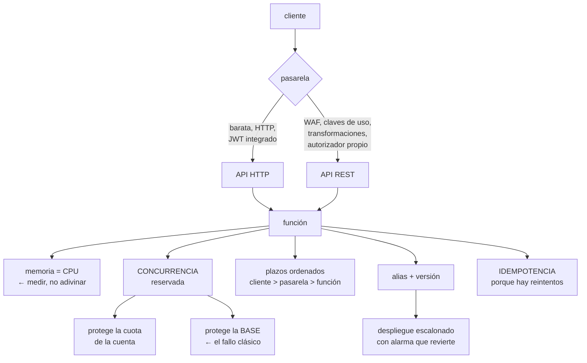

# 207 — SAM, Lambda, API Gateway y despliegue serverless

> [← Clase anterior](../../part-17-aws-production-architecture/206-oidc-de-github-y-gitlab-hacia-aws-sin-secretos/README.md) · [Índice de la parte](../README.md) · [Clase siguiente →](../../part-17-aws-production-architecture/208-dynamodb-por-patrones-de-acceso-y-single-table-design/README.md)

**Parte:** 17 — AWS: arquitectura, automatización y operación en producción<br>
**Nivel:** avanzado · **Horas estimadas:** 4<br>
**Laboratorio:** `serverless` · **Estado:** `EXECUTABLE_CORE`

## 🎯 Propósito

Construir y desplegar una aplicación sin servidores en AWS con las decisiones que separan un prototipo de algo que aguanta producción. La clase cubre la definición como código con SAM, la configuración de funciones que de verdad importa —memoria, concurrencia, plazos y arranque en frío—, la elección de pasarela y su coste, y los tres asuntos que rompen estos sistemas: **la concurrencia que agota la base, el reintento que duplica y el despliegue que no se puede revertir**.

## 📚 Resultados de aprendizaje

Al finalizar podrás:

1. **Definir** una aplicación sin servidores como código, con entornos separados.
2. **Dimensionar** memoria, concurrencia y plazos con criterio y no por defecto.
3. **Elegir** el tipo de pasarela por coste y por lo que necesitas de ella.
4. **Controlar** el arranque en frío y decidir cuándo pagar por evitarlo.
5. **Desplegar** de forma escalonada, con reversión automática.

## 🧩 Conceptos centrales

| Concepto | Comprensión verificable |
|---|---|
| `SAM` | Extensión de CloudFormation que declara funciones, APIs y tablas con menos texto y despliega con un solo comando. |
| `concurrencia reservada` | Máximo de ejecuciones simultáneas de una función. Es a la vez un límite y una reserva de la cuota de la cuenta. |
| `concurrencia aprovisionada` | Instancias mantenidas calientes. Elimina el arranque en frío y se paga por hora. |
| `arranque en frío` | Retraso al crear un entorno de ejecución nuevo. Afecta a los percentiles altos, no a la media. |
| `alias y versión` | Puntero estable a una versión concreta de la función. Es lo que permite desplazar tráfico y revertir. |
| `despliegue escalonado` | Desplazamiento progresivo del tráfico al alias nuevo, con alarmas que lo revierten solo. |

## 🧠 Modelo mental

AWS se aprende como una progresión operativa: identidad federada, infraestructura declarativa, entrega, señales, recuperación y costo controlado.

Aplicado a esta clase, separa siempre cuatro planos: **intención** (qué necesita el usuario),
**configuración** (qué declaramos), **estado observado** (qué existe de verdad) y
**evidencia** (cómo sabemos que cumple). Confundirlos produce diseños que se ven correctos
en un diagrama pero fallan al operar.

## 🗺️ Flujo de razonamiento



## 📖 Desarrollo

### 1. Definir como código, con entornos

Una plantilla de SAM declara funciones, rutas, permisos y recursos con mucho menos texto que la plantilla equivalente, y se despliega con un comando.

```text
LO QUE UNA PLANTILLA DEBE TENER DESDE EL PRINCIPIO
  parámetros por entorno, sin valores incrustados
  nombres derivados del entorno, no fijos
  permisos por función, no un rol compartido
  etiquetas obligatorias: dueño, entorno, servicio  clase 142
  y ninguna referencia a recursos creados a mano
```

Y los errores de estructura que se pagan pronto:

```text
✗ UNA PILA GIGANTE con todo
  → cada despliegue toca todo; un fallo bloquea la pila
  → y las pilas tienen límites de recursos

✓ PILAS POR CICLO DE VIDA
  lo que cambia a diario   funciones y API
  lo que cambia poco       tablas, buckets, colas
  → y las tablas de datos NUNCA en la misma pila que el
    código: un borrado de pila no debe poder llevarse los
    datos

✗ EL MISMO ROL PARA TODAS LAS FUNCIONES
  → una función comprometida alcanza todo         clase 189

✓ UN ROL POR FUNCIÓN, con permisos sobre los recursos
  concretos que usa
```

Y la política de borrado, que casi nadie configura y que evita desastres:

```text
los recursos con datos llevan política de retención
  → al borrar la pila, la tabla y el bucket SOBREVIVEN
→ sin esto, un `delete-stack` equivocado en la cuenta
  equivocada borra los datos                       clase 166
```

**Los entornos**, que se hacen con cuentas y no con prefijos:

```text
cuenta de desarrollo · preproducción · producción
→ la separación por cuenta es la única que impide de verdad
  que un despliegue de preproducción toque producción
                                                 clase 169
→ dentro de cada cuenta, una pila por servicio
```

Y el desarrollo local, que ahorra mucho tiempo y engaña en una cosa:

```text
la emulación local sirve para la lógica
no reproduce
  latencias reales, límites de concurrencia, permisos,
  arranques en frío ni el comportamiento de la pasarela
→ las pruebas que importan se hacen en un entorno real,
  aunque sea efímero                              clase 104
```

### 2. Memoria, concurrencia y plazos

Tres ajustes que vienen con valores por defecto y que deciden coste, latencia y estabilidad.

**La memoria, que es en realidad la CPU:**

```text
en Lambda, la CPU asignada es proporcional a la memoria
→ más memoria puede salir MÁS BARATO, porque la función
  termina antes

cómo se decide
  medir la misma carga con 512, 1.024, 1.792 y 3.008 MB
  y comparar duración × precio
  → hay un mínimo de coste, y casi nunca está en el valor
    por defecto

típicamente
  funciones de cálculo         se benefician mucho
  funciones de espera de red   no; la CPU no acelera esperar
```

**La concurrencia**, que es donde se rompen estos sistemas:

```text
EL FALLO CLÁSICO
  una función sin límite de concurrencia escala a miles de
  ejecuciones simultáneas
  cada una abre una conexión a la base relacional
  → la base agota sus conexiones y CAE
  → y con ella, todo lo demás que la usa

Y es exactamente el problema de la clase 186
  el recurso saturado no es la función: es la base

LAS CORRECCIONES
  concurrencia reservada por función
    = número de conexiones que la base puede dar / conexiones
      por ejecución
  y un intermediario de conexiones (RDS Proxy) si la base
    es relacional
  → o una base pensada para esto                  clase 208
```

Y el otro efecto de la concurrencia reservada:

```text
la cuota de concurrencia es DE LA CUENTA, compartida
→ una función que se dispara consume la cuota y las demás
  empiezan a ser rechazadas
→ reservar concurrencia a las funciones críticas es
  reservarles capacidad, no solo limitarlas
```

**Los plazos**, con la misma regla de la clase 196:

```text
cliente > pasarela > función > llamadas de la función

y dos particularidades
  la API HTTP y la REST tienen un plazo máximo propio
    → si la función tarda más, la pasarela corta y la
      función SIGUE ejecutándose y facturando
  el plazo por defecto de una función es bajo, y el máximo
    es alto
    → poner el máximo «por si acaso» significa pagar
      15 minutos de una función colgada

regla   plazo = p99 esperado × 2 o 3, nunca el máximo
```

Y una consecuencia que sorprende:

```text
una función con plazo de 15 min que se queda esperando una
dependencia caída
  consume concurrencia durante 15 minutos por invocación
  → agota la cuota y tumba lo demás
→ el plazo corto es un mecanismo de contención  clase 153
```

### 3. Pasarela, arranque en frío y coste

**La elección de pasarela**, que tiene consecuencias de coste importantes:

```text
API HTTP
  más barata (del orden de un tercio)
  menor latencia añadida
  autorizador de testigo integrado                clase 209
  CORS por configuración
  NO tiene   claves de uso y planes, transformaciones de
             petición y respuesta, WAF directo en algunos
             casos, caché integrada

API REST
  todo lo anterior
  autorizadores propios
  WAF asociado
  caché de respuestas
  y despliegues por etapa con variables

FUNCIÓN CON URL DIRECTA
  sin pasarela; la más barata y la más limitada
  → útil para webhooks internos, no para una API pública

BALANCEADOR DE APLICACIÓN → función
  útil si ya hay balanceador y se quiere una sola entrada
```

Y el criterio:

```text
empieza por API HTTP
pasa a REST solo si necesitas algo de su lista
→ y si la aplicación va detrás de CloudFront, muchas de
  esas necesidades (WAF, caché) se resuelven ahí
                                                 clase 205
```

**El arranque en frío**, que se exagera y a la vez se ignora donde importa:

```text
QUÉ ES
  crear un entorno de ejecución nuevo: descargar el
  paquete, arrancar el intérprete, ejecutar el código de
  inicialización

CUÁNTO
  lenguajes interpretados y paquetes pequeños  100-400 ms
  máquinas virtuales de lenguajes con arranque
    pesado                                     0,5-3 s
  con conexión a una red virtual, hoy, poco más
  y el código de inicialización propio, lo que tarde

A QUIÉN AFECTA
  a los percentiles altos, no a la media
  → con 100 peticiones/s, casi todo va caliente
  → con 1 petición cada 5 minutos, casi todo va frío
```

Y las correcciones, por orden de coste:

```text
1  REDUCIR EL PAQUETE                            gratis
   quitar dependencias, empaquetar solo lo necesario

2  MOVER TRABAJO FUERA DE LA INICIALIZACIÓN      gratis
   → pero reutilizar conexiones ENTRE invocaciones sí va
     en la inicialización: se crean una vez

3  ELEGIR UN TIEMPO DE EJECUCIÓN LIGERO          gratis

4  CONCURRENCIA APROVISIONADA                    se paga
   instancias calientes permanentes
   → tiene sentido en el camino crítico con tráfico
     irregular
   → y se puede programar por horas

5  MANTENER CALIENTE CON INVOCACIONES PERIÓDICAS
   → truco antiguo, poco fiable con concurrencia; evitarlo
```

**El coste**, que se estima mal siempre en la misma dirección:

```text
lo que se cuenta   invocaciones y duración
lo que se olvida
  peticiones de la pasarela            ← suele ser mayor
  transferencia de datos
  registros: ingesta y almacenamiento  ← el sorprendente
  llamadas a otros servicios por petición
  concurrencia aprovisionada, por hora

→ en sistemas de mucho tráfico y poca duración, la pasarela
  y los registros pueden superar al cómputo
```

### 4. Desplegar, revertir y ser idempotente

**El despliegue escalonado**, que SAM da hecho y casi nadie activa:

```text
versión + alias
  cada despliegue publica una VERSIÓN inmutable
  el alias apunta a una versión
  → el tráfico va al alias

desplazamiento progresivo
  10 % durante 5 min, luego 100 %
  o lineal: 10 % cada minuto

alarmas asociadas
  si la tasa de error o la latencia superan el umbral
  durante el desplazamiento, el alias VUELVE solo a la
  versión anterior
  → reversión automática, sin nadie mirando      clase 102

comprobación previa y posterior
  funciones que validan antes de desplazar y después
```

Y lo que hay que tener en cuenta al revertir:

```text
revertir el código es inmediato
revertir un cambio de ESQUEMA de datos, no
→ los cambios de datos siguen la regla de expandir y
  contraer, con el código tolerando ambas formas
                                                 clase 188
```

**La idempotencia**, que en este entorno no es opcional:

```text
POR QUÉ HAY REINTENTOS SIEMPRE
  invocación asíncrona: reintenta 2 veces por defecto
  desde una cola: reintenta hasta agotar y va a la cola de
    fallidos                                     clase 210
  desde un flujo de eventos: reprocesa el lote entero si
    falla un elemento
  el cliente reintenta ante un plazo vencido

→ toda función con efecto debe ser idempotente  clase 117
```

Y el mecanismo:

```text
clave de idempotencia por operación
  del mensaje, de la cabecera del cliente, o derivada del
  contenido
registro de claves procesadas, con caducidad
y la comprobación ANTES del efecto, con escritura
  condicionada                                   clase 149
```

**Lo que hay que vigilar:**

```text
invocaciones, errores y duración por función
EJECUCIONES RECHAZADAS por límite de concurrencia
  → señal de que la reserva es corta o algo se disparó
concurrencia usada frente a la reservada
mensajes en la cola de fallidos, y su antigüedad ley 13
plazos vencidos, separados de los errores
y el coste por función, no solo el total
```

Y la lista de comprobación de la clase:

```text
☐ la plantilla no tiene valores incrustados por entorno
☐ los datos están en pilas separadas del código
☐ los recursos con datos tienen política de retención
☐ hay un rol por función, con permisos concretos
☐ la memoria se eligió midiendo, no por defecto
☐ hay concurrencia reservada en las funciones que tocan
  bases con conexiones limitadas
☐ los plazos son múltiplos del p99, no el máximo
☐ los plazos están ordenados cliente > pasarela > función
☐ la pasarela elegida corresponde a lo que se necesita
☐ el arranque en frío se midió antes de pagar por evitarlo
☐ el despliegue es escalonado con alarma y reversión
  automática
☐ toda función con efecto es idempotente
☐ hay alerta de ejecuciones rechazadas y de cola de
  fallidos
☐ el coste incluye pasarela, transferencia y registros
```

Y el cierre que enlaza con la clase siguiente: una función que escala a miles de ejecuciones necesita un almacén que escale igual, y eso cambia por completo cómo se diseña el modelo de datos. DynamoDB por patrones de acceso es la materia de la clase 208.

## 🔬 Ejemplo trabajado

**CloudShop pasa su API de pedidos a funciones. Lo que sigue es el incidente del primer día de campaña, las cinco correcciones que salieron, y el análisis de coste que reveló dónde estaba el dinero de verdad.**

**El montaje inicial, con valores por defecto:**

```text
API REST → 14 funciones
memoria                        128 MB (por defecto)
plazo                          30 s
concurrencia                   sin límite
base                           PostgreSQL gestionada,
                               máximo 400 conexiones
despliegue                     directo, sin alias
funciona en pruebas            perfectamente
```

**El incidente del primer día de campaña.**

```text
11:02   arranca la campaña; el tráfico se multiplica por 22
11:04   la base de datos deja de aceptar conexiones
11:04   CUANTO usa la base falla, incluidos el panel
        interno y los informes
11:31   se identifica la causa
12:20   servicio restablecido

qué pasó
  las funciones escalaron a 3.100 ejecuciones simultáneas
  cada una abría su propia conexión
  3.100 > 400
  → la base agotó conexiones y empezó a rechazar
  → las funciones fallaban, el cliente reintentaba, y los
    reintentos abrían más conexiones                clase 186

y un efecto secundario
  las 3.100 ejecuciones consumieron la cuota de concurrencia
  de la CUENTA
  → funciones de otros servicios empezaron a ser rechazadas
  → incluida la que procesa los correos de confirmación
```

**Las cinco correcciones.**

```text
1  CONCURRENCIA RESERVADA, calculada
   conexiones disponibles para la API        320
   conexiones por ejecución                    1
   margen                                    20 %
   → concurrencia reservada de las funciones que tocan la
     base: 256 en total, repartida
       crear pedido        120
       consultar pedido     80
       modificar pedido     40
       resto                16
   y las funciones que NO tocan la base quedan sin reserva

   efecto   por encima de 256, las peticiones se rechazan
            con 429 rápido, en vez de tumbar la base
            → rechazar pronto es mejor que encolar
                                                clase 186

2  INTERMEDIARIO DE CONEXIONES
   se añadió un proxy de base de datos
   → 3.100 ejecuciones comparten 180 conexiones reales
   → la concurrencia reservada se pudo subir a 900
   coste    +140 €/mes

3  PLAZOS ORDENADOS Y CORTOS
   antes   cliente 60 s · pasarela 29 s · función 30 s
   → la pasarela cortaba a los 29 s y la función seguía
     ejecutándose 1 s más, facturando y ocupando
     concurrencia
   después cliente 12 s · pasarela 10 s · función 8 s
           llamadas de la función: 3 s

   efecto durante una degradación de la pasarela de pago
     antes    cada invocación ocupaba 30 s de concurrencia
     después  8 s
     → la cuota aguanta 3,7 veces más tiempo

4  MEMORIA, MEDIDA
   la función de crear pedido, con la misma carga

     memoria   duración   coste relativo
      128 MB    3.900 ms       1,00
      512 MB    1.010 ms       1,04
    1.024 MB      520 ms       1,07
    1.792 MB      340 ms       1,22

   → el mínimo estaba en 128 MB por poco, pero la latencia
     era inaceptable
   → se eligió 1.024 MB: 7 % más caro y 7,5 veces más rápido
   → y el p99 de la API bajó de 4,2 s a 0,7 s

   y la función de generar informes, de cálculo puro
      128 MB   48 s   1,00
    3.008 MB    2,4 s  0,52
   → más memoria, la MITAD de coste

5  DESPLIEGUE ESCALONADO
   alias y versiones
   desplazamiento 10 % durante 5 min, luego 100 %
   alarmas: tasa de error > 1 % o p99 > 1,5 s
   reversión automática

   en los 8 meses siguientes
     despliegues                              186
     revertidos automáticamente                 7
     tiempo medio de reversión               2 min
     incidentes causados por despliegue          0
```

**La idempotencia, que faltaba.**

```text
en el incidente, los reintentos del cliente crearon pedidos
duplicados
  pedidos duplicados detectados                      64
  cobrados dos veces                                 11

corrección
  la petición de crear pedido lleva una clave de
  idempotencia generada por el cliente
  la función escribe con condición «si no existe esa clave»
  → un reintento devuelve el pedido original, no crea otro

y la prueba negativa
  enviar la misma petición 50 veces en paralelo
  → 1 pedido creado, 49 respuestas idénticas       ✓
```

**El análisis de coste, que dio la sorpresa.**

```text
estimación inicial del equipo
  cómputo de funciones                         340 €/mes
  «lo demás es despreciable»

factura real del primer mes completo
  cómputo de funciones                         410 €
  peticiones de API Gateway (REST)             890 €   ←
  registros: ingesta                           620 €   ←
  registros: almacenamiento                    180 €
  transferencia                                210 €
  proxy de base de datos                       140 €
  ─────────────────────────────────────────────────
  total                                      2.450 €

  → el cómputo era el 17 % de la factura
```

Y las tres correcciones de coste:

```text
PASARELA
  se revisó qué se usaba de la API REST
    claves de uso        no
    transformaciones     no
    caché                no (la hace CloudFront)  clase 205
    WAF                  sí → pero se puede poner en
                         CloudFront
  → migración a API HTTP
  890 € → 310 €

REGISTROS
  las funciones registraban cada petición completa, con
  cuerpo
  → nivel de registro por entorno; en producción solo
    errores y muestreo del 1 % de las peticiones correctas
  → caducidad de 14 días en lugar de indefinida
  620 € → 95 €;  almacenamiento 180 € → 25 €

TRANSFERENCIA
  las respuestas incluían campos que el cliente no usaba
  210 € → 120 €

total                              2.450 € → 1.100 €
```

**El resultado, seis meses después:**

```text                                        antes     después
p99 de la API                              4,2 s       0,7 s
caídas de la base por agotamiento         1 (campaña)      0
pedidos duplicados                           64           0
despliegues revertidos a mano                 3           0
  (automáticos)                               —           7
coste mensual                            2.450 €     1.100 €
  proporción de cómputo                     17 %        37 %
ejecuciones rechazadas en pico              n/a      412/día
  → a propósito: mejor rechazar que tumbar la base
```

**La lección que esta clase deja**: el sistema funcionaba perfectamente en pruebas y **cayó en cuatro minutos** el día de campaña, porque el recurso saturado no era la función sino las conexiones de la base —el mismo problema de la clase 186, con otra tecnología—. Y del análisis de coste salió lo que la hipótesis de la parte anticipaba: **el cómputo era el 17 % de la factura**, y las dos partidas mayores eran la pasarela y los registros, ninguna de las cuales se había estimado.

## 🧪 Laboratorio guiado

Ejecuta desde la raíz:

```bash
python classes/part-17-aws-production-architecture/207-sam-lambda-api-gateway-y-despliegue-serverless/lab.py
```

El laboratorio selecciona el motor de práctica **`serverless`** y produce
`lab_result.json`. El escenario, sus comprobaciones y el artefacto esperado corresponden a
esta clase; no requiere credenciales y deja explícito qué debe revalidarse en un sandbox real.

1. Lee `exercise.steps` y formula una predicción antes de ejecutar.
2. Ejecuta la práctica y verifica todos los elementos de `checks`.
3. Provoca el caso de `negative_test` y explica la señal observada.
4. Materializa `aws-serverless-api` en `evidence/` usando la plantilla indicada.
5. Para proveedor real, sigue `sandbox.requires`, registra costo y ejecuta `destroy`.

### Evidencia esperada

El artefacto principal es una función con límites, reintentos e idempotencia. Además, la entrega debe incluir el comando ejecutado,
la salida estructurada y una conclusión que no exceda lo observado.

## 🏆 Reto verificable

Construye **`aws-serverless-api`** para el caso CloudShop. Incluye una alternativa descartada,
un supuesto que pueda falsarse, una prueba de fallo y una decisión de rollback.

## ✅ Criterio de aceptación

- [ ] `lab.py` termina con código 0 y genera JSON válido.
- [ ] La entrega conecta al menos tres requisitos con mecanismos verificables.
- [ ] Existe una prueba positiva y una prueba negativa con evidencia.
- [ ] Seguridad, costo y operación aparecen como decisiones, no como anexos.
- [ ] Se declara una limitación y una condición que obligaría a revisar el diseño.
- [ ] Otra persona puede repetir el recorrido sin conocimiento tácito.

## ⚠️ Errores frecuentes

| Síntoma | Causa probable | Corrección |
|---|---|---|
| La base de datos cae en cuanto hay un pico de tráfico | Las funciones escalan sin límite y cada ejecución abre una conexión | Calcula y aplica concurrencia reservada según las conexiones disponibles, y usa un intermediario de conexiones. |
| Una función descontrolada afecta a servicios que no tienen nada que ver | La cuota de concurrencia es de la cuenta y se consume entera | Reserva concurrencia a las funciones críticas; reservar es también proteger su capacidad. |
| Se factura tiempo de funciones que ya nadie está esperando | El plazo de la función es mayor que el de la pasarela, o se puso el máximo por si acaso | Ordena los plazos cliente > pasarela > función y fija el de la función en dos o tres veces el p99. |
| Se crean registros duplicados tras un pico o un fallo | La función no es idempotente y algo la reintenta | Clave de idempotencia por operación y escritura condicionada antes del efecto. |
| Un despliegue defectuoso llega a todo el tráfico | Se despliega sin alias ni desplazamiento progresivo | Publica versiones, desplaza tráfico por porcentaje y asocia alarmas que reviertan solas. |
| La factura triplica la estimación | Solo se estimó el cómputo; la pasarela y los registros suelen pesar más | Estima peticiones de pasarela, transferencia e ingesta de registros; ajusta nivel de registro y caducidad por entorno. |

## 🛡️ Seguridad, ética y costo

Trabaja con cuentas propias o sandboxes autorizados. No publiques secretos, identificadores
reales ni datos personales. Antes de crear recursos pagos define presupuesto, etiquetas y
comando de destrucción; después verifica que no queden recursos huérfanos. Los ejemplos
locales enseñan contratos, pero no certifican cumplimiento ni disponibilidad de producción.

## ❓ Preguntas de comprobación

1. ¿Por qué más memoria puede salir más barato en una función?
2. ¿Cómo se calcula la concurrencia reservada de una función que usa una base relacional?
3. ¿Qué ocurre si el plazo de la función supera el de la pasarela?
4. ¿Cuándo compensa pagar concurrencia aprovisionada?
5. ¿Qué partidas de coste se olvidan al estimar una aplicación sin servidores?

## 🔗 Referencias

- AWS (2025). *Serverless Application Model developer guide*. <https://docs.aws.amazon.com/serverless-application-model/latest/developerguide/what-is-sam.html>
- AWS (2025). *Lambda function scaling and reserved concurrency*. <https://docs.aws.amazon.com/lambda/latest/dg/lambda-concurrency.html>
- AWS (2025). *Choosing between HTTP APIs and REST APIs*. <https://docs.aws.amazon.com/apigateway/latest/developerguide/http-api-vs-rest.html>
- AWS (2025). *Operating Lambda: performance optimization and cold starts*. <https://aws.amazon.com/blogs/compute/operating-lambda-performance-optimization-part-1/>
- AWS (2025). *Amazon RDS Proxy* — agrupación de conexiones para funciones. <https://docs.aws.amazon.com/AmazonRDS/latest/UserGuide/rds-proxy.html>
- Documentación oficial vigente del servicio implementado; registra URL y fecha de consulta.

---

> [Evaluación](assessment.md) · [Contrato de clase](lesson.yaml) · [Índice de la parte](../README.md)
