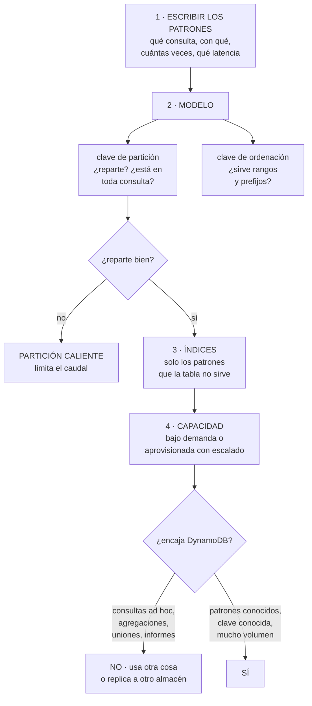

# 208 — DynamoDB por patrones de acceso y single-table design

> [← Clase anterior](../../part-17-aws-production-architecture/207-sam-lambda-api-gateway-y-despliegue-serverless/README.md) · [Índice de la parte](../README.md) · [Clase siguiente →](../../part-17-aws-production-architecture/209-cognito-jwt-authorizers-waf-y-defensa-en-profundidad/README.md)

**Parte:** 17 — AWS: arquitectura, automatización y operación en producción<br>
**Nivel:** avanzado · **Horas estimadas:** 4<br>
**Laboratorio:** `data` · **Estado:** `EXECUTABLE_CORE`

## 🎯 Propósito

Diseñar en DynamoDB, donde el modelo se deduce de los patrones de acceso y no al revés, y donde equivocarse en la clave es la decisión más cara de cambiar de todo un sistema. La clase da el método —escribir los patrones antes de tocar nada—, explica el diseño de tabla única con sus ventajas y su coste real, cubre los índices, la capacidad y las particiones calientes, y aborda con honestidad **cuándo DynamoDB no es la elección correcta**.

## 📚 Resultados de aprendizaje

Al finalizar podrás:

1. **Escribir** los patrones de acceso antes de diseñar el modelo.
2. **Elegir** clave de partición y de ordenación que repartan y sirvan las consultas.
3. **Aplicar** el diseño de tabla única donde aporta, y no donde no.
4. **Dimensionar** capacidad y detectar particiones calientes.
5. **Decidir** cuándo usar otra base de datos.

## 🧩 Conceptos centrales

| Concepto | Comprensión verificable |
|---|---|
| `patrón de acceso` | Consulta o escritura concreta que el sistema debe hacer, con su frecuencia y su latencia exigida. |
| `clave de partición` | Determina en qué partición vive el elemento. Decide el reparto de carga y no se puede cambiar. |
| `clave de ordenación` | Ordena los elementos dentro de una partición y permite consultas por rango y por prefijo. |
| `tabla única` | Guardar varias entidades en una tabla con claves genéricas, para servir consultas relacionadas en una sola operación. |
| `índice secundario global` | Vista con otra clave. Tiene su propia capacidad y es eventualmente consistente. |
| `partición caliente` | Clave que concentra el tráfico. Limita el caudal aunque la tabla tenga capacidad de sobra. |

## 🧠 Modelo mental

AWS se aprende como una progresión operativa: identidad federada, infraestructura declarativa, entrega, señales, recuperación y costo controlado.

Aplicado a esta clase, separa siempre cuatro planos: **intención** (qué necesita el usuario),
**configuración** (qué declaramos), **estado observado** (qué existe de verdad) y
**evidencia** (cómo sabemos que cumple). Confundirlos produce diseños que se ven correctos
en un diagrama pero fallan al operar.

## 🗺️ Flujo de razonamiento



## 📖 Desarrollo

### 1. Primero los patrones, siempre

En una base relacional se modela el dominio y las consultas salen después. En DynamoDB **eso no funciona**: el modelo se deduce de las consultas.

```text
EL DOCUMENTO QUE HAY QUE ESCRIBIR ANTES

  nº  patrón                       clave      frecuencia
   1  obtener pedido por id        id         alta
   2  listar pedidos de un cliente,
      del más reciente al más      cliente    alta
      antiguo, paginado
   3  listar pedidos de un cliente
      en un rango de fechas        cliente+f  media
   4  obtener las líneas de un
      pedido                       pedido     alta
   5  listar pedidos por estado
      para el panel de operaciones estado     baja
   6  obtener el cliente de un
      pedido                       cliente    alta

  y por cada uno
    ¿con qué dato se pide? ← esto es la clave
    ¿cuántas veces por segundo?
    ¿qué latencia se exige?
    ¿se necesita el dato más reciente o vale eventual?
```

Y la razón de que sea obligatorio:

```text
DynamoDB solo sabe hacer dos cosas rápido
  obtener un elemento por su clave completa
  obtener un rango de elementos con la misma clave de
    partición, ordenados por la de ordenación

todo lo demás es un recorrido completo de la tabla
  → caro, lento, y que empeora al crecer
```

Y el patrón que revela que el modelo está mal:

```text
si para servir una pantalla hacen falta 5 consultas y luego
unir en el código, el modelo no está bien
→ o el modelo cambia, o esa consulta no debería ir aquí
```

Y una advertencia sobre el proceso:

```text
los patrones nuevos aparecen. El modelo debe poder
absorberlos con un índice, no con una migración
→ por eso conviene dejar atributos genéricos libres para
  índices futuros                                clase 181
```

### 2. Claves, y la partición caliente

**La clave de partición** es la decisión más cara de todo el diseño, porque **no se puede cambiar**: cambiarla es crear otra tabla y migrar.

```text
UNA BUENA CLAVE DE PARTICIÓN
  1  está presente en casi todas las consultas
  2  tiene MUCHOS valores distintos
  3  el tráfico se reparte entre esos valores
  4  y ningún valor concentra demasiados elementos

UNA MALA
  estado del pedido      ← 5 valores; todo cae en «entregado»
  fecha del día          ← todo el tráfico de hoy en una
  tipo de entidad        ← peor todavía
  país                   ← si el 80 % es de un país
```

**La partición caliente**, que es el fallo característico:

```text
CADA PARTICIÓN TIENE UN LÍMITE PROPIO
  del orden de 3.000 lecturas y 1.000 escrituras por segundo

→ una tabla con capacidad para 40.000 escrituras/s puede
  estar rechazando peticiones si todas van a la misma clave
→ el síntoma es un error de caudal excedido con la tabla
  «al 8 % de uso»
```

Y las soluciones, por orden de preferencia:

```text
1  CAMBIAR LA CLAVE por una que reparta
   → lo correcto, si aún se está a tiempo

2  AÑADIR UN SUFIJO REPARTIDOR
   cliente#7 → cliente#7#3, con 10 sufijos
   → reparte la escritura
   → y obliga a hacer 10 consultas al leer y unir
   → solo si el patrón de lectura lo tolera

3  CACHÉ DELANTE para lecturas calientes
   → resuelve lectura, no escritura

4  AGREGAR ANTES DE ESCRIBIR
   si son 5.000 escrituras/s de contadores, agregar en
   ventanas y escribir una vez
```

**La clave de ordenación**, que es donde está la potencia:

```text
con la misma clave de partición se puede pedir
  todo lo que empieza por un prefijo
  todo lo que está entre dos valores
  en orden ascendente o descendente
  con límite y paginación

y por eso las claves de ordenación se construyen para que
el orden lexicográfico signifique algo
  FECHA en formato ISO ordena cronológicamente
  jerarquías con separador: PEDIDO#2025-03#4471
```

Y la técnica que sirve la mayoría de las consultas:

```text
clave de ordenación con prefijo por tipo
  CLIENTE#123 · PERFIL
  CLIENTE#123 · PEDIDO#2025-03-14#4471
  CLIENTE#123 · PEDIDO#2025-03-02#4390
  CLIENTE#123 · DIRECCION#casa

→ una consulta con prefijo «PEDIDO#» da los pedidos
  ordenados por fecha
→ una consulta sin prefijo da el cliente entero de una vez
```

### 3. Tabla única: qué aporta y qué cuesta

El diseño de tabla única consiste en guardar varias entidades juntas para poder traerlas en **una sola operación**.

```text
QUÉ RESUELVE
  la pantalla que necesita cliente, sus pedidos y sus
  direcciones
  con tablas separadas: 3 consultas y unir en el código
  con tabla única: 1 consulta
  → y en un sistema con muchas llamadas, eso importa
                                                 clase 152

QUÉ CUESTA, y se cuenta poco
  el modelo deja de ser legible: PK y SK genéricos
  cada patrón nuevo obliga a pensar de nuevo
  las herramientas de exploración no ayudan
  la incorporación de gente nueva es más lenta
  y un error de modelo afecta a todas las entidades
```

Y el criterio honesto:

```text
USA TABLA ÚNICA CUANDO
  hay patrones que necesitan varias entidades juntas
  el volumen y la latencia lo justifican
  y el equipo entiende el modelo

NO LA USES CUANDO
  las entidades no se consultan juntas nunca
    → tablas separadas, más simples y sin coste
  el volumen es modesto
    → la ganancia no compensa la complejidad
  el equipo no ha trabajado así antes y no hay tiempo de
    aprender
    → un modelo de tabla única mal hecho es peor que tablas
      separadas
```

Y una regla práctica que reduce el riesgo:

```text
agrupa en una tabla lo que se consulta junto y comparte
ciclo de vida
separado, lo demás
→ es el mismo criterio de cohesión de la clase 183
```

**Los índices secundarios**, con lo que hay que saber:

```text
ÍNDICE GLOBAL
  otra clave de partición y de ordenación
  capacidad PROPIA, que se paga aparte
  eventualmente consistente, siempre
  → si su capacidad se agota, las ESCRITURAS de la tabla
    principal empiezan a fallar     ← el efecto que sorprende

ÍNDICE LOCAL
  misma partición, otra ordenación
  se define al crear la tabla y no se puede añadir después
  limita el tamaño de la partición a 10 GB
  → rara vez merece la pena

PROYECCIÓN
  qué atributos se copian al índice
  solo claves · algunos · todos
  → proyectar todo duplica el almacenamiento y el coste de
    escritura
  → proyectar solo lo necesario y buscar el resto en la
    tabla, si es poco frecuente
```

Y el error de índices más común:

```text
crear un índice por cada consulta que se ocurre
→ cada escritura se replica a todos los índices
→ 5 índices = 6 escrituras por cada escritura lógica
→ y el coste de escritura se multiplica por seis
```

### 4. Capacidad, coste y cuándo no usarla

**La capacidad**, con la decisión que hay que tomar:

```text
BAJO DEMANDA
  se paga por petición; escala sola
  + sin gestión, ideal para tráfico impredecible o bajo
  − más caro por unidad si el tráfico es alto y estable
  − tiene su propio escalado: un pico de 10× desde reposo
    puede encontrar límites al principio

APROVISIONADA CON ESCALADO AUTOMÁTICO
  se reserva capacidad y se ajusta por uso
  + más barata con tráfico alto y previsible
  − el escalado tarda minutos: no cubre un pico brusco
  − requiere vigilar el estrangulamiento

REGLA PRÁCTICA
  empieza bajo demanda, mide un mes, y cambia si el patrón
  es estable y el ahorro es real
```

**El coste**, con lo que suele olvidarse:

```text
lectura y escritura                     lo que se cuenta
almacenamiento
ÍNDICES: su propia escritura y almacenamiento   ← olvidado
copias continuas y su almacenamiento
flujos de cambios y su consumo                  ← olvidado
tablas globales: escritura replicada en cada región
transferencia entre regiones

y dos decisiones que cambian mucho el coste
  LECTURA EVENTUAL en vez de fuerte: la mitad de precio
  → y en la mayoría de las consultas basta      clase 187
  ELEMENTOS PEQUEÑOS: la unidad de lectura cubre 4 KB
  → un elemento de 5 KB cuesta el doble que uno de 4
```

**Cuándo NO usar DynamoDB**, que es la parte honesta:

```text
NO LA USES SI
  las consultas no se conocen de antemano
    informes, exploración, analítica ad hoc
  hacen falta agregaciones (sumas, medias, agrupaciones)
    → hay que mantenerlas a mano al escribir
  hacen falta uniones entre entidades no relacionadas
  hace falta búsqueda por texto
  el volumen es pequeño y el equipo conoce SQL
    → una base relacional gestionada será más rápida de
      construir y más barata de operar

Y EL PATRÓN QUE RESUELVE LA MAYORÍA DE ESTOS CASOS
  DynamoDB para el camino operativo, de alto volumen y
  patrones conocidos
  + flujo de cambios que replica a un almacén analítico
    para informes y exploración                  clase 150
  → cada uno hace lo que sabe hacer
```

Y las transacciones, que existen y tienen límites:

```text
se pueden escribir varios elementos de forma atómica
  con límite de elementos por transacción
  y coste doble
→ útiles para invariantes concretos; no para sustituir a
  una base transaccional                        clase 187
```

Y la lista de comprobación de la clase:

```text
☐ los patrones de acceso están escritos, con frecuencia y
  latencia
☐ la clave de partición está en casi todas las consultas
☐ la clave de partición reparte: muchos valores y tráfico
  distribuido
☐ la clave de ordenación permite prefijos y rangos útiles
☐ el uso de tabla única está justificado, no copiado
☐ los índices son los mínimos, con proyección ajustada
☐ se sabe que un índice saturado hace fallar las escrituras
☐ las lecturas usan consistencia eventual salvo donde no
  se pueda
☐ hay alerta de estrangulamiento y de clave caliente
☐ el coste incluye índices, flujos y copias
☐ lo que no encaja se replica a otro almacén, no se fuerza
```

Y el cierre que enlaza con la clase siguiente: con una API y un almacén que escalan, falta decidir quién puede llamar y qué se hace con lo que llega de fuera. Identidad de usuario, autorizadores y defensa en profundidad es la materia de la clase 209.

## 🔬 Ejemplo trabajado

**CloudShop diseña el almacén de pedidos. Lo que sigue es el documento de patrones, el modelo que salió, el error de clave que costó una migración de seis semanas, y la decisión de qué NO poner ahí.**

**Los patrones, escritos antes de nada:**

```text
nº  patrón                          se pide con   veces/s  latencia
 1  obtener pedido por id           id             400     < 20 ms
 2  pedidos de un cliente, recientes
    primero, paginado               cliente        180     < 50 ms
 3  pedidos de un cliente en rango
    de fechas                       cliente+fecha   20     < 50 ms
 4  líneas de un pedido             pedido         400     < 20 ms
 5  pedidos en estado «pendiente de
    envío», para el almacén         estado           2     < 1 s
 6  datos del cliente de un pedido  cliente        400     < 20 ms
 7  pedidos de un día para el cierre
    contable                        fecha       1 vez/día  < 5 min
 8  buscar pedidos por texto libre
    (atención al cliente)           texto           15     < 1 s
 9  ventas por categoría y semana   —           informes   —
```

Y la primera decisión, tomada antes de modelar:

```text
los patrones 8 y 9 NO van a DynamoDB
  8  búsqueda por texto → índice de búsqueda, alimentado
     por el flujo de cambios
  9  agregaciones y exploración → almacén analítico, por el
     mismo flujo                                clase 150

→ forzarlos habría destrozado el modelo
```

**El error de clave, y lo que costó.**

```text
primer diseño, hecho antes de escribir los patrones
  clave de partición    estado del pedido
  clave de ordenación   fecha#id
  razón                 «el panel del almacén consulta por
                        estado, y es la consulta que nos
                        pidieron primero»

lo que pasó en producción
  los estados son 6
  el 71 % de los pedidos acaba en «entregado»
  y todos los pedidos nuevos entran en «pendiente de pago»
  → dos particiones concentraban el 94 % de la escritura

  síntoma
    errores de caudal excedido a 900 escrituras/s
    con la tabla configurada para 20.000
    y el panel de uso mostrando un 5 %

  y el patrón 1, el más frecuente, no se podía servir:
  para obtener un pedido por id había que conocer su estado
  → se hacía un recorrido completo de la tabla
  → 340 ms de latencia y coste creciente

coste de la corrección
  tabla nueva, doble escritura durante la migración,
  comparación, y corte
  6 semanas de trabajo de 2 personas

qué lo habría evitado
  escribir los nueve patrones antes de elegir la clave
  → 3 horas de trabajo                            ley 14
```

**El modelo definitivo, con tabla única.**

```text
PK                    SK                          entidad
CLIENTE#123           PERFIL                      cliente
CLIENTE#123           DIRECCION#casa              dirección
CLIENTE#123           PEDIDO#2025-03-14#4471      resumen de
                                                  pedido
CLIENTE#123           PEDIDO#2025-03-02#4390      resumen
PEDIDO#4471           CABECERA                    pedido
PEDIDO#4471           LINEA#001                   línea
PEDIDO#4471           LINEA#002                   línea

cómo se sirve cada patrón
  1  obtener PEDIDO#4471 / CABECERA          → 1 operación
  2  consultar CLIENTE#123 con prefijo
     «PEDIDO#», descendente, límite 20       → 1 operación
  3  consultar CLIENTE#123 entre
     «PEDIDO#2025-01» y «PEDIDO#2025-03»     → 1 operación
  4  consultar PEDIDO#4471 con prefijo
     «LINEA#»                                → 1 operación
  6  el resumen de pedido bajo CLIENTE ya trae lo necesario
     → 0 operaciones extra

y la pantalla de detalle de cliente
  consultar CLIENTE#123 sin prefijo
  → perfil, direcciones y últimos pedidos en UNA operación
  → antes eran 3 consultas y unión en el código
```

Y la justificación de la tabla única, escrita:

```text
se usa porque los patrones 2, 3 y 6 necesitan cliente y
pedidos juntos, con 400 peticiones/s
no se usa para las líneas de producto del catálogo, que
nunca se consultan con lo anterior y viven en su propia
tabla                                            clase 183
```

**Los índices, los mínimos.**

```text
GSI-1   para el patrón 5 (panel del almacén)
  PK    ESTADO#pendiente-envio
  SK    fecha#id
  proyección   solo id, cliente, fecha, importe
  → 2 consultas/s; no justifica proyectar todo

  y aquí SÍ hay concentración: todos los pendientes en una
  clave
  → aceptable porque son 2 consultas/s y pocos elementos
  → decisión registrada, con la señal que la reabriría:
    «si el panel pasa de 50 consultas/s o si los pendientes
     superan 100.000 elementos»                 clase 190

GSI-2   para el patrón 7 (cierre diario)
  PK    FECHA#2025-03-14
  SK    id
  proyección   solo claves
  → se ejecuta una vez al día, fuera de hora punta

NO se creó ningún índice más
  se propusieron 4 más para consultas del panel interno
  → se resolvieron en el almacén analítico          clase 150
  → habrían multiplicado por 3 el coste de escritura
```

**La capacidad y el coste.**

```text
primer mes, bajo demanda
  lecturas                    980 M     490 €
  escrituras                   41 M     205 €
  almacenamiento              210 GB     53 €
  índices (escritura)          82 M     410 €   ←
  flujo de cambios             41 M      18 €
  copias continuas                        68 €
  ──────────────────────────────────────────
  total                                1.244 €

los índices costaban más que las escrituras de la tabla
  → porque GSI-1 recibía cada escritura de pedido y
    proyectaba 4 atributos
  → se ajustó para que solo se indexen los pedidos en
    estados activos, borrando la clave del índice al
    entregar
  → escrituras de índice: 82 M → 19 M;  410 € → 95 €

segundo ajuste
  el 92 % de las lecturas no necesitaban consistencia fuerte
  → cambiadas a eventual:  490 € → 268 €

tercer ajuste, tras 2 meses de datos
  el tráfico resultó estable y alto
  → capacidad aprovisionada con escalado automático
  → 268 € → 171 € en lecturas

total                          1.244 € → 620 €
```

**La comprobación de reparto, hecha antes de salir:**

```text
se simuló un día de campaña con datos reales
  claves de partición distintas                 41.200
  máxima proporción de escritura en una clave      0,8 %
  máxima proporción de lectura en una clave        2,1 %
    → un cliente empresarial con muchos pedidos
    → aceptable; muy por debajo del límite de partición

y la alerta que quedó montada
  «errores de caudal excedido > 0 durante 1 minuto»
  → distingue el estrangulamiento del error de aplicación
```

**El resultado:**

```text                                        antes     después
latencia p99 del patrón 1                  340 ms       11 ms
operaciones para la pantalla de cliente         3           1
errores de caudal con la tabla al 5 %         sí          no
coste mensual                              1.244 €     620 €
índices                                         6           2
patrones servidos fuera de DynamoDB             0           2
```

**La lección que esta clase deja**: la clave de partición se eligió **por la primera consulta que pidió negocio** y no por los nueve patrones, y esa decisión de una tarde costó **seis semanas de migración**. El segundo hallazgo fue de coste: **los índices costaban más que la tabla**, porque recibían cada escritura y proyectaban atributos que casi nadie leía. Y las dos consultas que peor encajaban —búsqueda por texto y agregaciones— se resolvieron **sacándolas de DynamoDB**, no forzando el modelo.

## 🧪 Laboratorio guiado

Ejecuta desde la raíz:

```bash
python classes/part-17-aws-production-architecture/208-dynamodb-por-patrones-de-acceso-y-single-table-design/lab.py
```

El laboratorio selecciona el motor de práctica **`data`** y produce
`lab_result.json`. El escenario, sus comprobaciones y el artefacto esperado corresponden a
esta clase; no requiere credenciales y deja explícito qué debe revalidarse en un sandbox real.

1. Lee `exercise.steps` y formula una predicción antes de ejecutar.
2. Ejecuta la práctica y verifica todos los elementos de `checks`.
3. Provoca el caso de `negative_test` y explica la señal observada.
4. Materializa `aws-dynamodb-model` en `evidence/` usando la plantilla indicada.
5. Para proveedor real, sigue `sandbox.requires`, registra costo y ejecuta `destroy`.

### Evidencia esperada

El artefacto principal es un modelo de datos ligado a patrones de acceso. Además, la entrega debe incluir el comando ejecutado,
la salida estructurada y una conclusión que no exceda lo observado.

## 🏆 Reto verificable

Construye **`aws-dynamodb-model`** para el caso CloudShop. Incluye una alternativa descartada,
un supuesto que pueda falsarse, una prueba de fallo y una decisión de rollback.

## ✅ Criterio de aceptación

- [ ] `lab.py` termina con código 0 y genera JSON válido.
- [ ] La entrega conecta al menos tres requisitos con mecanismos verificables.
- [ ] Existe una prueba positiva y una prueba negativa con evidencia.
- [ ] Seguridad, costo y operación aparecen como decisiones, no como anexos.
- [ ] Se declara una limitación y una condición que obligaría a revisar el diseño.
- [ ] Otra persona puede repetir el recorrido sin conocimiento tácito.

## ⚠️ Errores frecuentes

| Síntoma | Causa probable | Corrección |
|---|---|---|
| Errores de caudal excedido con la tabla al 5 % de uso | Partición caliente: el tráfico se concentra en pocas claves | Elige una clave con muchos valores y tráfico repartido; si ya es tarde, reparte con sufijo, cachea o agrega antes de escribir. |
| Servir una pantalla exige cinco consultas y unir en el código | El modelo se diseñó desde el dominio y no desde los patrones | Escribe los patrones con su frecuencia y latencia antes de modelar, y agrupa en la clave de ordenación lo que se consulta junto. |
| Obtener un elemento por su identificador requiere recorrer la tabla | La clave de partición no está presente en el patrón más frecuente | La clave de partición debe aparecer en casi todas las consultas; si no, el modelo está al revés. |
| Las escrituras de la tabla empiezan a fallar sin motivo aparente | Un índice secundario global agotó su capacidad | Vigila la capacidad de cada índice por separado y reduce índices y proyecciones al mínimo necesario. |
| El coste de escritura es varias veces el esperado | Cada escritura se replica a todos los índices, con proyección completa | Crea solo los índices que sirvan patrones reales, proyecta lo mínimo y saca del índice lo que deja de ser consultable. |
| Los informes y las búsquedas son lentos y caros | Se fuerzan consultas ad hoc y agregaciones sobre DynamoDB | Replica por el flujo de cambios a un índice de búsqueda y a un almacén analítico, y deja aquí solo el camino operativo. |

## 🛡️ Seguridad, ética y costo

Trabaja con cuentas propias o sandboxes autorizados. No publiques secretos, identificadores
reales ni datos personales. Antes de crear recursos pagos define presupuesto, etiquetas y
comando de destrucción; después verifica que no queden recursos huérfanos. Los ejemplos
locales enseñan contratos, pero no certifican cumplimiento ni disponibilidad de producción.

## ❓ Preguntas de comprobación

1. ¿Por qué en DynamoDB el modelo se deduce de los patrones y no al revés?
2. ¿Qué cuatro propiedades tiene una buena clave de partición?
3. ¿Por qué puede haber estrangulamiento con la tabla al 5 % de uso?
4. ¿Qué le ocurre a las escrituras de la tabla si se satura un índice global?
5. ¿En qué casos conviene sacar un patrón fuera de DynamoDB?

## 🔗 Referencias

- AWS (2025). *DynamoDB developer guide: best practices for designing partition keys*. <https://docs.aws.amazon.com/amazondynamodb/latest/developerguide/bp-partition-key-design.html>
- AWS (2025). *Single-table design considerations*. <https://docs.aws.amazon.com/amazondynamodb/latest/developerguide/bp-general-nosql-design.html>
- DeBrie, A. (2020). *The DynamoDB Book*. <https://www.dynamodbbook.com/>
- AWS (2025). *Secondary indexes and their capacity implications*. <https://docs.aws.amazon.com/amazondynamodb/latest/developerguide/SecondaryIndexes.html>
- AWS (2025). *DynamoDB Streams and change data capture*. <https://docs.aws.amazon.com/amazondynamodb/latest/developerguide/Streams.html>
- Documentación oficial vigente del servicio implementado; registra URL y fecha de consulta.

---

> [Evaluación](assessment.md) · [Contrato de clase](lesson.yaml) · [Índice de la parte](../README.md)
