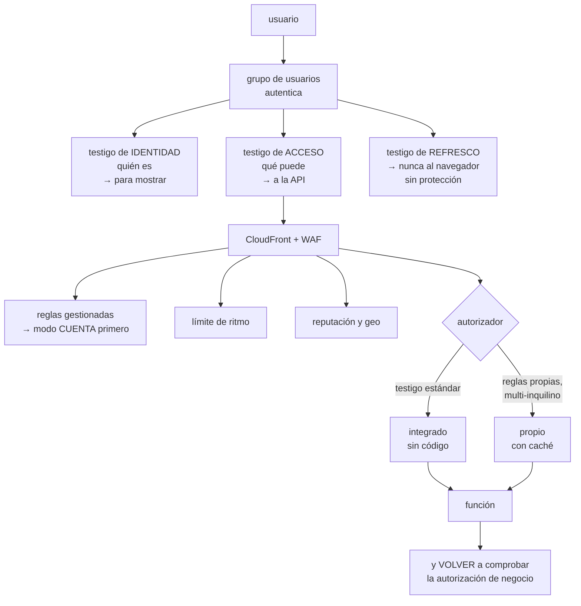

# 209 — Cognito, JWT authorizers, WAF y defensa en profundidad

> [← Clase anterior](../../part-17-aws-production-architecture/208-dynamodb-por-patrones-de-acceso-y-single-table-design/README.md) · [Índice de la parte](../README.md) · [Clase siguiente →](../../part-17-aws-production-architecture/210-eventbridge-sqs-dlq-replay-e-idempotencia/README.md)

**Parte:** 17 — AWS: arquitectura, automatización y operación en producción<br>
**Nivel:** avanzado · **Horas estimadas:** 4<br>
**Laboratorio:** `security` · **Estado:** `EXECUTABLE_CORE`

## 🎯 Propósito

Resolver la identidad de los usuarios finales y la defensa del perímetro público sin construir nada propio que haya que mantener. La clase cubre Cognito y los testigos que emite, cómo se validan bien —que es donde están los fallos de seguridad reales—, cuándo conviene un autorizador propio y cuándo no, y el filtrado de aplicación con su parte incómoda: **las reglas gestionadas bloquean tráfico legítimo, y desplegarlas en modo bloqueo sin medir antes rompe el negocio**.

## 📚 Resultados de aprendizaje

Al finalizar podrás:

1. **Distinguir** los tres testigos de Cognito y usar cada uno donde corresponde.
2. **Validar** un testigo correctamente, comprobando todo lo que hay que comprobar.
3. **Elegir** entre autorizador integrado y propio con criterio.
4. **Desplegar** filtrado de aplicación sin bloquear tráfico legítimo.
5. **Componer** las capas de defensa sabiendo qué cubre cada una.

## 🧩 Conceptos centrales

| Concepto | Comprensión verificable |
|---|---|
| `grupo de usuarios` | Directorio de usuarios finales que autentica y emite testigos. Es el proveedor de identidad. |
| `grupo de identidades` | Componente que canjea un testigo por credenciales temporales de AWS. Cosa distinta del anterior. |
| `testigo de identidad` | Contiene quién es el usuario. Sirve para mostrar datos, no para autorizar llamadas. |
| `testigo de acceso` | Contiene qué puede hacer, con sus ámbitos. Es el que se envía a la API. |
| `autorizador` | Componente de la pasarela que valida el testigo antes de invocar la función. |
| `modo cuenta` | Despliegue de una regla de filtrado que registra lo que bloquearía sin bloquearlo. |

## 🧠 Modelo mental

AWS se aprende como una progresión operativa: identidad federada, infraestructura declarativa, entrega, señales, recuperación y costo controlado.

Aplicado a esta clase, separa siempre cuatro planos: **intención** (qué necesita el usuario),
**configuración** (qué declaramos), **estado observado** (qué existe de verdad) y
**evidencia** (cómo sabemos que cumple). Confundirlos produce diseños que se ven correctos
en un diagrama pero fallan al operar.

## 🗺️ Flujo de razonamiento



## 📖 Desarrollo

### 1. Los tres testigos, y cuál va a dónde

Cognito emite tres testigos y confundirlos es la causa de la mitad de los problemas.

```text
TESTIGO DE IDENTIDAD
  dice QUIÉN es el usuario: nombre, correo, atributos
  destinado a la aplicación cliente, para mostrar datos
  ✗ NO se usa para autorizar llamadas a la API
  → su audiencia es el cliente, no la API

TESTIGO DE ACCESO
  dice QUÉ puede hacer: ámbitos, grupos, cliente
  es el que se envía en la cabecera de autorización
  ✓ este es el que valida la API

TESTIGO DE REFRESCO
  sirve para obtener testigos nuevos sin volver a
  autenticarse
  vida larga (días o meses)
  ✗ NUNCA en almacenamiento accesible por scripts del
    navegador
  → cookie con marca de solo servidor, o almacenamiento
    seguro del dispositivo
```

Y el error de diseño más frecuente:

```text
enviar el testigo de identidad a la API porque «trae el
correo del usuario»
→ la API acaba autorizando con un testigo que no era para
  ella
→ y si la aplicación cliente cambia, la API se rompe

si la API necesita el correo, se añade como ámbito o se
busca por el identificador del sujeto
```

**El grupo de identidades**, que es otra cosa y se confunde con el anterior:

```text
GRUPO DE USUARIOS      autentica personas y emite testigos
GRUPO DE IDENTIDADES   canjea un testigo por credenciales
                       temporales de AWS

→ el segundo solo hace falta si el cliente debe llamar
  DIRECTAMENTE a servicios de AWS (subir a un bucket, por
  ejemplo)
→ y entonces el rol que recibe debe estar restringido al
  prefijo del propio usuario, no al bucket entero
                                                clase 134
```

Y una advertencia sobre el acceso directo desde el cliente:

```text
dar credenciales de AWS al navegador amplía mucho el alcance
→ si es evitable, mejor una URL prefirmada emitida por la
  API, con vida corta y ámbito exacto
```

### 2. Validar bien un testigo

Aquí están los fallos de seguridad reales, y son siempre los mismos.

```text
LO QUE HAY QUE COMPROBAR, SIN SALTARSE NADA

1  LA FIRMA, contra las claves públicas del emisor
   ✗ el fallo grave: decodificar sin verificar
     → cualquiera puede fabricar un testigo

2  EL ALGORITMO ESPERADO
   ✗ aceptar el algoritmo que diga el testigo
     → «ninguno» o cambio a algoritmo simétrico con la
       clave pública como secreto

3  EL EMISOR
   ✗ no comprobarlo → vale un testigo de otro directorio

4  LA AUDIENCIA (o el cliente)
   ✗ no comprobarla → vale un testigo emitido para otra
     aplicación del mismo directorio

5  EL USO DEL TESTIGO
   comprobar que es de acceso y no de identidad

6  LA CADUCIDAD, con margen de reloj pequeño

7  LOS ÁMBITOS o grupos que exige esta operación
```

Y el detalle operativo que rompe en producción:

```text
LAS CLAVES PÚBLICAS SE CACHEAN
  descargarlas en cada petición añade latencia y depende
  del emisor
  cachearlas para siempre rompe cuando rotan
  → cachear con caducidad y refrescar si aparece un
    identificador de clave desconocido
```

**El autorizador de la pasarela**, con la elección:

```text
INTEGRADO (validación de testigo estándar)
  la pasarela valida firma, emisor, audiencia y ámbitos
  sin código propio
  + nada que mantener, sin arranque en frío, gratis
  − no puede decidir con lógica de negocio

PROPIO (función autorizadora)
  código que devuelve permitido o denegado, y contexto
  + reglas propias: multi-inquilino, listas, permisos finos
  − una función más en el camino crítico
  − CACHÉ obligatoria, o se ejecuta en cada petición

  y el detalle de la caché
    la clave de caché debe incluir lo que hace variar la
    decisión
    → si solo cachea por el testigo y la decisión depende
      del recurso, autoriza de más   ← fallo de seguridad
```

Y la regla que este programa mantiene:

```text
el autorizador comprueba QUE EL TESTIGO ES VÁLIDO
la función vuelve a comprobar QUE ESTE USUARIO PUEDE HACER
ESTO CON ESTE RECURSO

→ un pedido no se lee porque el testigo sea válido, sino
  porque el pedido es de ese cliente
→ y esa comprobación no la puede hacer la pasarela
```

Y el fallo que resulta de olvidarlo:

```text
referencia directa insegura
  GET /pedidos/4471 con un testigo válido de otro cliente
  → si la función no comprueba la propiedad, devuelve el
    pedido ajeno
→ es de los hallazgos más frecuentes en revisiones
                                                clase 189
```

### 3. Filtrado de aplicación sin romper el negocio

El filtrado de aplicación se despliega mal casi siempre, y la forma de hacerlo bien es lenta a propósito.

```text
LO QUE APORTA
  reglas gestionadas contra ataques conocidos
  límite de ritmo por dirección o por identificador
  reputación de origen y bloqueo por geografía
  reglas propias por ruta y por cabecera

LO QUE HAY QUE SABER ANTES
  las reglas gestionadas producen FALSOS POSITIVOS
  → bloquean peticiones legítimas con contenido que parece
    un ataque
  → un campo de texto libre con comillas, una descripción
    con SQL de ejemplo, un cuerpo grande
```

Y por eso el despliegue tiene un orden obligatorio:

```text
1  DESPLEGAR EN MODO CUENTA
   registra lo que bloquearía, sin bloquear

2  MEDIR 2-4 SEMANAS
   ¿cuántas peticiones bloquearía? ¿cuáles son legítimas?

3  AJUSTAR
   excluir reglas concretas en rutas concretas
   excluir campos del cuerpo que dan falsos positivos
   → NO desactivar el grupo entero

4  ACTIVAR EL BLOQUEO por grupos de reglas, no todo a la vez

5  VIGILAR los bloqueos y revisarlos
   → cada bloqueo legítimo es un ajuste pendiente

→ activar en bloqueo el primer día es como cerrar la salida
  sin registrar antes                            clase 200
```

Y el límite de ritmo, que es la regla que más aporta y la más fácil:

```text
por dirección de origen: protege de lo básico
por identificador de usuario o de sesión: protege mejor
por ruta: el registro y el acceso llevan límites más
  estrictos que el catálogo

y hay que decidir qué se devuelve al bloquear
  429 con cabecera de reintento es honesto y ayuda al
  cliente legítimo
```

**Dónde poner el filtrado**, que tiene consecuencias:

```text
en CloudFront    filtra en el borde, antes de la pasarela
                 → más barato: lo bloqueado no llega
                 → y protege también el contenido estático
en la pasarela   filtra ahí; si hay CloudFront delante, se
                 duplica
en el balanceador para arquitecturas con contenedores
                                                clase 212

→ con CloudFront delante, ponerlo ahí y restringir la
  pasarela para que SOLO acepte tráfico de esa distribución
  → si no, se puede saltar el filtro llamando a la pasarela
    directamente                                clase 205
```

### 4. Capas, y qué cubre cada una

La defensa en profundidad se cita mucho y se comprueba poco. Lo útil es saber **qué cubre cada capa y qué no**.

```text
CAPA                  CUBRE                     NO CUBRE
filtrado en el borde  ataques conocidos,        lógica de
                      volumen, geografía        negocio

autorizador           testigo inválido,         si ESTE usuario
                      caducado, de otro         puede ver ESTE
                      emisor                    recurso

función               propiedad del recurso,    testigo robado
                      reglas de negocio

permisos de la        alcance del código        errores de
función               si es comprometido        lógica

datos                 cifrado, perímetro        acceso legítimo
                                                mal usado
```

Y las comprobaciones que corresponden a esta clase:

```text
☐ llamar a la API con un testigo de identidad en vez de
  acceso                            → debe fallar
☐ llamar con un testigo de otra aplicación del mismo
  directorio                        → debe fallar
☐ llamar con un testigo caducado    → debe fallar
☐ llamar con la firma alterada      → debe fallar
☐ llamar con algoritmo «ninguno»    → debe fallar
☐ pedir el pedido de otro cliente con testigo válido
                                    → debe fallar
☐ llamar a la pasarela saltándose la distribución
                                    → debe fallar
☐ superar el límite de ritmo        → 429, no 500
☐ enviar una carga de ataque conocida → bloqueada
☐ enviar texto legítimo con comillas → NO bloqueada
```

Y la última es tan importante como las demás: **una defensa que bloquea a los clientes es un incidente**.

**Lo que hay que vigilar:**

```text
autorizaciones denegadas, por motivo
  → un pico de «firma inválida» es alguien probando
  → un pico de «caducado» suele ser un fallo de refresco
    en el cliente
bloqueos del filtrado, por regla
límite de ritmo alcanzado, por ruta
intentos de autenticación fallidos por usuario
y el uso de testigos de refresco
```

Y dos decisiones operativas que conviene tomar pronto:

```text
DURACIÓN DE LOS TESTIGOS
  acceso   corta (15-60 min): limita el daño de uno robado
  refresco larga, pero REVOCABLE
  → y hay que tener probado cómo se revoca a un usuario
    concreto                                      ley 22

QUÉ PASA CUANDO EL DIRECTORIO NO RESPONDE
  los testigos ya emitidos siguen valiendo hasta caducar
  → la validación no llama al directorio en cada petición
  → pero no se pueden emitir nuevos: los usuarios ya dentro
    siguen; los que entran, no
  → conviene saberlo antes de calcular el techo de
    disponibilidad                              clase 185
```

Y la lista de comprobación de la clase:

```text
☐ la API valida el testigo de ACCESO, no el de identidad
☐ se comprueban firma, algoritmo, emisor, audiencia, uso y
  caducidad
☐ las claves públicas se cachean con caducidad y se
  refrescan ante clave desconocida
☐ el testigo de refresco no es accesible desde scripts
☐ si hay autorizador propio, su caché incluye lo que hace
  variar la decisión
☐ la función comprueba la propiedad del recurso
☐ el filtrado se desplegó en modo cuenta antes de bloquear
☐ hay límite de ritmo por ruta y por usuario
☐ la pasarela solo acepta tráfico de la distribución
☐ la revocación de un usuario está probada
☐ las diez pruebas negativas se han ejecutado
```

Y el cierre que enlaza con la clase siguiente: con la entrada protegida, el trabajo que no puede hacerse en la petición se envía a procesar más tarde, y ahí aparecen los duplicados, los mensajes fallidos y el reproceso. Bus de eventos, colas, cola de fallidos e idempotencia es la materia de la clase 210.

## 🔬 Ejemplo trabajado

**CloudShop protege su API pública. Lo que sigue son los tres fallos que encontró la revisión de seguridad, el despliegue del filtrado que empezó rompiendo el registro de usuarios, y el estado final con sus pruebas negativas.**

**Fallo 1 · La API validaba el testigo equivocado.**

```text
el cliente enviaba el testigo de IDENTIDAD
el autorizador estaba configurado para aceptarlo
razón   «trae el correo, que la API necesita»

lo que eso permitía
  el testigo de identidad no lleva ámbitos
  → la API no podía distinguir un usuario normal de uno
    con permisos de administración
  → la distinción se hacía leyendo un atributo del testigo
    que el propio usuario podía modificar desde su perfil

  la prueba negativa
    un usuario cambió su atributo «rol» a «admin» desde la
    pantalla de perfil
    → obtuvo acceso al panel de administración
    tiempo desde la idea hasta conseguirlo: 4 minutos

corrección
  la API valida el testigo de ACCESO
  los permisos vienen de GRUPOS del directorio, no de
  atributos editables por el usuario
  el atributo «rol» se eliminó de los editables
  y el correo se obtiene por el identificador del sujeto
```

**Fallo 2 · La función no comprobaba la propiedad.**

```text
GET /pedidos/{id}
  el autorizador validaba el testigo    ✓
  la función devolvía el pedido          ✗ sin comprobar de
                                           quién era

la prueba
  un usuario con sesión válida pidió /pedidos/4471
  → recibió el pedido de otro cliente, con dirección,
    teléfono e importe

y los identificadores eran secuenciales
  → se podían recorrer todos                    clase 189

corrección
  la función comprueba que el pedido pertenece al sujeto
  del testigo
  → y como el modelo tiene el pedido bajo CLIENTE#, la
    comprobación es la propia clave de la consulta
                                                clase 208
  identificadores cambiados a opacos
  y la comprobación añadida como prueba negativa permanente
```

**Fallo 3 · Se podía saltar el filtrado.**

```text
el filtrado estaba en CloudFront
la pasarela aceptaba peticiones de cualquier origen
→ llamando a la URL de la pasarela directamente se
  saltaba el filtrado, el límite de ritmo y los registros

se comprobó en los registros de acceso
  peticiones directas a la pasarela                8.400/día
  de ellas, de rastreadores y escáneres            7.900
  de ellas, de un cliente móvil antiguo mal
    configurado                                      500

corrección
  la pasarela exige una cabecera secreta que solo añade la
  distribución, y rechaza el resto
  el cliente móvil antiguo se corrigió en la versión
  siguiente, con un plazo de 8 semanas para la retirada
                                                clase 188
```

**El despliegue del filtrado, que empezó mal.**

```text
primer intento, febrero
  se activaron 4 grupos de reglas gestionadas en modo
  BLOQUEO, el mismo día

  a las 3 horas
    el registro de usuarios nuevos había caído un 34 %
    nadie relacionó las dos cosas

  a los 2 días, atención al cliente reportó que había
  usuarios que no podían registrarse

  causa
    una regla gestionada bloqueaba cuerpos con ciertos
    patrones
    los apellidos con apóstrofo —O'Brien, D'Angelo— y las
    direcciones con comillas coincidían
    → 1 de cada 3 registros con esos caracteres se
      bloqueaba, devolviendo un 403 sin explicación

  pérdida estimada                       2 días × 34 %
                                         de registros

segundo intento, marzo, con el orden correcto
  1  los 4 grupos en MODO CUENTA
  2  medición de 3 semanas
       peticiones que se bloquearían            41.200
       claramente maliciosas                    38.900
       LEGÍTIMAS                                 2.300
         · apellidos y direcciones con apóstrofo
         · descripciones de producto de proveedores con
           fragmentos de HTML
         · un cliente que subía ficheros grandes por la API
  3  ajustes
       exclusión de la regla concreta en el campo de
         apellido y dirección, en la ruta de registro
       exclusión en el campo de descripción de la ruta de
         catálogo interno
       límite de tamaño ajustado en la ruta de subida
       → NO se desactivó ningún grupo entero
  4  bloqueo activado grupo a grupo, con una semana entre
     cada uno
  5  revisión semanal de bloqueos

  resultado tras 6 meses
    peticiones bloqueadas                     36.400/mes
    bloqueos legítimos reportados                     4
    → los 4, ajustados en menos de un día
```

**El límite de ritmo, por ruta:**

```text
ruta                        límite            motivo
/auth/login                 5 / 5 min / IP    fuerza bruta
/auth/registro              3 / hora / IP     cuentas falsas
/api/pedidos (POST)         20 / min /usuario abuso
/api/catalogo               600 / min / IP    tráfico normal
resto                       2.000 / 5 min /IP suelo general

respuesta al bloquear   429 con cabecera de reintento
```

**Las diez pruebas negativas, ejecutadas:**

```text
✓  testigo de identidad en vez de acceso        rechazado
✓  testigo de otra aplicación del directorio    rechazado
✓  testigo caducado                             rechazado
✓  firma alterada                               rechazado
✓  algoritmo «ninguno»                          rechazado
✓  pedido de otro cliente con testigo válido    rechazado
✓  llamada directa a la pasarela                rechazada
✓  superar el límite de ritmo                   429 correcto
✓  carga de ataque conocida                     bloqueada
✓  apellido con apóstrofo                       NO bloqueado
```

Y una prueba adicional que se añadió tras el incidente:

```text
✓  registrar un usuario llamado O'Brien, con dirección
   «Rúa d'Ouro, 3», y una descripción con <b>negrita</b>
   → los tres pasan
   → se ejecuta en cada despliegue del filtrado
```

**El resultado:**

```text                                        antes     después
escalada de privilegios por atributo         posible   imposible
lectura de pedidos ajenos                    posible   imposible
peticiones que saltan el filtrado          8.400/día         0
registros bloqueados por falso positivo      34 %       0,01 %
intentos de fuerza bruta que llegan a
  la función                                 todos           0
coste del filtrado                              —      210 €/mes
coste de cómputo evitado por bloquear
  en el borde                                   —     -390 €/mes
```

**La lección que esta clase deja**: los tres fallos de seguridad **no estaban en la configuración del filtrado ni del directorio**: estaban en usar el testigo equivocado, en no comprobar de quién era el recurso y en dejar un camino que se saltaba todo. Y el incidente más caro del capítulo lo causó **la propia defensa**: activar las reglas gestionadas en modo bloqueo el primer día tumbó un tercio de los registros durante dos días, y a nadie se le ocurrió relacionarlo hasta que llamó un cliente apellidado O'Brien.

## 🧪 Laboratorio guiado

Ejecuta desde la raíz:

```bash
python classes/part-17-aws-production-architecture/209-cognito-jwt-authorizers-waf-y-defensa-en-profundidad/lab.py
```

El laboratorio selecciona el motor de práctica **`security`** y produce
`lab_result.json`. El escenario, sus comprobaciones y el artefacto esperado corresponden a
esta clase; no requiere credenciales y deja explícito qué debe revalidarse en un sandbox real.

1. Lee `exercise.steps` y formula una predicción antes de ejecutar.
2. Ejecuta la práctica y verifica todos los elementos de `checks`.
3. Provoca el caso de `negative_test` y explica la señal observada.
4. Materializa `aws-identity-edge` en `evidence/` usando la plantilla indicada.
5. Para proveedor real, sigue `sandbox.requires`, registra costo y ejecuta `destroy`.

### Evidencia esperada

El artefacto principal es un control con amenaza, mitigación y evidencia. Además, la entrega debe incluir el comando ejecutado,
la salida estructurada y una conclusión que no exceda lo observado.

## 🏆 Reto verificable

Construye **`aws-identity-edge`** para el caso CloudShop. Incluye una alternativa descartada,
un supuesto que pueda falsarse, una prueba de fallo y una decisión de rollback.

## ✅ Criterio de aceptación

- [ ] `lab.py` termina con código 0 y genera JSON válido.
- [ ] La entrega conecta al menos tres requisitos con mecanismos verificables.
- [ ] Existe una prueba positiva y una prueba negativa con evidencia.
- [ ] Seguridad, costo y operación aparecen como decisiones, no como anexos.
- [ ] Se declara una limitación y una condición que obligaría a revisar el diseño.
- [ ] Otra persona puede repetir el recorrido sin conocimiento tácito.

## ⚠️ Errores frecuentes

| Síntoma | Causa probable | Corrección |
|---|---|---|
| Un usuario se concede permisos de administración editando su perfil | La autorización se basa en un atributo del testigo de identidad que el usuario puede modificar | Valida el testigo de acceso y deriva los permisos de grupos del directorio, no de atributos editables. |
| Un usuario válido lee recursos de otro | El autorizador valida el testigo pero la función no comprueba la propiedad del recurso | Comprueba en la función que el recurso pertenece al sujeto del testigo, y usa identificadores opacos. |
| Se puede evitar el filtrado llamando a la pasarela directamente | La pasarela acepta tráfico de cualquier origen | Exige una cabecera secreta que solo añade la distribución y rechaza el resto. |
| Cae el registro de usuarios tras activar el filtrado | Reglas gestionadas en modo bloqueo desde el primer día, con falsos positivos | Despliega en modo cuenta, mide semanas, excluye reglas concretas en campos concretos y activa el bloqueo por grupos. |
| Un autorizador propio autoriza de más | La clave de caché no incluye lo que hace variar la decisión | Incluye en la clave de caché el recurso y cuanto influya en el resultado, o desactiva la caché. |
| El cliente pierde la sesión cada poco o la mantiene demasiado | Duraciones de testigo mal elegidas y refresco mal guardado | Testigo de acceso corto, refresco largo pero revocable y guardado fuera del alcance de scripts, con revocación probada. |

## 🛡️ Seguridad, ética y costo

Trabaja con cuentas propias o sandboxes autorizados. No publiques secretos, identificadores
reales ni datos personales. Antes de crear recursos pagos define presupuesto, etiquetas y
comando de destrucción; después verifica que no queden recursos huérfanos. Los ejemplos
locales enseñan contratos, pero no certifican cumplimiento ni disponibilidad de producción.

## ❓ Preguntas de comprobación

1. ¿Qué diferencia hay entre el testigo de identidad y el de acceso, y cuál va a la API?
2. ¿Qué siete comprobaciones exige validar bien un testigo?
3. ¿Qué comprueba el autorizador y qué debe volver a comprobar la función?
4. ¿Por qué no se despliega el filtrado en modo bloqueo el primer día?
5. ¿Qué ocurre con los testigos ya emitidos si el directorio deja de responder?

## 🔗 Referencias

- AWS (2025). *Amazon Cognito user pools: using tokens*. <https://docs.aws.amazon.com/cognito/latest/developerguide/amazon-cognito-user-pools-using-tokens-with-identity-providers.html>
- AWS (2025). *Verifying a JSON Web Token*. <https://docs.aws.amazon.com/cognito/latest/developerguide/amazon-cognito-user-pools-using-tokens-verifying-a-jwt.html>
- AWS (2025). *AWS WAF: testing rules in count mode*. <https://docs.aws.amazon.com/waf/latest/developerguide/web-acl-testing.html>
- OWASP (2025). *API Security Top 10: broken object level authorization*. <https://owasp.org/API-Security/editions/2023/en/0xa1-broken-object-level-authorization/>
- RFC 8725 — JSON Web Token best current practices. <https://www.rfc-editor.org/rfc/rfc8725>
- Documentación oficial vigente del servicio implementado; registra URL y fecha de consulta.

---

> [Evaluación](assessment.md) · [Contrato de clase](lesson.yaml) · [Índice de la parte](../README.md)
