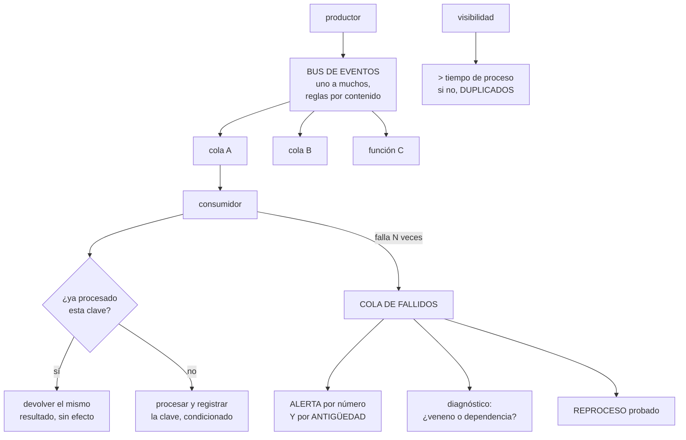

# 210 — EventBridge, SQS, DLQ, replay e idempotencia

> [← 209 · Cognito, JWT authorizers, WAF y defensa en profundidad](../../part-17-aws-production-architecture/209-cognito-jwt-authorizers-waf-y-defensa-en-profundidad/README.md) · [Índice de la parte](../README.md) · [211 · CloudWatch, X-Ray y observabilidad como código →](../../part-17-aws-production-architecture/211-cloudwatch-x-ray-y-observabilidad-como-codigo/README.md)

**Parte:** 17 — AWS: arquitectura, automatización y operación en producción<br>
**Nivel:** avanzado · **Horas estimadas:** 4<br>
**Laboratorio:** `messaging` · **Estado:** `EXECUTABLE_CORE`

## 🎯 Propósito

Procesar trabajo fuera de la petición sin perder mensajes, sin duplicar efectos y sin quedarse con una cola de fallidos que nadie mira. La clase distingue el bus de eventos de la cola por lo que cada uno resuelve, fija los parámetros que de verdad importan —visibilidad, reintentos, lotes—, y desarrolla las dos cosas que este programa lleva señalando desde la parte 09: **la idempotencia no es opcional y la cola de fallidos sin alerta ni procedimiento de reproceso es una pérdida de datos en diferido**.

## 📚 Resultados de aprendizaje

Al finalizar podrás:

1. **Elegir** entre bus de eventos, cola y flujo según lo que haga falta.
2. **Configurar** visibilidad, reintentos y lotes de forma coherente.
3. **Implementar** idempotencia con clave y escritura condicionada.
4. **Operar** la cola de fallidos con alerta, diagnóstico y reproceso.
5. **Evitar** los tres fallos que arruinan estos sistemas.

## 🧩 Conceptos centrales

| Concepto | Comprensión verificable |
|---|---|
| `bus de eventos` | Encaminador que entrega un evento a varios destinos según reglas de contenido. Uno a muchos. |
| `cola` | Almacén de mensajes con un consumidor lógico, entrega al menos una vez y control de visibilidad. |
| `tiempo de visibilidad` | Plazo durante el que un mensaje tomado no se entrega a otro consumidor. Debe superar el tiempo de proceso. |
| `cola de fallidos` | Destino de los mensajes que agotaron sus reintentos. Sin alerta ni reproceso, es una papelera. |
| `idempotencia` | Que procesar el mismo mensaje dos veces produzca el mismo resultado que procesarlo una. |
| `fallo parcial de lote` | Informar de qué elementos del lote fallaron para que solo esos se reintenten. |

## 🧠 Modelo mental

AWS se aprende como una progresión operativa: identidad federada, infraestructura declarativa, entrega, señales, recuperación y costo controlado.

Aplicado a esta clase, separa siempre cuatro planos: **intención** (qué necesita el usuario),
**configuración** (qué declaramos), **estado observado** (qué existe de verdad) y
**evidencia** (cómo sabemos que cumple). Confundirlos produce diseños que se ven correctos
en un diagrama pero fallan al operar.

## 🗺️ Flujo de razonamiento



## 📖 Desarrollo

### 1. Bus, cola y flujo: qué resuelve cada uno

Los tres transportan mensajes y no son intercambiables.

```text
BUS DE EVENTOS (EventBridge)
  encamina un evento a VARIOS destinos según reglas sobre
  su contenido
  + desacopla al productor de sus consumidores: añadir un
    consumidor no toca al productor              clase 148
  + reglas declarativas, archivo y reproducción
  + integración con eventos del propio proveedor
  − no garantiza orden
  − sin control fino de reintentos por consumidor

COLA (SQS)
  almacena mensajes para UN consumidor lógico
  + control de visibilidad, reintentos y cola de fallidos
  + amortigua picos: el consumidor va a su ritmo
  + variante ordenada con agrupación por clave
  − uno a uno; para varios consumidores hacen falta varias
    colas

FLUJO (Kinesis)
  registro ordenado por partición, con varios lectores
  independientes y reproducción por posición
  + orden dentro de la partición y reproceso desde un punto
  − capacidad por fragmento; el reparto se decide con la
    clave                                        clase 116
```

Y el patrón que combina bien y es el habitual:

```text
productor → BUS → regla → COLA → función

por qué la cola en medio y no la función directamente
  amortigua picos: la función consume a su ritmo
  da reintentos controlados y cola de fallidos
  y protege a la base de la concurrencia         clase 207

→ conectar el bus directamente a la función pierde las tres
```

Y la decisión sobre el contenido del mensaje:

```text
HECHO CON DATOS   «pedido confirmado» + los datos
  + el consumidor no necesita llamar de vuelta
  − el mensaje envejece; hay que versionarlo   clase 188

SOLO REFERENCIA   «pedido 4471 confirmado»
  + mensaje pequeño y siempre válido
  − cada consumidor llama al productor: N llamadas más
  − y si el productor está caído, no se puede procesar

→ en general, HECHO CON LOS DATOS que el consumidor
  necesita, versionado y con esquema validado en el
  productor                                     clase 188
```

### 2. Los parámetros que importan

Los valores por defecto de una cola producen duplicados y pérdidas. Estos son los que hay que decidir.

```text
TIEMPO DE VISIBILIDAD
  cuánto tiempo un mensaje tomado queda invisible

  REGLA   visibilidad > tiempo máximo de proceso
          típicamente 6 veces el plazo de la función

  si es MENOR que el proceso
    el mensaje reaparece mientras aún se está procesando
    → otro consumidor lo coge
    → DOS ejecuciones del mismo mensaje
    → y el síntoma es «duplicados aleatorios bajo carga»

RECUENTO MÁXIMO DE RECEPCIONES
  cuántas veces se reintenta antes de ir a la cola de
  fallidos
  demasiado bajo   un fallo transitorio pierde el mensaje
  demasiado alto   un mensaje venenoso bloquea durante horas
  típico   3 a 5

TAMAÑO DE LOTE
  cuántos mensajes recibe la función por invocación
  lote grande   más eficiente, menos invocaciones
  lote grande   y un fallo reintenta EL LOTE ENTERO
  → salvo que se informe de fallo parcial

FALLO PARCIAL DE LOTE
  la función devuelve qué identificadores fallaron
  → solo esos se reintentan
  → SIN esto, un mensaje malo en un lote de 10 hace que
    los 9 buenos se reprocesen una y otra vez
  → y si no son idempotentes, se duplican nueve efectos

RETENCIÓN
  cuánto vive un mensaje en la cola: hasta 14 días
  → y en la cola de fallidos conviene el máximo, para tener
    tiempo de reprocesar

ESPERA LARGA
  el consumidor espera si no hay mensajes
  → menos peticiones vacías, menos coste y menos latencia
  → debería estar siempre activada
```

Y una relación que hay que respetar:

```text
visibilidad ≥ plazo de la función × tamaño de lote
→ porque la función procesa el lote entero dentro de un
  solo tiempo de visibilidad
```

Y el orden, cuando hace falta:

```text
la cola ordenada garantiza orden DENTRO de un grupo
  → el grupo es la clave: cliente, pedido, cuenta
  → y limita el caudal por grupo

y la pregunta previa
  ¿de verdad hace falta orden, o basta con que las
  operaciones sean conmutativas?              clase 203
  → «−1 unidad» no necesita orden; «stock = 4», sí
```

### 3. Idempotencia, en concreto

Con entrega al menos una vez, reintentos y lotes, **el mismo mensaje se procesará dos veces**. No es una posibilidad remota: ocurre.

```text
DE DÓNDE VIENEN LOS DUPLICADOS
  visibilidad menor que el proceso
  reintento tras un plazo vencido en el que el trabajo sí
    se hizo
  lote reintegrado entero por un solo elemento fallido
  el productor que reintenta al no recibir confirmación
  y el reproceso desde la cola de fallidos
```

**El mecanismo**, en tres piezas:

```text
1  CLAVE DE IDEMPOTENCIA
   identificador del mensaje, o del suceso de negocio
   → nunca generada por el consumidor
   → y debe ser la misma en el reintento: si el productor
     genera una nueva cada vez, no sirve de nada

2  REGISTRO DE CLAVES PROCESADAS
   tabla con la clave, el resultado y una caducidad
   → la caducidad debe superar la retención de la cola

3  ESCRITURA CONDICIONADA, antes del efecto
   «inserta esta clave si no existe»
   si falla la condición → ya se procesó: devolver el
   resultado guardado
   si tiene éxito → procesar
```

Y el detalle que decide si funciona:

```text
¿QUÉ PASA SI EL PROCESO FALLA DESPUÉS DE REGISTRAR LA
CLAVE?
  el mensaje se reintenta, ve la clave y no hace nada
  → el efecto NUNCA se produce

→ por eso el registro se hace en tres estados
    EN CURSO   con caducidad corta
    HECHO      con el resultado
    y si un reintento encuentra EN CURSO caducado, lo
    reclama
```

Y la alternativa que evita todo esto cuando se puede:

```text
OPERACIONES NATURALMENTE IDEMPOTENTES
  «poner el estado a ENVIADO» lo es
  «incrementar el contador» no lo es
  «insertar con clave única del negocio» lo es

→ modelar la operación como asignación en vez de como
  incremento resuelve el problema sin infraestructura
                                                clase 149
```

Y la prueba que hay que ejecutar:

```text
enviar el mismo mensaje 50 veces en paralelo
→ un solo efecto, 50 respuestas idénticas         ley 22
```

### 4. La cola de fallidos, operada de verdad

La cola de fallidos se configura y luego se olvida. Este programa la ha visto llena y sin mirar en la clase 120 y en la 132.

```text
LO QUE PASA SI NADIE LA MIRA
  los mensajes caducan a los 14 días
  → pérdida de datos silenciosa                    ley 13
  → y cuando se descubre, ya no se pueden recuperar
```

**Lo que hace falta**, en cuatro piezas:

```text
1  ALERTA POR NÚMERO Y POR ANTIGÜEDAD
   «hay mensajes» es la alerta obvia
   «hay un mensaje de más de 1 hora» es la que sirve
   → la antigüedad detecta el goteo que el número esconde

2  DIAGNÓSTICO: ¿por qué está ahí?
   VENENO       el mensaje es incorrecto y fallará siempre
     → esquema inválido, campo que falta, dato imposible
     → reprocesarlo no sirve; hay que corregir o descartar
   DEPENDENCIA  el mensaje es correcto y algo estaba caído
     → reprocesar funciona
   CÓDIGO       un fallo de la función
     → corregir y reprocesar

   → y para distinguirlos hay que guardar el motivo del
     fallo con el mensaje

3  REPROCESO PROBADO
   un procedimiento —no un comando improvisado— que
     mueve mensajes de la cola de fallidos a la principal
     con límite de ritmo, para no tumbar lo que se
       recuperó
     y con posibilidad de reprocesar uno solo
   → y probado antes de necesitarlo                ley 22

4  DESCARTE EXPLÍCITO
   los mensajes veneno se descartan a propósito, con
   registro de quién y por qué
   → no se dejan caducar
```

Y una advertencia sobre el reproceso masivo:

```text
reprocesar 40.000 mensajes de golpe
  → dispara la concurrencia
  → tumba la base                                clase 207
  → y genera una segunda tanda de fallidos

→ reproceso con límite de ritmo, y por lotes
```

**Los tres fallos que arruinan estos sistemas**, resumidos:

```text
1  visibilidad menor que el proceso  → duplicados
2  sin idempotencia                  → duplicados con efecto
3  cola de fallidos sin alerta ni    → pérdida silenciosa
   reproceso
```

**Lo que hay que vigilar:**

```text
antigüedad del mensaje más viejo en la cola  ← la clave
profundidad de la cola y su tendencia
mensajes en la cola de fallidos, y su antigüedad
invocaciones fallidas del consumidor
recepciones repetidas del mismo mensaje
  → señal directa de visibilidad mal puesta
y el retraso entre que ocurre el hecho y se procesa
  → es la medida que le importa al negocio
```

Y la lista de comprobación de la clase:

```text
☐ el bus se usa para uno a muchos y la cola para amortiguar
☐ hay cola entre el bus y la función, no conexión directa
☐ los eventos son hechos con datos, versionados y validados
☐ la visibilidad supera el proceso máximo por lote
☐ el recuento de reintentos está decidido, no por defecto
☐ el fallo parcial de lote está activado
☐ la espera larga está activada
☐ toda operación con efecto es idempotente
☐ la clave de idempotencia la genera el productor
☐ el registro de claves distingue en curso de hecho
☐ hay alerta por antigüedad en la cola de fallidos
☐ se guarda el motivo del fallo con el mensaje
☐ el procedimiento de reproceso existe y se ha ejecutado
☐ el reproceso tiene límite de ritmo
☐ los mensajes veneno se descartan con registro
```

Y el cierre que enlaza con la clase siguiente: con la API, el almacén, la seguridad y el proceso asíncrono en pie, falta saber qué está pasando cuando algo va mal. Observabilidad en AWS, definida como código, es la materia de la clase 211.

## 🔬 Ejemplo trabajado

**CloudShop procesa la confirmación de pedidos de forma asíncrona. Lo que sigue son los duplicados que aparecieron bajo carga, la cola de fallidos con 41.000 mensajes que nadie miraba, y el reproceso que tumbó la base la primera vez.**

**El montaje inicial:**

```text
función de crear pedido → bus de eventos
  regla «pedido.confirmado» → función de correo
  regla «pedido.confirmado» → función de inventario
  regla «pedido.confirmado» → función de facturación

todo conectado directamente del bus a las funciones
sin colas en medio
sin idempotencia
cola de fallidos configurada en las funciones asíncronas
```

**Problema 1 · Correos duplicados bajo carga.**

```text
síntoma   en campaña, algunos clientes recibían 2 y hasta 3
          correos de confirmación
          en tráfico normal, nunca

diagnóstico
  la invocación asíncrona desde el bus reintenta 2 veces
  ante error
  bajo carga, la función de correo superaba su plazo por
  la latencia del proveedor de correo
  → el envío SÍ se había hecho; el plazo venció al esperar
    la respuesta
  → el bus reintentaba, y se enviaba otra vez

  correos duplicados en la campaña                   1.840
  quejas recibidas                                      61

corrección
  1  cola entre el bus y cada función
     → amortigua, y da control de reintentos propio
  2  idempotencia con el identificador del evento
  3  el plazo de la función subido a 3 × el p99 del
     proveedor, y el envío marcado como hecho ANTES de
     esperar la confirmación final
```

**Problema 2 · Duplicados aleatorios en inventario.**

```text
síntoma   tras añadir las colas, aparecieron descuentos de
          stock duplicados, sin patrón claro

diagnóstico
  tiempo de visibilidad de la cola          30 s (por defecto)
  plazo de la función                       25 s
  tamaño de lote                            10 mensajes
  tiempo real de proceso del lote           hasta 90 s

  → el lote tardaba más que la visibilidad
  → los mensajes reaparecían mientras se procesaban
  → otro consumidor los tomaba

  la relación que se había incumplido
    visibilidad ≥ plazo × tamaño de lote
    30 s  <  25 s × 10

corrección
  visibilidad                              300 s
  tamaño de lote                            10
  plazo de la función                       25 s
  y fallo parcial de lote activado

  y la señal que lo habría detectado antes
    «recepciones repetidas del mismo mensaje»
    → estaba disponible y nadie la miraba          ley 15
```

Y el efecto del fallo parcial de lote:

```text
antes   1 mensaje malo en un lote de 10
        → el lote entero se reintentaba
        → 9 mensajes buenos reprocesados hasta 5 veces
        → 45 efectos duplicados por cada mensaje malo
después → solo el malo se reintenta
```

**Problema 3 · La cola de fallidos con 41.000 mensajes.**

```text
se descubrió al revisar el coste de almacenamiento de colas

  mensajes en la cola de fallidos de facturación     41.200
  el más antiguo                                  13 días
  → 14 días es la retención: a la mañana siguiente
    empezaban a caducar

  alerta configurada   «número de mensajes > 0»
  → sí existía
  → salía a un canal creado en 2023, sin suscriptores
                                          ley 15, clase 194

  qué eran los 41.200
    38.900  fallos de un periodo de 4 horas en que el
            servicio de facturación estuvo caído
            → mensajes CORRECTOS, reprocesables
     2.180  mensajes con un campo nuevo que la función
            antigua no entendía
            → veneno por versión de esquema      clase 188
       120  mensajes con importe negativo, de un error de
            un integrador
            → veneno real
```

**El reproceso, que salió mal la primera vez.**

```text
primer intento
  se movieron los 41.200 mensajes a la cola principal de
  golpe

  a los 40 segundos
    la función de facturación escaló a 2.800 ejecuciones
    la base de datos agotó conexiones           clase 207
    → cayó facturación Y el resto de servicios que usan
      esa base
    → y 9.400 mensajes volvieron a la cola de fallidos

  duración del incidente                          38 min

segundo intento, con procedimiento
  concurrencia reservada de la función           40
  reproceso por lotes de 500, con espera entre lotes
  ritmo efectivo                            ~120 mensajes/s
  duración                                        6 min
  fallos                                             0

y los venenos
  2.180 de esquema  → la función se actualizó primero para
                      tolerar el campo nuevo, y luego se
                      reprocesaron
    120 de importe  → descartados con registro de quién y
                      por qué; y se avisó al integrador
```

**Lo que quedó montado.**

```text
ARQUITECTURA
  productor → bus → regla → COLA → función
  una cola por consumidor, con su cola de fallidos

PARÁMETROS, por consumidor
  consumidor    visibilidad  lote  reintentos  plazo
  correo           180 s      5        3        30 s
  inventario       300 s     10        5        25 s
  facturación      600 s     10        5        50 s
  todos con espera larga y fallo parcial activados

IDEMPOTENCIA
  tabla de claves procesadas, con estados EN CURSO y HECHO
  clave = identificador del evento, generado por el
    productor
  caducidad de la clave: 21 días (> 14 de retención)
  escritura condicionada antes del efecto

  prueba negativa
    mismo mensaje 50 veces en paralelo → 1 efecto      ✓

COLA DE FALLIDOS
  retención al máximo: 14 días
  motivo del fallo guardado como atributo del mensaje
  ALERTAS
    «hay mensajes con más de 1 hora»    → canal de guardia
    «el más antiguo supera 7 días»      → escalado
    → la de antigüedad es la que sirve; la de número se
      dispara con un solo mensaje transitorio
  panel con desglose por motivo

  PROCEDIMIENTO DE REPROCESO
    escrito, con límite de ritmo y por lotes
    con opción de reprocesar un mensaje concreto
    ejecutado por alguien que no lo escribió       ley 22
    → en el primer ensayo, 3 de 9 pasos necesitaron
      aclaración
    tiempo de reproceso de 10.000 mensajes         2 min
```

**El resultado, seis meses después:**

```text                                        antes     después
correos duplicados por campaña             1.840           0
descuentos de stock duplicados               340           0
mensajes en cola de fallidos           41.200 (max)   máx. 92
antigüedad máxima en cola de fallidos     13 días      41 min
mensajes caducados y perdidos          casi 41.200         0
reprocesos ejecutados                          1           7
  que causaron incidente                       1           0
mensajes descartados con registro               0         214
```

**La lección que esta clase deja**: los duplicados no eran aleatorios: eran **visibilidad menor que el proceso del lote**, una relación aritmética que se puede comprobar antes de desplegar. La cola de fallidos tenía cuarenta y un mil mensajes correctos **a un día de caducar**, con una alerta que existía y salía a un canal sin nadie. Y el reproceso, hecho sin procedimiento, **tumbó la base y generó nueve mil cuatrocientos fallidos nuevos**: la recuperación se convirtió en el segundo incidente.

## 🧪 Laboratorio guiado

Ejecuta desde la raíz:

```bash
python classes/part-17-aws-production-architecture/210-eventbridge-sqs-dlq-replay-e-idempotencia/lab.py
```

El laboratorio selecciona el motor de práctica **`messaging`** y produce
`lab_result.json`. El escenario, sus comprobaciones y el artefacto esperado corresponden a
esta clase; no requiere credenciales y deja explícito qué debe revalidarse en un sandbox real.

1. Lee `exercise.steps` y formula una predicción antes de ejecutar.
2. Ejecuta la práctica y verifica todos los elementos de `checks`.
3. Provoca el caso de `negative_test` y explica la señal observada.
4. Materializa `aws-event-platform` en `evidence/` usando la plantilla indicada.
5. Para proveedor real, sigue `sandbox.requires`, registra costo y ejecuta `destroy`.

### Evidencia esperada

El artefacto principal es un flujo que declara orden, entrega y manejo de errores. Además, la entrega debe incluir el comando ejecutado,
la salida estructurada y una conclusión que no exceda lo observado.

## 🏆 Reto verificable

Construye **`aws-event-platform`** para el caso CloudShop. Incluye una alternativa descartada,
un supuesto que pueda falsarse, una prueba de fallo y una decisión de rollback.

## ✅ Criterio de aceptación

- [ ] `lab.py` termina con código 0 y genera JSON válido.
- [ ] La entrega conecta al menos tres requisitos con mecanismos verificables.
- [ ] Existe una prueba positiva y una prueba negativa con evidencia.
- [ ] Seguridad, costo y operación aparecen como decisiones, no como anexos.
- [ ] Se declara una limitación y una condición que obligaría a revisar el diseño.
- [ ] Otra persona puede repetir el recorrido sin conocimiento tácito.

## ⚠️ Errores frecuentes

| Síntoma | Causa probable | Corrección |
|---|---|---|
| Aparecen duplicados solo bajo carga | El tiempo de visibilidad es menor que el proceso del lote y el mensaje reaparece mientras se procesa | Fija visibilidad mayor que plazo por tamaño de lote y vigila las recepciones repetidas del mismo mensaje. |
| Un mensaje incorrecto provoca decenas de efectos duplicados | El lote entero se reintegra por un solo elemento fallido | Activa el informe de fallo parcial de lote para que solo se reintenten los elementos que fallaron. |
| Se pierden mensajes sin que nadie se entere | La cola de fallidos caduca a los 14 días y su alerta va a un canal sin nadie | Alerta por antigüedad además de por número, dirígela a un canal con guardia y comprueba que llega. |
| El reproceso masivo provoca un segundo incidente | Se devolvieron todos los mensajes de golpe y la concurrencia tumbó la base | Reprocesa por lotes con límite de ritmo y concurrencia reservada, siguiendo un procedimiento probado. |
| Reprocesar no arregla nada para parte de los mensajes | Son mensajes veneno: esquema inválido o datos imposibles | Guarda el motivo del fallo, distingue veneno de dependencia, corrige el consumidor antes de reprocesar y descarta lo irreparable con registro. |
| El efecto nunca llega a producirse pese a los reintentos | Se registró la clave de idempotencia y el proceso falló después | Registra en dos estados, en curso con caducidad y hecho con resultado, y permite reclamar los en curso caducados. |

## 🛡️ Seguridad, ética y costo

Trabaja con cuentas propias o sandboxes autorizados. No publiques secretos, identificadores
reales ni datos personales. Antes de crear recursos pagos define presupuesto, etiquetas y
comando de destrucción; después verifica que no queden recursos huérfanos. Los ejemplos
locales enseñan contratos, pero no certifican cumplimiento ni disponibilidad de producción.

## ❓ Preguntas de comprobación

1. ¿Qué resuelve el bus que no resuelve la cola, y por qué conviene poner una cola en medio?
2. ¿Qué relación deben cumplir visibilidad, plazo y tamaño de lote?
3. ¿Qué aporta informar del fallo parcial de un lote?
4. ¿Por qué la alerta por antigüedad es mejor que la de número en la cola de fallidos?
5. ¿Cómo se distingue un mensaje veneno de uno que falló por una dependencia caída?

## 🔗 Referencias

- AWS (2025). *Amazon SQS: visibility timeout and dead-letter queues*. <https://docs.aws.amazon.com/AWSSimpleQueueService/latest/SQSDeveloperGuide/sqs-visibility-timeout.html>
- AWS (2025). *Lambda event source mapping: partial batch responses*. <https://docs.aws.amazon.com/lambda/latest/dg/services-sqs-errorhandling.html>
- AWS (2025). *Amazon EventBridge: rules, archives and replay*. <https://docs.aws.amazon.com/eventbridge/latest/userguide/eb-what-is.html>
- AWS (2025). *Powertools for AWS Lambda: idempotency*. <https://docs.powertools.aws.dev/lambda/python/latest/utilities/idempotency/>
- Hohpe, G. y Woolf, B. (2003). *Enterprise Integration Patterns* — canal de mensajes inválidos y reintentos. <https://www.enterpriseintegrationpatterns.com/>
- Documentación oficial vigente del servicio implementado; registra URL y fecha de consulta.

---

> [Evaluación](assessment.md) · [Contrato de clase](lesson.yaml) · [Índice de la parte](../README.md)

**📥 Descargar:** [Parte 17 en PDF](../../../site/downloads/partes/manual-parte-17-aws-production-architecture.pdf) · [Recorrido de AWS en PDF](../../../site/downloads/nubes/manual-aws.pdf) · [Manual integral](../../../site/downloads/multi-cloud-engineering-manual-v2.0.pdf)

| Anterior | Índice | Siguiente |
|---|---|---|
| [← 209 · Cognito, JWT authorizers, WAF y defensa en profundidad](../../part-17-aws-production-architecture/209-cognito-jwt-authorizers-waf-y-defensa-en-profundidad/README.md) | [Parte 17](../README.md) · [Programa](../../README.md) | [211 · CloudWatch, X-Ray y observabilidad como código →](../../part-17-aws-production-architecture/211-cloudwatch-x-ray-y-observabilidad-como-codigo/README.md) |
