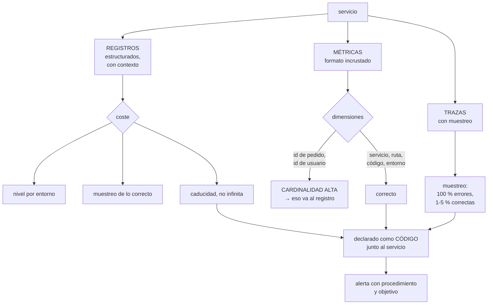

# 211 — CloudWatch, X-Ray y observabilidad como código

> [← 210 · EventBridge, SQS, DLQ, replay e idempotencia](../../part-17-aws-production-architecture/210-eventbridge-sqs-dlq-replay-e-idempotencia/README.md) · [Índice de la parte](../README.md) · [212 · ECR, ECS Fargate, ALB y autoscaling →](../../part-17-aws-production-architecture/212-ecr-ecs-fargate-alb-y-autoscaling/README.md)

**Parte:** 17 — AWS: arquitectura, automatización y operación en producción<br>
**Nivel:** avanzado · **Horas estimadas:** 4<br>
**Laboratorio:** `observability` · **Estado:** `EXECUTABLE_CORE`

## 🎯 Propósito

Montar observabilidad en AWS que sirva para diagnosticar y no para decorar, y declararla como código junto al servicio que la produce. La clase cubre registros estructurados con su coste —que en la clase 207 resultó ser la segunda partida de la factura—, métricas propias sin arruinarse en dimensiones, trazado distribuido con muestreo, y la parte que decide si esto funciona: **la alerta se define en el mismo cambio que el servicio, o no existe**.

## 📚 Resultados de aprendizaje

Al finalizar podrás:

1. **Emitir** registros estructurados con contexto y controlar su coste.
2. **Publicar** métricas propias sin multiplicar el gasto por dimensiones.
3. **Trazar** peticiones extremo a extremo con muestreo razonable.
4. **Declarar** paneles, objetivos y alertas como código.
5. **Distinguir** lo que hay que vigilar de lo que solo hay que poder consultar.

## 🧩 Conceptos centrales

| Concepto | Comprensión verificable |
|---|---|
| `registro estructurado` | Línea en formato de datos con campos consultables, no texto libre. |
| `métrica de formato incrustado` | Métrica publicada dentro de un registro, sin llamada aparte ni coste de API. |
| `dimensión` | Etiqueta de una métrica. Cada combinación distinta es una métrica facturable. |
| `cardinalidad` | Número de valores distintos de una dimensión. Alta cardinalidad multiplica el coste. |
| `traza` | Registro del recorrido de una petición por los servicios, con tiempos por tramo. |
| `observabilidad como código` | Paneles, objetivos y alertas declarados junto al servicio y desplegados con él. |

## 🧠 Modelo mental

AWS se aprende como una progresión operativa: identidad federada, infraestructura declarativa, entrega, señales, recuperación y costo controlado.

Aplicado a esta clase, separa siempre cuatro planos: **intención** (qué necesita el usuario),
**configuración** (qué declaramos), **estado observado** (qué existe de verdad) y
**evidencia** (cómo sabemos que cumple). Confundirlos produce diseños que se ven correctos
en un diagrama pero fallan al operar.

## 🗺️ Flujo de razonamiento



## 📖 Desarrollo

### 1. Registros: estructura y coste

En AWS los registros se cobran por ingesta y por almacenamiento, y la ingesta suele ser la partida sorpresa.

```text
LO PRIMERO: ESTRUCTURA
  ✗ "Error procesando pedido 4471 del cliente 123"
  ✓ {"nivel":"error","mensaje":"fallo al confirmar",
     "pedido":"4471","cliente":"123",
     "traza":"1-65f...","servicio":"pedidos",
     "version":"1.4.2","duracion_ms":412}

→ el primero se busca con expresiones regulares y falla
→ el segundo se consulta con filtros por campo
```

Y el contexto que debe llevar **toda** línea:

```text
identificador de traza          ← el que une todo   clase 121
servicio y versión
entorno
identificador de la petición
identificador del usuario o del inquilino, si aplica
y la duración, cuando la operación termina
```

**El coste**, con los tres controles que lo dominan:

```text
1  NIVEL POR ENTORNO
   desarrollo   depuración
   producción   información y errores; depuración activable
                por variable sin redesplegar
   → registrar cada petición con su cuerpo en producción es
     el error más caro y el más común

2  MUESTREO DE LO CORRECTO
   el 100 % de los errores
   el 1-5 % de las peticiones correctas
   → y el 100 % de las peticiones de un usuario concreto
     cuando se está diagnosticando, activable

3  CADUCIDAD
   ✗ por defecto, muchos grupos se crean sin caducidad
   ✓ 14-30 días en producción, y lo que haga falta
     conservar se exporta a almacenamiento barato
   → función de aptitud: ningún grupo sin caducidad
                                                clase 190
```

Y el dato de la clase 207, que justifica todo esto:

```text
ingesta de registros                          620 €/mes
almacenamiento                                180 €/mes
cómputo de las funciones                      410 €/mes
→ los registros costaban el doble que el cómputo
tras aplicar nivel, muestreo y caducidad      120 €/mes
```

Y una advertencia sobre lo que **nunca** debe ir a un registro:

```text
contraseñas, testigos, claves
datos personales completos
números de tarjeta
cuerpos de petición sin filtrar
→ los registros se consultan por mucha gente y se conservan
→ y una captura de registros es un dato sensible
                                                clase 189
```

### 2. Métricas propias y la trampa de las dimensiones

Las métricas de infraestructura vienen dadas. Las que importan —las de negocio y las de servicio— hay que publicarlas.

```text
CÓMO PUBLICARLAS
  ✗ una llamada a la API de métricas por cada valor
    → latencia añadida en el camino crítico y coste por
      llamada
  ✓ FORMATO INCRUSTADO: la métrica va dentro del registro
    con una sección de metadatos
    → sin llamada, sin latencia, y el registro sirve además
      como detalle
```

**La trampa de las dimensiones**, que produce facturas absurdas:

```text
cada COMBINACIÓN distinta de dimensiones es una métrica
facturable

  dimensiones      valores      métricas resultantes
  servicio            8
  ruta               24
  código de estado    6
  → 8 × 24 × 6 = 1.152 métricas          razonable

  añade id_de_pedido con 400.000 valores
  → 460 millones de métricas             desastre

REGLA
  dimensión = algo de lo que quieras ver la EVOLUCIÓN
  identificador = algo con lo que quieras BUSCAR
  → la evolución va a métricas; la búsqueda, a registros
```

Y las métricas que de verdad hacen falta, por servicio:

```text
LAS CUATRO SEÑALES                              clase 121
  latencia por percentil
  tráfico
  errores, separando los del cliente de los del sistema
  saturación: el recurso que se agota primero

Y LAS DE NEGOCIO, que son las que se echan de menos
  pedidos confirmados por minuto
  pagos rechazados
  retraso entre el hecho y su procesamiento    clase 210
  → una caída de pedidos confirmados detecta cosas que
    ninguna métrica técnica ve                   ley 15
```

Y una advertencia sobre los percentiles:

```text
las métricas agregadas por minuto no permiten calcular el
percentil real del periodo mayor
→ el «p99 del día» calculado a partir de p99 por minuto no
  es el p99 del día
→ para percentiles exactos hacen falta métricas con
  distribución o el detalle en registros
```

**Las trazas**, con la decisión de muestreo:

```text
el trazado distribuido muestra el recorrido de una petición
y cuánto tarda cada tramo                        clase 121

muestreo
  100 % de las peticiones con error
  100 % de las lentas (por encima de un umbral)
  1-5 % del resto
  → trazar todo cuesta mucho y aporta poco

y lo que hay que propagar
  la cabecera de traza a TODAS las llamadas, incluidas las
  asíncronas: por la cola, dentro del mensaje
  → sin esto, la traza se corta en el primer salto
    asíncrono                                   clase 210
```

### 3. Declararlo como código

La observabilidad montada a mano por la consola envejece y desaparece. Declararla junto al servicio es lo que la mantiene viva.

```text
QUÉ SE DECLARA
  el grupo de registros, con su caducidad
  las métricas y sus filtros
  el panel del servicio
  los objetivos de nivel de servicio
  las alertas, con su destino y su procedimiento enlazado
  → todo en la misma plantilla que el servicio

QUÉ SE GANA
  un servicio nuevo nace observable                clase 171
  las alertas se revisan en la misma propuesta de cambio
  y al retirar el servicio, se retira su observabilidad
                                                     ley 23
```

Y la regla que lo hace efectivo:

```text
FUNCIÓN DE APTITUD                              clase 190
  ningún servicio se despliega sin
    grupo de registros con caducidad
    las cuatro señales publicadas
    al menos un objetivo declarado
    al menos una alerta con procedimiento enlazado
→ y el carril fácil lo trae hecho, así que casi nunca falla
```

**Alertas: qué merece despertar a alguien.**

```text
ALERTA (despierta)
  el objetivo de nivel de servicio se está consumiendo
  demasiado rápido                             clase 125
  el flujo crítico no funciona
  la cola de fallidos tiene mensajes antiguos  clase 210
  el retraso de proceso supera el acordado

AVISO (revisar en horario)
  tendencias, saturación creciente, coste

NI UNA NI OTRA
  «la CPU está al 80 %»       ← no es un síntoma de usuario
  «hubo un error»             ← los errores ocurren
  «un despliegue terminó»
```

Y las alertas que este programa ha demostrado que faltan siempre:

```text
ALERTA POR AUSENCIA
  «esta función no se ha ejecutado en N minutos»
  → un trabajo programado que deja de dispararse no genera
    ningún error                                    ley 13

ALERTA POR ANTIGÜEDAD
  «el mensaje más viejo de la cola de fallidos supera 1 h»
  «este certificado no se renueva desde hace 45 días»
                                                clase 196
  «este dispositivo lleva 2 h sin reportar»      clase 203
```

Y la comprobación de que la alerta funciona:

```text
provocar la condición y ver si llega, a quien tiene que
llegar                                             ley 22
→ en este programa, las alertas que salían a canales sin
  suscriptores han aparecido en cuatro clases distintas
```

Y una decisión sobre destino:

```text
las alertas van a UN canal con guardia, no a canales
nuevos por servicio
→ crear un canal por servicio garantiza que alguno quede
  sin nadie                                        ley 15
```

### 4. Consultar, y lo que no hay que vigilar

Hay una diferencia importante entre lo que hay que **vigilar** y lo que hay que **poder consultar**.

```text
VIGILAR   pocas cosas, con alerta, revisadas
CONSULTAR mucho, sin alerta, disponible cuando haga falta

→ confundirlos produce cientos de alertas y ningún
  diagnóstico                                     clase 125
```

**Las consultas que hay que tener preparadas**, no improvisar:

```text
«dame todas las líneas de esta traza»
«dame los errores de este servicio en la última hora,
 agrupados por tipo»
«dame las peticiones de este usuario»
«dame las peticiones más lentas y qué tramo domina»
«compara esta hora con la misma hora de ayer»

→ guardadas y enlazadas desde el procedimiento de la alerta
→ improvisar consultas durante un incidente cuesta minutos
  que no se tienen                              clase 127
```

Y la correlación, que es lo que hace útil todo lo demás:

```text
de una alerta → al panel del servicio
del panel → a las trazas del periodo
de una traza → a los registros de esa petición
de los registros → a la línea de cambios: ¿qué se desplegó?
                                                clase 122

→ si esa cadena tiene un eslabón roto, el diagnóstico se
  hace a ojo
```

**Los objetivos de nivel de servicio**, declarados:

```text
por flujo de usuario, no por componente         clase 123
  «el 99,5 % de las confirmaciones de pedido en menos de
   800 ms, medidas en el borde»
con presupuesto de error y alerta por ritmo de consumo
  → y esa es la alerta que despierta, no el error suelto
```

Y la lista de comprobación de la clase:

```text
☐ todos los registros son estructurados
☐ toda línea lleva identificador de traza, servicio,
  versión y entorno
☐ el nivel de registro depende del entorno y se puede
  cambiar sin redesplegar
☐ hay muestreo de las peticiones correctas
☐ ningún grupo de registros carece de caducidad
☐ no se registran secretos ni datos personales completos
☐ las métricas se publican en formato incrustado
☐ ninguna dimensión tiene cardinalidad alta
☐ hay métricas de negocio, no solo técnicas
☐ la cabecera de traza se propaga también por las colas
☐ el muestreo de trazas cubre el 100 % de errores y lentas
☐ paneles, objetivos y alertas están en la plantilla del
  servicio
☐ hay alertas por ausencia y por antigüedad
☐ cada alerta tiene procedimiento enlazado
☐ las alertas se han probado provocando la condición
☐ las consultas de diagnóstico están guardadas
```

Y el cierre que enlaza con la clase siguiente: hasta aquí todo ha sido sin servidores. Cuando la carga no encaja en ese modelo —procesos largos, dependencias pesadas, control del entorno— aparecen los contenedores. Registro de imágenes, orquestación gestionada y escalado es la materia de la clase 212.

## 🔬 Ejemplo trabajado

**CloudShop monta la observabilidad de su plataforma. Lo que sigue es la factura de registros que disparó el proyecto, la métrica que costaba 3.100 € al mes por una dimensión, y la alerta que llevaba ocho meses sin llegar a nadie.**

**El punto de partida:**

```text
coste mensual de observabilidad              4.980 €
  ingesta de registros                       2.140 €
  almacenamiento de registros                  680 €
  métricas propias                           1.740 €
  trazas                                       420 €

y lo que se obtenía a cambio
  paneles                                        31
  abiertos en el último mes                       4
  alertas configuradas                           89
  disparadas en el último mes                   612
  que resultaron accionables                     41 (6,7 %)
```

**Los registros: dónde estaba el gasto.**

```text
ingesta por servicio
  api-pedidos                              1.190 €
  api-catalogo                               420 €
  procesador-eventos                         310 €
  resto                                      220 €

qué registraba api-pedidos
  cada petición, con el cuerpo completo de entrada y salida
  cada consulta a la base, con sus parámetros
  cada llamada saliente, con cabeceras
  y en nivel de depuración, porque nunca se cambió al
    pasar a producción

  volumen                              1,4 TB/mes
  líneas por petición                        14
```

Y dos hallazgos al revisar el contenido:

```text
1  los cuerpos de petición incluían el testigo de
   autorización completo
   → 41 personas tenían acceso de lectura a los registros
   → un testigo válido en texto plano, conservado sin
     caducidad                                  clase 189

2  el grupo de registros no tenía caducidad
   → 19 meses de historia acumulada
   → 8,4 TB almacenados, de los cuales lo consultado en el
     último año eran los últimos 11 días
```

**Las correcciones:**

```text
nivel por entorno                    depuración → información
  con variable para activar depuración por 30 min sin
  redesplegar
muestreo de peticiones correctas      100 % → 3 %
  errores                             100 %, siempre
cuerpos                               eliminados; solo campos
                                      seleccionados
testigos y datos personales           filtrados en el emisor
caducidad                             sin límite → 21 días
exportación de lo necesario           a almacenamiento barato

líneas por petición                        14 → 2
volumen                            1,4 TB → 96 GB/mes
ingesta                            2.140 € → 165 €
almacenamiento                       680 € → 40 €
```

**La métrica que costaba 3.100 €… que resultaron ser 1.740 €.**

```text
al desglosar el coste de métricas propias

  métrica                        dimensiones      series
  pedidos_procesados      servicio, ruta, estado     144
  latencia_operacion      servicio, operacion        320
  errores_por_tipo        servicio, tipo             96
  tiempo_confirmacion     servicio, ID_DE_PEDIDO  412.000  ←

  la última la había añadido un equipo para «poder ver el
  tiempo de cada pedido»
  → 412.000 series, cada una con muy pocos puntos
  → 1.410 € de los 1.740 €

corrección
  el tiempo por pedido va al REGISTRO, con el identificador
  como campo consultable
  la MÉTRICA queda con dimensiones servicio y tipo de
  pedido: 24 series
  y para ver un pedido concreto, se consulta el registro

coste de métricas               1.740 € → 290 €
```

Y la regla que quedó escrita:

```text
¿quieres ver la EVOLUCIÓN de esto agrupado?   → métrica
¿quieres BUSCAR un caso concreto?             → registro
→ y una función de aptitud que rechaza dimensiones con más
  de 200 valores previstos                     clase 190
```

**La alerta que llevaba ocho meses sin llegar a nadie.**

```text
al auditar las 89 alertas
  con destino a un canal con guardia                34
  con destino a canales creados por equipos          41
    de ellos, canales SIN suscriptores               11
  con destino a un buzón de correo compartido        14
    → el buzón tenía 12.400 correos sin leer

y entre las 11 de canales vacíos
  «la cola de fallidos de facturación tiene mensajes»
  → la del incidente de la clase 210, que llevaba 8 meses
    disparándose sin que nadie la viera            ley 15

corrección
  destino único: canal de guardia por turno
  las 41 alertas de equipos se revisaron
    → 23 se convirtieron en avisos de horario laboral
    → 12 se retiraron por no ser accionables
    →  6 pasaron a alerta real
  prueba de extremo a extremo de cada alerta:
    provocar la condición y comprobar que llega
    → 7 de 40 no llegaron a la primera            ley 22
```

**La observabilidad como código.**

```text
la plantilla de cada servicio incluye ahora
  grupo de registros con caducidad
  filtros de métrica
  panel del servicio
  objetivo de nivel de servicio
  alertas con procedimiento enlazado

y la plantilla de servicio nuevo lo trae hecho
  → en 6 meses se crearon 9 servicios
  → 9 de 9 nacieron con panel, objetivo y alerta
  → antes, la media era de 5 semanas hasta tener alerta,
    y 3 de 11 servicios nunca la tuvieron

función de aptitud
  «ningún servicio sin grupo con caducidad, cuatro señales,
   objetivo y alerta con procedimiento»
  fallos en 6 meses                                    2
    → los 2, servicios antiguos, corregidos
```

**La cadena de diagnóstico, comprobada con un incidente real:**

```text
03:14  alerta: el objetivo de confirmación de pedido está
       consumiendo presupuesto de error 14× más rápido de
       lo normal
03:14  el mensaje enlaza el panel del servicio
03:15  el panel muestra p99 disparado desde las 03:02
03:15  la línea de cambios: despliegue de precios a las
       03:01                                    clase 122
03:16  las trazas del periodo: el tramo lento es la llamada
       a precios
03:17  los registros de esas trazas: error de conexión al
       almacén de precios
03:18  reversión automática ya en curso; confirmada
03:22  restablecido

tiempo hasta identificar la causa                4 min
  antes de este proyecto, la media era de       52 min
```

**El resultado:**

```text                                        antes     después
coste de observabilidad                   4.980 €      620 €
ingesta de registros                       1,4 TB      96 GB
series de métricas                        412.500         584
alertas configuradas                           89          63
  disparadas al mes                           612          71
  accionables                            41 (6,7 %)  63 (89 %)
alertas que no llegaban a nadie                 11           0
servicios sin panel ni objetivo                  3           0
tiempo medio hasta identificar causa        52 min       4 min
testigos en texto plano en registros           sí          no
```

**La lección que esta clase deja**: de casi cinco mil euros mensuales de observabilidad, **una sola dimensión con cuatrocientos mil valores costaba mil cuatrocientos**, y lo que ese equipo quería —ver el tiempo de un pedido concreto— se resuelve con un campo en el registro. Los registros costaban más que el cómputo y **contenían testigos válidos en texto plano**. Y de ochenta y nueve alertas, once salían a canales sin nadie, incluida la de la cola de fallidos que ocho meses después provocó el incidente de la clase 210.

## 🧪 Laboratorio guiado

Ejecuta desde la raíz:

```bash
python classes/part-17-aws-production-architecture/211-cloudwatch-x-ray-y-observabilidad-como-codigo/lab.py
```

El laboratorio selecciona el motor de práctica **`observability`** y produce
`lab_result.json`. El escenario, sus comprobaciones y el artefacto esperado corresponden a
esta clase; no requiere credenciales y deja explícito qué debe revalidarse en un sandbox real.

1. Lee `exercise.steps` y formula una predicción antes de ejecutar.
2. Ejecuta la práctica y verifica todos los elementos de `checks`.
3. Provoca el caso de `negative_test` y explica la señal observada.
4. Materializa `aws-observability` en `evidence/` usando la plantilla indicada.
5. Para proveedor real, sigue `sandbox.requires`, registra costo y ejecuta `destroy`.

### Evidencia esperada

El artefacto principal es telemetría correlacionada con una pregunta operativa. Además, la entrega debe incluir el comando ejecutado,
la salida estructurada y una conclusión que no exceda lo observado.

## 🏆 Reto verificable

Construye **`aws-observability`** para el caso CloudShop. Incluye una alternativa descartada,
un supuesto que pueda falsarse, una prueba de fallo y una decisión de rollback.

## ✅ Criterio de aceptación

- [ ] `lab.py` termina con código 0 y genera JSON válido.
- [ ] La entrega conecta al menos tres requisitos con mecanismos verificables.
- [ ] Existe una prueba positiva y una prueba negativa con evidencia.
- [ ] Seguridad, costo y operación aparecen como decisiones, no como anexos.
- [ ] Se declara una limitación y una condición que obligaría a revisar el diseño.
- [ ] Otra persona puede repetir el recorrido sin conocimiento tácito.

## ⚠️ Errores frecuentes

| Síntoma | Causa probable | Corrección |
|---|---|---|
| La factura de registros supera a la de cómputo | Nivel de depuración en producción, cuerpos completos y sin muestreo ni caducidad | Nivel por entorno activable sin redesplegar, muestreo de las peticiones correctas, campos seleccionados y caducidad obligatoria. |
| El coste de métricas se dispara sin explicación | Una dimensión de alta cardinalidad crea una serie por valor | Las dimensiones son para ver evolución agrupada; lo que sirve para buscar un caso concreto va al registro. |
| La traza se corta al llegar a un proceso asíncrono | La cabecera de traza no se propaga dentro del mensaje de la cola | Incluye el contexto de traza en el mensaje y recupéralo en el consumidor. |
| Una alerta lleva meses disparándose sin que nadie actúe | Sale a un canal creado por un equipo y sin suscriptores | Destino único con guardia y prueba de extremo a extremo provocando la condición. |
| Un servicio lleva semanas en producción sin panel ni alerta | La observabilidad se monta a mano después del despliegue | Declárala en la plantilla del servicio y exígela con una función de aptitud; el carril por defecto debe traerla hecha. |
| Los registros contienen testigos o datos personales | Se registran cuerpos completos sin filtrar | Filtra en el emisor, registra solo campos seleccionados y trata el archivo de registros como dato sensible. |

## 🛡️ Seguridad, ética y costo

Trabaja con cuentas propias o sandboxes autorizados. No publiques secretos, identificadores
reales ni datos personales. Antes de crear recursos pagos define presupuesto, etiquetas y
comando de destrucción; después verifica que no queden recursos huérfanos. Los ejemplos
locales enseñan contratos, pero no certifican cumplimiento ni disponibilidad de producción.

## ❓ Preguntas de comprobación

1. ¿Qué campos debe llevar toda línea de registro y por qué?
2. ¿Qué distingue algo que debe ser dimensión de algo que debe ser campo de registro?
3. ¿Qué muestreo de trazas resulta razonable y por qué no se traza todo?
4. ¿Qué dos tipos de alerta faltan casi siempre y qué detectan?
5. ¿Qué eslabones tiene la cadena de diagnóstico desde la alerta hasta la causa?

## 🔗 Referencias

- AWS (2025). *CloudWatch embedded metric format*. <https://docs.aws.amazon.com/AmazonCloudWatch/latest/monitoring/CloudWatch_Embedded_Metric_Format.html>
- AWS (2025). *CloudWatch Logs Insights query syntax*. <https://docs.aws.amazon.com/AmazonCloudWatch/latest/logs/CWL_QuerySyntax.html>
- AWS (2025). *AWS X-Ray sampling rules*. <https://docs.aws.amazon.com/xray/latest/devguide/xray-console-sampling.html>
- OpenTelemetry (2025). *Context propagation*. <https://opentelemetry.io/docs/concepts/context-propagation/>
- Google (2018). *The Site Reliability Workbook: alerting on SLOs*. <https://sre.google/workbook/alerting-on-slos/>
- Documentación oficial vigente del servicio implementado; registra URL y fecha de consulta.

---

> [Evaluación](assessment.md) · [Contrato de clase](lesson.yaml) · [Índice de la parte](../README.md)

**📥 Descargar:** [Parte 17 en PDF](../../../site/downloads/partes/manual-parte-17-aws-production-architecture.pdf) · [Recorrido de AWS en PDF](../../../site/downloads/nubes/manual-aws.pdf) · [Manual integral](../../../site/downloads/multi-cloud-engineering-manual-v2.0.pdf)

| Anterior | Índice | Siguiente |
|---|---|---|
| [← 210 · EventBridge, SQS, DLQ, replay e idempotencia](../../part-17-aws-production-architecture/210-eventbridge-sqs-dlq-replay-e-idempotencia/README.md) | [Parte 17](../README.md) · [Programa](../../README.md) | [212 · ECR, ECS Fargate, ALB y autoscaling →](../../part-17-aws-production-architecture/212-ecr-ecs-fargate-alb-y-autoscaling/README.md) |
