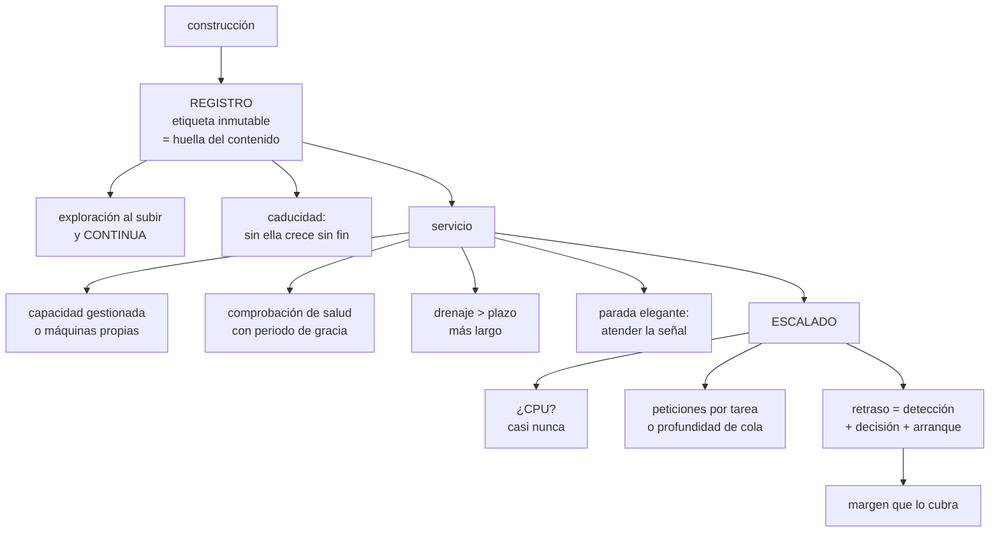

# 212 — ECR, ECS Fargate, ALB y autoscaling

> [← 211 · CloudWatch, X-Ray y observabilidad como código](../../part-17-aws-production-architecture/211-cloudwatch-x-ray-y-observabilidad-como-codigo/README.md) · [Índice de la parte](../README.md) · [213 · EKS, IRSA, GitOps y operación de clúster →](../../part-17-aws-production-architecture/213-eks-irsa-gitops-y-operacion-de-cluster/README.md)

**Parte:** 17 — AWS: arquitectura, automatización y operación en producción<br>
**Nivel:** avanzado · **Horas estimadas:** 4<br>
**Laboratorio:** `container` · **Estado:** `EXECUTABLE_CORE`

## 🎯 Propósito

Ejecutar contenedores en AWS sin gestionar servidores, con las decisiones que separan un despliegue que funciona de uno que aguanta. La clase cubre el registro de imágenes y su higiene, la elección entre capacidad gestionada y máquinas propias, la configuración de servicio y balanceador que evita cortar peticiones, y el escalado: **por qué la señal correcta casi nunca es la CPU y por qué el escalado siempre llega tarde al pico**.

## 📚 Resultados de aprendizaje

Al finalizar podrás:

1. **Publicar** imágenes con exploración, inmutabilidad y caducidad.
2. **Elegir** entre capacidad gestionada y máquinas propias con cifras.
3. **Configurar** servicio, comprobaciones y drenaje sin cortar peticiones.
4. **Escalar** con la señal correcta y con margen para el retraso.
5. **Dimensionar** CPU y memoria midiendo, no copiando.

## 🧩 Conceptos centrales

| Concepto | Comprensión verificable |
|---|---|
| `registro de imágenes` | Almacén de imágenes de contenedor, con exploración de vulnerabilidades y reglas de caducidad. |
| `etiqueta inmutable` | Etiqueta que no se puede sobrescribir. Evita que 'la misma versión' cambie de contenido. |
| `definición de tarea` | Declaración de qué imagen, con qué recursos, permisos y variables se ejecuta. |
| `capacidad gestionada` | Ejecución sin administrar instancias. Se paga por recursos pedidos y por tiempo. |
| `drenaje de destino` | Tiempo que el balanceador deja terminar las peticiones en curso antes de retirar una tarea. |
| `retraso de escalado` | Suma de detección, decisión y arranque. Es lo que hay que cubrir con margen. |

## 🧠 Modelo mental

AWS se aprende como una progresión operativa: identidad federada, infraestructura declarativa, entrega, señales, recuperación y costo controlado.

Aplicado a esta clase, separa siempre cuatro planos: **intención** (qué necesita el usuario),
**configuración** (qué declaramos), **estado observado** (qué existe de verdad) y
**evidencia** (cómo sabemos que cumple). Confundirlos produce diseños que se ven correctos
en un diagrama pero fallan al operar.

## 🗺️ Flujo de razonamiento



## 📖 Desarrollo

### 1. El registro y la higiene de imágenes

El registro parece un detalle y produce dos problemas caros: imágenes que cambian bajo el mismo nombre y crecimiento sin límite.

```text
ETIQUETAS INMUTABLES
  ✗ etiqueta «latest» o «v1.4» sobrescribible
    → dos despliegues con la misma etiqueta ejecutan cosas
      distintas
    → y revertir no lleva a lo que había
  ✓ etiqueta = huella del contenido, o versión inmutable
    → la etiqueta identifica un contenido exacto
    → y el despliegue referencia la huella, no la etiqueta
                                                clase 106

EXPLORACIÓN
  al subir: bloquea lo que tenga vulnerabilidades graves
  CONTINUA: una imagen desplegada hace tres meses puede
    tener hoy una vulnerabilidad conocida
  → sin exploración continua, solo se examina lo nuevo
                                                   ley 13

CADUCIDAD
  reglas: conservar las N últimas de cada rama, borrar las
  demás; borrar las sin etiqueta a los pocos días
  → sin reglas, el registro crece indefinidamente y factura
  → y las imágenes viejas con vulnerabilidades siguen ahí
    disponibles                                    ley 25
```

Y dos decisiones sobre la imagen misma:

```text
TAMAÑO
  imagen base mínima, construcción en varias etapas
  → el tiempo de arranque depende de la descarga
  → 800 MB frente a 90 MB son segundos en cada arranque,
    y eso se paga en cada escalado

SIN SECRETOS DENTRO
  las variables con secretos se inyectan en ejecución desde
  el gestor de secretos, no se construyen dentro
  → una imagen se puede descargar y examinar
```

Y el permiso que hay que separar y casi nunca se separa:

```text
ROL DE EJECUCIÓN     el que usa el agente para descargar la
                     imagen y escribir registros
ROL DE LA TAREA      el que usa TU código para llamar a
                     servicios
→ mezclarlos da al código permisos de infraestructura
                                                clase 134
```

### 2. Capacidad: gestionada o propia

La elección entre ejecutar sin administrar instancias o gestionarlas se decide con cifras, no con preferencia.

```text
CAPACIDAD GESTIONADA (Fargate)
  + sin instancias que parchear, escalar ni vigilar
  + aislamiento por tarea
  + se paga por lo pedido, por segundo
  − precio por unidad de recurso mayor
  − tamaños en combinaciones fijas: pedir 1 vCPU y 2 GB
    puede obligar a pagar más
  − arranque algo más lento
  − sin acceso al anfitrión: agentes especiales, GPU o
    almacenamiento local quedan limitados

MÁQUINAS PROPIAS
  + más barato por unidad, sobre todo con compromisos o
    capacidad sobrante                          clase 143
  + control del anfitrión
  − hay que parchear, escalar y vigilar el conjunto
  − el empaquetado deja hueco desperdiciado
  − y ese trabajo consume capacidad del equipo     ley 23
```

Y el cálculo honesto:

```text
el ahorro por unidad de las máquinas propias solo se
realiza si el empaquetado es alto
  utilización real típica de un conjunto mal empaquetado
  35-50 %
  → a esa utilización, la capacidad gestionada suele salir
    igual o más barata

regla práctica
  empieza con capacidad gestionada
  mide utilización y coste durante meses
  pasa a máquinas propias solo si el volumen es alto,
    estable y hay quien lo opere
```

Y el modo intermedio que suele ganar:

```text
capacidad gestionada para lo variable y lo poco usado
máquinas propias con compromiso para la base estable
→ y el reparto se decide con el histórico, no a ojo
                                                clase 143
```

Y una nota sobre el precio por interrupción:

```text
la capacidad interrumpible es mucho más barata y puede
retirarse con poco aviso
→ vale para trabajo por lotes y para parte de la capacidad
  de servicios tolerantes
→ nunca para el 100 % de un servicio con usuarios
```

### 3. Servicio y balanceador sin cortar peticiones

La configuración por defecto de un servicio detrás de un balanceador **corta peticiones en cada despliegue**. Estos son los parámetros que lo evitan.

```text
COMPROBACIÓN DE SALUD, con dos puntos       clase 196
  /vivo    ¿el proceso está en pie?      → reinicio
  /listo   ¿puede atender ahora?         → recibir tráfico
  y /listo NO depende de dependencias blandas

PERIODO DE GRACIA AL ARRANCAR
  tiempo antes de empezar a evaluar la salud
  ✗ demasiado corto → la tarea se mata mientras arranca,
    y entra en un bucle de reinicios
  ✓ mayor que el arranque real medido, con margen

DRENAJE DE DESTINO
  ✗ por defecto suele ser corto
  ✓ mayor que el plazo más largo de las peticiones
  → si no, cada despliegue corta lo que estaba en curso

PARADA ELEGANTE
  la aplicación debe ATENDER la señal de terminación
    dejar de aceptar nuevas
    terminar las que tiene
    cerrar conexiones
  ✗ si no la atiende, se la mata al agotar el plazo
  → y ese plazo debe superar la petición más larga

ORDEN CORRECTO EN UN DESPLIEGUE
  1  arranca la tarea nueva
  2  pasa /listo
  3  el balanceador la registra
  4  el balanceador quita la vieja del reparto
  5  DRENAJE
  6  señal de terminación a la vieja
  7  parada elegante
```

Y los parámetros de despliegue del servicio:

```text
PORCENTAJE MÍNIMO SANO   100 %  → nunca menos capacidad de
                                   la nominal
PORCENTAJE MÁXIMO        200 %  → permite arrancar las
                                   nuevas antes de retirar
                                   las viejas
→ con mínimo 100 y máximo 200 el despliegue no reduce
  capacidad en ningún momento
→ con los valores por defecto (50/200 en algunos casos) se
  puede quedar a la mitad durante el despliegue

CIRCUITO DE DESPLIEGUE
  si las tareas nuevas no llegan a estar sanas, el servicio
  vuelve solo a la versión anterior
  → hay que activarlo; no viene activado
```

Y una decisión sobre el tipo de balanceador:

```text
de aplicación (capa 7)   rutas, cabeceras, reintentos
de red (capa 4)          latencia mínima, IP fija, otros
                         protocolos
→ y la elección es la misma discusión de la clase 196
```

### 4. Escalar con la señal correcta

El escalado automático por CPU es el valor por defecto y casi nunca es lo correcto.

```text
POR QUÉ LA CPU FALLA COMO SEÑAL
  la mayoría de los servicios de aplicación esperan a la
  red y a la base, no calculan
  → una tarea saturada de peticiones en espera puede tener
    la CPU al 30 %
  → es exactamente el caso de la clase 186: el recurso
    saturado era el grupo de conexiones

LAS SEÑALES QUE SÍ FUNCIONAN
  peticiones por tarea (del balanceador)
    → directa, y fácil de fijar con una prueba de carga
  latencia p99 del destino
    → escalar antes de incumplir el objetivo
  profundidad de cola por consumidor
    → para trabajadores asíncronos               clase 210
  concurrencia en vuelo
    → la mejor medida de saturación real

  y la CPU, solo si el servicio de verdad calcula
```

**El retraso de escalado**, que es lo que hace que llegue tarde:

```text
detección de la métrica         30-120 s
decisión y disparo              30-60 s
arranque de la tarea            20-90 s (descarga + arranque)
paso de la comprobación         10-60 s
───────────────────────────────────────
TOTAL típico                    1,5 a 5 minutos

→ un pico que sube en 60 segundos NO lo cubre el escalado
→ hay que llegar al pico con capacidad ya presente
```

Y de ahí salen tres decisiones:

```text
1  MARGEN QUE CUBRA EL RETRASO
   capacidad base = pico previsible × (1 + tasa de subida ×
   retraso)
   → o dicho simple: no ir al límite

2  ESCALADO PROGRAMADO para lo previsible
   la campaña empieza a las 11:00 → subir a las 10:30
   → es más fiable que reaccionar

3  SUBIR RÁPIDO, BAJAR DESPACIO
   escalar hacia arriba con umbral bajo y sin espera
   escalar hacia abajo con espera de varios minutos
   → evita oscilar, y bajar de más cuesta más que subir de
     más
```

**El dimensionado de CPU y memoria**, que se copia y debería medirse:

```text
lo que ocurre al copiar el valor de otro servicio
  memoria de más   se paga y no se usa
  memoria de menos   el proceso muere sin aviso claro
  CPU de menos     latencia alta con «CPU al 100 %», que en
                   contenedores puede ser estrangulamiento
                   por cuota, no falta real de máquina

cómo se decide
  ejecutar la carga real y observar uso de CPU, memoria
  máxima y estrangulamiento
  fijar memoria por encima del pico observado con margen
  y la CPU según la latencia objetivo, no según el uso medio
```

Y la lista de comprobación de la clase:

```text
☐ las etiquetas del registro son inmutables
☐ el despliegue referencia la huella, no la etiqueta
☐ hay exploración al subir y continua
☐ el registro tiene reglas de caducidad
☐ la imagen es mínima y no contiene secretos
☐ el rol de ejecución y el de la tarea están separados
☐ la elección de capacidad se justificó con utilización y
  coste
☐ hay puntos separados de vivo y de listo
☐ el periodo de gracia supera el arranque medido
☐ el drenaje supera el plazo más largo
☐ la aplicación atiende la señal de terminación
☐ mínimo sano 100 % y máximo 200 %
☐ el circuito de despliegue está activado
☐ la señal de escalado no es la CPU salvo que corresponda
☐ el margen cubre el retraso de escalado, medido
☐ hay escalado programado para lo previsible
☐ CPU y memoria se fijaron midiendo
```

Y el cierre que enlaza con la clase siguiente: cuando los contenedores dejan de ser unos pocos servicios y pasan a ser una plataforma con muchos equipos, la orquestación gestionada se queda corta y aparece Kubernetes con sus propios problemas. Es la materia de la clase 213.

## 🔬 Ejemplo trabajado

**CloudShop mueve tres servicios a contenedores. Lo que sigue es el despliegue que cortaba peticiones, el escalado que llegaba tarde a cada campaña, y la comparación de coste que cambió la decisión de capacidad.**

**Problema 1 · Cada despliegue cortaba peticiones.**

```text
síntoma   en cada despliegue, entre 200 y 400 peticiones
          fallaban con error de conexión
          duraba unos 40 segundos
          se había normalizado: «se despliega de madrugada»

diagnóstico, parámetro a parámetro
  drenaje de destino                   30 s (por defecto)
  plazo más largo de petición          45 s (exportaciones)
  → las peticiones de más de 30 s se cortaban

  parada elegante
  → la aplicación NO atendía la señal de terminación
  → se la mataba al agotar el plazo, con peticiones vivas

  porcentaje mínimo sano               50 %
  → durante el despliegue el servicio operaba con la mitad
    de tareas
  → y en hora punta eso bastaba para saturar el resto

  periodo de gracia                    30 s
  arranque real medido                 52 s
  → las tareas nuevas se mataban por «no sanas» antes de
    terminar de arrancar
  → el servicio entraba en bucle y el despliegue tardaba
    12 minutos

corrección
  drenaje                              60 s
  plazo de parada                      70 s
  parada elegante implementada: deja de aceptar, termina lo
    que tiene, cierra
  mínimo sano                          100 %
  máximo                               200 %
  periodo de gracia                    120 s
  circuito de despliegue               activado

resultado
  peticiones cortadas por despliegue     300 → 0
  duración del despliegue             12 min → 3 min
  despliegues en horario laboral         no → sí
```

**Problema 2 · El escalado llegaba tarde.**

```text
configuración inicial
  señal          CPU media > 70 %
  mínimo         4 tareas
  máximo         40

lo que pasaba en cada campaña
  11:00  arranca la promoción; el tráfico ×18 en 90 s
  11:00  latencia p99 sube de 180 ms a 4.100 ms
  11:00  CPU de las tareas: 38 %       ← no dispara nada
  11:03  la latencia dispara alertas
  11:04  alguien escala a mano
  11:09  capacidad suficiente

  9 minutos de degradación en cada campaña

diagnóstico
  el servicio esperaba a la base y al servicio de precios
  → la CPU nunca subía
  → el recurso saturado era la concurrencia y las
    conexiones                                  clase 186

corrección
  1  SEÑAL
     peticiones por tarea, del balanceador
     umbral fijado con prueba de carga: el codo estaba en
     240 peticiones/min por tarea → objetivo 160

  2  RETRASO MEDIDO
     detección                         60 s
     decisión                          40 s
     arranque + descarga de imagen     52 s
     comprobación de salud             25 s
     ────────────────────────────────────
     total                           3 min 17 s

     y la imagen se redujo de 740 MB a 110 MB
     → arranque 52 s → 21 s
     → total 2 min 46 s

  3  MARGEN
     el tráfico sube ×18 en 90 s
     → el escalado no puede cubrirlo
     → capacidad base subida para absorber los primeros
       3 minutos

  4  ESCALADO PROGRAMADO
     las campañas tienen hora conocida
     → subir a 26 tareas a las 10:30
     → y volver a la política automática a las 13:00

  5  SUBIR RÁPIDO, BAJAR DESPACIO
     subida sin espera; bajada con 10 min de espera

resultado en la campaña siguiente
  p99 máximo                       4.100 ms → 310 ms
  minutos de degradación                9 → 0
  intervenciones manuales                1 → 0
  coste del escalado programado    +14 €/campaña
```

**La decisión de capacidad, revisada con datos.**

```text
se empezó con capacidad gestionada; a los 5 meses se
planteó pasar a máquinas propias «porque es más barato»

los datos
  coste actual con capacidad gestionada     3.180 €/mes
  recursos pedidos                          124 vCPU · 248 GB
  utilización media real                    31 %

  estimación con máquinas propias
    instancias necesarias con empaquetado del 65 %
      → 9 instancias grandes            1.940 €/mes
    con compromiso de 1 año             1.360 €/mes
    parcheado, escalado del conjunto,
      vigilancia                        ~2,5 días-persona/mes

  y el cálculo honesto
    ahorro bruto                          1.820 €/mes
    coste del trabajo (2,5 días × ~450 €) 1.125 €/mes
    ahorro neto                             695 €/mes

decisión
  NO migrar todavía
  motivo   695 €/mes no compensa añadir un conjunto de
           instancias que parchear a un equipo de 6
                                                   ley 23
  qué la reabriría
           si el gasto supera 6.000 €/mes
           o si aparece una carga con GPU o con requisitos
           de anfitrión                          clase 190

y lo que sí se hizo, que dio más
  ajustar los tamaños pedidos, que estaban copiados
    servicio A   2 vCPU / 4 GB → 0,5 vCPU / 2 GB
    servicio B   2 vCPU / 4 GB → 1 vCPU / 2 GB
    servicio C   4 vCPU / 8 GB → 2 vCPU / 4 GB
  utilización media                      31 % → 62 %
  coste                            3.180 € → 1.710 €
```

Y el detalle de cómo se fijaron esos tamaños:

```text
se ejecutó la carga real durante una semana midiendo
  uso de CPU p95, memoria máxima y estrangulamiento por
  cuota

  servicio A   CPU p95 0,21 vCPU · memoria máx 1,3 GB
               estrangulamiento 0 %
  servicio C   CPU p95 1,7 vCPU · memoria máx 3,1 GB
               estrangulamiento 4 % con 2 vCPU
               → se dejó en 2 vCPU: el 4 % ocurría en el
                 arranque, no en régimen
```

**La higiene del registro, que nadie había mirado:**

```text
imágenes almacenadas                              8.410
  con etiqueta                                    1.240
  SIN etiqueta (capas huérfanas)                  7.170
tamaño                                             2,1 TB
coste                                            210 €/mes
etiquetas mutables                                  sí
exploración                                     al subir
exploración continua                                no

tras aplicar reglas
  conservar las 10 últimas por rama, borrar el resto
  borrar sin etiqueta a los 7 días
  etiquetas inmutables, con huella del contenido
  exploración continua activada

  imágenes                                8.410 → 310
  tamaño                                  2,1 TB → 74 GB
  coste                                   210 € → 8 €

y la exploración continua encontró
  3 imágenes en producción con vulnerabilidades graves
  publicadas DESPUÉS de su construcción
  → la más antigua llevaba 4 meses desplegada    ley 13
```

**El resultado:**

```text                                        antes     después
peticiones cortadas por despliegue           300           0
duración del despliegue                   12 min       3 min
minutos de degradación por campaña             9           0
utilización de recursos                     31 %        62 %
coste de cómputo                         3.180 €     1.710 €
coste del registro                         210 €         8 €
imágenes con vulnerabilidad grave en
  producción                                   3           0
```

**La lección que esta clase deja**: el despliegue cortaba peticiones por **cuatro parámetros por defecto a la vez** —drenaje corto, sin parada elegante, mínimo sano al 50 % y gracia menor que el arranque—, y ninguno era un error de diseño. El escalado llegaba tarde porque **la señal era la CPU en un servicio que espera a la red**, y la mejora mayor no fue cambiar la señal sino **reducir la imagen de 740 a 110 MB**. Y el ahorro que se buscaba en el tipo de capacidad estaba en realidad en **los tamaños pedidos, que estaban copiados de otro servicio**.

## 🧪 Laboratorio guiado

Ejecuta desde la raíz:

```bash
python classes/part-17-aws-production-architecture/212-ecr-ecs-fargate-alb-y-autoscaling/lab.py
```

El laboratorio selecciona el motor de práctica **`container`** y produce
`lab_result.json`. El escenario, sus comprobaciones y el artefacto esperado corresponden a
esta clase; no requiere credenciales y deja explícito qué debe revalidarse en un sandbox real.

1. Lee `exercise.steps` y formula una predicción antes de ejecutar.
2. Ejecuta la práctica y verifica todos los elementos de `checks`.
3. Provoca el caso de `negative_test` y explica la señal observada.
4. Materializa `aws-ecs-platform` en `evidence/` usando la plantilla indicada.
5. Para proveedor real, sigue `sandbox.requires`, registra costo y ejecuta `destroy`.

### Evidencia esperada

El artefacto principal es una imagen mínima, escaneada y ejecutada sin privilegios. Además, la entrega debe incluir el comando ejecutado,
la salida estructurada y una conclusión que no exceda lo observado.

## 🏆 Reto verificable

Construye **`aws-ecs-platform`** para el caso CloudShop. Incluye una alternativa descartada,
un supuesto que pueda falsarse, una prueba de fallo y una decisión de rollback.

## ✅ Criterio de aceptación

- [ ] `lab.py` termina con código 0 y genera JSON válido.
- [ ] La entrega conecta al menos tres requisitos con mecanismos verificables.
- [ ] Existe una prueba positiva y una prueba negativa con evidencia.
- [ ] Seguridad, costo y operación aparecen como decisiones, no como anexos.
- [ ] Se declara una limitación y una condición que obligaría a revisar el diseño.
- [ ] Otra persona puede repetir el recorrido sin conocimiento tácito.

## ⚠️ Errores frecuentes

| Síntoma | Causa probable | Corrección |
|---|---|---|
| Cada despliegue corta peticiones en curso | Drenaje menor que el plazo más largo y la aplicación no atiende la señal de terminación | Aumenta el drenaje por encima de la petición más larga e implementa la parada elegante. |
| Las tareas nuevas entran en bucle de reinicio | El periodo de gracia es menor que el tiempo real de arranque | Mide el arranque y fija el periodo de gracia con margen sobre él. |
| El servicio pierde capacidad durante los despliegues | El porcentaje mínimo sano permite bajar del cien por cien | Fija mínimo sano 100 % y máximo 200 %, y activa el circuito de despliegue. |
| El escalado no reacciona aunque la latencia se dispare | La señal es la CPU y el servicio espera a la red, no calcula | Escala por peticiones por tarea, latencia o profundidad de cola, con el umbral fijado en una prueba de carga. |
| El escalado llega tarde a cada pico | El retraso de detección, decisión y arranque no está cubierto por margen | Mide el retraso, reduce el tamaño de la imagen, deja margen de capacidad y programa la subida para los picos previsibles. |
| Una imagen desplegada hace meses tiene vulnerabilidades conocidas | Solo hay exploración al subir, y las etiquetas son mutables | Activa exploración continua, usa etiquetas inmutables con huella y aplica reglas de caducidad al registro. |

## 🛡️ Seguridad, ética y costo

Trabaja con cuentas propias o sandboxes autorizados. No publiques secretos, identificadores
reales ni datos personales. Antes de crear recursos pagos define presupuesto, etiquetas y
comando de destrucción; después verifica que no queden recursos huérfanos. Los ejemplos
locales enseñan contratos, pero no certifican cumplimiento ni disponibilidad de producción.

## ❓ Preguntas de comprobación

1. ¿Por qué las etiquetas mutables impiden revertir con seguridad?
2. ¿Qué condiciones deben cumplirse para que las máquinas propias salgan realmente más baratas?
3. ¿Cuál es el orden correcto de un despliegue sin cortar peticiones?
4. ¿Por qué la CPU suele ser mala señal de escalado y cuáles funcionan mejor?
5. ¿Qué compone el retraso de escalado y cómo se compensa?

## 🔗 Referencias

- AWS (2025). *Amazon ECR: image tag mutability and lifecycle policies*. <https://docs.aws.amazon.com/AmazonECR/latest/userguide/image-tag-mutability.html>
- AWS (2025). *Amazon ECS deployment types and circuit breaker*. <https://docs.aws.amazon.com/AmazonECS/latest/developerguide/deployment-type-ecs.html>
- AWS (2025). *Application Load Balancer: deregistration delay*. <https://docs.aws.amazon.com/elasticloadbalancing/latest/application/load-balancer-target-groups.html>
- AWS (2025). *Service auto scaling for Amazon ECS*. <https://docs.aws.amazon.com/AmazonECS/latest/developerguide/service-auto-scaling.html>
- AWS (2025). *AWS Fargate pricing and task sizing*. <https://aws.amazon.com/fargate/pricing/>
- Documentación oficial vigente del servicio implementado; registra URL y fecha de consulta.

---

> [Evaluación](assessment.md) · [Contrato de clase](lesson.yaml) · [Índice de la parte](../README.md)

**📥 Descargar:** [Parte 17 en PDF](../../../site/downloads/partes/manual-parte-17-aws-production-architecture.pdf) · [Recorrido de AWS en PDF](../../../site/downloads/nubes/manual-aws.pdf) · [Manual integral](../../../site/downloads/multi-cloud-engineering-manual-v2.0.pdf)

| Anterior | Índice | Siguiente |
|---|---|---|
| [← 211 · CloudWatch, X-Ray y observabilidad como código](../../part-17-aws-production-architecture/211-cloudwatch-x-ray-y-observabilidad-como-codigo/README.md) | [Parte 17](../README.md) · [Programa](../../README.md) | [213 · EKS, IRSA, GitOps y operación de clúster →](../../part-17-aws-production-architecture/213-eks-irsa-gitops-y-operacion-de-cluster/README.md) |
