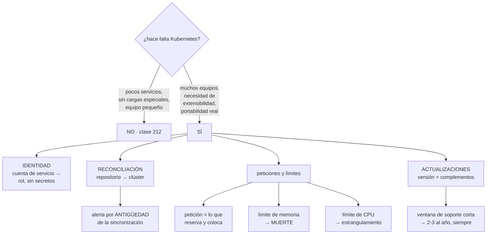

# 213 — EKS, IRSA, GitOps y operación de clúster

> [← 212 · ECR, ECS Fargate, ALB y autoscaling](../../part-17-aws-production-architecture/212-ecr-ecs-fargate-alb-y-autoscaling/README.md) · [Índice de la parte](../README.md) · [214 · Budgets, Cost Explorer, etiquetado y FinOps automatizado →](../../part-17-aws-production-architecture/214-budgets-cost-explorer-etiquetado-y-finops-automatizado/README.md)

**Parte:** 17 — AWS: arquitectura, automatización y operación en producción<br>
**Nivel:** avanzado · **Horas estimadas:** 4<br>
**Laboratorio:** `kubernetes` · **Estado:** `EXECUTABLE_CORE`

## 🎯 Propósito

Operar Kubernetes gestionado en AWS sabiendo qué se gana y qué se paga, porque es la decisión de plataforma que más capacidad de equipo consume. La clase cubre la identidad de las cargas sin credenciales, la reconciliación desde el repositorio, los tres asuntos que causan casi todos los incidentes —peticiones y límites mal puestos, actualizaciones de versión y complementos— y la pregunta que hay que contestar antes: **¿hace falta Kubernetes, o basta con lo de la clase 212?**

## 📚 Resultados de aprendizaje

Al finalizar podrás:

1. **Decidir** si Kubernetes compensa frente a orquestación más simple.
2. **Dar** identidad a las cargas sin credenciales estáticas.
3. **Operar** el clúster desde el repositorio, con reconciliación.
4. **Configurar** peticiones y límites sin provocar expulsiones ni desperdicio.
5. **Planificar** las actualizaciones de versión y de complementos.

## 🧩 Conceptos centrales

| Concepto | Comprensión verificable |
|---|---|
| `identidad de carga (IRSA)` | Mecanismo por el que una cuenta de servicio del clúster obtiene credenciales temporales de AWS, sin secretos. |
| `reconciliación` | Bucle que compara el estado declarado en el repositorio con el real y corrige la diferencia. |
| `petición de recursos` | Lo que la carga declara necesitar. Determina dónde se coloca y la capacidad total requerida. |
| `límite de recursos` | Techo que la carga no puede superar. Con memoria significa muerte; con CPU, estrangulamiento. |
| `complemento` | Componente añadido al clúster (red, DNS, métricas, controladores). Cada uno es una dependencia de versión. |
| `presupuesto de interrupción` | Declaración de cuántas réplicas pueden estar caídas a la vez durante mantenimiento. |

## 🧠 Modelo mental

AWS se aprende como una progresión operativa: identidad federada, infraestructura declarativa, entrega, señales, recuperación y costo controlado.

Aplicado a esta clase, separa siempre cuatro planos: **intención** (qué necesita el usuario),
**configuración** (qué declaramos), **estado observado** (qué existe de verdad) y
**evidencia** (cómo sabemos que cumple). Confundirlos produce diseños que se ven correctos
en un diagrama pero fallan al operar.

## 🗺️ Flujo de razonamiento



## 📖 Desarrollo

### 1. ¿Hace falta Kubernetes?

Es la pregunta que hay que contestar primero, y la respuesta honesta suele decepcionar.

```text
LO QUE KUBERNETES DA DE VERDAD
  un modelo declarativo extensible: se pueden definir
    recursos propios y controladores
  un ecosistema enorme de componentes ya hechos
  la misma interfaz en cualquier nube y en local
  planificación fina: afinidades, tolerancias, prioridades
  y una comunidad con respuestas para casi todo

LO QUE CUESTA
  actualizaciones frecuentes y obligatorias
  complementos que hay que mantener y que se rompen entre sí
  una capa más de red, de identidad y de diagnóstico
  y personas que sepan operarlo

  → entre 1 y 3 personas dedicadas para una plataforma
    seria                                          ley 23
```

Y el criterio de decisión:

```text
NO HACE FALTA SI
  son unos pocos servicios web y trabajadores
  el equipo es pequeño
  no hay cargas con requisitos especiales
  → la orquestación gestionada de la clase 212 hace lo
    mismo con una fracción del trabajo

SÍ COMPENSA SI
  hay muchos equipos que necesitan autonomía sobre una base
    común                                       clase 171
  hacen falta operadores y recursos propios
  hay cargas heterogéneas: GPU, procesos largos, trabajos
    por lotes, bases de datos con operador
  la portabilidad entre nubes es un requisito REAL y no
    declarativo                                 clase 158
```

Y una advertencia sobre la portabilidad, que es el argumento más usado:

```text
el manifiesto es portable; el resto casi nunca
  balanceadores, almacenamiento, identidad, registro,
  certificados y controladores son específicos
→ la portabilidad real exige diseñarla y probarla, no viene
  de usar Kubernetes                            clase 158
```

Y la decisión sobre el modo de ejecución de los nodos:

```text
GRUPOS DE NODOS GESTIONADOS
  instancias que se parchean con ayuda del proveedor
  + control, coste por unidad menor, cualquier carga
  − hay que planificar reemplazos y drenajes

CAPACIDAD SIN NODOS
  un pod por unidad de capacidad, sin instancias
  + nada que parchear
  − más caro por unidad, con límites de funciones

  → mezcla habitual: sin nodos para lo variable y grupos
    gestionados para la base                    clase 212
```

### 2. Identidad sin credenciales

Dar a una carga acceso a servicios de AWS con una clave montada en un secreto es el patrón que hay que eliminar, y el mecanismo es el mismo de la clase 206.

```text
CÓMO FUNCIONA
  el clúster expone un emisor de testigos
  se declara como proveedor de identidad en AWS
  la cuenta de servicio del pod se anota con un rol
  el pod recibe un testigo montado, con vida corta
  y lo intercambia por credenciales temporales

LO QUE SE GANA
  sin claves en secretos ni en variables
  credenciales de minutos
  y permisos por CARGA, no por nodo
```

Y el patrón que sustituye, que sigue siendo frecuente:

```text
✗ EL ROL DEL NODO
  dar permisos al rol de la instancia
  → TODOS los pods del nodo los tienen
  → incluidos los de otro equipo que aterricen ahí
  → alcance enorme desde cualquier pod comprometido
                                                clase 189

  y además hay que bloquear el acceso de los pods al
  servicio de metadatos del nodo, o pueden pedir esas
  credenciales aunque tengan la suya
```

Y los errores de configuración de la identidad de carga:

```text
la condición del rol debe atar
  el emisor del clúster concreto
  el espacio de nombres
  y el NOMBRE de la cuenta de servicio

✗ condición solo por emisor
  → cualquier cuenta de servicio de cualquier espacio de
    nombres puede asumir el rol
  → es el mismo fallo de la clase 206, con otra forma
```

Y una comprobación obligatoria:

```text
desde un pod de otro espacio de nombres, intentar asumir
el rol
→ debe fallar                                     ley 22
```

**Los secretos**, que en Kubernetes son un objeto sin cifrar por defecto:

```text
un objeto de tipo secreto está codificado, no cifrado
→ hay que activar el cifrado en reposo del almacén del
  plano de control
→ y para secretos de verdad, obtenerlos del gestor externo
  en tiempo de ejecución, no guardarlos en el clúster
→ y nunca en un manifiesto del repositorio      clase 106
```

### 3. Operar desde el repositorio

Aplicar manifiestos a mano desde un portátil produce clústeres que nadie sabe reconstruir. La reconciliación resuelve eso.

```text
EL MODELO
  el estado deseado vive en un repositorio
  un controlador dentro del clúster lo compara con el real
  y corrige la diferencia continuamente

LO QUE APORTA sobre desplegar desde la canalización
  el clúster no necesita credenciales de la canalización:
    tira, no le empujan
  la deriva se corrige sola
  el repositorio es la verdad, y se puede reconstruir
  y el historial de cambios es el del repositorio
                                                clase 103
```

Y la alerta imprescindible:

```text
«la sincronización lleva N minutos sin completarse»
  o «el estado real difiere del declarado desde hace N»

→ un bucle de reconciliación parado no genera ningún error:
  simplemente deja de aplicar cambios              ley 13
→ y en la clase 179 esa prueba negativa falló porque la
  alerta iba a un canal sin nadie
```

**La separación por equipos**, que es la razón de usar Kubernetes en muchos casos:

```text
espacio de nombres por equipo o por servicio
cuotas de recursos por espacio
  → un equipo no puede consumir la capacidad de los demás
rangos de límites por defecto
políticas de admisión
  → qué imágenes se admiten (firmadas, del registro propio)
  → qué no se permite: privilegios, red del anfitrión,
    montajes sensibles
  → y las etiquetas obligatorias                clase 142
políticas de red
  → por defecto, denegar; y abrir lo declarado  clase 201
```

Y la advertencia sobre la admisión:

```text
un control de admisión que rechaza sin explicar por qué se
rodea: la gente pide excepciones o crea recursos por otro
camino                                             ley 16
→ el mensaje debe decir qué falta y cómo arreglarlo
→ y el carril fácil —la plantilla de servicio— debe cumplir
  solo                                          clase 190
```

### 4. Peticiones, límites y actualizaciones

**Peticiones y límites** son la causa de la mayoría de los incidentes de plataforma, y se ponen mal en las dos direcciones.

```text
PETICIÓN
  lo que el planificador RESERVA
  determina en qué nodo cabe y cuánta capacidad total hace
  falta

LÍMITE
  el techo
  memoria por encima del límite → el proceso MUERE
  CPU por encima del límite     → estrangulamiento, latencia

LOS CUATRO ERRORES
  1  sin petición
     el pod se coloca en cualquier sitio y compite
     → y es el primero en ser expulsado cuando falta
       memoria
  2  petición mucho mayor que el uso
     capacidad reservada y desperdiciada
     → el conjunto crece sin necesidad, y la factura con él
  3  límite de memoria ajustado al uso medio
     un pico normal mata el proceso
     → y el síntoma es «se reinicia solo y no sé por qué»
  4  límite de CPU muy bajo
     estrangulamiento constante: latencia alta con el nodo
     ocioso                                     clase 186
```

Y las reglas que funcionan:

```text
petición de memoria ≈ uso p95 observado
límite de memoria   ≈ petición × 1,5 a 2
petición de CPU     ≈ uso p95 observado
límite de CPU       a menudo, NINGUNO
  → dejar que use el hueco libre cuando lo hay
  → salvo que haga falta aislar por contrato

y medir siempre antes: la carga real durante días
```

Y tres mecanismos que evitan sorpresas:

```text
PRESUPUESTO DE INTERRUPCIÓN
  «al menos 2 réplicas siempre disponibles»
  → el drenaje de un nodo lo respeta
  → sin esto, un mantenimiento puede dejar el servicio en
    cero réplicas durante segundos

CLASES DE PRIORIDAD
  lo crítico expulsa a lo que no lo es cuando falta espacio

REPARTO ENTRE ZONAS
  restricciones que obligan a repartir las réplicas
  → sin ellas, las 3 réplicas pueden acabar en el mismo
    nodo o en la misma zona                     clase 185
```

**Las actualizaciones**, que son el trabajo continuo de esta plataforma:

```text
LA VENTANA DE SOPORTE ES CORTA
  cada versión se soporta poco más de un año
  → hay que actualizar 2 o 3 veces al año, siempre
  → no es opcional ni aplazable                     ley 25

QUÉ HAY QUE COMPROBAR EN CADA ACTUALIZACIÓN
  interfaces retiradas: manifiestos que dejan de ser
    válidos
  compatibilidad de cada complemento con la versión nueva
  compatibilidad del cliente y de las herramientas
  y de los operadores instalados

EL ORDEN
  1  revisar avisos de retirada y corregir manifiestos
  2  actualizar en un clúster de prueba idéntico
  3  actualizar el plano de control
  4  actualizar complementos
  5  reemplazar nodos por lotes, respetando el presupuesto
     de interrupción
```

Y lo que se olvida:

```text
los COMPLEMENTOS tienen su propio calendario
  red, DNS interno, controlador de balanceador, métricas,
  autoescalado, controlador de certificados
→ cada uno es una dependencia con su matriz de
  compatibilidad
→ y un clúster con quince complementos tiene quince cosas
  que pueden bloquear una actualización            ley 23
```

Y la lista de comprobación de la clase:

```text
☐ la decisión de usar Kubernetes está justificada
☐ las cargas obtienen credenciales por identidad de carga
☐ el rol del nodo no tiene permisos de aplicación
☐ los pods no pueden alcanzar el servicio de metadatos
☐ las condiciones del rol atan espacio de nombres y cuenta
  de servicio
☐ el clúster se reconcilia desde el repositorio
☐ hay alerta por antigüedad de la sincronización
☐ hay cuotas por espacio de nombres
☐ hay política de admisión con mensajes que explican
☐ hay política de red con denegación por defecto
☐ todas las cargas tienen peticiones, medidas
☐ los límites de memoria dan margen sobre el pico
☐ hay presupuestos de interrupción
☐ las réplicas se reparten entre zonas
☐ el calendario de actualización está planificado
☐ la matriz de compatibilidad de complementos está escrita
```

Y el cierre que enlaza con la clase siguiente: todo lo montado en esta parte genera factura, y a estas alturas ya han aparecido tres partidas que nadie había estimado. Presupuestos, análisis de coste, etiquetado y automatización es la materia de la clase 214.

## 🔬 Ejemplo trabajado

**CloudShop monta una plataforma de contenedores para siete equipos. Lo que sigue es la decisión de adoptarlo, los tres incidentes del primer año —todos de peticiones y límites o de actualizaciones— y lo que costó de verdad.**

**La decisión, con el método de la clase 152.**

```text
situación   14 servicios en orquestación gestionada,
            funcionando bien

lo que se pedía
  7 equipos quieren autonomía para desplegar sin
    coordinarse
  2 cargas con GPU para el equipo de datos     clase 175
  trabajos por lotes con planificación por prioridad
  un operador de base de datos que el equipo de datos ya usa
  y «portabilidad», que al preguntar resultó no ser un
    requisito real                              clase 158

lo que ya estaba resuelto
  despliegue, escalado y balanceo             clase 212

veredicto
  3 de las 5 necesidades exigen Kubernetes o lo facilitan
  mucho
  y hay 2 personas que pueden dedicarse a la plataforma
  → SE ADOPTA, y se migran solo las cargas que lo
    necesitan

y la decisión que se registró
  los 14 servicios web SIGUEN en orquestación gestionada
  motivo   funcionan, y moverlos añade trabajo sin
           beneficio
  qué la reabriría   si la plataforma demuestra reducir el
           tiempo de despliegue de un servicio nuevo por
           debajo del actual                    clase 190
```

**Incidente 1 · «Los pods se reinician solos», mes 2.**

```text
síntoma   el servicio de informes se reiniciaba varias
          veces al día, sin errores en sus registros
          la última línea era siempre distinta

diagnóstico
  el pod moría por exceso de memoria
  límite de memoria                     512 Mi
  uso medio                             410 Mi
  uso p99                               780 Mi (al generar
                                        informes grandes)
  → el límite estaba puesto sobre el uso MEDIO

y por qué no había errores
  el proceso se mata sin darle oportunidad de registrar
  nada
  → el único rastro era el motivo de terminación del
    contenedor, que nadie miraba                 ley 15

corrección
  petición de memoria      = p95 observado = 620 Mi
  límite                   = petición × 1,8 = 1.100 Mi
  y alerta nueva: «contenedores terminados por memoria > 0»

reinicios al día                          6 → 0
```

**Incidente 2 · «Latencia alta con los nodos al 30 %», mes 4.**

```text
síntoma   el servicio de catálogo tenía p99 de 2,4 s
          los nodos estaban al 30 % de CPU
          escalar el número de réplicas no mejoraba nada

diagnóstico
  límite de CPU del contenedor          200 milicores
  el contenedor era estrangulado el 74 % del tiempo
  → la métrica de estrangulamiento existía y no estaba en
    ningún panel                                clase 211

  la confusión
    el panel mostraba «CPU del nodo: 30 %»
    y la conclusión era «sobra capacidad»
    → pero el contenedor tenía su propio techo

corrección
  petición de CPU          = p95 = 320 milicores
  límite de CPU            eliminado
  → el contenedor usa el hueco libre del nodo cuando lo hay

p99                                     2,4 s → 210 ms
réplicas necesarias                        12 → 6
coste                                   -840 €/mes
```

Y la observación:

```text
quitar el límite de CPU redujo a la mitad las réplicas
necesarias
→ el límite estaba causando el problema que se intentaba
  resolver escalando
```

**Incidente 3 · La actualización de versión, mes 8.**

```text
situación   la versión del clúster entraba en fin de soporte
            en 6 semanas
            se planificó la actualización para un martes

lo que salió mal
  el clúster de prueba se había creado hacía 4 meses y no
  era idéntico: le faltaban 3 complementos que producción
  sí tenía
  → la prueba pasó sin problemas

  en producción
    el controlador del balanceador no era compatible con la
    versión nueva
    → los servicios nuevos dejaron de obtener balanceador
    → los existentes siguieron funcionando
    tiempo hasta detectarlo                    3 días
    → porque no había despliegues de servicios nuevos hasta
      entonces                                    ley 13

    y 41 manifiestos usaban una interfaz retirada
    → la reconciliación empezó a fallar en silencio para
      esos recursos
    → alerta de antigüedad de sincronización: NO existía

correcciones
  el clúster de prueba se genera del mismo repositorio que
  producción y se recrea antes de cada actualización
  matriz de compatibilidad de los 12 complementos, escrita
    y comprobada antes de actualizar
  revisión automática de interfaces retiradas en la
    canalización                                clase 190
  alerta de antigüedad de sincronización, con destino a
    guardia
  calendario: 3 actualizaciones al año, en fecha fijada

la siguiente actualización, mes 13
  duración                                       4 h
  incidencias                                      0
  manifiestos corregidos antes                    17
  complementos que hubo que subir primero          4
```

**La identidad, montada bien desde el principio:**

```text
identidad de carga por cuenta de servicio
condición del rol atada a emisor + espacio de nombres +
  nombre de la cuenta
acceso de los pods al servicio de metadatos del nodo:
  bloqueado
rol del nodo: solo lo imprescindible para unirse al clúster

prueba negativa
  desde un pod del espacio de nombres «equipo-datos»,
  intentar asumir el rol de «equipo-pagos»
  → denegado                                       ✓
  desde un pod, leer las credenciales del nodo
  → bloqueado                                      ✓
```

**Lo que costó de verdad, medido al año:**

```text
coste de cómputo del clúster                 4.120 €/mes
coste del plano de control                      68 €/mes

y el coste que no aparece en la factura
  actualizaciones (3 al año, ~3 días cada una)  9 días
  mantenimiento de complementos               18 días
  soporte a los 7 equipos                     44 días
  incidentes de plataforma                    11 días
  ─────────────────────────────────────────────────
  total                                       82 días/año
                                       ≈ 0,4 personas

y lo que se esperaba   «2 personas dedicadas»
→ resultó menos de lo previsto, porque los 14 servicios web
  se quedaron fuera y la reconciliación evitó mucho soporte
```

Y el balance que el equipo escribió:

```text
lo que la plataforma dio
  los 7 equipos despliegan sin coordinarse
  las cargas con GPU y los trabajos por lotes funcionan
  el operador de base de datos del equipo de datos también

lo que NO dio
  portabilidad: 4 de los 12 complementos son específicos
  del proveedor, y los balanceadores y el almacenamiento
  también                                       clase 158
  → la portabilidad se había citado como motivo y no se
    materializó, lo cual estaba previsto y registrado
```

**El resultado:**

```text                                        antes     después
equipos que despliegan sin coordinarse         0           7
reinicios por memoria                       6/día          0
p99 del catálogo                           2,4 s       210 ms
réplicas del catálogo                         12           6
incidentes por actualización                   1           0
servicios web migrados innecesariamente        0           0
capacidad de equipo consumida                n/d      0,4 pers.
```

**La lección que esta clase deja**: los dos primeros incidentes fueron **peticiones y límites mal puestos**, y en el segundo el límite de CPU era la causa del problema que se estaba intentando resolver añadiendo réplicas. El tercero fue una actualización cuya prueba pasó **porque el clúster de prueba no era idéntico al de producción**, y sus consecuencias tardaron tres días en verse porque nada las hacía visibles. Y la decisión más rentable de todo el proyecto fue **no migrar los catorce servicios que ya funcionaban**.

## 🧪 Laboratorio guiado

Ejecuta desde la raíz:

```bash
python classes/part-17-aws-production-architecture/213-eks-irsa-gitops-y-operacion-de-cluster/lab.py
```

El laboratorio selecciona el motor de práctica **`kubernetes`** y produce
`lab_result.json`. El escenario, sus comprobaciones y el artefacto esperado corresponden a
esta clase; no requiere credenciales y deja explícito qué debe revalidarse en un sandbox real.

1. Lee `exercise.steps` y formula una predicción antes de ejecutar.
2. Ejecuta la práctica y verifica todos los elementos de `checks`.
3. Provoca el caso de `negative_test` y explica la señal observada.
4. Materializa `aws-eks-gitops` en `evidence/` usando la plantilla indicada.
5. Para proveedor real, sigue `sandbox.requires`, registra costo y ejecuta `destroy`.

### Evidencia esperada

El artefacto principal es manifiestos declarativos con estado observado. Además, la entrega debe incluir el comando ejecutado,
la salida estructurada y una conclusión que no exceda lo observado.

## 🏆 Reto verificable

Construye **`aws-eks-gitops`** para el caso CloudShop. Incluye una alternativa descartada,
un supuesto que pueda falsarse, una prueba de fallo y una decisión de rollback.

## ✅ Criterio de aceptación

- [ ] `lab.py` termina con código 0 y genera JSON válido.
- [ ] La entrega conecta al menos tres requisitos con mecanismos verificables.
- [ ] Existe una prueba positiva y una prueba negativa con evidencia.
- [ ] Seguridad, costo y operación aparecen como decisiones, no como anexos.
- [ ] Se declara una limitación y una condición que obligaría a revisar el diseño.
- [ ] Otra persona puede repetir el recorrido sin conocimiento tácito.

## ⚠️ Errores frecuentes

| Síntoma | Causa probable | Corrección |
|---|---|---|
| Los pods se reinician sin dejar rastro en sus registros | El límite de memoria está ajustado al uso medio y un pico mata el proceso | Fija la petición en el p95 observado y el límite entre 1,5 y 2 veces la petición; alerta sobre terminaciones por memoria. |
| Latencia alta con los nodos ociosos y escalar no ayuda | Límite de CPU bajo que provoca estrangulamiento del contenedor | Fija la petición de CPU en el p95 y considera no poner límite; vigila la métrica de estrangulamiento. |
| Cualquier pod puede usar los permisos de otro equipo | Los permisos están en el rol del nodo o la condición del rol solo ata al emisor | Usa identidad de carga con condición por espacio de nombres y cuenta de servicio, y bloquea el acceso al servicio de metadatos. |
| Los cambios del repositorio dejan de aplicarse sin que nadie lo note | El bucle de reconciliación falla en silencio | Alerta por antigüedad de la sincronización y por diferencia persistente entre lo declarado y lo real. |
| Una actualización rompe producción pese a haber pasado en pruebas | El clúster de prueba no era idéntico y faltaban complementos | Genera el clúster de prueba del mismo repositorio, mantén una matriz de compatibilidad de complementos y revisa las interfaces retiradas antes. |
| Un mantenimiento deja un servicio sin réplicas disponibles | No hay presupuesto de interrupción ni reparto entre zonas | Declara presupuestos de interrupción y restricciones de reparto por zona. |

## 🛡️ Seguridad, ética y costo

Trabaja con cuentas propias o sandboxes autorizados. No publiques secretos, identificadores
reales ni datos personales. Antes de crear recursos pagos define presupuesto, etiquetas y
comando de destrucción; después verifica que no queden recursos huérfanos. Los ejemplos
locales enseñan contratos, pero no certifican cumplimiento ni disponibilidad de producción.

## ❓ Preguntas de comprobación

1. ¿En qué casos no compensa Kubernetes frente a orquestación gestionada más simple?
2. ¿Por qué dar permisos al rol del nodo es un problema de alcance?
3. ¿Qué diferencia hay entre petición y límite, y qué ocurre al superar cada uno?
4. ¿Qué alerta detecta que la reconciliación ha dejado de funcionar?
5. ¿Qué hay que comprobar antes de actualizar la versión del clúster?

## 🔗 Referencias

- AWS (2025). *IAM roles for service accounts (IRSA)*. <https://docs.aws.amazon.com/eks/latest/userguide/iam-roles-for-service-accounts.html>
- AWS (2025). *Amazon EKS Kubernetes version support and upgrade*. <https://docs.aws.amazon.com/eks/latest/userguide/kubernetes-versions.html>
- Kubernetes (2025). *Managing resources for containers: requests and limits*. <https://kubernetes.io/docs/concepts/configuration/manage-resources-containers/>
- Argo CD (2025). *GitOps and application health*. <https://argo-cd.readthedocs.io/en/stable/>
- AWS (2025). *EKS Best Practices Guide*. <https://docs.aws.amazon.com/eks/latest/best-practices/introduction.html>
- Documentación oficial vigente del servicio implementado; registra URL y fecha de consulta.

---

> [Evaluación](assessment.md) · [Contrato de clase](lesson.yaml) · [Índice de la parte](../README.md)

**📥 Descargar:** [Parte 17 en PDF](../../../site/downloads/partes/manual-parte-17-aws-production-architecture.pdf) · [Recorrido de AWS en PDF](../../../site/downloads/nubes/manual-aws.pdf) · [Manual integral](../../../site/downloads/multi-cloud-engineering-manual-v2.0.pdf)

| Anterior | Índice | Siguiente |
|---|---|---|
| [← 212 · ECR, ECS Fargate, ALB y autoscaling](../../part-17-aws-production-architecture/212-ecr-ecs-fargate-alb-y-autoscaling/README.md) | [Parte 17](../README.md) · [Programa](../../README.md) | [214 · Budgets, Cost Explorer, etiquetado y FinOps automatizado →](../../part-17-aws-production-architecture/214-budgets-cost-explorer-etiquetado-y-finops-automatizado/README.md) |
