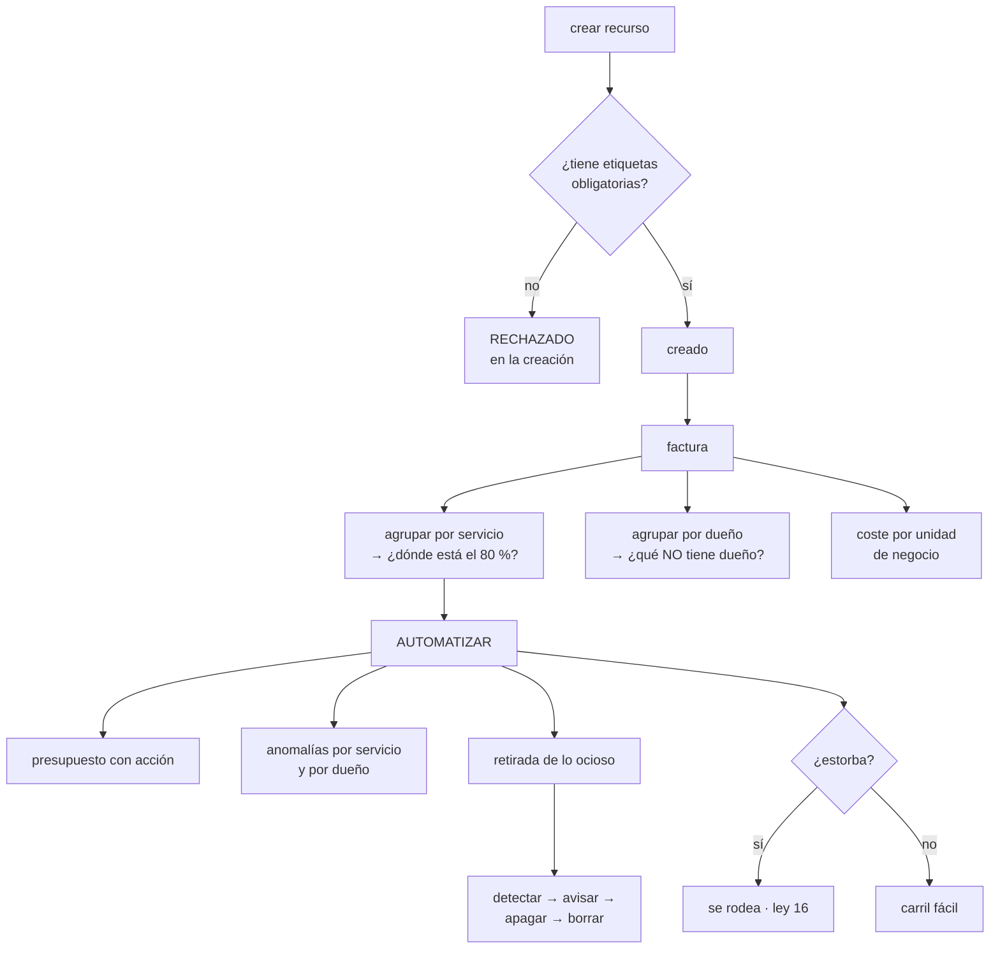

# 214 — Budgets, Cost Explorer, etiquetado y FinOps automatizado

> [← 213 · EKS, IRSA, GitOps y operación de clúster](../../part-17-aws-production-architecture/213-eks-irsa-gitops-y-operacion-de-cluster/README.md) · [Índice de la parte](../README.md) · [215 · Multi-región, Route 53, failover y game day →](../../part-17-aws-production-architecture/215-multi-region-route-53-failover-y-game-day/README.md)

**Parte:** 17 — AWS: arquitectura, automatización y operación en producción<br>
**Nivel:** avanzado · **Horas estimadas:** 4<br>
**Laboratorio:** `finops` · **Estado:** `EXECUTABLE_CORE`

## 🎯 Propósito

Controlar el coste de lo que se ha montado en esta parte, donde ya han aparecido tres partidas que nadie había estimado. La clase fija el etiquetado como requisito de creación y no como limpieza posterior, explica cómo se lee una factura para encontrar el dinero de verdad, y automatiza lo que funciona: presupuestos con acción, detección de anomalías y retirada de lo que nadie usa. Con la advertencia de siempre: **la policía del coste se rodea; el carril fácil, no**.

## 📚 Resultados de aprendizaje

Al finalizar podrás:

1. **Imponer** etiquetado en la creación, con barrera y no con auditoría.
2. **Leer** la factura para encontrar las partidas que dominan.
3. **Configurar** presupuestos y detección de anomalías que actúen.
4. **Atribuir** el coste por servicio y por unidad de negocio.
5. **Retirar** lo que no se usa, de forma automática y segura.

## 🧩 Conceptos centrales

| Concepto | Comprensión verificable |
|---|---|
| `etiqueta de asignación` | Etiqueta activada para que aparezca como dimensión en el informe de costes. Sin activar, no sirve. |
| `coste por unidad de negocio` | Coste dividido entre pedidos, usuarios o transacciones. Es la única cifra comparable en el tiempo. |
| `presupuesto con acción` | Presupuesto que además de avisar ejecuta algo: notificar, restringir o apagar. |
| `detección de anomalías` | Modelo que compara el gasto con el patrón previo y avisa de desviaciones. |
| `coste no atribuido` | Gasto que no cae en ningún servicio ni dueño. Es la parte que nadie reduce. |
| `recurso ocioso` | Recurso creado, facturado y sin uso. La categoría más fácil de eliminar y la que más se repite. |

## 🧠 Modelo mental

AWS se aprende como una progresión operativa: identidad federada, infraestructura declarativa, entrega, señales, recuperación y costo controlado.

Aplicado a esta clase, separa siempre cuatro planos: **intención** (qué necesita el usuario),
**configuración** (qué declaramos), **estado observado** (qué existe de verdad) y
**evidencia** (cómo sabemos que cumple). Confundirlos produce diseños que se ven correctos
en un diagrama pero fallan al operar.

## 🗺️ Flujo de razonamiento



## 📖 Desarrollo

### 1. Etiquetar en la creación, no después

El proyecto de etiquetado que empieza etiquetando lo que ya existe fracasa siempre: mientras se etiqueta lo viejo, se crea lo nuevo sin etiquetas.

```text
EL ORDEN CORRECTO
  1  decidir el conjunto MÍNIMO de etiquetas obligatorias
  2  impedir la creación sin ellas
  3  y solo entonces, etiquetar lo existente

→ al revés, nunca se termina                       ley 25
```

Y el conjunto mínimo, que debe ser corto:

```text
dueño        el equipo, no una persona          ley 20
servicio     a qué sistema pertenece
entorno      producción, preproducción, desarrollo
centro de coste  a quién se le imputa

→ cuatro. Más de seis y nadie las pone bien
→ y con valores CERRADOS, no texto libre:
  «prod», «Prod», «producción» y «PRD» son cuatro grupos
  distintos en el informe
```

**Cómo se impide la creación**, por orden de fuerza:

```text
1  BARRERA DE ORGANIZACIÓN
   deniega crear sin las etiquetas
   → ni un administrador de la cuenta puede saltárselo
                                                clase 169

2  POLÍTICA DE ETIQUETAS
   fija los valores permitidos por clave

3  FUNCIÓN DE APTITUD EN LA CANALIZACIÓN
   la plantilla que no las declara no despliega
                                                clase 190

4  LA PLANTILLA DE SERVICIO NUEVO LAS TRAE HECHAS
   → esto es lo que hace que casi nunca falle nada
                                                clase 171
```

Y la advertencia de la parte 14:

```text
si poner las etiquetas cuesta trabajo, la gente creará los
recursos por otro camino, o pondrá valores basura para pasar
el control                                          ley 16
→ el carril fácil las pone solo; la barrera es la red de
  seguridad, no el mecanismo principal
```

Y lo que no se puede etiquetar, que hay que tratar aparte:

```text
transferencia de datos entre zonas y regiones
coste compartido de servicios comunes
tráfico de salida sin recurso asociado
→ estos se reparten por regla, escrita y acordada
→ y hay que decir cuánto se reparte y con qué criterio
```

### 2. Leer la factura

La factura se mira mal: se abre el total, se dice «ha subido» y se cierra. Estas son las cinco vistas que encuentran el dinero.

```text
1  POR SERVICIO, ordenado de mayor a menor
   → el 80 % del gasto suele estar en 3 o 4 líneas
   → y esas son las únicas que merece la pena optimizar

2  POR DUEÑO
   → y sobre todo: cuánto NO tiene dueño
   → el coste no atribuido no lo reduce nadie      ley 20

3  POR ENTORNO
   → si preproducción cuesta más del 25 % de producción,
     hay algo encendido que no debería

4  POR TIPO DE USO dentro del servicio grande
   no basta «almacenamiento: 4.100 €»
   hace falta: peticiones, almacenamiento por clase,
   transferencia, recuperaciones
   → el desglose es donde está la sorpresa

5  COSTE POR UNIDAD DE NEGOCIO
   coste / pedidos del mes
   → es la ÚNICA cifra comparable entre meses
   → sin ella, «el coste ha subido un 20 %» no dice si
     mejoró o empeoró                            clase 142
```

Y las partidas que este programa ha visto sorprender, ya en esta parte:

```text
peticiones de la pasarela         > cómputo    clase 207
ingesta de registros              > cómputo    clase 211
escrituras de índices             > tabla      clase 208
transferencia entre zonas         casi siempre olvidada
series de métricas de alta
  cardinalidad                     1.410 €/mes  clase 211
invalidaciones de caché                        clase 205
capas huérfanas del registro de
  imágenes                         210 €/mes    clase 212
```

Y una técnica que ahorra tiempo:

```text
no persigas el porcentaje: persigue el importe
  «este servicio subió un 400 %»  → eran 3 € y ahora son 15
  «este subió un 6 %»             → eran 12.000 €
→ ordena siempre por importe de la variación, no por
  porcentaje
```

**Los descuentos por compromiso**, con la parte que se hace mal:

```text
se compromete SOLO la base estable, medida con meses de
histórico
  → comprometer el pico deja capacidad pagada sin usar
  → y comprometer a 3 años algo que cambiará en 1 es peor
    que no comprometer nada

y hay que vigilar la COBERTURA y la UTILIZACIÓN
  cobertura     qué proporción del uso está cubierta
  utilización   qué proporción de lo comprometido se usa
  → utilización por debajo del 95 % es dinero tirado
```

### 3. Automatizar lo que funciona

Los informes que alguien debe mirar dejan de mirarse. Lo que funciona es lo que actúa.

**Presupuestos con acción:**

```text
POR CUENTA Y POR SERVICIO, no solo global
  → un presupuesto global se supera y nadie sabe por qué

CON UMBRALES ESCALONADOS
  50 %, 80 %, 100 % del previsto para la fecha
  y sobre PREVISIÓN, no solo sobre gasto acumulado
  → avisar al 100 % el día 28 no sirve de nada

CON ACCIONES REALES en entornos no productivos
  al 100 % en desarrollo → restringir la creación de
    recursos nuevos
  al 120 % → apagar lo que se pueda apagar
  → en producción, avisar; nunca apagar automáticamente
```

**Detección de anomalías**, que encuentra lo que el presupuesto no:

```text
el presupuesto detecta que se gasta de más EN TOTAL
la anomalía detecta que un servicio concreto se ha salido
de su patrón, aunque el total esté bien

configurarla por servicio Y por dueño
umbral en importe absoluto, no en porcentaje
  → si no, avisa de cada servicio pequeño que se dobla
y con destino a alguien que actúe                clase 211
```

**La retirada de lo ocioso**, que es donde está el dinero fácil:

```text
LO QUE SIEMPRE APARECE
  volúmenes desconectados de cualquier máquina
  copias antiguas de volúmenes, sin caducidad
  direcciones fijas reservadas y sin asociar
  balanceadores sin destinos
  instancias paradas cuyo disco se sigue pagando
  bases de datos de pruebas de hace un año
  entornos efímeros que no caducaron              ley 25
  puntos privados creados y no usados            clase 200
  registros sin caducidad                        clase 211
  imágenes sin etiqueta                          clase 212

EL PROCESO SEGURO, en cuatro pasos
  1  DETECTAR y listar, con dueño si lo hay
  2  AVISAR al dueño, con plazo
  3  APAGAR o desasociar, sin borrar, y esperar
  4  BORRAR si nadie se ha quejado

→ el paso 3 es el que evita el desastre: si algo se rompe,
  se vuelve a encender en segundos
```

Y dos automatismos que dan mucho por poco:

```text
APAGADO POR HORARIO en entornos no productivos
  desarrollo y preproducción apagados por la noche y el
  fin de semana
  → 168 h/semana → 50 h/semana = 70 % menos
  → y el arranque debe ser automático, o la gente
    desactivará el apagado                        ley 16

CADUCIDAD EN LOS ENTORNOS EFÍMEROS
  nacen con fecha de destrucción
  → sin ella, quedan para siempre                 ley 25
```

### 4. Que no se convierta en policía

La parte 14 ya mostró qué pasa cuando el control de coste se plantea como vigilancia: se rodea.

```text
LO QUE NO FUNCIONA
  el informe mensual de «los que más gastan»
  pedir justificación de cada recurso
  bloquear sin explicar
  → produce recursos creados por caminos raros y valores
    de etiqueta inventados                        ley 16

LO QUE SÍ
  que el equipo vea SU coste, en su panel, junto a sus
    demás señales                                clase 211
  que la plantilla por defecto ya sea la barata
  que el coste por unidad de negocio sea el indicador, no
    el total
  → así el equipo que crece un 40 % no aparece como
    culpable
  y que la retirada de lo ocioso la haga la plataforma, no
    el equipo
```

Y la medida que dice si el sistema funciona:

```text
PROPORCIÓN DE COSTE ATRIBUIDO
  ¿qué porcentaje del gasto tiene dueño identificable?
  → por debajo del 90 %, el resto de los esfuerzos son
    ruido
  → en la clase 179 pasó del 38 % al 96 %

y la segunda: COSTE POR UNIDAD DE NEGOCIO, su tendencia
```

**Lo que hay que vigilar:**

```text
gasto diario frente a previsión, por cuenta
coste no atribuido, y su tendencia
coste por unidad de negocio
cobertura y utilización de compromisos
recursos ociosos detectados y retirados
anomalías abiertas
```

Y la lista de comprobación de la clase:

```text
☐ hay cuatro o cinco etiquetas obligatorias, con valores
  cerrados
☐ están activadas como etiquetas de asignación
☐ no se puede crear un recurso sin ellas
☐ la plantilla de servicio nuevo las trae hechas
☐ el coste compartido se reparte por una regla escrita
☐ se mira el desglose dentro de los servicios grandes
☐ se ordena por importe de variación, no por porcentaje
☐ hay coste por unidad de negocio y se sigue su tendencia
☐ hay presupuestos por cuenta y por servicio, sobre
  previsión
☐ en entornos no productivos, los presupuestos actúan
☐ hay detección de anomalías por servicio y por dueño
☐ hay apagado por horario en no producción, con arranque
  automático
☐ los entornos efímeros nacen con fecha de destrucción
☐ la retirada de lo ocioso pasa por apagar antes de borrar
☐ solo se compromete la base estable, y se vigila la
  utilización
☐ el coste atribuido supera el 90 %
```

Y el cierre que enlaza con la clase siguiente: con el sistema construido, protegido, observado y con su coste bajo control, queda lo que este programa exige siempre antes de dar algo por terminado: comprobar que sobrevive a que se caiga una región, y comprobarlo ejecutándolo. Es la materia de la clase 215.

## 🔬 Ejemplo trabajado

**CloudShop revisa el coste de la plataforma que ha montado en esta parte. Lo que sigue es la factura desglosada, las cuatro partidas que nadie había estimado, y la automatización que redujo el gasto un 41 % sin tocar la arquitectura.**

**La factura del primer mes completo:**

```text
total                                       28.400 €

por servicio, ordenado
  cómputo de contenedores                    5.830   20,5 %
  base de datos gestionada                   4.210   14,8 %
  transferencia de datos                     3.940   13,9 %  ←
  registros y métricas                       3.120   11,0 %  ←
  almacenamiento de objetos                  2.680    9,4 %
  pasarela de API                            2.140    7,5 %  ←
  DynamoDB                                   1.920    6,8 %
  balanceadores                              1.310    4,6 %
  funciones                                    980    3,5 %
  registro de imágenes                         610    2,1 %  ←
  resto                                      1.660    5,9 %

por dueño
  con dueño identificable                   17.100   60,2 %
  SIN DUEÑO                                 11.300   39,8 %  ←

por entorno
  producción                                16.900
  preproducción                              7.200   43 % de
                                                     producción
  desarrollo                                 3.100
  sin etiquetar                              1.200
```

Y las tres lecturas inmediatas:

```text
el cómputo, que era lo que se vigilaba, es el 20 %
cuatro de las diez partidas mayores no se habían estimado
y el 40 % del gasto no tiene dueño                 ley 20
```

**Las cuatro partidas no estimadas, desglosadas.**

```text
TRANSFERENCIA DE DATOS · 3.940 €
  salida a internet                            1.100
  ENTRE ZONAS                                  2.190   ←
  entre regiones                                 410
  otros                                          240

  el tráfico entre zonas venía de
    · el clúster hablando con la base sin preferencia de
      zona
    · réplicas de servicio repartidas y balanceo que
      ignoraba la zona
  corrección   preferencia de zona en el balanceo interno
               y lectura desde la réplica de la misma zona
  2.190 € → 640 €

REGISTROS Y MÉTRICAS · 3.120 €
  ya se había reducido de 4.980 en la clase 211, y quedaba
  el clúster
    ingesta del clúster                        1.840
    → cada contenedor escribía a nivel de depuración
  corrección   nivel por espacio de nombres, muestreo y
               caducidad de 14 días
  3.120 € → 780 €

PASARELA DE API · 2.140 €
  la migración de REST a HTTP de la clase 207 se había
  hecho solo en un servicio
  → 3 servicios seguían en REST sin usar nada de lo suyo
  2.140 € → 810 €

REGISTRO DE IMÁGENES · 610 €
  ya diagnosticado en la clase 212: capas huérfanas
  610 € → 24 €
```

**El coste sin dueño: qué era.**

```text
11.300 € sin dueño identificable

  al inventariar
    transferencia de datos (no etiquetable)       3.940
    servicios comunes: nombres, identidad,
      registro central                            1.870
    recursos con etiquetas mal escritas           2.410
      «prod» / «Prod» / «producción» / «PRD»
      → cuatro grupos para un entorno
    RECURSOS OCIOSOS                              2.180  ←
    recursos creados antes de la política           900

  los ociosos, detallados
    41 volúmenes desconectados                      610 €
    118 copias de volúmenes sin caducidad           480 €
    9 direcciones fijas sin asociar                  32 €
    4 balanceadores sin destinos                    118 €
    2 bases de datos de pruebas de 2024             740 €
    31 entornos efímeros no destruidos              200 €
```

Y el detalle que resume el hallazgo:

```text
las dos bases de datos de pruebas llevaban 14 meses
encendidas
la más cara la creó alguien que ya no está en la empresa
y nadie la reclamó al apagarla                ley 20, ley 25
```

**Lo que se montó.**

```text
ETIQUETADO
  cinco etiquetas obligatorias: dueño, servicio, entorno,
  centro de coste, caducidad (opcional pero recomendada)
  valores CERRADOS por política de etiquetas
    entorno ∈ {prod, pre, dev, sandbox}
  barrera de organización: sin etiquetas, no se crea
  plantilla de servicio nuevo: las trae hechas

  y la corrección de lo existente
    2.410 € de etiquetas mal escritas → normalizadas en
    una semana con un script

PRESUPUESTOS
  por cuenta y por servicio, sobre previsión
  umbrales 50 / 80 / 100 %
  en desarrollo y preproducción
    al 100 %  → se restringe la creación de recursos nuevos
    al 120 %  → se apagan las cargas apagables
  en producción, solo aviso

ANOMALÍAS
  por servicio y por dueño, umbral de 150 € absolutos
  destino: el canal de guardia                 clase 211
  → en 6 meses, 11 anomalías
    · 7 reales (una prueba de carga olvidada, un trabajo
      en bucle, un índice nuevo, 4 crecimientos legítimos)
    · 4 falsas, por campañas previstas

APAGADO POR HORARIO
  desarrollo y preproducción: apagados de 20:00 a 7:00 y
  los fines de semana
  arranque automático a las 7:00, y bajo demanda con un
  botón que tarda 4 minutos
  → el botón fue lo que evitó que la gente desactivara el
    apagado                                       ley 16
  7.200 + 3.100 = 10.300 € → 4.180 €

ENTORNOS EFÍMEROS
  nacen con caducidad de 7 días, ampliable a 30 con motivo
  → los 31 existentes se destruyeron tras avisar

RETIRADA DE LO OCIOSO, automatizada
  detección semanal
  aviso al dueño con 7 días de plazo
  desasociar o apagar (sin borrar) y esperar 14 días
  borrar si nadie reclama
  → en 6 meses: 214 recursos retirados, 3 reclamaciones,
    3 restauraciones en menos de 5 minutos
```

**El resultado, a los tres meses:**

```text                                        antes     después
total mensual                            28.400 €   16.700 €
  transferencia                           3.940 €      920 €
  registros y métricas                    3.120 €      780 €
  pasarela                                2.140 €      810 €
  registro de imágenes                      610 €       24 €
  no productivos                         10.300 €    4.180 €
  recursos ociosos                        2.180 €        0 €
coste atribuido                            60,2 %     94,1 %
coste por pedido                           0,082 €    0,046 €
etiquetas con valores inconsistentes         2.410 €      0 €
```

Y la comprobación de que no se había convertido en policía:

```text
recursos creados por caminos alternativos
  antes de la barrera (estimado)                 desconocido
  después, detectados por inventario                       0

quejas del equipo sobre el control de coste
  al implantar                                             6
  a los 3 meses                                            0
  → las 6 se resolvieron con el botón de arranque bajo
    demanda y con ampliar la caducidad de los entornos
    efímeros de 3 a 7 días

y la señal que se vigila
  «número de excepciones vivas a la política de etiquetas»
  4, todas con dueño y fecha                     clase 190
```

**La lección que esta clase deja**: el cómputo, que era lo único que se vigilaba, resultó ser **el 20 % de la factura**, y cuatro de las diez partidas mayores no se habían estimado. El 40 % del gasto no tenía dueño y **dos mil ciento ochenta euros al mes eran recursos que no usaba nadie**, incluidas dos bases de datos de pruebas encendidas catorce meses. Y del ahorro total, la medida que más aportó no fue ninguna optimización técnica: fue **apagar por la noche lo que no es producción**.

## 🧪 Laboratorio guiado

Ejecuta desde la raíz:

```bash
python classes/part-17-aws-production-architecture/214-budgets-cost-explorer-etiquetado-y-finops-automatizado/lab.py
```

El laboratorio selecciona el motor de práctica **`finops`** y produce
`lab_result.json`. El escenario, sus comprobaciones y el artefacto esperado corresponden a
esta clase; no requiere credenciales y deja explícito qué debe revalidarse en un sandbox real.

1. Lee `exercise.steps` y formula una predicción antes de ejecutar.
2. Ejecuta la práctica y verifica todos los elementos de `checks`.
3. Provoca el caso de `negative_test` y explica la señal observada.
4. Materializa `aws-cost-control` en `evidence/` usando la plantilla indicada.
5. Para proveedor real, sigue `sandbox.requires`, registra costo y ejecuta `destroy`.

### Evidencia esperada

El artefacto principal es un cálculo trazable con unidad, supuesto y sensibilidad. Además, la entrega debe incluir el comando ejecutado,
la salida estructurada y una conclusión que no exceda lo observado.

## 🏆 Reto verificable

Construye **`aws-cost-control`** para el caso CloudShop. Incluye una alternativa descartada,
un supuesto que pueda falsarse, una prueba de fallo y una decisión de rollback.

## ✅ Criterio de aceptación

- [ ] `lab.py` termina con código 0 y genera JSON válido.
- [ ] La entrega conecta al menos tres requisitos con mecanismos verificables.
- [ ] Existe una prueba positiva y una prueba negativa con evidencia.
- [ ] Seguridad, costo y operación aparecen como decisiones, no como anexos.
- [ ] Se declara una limitación y una condición que obligaría a revisar el diseño.
- [ ] Otra persona puede repetir el recorrido sin conocimiento tácito.

## ⚠️ Errores frecuentes

| Síntoma | Causa probable | Corrección |
|---|---|---|
| El proyecto de etiquetado nunca termina | Se empezó etiquetando lo existente mientras se seguía creando sin etiquetas | Impide primero la creación sin etiquetas y solo después corrige lo antiguo. |
| El informe de costes muestra el mismo entorno repartido en varios grupos | Las etiquetas admiten texto libre | Fija valores cerrados por política de etiquetas y normaliza lo existente. |
| Se optimiza el cómputo y la factura no baja | El cómputo no era la partida dominante | Ordena la factura por importe, desglosa dentro de los servicios grandes y ataca las tres o cuatro líneas que suman el ochenta por ciento. |
| Nadie reduce una parte importante del gasto | Ese gasto no tiene dueño identificable | Mide la proporción de coste atribuido y reparte lo no etiquetable con una regla escrita; por debajo del 90 % lo demás es ruido. |
| El presupuesto avisa cuando ya no se puede hacer nada | Está definido sobre gasto acumulado y no sobre previsión | Configura umbrales sobre la previsión de cierre y añade acciones reales en entornos no productivos. |
| El control de coste genera recursos creados por caminos raros | Se planteó como vigilancia y no como camino fácil | Que la plantilla por defecto ya sea la barata, que cada equipo vea su coste junto a sus señales y que la retirada la haga la plataforma. |

## 🛡️ Seguridad, ética y costo

Trabaja con cuentas propias o sandboxes autorizados. No publiques secretos, identificadores
reales ni datos personales. Antes de crear recursos pagos define presupuesto, etiquetas y
comando de destrucción; después verifica que no queden recursos huérfanos. Los ejemplos
locales enseñan contratos, pero no certifican cumplimiento ni disponibilidad de producción.

## ❓ Preguntas de comprobación

1. ¿Por qué hay que impedir la creación sin etiquetas antes de etiquetar lo existente?
2. ¿Qué cinco vistas de la factura encuentran el dinero de verdad?
3. ¿Por qué se ordena por importe de la variación y no por porcentaje?
4. ¿Qué detecta la detección de anomalías que no detecta el presupuesto?
5. ¿Qué paso del proceso de retirada evita convertir una limpieza en un incidente?

## 🔗 Referencias

- AWS (2025). *Cost allocation tags and tag policies*. <https://docs.aws.amazon.com/awsaccountbilling/latest/aboutv2/cost-alloc-tags.html>
- AWS (2025). *AWS Budgets and budget actions*. <https://docs.aws.amazon.com/cost-management/latest/userguide/budgets-managing-costs.html>
- AWS (2025). *AWS Cost Anomaly Detection*. <https://docs.aws.amazon.com/cost-management/latest/userguide/manage-ad.html>
- FinOps Foundation (2025). *FinOps Framework: capabilities and maturity*. <https://www.finops.org/framework/>
- AWS (2025). *Savings Plans and Reserved Instances: coverage and utilization*. <https://docs.aws.amazon.com/savingsplans/latest/userguide/what-is-savings-plans.html>
- Documentación oficial vigente del servicio implementado; registra URL y fecha de consulta.

---

> [Evaluación](assessment.md) · [Contrato de clase](lesson.yaml) · [Índice de la parte](../README.md)

| Anterior | Índice | Siguiente |
|---|---|---|
| [← 213 · EKS, IRSA, GitOps y operación de clúster](../../part-17-aws-production-architecture/213-eks-irsa-gitops-y-operacion-de-cluster/README.md) | [Parte 17](../README.md) · [Programa](../../README.md) | [215 · Multi-región, Route 53, failover y game day →](../../part-17-aws-production-architecture/215-multi-region-route-53-failover-y-game-day/README.md) |
