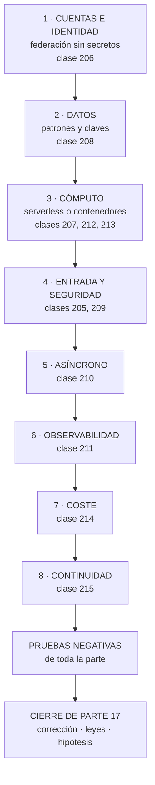

# 216 — Proyecto: CloudShop productivo en AWS

> [← 215 · Multi-región, Route 53, failover y game day](../../part-17-aws-production-architecture/215-multi-region-route-53-failover-y-game-day/README.md) · [Índice de la parte](../README.md) · [217 · Enterprise-scale landing zones y management groups →](../../part-18-azure-production-architecture/217-enterprise-scale-landing-zones-y-management-groups/README.md)

**Parte:** 17 — AWS: arquitectura, automatización y operación en producción<br>
**Nivel:** avanzado · **Horas estimadas:** 8<br>
**Laboratorio:** `capstone` · **Estado:** `EXECUTABLE_CORE`

## 🎯 Propósito

Poner en producción el sistema completo de CloudShop en AWS con lo de las once clases anteriores, y comprobarlo con las pruebas negativas de toda la parte. La clase da el orden de construcción, el entregable y los criterios. Y cierra la parte 17: corrige las cinco predicciones de la clase 204 —tres acertadas, una subestimada y una fallada—, actualiza el recuento de leyes, añade la ley 26 y escribe la hipótesis de la parte 18.

## 📚 Resultados de aprendizaje

Al finalizar podrás:

1. **Construir** el sistema completo en el orden que evita rehacer.
2. **Comprobar** con las pruebas negativas de toda la parte.
3. **Medir** coste, latencia y disponibilidad con cifras comparables.
4. **Corregir** las cinco predicciones de la clase 204 con evidencia.
5. **Escribir** la hipótesis de la parte 18 en forma refutable.

## 🧩 Conceptos centrales

| Concepto | Comprensión verificable |
|---|---|
| `sistema productivo` | El que tiene usuarios reales, guardia, presupuesto y continuidad comprobada. No el que funciona. |
| `orden de construcción` | Cuentas e identidad primero, diagnóstico y coste al final. Lo que condiciona a lo demás, antes. |
| `valor por defecto` | Configuración inicial de un servicio. Está elegida para que la demostración funcione. |
| `ley 26` | El valor por defecto está elegido para que la demostración funcione, no para que el sistema aguante. |
| `prueba negativa de parte` | Comprobación acumulada de las once clases, ejecutada sobre el sistema entero. |
| `hipótesis de parte` | Afirmación refutable escrita antes de estudiar, que la parte siguiente corrige con evidencia. |

## 🧠 Modelo mental

AWS se aprende como una progresión operativa: identidad federada, infraestructura declarativa, entrega, señales, recuperación y costo controlado.

Aplicado a esta clase, separa siempre cuatro planos: **intención** (qué necesita el usuario),
**configuración** (qué declaramos), **estado observado** (qué existe de verdad) y
**evidencia** (cómo sabemos que cumple). Confundirlos produce diseños que se ven correctos
en un diagrama pero fallan al operar.

## 🗺️ Flujo de razonamiento



## 📖 Desarrollo

### 1. El encargo y su orden

**El encargo.** Llevar a producción la plataforma de pedidos de CloudShop en AWS: con usuarios reales, guardia, presupuesto y continuidad comprobada.

**El orden**, por coste de cambio:

```text
1  CUENTAS E IDENTIDAD                            clase 206
   una cuenta por entorno; federación sin secretos
   barreras de organización: nadie puede crear roles ni
   desactivar auditoría desde una canalización
   → si esto llega tarde, hay que migrar todo lo anterior

2  DATOS                                          clase 208
   patrones de acceso escritos ANTES
   claves de partición que reparten
   lo que no encaja, replicado a otro almacén
   → la decisión más cara de cambiar de la parte

3  CÓMPUTO                              clases 207, 212, 213
   funciones para lo que encaja; contenedores para lo demás
   concurrencia reservada calculada por las conexiones
   memoria y tamaños medidos, no copiados

4  ENTRADA Y SEGURIDAD                   clases 205, 209
   distribución, bucket privado, capa 7 detrás
   testigo de acceso validado con las siete comprobaciones
   filtrado en modo cuenta antes de bloquear

5  ASÍNCRONO                                      clase 210
   bus, cola por consumidor, idempotencia
   cola de fallidos con alerta por antigüedad y reproceso
   probado

6  OBSERVABILIDAD                                 clase 211
   declarada junto al servicio; alertas que llegan a alguien

7  COSTE                                          clase 214
   etiquetas obligatorias en la creación; presupuestos con
   acción; retirada de lo ocioso

8  CONTINUIDAD                                    clase 215
   segunda región, y el ejercicio dirigido que la comprueba
```

Y la regla que resume la parte:

```text
en cada uno de los ocho pasos, la primera tarea es
REVISAR LOS VALORES POR DEFECTO
→ porque están elegidos para que la demostración funcione
                                                    ley 26
```

Y el error de método que hunde este proyecto:

```text
empezar por el paso 3, que es lo divertido
→ y descubrir en el paso 2 que la clave de partición está
  mal y hay que migrar                          clase 208
```

### 2. El entregable, las pruebas y la evaluación

**El documento**, con lo que hay que poder enseñar:

```text
1  el problema, con la cifra que lo demuestra
2  patrones de acceso, escritos y fechados antes del modelo
3  arquitectura: cuentas, servicios, datos, entrada, salida
4  la lista de VALORES POR DEFECTO cambiados y por qué
5  concurrencia, plazos y capacidad, con su cálculo
6  seguridad: testigos, autorización, filtrado, perímetro
7  observabilidad: qué se vigila y qué solo se consulta
8  coste: desglose, atribución y coste por unidad de negocio
9  continuidad: modo, plazos medidos y ejercicio ejecutado
10 pruebas negativas, con los fallos publicados
11 lo que NO se hace, y por qué
```

**Las pruebas negativas de la parte**, que son el criterio de terminado:

```text
☐ leer un objeto por la URL directa del bucket
☐ asumir el rol de producción desde otra rama o repositorio
☐ llamar a la API con testigo de identidad, caducado o
  alterado
☐ pedir el recurso de otro usuario con testigo válido
☐ llamar a la pasarela saltándose la distribución
☐ registrar un nombre con apóstrofo (que NO se bloquee)
☐ superar el límite de ritmo y recibir 429
☐ enviar la misma petición 50 veces en paralelo
☐ enviar el mismo mensaje 50 veces a la cola
☐ dejar un mensaje en la cola de fallidos y esperar la
  alerta
☐ reprocesar 10.000 mensajes sin tumbar la base
☐ agotar la concurrencia y comprobar que se rechaza en vez
  de caer
☐ desplegar una versión rota y ver la reversión automática
☐ desplegar durante tráfico y contar peticiones cortadas
☐ provocar la condición de cada alerta y ver si llega
☐ crear un recurso sin etiquetas
☐ borrar la pila y comprobar que los datos sobreviven
☐ perder la región primaria y cronometrar los cinco tramos
☐ volver a la primaria sin dos escritores
```

Y los criterios de evaluación, publicados antes:

```text                                                     peso
1  los patrones de acceso están fechados antes del modelo  3
2  la lista de valores por defecto cambiados es explícita  3
3  no queda ninguna credencial de larga duración           3
4  la concurrencia está calculada, no puesta a ojo         2
5  la autorización comprueba la propiedad del recurso      3
6  toda operación con efecto es idempotente                3
7  cada alerta se ha probado provocando la condición       2
8  el coste atribuido supera el 90 %                       2
9  hay coste por unidad de negocio                         2
10 la continuidad se midió ejecutándola                    3
11 las pruebas negativas se ejecutaron y hay fallos
   publicados                                              3
12 está escrito lo que no se hace                          1
```

Y el 11 pesa como los que más, con la evidencia acumulada:

```text
proporción de pruebas negativas que han fallado la primera
vez en este programa
  clase 144    3 de 11      27 %
  clase 168    5 de 11      45 %
  clase 179    9 de 31      29 %
  clase 189    3 de 14      21 %
  clase 204    6 de 15      40 %
→ un proyecto con cero fallos no las ejecutó       ley 22
```

### 3. Cierre de la parte 17: corrección de las cinco predicciones

**Las cinco predicciones de la clase 204, corregidas con la evidencia de las clases 205 a 215.**

```text
1. «bajar a un proveedor concreto revelará que buena parte de
    lo que hemos tratado como decisiones de arquitectura son
    valores por defecto; y estarán mal elegidos para
    producción en más de la mitad de los casos»

   CORRECTA, y con margen. De los valores por defecto que
   hubo que revisar en las once clases, la cuenta salió así:
   bucket con alojamiento estático y política pública, error
   404 convertido en 200, política de caché heredada,
   invalidación con comodín, memoria de función en el mínimo,
   plazo en 30 s, sin concurrencia reservada, sin alias,
   visibilidad de cola en 30 s, sin informe de fallo parcial,
   grupos de registros sin caducidad, nivel de depuración en
   producción, etiquetas de imagen mutables, registro sin
   caducidad, drenaje corto, porcentaje mínimo sano al 50 %,
   periodo de gracia menor que el arranque, circuito de
   despliegue desactivado y escalado por CPU. Diecinueve, y
   los diecinueve había que cambiarlos.

2. «el diseño de la base de datos por patrones de acceso será
    la decisión más cara de cambiar de la parte, y la que más
    veces se toma sin haber escrito los patrones»

   CORRECTA en las dos mitades. Fue la más cara: seis semanas
   de dos personas para cambiar una clave de partición que se
   había elegido en una tarde, por la primera consulta que
   pidió negocio. Y se tomó sin escribir los patrones, que
   habrían costado tres horas. Pero incompleta en algo: el
   error más CARO fue ese, y el más FRECUENTE fue otro —los
   valores por defecto, que aparecieron en casi todas las
   clases—.

3. «la eliminación de secretos mediante federación resultará
    sencilla técnicamente y lenta organizativamente: el
    obstáculo será quién tiene permiso para cambiarla»

   FALLADA, y en las dos mitades. La parte técnica NO era
   sencilla: tenía una trampa que dejó el sistema PEOR que
   con la clave estática, porque una condición de sujeto con
   comodín permitía a cualquiera de doscientos catorce
   miembros desplegar en producción creando un repositorio. Y
   la lentitud no vino de los permisos: vino de que el
   inventario decía cuarenta y una canalizaciones y había
   cuarenta y nueve. Predijimos el obstáculo equivocado, y lo
   más grave es que dimos por resuelta la parte que tenía el
   fallo.

4. «más de la mitad de los problemas del proyecto productivo
    no serán de AWS sino de lo mismo de siempre: leyes 25, 15
    y 22»

   CORRECTA. Una política pública añadida «para probar» y no
   retirada; ocho canalizaciones fuera del inventario, una
   con credenciales de administrador para un sistema retirado
   en 2023; once alertas a canales sin suscriptores, entre
   ellas la de la cola de fallidos que ocho meses después
   dejó cuarenta y un mil mensajes a un día de caducar; dos
   bases de datos de pruebas encendidas catorce meses; treinta
   y un entornos efímeros que nunca caducaron; y en el
   ejercicio de continuidad, seis de ocho hallazgos que no
   eran de infraestructura.

5. «el coste real será entre dos y cuatro veces la estimación
    inicial, y la diferencia estará casi toda en partidas que
    no son cómputo»

   CORRECTA EN EL MECANISMO Y CORTA EN LA CIFRA. La segunda
   mitad se cumplió por completo: el cómputo resultó ser el
   17 % de la factura de la API y el 20 % de la de la
   plataforma, y las partidas sorpresa fueron pasarela,
   registros, índices, transferencia entre zonas y capas
   huérfanas del registro de imágenes. Pero el factor no fue
   de dos a cuatro: fue de SIETE, porque la estimación
   inicial solo contaba invocaciones y duración.
```

**Marcador: tres correctas, una correcta y subestimada, una fallada.** Y la fallada enseña más que las otras cuatro: **dimos por resuelta la parte técnica y pusimos el problema en las personas, y resultó que la parte técnica tenía una trampa que empeoraba la seguridad mientras parecía mejorarla.**

### 4. Recuento de leyes, ley 26 e hipótesis de la parte 18

**El recuento de leyes, cerrada la parte 17.**

```text
ley 13  lo que no se mira deja de funcionar en silencio        45
ley 15  la señal existe y nadie la mira                        34
ley 22  un procedimiento nunca ejecutado no funciona           29
ley 14  el coste se decide al crear, no al pagar               28
ley 16  un control que estorba se rodea                        26
ley 20  lo que no tiene dueño se filtra y se desperdicia       26
ley 21  el acoplamiento vive en quién escribe                  21
ley 23  la capacidad la limita lo que ya se mantiene           13
ley 25  lo provisional sobrevive a su motivo                   12
ley 24  lo que no está en el diagrama no se analiza            11
ley 19  la compensación hace invisible el fallo                10
ley 17  se optimiza la medida, no el objetivo                  10
ley 18  lo asíncrono traslada la garantía, no la elimina        8
```

Y la parte 17 obliga a escribir una ley nueva, que es la más específica de todas y la que más dinero y latencia ha movido en esta parte:

```text
LEY 26
  el valor por defecto está elegido para que la
  demostración funcione, no para que el sistema aguante

apariciones en esta parte                                      5
  clase 205   alojamiento estático del bucket, 404 a 200,
              política de caché heredada, invalidación con
              comodín
  clase 207   memoria mínima, plazo de 30 s, sin
              concurrencia reservada, sin alias
  clase 210   visibilidad de 30 s, sin informe de fallo
              parcial de lote
  clase 211   grupos de registros sin caducidad, nivel de
              depuración en producción
  clase 212   drenaje corto, mínimo sano al 50 %, gracia
              menor que el arranque, escalado por CPU

y lo que la distingue
  no habla de descuido ni de falta de dueño
  habla de que el valor inicial está OPTIMIZADO PARA OTRA
  COSA: para que funcione en cinco minutos en un tutorial
  → el remedio no es vigilar: es revisar la lista de
    valores por defecto como primera tarea de cada servicio
```

**La hipótesis de la parte 18** (clases 217 a 228, Azure en producción), escrita antes de estudiarla para que la clase 228 la corrija:

```text
1. los valores por defecto de Azure estarán mal elegidos para
   producción en una proporción parecida a los de AWS, pero
   fallarán en otro sitio: los de AWS tienden a ser
   permisivos en red y almacenamiento; los de Azure lo serán
   en ámbito de identidad y de asignación de permisos
                                                     ley 26

2. la jerarquía de grupos de administración y suscripciones
   resultará ser el equivalente del plan de direcciones: se
   decide en una tarde, condiciona una década y renumerarla
   costará meses                                      ley 14

3. la identidad será el eje de toda la parte: lo que en AWS
   se resuelve con roles y políticas se resolverá aquí con
   el directorio, y el error más frecuente será un ÁMBITO DE
   ASIGNACIÓN demasiado amplio —el equivalente exacto de la
   condición de sujeto con comodín de la clase 206

4. la mayoría de los conceptos técnicos se corresponderán uno
   a uno entre las dos nubes; lo que NO se corresponderá es
   el modelo operativo, y trasladar «la misma arquitectura»
   costará más en operación que en código        clase 158

5. los problemas del proyecto productivo volverán a ser, en
   mayoría, de las leyes 25, 15 y 22. Y aquí añadimos algo
   incómodo: si esta predicción vuelve a acertar por cuarta
   parte consecutiva, dejará de tener mérito y pasará a ser
   una descripción, no una hipótesis. Lo que habrá que
   preguntarse entonces no es si acertamos, sino por qué,
   sabiéndolo, sigue ocurriendo
```

Y el cierre de la parte 17: **de once clases, lo que más dinero y latencia movió no fue ninguna decisión de arquitectura, sino diecinueve valores por defecto que había que cambiar y que funcionaban perfectamente sin cambiarlos**. La parte 18 hace el mismo recorrido en Azure, empezando por lo que allí condiciona todo lo demás: la jerarquía de suscripciones y grupos de administración. Es la clase 217.

## 🔬 Ejemplo trabajado

**El sistema de CloudShop en producción en AWS, montado con el método de la parte. Lo que sigue es el resumen del entregable, la lista de valores por defecto cambiados, y el resultado de las diecinueve pruebas negativas —de las que fallaron siete.**

**La arquitectura, en una página:**

```text
CUENTAS       organización con 4 cuentas: producción,
              preproducción, desarrollo, seguridad
              barreras: sin crear roles, sin desactivar
              auditoría, sin borrar copias

IDENTIDAD     federación desde el repositorio, 4 roles por
              propósito, producción atada a entorno
              protegido con 2 aprobaciones
              credenciales de larga duración: 2, ambas de
              terceros, con rotación y fecha de revisión

DATOS         DynamoDB con tabla única para pedidos y
              clientes; 9 patrones escritos y fechados
              búsqueda y analítica alimentadas por el flujo
              de cambios
              PostgreSQL solo para facturación heredada

CÓMPUTO       funciones para la API de pedidos
              contenedores para búsqueda y para el
              procesador de eventos
              Kubernetes solo para las cargas del equipo de
              datos

ENTRADA       CloudFront → capa 7 → API HTTP → funciones
              bucket privado con control de acceso al origen
              filtrado con 4 grupos, ajustados tras 3
              semanas en modo cuenta

ASÍNCRONO     bus → 4 colas → 4 consumidores
              todos idempotentes; todas con cola de fallidos

OBSERVABILIDAD declarada en la plantilla de cada servicio
              584 series de métricas, 63 alertas, 1 canal

COSTE         5 etiquetas obligatorias, barrera de creación
              presupuestos con acción en no producción
              retirada automática de lo ocioso

CONTINUIDAD   activo-pasivo en caliente en eu-central-1
              ejercicio ejecutado 2 veces
```

**La lista de valores por defecto cambiados**, que fue el entregable más útil:

```text
servicio        por defecto              cambiado a
────────────────────────────────────────────────────────────
S3              alojamiento estático     desactivado
S3              acceso público           bloqueado
S3              sin versionado           activado
CloudFront      caché heredada           política propia
                                         por ruta
CloudFront      sin cabeceras seg.       política de
                                         cabeceras
CloudFront      404 → 200 con index      función de borde
                                         por extensión
Lambda          128 MB                   1.024 MB (medido)
Lambda          plazo 30 s               8 s
Lambda          sin concurrencia         reservada, por
                reservada                conexiones
Lambda          sin alias                alias + escalonado
API             REST                     HTTP
SQS             visibilidad 30 s         300 s (por lote)
SQS             sin fallo parcial        activado
SQS             retención 4 días         14 días
CloudWatch      sin caducidad            21 días
CloudWatch      nivel depuración         información
ECR             etiquetas mutables       inmutables
ECR             sin caducidad            10 últimas por rama
ECS             drenaje 30 s             60 s
ECS             mínimo sano 50 %         100 %
ECS             gracia 30 s              120 s
ECS             sin circuito             activado
ECS             escalado por CPU         peticiones por
                                         tarea
DynamoDB        lectura fuerte           eventual salvo 2
                                         patrones

total cambiados                                          24
que funcionaban sin cambiarlos                           24
```

Y la observación que el equipo escribió:

```text
los veinticuatro funcionaban
ninguno daba error
ninguno aparecía en ninguna alerta
y los veinticuatro habrían causado un problema en
producción, entre coste, latencia, pérdida de datos o
seguridad                                            ley 26
```

**Las diecinueve pruebas negativas: siete fallaron.**

```text
✓  URL directa del bucket                          denegada
✓  rol de producción desde otra rama               denegado
✓  testigo de identidad, caducado o alterado       rechazado
✗  recurso de otro usuario con testigo válido
   → 2 de 11 rutas no comprobaban la propiedad; las 2 eran
     rutas nuevas añadidas después de la revisión
                                                clase 209
✓  llamada a la pasarela saltándose la distribución denegada
✓  registro con apóstrofo                          aceptado
✓  límite de ritmo                                 429
✓  misma petición 50 veces en paralelo             1 efecto
✗  mismo mensaje 50 veces a la cola
   → el consumidor de notificaciones no era idempotente:
     se había añadido en el último mes sin la comprobación
✓  mensaje en cola de fallidos → alerta            41 s
✗  reprocesar 10.000 mensajes
   → tumbó la base la primera vez: el procedimiento tenía
     límite de ritmo y quien lo ejecutó no lo usó porque
     no estaba en el primer paso              clase 210
✓  agotar la concurrencia                          429, sin
                                                   caída
✓  versión rota                                    revertida
                                                   en 2 min
✗  desplegar durante tráfico
   → 14 peticiones cortadas en el servicio de búsqueda:
     su aplicación no atendía la señal de terminación
                                                clase 212
✗  provocar la condición de cada alerta
   → 5 de 63 no llegaron; 3 por umbral mal puesto y 2 por
     destino equivocado
✓  recurso sin etiquetas                           rechazado
✗  borrar la pila y comprobar los datos
   → la tabla de idempotencia NO tenía política de
     retención y se borró
   → el sistema siguió funcionando, pero perdió la memoria
     de lo procesado: 1.100 mensajes en vuelo se habrían
     duplicado al reintentarse
✗  perder la región primaria
   → 12 min 40 s frente a los 10 min 40 s del último
     ejercicio: había 2 servicios nuevos sin réplica de
     imagen en la secundaria
✓  volver sin dos escritores                       correcto
```

Y el análisis de las siete:

```text
dos por servicios AÑADIDOS después de la última revisión
  (rutas sin comprobación de propiedad, consumidor sin
   idempotencia)
dos por procedimientos con pasos en mal orden o umbrales
  mal puestos
dos por omisiones al crecer (retención de una tabla nueva,
  réplica de imágenes de servicios nuevos)
una por una aplicación que no atendía la señal

→ SEIS de las siete se deben a lo mismo: el sistema creció
  y las comprobaciones no crecieron con él
→ y por eso las pruebas negativas se ejecutan
  PERIÓDICAMENTE, no una vez                       ley 22
```

**Las cifras del sistema en producción, tras tres meses:**

```text                                     estimado    medido
p99 del flujo de compra                   < 500 ms    412 ms
disponibilidad observada                    99,8 %    99,86 %
techo por dependencias                      99,84 %   —
coste mensual                             12.000 €   16.700 €
coste por pedido                            0,050 €    0,046 €
tiempo de conmutación de región             15 min    12 min 40 s
pérdida de datos en conmutación               1 min     22 s
coste atribuido                                90 %    94,1 %
alertas por turno                             < 2       0,7
proporción de alertas accionables            > 80 %      89 %
despliegues al mes                              —        94
  revertidos automáticamente                    —         5
  que causaron incidente                        —         0
```

Y las tres cosas que se decidió no hacer, registradas:

```text
no adoptar activo-activo: 7.700 €/mes frente a 410 € de
  pérdida evitada; se revisa si el negocio de empresa
  supera el 15 % de los ingresos
no migrar los servicios web a Kubernetes: funcionan
no unificar todo en contenedores: las funciones cubren su
  caso con menos operación
```

**La lección que este proyecto deja**: el entregable que más valor tuvo no fue el diagrama ni el cálculo de capacidad: fue **la tabla de veinticuatro valores por defecto cambiados**, todos los cuales funcionaban sin cambiarlos. Y de las diecinueve pruebas negativas, **seis de las siete que fallaron se debieron a que el sistema creció y las comprobaciones no crecieron con él**: rutas nuevas sin comprobar propiedad, un consumidor nuevo sin idempotencia, una tabla nueva sin retención y dos servicios nuevos sin réplica de imagen.

## 🧪 Laboratorio guiado

Ejecuta desde la raíz:

```bash
python classes/part-17-aws-production-architecture/216-proyecto-cloudshop-productivo-en-aws/lab.py
```

El laboratorio selecciona el motor de práctica **`capstone`** y produce
`lab_result.json`. El escenario, sus comprobaciones y el artefacto esperado corresponden a
esta clase; no requiere credenciales y deja explícito qué debe revalidarse en un sandbox real.

1. Lee `exercise.steps` y formula una predicción antes de ejecutar.
2. Ejecuta la práctica y verifica todos los elementos de `checks`.
3. Provoca el caso de `negative_test` y explica la señal observada.
4. Materializa `cloudshop-aws` en `evidence/` usando la plantilla indicada.
5. Para proveedor real, sigue `sandbox.requires`, registra costo y ejecuta `destroy`.

### Evidencia esperada

El artefacto principal es un incremento integrado, demostrable y documentado. Además, la entrega debe incluir el comando ejecutado,
la salida estructurada y una conclusión que no exceda lo observado.

## 🏆 Reto verificable

Construye **`cloudshop-aws`** para el caso CloudShop. Incluye una alternativa descartada,
un supuesto que pueda falsarse, una prueba de fallo y una decisión de rollback.

## ✅ Criterio de aceptación

- [ ] `lab.py` termina con código 0 y genera JSON válido.
- [ ] La entrega conecta al menos tres requisitos con mecanismos verificables.
- [ ] Existe una prueba positiva y una prueba negativa con evidencia.
- [ ] Seguridad, costo y operación aparecen como decisiones, no como anexos.
- [ ] Se declara una limitación y una condición que obligaría a revisar el diseño.
- [ ] Otra persona puede repetir el recorrido sin conocimiento tácito.

## ⚠️ Errores frecuentes

| Síntoma | Causa probable | Corrección |
|---|---|---|
| Hay que migrar datos a mitad del proyecto | Se empezó por el cómputo y la clave de partición se eligió por la primera consulta que pidió negocio | Escribe los patrones de acceso con su frecuencia y latencia antes de modelar, y fecha ese documento. |
| Todo funciona en pruebas y falla el primer día de carga real | Los valores por defecto están elegidos para que la demostración funcione | Revisa la lista de valores por defecto como primera tarea de cada servicio y documenta cuáles cambiaste y por qué. |
| Las comprobaciones pasan pero el sistema tiene huecos nuevos | Se añadieron servicios y rutas después de la última revisión | Ejecuta las pruebas negativas periódicamente y añade una por cada capacidad nueva, no solo al terminar. |
| Borrar una pila se lleva datos por delante | Los recursos con datos no tienen política de retención y viven en la misma pila que el código | Separa las pilas por ciclo de vida y pon retención a todo lo que guarde estado, incluidas las tablas auxiliares. |
| El procedimiento de recuperación se ejecuta mal bajo presión | Los pasos críticos no están al principio ni son obligatorios | Pon el límite de ritmo y los pasos de seguridad como primer paso, y haz que lo ejecute alguien que no lo escribió. |
| La estimación de coste se queda muy corta | Solo se contó el cómputo | Estima pasarela, registros, índices, transferencia entre zonas y almacenamiento de imágenes; suelen sumar más que el cómputo. |

## 🛡️ Seguridad, ética y costo

Trabaja con cuentas propias o sandboxes autorizados. No publiques secretos, identificadores
reales ni datos personales. Antes de crear recursos pagos define presupuesto, etiquetas y
comando de destrucción; después verifica que no queden recursos huérfanos. Los ejemplos
locales enseñan contratos, pero no certifican cumplimiento ni disponibilidad de producción.

## ❓ Preguntas de comprobación

1. ¿Por qué la primera tarea de cada servicio es revisar sus valores por defecto?
2. ¿Cuál de las cinco predicciones de la clase 204 falló y qué enseña su fallo?
3. ¿Qué dice la ley 26 y en qué se distingue de la 25?
4. ¿Qué proporción de pruebas negativas ha fallado la primera vez en este programa?
5. ¿Por qué seis de las siete pruebas fallidas del proyecto tenían la misma causa de fondo?

## 🔗 Referencias

- AWS (2025). *Well-Architected Framework*. <https://docs.aws.amazon.com/wellarchitected/latest/framework/welcome.html>
- AWS (2025). *Serverless Application Lens*. <https://docs.aws.amazon.com/wellarchitected/latest/serverless-applications-lens/welcome.html>
- AWS (2025). *Security Reference Architecture*. <https://docs.aws.amazon.com/prescriptive-guidance/latest/security-reference-architecture/welcome.html>
- Beyer, B. y otros (2018). *The Site Reliability Workbook*. <https://sre.google/workbook/table-of-contents/>
- Basiri, A. y otros (2016). *Chaos engineering*. <https://ieeexplore.ieee.org/document/7503833>
- Documentación oficial vigente del servicio implementado; registra URL y fecha de consulta.

---

> [Evaluación](assessment.md) · [Contrato de clase](lesson.yaml) · [Índice de la parte](../README.md)

**📥 Descargar:** [Parte 17 en PDF](../../../site/downloads/partes/manual-parte-17-aws-production-architecture.pdf) · [Recorrido de AWS en PDF](../../../site/downloads/nubes/manual-aws.pdf) · [Manual integral](../../../site/downloads/multi-cloud-engineering-manual-v2.0.pdf)

| Anterior | Índice | Siguiente |
|---|---|---|
| [← 215 · Multi-región, Route 53, failover y game day](../../part-17-aws-production-architecture/215-multi-region-route-53-failover-y-game-day/README.md) | [Parte 17](../README.md) · [Programa](../../README.md) | [217 · Enterprise-scale landing zones y management groups →](../../part-18-azure-production-architecture/217-enterprise-scale-landing-zones-y-management-groups/README.md) |
