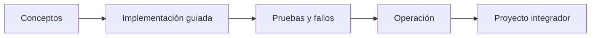

# Parte 17 — AWS: arquitectura, automatización y operación en producción

> [← Parte 16](../part-16-advanced-cloud-networking-edge/README.md) · [Índice completo](../README.md) · [Parte 18 →](../part-18-azure-production-architecture/README.md)

**📥 Descargar:** [Esta parte en PDF](../../site/downloads/partes/manual-parte-17-aws-production-architecture.pdf) · [Recorrido de AWS en PDF](../../site/downloads/nubes/manual-aws.pdf) · [Manual integral](../../site/downloads/multi-cloud-engineering-manual-v2.0.pdf)

**Nivel:** avanzado · **Clases:** 12 · **Duración sugerida:** 6–8 semanas

Integrar los casos AWS existentes en una ruta de producción con seguridad, costo, evidencia y destrucción.

## Resultados de la parte

Al completar esta parte podrás explicar el dominio con lenguaje independiente del proveedor,
implementar sus mecanismos esenciales, diagnosticar fallos y defender decisiones mediante
evidencia, costo, seguridad y objetivos de confiabilidad.

## Modelo mental

AWS se aprende como una progresión operativa: identidad federada, infraestructura declarativa, entrega, señales, recuperación y costo controlado.

## Secuencia

## Clases

| ID | Clase | Laboratorio | Horas |
|---:|---|---|---:|
| 205 | [Hosting progresivo con Amplify, S3 y CloudFront](205-hosting-progresivo-con-amplify-s3-y-cloudfront/README.md) | `delivery` | 4 |
| 206 | [OIDC de GitHub y GitLab hacia AWS sin secretos](206-oidc-de-github-y-gitlab-hacia-aws-sin-secretos/README.md) | `iam` | 4 |
| 207 | [SAM, Lambda, API Gateway y despliegue serverless](207-sam-lambda-api-gateway-y-despliegue-serverless/README.md) | `serverless` | 4 |
| 208 | [DynamoDB por patrones de acceso y single-table design](208-dynamodb-por-patrones-de-acceso-y-single-table-design/README.md) | `data` | 4 |
| 209 | [Cognito, JWT authorizers, WAF y defensa en profundidad](209-cognito-jwt-authorizers-waf-y-defensa-en-profundidad/README.md) | `security` | 4 |
| 210 | [EventBridge, SQS, DLQ, replay e idempotencia](210-eventbridge-sqs-dlq-replay-e-idempotencia/README.md) | `messaging` | 4 |
| 211 | [CloudWatch, X-Ray y observabilidad como código](211-cloudwatch-x-ray-y-observabilidad-como-codigo/README.md) | `observability` | 4 |
| 212 | [ECR, ECS Fargate, ALB y autoscaling](212-ecr-ecs-fargate-alb-y-autoscaling/README.md) | `container` | 4 |
| 213 | [EKS, IRSA, GitOps y operación de clúster](213-eks-irsa-gitops-y-operacion-de-cluster/README.md) | `kubernetes` | 4 |
| 214 | [Budgets, Cost Explorer, etiquetado y FinOps automatizado](214-budgets-cost-explorer-etiquetado-y-finops-automatizado/README.md) | `finops` | 4 |
| 215 | [Multi-región, Route 53, failover y game day](215-multi-region-route-53-failover-y-game-day/README.md) | `reliability` | 4 |
| 216 | [Proyecto: CloudShop productivo en AWS](216-proyecto-cloudshop-productivo-en-aws/README.md) | `capstone` | 8 |

## Evaluación de la parte

- 35 % laboratorios y evidencia reproducible.
- 25 % retos verificables.
- 20 % decisiones y ADR.
- 10 % seguridad, confiabilidad y costo.
- 10 % proyecto integrador de la parte.

Se aprueba con 80 % de clases en nivel B o superior y el proyecto integrador reproducible.

## Pauta bibliográfica

- AWS Well-Architected Framework — AWS.
- AWS Cookbook — Culkin y Zazon.
- Serverless Architectures on AWS — Peter Sbarski.
- Cloud FinOps — Storment y Fuller.
