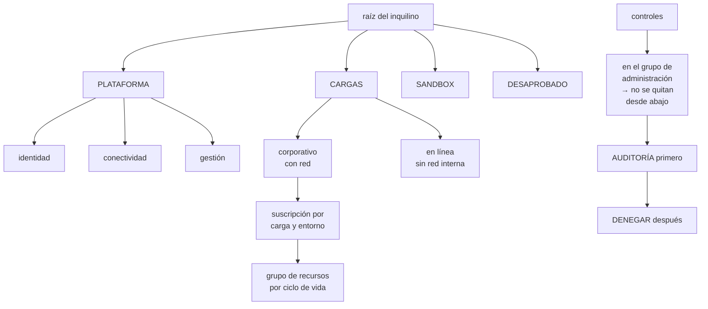

# 217 — Enterprise-scale landing zones y management groups

> [← 216 · Proyecto: CloudShop productivo en AWS](../../part-17-aws-production-architecture/216-proyecto-cloudshop-productivo-en-aws/README.md) · [Índice de la parte](../README.md) · [218 · Entra ID, workload identity, PIM y Conditional Access →](../../part-18-azure-production-architecture/218-entra-id-workload-identity-pim-y-conditional-access/README.md)

**Parte:** 18 — Azure: arquitectura empresarial y operación en producción<br>
**Nivel:** avanzado · **Horas estimadas:** 4<br>
**Laboratorio:** `governance` · **Estado:** `EXECUTABLE_CORE`

## 🎯 Propósito

Diseñar la jerarquía de Azure —grupos de administración, suscripciones y grupos de recursos— que es a esta nube lo que el plan de direcciones a la red: se decide en una tarde y condiciona una década. La clase da el criterio de reparto, explica dónde se aplican los controles para que no se puedan quitar desde abajo, y desarrolla la parte que más cuesta corregir después: **mover una suscripción de sitio no mueve lo que ya se creó con la política antigua**.

## 📚 Resultados de aprendizaje

Al finalizar podrás:

1. **Repartir** cargas entre grupos de administración y suscripciones con criterio.
2. **Aplicar** controles en el nivel correcto, sin que se puedan quitar desde abajo.
3. **Distinguir** política, iniciativa y bloqueo, y saber qué resuelve cada uno.
4. **Desplegar** políticas en modo auditoría antes de denegar.
5. **Corregir** una jerarquía mal repartida sin romper lo existente.

## 🧩 Conceptos centrales

| Concepto | Comprensión verificable |
|---|---|
| `grupo de administración` | Contenedor de suscripciones donde se aplican políticas y permisos heredados. Es el nivel que fija el gobierno. |
| `suscripción` | Unidad de facturación, de cuota y de aislamiento. Equivale funcionalmente a una cuenta. |
| `grupo de recursos` | Agrupación dentro de una suscripción, con ciclo de vida común. Se borra entero. |
| `política` | Regla que audita, deniega, modifica o despliega. Se hereda hacia abajo y no se puede quitar desde abajo. |
| `iniciativa` | Conjunto de políticas asignado como una unidad, con parámetros. Es la forma práctica de gobernar. |
| `zona de aterrizaje` | Suscripción preparada con red, identidad, controles y observabilidad, lista para recibir cargas. |

## 🧠 Modelo mental

La arquitectura Azure nace del tenant y las políticas heredables, y llega al workload mediante identidades administradas y redes privadas.

Aplicado a esta clase, separa siempre cuatro planos: **intención** (qué necesita el usuario),
**configuración** (qué declaramos), **estado observado** (qué existe de verdad) y
**evidencia** (cómo sabemos que cumple). Confundirlos produce diseños que se ven correctos
en un diagrama pero fallan al operar.

## 🗺️ Flujo de razonamiento



## 📖 Desarrollo

### 1. La jerarquía, y por qué se decide pronto

Azure tiene tres niveles y cada uno resuelve algo distinto. Confundirlos es el error inicial.

```text
GRUPO DE ADMINISTRACIÓN
  contenedor de suscripciones
  aquí van las POLÍTICAS y las asignaciones de permisos que
  se heredan
  → es el nivel del gobierno

SUSCRIPCIÓN
  unidad de facturación, de CUOTA y de aislamiento
  → los límites de recursos son por suscripción, y ese es
    el motivo práctico más frecuente para separar

GRUPO DE RECURSOS
  agrupación con ciclo de vida común
  → se borra entero; los recursos de un grupo deberían
    nacer y morir juntos
  → no es un mecanismo de aislamiento de seguridad fuerte
```

Y el reparto que funciona, que conviene copiar salvo buena razón:

```text
raíz
├── PLATAFORMA
│    ├── identidad          directorio, servidores heredados
│    ├── conectividad       red central, cortafuegos, DNS
│    └── gestión            registros, copias, herramientas
├── CARGAS
│    ├── corporativo        necesita red interna
│    └── en línea           público, sin red interna
├── SANDBOX                 experimentación, con caducidad
└── DESAPROBADO             lo que se retira, con controles
                            más duros y sin crecimiento
```

Y las tres decisiones que hay que tomar y que cuestan corregir:

```text
1  ¿UNA SUSCRIPCIÓN POR ENTORNO O POR CARGA?
   por entorno y por carga: producción de pedidos, una;
   preproducción de pedidos, otra
   → aísla cuota, facturación y permisos a la vez
   → y es lo que permite dar acceso de administrador a un
     equipo sobre SU entorno sin exponer los demás

2  ¿DÓNDE VAN LOS CONTROLES?
   en el grupo de administración, nunca en la suscripción
   → una política asignada en la suscripción la puede
     quitar quien administre esa suscripción
   → una asignada arriba, no                    clase 169

3  ¿QUÉ SE HEREDA Y QUÉ SE PARAMETRIZA?
   la misma iniciativa arriba, con parámetros distintos por
   rama
   → «regiones permitidas» puede ser más estricto en
     corporativo que en sandbox
```

Y la advertencia que da nombre a la clase:

```text
MOVER UNA SUSCRIPCIÓN DE SITIO NO ARREGLA LO YA CREADO
  las políticas de denegación solo actúan sobre
  CREACIONES y MODIFICACIONES
  → los recursos que ya existen siguen incumpliendo
  → aparecen como no conformes, y hay que corregirlos uno a
    uno o con tareas de remediación

→ y por eso la jerarquía se decide antes de crear nada
                                                    ley 14
```

### 2. Políticas: auditar antes de denegar

Las políticas son el mecanismo de gobierno de Azure y tienen cuatro efectos, con usos distintos.

```text
AUDITAR      registra el incumplimiento, no impide nada
             → siempre el primer paso
DENEGAR      impide crear o modificar
             → el control real
MODIFICAR    corrige el recurso al crearlo (añade etiquetas,
             activa cifrado)
             → mejor que denegar cuando se puede arreglar
               solo                              clase 214
DESPLEGAR SI NO EXISTE
             crea lo que falta (diagnóstico, agente)
             → potente y peligroso: despliega cosas que
               nadie pidió y que facturan
```

Y el orden de implantación, que es el mismo de la clase 200:

```text
1  ASIGNAR EN MODO AUDITORÍA, en el grupo de administración
2  MEDIR 2-4 semanas: cuántos recursos incumplen y cuáles
3  CLASIFICAR: incumplimientos reales frente a excepciones
   legítimas
4  CORREGIR o EXCEPTUAR, con dueño y fecha
5  CAMBIAR A DENEGAR
6  VIGILAR el cumplimiento como una señal más   clase 211

→ asignar en denegar el primer día bloquea despliegues
  legítimos y el gobierno pierde credibilidad     ley 16
```

**Las iniciativas**, que es como se gobierna de verdad:

```text
una política suelta es difícil de mantener
una INICIATIVA agrupa decenas con parámetros
  → se asigna una vez por rama, con sus parámetros
  → y el cumplimiento se mide por iniciativa, no política a
    política

las iniciativas mínimas de una organización
  etiquetas obligatorias y sus valores          clase 214
  regiones permitidas
  tipos de recurso permitidos o prohibidos
  cifrado obligatorio y versión mínima de TLS
  sin acceso público en almacenamiento ni en bases
  diagnóstico enviado al destino central
  y las de cumplimiento normativo, si aplican
```

Y una advertencia sobre el modo de despliegue automático:

```text
una política que despliega el agente de diagnóstico en
cada recurso nuevo
  → resuelve el problema de la observabilidad ausente
  → y crea coste que nadie pidió                clase 214
→ hay que estimar el coste de lo que la política despliega
  ANTES de asignarla
```

**Los bloqueos**, que son otra cosa y se confunden con las políticas:

```text
BLOQUEO DE BORRADO      impide eliminar el recurso
BLOQUEO DE SOLO LECTURA impide modificarlo

  se aplican al recurso o al grupo, y los hereda lo de dentro
  → útiles para lo que nunca debe borrarse: bases de datos
    de producción, red central, copias
  → y son un incordio si se ponen de más: bloquean el
    despliegue declarativo             ← y entonces se quitan
                                          y nadie los repone
                                                    ley 25
```

### 3. Suscripciones: cuotas, facturación y aislamiento

La suscripción es el nivel donde se topan los límites, y ese es el motivo práctico que más veces obliga a separar.

```text
LO QUE ES POR SUSCRIPCIÓN
  cuotas de cómputo por familia y por región
  límites de recursos por tipo
  la factura y su desglose
  y el ámbito natural de muchos permisos

CONSECUENCIAS PRÁCTICAS
  una carga que consume mucha cuota puede impedir crecer a
  otra de la misma suscripción
  → separar por carga aísla ese riesgo

  las cuotas NO son automáticas: hay que pedirlas con
  antelación
  → y en un incidente que requiera escalar mucho, la cuota
    es el límite real, no la capacidad de Azure
  → por eso se pide margen antes, y se vigila el consumo
    frente al límite                             clase 262
```

**Las zonas de aterrizaje**, que es la forma de que una suscripción nueva nazca lista:

```text
QUÉ TRAE UNA SUSCRIPCIÓN ENTREGADA
  colocada en el grupo de administración correcto
  red conectada al centro, con sus rangos del plan
                                                clase 219
  identidad y permisos base asignados
  diagnóstico enrutado al destino central
  presupuesto y etiquetas obligatorias          clase 214
  y las políticas heredadas ya aplicando

Y EL PLAZO IMPORTA
  si entregar una suscripción tarda tres semanas, los
  equipos usarán la suya, o crearán recursos donde puedan
                                                    ley 16
  → automatizar la entrega es lo que hace que el gobierno
    se cumpla                                    clase 171
```

Y la decisión sobre quién administra qué:

```text
EL EQUIPO DE PLATAFORMA administra
  grupos de administración, políticas, red central,
  identidad, destinos de diagnóstico

EL EQUIPO DE LA CARGA administra
  su suscripción: crea, despliega y opera dentro de las
  reglas heredadas

Y LO QUE NADIE DEBE PODER HACER
  quitar una política heredada
  cambiar el enrutamiento del diagnóstico
  crear emparejamientos de red por su cuenta
  → estas son las que van arriba, denegadas
```

### 4. Corregir una jerarquía mal repartida

Casi ninguna organización empieza con la jerarquía correcta. Corregirla se puede, y hay un orden.

```text
LO QUE SE PUEDE MOVER
  una suscripción puede cambiar de grupo de administración
  un recurso puede cambiar de grupo de recursos (a veces)
  y en algunos casos, de suscripción

LO QUE NO SE MUEVE FÁCIL
  recursos con dependencias de red
  recursos con identidad administrada asignada
  claves y secretos con referencias
  y todo lo que tenga la suscripción escrita en su
  identificador en otro sitio
```

Y el procedimiento:

```text
1  DEFINIR la jerarquía objetivo y las iniciativas
2  ASIGNARLAS EN AUDITORÍA en el nivel correcto
3  MEDIR el incumplimiento actual
   → esta es la fotografía que dice cuánto trabajo hay
4  MOVER las suscripciones al grupo que les corresponde
   → recordando que lo ya creado sigue incumpliendo
5  REMEDIAR lo existente, por lotes y por prioridad
   → primero lo que afecta a seguridad y a datos
6  PASAR A DENEGAR cuando el incumplimiento sea residual
7  DEJAR el cumplimiento como señal vigilada
```

Y lo que hay que medir mientras tanto:

```text
recursos conformes frente a totales, por iniciativa
y su TENDENCIA
  → si no baja, la remediación no está ocurriendo
excepciones vivas y su antigüedad             clase 190
  → si crecen siempre, la política está mal calibrada
```

Y una advertencia sobre las exenciones:

```text
una exención sin fecha es una política que no existe
                                                    ley 25
→ toda exención con dueño, motivo y caducidad
→ y un panel con las que vencen este mes
```

Y la lista de comprobación de la clase:

```text
☐ hay grupos separados para plataforma, cargas, sandbox y
  desaprobado
☐ las suscripciones se separan por carga Y por entorno
☐ todas las políticas se asignan en grupos de
  administración, no en suscripciones
☐ las políticas se asignaron primero en auditoría
☐ se midió el incumplimiento antes de denegar
☐ las iniciativas están parametrizadas por rama
☐ está estimado el coste de lo que despliegan las políticas
☐ los bloqueos están solo donde hacen falta y no estorban
  al despliegue declarativo
☐ las cuotas están pedidas con margen y se vigilan
☐ entregar una suscripción nueva está automatizado y tarda
  minutos
☐ ningún equipo de carga puede quitar una política heredada
☐ toda exención tiene dueño, motivo y caducidad
☐ el cumplimiento por iniciativa se vigila como una señal
```

Y el cierre que enlaza con la clase siguiente: con la jerarquía puesta, el control que de verdad decide el alcance en Azure no es la política sino quién puede hacer qué y desde dónde. Identidad, identidades de carga, elevación temporal y acceso condicional es la materia de la clase 218.

## 🔬 Ejemplo trabajado

**CloudShop lleva cuatro años en Azure con 61 suscripciones creadas sin criterio. Lo que sigue es la fotografía del incumplimiento, la jerarquía nueva, y el hallazgo de que mover las suscripciones no arregló casi nada.**

**El punto de partida:**

```text
suscripciones                                       61
  bajo la raíz, sin grupo de administración        47
  en un grupo llamado «Producción»                  9
  en un grupo llamado «Test»                        5

políticas asignadas                                 12
  en grupos de administración                        3
  EN SUSCRIPCIONES                                   9  ←
  de las 9, quitadas por el equipo de la carga       4

y la consecuencia
  4 equipos habían quitado las políticas de su propia
  suscripción porque «bloqueaban el despliegue»
  → y nadie se enteró: no había alerta de cambio de
    asignación                                       ley 15
```

Y el detalle de por qué las quitaron:

```text
la política denegaba crear cuentas de almacenamiento sin
cifrado con clave propia
la plantilla del equipo no lo declaraba
y el mensaje de error decía solo «denegado por política»
→ nadie sabía qué faltaba
→ y quitar la política era más rápido que averiguarlo
                                                    ley 16
```

**La jerarquía nueva:**

```text
raíz
├── plataforma
│    ├── identidad          1 suscripción
│    ├── conectividad       2 (una por región)
│    └── gestión            1
├── cargas
│    ├── corporativo        34 suscripciones
│    │     pedidos-prod, pedidos-pre, pedidos-dev,
│    │     catalogo-prod, … (una por carga y entorno)
│    └── en línea            9
├── sandbox                 12  ← con caducidad de 90 días
└── desaprobado              2

y el criterio escrito
  una suscripción por CARGA y por ENTORNO
  motivo   aísla cuota, factura y permisos a la vez
  coste de cambio si nos equivocamos   alto
```

**Las iniciativas, con sus parámetros por rama:**

```text
iniciativa                    corporativo  en línea  sandbox
etiquetas obligatorias           denegar    denegar   auditar
regiones permitidas              2 (UE)     2 (UE)    2 (UE)
sin acceso público                denegar    denegar   denegar
cifrado en reposo                 denegar    denegar   auditar
TLS mínimo 1.2                    denegar    denegar   denegar
diagnóstico al destino central   desplegar  desplegar auditar
tipos de recurso permitidos      restringido  amplio   amplio
sin IP pública en máquinas        denegar    auditar   auditar
```

Y el coste que se estimó antes de asignar:

```text
la política que despliega el diagnóstico crearía
  un ajuste de diagnóstico por recurso
  ingesta estimada a partir del inventario  ~1.900 €/mes
→ se ajustó qué categorías se envían y con qué caducidad
→ ingesta real                                640 €/mes
→ sin esta estimación previa, habría sido una sorpresa en
  la factura del mes siguiente                 clase 214
```

**La fase de auditoría, cuatro semanas.**

```text
recursos totales                              14.200

incumplimientos por iniciativa
  etiquetas obligatorias                       9.140  64 %
  cifrado en reposo                            1.870  13 %
  sin acceso público                             340   2,4 %
  TLS mínimo                                     620   4,4 %
  regiones permitidas                            112   0,8 %
  tipos de recurso                                88   0,6 %
  sin IP pública                                 210   1,5 %

y los que preocupaban de verdad
  340 recursos con acceso público
    de ellos, cuentas de almacenamiento          214
    de ellas, con datos de clientes               19  ←
  112 recursos fuera de las regiones permitidas
    de ellos, 8 con datos personales fuera de la UE  ←
```

Y la decisión sobre el orden de remediación:

```text
no se atacó lo más numeroso (etiquetas, 9.140)
se atacó lo más grave: los 19 almacenes públicos con datos
y los 8 recursos fuera de región
→ resueltos en 9 días
→ las etiquetas, en 6 semanas con tareas de remediación
```

**El hallazgo: mover las suscripciones no arregló casi nada.**

```text
al mover las 61 suscripciones a su grupo correcto
  políticas heredadas aplicando                    sí
  recursos existentes corregidos                    0

  porque las políticas de denegación solo actúan sobre
  creaciones y modificaciones
  → los 14.200 recursos existentes siguieron exactamente
    igual
  → aparecieron como no conformes, y nada más

lo que sí corrigió recursos existentes
  las políticas de tipo MODIFICAR con tareas de remediación
  → añadieron etiquetas a 8.100 recursos en 3 días
  → y el resto hubo que tocarlo a mano o redesplegarlo

lo que NO se pudo remediar automáticamente
  cifrado en reposo de recursos ya creados: 1.870
  → exige recrear el recurso en la mayoría de los casos
  → 1.410 se recrearon en 4 meses
  →   460 quedaron con exención, con dueño y fecha
```

**El paso a denegar, y la lección de la comunicación.**

```text
primer intento
  se cambiaron 7 iniciativas a denegar el mismo día
  a las 4 horas, 23 despliegues bloqueados
  el mensaje decía «denegado por política»
  → 11 tiquetes de soporte en una tarde

corrección
  se volvió a auditoría
  se añadió a cada política un mensaje con
    qué falta exactamente
    el enlace a la plantilla que ya lo cumple
    y a quién pedir una exención, con el plazo
  y la plantilla de servicio nuevo se actualizó para
    cumplirlas todas                            clase 171

segundo intento, dos semanas después
  despliegues bloqueados en la primera semana         4
  de ellos, incumplimientos reales                    4
  tiquetes de soporte                                 0
  → porque el mensaje decía qué hacer
```

**La entrega de suscripciones, automatizada:**

```text
antes   petición por correo → 3 semanas
        y 12 de las 61 suscripciones se habían creado por
        fuera del proceso                            ley 16

después una plantilla en la canalización crea
          la suscripción en el grupo correcto
          red conectada al centro, con rangos del plan
          identidad y permisos base
          diagnóstico enrutado
          presupuesto y etiquetas
        plazo                                     22 min
        suscripciones creadas por fuera en 6 meses      0
```

**El resultado, seis meses después:**

```text                                        antes     después
suscripciones sin grupo de administración      47           0
políticas asignadas en suscripciones            9           0
políticas quitadas por equipos                  4      imposible
recursos conformes (etiquetas)                36 %        98 %
almacenes públicos con datos                   19           0
recursos fuera de región permitida            112           0
exenciones vivas                                0          22
  con dueño, motivo y caducidad                 —          22
  vencidas y sin renovar                        —           1
plazo de entrega de una suscripción       3 semanas     22 min
suscripciones creadas por fuera del proceso    12           0
```

**La lección que esta clase deja**: mover sesenta y una suscripciones al grupo correcto **no corrigió ni un solo recurso existente**, porque las políticas de denegación solo actúan al crear o modificar; lo que corrigió catorce mil recursos fue una combinación de políticas de tipo modificar, tareas de remediación y cuatro meses de recrear cosas. Y las cuatro políticas que los equipos habían quitado no las quitaron por mala fe: **las quitaron porque el mensaje de error decía «denegado por política» y no decía qué faltaba**.

## 🧪 Laboratorio guiado

Ejecuta desde la raíz:

```bash
python classes/part-18-azure-production-architecture/217-enterprise-scale-landing-zones-y-management-groups/lab.py
```

El laboratorio selecciona el motor de práctica **`governance`** y produce
`lab_result.json`. El escenario, sus comprobaciones y el artefacto esperado corresponden a
esta clase; no requiere credenciales y deja explícito qué debe revalidarse en un sandbox real.

1. Lee `exercise.steps` y formula una predicción antes de ejecutar.
2. Ejecuta la práctica y verifica todos los elementos de `checks`.
3. Provoca el caso de `negative_test` y explica la señal observada.
4. Materializa `azure-landing-zone` en `evidence/` usando la plantilla indicada.
5. Para proveedor real, sigue `sandbox.requires`, registra costo y ejecuta `destroy`.

### Evidencia esperada

El artefacto principal es una jerarquía de política, ownership y evidencia. Además, la entrega debe incluir el comando ejecutado,
la salida estructurada y una conclusión que no exceda lo observado.

## 🏆 Reto verificable

Construye **`azure-landing-zone`** para el caso CloudShop. Incluye una alternativa descartada,
un supuesto que pueda falsarse, una prueba de fallo y una decisión de rollback.

## ✅ Criterio de aceptación

- [ ] `lab.py` termina con código 0 y genera JSON válido.
- [ ] La entrega conecta al menos tres requisitos con mecanismos verificables.
- [ ] Existe una prueba positiva y una prueba negativa con evidencia.
- [ ] Seguridad, costo y operación aparecen como decisiones, no como anexos.
- [ ] Se declara una limitación y una condición que obligaría a revisar el diseño.
- [ ] Otra persona puede repetir el recorrido sin conocimiento tácito.

## ⚠️ Errores frecuentes

| Síntoma | Causa probable | Corrección |
|---|---|---|
| Un equipo quita la política que le estorba y nadie se entera | La política estaba asignada en la suscripción, que ese equipo administra | Asigna siempre en el grupo de administración y alerta sobre cambios de asignación. |
| Mover las suscripciones no corrige ningún recurso | Las políticas de denegación solo actúan sobre creaciones y modificaciones | Usa políticas de tipo modificar con tareas de remediación para lo existente, y planifica recrear lo que no se pueda corregir. |
| Al activar el modo denegar se bloquean despliegues legítimos y llueven los tiquetes | Se pasó de cero a denegar sin auditar y sin mensajes útiles | Audita semanas, corrige lo real, añade mensajes que digan qué falta y actualiza la plantilla por defecto antes de denegar. |
| Una carga impide crecer a otra sin relación con ella | Comparten suscripción y por tanto cuota | Separa por carga y por entorno, y pide cuota con margen antes de necesitarla. |
| Aparecen recursos creados fuera del proceso | Conseguir una suscripción tarda semanas | Automatiza la entrega de suscripciones preparadas; si tarda minutos, nadie busca atajos. |
| La factura crece tras aplicar el gobierno | Una política despliega agentes o ajustes de diagnóstico en cada recurso nuevo | Estima el coste de lo que la política despliega antes de asignarla y ajusta categorías y caducidad. |

## 🛡️ Seguridad, ética y costo

Trabaja con cuentas propias o sandboxes autorizados. No publiques secretos, identificadores
reales ni datos personales. Antes de crear recursos pagos define presupuesto, etiquetas y
comando de destrucción; después verifica que no queden recursos huérfanos. Los ejemplos
locales enseñan contratos, pero no certifican cumplimiento ni disponibilidad de producción.

## ❓ Preguntas de comprobación

1. ¿Qué resuelve cada uno de los tres niveles de la jerarquía?
2. ¿Por qué las políticas se asignan en grupos de administración y no en suscripciones?
3. ¿Qué corrige mover una suscripción de grupo y qué no?
4. ¿Cuál es el orden correcto para implantar una política y por qué?
5. ¿Qué debe llevar una exención para ser útil?

## 🔗 Referencias

- Microsoft (2025). *Cloud Adoption Framework: Azure landing zone design areas*. <https://learn.microsoft.com/en-us/azure/cloud-adoption-framework/ready/landing-zone/>
- Microsoft (2025). *Management groups and organizing resources*. <https://learn.microsoft.com/en-us/azure/governance/management-groups/overview>
- Microsoft (2025). *Azure Policy effects and remediation*. <https://learn.microsoft.com/en-us/azure/governance/policy/concepts/effects>
- Microsoft (2025). *Azure Policy exemptions*. <https://learn.microsoft.com/en-us/azure/governance/policy/concepts/exemption-structure>
- Microsoft (2025). *Subscription vending and landing zone automation*. <https://learn.microsoft.com/en-us/azure/cloud-adoption-framework/ready/landing-zone/design-area/subscription-vending>
- Documentación oficial vigente del servicio implementado; registra URL y fecha de consulta.

---

> [Evaluación](assessment.md) · [Contrato de clase](lesson.yaml) · [Índice de la parte](../README.md)

| Anterior | Índice | Siguiente |
|---|---|---|
| [← 216 · Proyecto: CloudShop productivo en AWS](../../part-17-aws-production-architecture/216-proyecto-cloudshop-productivo-en-aws/README.md) | [Parte 18](../README.md) · [Programa](../../README.md) | [218 · Entra ID, workload identity, PIM y Conditional Access →](../../part-18-azure-production-architecture/218-entra-id-workload-identity-pim-y-conditional-access/README.md) |
