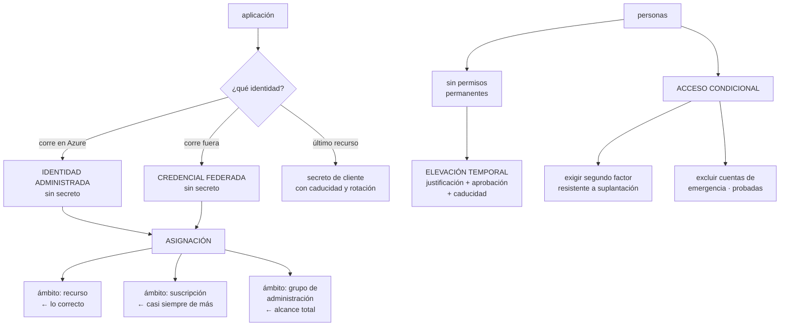

# 218 — Entra ID, workload identity, PIM y Conditional Access

> [← 217 · Enterprise-scale landing zones y management groups](../../part-18-azure-production-architecture/217-enterprise-scale-landing-zones-y-management-groups/README.md) · [Índice de la parte](../README.md) · [219 · Hub-spoke, Virtual WAN, Private Link y DNS privado →](../../part-18-azure-production-architecture/219-hub-spoke-virtual-wan-private-link-y-dns-privado/README.md)

**Parte:** 18 — Azure: arquitectura empresarial y operación en producción<br>
**Nivel:** avanzado · **Horas estimadas:** 4<br>
**Laboratorio:** `iam` · **Estado:** `EXECUTABLE_CORE`

## 🎯 Propósito

Resolver la identidad en Azure, que es donde se decide el alcance real de todo lo demás. La clase cubre las identidades de carga sin secretos, el modelo de asignación de permisos con su error característico —**un ámbito demasiado amplio, que es el equivalente exacto del comodín de la clase 206**—, la elevación temporal para el acceso administrativo y el acceso condicional como control de contexto que se aplica a personas y a cargas.

## 📚 Resultados de aprendizaje

Al finalizar podrás:

1. **Eliminar** secretos de aplicación usando identidades administradas y federación.
2. **Asignar** permisos en el ámbito mínimo y detectar los amplios.
3. **Configurar** elevación temporal con aprobación para el acceso administrativo.
4. **Aplicar** acceso condicional sin quedarse fuera del propio inquilino.
5. **Revisar** accesos periódicamente y retirar lo que no se usa.

## 🧩 Conceptos centrales

| Concepto | Comprensión verificable |
|---|---|
| `identidad administrada` | Identidad ligada a un recurso de Azure, sin credenciales que gestionar. Asignada por el sistema o por el usuario. |
| `credencial federada` | Confianza declarada en un emisor externo para que sus testigos obtengan credenciales sin secreto. |
| `ámbito de asignación` | Nivel al que se concede un permiso: grupo de administración, suscripción, grupo de recursos o recurso. |
| `elevación temporal` | Activación de un permiso administrativo por tiempo limitado, con justificación y aprobación. |
| `acceso condicional` | Regla que decide si una autenticación se permite según usuario, aplicación, dispositivo, red y riesgo. |
| `acceso de emergencia` | Cuentas excluidas de las políticas, para no quedarse fuera. Vigiladas y probadas. |

## 🧠 Modelo mental

La arquitectura Azure nace del tenant y las políticas heredables, y llega al workload mediante identidades administradas y redes privadas.

Aplicado a esta clase, separa siempre cuatro planos: **intención** (qué necesita el usuario),
**configuración** (qué declaramos), **estado observado** (qué existe de verdad) y
**evidencia** (cómo sabemos que cumple). Confundirlos produce diseños que se ven correctos
en un diagrama pero fallan al operar.

## 🗺️ Flujo de razonamiento



## 📖 Desarrollo

### 1. Identidad de carga sin secretos

El objetivo es el mismo de la clase 206: que ninguna aplicación tenga una credencial guardada.

```text
IDENTIDAD ADMINISTRADA — para lo que corre EN Azure
  el recurso tiene identidad propia; la plataforma le
  entrega testigos
  sin secretos, sin rotación, sin nada que robar

  ASIGNADA POR EL SISTEMA
    nace y muere con el recurso
    + no queda huérfana
    − no se puede preasignar permisos antes de crearlo

  ASIGNADA POR EL USUARIO
    recurso independiente, reutilizable por varios
    + permisos preparados antes; sirve para conjuntos
    − sobrevive al recurso                          ley 25
    → y hay que retirarla cuando ya no la use nadie

CREDENCIAL FEDERADA — para lo que corre FUERA
  canalizaciones, cargas en otro clúster, otra nube
  se declara confianza en el emisor y en el sujeto
  → mismo mecanismo y mismos errores que en la clase 206

SECRETO DE CLIENTE — último recurso
  con caducidad corta, rotación automatizada y una
  excepción registrada con fecha                    ley 25
```

Y la regla que ordena la elección:

```text
¿corre en Azure?        identidad administrada
¿corre fuera?           credencial federada
¿ninguna de las dos?    secreto, con fecha de revisión

→ y una función de aptitud: cero secretos de cliente sin
  excepción registrada                          clase 190
```

Y el detalle de configuración donde se falla, igual que en AWS:

```text
LA CREDENCIAL FEDERADA SE ATA A
  emisor, sujeto y audiencia

✗ sujeto con comodín, o sin comprobar audiencia
  → cualquier repositorio u organización puede obtener
    el testigo
✓ sujeto exacto: organización, repositorio y entorno

→ es el mismo fallo de la clase 206 con otro nombre, y por
  eso la prueba negativa es idéntica: intentarlo desde otro
  origen y comprobar que falla                      ley 22
```

### 2. El ámbito de asignación: el error característico

En Azure los permisos se conceden asignando un papel a una identidad **en un ámbito**, y el ámbito se hereda hacia abajo. Ahí está el error.

```text
LOS CUATRO ÁMBITOS, de mayor a menor
  grupo de administración   → todas sus suscripciones
  suscripción               → todos sus grupos y recursos
  grupo de recursos         → todo lo de dentro
  recurso                   → solo ese

Y LA COSTUMBRE
  asignar «Colaborador» en la suscripción, porque es
  cómodo y funciona
  → esa identidad puede crear, modificar y borrar
    CUALQUIER cosa de la suscripción
  → incluida la base de datos de producción
```

Y el equivalente exacto de la clase 206:

```text
en AWS   una condición de sujeto con comodín permite que
         cualquiera asuma el rol
en Azure una asignación en un ámbito amplio permite que la
         identidad toque cualquier cosa de ese ámbito

→ el mecanismo es distinto; el resultado, el mismo:
  alcance enorme desde un punto comprometido    clase 189
```

**Cómo se hace bien**, con el coste que tiene:

```text
asignar en el ÁMBITO DEL RECURSO o del grupo de recursos
con el papel MÁS ESPECÍFICO que exista
  no «Colaborador» sino «Colaborador de datos de blob»
  no «Propietario» nunca, salvo casos contados

y cuando no existe un papel adecuado
  papel personalizado, con las acciones justas
  → cuesta mantenerlo, y compensa en los casos de mucho
    alcance
```

Y los papeles que hay que tratar como excepcionales:

```text
Propietario                 puede conceder permisos
                            → quien lo tiene, lo tiene todo
Administrador de acceso     puede conceder permisos
                            → equivalente en la práctica
Colaborador en suscripción  puede borrar casi todo

→ estos tres se conceden con elevación temporal, nunca de
  forma permanente
```

**Cómo detectar los ámbitos amplios**, que es el trabajo continuo:

```text
inventario de asignaciones, por ámbito
  ¿cuántas hay en grupo de administración?
  ¿cuántas en suscripción?
  ¿cuántas identidades tienen Propietario?

y la medida que importa
  ALCANCE desde cada identidad: a cuántos recursos llega
  → se mide, y es la cifra que ordena el trabajo
                                          clases 133, 189

y las asignaciones que no se usan
  → los registros de actividad dicen qué permisos se
    ejercen de verdad
  → lo concedido y no usado se retira            clase 134
```

Y una fuente de alcance que se olvida:

```text
LOS GRUPOS ANIDADOS
  un grupo dentro de otro hereda sus asignaciones
  → alguien añadido a un grupo «de proyecto» acaba con
    permisos de producción sin que nadie lo decida
→ hay que revisar la pertenencia efectiva, no la directa
```

### 3. Elevación temporal y revisión de accesos

Para las personas, el objetivo es que **nadie tenga permisos administrativos permanentes**.

```text
EL MODELO
  la persona es ELEGIBLE para un papel, no lo tiene
  cuando lo necesita, lo activa
    con justificación escrita
    con aprobación de otra persona, si el papel es
      sensible
    con segundo factor en el momento de activar
    y con CADUCIDAD: 1, 4 u 8 horas

QUÉ RESUELVE
  el permiso permanente que nadie revisa
  el administrador que se va y conserva accesos
  el compromiso de una cuenta con permisos totales
  y deja registro de POR QUÉ se usó, no solo de que se usó
                                                clase 141
```

Y los detalles que hacen que funcione o que se rodee:

```text
SI ACTIVAR TARDA MUCHO, la gente pedirá permanente
  → activación en segundos cuando no requiere aprobación
  → y aprobadores suficientes, con turnos, cuando sí
                                                    ley 16

SI NO HAY APROBADOR DISPONIBLE DE MADRUGADA
  → un incidente se atasca esperando
  → por eso los papeles de emergencia se activan sin
    aprobación, con alerta inmediata y revisión posterior

Y LA PRUEBA QUE HAY QUE HACER
  activar el papel de emergencia y cronometrar
  → en la clase 179, el acceso de emergencia estaba creado,
    documentado y NO funcionaba                     ley 22
```

**Las revisiones de acceso**, que es lo que impide la acumulación:

```text
cada trimestre, quien es dueño revisa
  quién es elegible para cada papel
  qué identidades tienen asignaciones amplias
  qué invitados externos siguen teniendo acceso

y la regla que las hace útiles
  quien no responde a la revisión → se retira el acceso
  → si la falta de respuesta lo conserva, la revisión no
    sirve de nada
```

Y la señal que dice si el modelo está funcionando:

```text
número de asignaciones PERMANENTES de papeles sensibles
  objetivo: cero, salvo cuentas de emergencia
y número de activaciones al mes, con su justificación
  → si nadie activa nunca, o sobran los papeles o la gente
    tiene permisos por otra vía
```

### 4. Acceso condicional, sin quedarse fuera

El acceso condicional decide si una autenticación se permite según el contexto, y es el control más potente del directorio.

```text
LO QUE PUEDE EVALUAR
  quién: usuario, grupo, papel
  qué: aplicación o recurso
  desde dónde: red, país, dispositivo
  con qué: dispositivo conforme o unido al directorio
  y el riesgo: de la sesión y del usuario

LO QUE PUEDE EXIGIR
  segundo factor
  dispositivo conforme
  aplicación cliente aprobada
  frecuencia de reautenticación
  o directamente bloquear
```

**Las políticas mínimas** de una organización:

```text
1  segundo factor para TODOS los usuarios
   → y resistente a suplantación (llave física o similar)
     para los papeles administrativos
2  bloquear protocolos de autenticación antiguos
   → son los que se saltan el segundo factor
3  exigir dispositivo conforme para el acceso
   administrativo
4  bloquear países donde no se opera
   → medida sencilla que reduce mucho el ruido
5  exigir reautenticación al elevar privilegios
6  y proteger los flujos de registro de credenciales
   → registrar un segundo factor es un momento crítico
```

Y el error que deja a la organización fuera de su propio inquilino:

```text
UNA POLÍTICA QUE EXIGE DISPOSITIVO CONFORME A TODOS
  incluidas las cuentas administrativas
  y el día que falla el sistema de conformidad, o el
  dispositivo del administrador se rompe
  → nadie puede entrar a arreglarlo

LA PROTECCIÓN
  cuentas de acceso de emergencia
    excluidas de todas las políticas condicionales
    con credenciales largas guardadas físicamente
    con alerta INMEDIATA en cada uso
    y probadas cada trimestre                      ley 22
  y siempre DOS, por si una falla
```

Y la disciplina de despliegue, que es la misma de siempre:

```text
1  crear la política en modo SOLO INFORME
2  medir a quién afectaría, durante semanas
3  excluir lo que haya que excluir, con registro
4  activar para un grupo piloto
5  activar para todos
→ activar una política condicional para todos el primer día
  es la forma más rápida de dejar a la empresa sin acceso
                                                clase 200
```

Y la lista de comprobación de la clase:

```text
☐ ninguna aplicación tiene secretos de cliente sin excepción
  registrada
☐ lo que corre en Azure usa identidad administrada
☐ las credenciales federadas atan emisor, sujeto y audiencia
☐ no hay asignaciones de Propietario permanentes
☐ las asignaciones se hacen en el ámbito del recurso o del
  grupo
☐ se usa el papel más específico disponible
☐ está medido el alcance desde cada identidad
☐ se revisan los permisos concedidos y no usados
☐ se revisa la pertenencia efectiva a grupos, no la directa
☐ los papeles sensibles requieren elevación temporal
☐ hay aprobadores suficientes y activación rápida
☐ el acceso de emergencia se ha probado este trimestre
☐ hay dos cuentas de emergencia excluidas de las políticas
☐ cada uso de emergencia dispara alerta inmediata
☐ las políticas condicionales se desplegaron en solo informe
☐ los protocolos de autenticación antiguos están bloqueados
```

Y el cierre que enlaza con la clase siguiente: con la jerarquía y la identidad resueltas, queda conectar las suscripciones entre sí y con el centro de datos, y decidir por dónde entra y sale el tráfico. Red en Azure es la materia de la clase 219.

## 🔬 Ejemplo trabajado

**CloudShop revisa la identidad de su inquilino de Azure. Lo que sigue es el inventario de asignaciones, las tres identidades que podían tocar toda la producción, y la política condicional que dejó al equipo fuera durante cuarenta minutos.**

**El inventario:**

```text
identidades de aplicación                            184
  con identidad administrada                          61
  con credencial federada                              9
  CON SECRETO DE CLIENTE                             114  ←
    de ellos, caducados y aún referenciados           18
    de ellos, con más de 2 años                       47

asignaciones de papel                              1.940
  en grupo de administración                          31  ←
  en suscripción                                     820  ←
  en grupo de recursos                               760
  en recurso                                         329

papeles sensibles, permanentes
  Propietario                                         41
  Administrador de acceso                             12
  Colaborador en suscripción                         214
```

Y las tres asignaciones que resultaron peores:

```text
1  la identidad de la canalización de despliegue tenía
   Colaborador en el grupo de administración «cargas»
   → alcance: 43 suscripciones, todo
   → y podía borrar bases de datos de producción

2  una identidad administrada asignada por el usuario,
   creada en 2022 para una prueba, tenía Propietario en la
   suscripción de producción de pedidos
   → el recurso que la usaba se borró hace 2 años
   → la identidad seguía viva, con Propietario     ley 25

3  un grupo llamado «Proyecto Migración 2023» tenía
   Colaborador en 9 suscripciones
   → 34 personas seguían en él
   → 11 ya no trabajaban en esas cargas
   → y 3 habían entrado por pertenencia ANIDADA, sin que
     nadie los añadiera a propósito
```

**El alcance medido**, que es lo que ordenó el trabajo:

```text
identidad                     recursos alcanzables
canalización de despliegue              14.200   ← todo
identidad huérfana de 2022               1.840
grupo Proyecto Migración                 6.100
api-pedidos (correcta)                       4
procesador-eventos (correcta)                7

→ dos identidades y un grupo concentraban casi todo el
  riesgo del inquilino
```

**Las correcciones:**

```text
CANALIZACIÓN
  antes    Colaborador en grupo de administración
  después  4 identidades federadas, una por propósito
           cada una con asignación en el GRUPO DE RECURSOS
           que le toca
           y una barrera: ninguna puede asignar papeles ni
           modificar políticas
  alcance  14.200 → 340 recursos, repartidos en 4

IDENTIDAD HUÉRFANA
  retirada
  y una comprobación nueva: identidades administradas
  asignadas por el usuario sin ningún recurso asociado
  → se encontraron 23 más                          ley 25

GRUPO DE PROYECTO
  retirado; sustituido por grupos por carga y entorno
  y revisión trimestral de pertenencia EFECTIVA

SECRETOS DE CLIENTE
  114 → 12 en cuatro meses
    61 pasaron a identidad administrada
    28 a credencial federada
    13 se apagaron: eran aplicaciones que ya no existían
    12 quedan, todos de terceros, con rotación automática
       y excepción registrada con fecha
  los 18 caducados y referenciados
    → 4 de ellos, en aplicaciones que fallaban
      silenciosamente desde hacía meses            ley 13
```

**La elevación temporal:**

```text
se retiraron TODAS las asignaciones permanentes de
Propietario y Administrador de acceso
y pasaron a elegibles con activación

  Propietario                aprobación de 2, caducidad 4 h
  Administrador de acceso    aprobación de 2, caducidad 2 h
  Colaborador en suscripción activación directa, 8 h
  Emergencia                 sin aprobación, alerta
                             inmediata, revisión posterior

los primeros dos meses
  activaciones                                       412
  con justificación útil                             340
  con justificación tipo «trabajo»                    72
    → se pidió mejorarlas; a los 3 meses, 11
  activaciones de emergencia                           3
    · 2 incidentes reales
    · 1 porque el aprobador estaba de vacaciones y nadie
      había cubierto el turno            ← se corrigió

y la prueba de emergencia, ejecutada
  primer intento   la cuenta de emergencia no podía activar
                   porque la política condicional creada en
                   el paso siguiente la había incluido
                   sin querer
  → corregido, y añadido al calendario trimestral
```

**La política condicional que dejó al equipo fuera.**

```text
se creó una política: «exigir dispositivo conforme para
acceder al portal de Azure»
se activó directamente para todos

  a las 09:40, el sistema de evaluación de conformidad
  tuvo una incidencia y marcó como no conformes a 190
  dispositivos
  → nadie del equipo de plataforma podía entrar al portal
  → incluidas las 2 cuentas de emergencia, que se habían
    incluido en el ámbito por error

  09:40  se detecta
  09:52  se localiza a alguien con acceso desde otro camino
  10:20  política desactivada
  duración                                         40 min

qué faltó
  modo solo informe durante semanas
  exclusión explícita y COMPROBADA de las cuentas de
    emergencia
  y despliegue por grupos                       clase 200

segundo intento
  1  solo informe, 3 semanas
     → 1.140 accesos que se habrían bloqueado
     → de ellos, 210 legítimos desde dispositivos no
       registrados: contratistas y 2 equipos con portátiles
       propios
  2  se registraron los dispositivos legítimos
  3  exclusión de cuentas de emergencia, comprobada
     entrando con ellas
  4  grupo piloto de 12 personas, 2 semanas
  5  activación general
  accesos bloqueados legítimos tras activar             2
```

**El resto de políticas, con su despliegue:**

```text
política                              informe   activa
segundo factor para todos               3 sem     sí
segundo factor resistente para
  papeles administrativos               2 sem     sí
bloquear autenticación antigua          4 sem     sí
  → el informe encontró 6 aplicaciones que la usaban
  → 4 se corrigieron, 2 se apagaron
dispositivo conforme para portal        3 sem     sí
bloquear países no operados             1 sem     sí
  → 41.000 intentos bloqueados el primer mes
reautenticación al elevar               1 sem     sí
```

**El resultado, seis meses después:**

```text                                        antes     después
secretos de cliente                          114          12
  caducados y referenciados                   18           0
asignaciones en grupo de administración       31           4
asignaciones en suscripción                  820         190
Propietario permanente                        41           0
alcance de la identidad de despliegue     14.200         340
identidades huérfanas                         24           0
personas con permisos administrativos
  permanentes                                267           2
  (las 2 cuentas de emergencia)
prueba de emergencia ejecutada                 no    trimestral
incidentes por política condicional             1           0
```

**La lección que esta clase deja**: el error característico de Azure resultó ser **exactamente el equivalente del comodín de la clase 206**: no una condición mal escrita, sino un ámbito de asignación demasiado alto, con una sola identidad capaz de tocar catorce mil recursos. Y la política de seguridad que se activó para proteger el portal **dejó a la empresa fuera durante cuarenta minutos**, incluidas las cuentas de emergencia que existían precisamente para eso y que nadie había comprobado.

## 🧪 Laboratorio guiado

Ejecuta desde la raíz:

```bash
python classes/part-18-azure-production-architecture/218-entra-id-workload-identity-pim-y-conditional-access/lab.py
```

El laboratorio selecciona el motor de práctica **`iam`** y produce
`lab_result.json`. El escenario, sus comprobaciones y el artefacto esperado corresponden a
esta clase; no requiere credenciales y deja explícito qué debe revalidarse en un sandbox real.

1. Lee `exercise.steps` y formula una predicción antes de ejecutar.
2. Ejecuta la práctica y verifica todos los elementos de `checks`.
3. Provoca el caso de `negative_test` y explica la señal observada.
4. Materializa `azure-identity` en `evidence/` usando la plantilla indicada.
5. Para proveedor real, sigue `sandbox.requires`, registra costo y ejecuta `destroy`.

### Evidencia esperada

El artefacto principal es una matriz de acceso mínimo con prueba de denegación. Además, la entrega debe incluir el comando ejecutado,
la salida estructurada y una conclusión que no exceda lo observado.

## 🏆 Reto verificable

Construye **`azure-identity`** para el caso CloudShop. Incluye una alternativa descartada,
un supuesto que pueda falsarse, una prueba de fallo y una decisión de rollback.

## ✅ Criterio de aceptación

- [ ] `lab.py` termina con código 0 y genera JSON válido.
- [ ] La entrega conecta al menos tres requisitos con mecanismos verificables.
- [ ] Existe una prueba positiva y una prueba negativa con evidencia.
- [ ] Seguridad, costo y operación aparecen como decisiones, no como anexos.
- [ ] Se declara una limitación y una condición que obligaría a revisar el diseño.
- [ ] Otra persona puede repetir el recorrido sin conocimiento tácito.

## ⚠️ Errores frecuentes

| Síntoma | Causa probable | Corrección |
|---|---|---|
| Una identidad de aplicación puede tocar recursos que no tienen nada que ver con ella | La asignación se hizo en la suscripción o en el grupo de administración | Asigna en el ámbito del recurso o del grupo de recursos, con el papel más específico disponible, y mide el alcance resultante. |
| Alguien acaba con permisos de producción sin que nadie se los diera | Pertenencia anidada a un grupo con asignaciones amplias | Revisa la pertenencia efectiva, no la directa, y retira los grupos de proyecto cuando el proyecto termina. |
| Una identidad sigue teniendo permisos y su recurso ya no existe | Identidad administrada asignada por el usuario, que sobrevive al recurso | Inventaría periódicamente las identidades sin recurso asociado y retíralas. |
| Una aplicación falla en silencio desde hace meses | Su secreto de cliente caducó y nadie lo vigilaba | Sustituye por identidad administrada o federada; para lo que quede, rotación automática y alerta por caducidad próxima. |
| Nadie puede entrar al portal cuando falla un sistema auxiliar | Una política condicional se activó para todos sin exclusiones comprobadas | Despliega en solo informe, excluye dos cuentas de emergencia y comprueba entrando con ellas antes de activar. |
| La gente pide permisos permanentes pese a existir elevación temporal | Activar tarda demasiado o no hay aprobadores disponibles | Activación en segundos cuando no requiere aprobación, aprobadores con turnos y un papel de emergencia sin aprobación con alerta inmediata. |

## 🛡️ Seguridad, ética y costo

Trabaja con cuentas propias o sandboxes autorizados. No publiques secretos, identificadores
reales ni datos personales. Antes de crear recursos pagos define presupuesto, etiquetas y
comando de destrucción; después verifica que no queden recursos huérfanos. Los ejemplos
locales enseñan contratos, pero no certifican cumplimiento ni disponibilidad de producción.

## ❓ Preguntas de comprobación

1. ¿Qué identidad corresponde a una carga que corre en Azure y cuál a una que corre fuera?
2. ¿Cuál es el equivalente en Azure del comodín en la condición de sujeto de AWS?
3. ¿Qué hace que la elevación temporal se rodee y cómo se evita?
4. ¿Por qué hacen falta dos cuentas de acceso de emergencia y qué hay que probar de ellas?
5. ¿Cómo se despliega una política condicional sin dejar a la organización fuera?

## 🔗 Referencias

- Microsoft (2025). *Managed identities for Azure resources*. <https://learn.microsoft.com/en-us/entra/identity/managed-identities-azure-resources/overview>
- Microsoft (2025). *Workload identity federation*. <https://learn.microsoft.com/en-us/entra/workload-id/workload-identity-federation>
- Microsoft (2025). *Azure RBAC scope and best practices*. <https://learn.microsoft.com/en-us/azure/role-based-access-control/best-practices>
- Microsoft (2025). *Privileged Identity Management*. <https://learn.microsoft.com/en-us/entra/id-governance/privileged-identity-management/pim-configure>
- Microsoft (2025). *Conditional Access and emergency access accounts*. <https://learn.microsoft.com/en-us/entra/identity/role-based-access-control/security-emergency-access>
- Documentación oficial vigente del servicio implementado; registra URL y fecha de consulta.

---

> [Evaluación](assessment.md) · [Contrato de clase](lesson.yaml) · [Índice de la parte](../README.md)

**📥 Descargar:** [Parte 18 en PDF](../../../site/downloads/partes/manual-parte-18-azure-production-architecture.pdf) · [Recorrido de Azure en PDF](../../../site/downloads/nubes/manual-azure.pdf) · [Manual integral](../../../site/downloads/multi-cloud-engineering-manual-v2.0.pdf)

| Anterior | Índice | Siguiente |
|---|---|---|
| [← 217 · Enterprise-scale landing zones y management groups](../../part-18-azure-production-architecture/217-enterprise-scale-landing-zones-y-management-groups/README.md) | [Parte 18](../README.md) · [Programa](../../README.md) | [219 · Hub-spoke, Virtual WAN, Private Link y DNS privado →](../../part-18-azure-production-architecture/219-hub-spoke-virtual-wan-private-link-y-dns-privado/README.md) |
