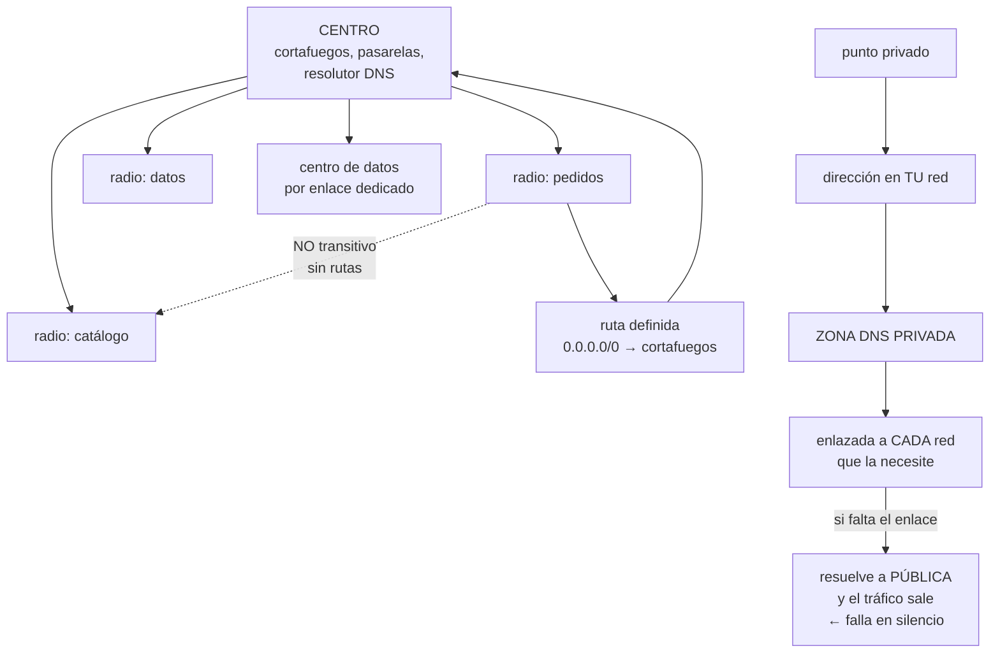

# 219 — Hub-spoke, Virtual WAN, Private Link y DNS privado

> [← Clase anterior](../../part-18-azure-production-architecture/218-entra-id-workload-identity-pim-y-conditional-access/README.md) · [Índice de la parte](../README.md) · [Clase siguiente →](../../part-18-azure-production-architecture/220-bicep-deployment-stacks-y-azure-verified-modules/README.md)

**Parte:** 18 — Azure: arquitectura empresarial y operación en producción<br>
**Nivel:** avanzado · **Horas estimadas:** 4<br>
**Laboratorio:** `network` · **Estado:** `EXECUTABLE_CORE`

## 🎯 Propósito

Montar la red de Azure conectando decenas de suscripciones sin abrir caminos indeseados. La clase cubre la topología de centro y radios frente a la gestionada, los puntos privados hacia los servicios de la plataforma, y la parte que produce la mayoría de los incidentes de esta capa: **la resolución de nombres privados, que en Azure exige enlazar cada zona a cada red y falla en silencio cuando no se hace**.

## 📚 Resultados de aprendizaje

Al finalizar podrás:

1. **Elegir** entre centro y radios propio y topología gestionada.
2. **Segmentar** con grupos de seguridad y rutas, cerrando por ausencia de camino.
3. **Conectar** a los servicios de la plataforma con puntos privados.
4. **Resolver** nombres privados en todas las redes, sin huecos.
5. **Diagnosticar** los fallos característicos de esta topología.

## 🧩 Conceptos centrales

| Concepto | Comprensión verificable |
|---|---|
| `centro y radios` | Topología con una red central que concentra conectividad e inspección, y redes de carga conectadas a ella. |
| `emparejamiento` | Conexión entre dos redes virtuales. No es transitivo por sí solo: hace falta encaminar. |
| `ruta definida por el usuario` | Ruta que obliga al tráfico a pasar por un dispositivo. Es lo que fuerza la inspección. |
| `punto privado` | Interfaz con dirección de tu red que representa un servicio de la plataforma. |
| `zona DNS privada` | Zona que resuelve el nombre del servicio a la dirección privada. Debe enlazarse a cada red que la necesite. |
| `grupo de seguridad de red` | Reglas de filtrado por subred o interfaz, con prioridades y reglas por defecto que hay que conocer. |

## 🧠 Modelo mental

La arquitectura Azure nace del tenant y las políticas heredables, y llega al workload mediante identidades administradas y redes privadas.

Aplicado a esta clase, separa siempre cuatro planos: **intención** (qué necesita el usuario),
**configuración** (qué declaramos), **estado observado** (qué existe de verdad) y
**evidencia** (cómo sabemos que cumple). Confundirlos produce diseños que se ven correctos
en un diagrama pero fallan al operar.

## 🗺️ Flujo de razonamiento



## 📖 Desarrollo

### 1. Topología: centro y radios

La topología estándar de Azure concentra en una red central lo que no debe repetirse.

```text
EN EL CENTRO
  cortafuegos o dispositivo de inspección
  pasarelas hacia el centro de datos y hacia internet
  resolutor DNS y sus reglas de reenvío
  y, a veces, los puntos privados compartidos

EN CADA RADIO
  las cargas, en sus subredes
  sin pasarela propia ni salida directa a internet
```

Y la propiedad que hay que entender antes de nada:

```text
EL EMPAREJAMIENTO NO ES TRANSITIVO
  radio A ↔ centro y radio B ↔ centro
  → A NO alcanza B automáticamente
  → hace falta que el tráfico pase por un dispositivo del
    centro y haya rutas que lo lleven allí

→ y esto es una VENTAJA: el aislamiento entre radios es el
  estado por defecto                            clase 199
→ abrirlo es una decisión, no un descuido
```

**La elección entre montar el centro o usar la topología gestionada:**

```text
CENTRO PROPIO
  + control total: cualquier dispositivo, cualquier diseño
  + más barato en tráfico
  − hay que montar y operar el encaminamiento y la
    alta disponibilidad

TOPOLOGÍA GESTIONADA (Virtual WAN)
  + conecta radios, sedes y usuarios remotos con menos
    trabajo
  + encaminamiento y escala gestionados
  + tablas de rutas para segmentar               clase 199
  − coste por conexión y por gigabyte
  − menos control fino

CRITERIO
  pocas redes y una región    → centro propio
  muchas sedes, varias regiones, usuarios remotos
                              → gestionada
```

Y lo que hay que decidir en ambos casos:

```text
¿POR DÓNDE SALE EL TRÁFICO A INTERNET?
  salida centralizada por el cortafuegos del centro
  → registro, control y direcciones fijas       clase 200
  → y una ruta definida por el usuario en cada subred que
    mande 0.0.0.0/0 al cortafuegos

¿QUÉ RADIOS SE VEN ENTRE SÍ?
  por defecto, ninguno
  → y lo que se abra, con rutas explícitas y pasando por
    inspección si cruza fronteras de confianza  clase 189
```

Y una decisión que ahorra dinero y latencia:

```text
el tráfico entre dos radios que se hablan mucho puede ir
directo con un emparejamiento entre ellos
→ evita pagar el proceso del cortafuegos dos veces
→ y hay que decidirlo, no dejarlo pasar por costumbre
                                                clase 199
```

### 2. Filtrado y rutas: lo que hay que saber

Los grupos de seguridad de red tienen reglas por defecto que sorprenden si no se conocen.

```text
REGLAS POR DEFECTO, que existen aunque no se vean
  entrante   permitido desde la propia red virtual
             permitido desde el balanceador
             DENEGADO todo lo demás
  saliente   permitido hacia la propia red virtual
             PERMITIDO HACIA INTERNET            ←
             denegado el resto

→ la salida a internet está PERMITIDA por defecto
→ y por eso el control de salida es una decisión explícita
                                          clase 200, ley 26
```

Y el funcionamiento por prioridad, que causa confusión:

```text
las reglas se evalúan por número de prioridad, de menor a
mayor, y la PRIMERA que coincide decide
→ una regla permisiva con prioridad baja anula las
  restrictivas posteriores
→ y las reglas por defecto tienen prioridades muy altas:
  siempre se evalúan al final

regla práctica
  deja huecos entre prioridades (100, 200, 300…)
  y documenta el orden esperado
```

Y dónde aplicarlos:

```text
A LA SUBRED     lo habitual; se aplica a todo lo de dentro
A LA INTERFAZ   para excepciones; complica el diagnóstico
→ aplicar en los dos sitios a la vez es la causa más común
  de «no entiendo por qué no llega»
```

**Las rutas definidas por el usuario**, que son lo que fuerza la inspección:

```text
por defecto, cada subred tiene rutas del sistema hacia
  la propia red, los emparejamientos e internet

una ruta definida por el usuario las sustituye
  0.0.0.0/0 → dirección del cortafuegos
  → todo el tráfico saliente pasa por él

y el error clásico
  poner la ruta en la subred del cortafuegos también
  → el tráfico entra en bucle
  → la subred del dispositivo NO lleva esa ruta
```

Y la regla del prefijo más específico, que aquí también manda:

```text
si hay una ruta más específica hacia otro sitio, gana
  → así se implementan las excepciones            clase 194
→ y así también se abren caminos sin querer, si alguien
  añade una ruta «temporal»                        ley 25
```

Y una comprobación que resuelve la mitad de los casos:

```text
la herramienta de diagnóstico de siguiente salto dice, para
un origen y un destino concretos, qué ruta se aplica y hacia
dónde va
→ y hay otra que dice qué regla de seguridad permite o
  deniega ese flujo
→ usarlas antes de suponer                      clase 202
```

### 3. Puntos privados y la trampa del DNS

Los puntos privados en Azure resuelven lo mismo que en la clase 200, y tienen una particularidad que causa la mayoría de los incidentes de esta clase.

```text
CÓMO FUNCIONA
  se crea un punto privado en una subred: obtiene una
  dirección de TU red
  el servicio queda alcanzable por esa dirección
  y se puede desactivar su acceso público

Y LA PARTE QUE FALLA
  el nombre público del servicio debe resolver a la
  dirección PRIVADA
  eso lo hace una ZONA DNS PRIVADA
  y esa zona debe estar ENLAZADA a cada red virtual que la
  necesite

  ✗ si falta el enlace
    el nombre resuelve a la dirección PÚBLICA
    → el tráfico sale a internet
    → y si el acceso público está desactivado, FALLA
    → y si no lo está, FUNCIONA pagando salida y sin
      pasar por ningún control            ← lo peor
```

Y por eso el fallo es silencioso:

```text
funciona desde la red donde se creó el punto privado
y no funciona —o funciona por internet— desde las demás
→ el síntoma es «a mí me va bien»                clase 195
```

**El montaje que evita el problema:**

```text
ZONAS PRIVADAS CENTRALIZADAS
  todas las zonas de puntos privados en la suscripción de
  conectividad
  enlazadas a TODAS las redes que las necesitan
  y creadas automáticamente por política          clase 217
    → una política de tipo «desplegar si no existe» que
      registra el punto privado en la zona correcta
    → sin ella, cada equipo crea su zona y aparecen
      duplicadas y divergentes

RESOLUTOR PRIVADO EN EL CENTRO
  con regla de reenvío desde el centro de datos hacia
  Azure y viceversa
  → y hay que comprobarlo EN LOS DOS SENTIDOS  clase 195

COMPROBACIÓN AUTOMÁTICA
  para cada servicio con punto privado, resolver su nombre
  desde CADA red y verificar que devuelve dirección privada
  → función de aptitud, ejecutada a diario     clase 190
```

Y una decisión que hay que tomar y que se olvida:

```text
DESACTIVAR EL ACCESO PÚBLICO del servicio
  crear el punto privado no cierra el público
  → el servicio sigue alcanzable desde internet
  → y la política de «sin acceso público» de la clase 217
    es lo que lo impide de verdad
```

Y el consumo de direcciones, que hay que planificar:

```text
un punto privado = una dirección de la subred
30 servicios × 3 entornos = 90 direcciones
→ y a eso se suman las subredes que ciertos servicios
  exigen en exclusiva y con tamaño mínimo
→ el plan de direcciones tiene que contarlo    clase 193
```

### 4. Diagnóstico y operación

Los fallos de esta topología tienen firmas reconocibles.

```text
SÍNTOMA                             CAUSA HABITUAL
funciona desde una red y no desde   falta el enlace de la
otra                                zona DNS privada

el tráfico sale a internet pese     el nombre resuelve a la
a tener punto privado               dirección pública

dos radios no se ven                el emparejamiento no es
                                    transitivo y faltan rutas

el tráfico no pasa por el           falta la ruta definida
cortafuegos                         por el usuario en esa
                                    subred

bucle de encaminamiento             la ruta 0.0.0.0/0 se puso
                                    también en la subred del
                                    cortafuegos

se permite algo que no debería      una regla permisiva con
                                    prioridad menor gana

no llega y las reglas parecen       hay grupo de seguridad en
correctas                           la subred Y en la interfaz

todo deja de funcionar tras un      alguien cambió una ruta
cambio de red                       y el prefijo más
                                    específico desvió el
                                    tráfico
```

Y las herramientas, por orden de coste:

```text
1  comprobación de siguiente salto y de flujo permitido
   → responde en segundos qué ruta y qué regla aplican
2  registros de flujo de los grupos de seguridad
   → quién habla con quién, qué se deniega   clase 202
3  captura de paquetes
   → solo cuando lo anterior no basta
```

**Lo que hay que vigilar:**

```text
zonas privadas sin enlazar a redes que las necesitan
puntos privados cuyo nombre resuelve a dirección pública
reglas de seguridad con origen o destino demasiado amplios
rutas definidas por el usuario creadas fuera del proceso
estado de las pasarelas y de las sesiones hacia el centro
  de datos                                     clase 198
uso de direcciones por subred, frente al total
  → una subred agotada bloquea el escalado     clase 193
```

Y una alerta que evita sorpresas:

```text
«ha aparecido una ruta o una regla que no está en el
 repositorio»
→ detecta los cambios manuales, que son los que se quedan
                                                    ley 25
```

Y la lista de comprobación de la clase:

```text
☐ la topología está decidida y justificada
☐ los radios no se ven entre sí salvo decisión explícita
☐ toda subred de carga tiene ruta 0.0.0.0/0 al cortafuegos
☐ la subred del cortafuegos NO tiene esa ruta
☐ los grupos de seguridad están en la subred, no en ambos
  sitios
☐ las prioridades dejan huecos y están documentadas
☐ se sabe que la salida a internet está permitida por
  defecto
☐ los servicios de plataforma se alcanzan por punto privado
☐ el acceso público de esos servicios está desactivado
☐ las zonas DNS privadas están centralizadas y enlazadas a
  todas las redes
☐ hay política que registra los puntos privados en la zona
  correcta
☐ hay comprobación diaria de que cada nombre resuelve a
  dirección privada desde cada red
☐ el reenvío de nombres con el centro de datos funciona en
  ambos sentidos
☐ el plan de direcciones cuenta los puntos privados y las
  subredes exclusivas
☐ hay alerta ante rutas o reglas creadas fuera del proceso
```

Y el cierre que enlaza con la clase siguiente: con jerarquía, identidad y red resueltas, hace falta declarar todo esto como código de forma que se pueda desplegar, revisar y retirar. Es la materia de la clase 220.

## 🔬 Ejemplo trabajado

**CloudShop monta la red de sus 61 suscripciones en Azure. Lo que sigue es el incidente del punto privado que llevaba meses saliendo a internet, el bucle de encaminamiento del primer día, y la comprobación diaria que quedó montada.**

**La topología elegida:**

```text
centro propio, uno por región (2)
  cortafuegos con inspección
  pasarela hacia el centro de datos              clase 198
  resolutor DNS privado con reglas de reenvío
  zonas DNS privadas de todos los servicios

43 radios: uno por carga y entorno
  sin pasarela propia
  sin salida directa a internet
  ruta 0.0.0.0/0 → cortafuegos del centro

motivo de centro propio y no gestionado
  2 regiones, sin sedes remotas ni usuarios remotos
  y el volumen entre radios y centro justificaba el ahorro
  → decisión registrada, con la señal que la reabriría:
    «si se conectan más de 10 sedes»            clase 190
```

**Incidente 1 · El bucle de encaminamiento, día uno.**

```text
síntoma   al aplicar la ruta 0.0.0.0/0 en todas las subredes
          del centro y de los radios, nada funcionaba
          el cortafuegos mostraba tráfico que entraba y
          volvía a entrar

causa     la ruta se había aplicado también a la subred del
          propio cortafuegos
          → el tráfico salía del cortafuegos, encontraba la
            ruta que apuntaba al cortafuegos, y volvía

corrección
  la subred del cortafuegos usa las rutas del sistema
  y se añadió una función de aptitud: ninguna tabla de
  rutas con 0.0.0.0/0 puede asociarse a la subred del
  dispositivo de inspección                     clase 190

tiempo perdido                                    3 h
```

**Incidente 2 · El punto privado que salía a internet.**

```text
síntoma reportado   ninguno

se descubrió al revisar el coste de salida     clase 214
  transferencia de salida a internet          1.940 €/mes
  esperada, con puntos privados                 ~200 €

diagnóstico
  27 servicios tenían punto privado creado
  las zonas DNS privadas estaban enlazadas a la red del
  centro y a 4 radios
  → y había 43 radios

  desde los 39 radios sin enlace
    el nombre del servicio resolvía a la dirección PÚBLICA
    el tráfico salía por el cortafuegos a internet
    y volvía a entrar por el punto público del servicio
    → funcionaba perfectamente
    → y por eso nadie lo reportó                   ley 13

  cuánto llevaba así
    los primeros radios se crearon hacía 7 meses
    los enlaces se hicieron a mano para los 4 primeros y
    luego nadie los hizo más                       ley 25

lo que implicaba, además del coste
  el tráfico hacia las bases de datos salía a internet
  cifrado, pero por internet
  y el acceso público de esos servicios seguía activado
  → cualquiera con la credencial podía llegar desde fuera
                                                clase 189

corrección
  1  política de tipo «desplegar si no existe» que registra
     cada punto privado en la zona centralizada correcta
  2  enlace de todas las zonas a las 43 redes, automatizado
  3  desactivación del acceso público de los 27 servicios
     → y aquí fallaron 3: dos bases y un almacén tenían
       clientes externos legítimos que se descubrieron al
       cortar
     → 2 se movieron a punto privado desde el centro de
       datos; 1 quedó con excepción, con dueño y fecha
  4  comprobación diaria: resolver el nombre de cada
     servicio desde cada red y verificar dirección privada

resultado
  transferencia de salida             1.940 € → 180 €/mes
  servicios con acceso público            27 → 1 (con
                                          excepción)
  fallos de la comprobación diaria en 6 meses         4
    → los 4, radios nuevos creados antes de que la
      automatización enlazara sus zonas
    → corregidos en menos de 1 hora cada uno
```

**Incidente 3 · «No llega y las reglas parecen correctas».**

```text
síntoma   el servicio de catálogo no podía llamar al de
          precios, en otro radio

lo que se revisó primero (mal)
  las reglas del grupo de seguridad: correctas
  el emparejamiento: existía
  2 horas de revisión manual

lo que lo resolvió, en 90 segundos
  la comprobación de siguiente salto
  → dijo que el tráfico iba al cortafuegos y ahí se
    detenía
  la comprobación de flujo permitido
  → dijo que la regla del CORTAFUEGOS, no la del grupo de
    seguridad, lo denegaba

causa
  el emparejamiento entre radios no es transitivo
  el tráfico pasaba por el centro, correctamente
  y el cortafuegos no tenía regla para ese par
  → se había asumido que el emparejamiento bastaba

corrección
  regla en el cortafuegos, y documentación del camino
  esperado para los 8 flujos entre radios     clase 194
```

**El plan de direcciones, ajustado tras contar:**

```text
cálculo inicial por radio           /24 (256)

cálculo real
  cargas                                          ~60
  puntos privados (27 servicios)                   27
  subredes exclusivas de servicios gestionados
    pasarela de aplicación (mínimo /24 propia)
    bases gestionadas con integración de red        2 × /26
    entorno de contenedores                        1 × /23
  margen de despliegue escalonado                 ×2
  ────────────────────────────────────────────────────
  → /21 por radio, no /24

→ el plan de la clase 193 tuvo que revisarse para Azure
→ y los 4 radios creados con /24 hubo que ampliarlos
  antes de que se agotaran
```

**La vigilancia montada:**

```text
zonas privadas sin enlazar a una red existente   → alerta
nombre de servicio que resuelve a pública        → alerta
reglas de seguridad con origen «cualquiera»      → auditada
rutas creadas fuera del repositorio              → alerta
  → 6 en el primer trimestre; 5 eran temporales de
    diagnóstico que nadie quitó                    ley 25
direcciones libres por subred, alerta al 80 %
estado de la sesión hacia el centro de datos   clase 198
```

**El resultado:**

```text                                        antes     después
transferencia de salida                  1.940 €       180 €
servicios con acceso público                 27           1
radios con zonas DNS enlazadas             4/43       43/43
tiempo de diagnóstico de red             2 h 10       9 min
rutas manuales sin registrar                  6           0
subredes agotadas o en riesgo                 4           0
bucles de encaminamiento                      1           0
```

**La lección que esta clase deja**: los puntos privados estaban creados, se pagaban y **el tráfico salía a internet igualmente** porque las zonas DNS privadas solo estaban enlazadas a cuatro de cuarenta y tres redes. No falló nada, no saltó ninguna alerta y nadie lo reportó: **se descubrió mirando la factura de salida**. Y el diagnóstico que costó dos horas revisando reglas a mano se resolvía en noventa segundos con dos comprobaciones que la plataforma ya ofrecía.

## 🧪 Laboratorio guiado

Ejecuta desde la raíz:

```bash
python classes/part-18-azure-production-architecture/219-hub-spoke-virtual-wan-private-link-y-dns-privado/lab.py
```

El laboratorio selecciona el motor de práctica **`network`** y produce
`lab_result.json`. El escenario, sus comprobaciones y el artefacto esperado corresponden a
esta clase; no requiere credenciales y deja explícito qué debe revalidarse en un sandbox real.

1. Lee `exercise.steps` y formula una predicción antes de ejecutar.
2. Ejecuta la práctica y verifica todos los elementos de `checks`.
3. Provoca el caso de `negative_test` y explica la señal observada.
4. Materializa `azure-network` en `evidence/` usando la plantilla indicada.
5. Para proveedor real, sigue `sandbox.requires`, registra costo y ejecuta `destroy`.

### Evidencia esperada

El artefacto principal es una topología con rutas, puertos y controles. Además, la entrega debe incluir el comando ejecutado,
la salida estructurada y una conclusión que no exceda lo observado.

## 🏆 Reto verificable

Construye **`azure-network`** para el caso CloudShop. Incluye una alternativa descartada,
un supuesto que pueda falsarse, una prueba de fallo y una decisión de rollback.

## ✅ Criterio de aceptación

- [ ] `lab.py` termina con código 0 y genera JSON válido.
- [ ] La entrega conecta al menos tres requisitos con mecanismos verificables.
- [ ] Existe una prueba positiva y una prueba negativa con evidencia.
- [ ] Seguridad, costo y operación aparecen como decisiones, no como anexos.
- [ ] Se declara una limitación y una condición que obligaría a revisar el diseño.
- [ ] Otra persona puede repetir el recorrido sin conocimiento tácito.

## ⚠️ Errores frecuentes

| Síntoma | Causa probable | Corrección |
|---|---|---|
| Un punto privado existe y el tráfico sigue saliendo a internet | La zona DNS privada no está enlazada a esa red virtual y el nombre resuelve a la dirección pública | Centraliza las zonas, enlázalas a todas las redes por automatización y comprueba a diario que cada nombre resuelve a dirección privada desde cada red. |
| El servicio sigue siendo alcanzable desde internet pese al punto privado | Crear el punto privado no desactiva el acceso público | Desactiva el acceso público explícitamente y respáldalo con una política de denegación heredada. |
| Nada funciona tras aplicar la ruta hacia el cortafuegos | La ruta 0.0.0.0/0 se aplicó también a la subred del propio dispositivo | Deja esa subred con las rutas del sistema y comprueba la asociación con una función de aptitud. |
| Dos radios no se comunican aunque estén emparejados con el centro | El emparejamiento no es transitivo y falta la regla en el cortafuegos | Documenta el camino esperado de cada flujo entre radios y añade la regla correspondiente. |
| Una regla de seguridad no surte efecto | Otra regla permisiva con prioridad menor decide antes, o hay grupos aplicados en subred y en interfaz | Aplica en la subred, deja huecos entre prioridades y usa la comprobación de flujo permitido antes de suponer. |
| Una subred se queda sin direcciones y bloquea el escalado | El dimensionado no contó puntos privados ni las subredes exclusivas que exigen ciertos servicios | Cuenta todos los consumidores y dimensiona con margen, revisando el plan para las particularidades de esta nube. |

## 🛡️ Seguridad, ética y costo

Trabaja con cuentas propias o sandboxes autorizados. No publiques secretos, identificadores
reales ni datos personales. Antes de crear recursos pagos define presupuesto, etiquetas y
comando de destrucción; después verifica que no queden recursos huérfanos. Los ejemplos
locales enseñan contratos, pero no certifican cumplimiento ni disponibilidad de producción.

## ❓ Preguntas de comprobación

1. ¿Por qué el aislamiento entre radios es el estado por defecto y qué hace falta para abrirlo?
2. ¿Qué regla por defecto de los grupos de seguridad sorprende y qué implica?
3. ¿Qué ocurre exactamente cuando falta el enlace de una zona DNS privada?
4. ¿Por qué la subred del cortafuegos no debe llevar la ruta hacia el cortafuegos?
5. ¿Qué dos comprobaciones resuelven la mayoría de los diagnósticos de red en Azure?

## 🔗 Referencias

- Microsoft (2025). *Hub-spoke network topology in Azure*. <https://learn.microsoft.com/en-us/azure/architecture/networking/architecture/hub-spoke>
- Microsoft (2025). *Azure Private Link and private endpoint DNS configuration*. <https://learn.microsoft.com/en-us/azure/private-link/private-endpoint-dns>
- Microsoft (2025). *Network security groups: default rules and evaluation*. <https://learn.microsoft.com/en-us/azure/virtual-network/network-security-groups-overview>
- Microsoft (2025). *User-defined routes and forced tunneling*. <https://learn.microsoft.com/en-us/azure/virtual-network/virtual-networks-udr-overview>
- Microsoft (2025). *Azure Virtual WAN architecture*. <https://learn.microsoft.com/en-us/azure/virtual-wan/virtual-wan-about>
- Documentación oficial vigente del servicio implementado; registra URL y fecha de consulta.

---

> [Evaluación](assessment.md) · [Contrato de clase](lesson.yaml) · [Índice de la parte](../README.md)
