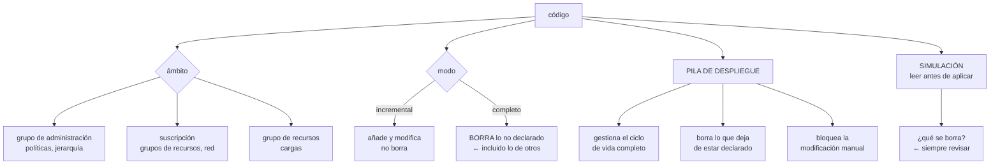

# 220 — Bicep, deployment stacks y Azure Verified Modules

> [← 219 · Hub-spoke, Virtual WAN, Private Link y DNS privado](../../part-18-azure-production-architecture/219-hub-spoke-virtual-wan-private-link-y-dns-privado/README.md) · [Índice de la parte](../README.md) · [221 · App Service, Functions y Container Apps en producción →](../../part-18-azure-production-architecture/221-app-service-functions-y-container-apps-en-produccion/README.md)

**Parte:** 18 — Azure: arquitectura empresarial y operación en producción<br>
**Nivel:** avanzado · **Horas estimadas:** 4<br>
**Laboratorio:** `iac` · **Estado:** `EXECUTABLE_CORE`

## 🎯 Propósito

Declarar la infraestructura de Azure como código de forma que se pueda desplegar, revisar y —lo que casi nunca se resuelve— **retirar**. La clase cubre Bicep frente a las plantillas nativas y a las herramientas de terceros, las pilas de despliegue que sí saben borrar lo que sobra, los módulos verificados y cuándo conviene usarlos, y los modos de despliegue con su trampa: **el modo completo borra lo que no está en la plantilla, y eso incluye lo que creó otro equipo**.

## 📚 Resultados de aprendizaje

Al finalizar podrás:

1. **Elegir** entre Bicep y herramientas de terceros con criterio.
2. **Estructurar** el código por ciclo de vida y por ámbito.
3. **Usar** pilas de despliegue para gestionar el ciclo de vida completo.
4. **Aplicar** módulos verificados sin perder control.
5. **Evitar** los tres errores que borran recursos en producción.

## 🧩 Conceptos centrales

| Concepto | Comprensión verificable |
|---|---|
| `Bicep` | Lenguaje declarativo que compila a plantillas nativas de Azure, con módulos, tipos y validación previa. |
| `ámbito del despliegue` | Nivel al que se despliega: grupo de administración, suscripción, grupo de recursos o inquilino. |
| `modo de despliegue` | Incremental añade y modifica; completo además borra lo que no está declarado. |
| `pila de despliegue` | Recurso que gestiona un conjunto como unidad, con capacidad de borrar lo que deja de estar declarado. |
| `simulación de cambios` | Previsualización de lo que el despliegue creará, modificará o borrará. Se lee antes de aplicar. |
| `módulo verificado` | Módulo mantenido por el proveedor con valores por defecto revisados y opciones de seguridad activadas. |

## 🧠 Modelo mental

La arquitectura Azure nace del tenant y las políticas heredables, y llega al workload mediante identidades administradas y redes privadas.

Aplicado a esta clase, separa siempre cuatro planos: **intención** (qué necesita el usuario),
**configuración** (qué declaramos), **estado observado** (qué existe de verdad) y
**evidencia** (cómo sabemos que cumple). Confundirlos produce diseños que se ven correctos
en un diagrama pero fallan al operar.

## 🗺️ Flujo de razonamiento



## 📖 Desarrollo

### 1. Bicep, y cuándo no

Azure tiene su lenguaje propio y también funciona con herramientas multinube. La elección importa menos de lo que parece y más de lo que se cree.

```text
BICEP
  + no hay estado que gestionar: el estado es Azure
  + soporte inmediato de recursos nuevos
  + validación y simulación de cambios nativas
  + módulos verificados mantenidos por el proveedor
  − solo Azure
  − la gestión del ciclo de vida completo exige pilas de
    despliegue; el despliegue normal no borra nada

HERRAMIENTA MULTINUBE (Terraform o similar)
  + una sola forma de trabajar para varias nubes
  + el estado permite saber qué gestiona y borrar lo que
    sobra
  + ecosistema de módulos enorme
  − hay que gestionar y proteger el estado    clase 100
  − los recursos nuevos tardan en estar soportados
  − y la portabilidad del CÓDIGO es menor de lo que se
    espera: los recursos son específicos    clase 158
```

Y el criterio honesto:

```text
¿la organización usa varias nubes de verdad y el equipo ya
domina una herramienta multinube?
  → úsala también aquí; la coherencia vale más que la
    diferencia técnica

¿es una organización solo Azure, o el equipo empieza?
  → Bicep; menos piezas que operar

¿hay que declarar políticas y jerarquía?
  → cualquiera de las dos sirve, y conviene que sea la
    misma que el resto                        clase 217
```

Y una advertencia sobre la mezcla:

```text
usar las dos a la vez sobre los mismos recursos produce
conflictos: cada una cree que gestiona algo que la otra
modifica
→ si conviven, que sea con fronteras claras: quién gestiona
  qué, escrito                                   clase 183
```

**Los ámbitos**, que hay que entender antes de estructurar:

```text
INQUILINO                  grupos de administración
GRUPO DE ADMINISTRACIÓN    políticas, asignaciones
SUSCRIPCIÓN                grupos de recursos, red, roles
GRUPO DE RECURSOS          la mayoría de los recursos

→ un despliegue tiene un ámbito, y desde él puede desplegar
  módulos en ámbitos inferiores
→ estructurar el código por ámbito es lo que permite
  desplegar la jerarquía y las cargas por separado
```

### 2. Estructura por ciclo de vida

El error de estructura es el mismo de la clase 207: una plantilla enorme con todo.

```text
✗ UNA PLANTILLA QUE LO CONTIENE ABSOLUTAMENTE todo
  cada despliegue toca todo
  un fallo bloquea el conjunto
  y los tiempos de despliegue crecen sin control

✓ SEPARADO POR CICLO DE VIDA
  jerarquía y políticas          cambian al trimestre
  red y conectividad             cambian al mes
  datos: bases, almacenes        cambian poco, NUNCA se
                                 borran con el código
  cargas: aplicaciones           cambian a diario

→ y los datos SIEMPRE en su propio despliegue, con
  bloqueos de borrado                          clase 217
```

Y las reglas que evitan los problemas frecuentes:

```text
SIN VALORES INCRUSTADOS POR ENTORNO
  parámetros por entorno, en ficheros separados

NOMBRES DERIVADOS, NO FIJOS
  y con la unicidad global resuelta donde haga falta
  → varios servicios exigen nombre único en todo Azure
  → un nombre fijo funciona en el primer entorno y falla en
    el segundo

SIN SECRETOS EN PARÁMETROS
  referencia al almacén de secretos, no el valor
  → y los valores de salida NUNCA devuelven secretos: el
    historial de despliegues los conserva

IDENTIDADES Y PERMISOS DECLARADOS
  la asignación de papel es un recurso más, y debe estar
  en el código con su ámbito exacto            clase 218
```

**Los módulos verificados**, que resuelven un problema real:

```text
QUÉ SON
  módulos mantenidos por el proveedor, con los valores por
  defecto revisados y las opciones de seguridad activadas

QUÉ RESUELVEN
  exactamente la ley 26: los valores por defecto de los
  recursos están elegidos para que la demostración
  funcione, y estos módulos los cambian por los de
  producción
  → cifrado, sin acceso público, diagnóstico, versión
    mínima de TLS, identidad administrada

CUÁNDO NO USARLOS
  cuando traen mucho más de lo que hace falta y hay que
  entender todo lo que despliegan
  cuando su versión va por detrás de lo que se necesita

→ y en cualquier caso: FIJAR LA VERSIÓN
  un módulo sin versión fija cambia bajo los pies
                                          clase 106, ley 25
```

Y una práctica que ahorra revisiones:

```text
la plantilla de servicio nuevo usa los módulos verificados
y ya cumple las políticas de la organización
→ el carril fácil cumple solo                  clase 171
→ y las funciones de aptitud casi nunca fallan
```

### 3. Modos, pilas y lo que borra recursos

Aquí están los tres errores que borran cosas en producción.

```text
MODO INCREMENTAL (el predeterminado)
  crea lo que falta, modifica lo que difiere
  NO borra nada de lo que no está en la plantilla
  → seguro, y deja recursos huérfanos acumulándose
                                                    ley 25

MODO COMPLETO
  además, BORRA todo lo que exista en el grupo de recursos
  y no esté declarado
  → resuelve los huérfanos
  → y borra lo que creó otro equipo en ese grupo
  → y lo que se creó a mano durante un incidente

  ERROR 1   usar modo completo sobre un grupo compartido
  ERROR 2   usar modo completo con una plantilla parcial
            (por ejemplo, tras un error de compilación que
             dejó fuera medio fichero)
```

Y el tercero, el más frecuente:

```text
ERROR 3   no leer la simulación de cambios
  la herramienta dice exactamente qué va a crear, modificar
  y BORRAR
  → y en una canalización, ese resultado debe publicarse y
    revisarse; si incluye borrados en producción, se para
  → una puerta automática: «si hay borrados y el entorno es
    producción, exige aprobación»              clase 106
```

**Las pilas de despliegue**, que resuelven el ciclo de vida sin la brutalidad del modo completo:

```text
QUÉ APORTAN
  gestionan un conjunto de recursos como una unidad
  saben qué recursos les pertenecen
  al desplegar, BORRAN o DESVINCULAN lo que deja de estar
    declarado
  y pueden BLOQUEAR la modificación manual de lo que
    gestionan

→ es lo más parecido al estado de una herramienta
  multinube, sin gestionar un fichero de estado

LA DECISIÓN QUE HAY QUE TOMAR AL CREARLAS
  qué hacer con lo que se quita de la plantilla
    borrar          para cargas
    desvincular     para datos ← lo prudente
  y qué bloqueo aplicar a lo gestionado
    ninguno · solo lectura · sin borrado
```

Y la comprobación que hay que hacer antes de usarlas en producción:

```text
probar en un entorno inferior
  quitar un recurso de la plantilla y desplegar
  → comprobar que hace lo que se espera
  → y que los datos NO se borran                    ley 22
```

**La canalización de infraestructura**, con las puertas que hacen falta:

```text
1  compilar y validar la plantilla
2  comprobaciones de política: ¿el despliegue cumpliría?
   → hay herramientas que evalúan la política ANTES
   → evita el rechazo en el momento de desplegar
3  SIMULACIÓN de cambios, publicada
4  puerta: si hay borrados en producción → aprobación
5  desplegar con identidad federada, sin secretos
                                                clase 218
6  comprobar que el resultado es el esperado
7  y en caso de fallo, saber cómo se vuelve atrás
```

Y una nota sobre la vuelta atrás:

```text
volver atrás en infraestructura NO es volver a desplegar la
versión anterior sin más
  un recurso borrado no se recupera desplegando otra vez
  un cambio de tamaño de base no siempre es reversible
  y algunos cambios exigen recrear
→ por eso los recursos con datos llevan bloqueo y política
  de retención, y el borrado se trata como irreversible
                                                clase 166
```

### 4. Revisar, probar y retirar

**Qué se revisa** en un cambio de infraestructura, que no es lo mismo que en un cambio de código:

```text
¿qué se borra? ← lo primero
¿qué se recrea? (un cambio de nombre o de ubicación
  destruye y crea)
¿qué ámbito tiene cada asignación de permisos? clase 218
¿hay acceso público en algo?
¿está el diagnóstico enrutado?
¿tiene etiquetas obligatorias?                 clase 214
¿cuánto va a costar al mes?
  → algunos recursos son muy caros y se aprueban solos en
    una plantilla
```

Y la última merece automatismo:

```text
estimación de coste del cambio, publicada en la revisión
→ hay herramientas que la calculan a partir de la
  simulación
→ y evita la sorpresa del mes siguiente        clase 214
```

**Las pruebas de infraestructura**, que son distintas de las de código:

```text
VALIDACIÓN         la plantilla es correcta
SIMULACIÓN         el cambio es el esperado
DESPLIEGUE EN
  ENTORNO EFÍMERO  se despliega de cero y funciona
  → esto es lo que detecta las dependencias no declaradas
    y los recursos que alguien creó a mano y nadie metió
    en el código                             clase 104
PRUEBAS DE
  COMPORTAMIENTO   ¿el almacén rechaza el acceso público?
                   ¿la subred no llega a internet?
  → las pruebas negativas de las clases 217 a 219
```

Y el desplegar de cero es la más valiosa:

```text
si el entorno completo no se puede desplegar desde el
código en un entorno vacío, el código NO describe el
sistema
→ y en un desastre, no sirve                    clase 215
→ conviene hacerlo periódicamente, no una vez
```

**La retirada**, que es lo que el código como declaración permite y casi nadie usa:

```text
quitar el recurso de la plantilla y desplegar
  con pila de despliegue → se borra o desvincula
  con modo incremental   → NO se borra, y queda huérfano

y la comprobación periódica que encuentra los huérfanos
  inventario real frente a lo declarado
  → lo que existe y no está en ningún código es un hallazgo
                                          ley 25, clase 253
```

Y la lista de comprobación de la clase:

```text
☐ la herramienta elegida es coherente con el resto de la
  organización
☐ el código está separado por ciclo de vida y por ámbito
☐ los datos tienen su propio despliegue, con bloqueos
☐ no hay valores incrustados por entorno
☐ los nombres son derivados y resuelven la unicidad global
☐ no hay secretos en parámetros ni en salidas
☐ las asignaciones de permisos están en el código, con su
  ámbito exacto
☐ los módulos verificados están con versión fija
☐ el modo completo no se usa sobre grupos compartidos
☐ la simulación de cambios se publica y se revisa
☐ hay puerta de aprobación si hay borrados en producción
☐ las pilas de despliegue se probaron en un entorno inferior
☐ el entorno se despliega de cero periódicamente
☐ hay estimación de coste en la revisión
☐ se comparan periódicamente el inventario real y lo
  declarado
```

Y el cierre que enlaza con la clase siguiente: con la base declarada, queda desplegar las cargas. Las tres opciones de cómputo gestionado de Azure —y cuándo conviene cada una— son la materia de la clase 221.

## 🔬 Ejemplo trabajado

**CloudShop pasa su infraestructura de Azure a código. Lo que sigue es el despliegue que borró una base de datos de preproducción, la comparación entre inventario real y código declarado, y las pilas de despliegue que resolvieron los huérfanos.**

**El punto de partida:**

```text
recursos en el inventario                       14.200
  declarados en algún código                     4.100  29 %
  creados a mano                                10.100  71 %

plantillas existentes                               31
  con valores incrustados por entorno               24
  con secretos en parámetros                         7
  con nombres fijos                                 19
    → y por eso solo funcionaban en un entorno
```

**El incidente: el modo completo, semana 3.**

```text
qué pasó
  un equipo migró su carga a Bicep
  desplegó en modo COMPLETO sobre el grupo de recursos de
  preproducción
  su plantilla declaraba la aplicación y el almacén

  el grupo contenía además
    una base de datos de preproducción, creada a mano
    dos cuentas de almacenamiento de otro equipo
    un espacio de trabajo de análisis

  el modo completo BORRÓ los cuatro

efectos
  la base de datos tenía copia de seguridad: recuperada en
  2 h 40
  las cuentas de almacenamiento del otro equipo: 1 se
  recuperó del borrado reversible, la otra había superado
  la ventana → 11 GB de resultados de pruebas perdidos
  el espacio de análisis: recreado, sin las consultas
  guardadas

tiempo total de recuperación                      6 h
```

Y el análisis:

```text
la simulación de cambios SE HABÍA EJECUTADO
y decía claramente «se eliminarán 4 recursos»
nadie la leyó: la canalización la imprimía en un registro
de 400 líneas y pasaba al paso siguiente        ley 15

correcciones
  1  la simulación se publica como resumen legible, con los
     borrados destacados
  2  puerta automática: si hay borrados, exige aprobación
     explícita, en cualquier entorno
  3  el modo completo queda PROHIBIDO por política; se usan
     pilas de despliegue
  4  un grupo de recursos por equipo y por carga: nada
     compartido                                clase 183
  5  bloqueo de borrado en todos los recursos con datos
```

**La estructura nueva:**

```text
infra/
  jerarquia/        ámbito: grupo de administración
    grupos de administración, iniciativas de política
    despliegue trimestral
  conectividad/     ámbito: suscripción
    centro, radios, cortafuegos, zonas DNS privadas
    despliegue mensual
  datos/            ámbito: grupo de recursos
    bases, almacenes, espacios de análisis
    con bloqueo de borrado y política de retención
    despliegue: raro, y siempre con aprobación
  cargas/           ámbito: grupo de recursos
    aplicaciones, planes, identidades, asignaciones
    despliegue diario

parámetros por entorno, en ficheros separados
nombres derivados: {carga}-{entorno}-{region}-{sufijo único}
secretos: referencias al almacén, nunca valores
```

**Los módulos verificados, y lo que cambiaron.**

```text
se migraron 9 tipos de recurso a módulos verificados
con versión fija

lo que traían activado que las plantillas propias no tenían
  cuenta de almacenamiento
    acceso público                       desactivado
    versión mínima de TLS                1.2
    diagnóstico                          enrutado
    identidad administrada               activada
    clave gestionada por el cliente      opcional, activada
  base de datos
    acceso público                       desactivado
    conexión por punto privado           sí
    auditoría                            activada
    retención de copias                  35 días
  plan de aplicación
    versión mínima de TLS                1.2
    registro de aplicación               activado

→ 14 valores por defecto cambiados sin escribir una línea
→ y el cumplimiento de las iniciativas de la clase 217
  pasó del 62 % al 97 % en las cargas nuevas
                                                    ley 26
```

Y la decisión sobre versiones:

```text
los módulos se fijan a una versión concreta
se actualizan una vez al trimestre, revisando el registro
de cambios
→ en la primera actualización, un módulo cambió un valor
  por defecto que recreaba el recurso
→ la simulación lo detectó y se planificó, en vez de
  ocurrir de madrugada                        clase 106
```

**Las pilas de despliegue:**

```text
se adoptaron para cargas y para conectividad

configuración
  cargas         lo que se quita de la plantilla → BORRAR
                 bloqueo de lo gestionado → sin borrado
  conectividad   lo que se quita → BORRAR
                 bloqueo → solo lectura
  datos          NO se usan pilas; despliegue incremental
                 con bloqueos y aprobación

y la prueba, en preproducción
  se quitó un recurso de la plantilla de cargas
  → borrado, correctamente
  se quitó un recurso de la plantilla de datos por error
  → NO se borró, porque datos no usa pilas         ✓

efecto sobre los huérfanos
  recursos huérfanos en cargas         1.140 → 0 en 3 meses
  → al migrar cada carga a pila, lo no declarado se
    revisaba y se borraba o se declaraba
```

**La comparación entre inventario y código:**

```text
se montó una comprobación semanal
  inventario real frente a lo declarado en el repositorio

primera ejecución
  recursos existentes y no declarados            10.100

seis meses después
  recursos existentes y no declarados               410
    de ellos, con excepción registrada              340
      · recursos gestionados por servicios (subredes de
        integración, identidades del sistema)
    sin excepción                                    70
      → 70 hallazgos, revisados uno a uno
      → 41 se declararon, 22 se borraron, 7 resultaron
        ser de un proyecto que nadie recordaba   ley 25
```

**El despliegue de cero, ejecutado dos veces:**

```text
primer intento (mes 4)
  se desplegó el entorno de preproducción completo en una
  suscripción vacía
  falló en 6 puntos
    · una zona DNS privada que se creaba a mano
    · una asignación de papel al grupo del equipo, que
      existía desde 2022 y no estaba en el código
    · un certificado subido manualmente
    · dos reglas del cortafuegos
    · una cuota que había que pedir con antelación
  tiempo                             3 días con correcciones

segundo intento (mes 7)
  desplegado de cero, sin intervención
  tiempo                                            94 min
  → y ese número es el que se usa en el plan de
    continuidad                                clase 215
```

**El resultado:**

```text                                        antes     después
recursos declarados en código               29 %        97 %
plantillas con secretos                        7           0
plantillas con nombres fijos                  19           0
recursos borrados por error                    4           0
cumplimiento de iniciativas (cargas nuevas) 62 %        97 %
huérfanos en grupos de cargas              1.140           0
tiempo de despliegue de cero            imposible      94 min
valores por defecto corregidos por
  módulos verificados                          —          14
```

**La lección que esta clase deja**: el incidente que borró cuatro recursos **no fue por una herramienta peligrosa**: la simulación había dicho exactamente qué iba a borrar, y estaba en un registro de cuatrocientas líneas que nadie leía. Y los módulos verificados corrigieron **catorce valores por defecto sin escribir una línea de código**, que es la forma más barata que este programa ha encontrado de tratar la ley 26.

## 🧪 Laboratorio guiado

Ejecuta desde la raíz:

```bash
python classes/part-18-azure-production-architecture/220-bicep-deployment-stacks-y-azure-verified-modules/lab.py
```

El laboratorio selecciona el motor de práctica **`iac`** y produce
`lab_result.json`. El escenario, sus comprobaciones y el artefacto esperado corresponden a
esta clase; no requiere credenciales y deja explícito qué debe revalidarse en un sandbox real.

1. Lee `exercise.steps` y formula una predicción antes de ejecutar.
2. Ejecuta la práctica y verifica todos los elementos de `checks`.
3. Provoca el caso de `negative_test` y explica la señal observada.
4. Materializa `azure-bicep-stack` en `evidence/` usando la plantilla indicada.
5. Para proveedor real, sigue `sandbox.requires`, registra costo y ejecuta `destroy`.

### Evidencia esperada

El artefacto principal es un plan reproducible sin secretos ni cambios inesperados. Además, la entrega debe incluir el comando ejecutado,
la salida estructurada y una conclusión que no exceda lo observado.

## 🏆 Reto verificable

Construye **`azure-bicep-stack`** para el caso CloudShop. Incluye una alternativa descartada,
un supuesto que pueda falsarse, una prueba de fallo y una decisión de rollback.

## ✅ Criterio de aceptación

- [ ] `lab.py` termina con código 0 y genera JSON válido.
- [ ] La entrega conecta al menos tres requisitos con mecanismos verificables.
- [ ] Existe una prueba positiva y una prueba negativa con evidencia.
- [ ] Seguridad, costo y operación aparecen como decisiones, no como anexos.
- [ ] Se declara una limitación y una condición que obligaría a revisar el diseño.
- [ ] Otra persona puede repetir el recorrido sin conocimiento tácito.

## ⚠️ Errores frecuentes

| Síntoma | Causa probable | Corrección |
|---|---|---|
| Un despliegue borra recursos que no eran suyos | Modo completo sobre un grupo de recursos compartido | Un grupo por equipo y carga, prohíbe el modo completo y usa pilas de despliegue con la política de borrado decidida. |
| La simulación avisaba del borrado y nadie lo vio | El resultado se imprimía en un registro larguísimo y la canalización seguía | Publica un resumen legible con los borrados destacados y pon una puerta de aprobación cuando existan. |
| La plantilla funciona en un entorno y falla en el siguiente | Nombres fijos y valores incrustados por entorno | Deriva los nombres del entorno y resuelve la unicidad global; parámetros en ficheros separados. |
| Los recursos nuevos no cumplen las políticas de la organización | Se declaran con los valores por defecto del recurso | Usa módulos verificados con versión fija; traen los valores de producción activados. |
| Se acumulan recursos que nadie declaró ni recuerda | El despliegue incremental nunca borra lo que deja de estar en la plantilla | Usa pilas de despliegue y compara periódicamente el inventario real con lo declarado. |
| En un desastre, el entorno no se puede reconstruir desde el código | Hay piezas creadas a mano que nunca entraron en el repositorio | Despliega el entorno de cero en una suscripción vacía periódicamente y corrige lo que falte. |

## 🛡️ Seguridad, ética y costo

Trabaja con cuentas propias o sandboxes autorizados. No publiques secretos, identificadores
reales ni datos personales. Antes de crear recursos pagos define presupuesto, etiquetas y
comando de destrucción; después verifica que no queden recursos huérfanos. Los ejemplos
locales enseñan contratos, pero no certifican cumplimiento ni disponibilidad de producción.

## ❓ Preguntas de comprobación

1. ¿Qué diferencia hay entre el modo incremental y el completo, y qué riesgo tiene el segundo?
2. ¿Qué aportan las pilas de despliegue frente al despliegue normal?
3. ¿Por qué los módulos verificados son una respuesta directa a la ley 26?
4. ¿Qué se revisa primero en un cambio de infraestructura?
5. ¿Qué detecta desplegar el entorno de cero que ninguna otra prueba detecta?

## 🔗 Referencias

- Microsoft (2025). *Bicep documentation*. <https://learn.microsoft.com/en-us/azure/azure-resource-manager/bicep/overview>
- Microsoft (2025). *Deployment stacks*. <https://learn.microsoft.com/en-us/azure/azure-resource-manager/bicep/deployment-stacks>
- Microsoft (2025). *ARM template deployment modes*. <https://learn.microsoft.com/en-us/azure/azure-resource-manager/templates/deployment-modes>
- Microsoft (2025). *Azure Verified Modules*. <https://azure.github.io/Azure-Verified-Modules/>
- Microsoft (2025). *ARM template what-if operation*. <https://learn.microsoft.com/en-us/azure/azure-resource-manager/templates/deploy-what-if>
- Documentación oficial vigente del servicio implementado; registra URL y fecha de consulta.

---

> [Evaluación](assessment.md) · [Contrato de clase](lesson.yaml) · [Índice de la parte](../README.md)

**📥 Descargar:** [Parte 18 en PDF](../../../site/downloads/partes/manual-parte-18-azure-production-architecture.pdf) · [Recorrido de Azure en PDF](../../../site/downloads/nubes/manual-azure.pdf) · [Manual integral](../../../site/downloads/multi-cloud-engineering-manual-v2.0.pdf)

| Anterior | Índice | Siguiente |
|---|---|---|
| [← 219 · Hub-spoke, Virtual WAN, Private Link y DNS privado](../../part-18-azure-production-architecture/219-hub-spoke-virtual-wan-private-link-y-dns-privado/README.md) | [Parte 18](../README.md) · [Programa](../../README.md) | [221 · App Service, Functions y Container Apps en producción →](../../part-18-azure-production-architecture/221-app-service-functions-y-container-apps-en-produccion/README.md) |
