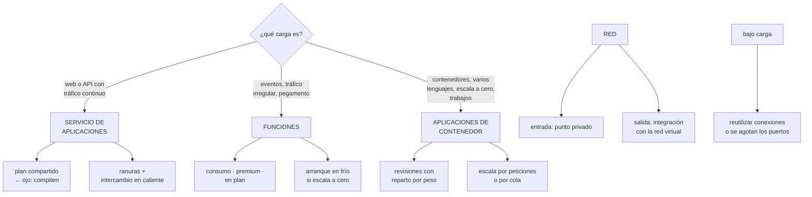

# 221 — App Service, Functions y Container Apps en producción

> [← 220 · Bicep, deployment stacks y Azure Verified Modules](../../part-18-azure-production-architecture/220-bicep-deployment-stacks-y-azure-verified-modules/README.md) · [Índice de la parte](../README.md) · [222 · AKS, workload identity, ingress y GitOps →](../../part-18-azure-production-architecture/222-aks-workload-identity-ingress-y-gitops/README.md)

**Parte:** 18 — Azure: arquitectura empresarial y operación en producción<br>
**Nivel:** avanzado · **Horas estimadas:** 4<br>
**Laboratorio:** `serverless` · **Estado:** `EXECUTABLE_CORE`

## 🎯 Propósito

Elegir entre las tres opciones de cómputo gestionado de Azure y configurarlas para producción, que es distinto de configurarlas para que funcionen. La clase compara servicio de aplicaciones, funciones y aplicaciones de contenedor por lo que de verdad las diferencia —modelo de escalado, arranque en frío, integración de red y coste—, y desarrolla los ajustes que separan un despliegue estable de uno que corta peticiones y se queda sin conexiones.

## 📚 Resultados de aprendizaje

Al finalizar podrás:

1. **Elegir** entre las tres opciones con criterios comprobables.
2. **Integrar** las cargas en la red privada, de entrada y de salida.
3. **Configurar** escalado, arranque en frío y límites sin desperdiciar.
4. **Desplegar** con ranuras o revisiones, sin cortar peticiones.
5. **Evitar** el agotamiento de puertos y de conexiones bajo carga.

## 🧩 Conceptos centrales

| Concepto | Comprensión verificable |
|---|---|
| `plan de servicio` | Conjunto de recursos de cómputo compartido por varias aplicaciones. Es donde se paga y donde se compite. |
| `ranura de despliegue` | Copia de la aplicación con su propia dirección, que se intercambia con producción en caliente. |
| `intercambio en caliente` | Cambio de la ranura de preparación a producción tras calentarla, sin reiniciar. |
| `plan de consumo` | Modelo de facturación por ejecución, con escalado a cero y arranque en frío. |
| `integración de red saliente` | Mecanismo que hace que el tráfico de salida de la aplicación pase por la red virtual. |
| `agotamiento de puertos` | Falta de puertos efímeros por no reutilizar conexiones. Produce fallos intermitentes bajo carga. |

## 🧠 Modelo mental

La arquitectura Azure nace del tenant y las políticas heredables, y llega al workload mediante identidades administradas y redes privadas.

Aplicado a esta clase, separa siempre cuatro planos: **intención** (qué necesita el usuario),
**configuración** (qué declaramos), **estado observado** (qué existe de verdad) y
**evidencia** (cómo sabemos que cumple). Confundirlos produce diseños que se ven correctos
en un diagrama pero fallan al operar.

## 🗺️ Flujo de razonamiento



## 📖 Desarrollo

### 1. Tres opciones, y cómo elegir

Las tres ejecutan código gestionado y se diferencian en el modelo de escalado, en lo que hay que empaquetar y en el coste.

```text
SERVICIO DE APLICACIONES
  aplicaciones web y APIs con proceso continuo
  + ranuras de despliegue con intercambio en caliente
  + escalado por reglas, con instancias siempre encendidas
  + integración de red madura
  − se paga el plan aunque no haya tráfico
  − varias aplicaciones en un plan COMPITEN por sus
    recursos                                    ← ver abajo

FUNCIONES
  para eventos, trabajos programados y pegamento
  + escalado por evento; en consumo, escala a cero
  + integración directa con colas, temas y almacenes
  − arranque en frío si escala a cero
  − los planes que lo evitan cuestan como una instancia

APLICACIONES DE CONTENEDOR
  contenedores sin gestionar orquestador
  + escala a cero y escalado por peticiones o por cola
  + revisiones con reparto de tráfico por peso
  + trabajos por lotes y procesos de larga duración
  − menos control que un orquestador completo
  − arranque en frío si escala a cero
```

Y el criterio, en preguntas:

```text
¿es una web o API con tráfico continuo y en un lenguaje
 soportado?
  → servicio de aplicaciones

¿es código que reacciona a eventos y no está siempre
 activo?
  → funciones

¿hay contenedores, varios lenguajes, o hace falta escalar a
 cero con reparto de tráfico?
  → aplicaciones de contenedor

¿hace falta control fino del planificador, operadores o
 cargas heterogéneas?
  → Kubernetes                                clase 222
```

Y el error de elección más frecuente:

```text
usar funciones para una API con tráfico continuo
  → se paga por ejecución algo que estaría más barato en un
    plan
  → y se sufre arranque en frío sin necesidad
→ el modelo de facturación por ejecución gana cuando el
  tráfico es IRREGULAR, no cuando es alto y constante
```

**El plan compartido**, que produce incidentes difíciles de diagnosticar:

```text
varias aplicaciones en el mismo plan comparten CPU, memoria
y puertos
→ una aplicación con una fuga de memoria afecta a las
  demás
→ y el escalado del plan lo dispara cualquiera de ellas

regla   producción, en su propio plan
        y las aplicaciones de un mismo plan, del mismo
        equipo y con perfiles parecidos           clase 183
```

### 2. Red: entrada privada y salida integrada

Estos servicios nacen con dirección pública. Meterlos en la red privada exige dos cosas distintas que se confunden.

```text
ENTRADA — punto privado
  la aplicación se alcanza por una dirección de tu red
  y el acceso público se desactiva
  → y hace falta la zona DNS privada enlazada a todas las
    redes que la llamen                        clase 219

SALIDA — integración con la red virtual
  el tráfico SALIENTE de la aplicación pasa por una subred
  → sin esto, la aplicación sale a internet aunque tenga
    punto privado de entrada
  → y por tanto no alcanza recursos privados y no pasa por
    el cortafuegos                             clase 200
```

Y la confusión que produce incidentes:

```text
«ya tiene punto privado, está en la red»
  → NO: la entrada es privada y la salida sigue siendo
    pública
  → hay que configurar las dos

y el síntoma
  la aplicación no puede llegar a la base de datos privada
  o el tráfico hacia el almacén sale a internet y se paga
                                          clase 219, ley 26
```

Y los detalles de la integración de salida:

```text
exige una subred DEDICADA y delegada al servicio
  con tamaño suficiente: cada instancia consume direcciones
  → dimensionar por el máximo del escalado    clase 193

y hay que decidir si CUANTO tráfico salga va por la red
  → por defecto, solo el privado; el resto sale directo
  → para forzar la salida por el cortafuegos hay que
    activarlo explícitamente
```

Y una comprobación que hay que hacer:

```text
desde la aplicación, resolver el nombre de un servicio con
punto privado
  → debe devolver dirección privada
y comprobar la dirección de salida observada
  → debe ser la del cortafuegos, no una pública del
    servicio                                    ley 22
```

### 3. Escalado, arranque en frío y despliegue

**El escalado**, con la misma lección de la clase 212:

```text
LA SEÑAL
  ✗ CPU, en servicios que esperan a la red
  ✓ peticiones en cola, longitud de cola, o métrica propia
  → en aplicaciones de contenedor, el escalado por cola es
    directo y es el que corresponde a un trabajador
                                                clase 210

EL RETRASO
  detección + decisión + arranque de instancia
  → minutos, igual que en la clase 212
  → y por eso el margen y el escalado programado siguen
    haciendo falta

MÍNIMO DE INSTANCIAS
  con escala a cero, la primera petición paga el arranque
  → para el camino crítico, mínimo 1 o más
  → y ahí desaparece la ventaja de coste de escalar a cero
```

**El arranque en frío**, con las palancas de siempre:

```text
paquete pequeño y dependencias mínimas
trabajo fuera de la inicialización, salvo lo reutilizable
instancias siempre listas (se pagan)
calentamiento antes de recibir tráfico
  → y esto último es lo que hacen bien las ranuras
```

**El despliegue sin cortar peticiones**, que aquí tiene mecanismos propios:

```text
RANURAS DE DESPLIEGUE (servicio de aplicaciones)
  se despliega en una ranura de preparación
  se CALIENTA: se piden rutas que fuercen la
    inicialización
  se intercambia con producción
  → el intercambio cambia el enrutamiento, no reinicia
  → y si algo va mal, se intercambia de vuelta en segundos

  y el detalle que decide si funciona
    la configuración con marca de «ranura» NO se
    intercambia
    → así la ranura de preparación apunta a la base de
      preparación, y producción a la suya
    → olvidarlo hace que preparación escriba en producción

REVISIONES (aplicaciones de contenedor)
  cada despliegue crea una revisión
  el tráfico se reparte por peso entre revisiones
  → despliegue escalonado nativo, con vuelta atrás
    inmediata                                  clase 102

Y EN AMBOS CASOS
  parada elegante: atender la señal de terminación
  drenaje mayor que la petición más larga      clase 212
```

Y una advertencia sobre el calentamiento:

```text
intercambiar sin calentar traslada el arranque en frío a
los primeros usuarios de producción
→ y el síntoma es «tras cada despliegue, unos minutos de
  latencia alta»
```

### 4. Lo que rompe bajo carga

**El agotamiento de puertos efímeros** es el fallo característico de estos servicios y se diagnostica mal.

```text
QUÉ PASA
  cada conexión saliente consume un puerto efímero
  el puerto queda ocupado un tiempo tras cerrarse
  el número de puertos por instancia es limitado

  si el código abre una conexión NUEVA en cada llamada
  → bajo carga se agotan
  → y aparecen fallos intermitentes de conexión, sin
    patrón claro

LA CAUSA CASI SIEMPRE
  crear el cliente HTTP dentro de la función o del
  controlador, en vez de reutilizarlo
  → cada petición abre una conexión nueva

LA CORRECCIÓN
  cliente único y reutilizado, con agrupación de conexiones
  y para bases de datos, agrupación configurada con límite

Y EL DIAGNÓSTICO
  la métrica de conexiones salientes por instancia
  → si crece linealmente con el tráfico y no se estabiliza,
    no se están reutilizando
```

Y el otro fallo característico, ya conocido:

```text
CONEXIONES A LA BASE DE DATOS
  cada instancia abre su propia agrupación
  20 instancias × 100 conexiones = 2.000
  → y la base admite 400                       clase 207
→ el límite de la agrupación se calcula por instancia,
  contando el máximo del escalado
```

**Lo que hay que vigilar:**

```text
peticiones, errores y latencia por percentil  clase 211
instancias activas frente al máximo
conexiones salientes por instancia
tiempo de arranque y peticiones que lo pagan
uso de CPU y memoria, y REINICIOS por memoria
y en funciones: ejecuciones, retrasos de disparador y
  mensajes pendientes
```

Y una alerta específica de estos servicios:

```text
«la aplicación se ha reiniciado N veces en la última hora»
  → los reinicios silenciosos por memoria o por fallo de
    la comprobación son la señal que más se pierde
                                                    ley 13
```

Y la lista de comprobación de la clase:

```text
☐ la opción elegida corresponde al perfil de la carga
☐ producción no comparte plan con otras cargas
☐ la entrada es por punto privado y el acceso público está
  desactivado
☐ la salida está integrada con la red virtual
☐ la subred de integración está dimensionada por el máximo
☐ se ha comprobado que la salida pasa por el cortafuegos
☐ el escalado usa una señal distinta de la CPU si procede
☐ el mínimo de instancias cubre el camino crítico
☐ hay ranuras o revisiones, con calentamiento previo
☐ la configuración específica de ranura está marcada
☐ la aplicación atiende la señal de terminación
☐ los clientes HTTP y de base se reutilizan
☐ el límite de agrupación se calculó por instancia
☐ hay alerta de reinicios y de conexiones salientes
```

Y el cierre que enlaza con la clase siguiente: cuando la carga exige control fino, operadores o cargas heterogéneas, aparece Kubernetes gestionado con sus particularidades de identidad y de entrada en esta nube. Es la materia de la clase 222.

## 🔬 Ejemplo trabajado

**CloudShop despliega su plataforma en Azure. Lo que sigue es la elección de opción por carga, el incidente de la ranura que escribió en producción, y el agotamiento de puertos que se diagnosticó como «problema de red» durante tres semanas.**

**La elección, carga por carga:**

```text
carga                perfil               elección
api de pedidos       continuo, 900 pet/s  servicio de
                                          aplicaciones
web de tienda        continuo             servicio de
                                          aplicaciones
procesador de
  eventos            por cola, irregular  aplicaciones de
                                          contenedor
trabajos programados 12/día               funciones,
                                          plan de consumo
notificaciones       picos, escala a cero funciones,
                                          plan de consumo
informes nocturnos   1/día, 40 min        trabajo de
                                          aplicaciones de
                                          contenedor
búsqueda             contenedor propio,
                     imagen específica    aplicaciones de
                                          contenedor

y lo que se descartó
  poner la api de pedidos en funciones
  → estimación: 1.840 €/mes en consumo frente a 610 € en
    un plan, con tráfico continuo
  → y arranque en frío innecesario
```

**Incidente 1 · La ranura que escribió en producción.**

```text
síntoma   tras un despliegue de rutina, aparecieron 41
          pedidos de prueba en la base de producción
          con importes de 0,01 € y direcciones falsas

diagnóstico
  la cadena de conexión a la base estaba en la
  configuración de la aplicación
  NO estaba marcada como específica de ranura
  → al intercambiar, la configuración de preparación viajó
    a producción y la de producción a preparación
  → durante 8 minutos, antes de que alguien lo notara, las
    pruebas de humo de preparación escribieron en
    producción

corrección
  toda la configuración que apunta a recursos externos,
  marcada como específica de ranura
  y mejor: las cadenas se resuelven por referencia al
  almacén de secretos, con el nombre del secreto distinto
  por ranura
  y una comprobación previa al intercambio: la ranura de
  preparación debe apuntar a la base de preparación

y lo que se limpió
  41 pedidos borrados, con registro de la incidencia
```

**Incidente 2 · «Fallos intermitentes de red», tres semanas.**

```text
síntoma   entre las 11:00 y las 13:00, un 2-4 % de las
          llamadas de la api de pedidos al servicio de
          precios fallaban con error de conexión
          fuera de esas horas, nunca

lo que se revisó (mal)
  reglas del grupo de seguridad          correctas
  rutas y cortafuegos                    correctos
  capturas de paquetes                   sin nada raro
  se abrió incidencia con el proveedor   3 semanas

lo que lo resolvió
  la métrica de conexiones salientes por instancia

    hora        peticiones/s   conexiones salientes
    09:00          210               240
    10:00          390               450
    11:00          720               830
    12:00        1.100             1.270   ← límite ~1.280
    14:00          380               440

  → las conexiones crecían LINEALMENTE con las peticiones
  → no se estaban reutilizando

causa
  el código creaba un cliente HTTP nuevo en cada llamada
  al servicio de precios
  cada uno abría su conexión, que quedaba ocupada tras
  cerrarse
  → a partir de cierto tráfico, no había puertos libres

corrección
  un cliente único reutilizado, con agrupación configurada
  conexiones salientes en el pico    1.270 → 46
  fallos intermitentes                 2-4 % → 0

y lo que enseñó
  la métrica que resolvió el caso estaba disponible desde
  el primer día y no estaba en ningún panel      ley 15
  → se añadió al panel estándar de servicio     clase 211
```

**La red, montada en dos partes:**

```text
ENTRADA
  punto privado para la api y para la web
  acceso público desactivado
  zonas DNS privadas enlazadas a las 43 redes clase 219
  el tráfico público entra por la pasarela de aplicación,
  que sí es pública, con filtrado

SALIDA
  integración con la red virtual, subred dedicada /24 por
  entorno
  → dimensionada para el máximo de 30 instancias
  encaminamiento de CUANTO tráfico salga por la red
  → así pasa por el cortafuegos y se registra

y la comprobación que se añadió
  desde la aplicación, resolver el nombre de la base
  → debe dar dirección privada
  y consultar la dirección de salida observada
  → debe ser la del cortafuegos
  → en la primera ejecución, la web daba una dirección
    pública: le faltaba activar el encaminamiento completo
                                                    ley 22
```

**El escalado y el despliegue:**

```text
api de pedidos (servicio de aplicaciones)
  escalado por peticiones en cola, no por CPU
  mínimo 3 instancias, máximo 30
  escalado programado: +8 instancias a las 10:30 en
    campañas
  ranuras: preparación y producción
    calentamiento: 6 rutas pedidas antes de intercambiar
    y tras corregir el incidente 1, comprobación previa

  peticiones con latencia alta tras despliegue
    antes del calentamiento                    ~340
    después                                       0

procesador de eventos (aplicaciones de contenedor)
  escalado por longitud de cola: 1 réplica por cada 50
    mensajes pendientes, máximo 40
  mínimo 1 réplica: la cola nunca está vacía mucho tiempo
  revisiones con reparto: 10 % durante 10 min, luego 100 %
  vuelta atrás: cambiar el peso, 15 segundos

notificaciones (funciones, consumo)
  escala a cero; arranque en frío de 400-900 ms
  aceptable: el envío es asíncrono            clase 210
  y se midió antes de aceptarlo
```

**El coste, comparado:**

```text                                        estimado    real
api de pedidos (plan P1v3 × 3-30)              610 €    720 €
web de tienda (plan compartido con api)          —        —
  → se separó: comparten plan y compiten
  → plan propio                                          310 €
procesador de eventos                          280 €    240 €
funciones (consumo)                             90 €     71 €
trabajos de informes                            40 €     38 €
pasarela de aplicación                         320 €    320 €
puntos privados                                 —       190 €  ←
inspección del cortafuegos                      —       410 €  ←
──────────────────────────────────────────────────────────────
total                                        1.340 €  2.299 €

y las dos partidas no estimadas son las de siempre:
lo que cuesta poner las cargas en la red privada
                                          clase 216, ley 26
```

**El resultado:**

```text                                        antes     después
fallos intermitentes de conexión            2-4 %          0
conexiones salientes en el pico             1.270          46
pedidos de prueba en producción                41           0
peticiones lentas tras despliegue             340           0
aplicaciones compartiendo plan con
  producción                                    2           0
salida que no pasa por el cortafuegos           1           0
tiempo de vuelta atrás                    redesplegar     15 s
```

**La lección que esta clase deja**: tres semanas de incidencia con el proveedor y capturas de paquetes por un problema que **no era de red**: el código abría una conexión nueva en cada llamada y agotaba los puertos efímeros a partir de cierto tráfico. La métrica que lo resolvía estaba disponible desde el primer día. Y el incidente más embarazoso —cuarenta y un pedidos de prueba en producción— lo causó **una configuración que no estaba marcada como específica de ranura**, que es exactamente el tipo de detalle que funciona hasta el día del intercambio.

## 🧪 Laboratorio guiado

Ejecuta desde la raíz:

```bash
python classes/part-18-azure-production-architecture/221-app-service-functions-y-container-apps-en-produccion/lab.py
```

El laboratorio selecciona el motor de práctica **`serverless`** y produce
`lab_result.json`. El escenario, sus comprobaciones y el artefacto esperado corresponden a
esta clase; no requiere credenciales y deja explícito qué debe revalidarse en un sandbox real.

1. Lee `exercise.steps` y formula una predicción antes de ejecutar.
2. Ejecuta la práctica y verifica todos los elementos de `checks`.
3. Provoca el caso de `negative_test` y explica la señal observada.
4. Materializa `azure-app-platform` en `evidence/` usando la plantilla indicada.
5. Para proveedor real, sigue `sandbox.requires`, registra costo y ejecuta `destroy`.

### Evidencia esperada

El artefacto principal es una función con límites, reintentos e idempotencia. Además, la entrega debe incluir el comando ejecutado,
la salida estructurada y una conclusión que no exceda lo observado.

## 🏆 Reto verificable

Construye **`azure-app-platform`** para el caso CloudShop. Incluye una alternativa descartada,
un supuesto que pueda falsarse, una prueba de fallo y una decisión de rollback.

## ✅ Criterio de aceptación

- [ ] `lab.py` termina con código 0 y genera JSON válido.
- [ ] La entrega conecta al menos tres requisitos con mecanismos verificables.
- [ ] Existe una prueba positiva y una prueba negativa con evidencia.
- [ ] Seguridad, costo y operación aparecen como decisiones, no como anexos.
- [ ] Se declara una limitación y una condición que obligaría a revisar el diseño.
- [ ] Otra persona puede repetir el recorrido sin conocimiento tácito.

## ⚠️ Errores frecuentes

| Síntoma | Causa probable | Corrección |
|---|---|---|
| Fallos intermitentes de conexión que aparecen solo con tráfico alto | El código crea un cliente nuevo por llamada y agota los puertos efímeros | Reutiliza un cliente único con agrupación de conexiones y vigila las conexiones salientes por instancia. |
| La aplicación no alcanza recursos privados pese a tener punto privado | El punto privado resuelve la entrada; la salida sigue siendo pública | Configura además la integración de salida con la red virtual y comprueba la dirección de salida observada. |
| Tras un intercambio de ranuras, la preparación escribe en producción | La configuración con la cadena de conexión no estaba marcada como específica de ranura | Marca toda la configuración que apunte a recursos externos y comprueba antes del intercambio a qué apunta cada ranura. |
| Tras cada despliegue hay unos minutos de latencia alta | Se intercambia sin calentar y el arranque en frío lo pagan los usuarios | Pide rutas que fuercen la inicialización en la ranura de preparación antes de intercambiar. |
| Una aplicación con problemas degrada a otras sin relación | Comparten plan de servicio y por tanto recursos | Producción en su propio plan; agrupa solo aplicaciones del mismo equipo con perfiles parecidos. |
| Se paga mucho por una API con tráfico continuo | Se eligió el modelo de facturación por ejecución para una carga constante | El pago por ejecución gana con tráfico irregular; con tráfico alto y continuo, un plan sale más barato y evita arranques en frío. |

## 🛡️ Seguridad, ética y costo

Trabaja con cuentas propias o sandboxes autorizados. No publiques secretos, identificadores
reales ni datos personales. Antes de crear recursos pagos define presupuesto, etiquetas y
comando de destrucción; después verifica que no queden recursos huérfanos. Los ejemplos
locales enseñan contratos, pero no certifican cumplimiento ni disponibilidad de producción.

## ❓ Preguntas de comprobación

1. ¿Qué pregunta decide entre las tres opciones de cómputo gestionado?
2. ¿Qué diferencia hay entre el punto privado de entrada y la integración de salida?
3. ¿Qué configuración no debe intercambiarse al usar ranuras y por qué?
4. ¿Cuál es la causa habitual del agotamiento de puertos y cómo se detecta?
5. ¿Por qué el calentamiento previo al intercambio es parte del despliegue?

## 🔗 Referencias

- Microsoft (2025). *Azure App Service deployment slots*. <https://learn.microsoft.com/en-us/azure/app-service/deploy-staging-slots>
- Microsoft (2025). *Azure Functions hosting options*. <https://learn.microsoft.com/en-us/azure/azure-functions/functions-scale>
- Microsoft (2025). *Azure Container Apps revisions and traffic splitting*. <https://learn.microsoft.com/en-us/azure/container-apps/revisions>
- Microsoft (2025). *Integrate your app with an Azure virtual network*. <https://learn.microsoft.com/en-us/azure/app-service/overview-vnet-integration>
- Microsoft (2025). *Troubleshooting SNAT port exhaustion*. <https://learn.microsoft.com/en-us/azure/load-balancer/troubleshoot-outbound-connection>
- Documentación oficial vigente del servicio implementado; registra URL y fecha de consulta.

---

> [Evaluación](assessment.md) · [Contrato de clase](lesson.yaml) · [Índice de la parte](../README.md)

| Anterior | Índice | Siguiente |
|---|---|---|
| [← 220 · Bicep, deployment stacks y Azure Verified Modules](../../part-18-azure-production-architecture/220-bicep-deployment-stacks-y-azure-verified-modules/README.md) | [Parte 18](../README.md) · [Programa](../../README.md) | [222 · AKS, workload identity, ingress y GitOps →](../../part-18-azure-production-architecture/222-aks-workload-identity-ingress-y-gitops/README.md) |
