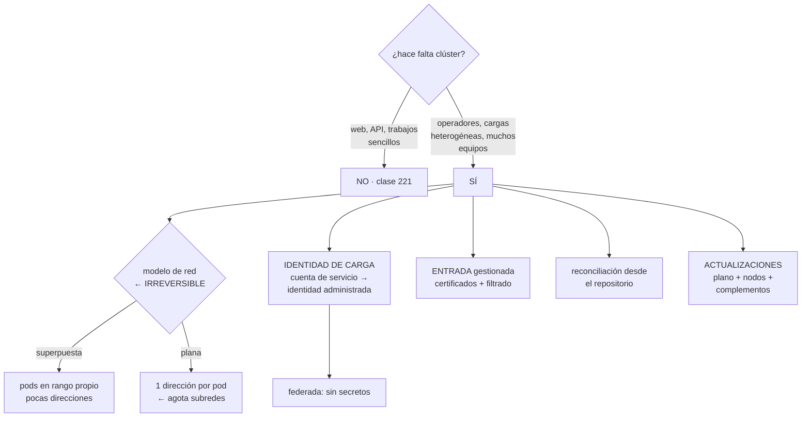

# 222 — AKS, workload identity, ingress y GitOps

> [← 221 · App Service, Functions y Container Apps en producción](../../part-18-azure-production-architecture/221-app-service-functions-y-container-apps-en-produccion/README.md) · [Índice de la parte](../README.md) · [223 · Azure SQL, Cosmos DB y consistencia distribuida →](../../part-18-azure-production-architecture/223-azure-sql-cosmos-db-y-consistencia-distribuida/README.md)

**Parte:** 18 — Azure: arquitectura empresarial y operación en producción<br>
**Nivel:** avanzado · **Horas estimadas:** 4<br>
**Laboratorio:** `kubernetes` · **Estado:** `EXECUTABLE_CORE`

## 🎯 Propósito

Operar Kubernetes gestionado en Azure con las particularidades que lo diferencian de lo visto en la clase 213: la identidad de carga federada con el directorio, el modelo de red —que en esta nube tiene una decisión irreversible sobre el consumo de direcciones—, la entrada gestionada y la reconciliación desde el repositorio. Y la pregunta de siempre antes de empezar: **¿hace falta, o basta con lo de la clase 221?**

## 📚 Resultados de aprendizaje

Al finalizar podrás:

1. **Decidir** si el clúster compensa frente a las opciones gestionadas.
2. **Elegir** el modelo de red conociendo su consumo de direcciones.
3. **Dar** identidad a las cargas con federación, sin secretos.
4. **Configurar** la entrada gestionada con certificados y filtrado.
5. **Planificar** actualizaciones de versión y de complementos.

## 🧩 Conceptos centrales

| Concepto | Comprensión verificable |
|---|---|
| `identidad de carga` | Cuenta de servicio del clúster federada con una identidad administrada del directorio. Sin secretos. |
| `modelo de red superpuesta` | Los pods usan un rango propio no enrutado; solo los nodos consumen direcciones de la subred. |
| `modelo de red plana` | Cada pod recibe una dirección de la subred. Consume muchísimas direcciones. |
| `controlador de entrada gestionado` | Entrada operada por la plataforma, con certificados y filtrado integrados. |
| `grupo de nodos` | Conjunto de nodos con el mismo tamaño y configuración. Se actualizan y escalan por grupo. |
| `canal de actualización` | Política que decide cuándo se aplican versiones nuevas de plano de control y de nodos. |

## 🧠 Modelo mental

La arquitectura Azure nace del tenant y las políticas heredables, y llega al workload mediante identidades administradas y redes privadas.

Aplicado a esta clase, separa siempre cuatro planos: **intención** (qué necesita el usuario),
**configuración** (qué declaramos), **estado observado** (qué existe de verdad) y
**evidencia** (cómo sabemos que cumple). Confundirlos produce diseños que se ven correctos
en un diagrama pero fallan al operar.

## 🗺️ Flujo de razonamiento



## 📖 Desarrollo

### 1. ¿Hace falta, y con qué configuración?

La pregunta de la clase 213 sigue siendo la primera, y en Azure tiene una respuesta adicional: **las aplicaciones de contenedor cubren muchos casos que antes exigían clúster**.

```text
NO HACE FALTA SI
  son contenedores web y trabajadores por cola
  → las aplicaciones de contenedor lo hacen con escala a
    cero y reparto por revisión                clase 221
  el equipo es pequeño
  no hay cargas con requisitos especiales

SÍ COMPENSA SI
  hay operadores o recursos propios que gestionar
  hay cargas heterogéneas: GPU, procesos largos, lotes con
    prioridades
  varios equipos necesitan autonomía sobre una base común
  o ya se opera Kubernetes en otra nube y la coherencia
    vale                                       clase 158
```

Y las decisiones de configuración que se toman al crear y cuestan corregir:

```text
1  MODELO DE RED           ← irreversible sin recrear
2  MODO DE IDENTIDAD       ← se puede migrar, con trabajo
3  PLANO DE CONTROL PRIVADO O PÚBLICO
4  GRUPOS DE NODOS: uno de sistema, y los de carga aparte
5  CANAL DE ACTUALIZACIÓN
```

**El modelo de red**, que es la decisión irreversible:

```text
RED PLANA (cada pod una dirección de la subred)
  + los pods son alcanzables directamente desde la red
  + útil si algo externo tiene que llamar a un pod concreto
  − CONSUME MUCHÍSIMAS DIRECCIONES
    dimensionado = nodos máximos × pods por nodo
    40 nodos × 110 pods = 4.400 direcciones
    → una subred /22 se queda corta
  − y el número de pods por nodo se fija al crear el grupo

RED SUPERPUESTA (pods en rango propio)
  + los nodos consumen direcciones; los pods, no
    40 nodos = 40 direcciones
  + el rango de pods puede reutilizarse entre clústeres
  − los pods no son alcanzables directamente desde fuera
    → hay que salir por servicios y por la entrada

→ la superpuesta es la elección razonable salvo requisito
  concreto                                     clase 193
→ y cambiar de una a otra exige recrear el clúster
```

Y una decisión relacionada:

```text
el plano de control puede ser público o privado
  privado    solo alcanzable desde la red; más seguro
  y entonces la canalización debe alcanzarlo
    → agente autoalojado en la red, o punto privado del
      plano de control
  → decidirlo antes evita rehacer la canalización
```

### 2. Identidad de carga, sin secretos

El mecanismo es el mismo de la clase 213, con las piezas de Azure.

```text
CÓMO FUNCIONA
  el clúster expone un emisor de testigos
  se declara una CREDENCIAL FEDERADA en una identidad
    administrada, atada a
      el emisor del clúster
      el ESPACIO DE NOMBRES
      y el NOMBRE de la cuenta de servicio
  la cuenta de servicio se anota con el identificador de
    esa identidad
  el pod recibe un testigo y lo intercambia

→ y los permisos se asignan a esa identidad, en el ámbito
  del recurso                                  clase 218
```

Y los patrones que hay que dejar atrás:

```text
✗ IDENTIDAD DEL NODO
  permisos en la identidad de la máquina
  → todos los pods del nodo los tienen
  → y hay que bloquear el acceso de los pods al servicio
    de metadatos, o los piden aunque tengan la suya

✗ SECRETOS DE KUBERNETES CON CREDENCIALES
  un objeto de tipo secreto está codificado, no cifrado
  → activar el cifrado del almacén del plano de control
  → y para secretos reales, obtenerlos del almacén externo
    en ejecución con un controlador, no guardarlos
```

Y el error de configuración que repite el de las clases 206 y 218:

```text
la credencial federada debe atar emisor, espacio de nombres
Y cuenta de servicio
✗ atar solo el emisor
  → cualquier cuenta de servicio de cualquier espacio de
    nombres obtiene esa identidad

prueba negativa
  desde un pod de otro espacio de nombres, intentar obtener
  el testigo y usarlo
  → debe fallar                                    ley 22
```

Y la separación por equipos, con lo que aporta cada pieza:

```text
espacio de nombres por equipo o carga
cuotas de recursos por espacio             clase 213
política de admisión, con mensajes que expliquen
  → qué imágenes se admiten: del registro propio y firmadas
  → sin privilegios, sin red del anfitrión
  → etiquetas obligatorias                    clase 214
política de red con denegación por defecto
  → y hay que activarla al crear: por defecto, todo pod
    habla con todo pod                           ley 26
```

### 3. Entrada, salida y complementos

**La entrada**, con la elección que hay que hacer:

```text
CONTROLADOR GESTIONADO POR LA PLATAFORMA
  + certificados, filtrado y escalado integrados
  + menos que operar
  − menos control de configuración fina

CONTROLADOR PROPIO EN EL CLÚSTER
  + control total, y portable a otras nubes  clase 158
  − hay que operarlo, escalarlo y actualizarlo
  − y gestionar certificados con un componente más

→ si el objetivo es reducir lo que se mantiene, el
  gestionado; si la portabilidad es un requisito real, el
  propio                                          ley 23
```

Y lo que hay que resolver en cualquiera de los dos:

```text
certificados: emisión y renovación automáticas
  y ALERTA POR ANTIGÜEDAD, no solo por caducidad
                                                clase 196
filtrado de aplicación delante                clase 209
plazos y drenaje coherentes                   clase 212
y la entrada NO debe ser el único control de acceso:
  la autorización entre servicios va aparte     clase 201
```

**La salida**, que en un clúster es fácil de dejar abierta:

```text
por defecto, los pods salen a internet por la dirección
del balanceador de salida
→ y eso es salida sin control                    ley 26

lo que hay que hacer
  ruta 0.0.0.0/0 hacia el cortafuegos           clase 219
  y política de red que restrinja a dónde puede salir cada
    espacio de nombres                          clase 200
  → y comprobar con una prueba negativa: sacar datos a un
    destino no declarado debe fallar
```

**Los complementos**, que son el trabajo continuo:

```text
los habituales
  controlador de entrada
  proveedor de secretos desde el almacén externo
  autoescalado de nodos
  recolección de métricas y registros
  política de admisión
  controlador de certificados
  y los operadores de cada equipo

y cada uno
  tiene su matriz de compatibilidad con la versión del
    clúster
  se actualiza en su propio calendario
  y puede bloquear la actualización del clúster  ley 23

→ los que la plataforma ofrece como complemento gestionado
  se actualizan con el clúster, y eso vale mucho
→ los instalados a mano, no                     clase 213
```

Y la decisión práctica:

```text
usa complementos gestionados donde existan
y para el resto, mantén la matriz de compatibilidad
escrita y comprobada antes de cada actualización
```

### 4. Actualizaciones y operación

**Las actualizaciones** tienen aquí tres piezas que se planifican por separado.

```text
1  PLANO DE CONTROL
   se actualiza primero; la ventana de soporte es corta
   → 2 o 3 veces al año, obligatorio             ley 25

2  GRUPOS DE NODOS
   se actualizan después, por grupos
   con acordonado y drenaje, respetando el presupuesto de
   interrupción                                clase 213
   → y hay que tener capacidad de sobra para el reemplazo

3  IMAGEN DE LOS NODOS
   parches del sistema operativo, más frecuentes
   → conviene automatizarlos con ventana de mantenimiento
```

Y las decisiones que evitan sorpresas:

```text
CANAL DE ACTUALIZACIÓN
  manual        control total, y se olvida            ley 25
  parches       aplica parches automáticamente ← razonable
  estable       sube versión menor automáticamente
  → con VENTANA DE MANTENIMIENTO declarada, para que no
    ocurra en hora punta

Y LA COMPROBACIÓN PREVIA
  interfaces retiradas en los manifiestos
  compatibilidad de complementos
  → y un clúster de prueba GENERADO DEL MISMO CÓDIGO
    → en la clase 213, la prueba pasó porque el clúster de
      prueba no era idéntico
```

**La reconciliación desde el repositorio**, con la misma alerta imprescindible:

```text
el estado deseado en el repositorio; un controlador lo
aplica y corrige la deriva                     clase 213

y la alerta
  «la sincronización lleva N minutos sin completarse»
  → un bucle parado no da error: deja de aplicar   ley 13
```

Y el modo automático de la plataforma, que conviene conocer:

```text
hay una variante gestionada de reconciliación como
complemento
  + menos que operar
  − menos control sobre versiones y extensiones
→ misma decisión que con los demás complementos
```

**Lo que hay que vigilar**, además de lo de la clase 213:

```text
versión del clúster y días hasta el fin de soporte ley 25
nodos con imagen desactualizada
antigüedad de la sincronización
direcciones libres en la subred de nodos
  → si se agota, no se puede escalar          clase 193
cuota de cómputo frente al máximo del escalado
  → la cuota es de la suscripción y se topa    clase 217
y reinicios por memoria y estrangulamiento por CPU
                                                clase 213
```

Y la lista de comprobación de la clase:

```text
☐ la decisión de usar clúster está justificada frente a las
  opciones gestionadas
☐ el modelo de red se eligió contando direcciones
☐ el plano de control es privado, y la canalización lo
  alcanza
☐ hay grupo de nodos de sistema separado de los de carga
☐ las cargas usan identidad federada, no la del nodo
☐ los pods no pueden alcanzar el servicio de metadatos
☐ la credencial federada ata emisor, espacio de nombres y
  cuenta de servicio
☐ los secretos vienen del almacén externo en ejecución
☐ la política de red está activada, con denegación por
  defecto
☐ la salida pasa por el cortafuegos y está restringida
☐ los certificados tienen alerta por antigüedad
☐ se usan complementos gestionados donde existen
☐ hay matriz de compatibilidad de los instalados a mano
☐ el canal de actualización y la ventana están decididos
☐ el clúster de prueba se genera del mismo código
☐ hay alerta de antigüedad de la sincronización
☐ se vigilan direcciones libres y cuota frente al máximo
```

Y el cierre que enlaza con la clase siguiente: con el cómputo resuelto, quedan los datos, que en Azure ofrecen tres familias con modelos de consistencia distintos y una de ellas con cinco niveles a elegir. Es la materia de la clase 223.

## 🔬 Ejemplo trabajado

**CloudShop monta su clúster en Azure para las cargas del equipo de datos y el buscador. Lo que sigue es la decisión del modelo de red que evitó recrear el clúster a los cuatro meses, y los dos incidentes del primer año.**

**La decisión de adoptar, con el método de siempre:**

```text
lo que se pedía
  2 cargas con GPU para el equipo de datos
  un operador de base vectorial que ese equipo ya usa
  trabajos por lotes con prioridades
  el buscador, con imagen propia y ajustes de sistema

lo que ya estaba resuelto
  web, API y trabajadores por cola, en aplicaciones de
  contenedor                                  clase 221

decisión
  clúster SOLO para esas 4 cargas
  las 11 aplicaciones de contenedor se quedan donde están
  motivo   funcionan, y moverlas añade trabajo sin
           beneficio                             ley 23
```

**El modelo de red: el cálculo que decidió.**

```text
el equipo iba a elegir red plana «porque es lo que usamos
en la otra nube»

el cálculo, hecho antes
  nodos máximos previstos                            34
  pods por nodo (valor por defecto)                 110
  direcciones necesarias con red plana            3.740
  más el margen de despliegue escalonado          ×1,5
  ────────────────────────────────────────────────────
  total                                          ~5.610
  → una subred /19

  con red superpuesta
  nodos máximos                                      34
  direcciones necesarias                             34
  más margen                                        ~60
  → una subred /26 basta

y el contexto
  el plan de direcciones asignaba /21 por radio
                                          clases 193, 219
  → con red plana, el clúster se habría comido más de la
    mitad del radio y habría bloqueado el crecimiento

decisión   red superpuesta
y lo que se comprobó antes
  ¿algo externo necesita llamar a un pod concreto?
  → no; todo pasa por servicios y por la entrada
  → sin ese requisito, la superpuesta no quita nada

y el coste de equivocarse
  cambiar el modelo exige RECREAR el clúster
  → migrar 4 cargas, sus datos y sus operadores: semanas
                                                    ley 14
```

**Incidente 1 · Todos los pods podían hablar con todos, mes 2.**

```text
se descubrió en la revisión de seguridad, no en un incidente

la política de red NO estaba activada
  → es una opción que se activa al crear el clúster
  → y por defecto está desactivada                 ley 26

qué implicaba
  un pod del espacio de nombres de pruebas del equipo de
  datos podía llamar al buscador y a la base vectorial
  y el alcance desde cualquier pod comprometido era el
  clúster entero                              clase 189

y lo peor
  activarla exige recrear el clúster en algunas
  configuraciones
  → en este caso se pudo activar sin recrear, con suerte

corrección
  política de red activada
  denegación por defecto entre espacios de nombres
  y reglas explícitas: 9 pares permitidos, de 42 posibles
  alcance desde un pod comprometido       clúster → 2
                                          servicios

y una comprobación añadida a la creación de clústeres
  función de aptitud: ningún clúster sin política de red
                                                clase 190
```

**Incidente 2 · La actualización que no cabía, mes 9.**

```text
situación   la versión entraba en fin de soporte
            se lanzó la actualización de los grupos de nodos

qué pasó
  la actualización reemplaza nodos: acordona, drena y crea
  uno nuevo
  para crear el nuevo hacía falta cuota de cómputo
  → la suscripción estaba al 96 % de su cuota para esa
    familia de máquinas                          clase 217
  → el nodo nuevo no se pudo crear
  → la actualización quedó a medias: 3 nodos acordonados y
    drenados, sin sustituto

  capacidad efectiva                        -22 %
  y las cargas con GPU no tenían dónde ir: su grupo tenía 2
  nodos y uno estaba acordonado
  duración                                  4 h 20

corrección inmediata
  se descordonó lo drenado y se pidió ampliación de cuota
  → tardó 6 h en concederse

corrección de fondo
  cuota pedida con margen del 30 % sobre el máximo del
  escalado
  alerta al 80 % de la cuota                    clase 262
  y regla: no se actualiza si el margen de cuota es menor
  que un nodo del grupo más grande
```

**La identidad, montada bien desde el principio:**

```text
7 identidades administradas, una por carga
credencial federada atando emisor + espacio de nombres +
  cuenta de servicio
permisos asignados en el ámbito del RECURSO   clase 218
acceso de los pods al servicio de metadatos: bloqueado
secretos desde el almacén externo, montados en ejecución

pruebas negativas
  ✓  pod de «datos-pruebas» intentando obtener la identidad
     de «buscador»                             denegado
  ✓  pod leyendo credenciales del nodo          bloqueado
  ✓  cuenta de servicio sin anotación             sin
                                                identidad
  ✗  un pod del espacio «datos» podía leer un almacén de
     producción
     → la asignación se había hecho en el ámbito del grupo
       de recursos, no del almacén
     → corregido                                clase 218
```

**La entrada y los complementos:**

```text
entrada     controlador gestionado por la plataforma
            motivo: la portabilidad no era requisito y hay
            menos que mantener                    ley 23
            certificados automáticos, con alerta por
            antigüedad                          clase 196
            filtrado delante                    clase 209

complementos
  gestionados      métricas, registros, proveedor de
                   secretos, política, autoescalado
  a mano           el operador de base vectorial del equipo
                   de datos
                   → 1 solo, con su matriz de compatibilidad

→ frente a los 12 complementos a mano de la clase 213,
  aquí quedó 1
→ y la actualización siguiente tardó 2 h en vez de 4
```

**Las actualizaciones, planificadas:**

```text
canal                parches automáticos
ventana              domingos 02:00-06:00
versión menor        manual, 3 veces al año, planificada

antes de cada una
  revisión de interfaces retiradas en la canalización
  clúster de prueba generado del mismo código   clase 213
  comprobación de cuota disponible
  matriz de compatibilidad del operador

segunda actualización (mes 13)
  duración                                        2 h
  incidencias                                       0
  manifiestos corregidos antes                      6
```

**El resultado, al año:**

```text                                        antes     después
direcciones consumidas por el clúster      ~5.610          60
  (si se hubiera elegido red plana)
alcance desde un pod comprometido      todo el clúster  2 serv.
complementos instalados a mano                 —           1
duración de una actualización              4 h 20        2 h
incidentes por cuota                            1           0
cargas movidas al clúster sin necesidad         0           0
capacidad de equipo consumida                 n/d    0,3 pers.
```

**La lección que esta clase deja**: la decisión que más valor tuvo se tomó **antes de crear el clúster**: elegir el modelo de red superpuesta ahorró más de cinco mil quinientas direcciones y evitó que el clúster se comiera medio radio del plan. Cambiarla después habría exigido recrearlo. Y el hallazgo de seguridad más grave —**todos los pods podían hablar con todos**— no lo produjo ningún error: era el valor por defecto, y se descubrió en una revisión, no en un incidente.

## 🧪 Laboratorio guiado

Ejecuta desde la raíz:

```bash
python classes/part-18-azure-production-architecture/222-aks-workload-identity-ingress-y-gitops/lab.py
```

El laboratorio selecciona el motor de práctica **`kubernetes`** y produce
`lab_result.json`. El escenario, sus comprobaciones y el artefacto esperado corresponden a
esta clase; no requiere credenciales y deja explícito qué debe revalidarse en un sandbox real.

1. Lee `exercise.steps` y formula una predicción antes de ejecutar.
2. Ejecuta la práctica y verifica todos los elementos de `checks`.
3. Provoca el caso de `negative_test` y explica la señal observada.
4. Materializa `azure-aks-platform` en `evidence/` usando la plantilla indicada.
5. Para proveedor real, sigue `sandbox.requires`, registra costo y ejecuta `destroy`.

### Evidencia esperada

El artefacto principal es manifiestos declarativos con estado observado. Además, la entrega debe incluir el comando ejecutado,
la salida estructurada y una conclusión que no exceda lo observado.

## 🏆 Reto verificable

Construye **`azure-aks-platform`** para el caso CloudShop. Incluye una alternativa descartada,
un supuesto que pueda falsarse, una prueba de fallo y una decisión de rollback.

## ✅ Criterio de aceptación

- [ ] `lab.py` termina con código 0 y genera JSON válido.
- [ ] La entrega conecta al menos tres requisitos con mecanismos verificables.
- [ ] Existe una prueba positiva y una prueba negativa con evidencia.
- [ ] Seguridad, costo y operación aparecen como decisiones, no como anexos.
- [ ] Se declara una limitación y una condición que obligaría a revisar el diseño.
- [ ] Otra persona puede repetir el recorrido sin conocimiento tácito.

## ⚠️ Errores frecuentes

| Síntoma | Causa probable | Corrección |
|---|---|---|
| El clúster consume miles de direcciones y bloquea el crecimiento de la red | Se eligió el modelo de red plana, en el que cada pod toma una dirección de la subred | Calcula nodos por pods antes de crear el clúster y elige el modelo superpuesto salvo requisito concreto; cambiarlo exige recrear. |
| Cualquier pod puede hablar con cualquier otro | La política de red no está activada; por defecto no lo está | Actívala al crear el clúster, con denegación por defecto y reglas explícitas, y compruébalo con una función de aptitud. |
| Un pod usa permisos que no le corresponden | Los permisos están en la identidad del nodo o la credencial federada solo ata al emisor | Identidad por carga, credencial atada a espacio de nombres y cuenta de servicio, y bloqueo del acceso al servicio de metadatos. |
| Una actualización deja nodos drenados sin sustituto | No hay cuota de cómputo para crear los nodos nuevos | Pide cuota con margen sobre el máximo del escalado, alerta al 80 % y no actualices si el margen es menor que un nodo. |
| La actualización del clúster se bloquea por los complementos | Muchos complementos instalados a mano, cada uno con su compatibilidad | Usa complementos gestionados donde existan y mantén escrita la matriz de los que queden. |
| Los cambios del repositorio dejan de aplicarse sin aviso | El bucle de reconciliación falló en silencio | Alerta por antigüedad de la sincronización, con destino a un canal con guardia. |

## 🛡️ Seguridad, ética y costo

Trabaja con cuentas propias o sandboxes autorizados. No publiques secretos, identificadores
reales ni datos personales. Antes de crear recursos pagos define presupuesto, etiquetas y
comando de destrucción; después verifica que no queden recursos huérfanos. Los ejemplos
locales enseñan contratos, pero no certifican cumplimiento ni disponibilidad de producción.

## ❓ Preguntas de comprobación

1. ¿Qué diferencia hay entre el modelo de red plana y el superpuesto, y por qué es irreversible?
2. ¿A qué debe atarse una credencial federada para una carga del clúster?
3. ¿Qué está permitido por defecto entre pods y cómo se cierra?
4. ¿Qué puede impedir que una actualización de nodos termine?
5. ¿Qué ventaja tienen los complementos gestionados frente a los instalados a mano?

## 🔗 Referencias

- Microsoft (2025). *Azure Kubernetes Service: workload identity*. <https://learn.microsoft.com/en-us/azure/aks/workload-identity-overview>
- Microsoft (2025). *AKS networking: Azure CNI overlay*. <https://learn.microsoft.com/en-us/azure/aks/azure-cni-overlay>
- Microsoft (2025). *Application routing add-on and managed ingress*. <https://learn.microsoft.com/en-us/azure/aks/app-routing>
- Microsoft (2025). *AKS cluster upgrades and maintenance windows*. <https://learn.microsoft.com/en-us/azure/aks/upgrade-cluster>
- Microsoft (2025). *AKS baseline architecture*. <https://learn.microsoft.com/en-us/azure/architecture/reference-architectures/containers/aks/baseline-aks>
- Documentación oficial vigente del servicio implementado; registra URL y fecha de consulta.

---

> [Evaluación](assessment.md) · [Contrato de clase](lesson.yaml) · [Índice de la parte](../README.md)

**📥 Descargar:** [Parte 18 en PDF](../../../site/downloads/partes/manual-parte-18-azure-production-architecture.pdf) · [Recorrido de Azure en PDF](../../../site/downloads/nubes/manual-azure.pdf) · [Manual integral](../../../site/downloads/multi-cloud-engineering-manual-v2.0.pdf)

| Anterior | Índice | Siguiente |
|---|---|---|
| [← 221 · App Service, Functions y Container Apps en producción](../../part-18-azure-production-architecture/221-app-service-functions-y-container-apps-en-produccion/README.md) | [Parte 18](../README.md) · [Programa](../../README.md) | [223 · Azure SQL, Cosmos DB y consistencia distribuida →](../../part-18-azure-production-architecture/223-azure-sql-cosmos-db-y-consistencia-distribuida/README.md) |
