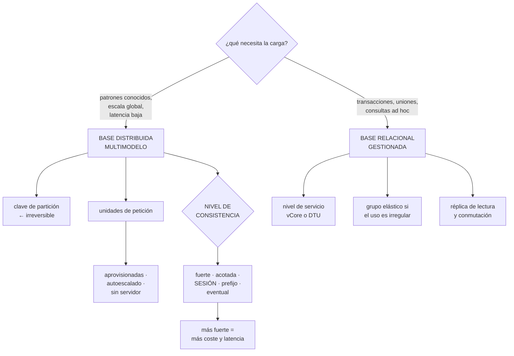

# 223 — Azure SQL, Cosmos DB y consistencia distribuida

> [← 222 · AKS, workload identity, ingress y GitOps](../../part-18-azure-production-architecture/222-aks-workload-identity-ingress-y-gitops/README.md) · [Índice de la parte](../README.md) · [224 · Service Bus, Event Grid y Event Hubs →](../../part-18-azure-production-architecture/224-service-bus-event-grid-y-event-hubs/README.md)

**Parte:** 18 — Azure: arquitectura empresarial y operación en producción<br>
**Nivel:** avanzado · **Horas estimadas:** 4<br>
**Laboratorio:** `data` · **Estado:** `EXECUTABLE_CORE`

## 🎯 Propósito

Elegir y configurar el almacén de datos en Azure, donde hay una decisión que no existe en otras nubes: **cinco niveles de consistencia a elegir, con su coste y su latencia**. La clase compara la base relacional gestionada, la distribuida multimodelo y el resto de la familia, explica qué significa cada nivel de consistencia en la práctica, y desarrolla el modelo de capacidad —unidades de petición— que es donde se rompen los presupuestos y las latencias.

## 📚 Resultados de aprendizaje

Al finalizar podrás:

1. **Elegir** entre base relacional gestionada y distribuida con criterios.
2. **Decidir** el nivel de consistencia por operación y conocer su coste.
3. **Dimensionar** capacidad con unidades de petición y evitar el estrangulamiento.
4. **Distribuir** datos entre regiones sabiendo qué se gana y qué se paga.
5. **Diagnosticar** los fallos característicos de cada familia.

## 🧩 Conceptos centrales

| Concepto | Comprensión verificable |
|---|---|
| `unidad de petición` | Medida normalizada del coste de una operación. Determina capacidad, latencia y factura. |
| `clave de partición lógica` | Campo que agrupa elementos. Decide el reparto y no se puede cambiar sin migrar. |
| `consistencia acotada` | Nivel que garantiza un desfase máximo, en versiones o en tiempo. |
| `consistencia de sesión` | Nivel por defecto: un cliente ve sus propias escrituras y no retrocede. |
| `grupo de escalado elástico` | Conjunto de bases que comparten recursos, para cargas de uso irregular. |
| `escritura multirregión` | Opción que permite escribir en varias regiones. Duplica el coste y obliga a resolver conflictos. |

## 🧠 Modelo mental

La arquitectura Azure nace del tenant y las políticas heredables, y llega al workload mediante identidades administradas y redes privadas.

Aplicado a esta clase, separa siempre cuatro planos: **intención** (qué necesita el usuario),
**configuración** (qué declaramos), **estado observado** (qué existe de verdad) y
**evidencia** (cómo sabemos que cumple). Confundirlos produce diseños que se ven correctos
en un diagrama pero fallan al operar.

## 🗺️ Flujo de razonamiento



## 📖 Desarrollo

### 1. Elegir la familia

Azure ofrece varias familias y la elección se hace igual que siempre: por los patrones de acceso.

```text
BASE RELACIONAL GESTIONADA
  transacciones, uniones, consultas que no se conocen de
  antemano, informes
  + SQL, herramientas maduras, migración desde lo heredado
  + réplicas de lectura y conmutación gestionada
  − escala vertical con límite; la horizontal exige
    particionar a mano
  − y las conexiones son un recurso limitado  clase 207

BASE DISTRIBUIDA MULTIMODELO
  patrones conocidos, escala grande, latencia baja y
  distribución global
  + escala horizontal transparente
  + distribución multirregión con una casilla
  + cinco niveles de consistencia a elegir
  − el modelo se deduce de los patrones      clase 208
  − y el coste se mide en unidades de petición, que hay que
    entender

Y EL RESTO DE LA FAMILIA
  caché en memoria       para lecturas calientes
  almacén de tablas      barato y limitado
  almacenamiento de
    objetos con capas    para lo frío
  y motores gestionados de código abierto para migraciones
```

Y el criterio, que ya conocemos:

```text
¿las consultas se conocen de antemano?
  no  → relacional; o distribuida MÁS un almacén analítico
  sí  → distribuida, si el volumen o la latencia lo piden

¿hace falta transacción entre entidades no relacionadas?
  → relacional

¿hace falta latencia baja en varias regiones?
  → distribuida
```

Y el patrón que resuelve la mayoría de los casos reales:

```text
distribuida para el camino operativo
+ enlace analítico o flujo de cambios hacia un almacén de
  análisis para informes y exploración
→ y así ninguna de las dos hace lo que no sabe hacer
                                          clases 208, 150
```

Y una advertencia sobre la migración desde lo heredado:

```text
la instancia gestionada permite migrar bases antiguas con
casi cero cambios
  + resuelve la migración
  − y traslada el modelo antiguo, con sus problemas
→ es una decisión de plazo, no de arquitectura; conviene
  escribir que es temporal, con fecha            ley 25
```

### 2. Los cinco niveles de consistencia

Esta es la particularidad que no existe en otras nubes: el nivel de consistencia se **elige**, por cuenta y por operación.

```text
FUERTE
  toda lectura ve la última escritura confirmada
  coste   el más alto; y NO se puede usar con escritura
          multirregión
  latencia añadida entre regiones

OBSOLESCENCIA ACOTADA
  el desfase máximo está garantizado: N versiones o T
  segundos
  → útil cuando se puede tolerar un retraso conocido
  → y es la única que da una COTA, que es lo que suele
    hacer falta

SESIÓN  ← el valor por defecto
  el cliente ve sus propias escrituras y no retrocede
  coste   la mitad de lectura que la fuerte
  → y es lo que la mayoría de los sistemas necesitan de
    verdad                                    clase 187

PREFIJO COHERENTE
  las escrituras se leen en orden, sin huecos
  → sin garantía de recencia

EVENTUAL
  converge, sin plazo ni orden
  coste   el más bajo
```

Y las tres cosas que hay que saber para decidir:

```text
1  EL COSTE DE LECTURA CAMBIA
   fuerte y acotada cuestan el DOBLE de unidades de
   petición que sesión, prefijo o eventual
   → cambiar el nivel por defecto de fuerte a sesión puede
     reducir la factura de lectura a la mitad

2  SE PUEDE RELAJAR POR PETICIÓN
   la cuenta fija el nivel por defecto
   y cada petición puede pedir uno MÁS DÉBIL, nunca más
   fuerte
   → conviene poner la cuenta en el nivel más fuerte que
     necesite alguna operación, y relajar el resto

3  LA ESCRITURA MULTIRREGIÓN LIMITA LAS OPCIONES
   con varias regiones de escritura, fuerte no está
   disponible
   → y hay que resolver conflictos, con las trampas de los
     relojes                                 clase 187
```

Y la decisión práctica, con el método de la clase 187:

```text
por cada operación
  reservar plaza / cobrar   → fuerte, o escritura
                              condicionada
  ver lo propio             → sesión
  listar catálogo           → eventual
  panel                     → eventual, marcado

y el nivel de la cuenta = el más fuerte que necesite alguna
→ el resto relaja explícitamente
```

Y una advertencia sobre la consistencia fuerte:

```text
con regiones distribuidas, la lectura fuerte obliga a
coordinar
→ la latencia crece con la distancia
→ y por eso «pongo todo en fuerte por si acaso» es la
  decisión más cara que se puede tomar aquí       ley 26
```

### 3. Unidades de petición y estrangulamiento

Todo el coste, la capacidad y la latencia de la base distribuida se expresan en **unidades de petición**, y no entenderlas es la causa de los sustos.

```text
QUÉ CONSUME
  leer un elemento por su clave: poco, y proporcional al
    tamaño
  escribir: bastante más que leer
  índices: cada índice encarece la escritura
  consulta que recorre varias particiones: MUCHO
  → y esa es la que arruina el presupuesto

LOS MODELOS DE CAPACIDAD
  APROVISIONADA        se reservan unidades por segundo
    + barata con tráfico alto y estable
    − hay que dimensionar y vigilar el estrangulamiento
  AUTOESCALADO         entre un mínimo y diez veces ese
                       mínimo
    + absorbe picos
    − precio por unidad mayor
  SIN SERVIDOR         se paga por consumo
    + ideal para desarrollo y cargas pequeñas
    − límites de caudal y de almacenamiento
```

Y el reparto por partición, que es donde se falla:

```text
LAS UNIDADES SE REPARTEN ENTRE PARTICIONES FÍSICAS
  10.000 unidades y 10 particiones → 1.000 por partición

→ si el tráfico va a una sola clave, se dispone de 1.000,
  no de 10.000
→ y aparece el estrangulamiento con la base «al 10 % de
  uso»
→ es exactamente el problema de la clase 208, con otro
  nombre
```

Y el diagnóstico y las correcciones:

```text
SÍNTOMA   error de petición limitada, con reintento sugerido
          latencia alta en horas concretas
          y consumo total muy por debajo de lo
          aprovisionado

QUÉ MIRAR
  unidades consumidas POR PARTICIÓN, no en total
  y las claves de partición más consumidoras

CORRECCIONES
  clave que reparta mejor            ← lo correcto
  clave sintética con sufijo         ← si ya es tarde
  caché delante para lecturas calientes
  y revisar las consultas que cruzan particiones
```

Y dos ajustes que reducen mucho el consumo:

```text
POLÍTICA DE ÍNDICES
  por defecto se indexa CUALQUIER campo
  → cada escritura paga por indexar campos que nadie
    consulta                                      ley 26
  → excluir lo que no se filtra reduce el consumo de
    escritura de forma notable

TAMAÑO DEL ELEMENTO
  el coste de lectura crece con el tamaño
  → guardar campos grandes fuera y referenciarlos
```

Y la vigilancia imprescindible:

```text
peticiones limitadas: alerta si superan un umbral bajo
unidades consumidas frente a las aprovisionadas
las 10 claves de partición que más consumen
y el coste por operación de negocio           clase 214
```

### 4. Distribución, continuidad y la familia relacional

**La distribución multirregión** de la base distribuida se activa fácilmente y tiene consecuencias.

```text
AÑADIR UNA REGIÓN DE LECTURA
  duplica el almacenamiento y las unidades de petición
  → el coste se multiplica por el número de regiones
  + latencia baja en esa región
  + y conmutación gestionada

AÑADIR ESCRITURA MULTIRREGIÓN
  + escritura local en cada región
  − conflictos: hay que definir la política de resolución
  − y con relojes derivando, «el último gana» tiene las
    trampas conocidas                          clase 187
  → solo tiene sentido si cada dato lo escribe una sola
    región                                        ley 21

CONMUTACIÓN
  automática o manual
  → automática es cómoda y quita el control del momento
  → y volver exige que la región original se ponga al día
                                                clase 215
```

Y el consejo:

```text
empieza con una región de escritura y las de lectura que
hagan falta
y mide antes de activar escritura multirregión: casi nunca
es lo que se necesita
```

**La familia relacional**, con sus decisiones propias:

```text
NIVEL DE SERVICIO
  el modelo por núcleos permite elegir cómputo y
  almacenamiento por separado
  → más predecible que el modelo por unidades combinadas

GRUPOS ELÁSTICOS
  varias bases comparten recursos
  → ideal para multi-inquilino con uso irregular
  → y evita pagar capacidad por cada base

RÉPLICAS DE LECTURA
  descargan informes y consultas pesadas
  → con el retraso de réplica vigilado         clase 161

CONTINUIDAD
  grupo de conmutación con nombre de escritura y de lectura
  → la aplicación usa el nombre, no la instancia
  → y el plazo real se MIDE, incluida la caché del cliente
                                          clases 195, 215

CONEXIONES
  el límite depende del nivel
  → y con cómputo que escala, hay que calcularlo por
    instancia                                  clase 221
  → o usar un intermediario de conexiones
```

Y una decisión de coste que se olvida:

```text
el nivel sin servidor de la base relacional pausa la base
tras un tiempo sin uso
  + muy barato en desarrollo
  − la primera conexión tras la pausa tarda
  → excelente para entornos no productivos    clase 214
  → y una mala idea en producción con tráfico esporádico
```

Y la lista de comprobación de la clase:

```text
☐ la familia elegida corresponde a los patrones de acceso
☐ los patrones están escritos antes del modelo
☐ la clave de partición reparte y está en las consultas
☐ el nivel de consistencia de la cuenta es el más fuerte
  necesario, y el resto se relaja por petición
☐ se conoce el coste doble de lectura de los niveles
  fuertes
☐ el modelo de capacidad corresponde al perfil de tráfico
☐ se vigilan las unidades por partición, no solo el total
☐ hay alerta de peticiones limitadas
☐ la política de índices excluye lo que no se consulta
☐ los campos grandes no viven dentro del elemento
☐ las regiones añadidas están justificadas por su coste
☐ la escritura multirregión, si existe, tiene política de
  conflictos escrita
☐ la aplicación usa nombres de conmutación, no instancias
☐ el límite de conexiones se calculó por instancia
☐ el plazo de conmutación se ha medido, no calculado
```

Y el cierre que enlaza con la clase siguiente: con datos y cómputo resueltos, el trabajo que no cabe en la petición se envía a procesar, y en Azure hay tres servicios de mensajería con propósitos distintos que se confunden constantemente. Es la materia de la clase 224.

## 🔬 Ejemplo trabajado

**CloudShop elige y configura sus almacenes en Azure. Lo que sigue es la factura de la base distribuida que triplicaba lo previsto, las dos causas que la explicaban, y la decisión de consistencia que redujo el coste de lectura a la mitad.**

**El punto de partida, tras dos meses:**

```text
estimación inicial                          1.800 €/mes
factura real                                5.740 €/mes

desglose
  base distribuida (pedidos y clientes)     4.100 €
  base relacional (facturación heredada)      980 €
  caché en memoria                            340 €
  almacenamiento de objetos                   320 €
```

**Causa 1 · La consistencia fuerte por defecto.**

```text
la cuenta se había creado con consistencia FUERTE
motivo del equipo   «es la más segura»

lo que costaba
  las lecturas fuertes consumen el doble de unidades que
  las de sesión
  lecturas al mes                              980 M
  → y el 96 % de ellas no necesitaban recencia

el análisis por operación                    clase 187
  operación                    necesita          nivel
  reservar plaza               atomicidad     escritura
                                              condicionada
  ver mi pedido                verme a mí     sesión
  listar catálogo              nada           eventual
  ver precio                   ≤ 15 min       eventual
  panel de ventas              ≤ 60 s         eventual
  cierre contable              recencia       acotada 5 s

  → ninguna operación necesitaba FUERTE
  → la más exigente era el cierre contable, con acotada

cambio
  nivel de la cuenta          fuerte → obsolescencia
                              acotada (5 s)
  y las lecturas normales piden explícitamente sesión o
  eventual

efecto
  unidades de lectura consumidas          -47 %
  coste                          4.100 € → 2.380 €
  latencia p99 de lectura           38 ms → 9 ms
```

Y la observación:

```text
el nivel de consistencia se había elegido en el asistente
de creación, en 20 segundos, sin escribir ningún patrón
→ y costaba 1.720 €/mes                    ley 14, ley 26
```

**Causa 2 · La política de índices por defecto.**

```text
por defecto se indexan TODOS los campos

el documento de pedido tenía 61 campos
  campos usados en filtros u ordenaciones           7
  campos indexados                                 61

consumo de escritura por pedido        42 unidades
tras excluir los 54 campos no consultados
                                       17 unidades

efecto
  escrituras al mes                        41 M
  coste de escritura              1.720 € → 700 €
```

Y un efecto secundario que no se buscaba:

```text
dos campos indexados contenían texto largo de descripción
→ excluirlos redujo también el TAMAÑO del índice
→ almacenamiento                        410 GB → 240 GB
```

**El estrangulamiento con la base al 11 %.**

```text
síntoma   entre las 11:00 y las 12:30, errores de petición
          limitada
          consumo total                    2.100 de 20.000
          unidades aprovisionadas

diagnóstico
  unidades por partición, no en total
  el panel de claves más consumidoras

    clave de partición          unidades consumidas
    cliente#EMPRESA-A                 1.740   ← el 83 %
    resto (41.000 claves)               360

  el cliente EMPRESA-A hacía pedidos automáticos desde su
  sistema, con ráfagas a mediodía
  su partición disponía de ~1.800 unidades de las 20.000
  → estrangulada, mientras el resto de la base estaba
    ociosa

corrección
  no se cambió la clave: habría exigido migrar
  → el sistema de EMPRESA-A pasó a agrupar sus pedidos en
    lotes con límite de ritmo
  → y se añadió una alerta: «una sola clave consume más del
    30 % del total»

y la decisión registrada
  «si aparece un segundo cliente con este perfil, se
   introduce clave sintética con sufijo y se migra»
                                          clases 208, 190
```

**La distribución multirregión, evaluada y recortada.**

```text
se había activado escritura multirregión en 3 regiones
motivo   «para estar preparados»

lo que costaba
  almacenamiento × 3
  unidades de petición × 3
  → 2.380 € pasaban a ser ~4.900 € solo por eso

lo que aportaba
  el 98,4 % del tráfico venía de Europa occidental
  las otras dos regiones servían 1,6 %
  y la escritura multirregión obligaba a una política de
  resolución de conflictos que nadie había definido

decisión
  1 región de escritura (Europa occidental)
  1 región de lectura (Europa norte), para continuidad
                                                clase 215
  la tercera, retirada
  escritura multirregión, desactivada

coste                              4.900 € → 2.380 €
  (con la región de lectura ya incluida)
```

**La base relacional, con lo suyo:**

```text
facturación heredada, migrada a instancia gestionada
  → decisión registrada como TEMPORAL, con revisión a 18
    meses                                        ley 25

ajustes
  nivel   por núcleos, cómputo y almacenamiento separados
  réplica de lectura para los informes
    → descargó el 61 % de las consultas del primario
  grupo de conmutación con nombres de escritura y lectura
    → la aplicación usa el nombre, no la instancia

y las conexiones
  cómputo con escalado a 30 instancias           clase 221
  agrupación por instancia                        20
  30 × 20 = 600  > 400 del nivel contratado
  → se bajó la agrupación a 12 y se añadió intermediario
  → conexiones máximas observadas                 214

y los entornos no productivos
  nivel sin servidor con pausa automática
  coste de desarrollo y preproducción     480 € → 90 €
                                                clase 214
```

**El resultado:**

```text                                        antes     después
coste mensual de datos                    5.740 €    2.910 €
  base distribuida                        4.100 €    1.680 €
  base relacional                           980 €      810 €
  no productivos                            480 €       90 €
unidades por escritura de pedido              42          17
latencia p99 de lectura                    38 ms        9 ms
errores de petición limitada           140/día           0
almacenamiento de la base distribuida     410 GB      240 GB
regiones activas                               3           2
escritura multirregión                        sí          no
conexiones máximas a la relacional            600         214
```

**La lección que esta clase deja**: de los cinco mil setecientos euros mensuales, **más de la mitad venía de dos decisiones tomadas en el asistente de creación**: el nivel de consistencia fuerte y la política de índices que lo indexa todo. Ninguna operación necesitaba consistencia fuerte, y siete de sesenta y un campos se consultaban. Y el estrangulamiento con la base al once por ciento de uso resultó ser **un solo cliente concentrando el ochenta y tres por ciento del consumo en una partición**, que es el mismo problema de la clase 208 con otro nombre.

## 🧪 Laboratorio guiado

Ejecuta desde la raíz:

```bash
python classes/part-18-azure-production-architecture/223-azure-sql-cosmos-db-y-consistencia-distribuida/lab.py
```

El laboratorio selecciona el motor de práctica **`data`** y produce
`lab_result.json`. El escenario, sus comprobaciones y el artefacto esperado corresponden a
esta clase; no requiere credenciales y deja explícito qué debe revalidarse en un sandbox real.

1. Lee `exercise.steps` y formula una predicción antes de ejecutar.
2. Ejecuta la práctica y verifica todos los elementos de `checks`.
3. Provoca el caso de `negative_test` y explica la señal observada.
4. Materializa `azure-data-platform` en `evidence/` usando la plantilla indicada.
5. Para proveedor real, sigue `sandbox.requires`, registra costo y ejecuta `destroy`.

### Evidencia esperada

El artefacto principal es un modelo de datos ligado a patrones de acceso. Además, la entrega debe incluir el comando ejecutado,
la salida estructurada y una conclusión que no exceda lo observado.

## 🏆 Reto verificable

Construye **`azure-data-platform`** para el caso CloudShop. Incluye una alternativa descartada,
un supuesto que pueda falsarse, una prueba de fallo y una decisión de rollback.

## ✅ Criterio de aceptación

- [ ] `lab.py` termina con código 0 y genera JSON válido.
- [ ] La entrega conecta al menos tres requisitos con mecanismos verificables.
- [ ] Existe una prueba positiva y una prueba negativa con evidencia.
- [ ] Seguridad, costo y operación aparecen como decisiones, no como anexos.
- [ ] Se declara una limitación y una condición que obligaría a revisar el diseño.
- [ ] Otra persona puede repetir el recorrido sin conocimiento tácito.

## ⚠️ Errores frecuentes

| Síntoma | Causa probable | Corrección |
|---|---|---|
| El coste de lectura es el doble de lo esperado | La cuenta usa un nivel de consistencia fuerte que ninguna operación necesita | Decide el nivel por operación, fija en la cuenta el más fuerte necesario y relaja el resto por petición. |
| Cada escritura consume muchísimas unidades | La política de índices indexa todos los campos por defecto | Excluye del índice los campos que no se filtran ni se ordenan, y saca los textos largos del elemento. |
| Hay estrangulamiento con la base al diez por ciento de uso | Las unidades se reparten entre particiones y el tráfico va a una sola clave | Mira el consumo por partición y las claves más consumidoras; corrige la clave, agrupa en lotes o añade sufijo sintético. |
| La factura se multiplica al añadir regiones | Cada región replica almacenamiento y unidades de petición | Justifica cada región con el tráfico que sirve y activa la escritura multirregión solo si cada dato lo escribe una sola región. |
| La base relacional agota conexiones al escalar el cómputo | Cada instancia abre su propia agrupación y el total supera el límite del nivel | Calcula la agrupación por instancia contando el máximo del escalado, o usa un intermediario de conexiones. |
| La aplicación no sigue la conmutación de la base | Se conecta a la instancia y no al nombre del grupo de conmutación | Usa siempre el nombre de escritura o de lectura, y mide el plazo real de conmutación incluyendo la caché del cliente. |

## 🛡️ Seguridad, ética y costo

Trabaja con cuentas propias o sandboxes autorizados. No publiques secretos, identificadores
reales ni datos personales. Antes de crear recursos pagos define presupuesto, etiquetas y
comando de destrucción; después verifica que no queden recursos huérfanos. Los ejemplos
locales enseñan contratos, pero no certifican cumplimiento ni disponibilidad de producción.

## ❓ Preguntas de comprobación

1. ¿Cuáles son los cinco niveles de consistencia y cuál es el valor por defecto?
2. ¿Qué niveles cuestan el doble de unidades al leer?
3. ¿Por qué puede haber estrangulamiento con la base muy por debajo de su capacidad total?
4. ¿Qué efecto tiene la política de índices por defecto sobre el coste de escritura?
5. ¿Qué obliga a resolver la escritura multirregión y cuándo tiene sentido?

## 🔗 Referencias

- Microsoft (2025). *Azure Cosmos DB consistency levels*. <https://learn.microsoft.com/en-us/azure/cosmos-db/consistency-levels>
- Microsoft (2025). *Request units in Azure Cosmos DB*. <https://learn.microsoft.com/en-us/azure/cosmos-db/request-units>
- Microsoft (2025). *Partitioning and horizontal scaling*. <https://learn.microsoft.com/en-us/azure/cosmos-db/partitioning-overview>
- Microsoft (2025). *Indexing policies in Azure Cosmos DB*. <https://learn.microsoft.com/en-us/azure/cosmos-db/index-policy>
- Microsoft (2025). *Azure SQL Database: failover groups and elastic pools*. <https://learn.microsoft.com/en-us/azure/azure-sql/database/failover-group-sql-db>
- Documentación oficial vigente del servicio implementado; registra URL y fecha de consulta.

---

> [Evaluación](assessment.md) · [Contrato de clase](lesson.yaml) · [Índice de la parte](../README.md)

**📥 Descargar:** [Parte 18 en PDF](../../../site/downloads/partes/manual-parte-18-azure-production-architecture.pdf) · [Recorrido de Azure en PDF](../../../site/downloads/nubes/manual-azure.pdf) · [Manual integral](../../../site/downloads/multi-cloud-engineering-manual-v2.0.pdf)

| Anterior | Índice | Siguiente |
|---|---|---|
| [← 222 · AKS, workload identity, ingress y GitOps](../../part-18-azure-production-architecture/222-aks-workload-identity-ingress-y-gitops/README.md) | [Parte 18](../README.md) · [Programa](../../README.md) | [224 · Service Bus, Event Grid y Event Hubs →](../../part-18-azure-production-architecture/224-service-bus-event-grid-y-event-hubs/README.md) |
