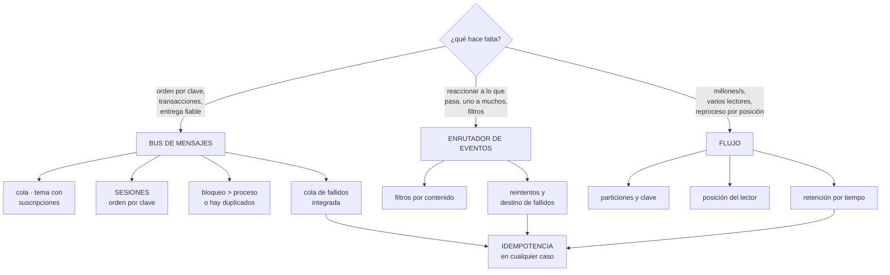

# 224 — Service Bus, Event Grid y Event Hubs

> [← 223 · Azure SQL, Cosmos DB y consistencia distribuida](../../part-18-azure-production-architecture/223-azure-sql-cosmos-db-y-consistencia-distribuida/README.md) · [Índice de la parte](../README.md) · [225 · Azure Monitor, Application Insights y OpenTelemetry →](../../part-18-azure-production-architecture/225-azure-monitor-application-insights-y-opentelemetry/README.md)

**Parte:** 18 — Azure: arquitectura empresarial y operación en producción<br>
**Nivel:** avanzado · **Horas estimadas:** 4<br>
**Laboratorio:** `messaging` · **Estado:** `EXECUTABLE_CORE`

## 🎯 Propósito

Elegir entre los tres servicios de mensajería de Azure, que se confunden constantemente porque los tres «llevan mensajes» y resuelven cosas distintas. La clase separa el bus de mensajes empresarial, el enrutador de eventos y el flujo de gran volumen por lo que cada uno garantiza, desarrolla los mecanismos propios del primero —sesiones, transacciones, detección de duplicados— y aplica la disciplina de siempre: **idempotencia, cola de fallidos vigilada y reproceso probado**.

## 📚 Resultados de aprendizaje

Al finalizar podrás:

1. **Elegir** entre bus, enrutador y flujo según lo que se garantiza.
2. **Usar** sesiones, transacciones y detección de duplicados donde aportan.
3. **Configurar** bloqueo, reintentos y cola de fallidos coherentemente.
4. **Consumir** un flujo con posiciones y reparto por partición.
5. **Operar** los mensajes fallidos con alerta, diagnóstico y reproceso.

## 🧩 Conceptos centrales

| Concepto | Comprensión verificable |
|---|---|
| `bus de mensajes` | Colas y temas con garantías empresariales: orden por sesión, transacciones, detección de duplicados y cola de fallidos. |
| `enrutador de eventos` | Servicio que entrega eventos a destinos según filtros. Uno a muchos, con reintentos y destino de fallidos. |
| `flujo de eventos` | Registro particionado de gran volumen, con lectores independientes y reproceso por posición. |
| `sesión` | Agrupación de mensajes por clave que garantiza orden y entrega al mismo consumidor. |
| `bloqueo del mensaje` | Tiempo durante el que el mensaje tomado no se entrega a otro. Debe superar el proceso o hay duplicados. |
| `detección de duplicados` | Descarte de mensajes con el mismo identificador dentro de una ventana. No sustituye a la idempotencia. |

## 🧠 Modelo mental

La arquitectura Azure nace del tenant y las políticas heredables, y llega al workload mediante identidades administradas y redes privadas.

Aplicado a esta clase, separa siempre cuatro planos: **intención** (qué necesita el usuario),
**configuración** (qué declaramos), **estado observado** (qué existe de verdad) y
**evidencia** (cómo sabemos que cumple). Confundirlos produce diseños que se ven correctos
en un diagrama pero fallan al operar.

## 🗺️ Flujo de razonamiento



## 📖 Desarrollo

### 1. Tres servicios, tres propósitos

Los tres transportan mensajes y garantizan cosas distintas. Elegir mal produce sistemas que funcionan hasta que hay carga o hay que reprocesar.

```text
BUS DE MENSAJES (Service Bus)
  colas y temas con suscripciones
  garantiza
    entrega al menos una vez, con bloqueo y confirmación
    ORDEN por sesión
    transacciones entre entidades del propio bus
    detección de duplicados en una ventana
    cola de fallidos integrada
    y mensajes programados y diferidos
  para   pedidos, pagos, integraciones donde perder o
         desordenar cuesta dinero
  ojo    caudal moderado; no es para millones por segundo

ENRUTADOR DE EVENTOS (Event Grid)
  entrega eventos a destinos según filtros de contenido
  garantiza
    entrega al menos una vez, con reintentos y retroceso
    destino de fallidos
    y filtros declarativos
  para   reaccionar a lo que ocurre; uno a muchos
         incluidos los eventos de la propia plataforma
  ojo    NO garantiza orden

FLUJO (Event Hubs)
  registro particionado, con lectores independientes
  garantiza
    orden DENTRO de la partición
    retención por tiempo y reproceso por posición
    varios grupos de consumidores sin duplicar el
      almacenamiento
  para   telemetría, trazas, clics, sensores: gran volumen
  ojo    el consumidor gestiona su posición; si la pierde,
         reprocesa o se salta                  clase 116
```

Y la combinación habitual, que es la que hay que reconocer:

```text
algo ocurre → ENRUTADOR (uno a muchos, con filtros)
            → COLA del bus por consumidor
            → función o contenedor

y por separado
  telemetría de alto volumen → FLUJO → procesamiento y
                               almacén analítico

→ y la cola entre el enrutador y el consumidor sigue siendo
  lo que amortigua y da control de reintentos  clase 210
```

Y el error de elección más caro:

```text
usar el flujo como si fuera una cola
  no hay bloqueo por mensaje ni confirmación individual
  no hay cola de fallidos integrada
  un mensaje venenoso bloquea la partición entera
  → hay que implementar todo eso a mano

y al revés: usar el bus para telemetría de alto volumen
  → caudal insuficiente y coste alto
```

### 2. Los mecanismos del bus

El bus tiene mecanismos que no existen en otros servicios y que resuelven problemas concretos.

```text
SESIONES — orden por clave
  los mensajes con la misma clave de sesión van al mismo
  consumidor, en orden
  → resuelve «los eventos de un pedido deben procesarse en
    orden» sin serializar todo
  coste
    el caudal por sesión lo limita un solo consumidor
    y el consumidor debe mantener la sesión bloqueada
  → usar sesiones solo donde el orden importe   clase 203

TRANSACCIONES
  varias operaciones del bus en una unidad atómica
  → recibir de una cola y enviar a otra, todo o nada
  ojo   solo dentro del mismo espacio de nombres; NO
        incluye la base de datos
  → para eso sigue haciendo falta la tabla de salida
                                                clase 118

DETECCIÓN DE DUPLICADOS
  descarta mensajes con el mismo identificador dentro de
  una ventana de tiempo
  + evita duplicados del PRODUCTOR que reintenta
  − no cubre el reproceso ni la reentrega tras bloqueo
    vencido
  → NO sustituye a la idempotencia del consumidor
                                                clase 210

MENSAJES PROGRAMADOS Y DIFERIDOS
  programado   se entrega a una hora futura
  diferido     el consumidor lo aparta y lo recupera por su
               número de secuencia
  → útiles para reintentos con retroceso largo y para
    esperar a que llegue otra cosa
```

**Los parámetros que producen duplicados**, con la misma aritmética de la clase 210:

```text
DURACIÓN DEL BLOQUEO
  el mensaje tomado queda bloqueado ese tiempo
  si el proceso tarda más, el bloqueo VENCE y el mensaje se
  reentrega
  → duplicados

  dos soluciones
    bloqueo mayor que el proceso máximo
    o RENOVAR el bloqueo desde el consumidor mientras
      trabaja
    → la renovación automática existe en las bibliotecas y
      hay que activarla

RECUENTO MÁXIMO DE ENTREGAS
  cuántas veces antes de ir a la cola de fallidos
  típico 3 a 5

TAMAÑO DE LOTE Y PREBÚSQUEDA
  la prebúsqueda trae mensajes por adelantado
  + menos latencia
  − esos mensajes están bloqueados aunque no se procesen
  → prebúsqueda alta con proceso lento = bloqueos vencidos
    y duplicados
```

Y la regla:

```text
prebúsqueda × tiempo de proceso < duración del bloqueo
→ o se renueva el bloqueo activamente
```

### 3. El flujo y sus posiciones

El flujo funciona distinto y su operación tiene sus propias trampas.

```text
PARTICIONES
  el caudal se reparte entre particiones
  la CLAVE decide en cuál cae cada evento
  → misma clave, misma partición, mismo orden  clase 116
  → y una clave caliente satura una partición mientras las
    demás están ociosas

  y el número de particiones
    condiciona el paralelismo máximo del consumo
    → más consumidores que particiones = consumidores
      ociosos

POSICIÓN DEL LECTOR
  cada grupo de consumidores guarda por dónde va
  → y esa posición hay que persistirla
  → si se pierde, se reprocesa desde el principio o se
    salta lo pendiente

  LA REGLA
    guardar la posición DESPUÉS de procesar, no antes
    → guardarla antes produce pérdida silenciosa   ley 13
    → guardarla después produce reproceso, que la
      idempotencia absorbe

RETENCIÓN
  los eventos viven un tiempo, no hasta que se consumen
  → si el consumidor está caído más que la retención, se
    pierden eventos
  → alerta por RETRASO del consumidor frente a la
    retención                                     ley 13
```

Y el mensaje venenoso, que aquí es más grave:

```text
en una cola, un mensaje que falla acaba en la cola de
fallidos y los demás siguen

en un flujo, si el consumidor falla y no avanza, la
PARTICIÓN ENTERA se detiene
→ hay que decidir qué hacer con lo que no se puede
  procesar
  · apartarlo a una cola de fallidos propia y avanzar
  · o parar y alertar, si perder orden es inaceptable
→ y esa decisión hay que escribirla; no viene dada
```

Y la captura hacia almacenamiento, que ahorra trabajo:

```text
el flujo puede volcar automáticamente a almacenamiento de
objetos
  → da el histórico para análisis sin escribir un
    consumidor
  → y el reproceso de meses se hace desde ahí, no desde el
    flujo                                       clase 150
```

### 4. Fallidos, reproceso y operación

La disciplina es la misma de la clase 210, con las piezas de Azure.

```text
LA COLA DE FALLIDOS DEL BUS
  cada cola y cada suscripción tiene la suya, integrada
  los mensajes llegan con el MOTIVO y la descripción
  → y eso es lo que permite distinguir veneno de
    dependencia                                clase 210

  y llegan también por
    caducidad del mensaje
    error de evaluación de una regla de suscripción
    y tamaño excedido
  → tres causas que no son «el consumidor falló»

LAS ALERTAS
  «hay mensajes en la cola de fallidos»          insuficiente
  «el mensaje más antiguo supera 1 hora»         ← la útil
  «la cola activa crece de forma sostenida»
  «el retraso del consumidor del flujo se acerca a la
   retención»                                    ← crítica
```

Y el reproceso, con la lección de la clase 210:

```text
procedimiento escrito, con límite de ritmo y por lotes
con posibilidad de reprocesar uno solo
ejecutado por alguien que no lo escribió           ley 22
y los venenos, descartados con registro

→ reprocesar todo de golpe dispara la concurrencia y tumba
  lo que se acababa de recuperar               clase 207
```

**La idempotencia**, que sigue siendo obligatoria:

```text
la detección de duplicados del bus cubre al productor
las sesiones cubren el orden
NINGUNA de las dos cubre
  el bloqueo vencido y la reentrega
  el reproceso desde la cola de fallidos
  el reproceso del flujo desde una posición anterior

→ clave de idempotencia del productor, registro con estados
  y escritura condicionada                     clase 210
```

**Lo que hay que vigilar:**

```text
mensajes activos, programados y en cola de fallidos
antigüedad del más viejo, en las tres
bloqueos vencidos: señal directa de duración mal puesta
entregas repetidas del mismo mensaje
retraso del consumidor del flujo, en eventos y en tiempo
unidades de caudal del flujo frente a lo consumido
y el retraso entre que ocurre el hecho y se procesa
  → la medida que le importa al negocio        clase 211
```

Y la lista de comprobación de la clase:

```text
☐ el servicio elegido corresponde a lo que hay que
  garantizar
☐ hay cola entre el enrutador y el consumidor
☐ las sesiones se usan solo donde el orden importa
☐ la duración del bloqueo supera el proceso, o se renueva
☐ prebúsqueda × tiempo de proceso < duración del bloqueo
☐ la detección de duplicados no se usa como sustituto de la
  idempotencia
☐ toda operación con efecto es idempotente
☐ el número de particiones del flujo permite el paralelismo
  necesario
☐ la posición del lector se guarda DESPUÉS de procesar
☐ está decidido qué hacer con un mensaje venenoso en el
  flujo
☐ hay alerta por antigüedad en la cola de fallidos
☐ hay alerta de retraso del consumidor frente a la
  retención
☐ el procedimiento de reproceso existe y se ha ejecutado
☐ los venenos se descartan con registro
```

Y el cierre que enlaza con la clase siguiente: con datos y mensajería en pie, falta saber qué ocurre cuando algo va mal. Observabilidad en Azure, con instrumentación estándar, es la materia de la clase 225.

## 🔬 Ejemplo trabajado

**CloudShop monta la mensajería de su plataforma en Azure. Lo que sigue son los tres errores de elección del primer diseño, el incidente del flujo que perdió cuatro horas de telemetría, y los parámetros que quedaron.**

**El primer diseño, con las tres elecciones equivocadas:**

```text
confirmación de pedido    → enrutador de eventos, directo
                            a 3 funciones
telemetría de la web      → bus de mensajes
integración con el ERP    → enrutador de eventos
```

Y lo que falló en cada una:

```text
1  CONFIRMACIÓN DE PEDIDO al enrutador, directo a funciones
   sin cola en medio
   → sin amortiguación: en campaña, las funciones escalaron
     a 2.400 y tumbaron la base            clase 207
   → sin control de reintentos por consumidor
   → y sin cola de fallidos por consumidor: los tres
     compartían destino de fallidos y no se distinguía
     cuál había fallado

   corrección
     enrutador → 3 colas del bus → 3 consumidores
     cada una con su bloqueo, reintentos y cola de fallidos

2  TELEMETRÍA de la web al bus de mensajes
   volumen                             41.000 eventos/s
   el espacio de nombres del bus se saturó
   coste estimado con el nivel necesario   3.900 €/mes

   corrección
     flujo de eventos, 8 particiones
     coste                                  340 €/mes
     y captura automática a almacenamiento para el
     histórico                             clase 150

3  INTEGRACIÓN CON EL ERP al enrutador
   el ERP exigía procesar las líneas de un pedido EN ORDEN
   el enrutador no garantiza orden
   → líneas procesadas fuera de orden: 61 pedidos con
     estado incorrecto en 3 semanas

   corrección
     cola del bus CON SESIONES, clave = identificador de
     pedido
     → orden garantizado dentro de cada pedido
     → y paralelismo entre pedidos distintos
```

**El incidente del flujo: cuatro horas de telemetría perdidas.**

```text
situación   el consumidor del flujo se desplegó con un
            fallo y entró en bucle de reinicio
            retención del flujo                    1 día
            pero el consumidor guardaba su posición ANTES
            de procesar

qué pasó
  al arrancar, el consumidor leía un lote, guardaba la
  posición, y fallaba al procesar
  al reiniciar, leía DESDE LA POSICIÓN GUARDADA
  → los eventos de ese lote nunca se procesaron
  → y no quedaba rastro: la posición decía que estaban
    hechos

  duración del bucle                            4 h 10
  eventos perdidos                        ~610 millones
  cómo se detectó   el panel de negocio mostró 0 visitas
                    durante 4 horas               ley 15

qué salvó el caso
  la captura automática a almacenamiento seguía activa
  → los eventos estaban ahí
  → se reprocesaron desde los ficheros, en 6 h

correcciones
  1  la posición se guarda DESPUÉS de procesar
     → produce reproceso, que la idempotencia absorbe
  2  alerta de retraso del consumidor: «el retraso supera
     el 50 % de la retención»
  3  alerta de reinicios del consumidor       clase 221
  4  y una comprobación de negocio: «visitas por minuto
     por debajo del mínimo esperado»
     → esta es la que lo habría detectado en 5 minutos
                                                clase 211
```

**Los duplicados del bus, y el bloqueo.**

```text
síntoma   bajo carga, algunos pedidos generaban dos
          notificaciones

diagnóstico
  duración del bloqueo                      30 s (defecto)
  prebúsqueda                               20 mensajes
  tiempo de proceso por mensaje             1,8 s

  20 × 1,8 = 36 s > 30 s
  → los últimos mensajes del lote perdían el bloqueo antes
    de procesarse
  → se reentregaban a otro consumidor

  y la métrica que lo confirmaba
    «bloqueos vencidos»: 340/hora en el pico
    → estaba disponible y no estaba en ningún panel
                                                    ley 15

correcciones
  duración del bloqueo                      30 s → 120 s
  prebúsqueda                               20 → 10
  renovación automática del bloqueo         activada
  e idempotencia en el consumidor de notificaciones

bloqueos vencidos                          340/h → 0
notificaciones duplicadas                    61 → 0
```

**La configuración final:**

```text
ENRUTADOR DE EVENTOS
  eventos de negocio y de la plataforma
  filtros por tipo y por contenido
  destino: colas del bus, nunca funciones directas
  reintentos: 5 con retroceso; destino de fallidos
  configurado

BUS DE MENSAJES
  cola             bloqueo  prebúsq.  entregas  sesiones
  notificaciones    120 s     10         5        no
  inventario        180 s     10         5        no
  facturación       300 s      5         5        no
  erp               240 s      1         3        SÍ
  → la de sesiones con prebúsqueda 1: el orden importa más
    que la latencia

  detección de duplicados activada en la cola de pedidos,
  ventana de 10 minutos
  → y aun así, idempotencia en los cuatro consumidores

FLUJO
  8 particiones, clave = identificador de sesión de usuario
  2 grupos de consumidores: proceso en tiempo real y
    análisis
  retención 3 días (subida desde 1)
  captura automática a almacenamiento, cada 5 min
  posición guardada después de procesar
```

**Las alertas montadas:**

```text
antigüedad del mensaje más viejo en cada cola de fallidos
  umbral 1 hora → canal de guardia
cola activa creciendo de forma sostenida
bloqueos vencidos > 0
retraso del consumidor del flujo > 50 % de la retención
eventos por minuto por debajo del mínimo esperado
  → la de negocio, que detecta lo que las técnicas no
reinicios de consumidores
```

**El reproceso, probado:**

```text
primer ensayo
  se dejaron 8.000 mensajes en la cola de fallidos a
  propósito
  quien lo ejecutó no había escrito el procedimiento
  → 2 de 7 pasos necesitaron aclaración
  → y el límite de ritmo estaba en el paso 4, no en el 1
    → se movió al 1                            clase 216

segundo ensayo
  8.000 mensajes reprocesados en 3 min
  concurrencia máxima                          40
  incidencias                                   0
```

**El resultado:**

```text                                        antes     después
notificaciones duplicadas                     61           0
pedidos con estado incorrecto (orden)         61           0
eventos de telemetría perdidos           610 M            0
coste de la telemetría                   3.900 €       340 €
bloqueos vencidos                        340/hora         0
tiempo de detección de un consumidor
  parado                                    4 h 10      5 min
reprocesos ejecutados                          0           4
  que causaron incidente                       —           0
```

**La lección que esta clase deja**: los tres errores del primer diseño fueron **de elección de servicio**, no de configuración: el enrutador directo a funciones sin amortiguar, el bus para telemetría de gran volumen y el enrutador para algo que necesitaba orden. Y el incidente más grave —seiscientos diez millones de eventos perdidos— lo causó **guardar la posición del lector antes de procesar**, un detalle de una línea que producía pérdida silenciosa; lo salvó una captura automática a almacenamiento que se había activado por otro motivo.

## 🧪 Laboratorio guiado

Ejecuta desde la raíz:

```bash
python classes/part-18-azure-production-architecture/224-service-bus-event-grid-y-event-hubs/lab.py
```

El laboratorio selecciona el motor de práctica **`messaging`** y produce
`lab_result.json`. El escenario, sus comprobaciones y el artefacto esperado corresponden a
esta clase; no requiere credenciales y deja explícito qué debe revalidarse en un sandbox real.

1. Lee `exercise.steps` y formula una predicción antes de ejecutar.
2. Ejecuta la práctica y verifica todos los elementos de `checks`.
3. Provoca el caso de `negative_test` y explica la señal observada.
4. Materializa `azure-event-platform` en `evidence/` usando la plantilla indicada.
5. Para proveedor real, sigue `sandbox.requires`, registra costo y ejecuta `destroy`.

### Evidencia esperada

El artefacto principal es un flujo que declara orden, entrega y manejo de errores. Además, la entrega debe incluir el comando ejecutado,
la salida estructurada y una conclusión que no exceda lo observado.

## 🏆 Reto verificable

Construye **`azure-event-platform`** para el caso CloudShop. Incluye una alternativa descartada,
un supuesto que pueda falsarse, una prueba de fallo y una decisión de rollback.

## ✅ Criterio de aceptación

- [ ] `lab.py` termina con código 0 y genera JSON válido.
- [ ] La entrega conecta al menos tres requisitos con mecanismos verificables.
- [ ] Existe una prueba positiva y una prueba negativa con evidencia.
- [ ] Seguridad, costo y operación aparecen como decisiones, no como anexos.
- [ ] Se declara una limitación y una condición que obligaría a revisar el diseño.
- [ ] Otra persona puede repetir el recorrido sin conocimiento tácito.

## ⚠️ Errores frecuentes

| Síntoma | Causa probable | Corrección |
|---|---|---|
| Un pico de eventos tumba la base de datos | El enrutador entrega directamente a las funciones, sin cola que amortigüe | Pon una cola por consumidor entre el enrutador y el proceso, con su bloqueo, reintentos y cola de fallidos propios. |
| Se procesan mensajes fuera de orden y el estado queda mal | Se eligió un servicio que no garantiza orden | Usa colas con sesiones y clave por entidad; el orden se garantiza dentro de la sesión y sigue habiendo paralelismo entre entidades. |
| Aparecen duplicados solo con carga alta | La prebúsqueda por el tiempo de proceso supera la duración del bloqueo | Aumenta el bloqueo, reduce la prebúsqueda y activa la renovación automática; vigila la métrica de bloqueos vencidos. |
| Se pierden eventos sin ningún error | La posición del lector se guarda antes de procesar | Guarda la posición después de procesar y absorbe el reproceso con idempotencia; alerta si el retraso se acerca a la retención. |
| Un mensaje incorrecto detiene todo el consumo | En un flujo, el consumidor no avanza y bloquea la partición entera | Decide y escribe qué hacer con el veneno: apartarlo a una cola propia y avanzar, o parar y alertar. |
| La factura de mensajería es muy alta para telemetría | Se usa el bus de mensajes para volúmenes que corresponden a un flujo | Usa el flujo para gran volumen, con captura automática a almacenamiento para el histórico. |

## 🛡️ Seguridad, ética y costo

Trabaja con cuentas propias o sandboxes autorizados. No publiques secretos, identificadores
reales ni datos personales. Antes de crear recursos pagos define presupuesto, etiquetas y
comando de destrucción; después verifica que no queden recursos huérfanos. Los ejemplos
locales enseñan contratos, pero no certifican cumplimiento ni disponibilidad de producción.

## ❓ Preguntas de comprobación

1. ¿Qué garantiza el bus que no garantiza el enrutador de eventos?
2. ¿Qué relación deben cumplir prebúsqueda, tiempo de proceso y duración del bloqueo?
3. ¿Por qué la detección de duplicados no sustituye a la idempotencia?
4. ¿Cuándo se debe guardar la posición del lector de un flujo y por qué?
5. ¿Qué ocurre con un mensaje venenoso en un flujo y qué hay que decidir?

## 🔗 Referencias

- Microsoft (2025). *Azure Service Bus: message sessions, transactions and dead-letter queues*. <https://learn.microsoft.com/en-us/azure/service-bus-messaging/service-bus-messaging-overview>
- Microsoft (2025). *Azure Event Grid: event delivery and retry*. <https://learn.microsoft.com/en-us/azure/event-grid/delivery-and-retry>
- Microsoft (2025). *Azure Event Hubs: partitions, consumer groups and capture*. <https://learn.microsoft.com/en-us/azure/event-hubs/event-hubs-features>
- Microsoft (2025). *Choose between Azure messaging services*. <https://learn.microsoft.com/en-us/azure/service-bus-messaging/compare-messaging-services>
- Hohpe, G. y Woolf, B. (2003). *Enterprise Integration Patterns*. <https://www.enterpriseintegrationpatterns.com/>
- Documentación oficial vigente del servicio implementado; registra URL y fecha de consulta.

---

> [Evaluación](assessment.md) · [Contrato de clase](lesson.yaml) · [Índice de la parte](../README.md)

| Anterior | Índice | Siguiente |
|---|---|---|
| [← 223 · Azure SQL, Cosmos DB y consistencia distribuida](../../part-18-azure-production-architecture/223-azure-sql-cosmos-db-y-consistencia-distribuida/README.md) | [Parte 18](../README.md) · [Programa](../../README.md) | [225 · Azure Monitor, Application Insights y OpenTelemetry →](../../part-18-azure-production-architecture/225-azure-monitor-application-insights-y-opentelemetry/README.md) |
