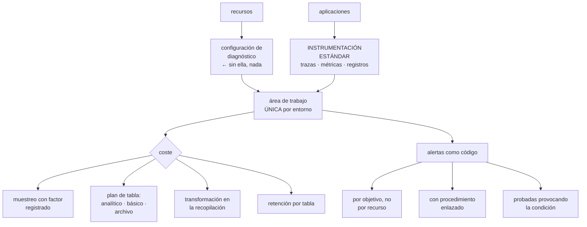

# 225 — Azure Monitor, Application Insights y OpenTelemetry

> [← 224 · Service Bus, Event Grid y Event Hubs](../../part-18-azure-production-architecture/224-service-bus-event-grid-y-event-hubs/README.md) · [Índice de la parte](../README.md) · [226 · Defender for Cloud, Policy y Sentinel →](../../part-18-azure-production-architecture/226-defender-for-cloud-policy-y-sentinel/README.md)

**Parte:** 18 — Azure: arquitectura empresarial y operación en producción<br>
**Nivel:** avanzado · **Horas estimadas:** 4<br>
**Laboratorio:** `observability` · **Estado:** `EXECUTABLE_CORE`

## 🎯 Propósito

Montar la observabilidad de Azure con instrumentación estándar, de forma que no haya que rehacerla al cambiar de nube ni de proveedor de análisis. La clase cubre el destino único de registros y métricas, el muestreo que decide el coste, y los dos asuntos que este programa lleva señalando y que aquí tienen forma propia: **la ingesta sin límite factura más que el cómputo, y la instrumentación específica de un proveedor se convierte en un cambio caro el día que se quiere mover**.

## 📚 Resultados de aprendizaje

Al finalizar podrás:

1. **Enrutar** registros y métricas de todos los recursos a un destino común.
2. **Instrumentar** con el estándar abierto para no quedar atado.
3. **Controlar** el coste con muestreo, niveles y planes de tabla.
4. **Definir** alertas y objetivos junto al servicio, como código.
5. **Correlacionar** desde la alerta hasta la causa sin eslabones rotos.

## 🧩 Conceptos centrales

| Concepto | Comprensión verificable |
|---|---|
| `área de trabajo` | Destino de registros y métricas, con su retención, sus permisos y su facturación. |
| `configuración de diagnóstico` | Ajuste por recurso que decide qué categorías se envían y a dónde. Sin ella, el recurso no registra nada. |
| `muestreo adaptativo` | Reducción automática del volumen enviado, con factor registrado para poder extrapolar. |
| `instrumentación estándar` | Emisión de trazas, métricas y registros con el estándar abierto, independiente del destino. |
| `plan de tabla` | Nivel de una tabla de registros: analítico, básico o de archivo. Cambia precio y capacidad de consulta. |
| `regla de recopilación` | Definición de qué datos se recogen de qué recursos y con qué transformación antes de almacenarlos. |

## 🧠 Modelo mental

La arquitectura Azure nace del tenant y las políticas heredables, y llega al workload mediante identidades administradas y redes privadas.

Aplicado a esta clase, separa siempre cuatro planos: **intención** (qué necesita el usuario),
**configuración** (qué declaramos), **estado observado** (qué existe de verdad) y
**evidencia** (cómo sabemos que cumple). Confundirlos produce diseños que se ven correctos
en un diagrama pero fallan al operar.

## 🗺️ Flujo de razonamiento



## 📖 Desarrollo

### 1. Un destino, y la configuración que casi nadie pone

En Azure, **un recurso no envía nada por defecto**. La configuración de diagnóstico es lo que enruta sus registros y métricas, y si falta, ese recurso es invisible.

```text
LO QUE HAY QUE DECIDIR POR RECURSO
  qué categorías de registro se envían
  si se envían métricas
  y a qué destino: área de trabajo, almacenamiento, flujo

Y LO QUE PASA SI FALTA
  el recurso funciona
  no aparece en ninguna consulta
  y cuando hay un incidente, no hay datos de las horas
  anteriores                                        ley 13
```

Y por eso se resuelve con política, no con disciplina:

```text
política de tipo «desplegar si no existe» que crea la
configuración de diagnóstico en cada recurso nuevo
                                                clase 217
→ y con la estimación de coste hecha ANTES de asignarla
→ y con las categorías elegidas, no todas
```

**El destino**, con la decisión de cuántas áreas de trabajo:

```text
UNA POR ENTORNO, no una por suscripción
  → correlacionar entre servicios exige que estén juntos
  → y las consultas cruzadas entre áreas son más lentas y
    más incómodas

Y LOS PERMISOS SE RESUELVEN APARTE
  quien no debe ver los registros de otro equipo se
  controla con permisos por tabla o por recurso
  → no separando áreas                          clase 218

EXCEPCIONES RAZONABLES
  registros de auditoría y de seguridad, en un área
  aparte, en una suscripción donde el comprometido no
  pueda borrarlos                        clases 141, 226
```

Y los planes de tabla, que son la palanca de coste más directa:

```text
ANALÍTICO   consulta completa, alertas, retención larga
            el más caro por gigabyte
BÁSICO      consulta limitada, sin alertas, retención corta
            mucho más barato
            → para registros voluminosos que solo se miran
              al diagnosticar
ARCHIVO     almacenamiento barato, restauración bajo demanda
            → para lo que hay que conservar por norma

→ poner en básico las tablas de registros voluminosos de
  aplicación suele reducir la factura a la mitad
→ y hay que comprobar antes que no se necesitan alertas
  sobre ellas
```

### 2. Instrumentar con el estándar abierto

Aquí hay una decisión de arquitectura que se toma sin pensarla y se paga años después.

```text
INSTRUMENTACIÓN ESPECÍFICA DEL PROVEEDOR
  la biblioteca del proveedor, con su API
  + integración inmediata y algunas funciones extra
  − el código queda atado: cambiar de destino exige tocar
    todas las aplicaciones                     clase 158

INSTRUMENTACIÓN ESTÁNDAR (OpenTelemetry)
  API y formato comunes; el destino es configuración
  + cambiar de proveedor de análisis es un cambio de
    exportador, no de código
  + la misma instrumentación vale en las tres nubes
  − algunas funciones del proveedor no están cubiertas

→ y esta es la decisión: el código emite en estándar y el
  destino se configura
→ el coste de cambiarla más adelante es alto: toca todas
  las aplicaciones                                ley 14
```

Y lo que hay que emitir, con la disciplina de la clase 211:

```text
TRAZAS con contexto propagado
  incluidas las llamadas asíncronas: el contexto viaja
  DENTRO del mensaje                            clase 224
  → sin eso, la traza se corta en la primera cola

MÉTRICAS
  las cuatro señales y las de negocio
  con dimensiones de baja cardinalidad          clase 211
  → el identificador de pedido va al registro, no a una
    dimensión

REGISTROS estructurados
  con traza, servicio, versión, entorno y duración
  y sin secretos ni datos personales completos
```

Y el detalle que decide la utilidad del conjunto:

```text
EL MISMO IDENTIFICADOR DE TRAZA en las tres señales
  → así se salta de una métrica a las trazas del periodo,
    y de una traza a sus registros
  → si cada capa usa su propio identificador, la cadena se
    rompe                                       clase 211
```

**El muestreo**, que es lo que hace viable el coste:

```text
MUESTREO ADAPTATIVO
  el agente reduce el volumen según la carga y registra el
  FACTOR aplicado
  → los recuentos se pueden extrapolar
  → y por eso hay que usar las funciones que lo tienen en
    cuenta al contar

QUÉ SE MUESTREA Y QUÉ NO
  peticiones correctas         1-5 %
  errores                      100 %, siempre
  peticiones lentas            100 %
  y todo lo de un usuario concreto, activable para
    diagnosticar

EL ERROR HABITUAL
  muestrear y luego contar sin tener en cuenta el factor
  → los paneles muestran cifras que no son
```

### 3. Alertas y objetivos, como código

La disciplina es la de la clase 211, con las piezas de esta nube.

```text
LO QUE SE DECLARA JUNTO AL SERVICIO
  configuración de diagnóstico
  reglas de recopilación
  consultas guardadas de diagnóstico
  panel del servicio
  objetivo de nivel de servicio
  reglas de alerta con su grupo de acción

→ y una función de aptitud: ningún servicio se despliega
  sin ellas                                     clase 190
```

**Los tipos de alerta**, con el uso de cada uno:

```text
POR MÉTRICA        rápida y barata; para señales continuas
POR CONSULTA       flexible; para lo que exige agregar o
                   correlacionar
                   → con coste por ejecución: cuidado con
                     la frecuencia
POR ACTIVIDAD      cambios en recursos, políticas y
                   permisos
                   → «alguien quitó una asignación de
                     política»                  clase 217
POR SALUD DEL
  SERVICIO         incidencias del propio proveedor
                   → y esta la olvida casi todo el mundo
```

Y las que este programa exige siempre:

```text
ALERTA POR AUSENCIA
  «esta función no se ha ejecutado en N minutos»
  → un trabajo programado que deja de dispararse no genera
    error                                          ley 13

ALERTA POR ANTIGÜEDAD
  cola de fallidos, certificados, sincronización
                                    clases 224, 196, 222

Y POR RITMO DE CONSUMO DEL PRESUPUESTO DE ERROR
  → la que despierta, en vez del error suelto  clase 211
```

Y el destino, con la lección repetida:

```text
un grupo de acción por turno de guardia, no uno por
servicio
→ crear un grupo por equipo garantiza que alguno quede sin
  destinatarios                        ley 15, clases 210, 211

y la comprobación
  provocar la condición y ver si llega              ley 22
  → en la clase 211, 7 de 40 no llegaron a la primera
```

Y una nota sobre el coste de las alertas por consulta:

```text
una alerta por consulta que se ejecuta cada minuto sobre
mucho volumen factura
→ frecuencia acorde a lo que se detecta
→ y una alerta que nunca se ha disparado en un año, o
  sobra o su umbral está mal                    clase 190
```

### 4. Consultar, correlacionar y controlar el gasto

**Las consultas preparadas**, que ahorran minutos durante un incidente:

```text
«dame todo lo de esta traza, en las tres señales»
«errores de este servicio en la última hora, por tipo»
«peticiones más lentas y qué dependencia domina»
«qué cambió en los recursos en la última hora»
«compara esta hora con la misma de ayer»

→ guardadas y enlazadas desde el procedimiento de la
  alerta                                        clase 127
```

**La cadena de diagnóstico**, con sus eslabones:

```text
alerta por objetivo
  → panel del servicio
    → trazas del periodo
      → registros de esas trazas
        → registro de actividad: ¿qué se desplegó o cambió?
                                                clase 122

→ y si un eslabón falta, el diagnóstico se hace a ojo
```

**El control del gasto**, que aquí tiene palancas concretas:

```text
1  CATEGORÍAS ELEGIDAS, no todas
   muchas categorías de diagnóstico son voluminosas y
   nadie las consulta

2  TRANSFORMACIÓN EN LA RECOPILACIÓN
   filtrar y recortar antes de almacenar
   → quitar campos que no se usan, descartar líneas de
     nivel bajo
   → es lo que más reduce sin perder capacidad de
     diagnóstico

3  PLAN DE TABLA por volumen y uso

4  RETENCIÓN por tabla, no global
   → los registros de auditoría, largos; los de aplicación,
     cortos                                     clase 141

5  MUESTREO en la aplicación

6  Y COMPROMISO DE CAPACIDAD si el volumen es estable
   → descuento por gigabyte comprometido
```

Y la comprobación honesta:

```text
¿cuánto cuesta la observabilidad frente al cómputo?
→ en la clase 211 costaba el doble
→ y en la 214 era el 11 % de la factura total
→ conviene mirarlo cada trimestre, no una vez  clase 214
```

Y la lista de comprobación de la clase:

```text
☐ hay política que crea la configuración de diagnóstico en
  cada recurso
☐ las categorías están elegidas, no todas
☐ hay un área de trabajo por entorno, no por suscripción
☐ los registros de auditoría van a un área separada e
  inalcanzable desde producción
☐ la instrumentación de las aplicaciones es estándar
☐ el contexto de traza viaja dentro de los mensajes
☐ las dimensiones no tienen cardinalidad alta
☐ el muestreo registra el factor y las consultas lo tienen
  en cuenta
☐ los errores y las peticiones lentas no se muestrean
☐ paneles, objetivos y alertas están en la plantilla del
  servicio
☐ hay alertas por ausencia, por antigüedad y por ritmo de
  consumo
☐ hay alerta de salud del servicio del proveedor
☐ el destino es un grupo de acción con guardia
☐ cada alerta se ha probado provocando la condición
☐ hay transformación en la recopilación y planes de tabla
  por volumen
☐ el coste de observabilidad se revisa cada trimestre
```

Y el cierre que enlaza con la clase siguiente: con la observabilidad en pie, queda la parte que mira lo mismo con otra intención: detectar lo que no debería estar pasando. Postura de seguridad, cumplimiento y detección es la materia de la clase 226.

## 🔬 Ejemplo trabajado

**CloudShop monta la observabilidad de su plataforma en Azure. Lo que sigue son los recursos que no registraban nada, la factura de ingesta que superaba al cómputo, y la decisión de instrumentación que evitó un cambio de meses dos años después.**

**El punto de partida:**

```text
recursos                                        14.200
  con configuración de diagnóstico                 940   6,6 %
  sin ella                                      13.260

áreas de trabajo                                    31
  una por suscripción, creadas al azar
  → correlacionar entre servicios exigía consultas
    cruzadas entre 4 o 5 áreas

instrumentación de aplicaciones
  con la biblioteca específica del proveedor        14
  con estándar abierto                               0

coste mensual de observabilidad              6.900 €
  ingesta                                    4.400 €
  retención                                  1.800 €
  alertas por consulta                         700 €
```

Y lo que reveló el primer incidente serio:

```text
un fallo del cortafuegos del centro dejó sin conectividad
a 9 radios durante 40 minutos

al investigar
  el cortafuegos NO tenía configuración de diagnóstico
  → no había ni un registro de las horas anteriores
  → la causa se dedujo por descarte, en 3 horas

y los 13.260 recursos sin diagnóstico incluían
  el cortafuegos central
  4 de las 6 pasarelas
  todas las cuentas de almacenamiento
  y las 43 redes virtuales
```

**Las correcciones estructurales:**

```text
POLÍTICA que crea la configuración de diagnóstico en cada
recurso nuevo y remedia los existentes         clase 217

  y la estimación previa del coste
    si se enviaban TODAS las categorías        ~9.400 €/mes
    con categorías elegidas                    ~1.900 €/mes

  categorías elegidas
    cortafuegos     reglas aplicadas, DNS, amenazas
                    → no: estadísticas detalladas por flujo
    almacenamiento  operaciones de escritura y borrado
                    → no: cada lectura
    redes           registros de flujo, ya existentes
    bases           auditoría, consultas lentas
                    → no: cada consulta

ÁREAS DE TRABAJO
  31 → 3 (producción, preproducción, desarrollo)
  + 1 de auditoría y seguridad, en la suscripción de
    seguridad, sin acceso desde producción     clase 141
  permisos por tabla para separar lo que cada equipo ve
```

**La instrumentación: la decisión que se registró.**

```text
el equipo iba a seguir con la biblioteca específica
«funciona y es lo que sabemos»

el argumento que cambió la decisión
  la parte 19 iba a montar lo mismo en otra nube
  y el equipo de datos ya usaba otro proveedor de análisis
  para sus cargas
  → tres destinos distintos, y el código atado a uno

decisión
  migrar a instrumentación estándar
  el destino es un exportador configurado, no código
  coste de la migración                14 aplicaciones,
                                       6 semanas

registro de decisión                            clase 190
  premisa   habrá al menos dos destinos de análisis
  qué la reabriría   si el proveedor deja de soportar el
                     estándar, o si su coste sube por
                     encima del propio

y dos años después
  se cambió el proveedor de análisis de las cargas de datos
  cambio necesario en las aplicaciones            ninguno
  se cambió el exportador y el destino
  tiempo                                          2 días
  → sin esta decisión, habrían sido meses de tocar 14
    aplicaciones                                clase 158
```

**El coste, atacado con las cinco palancas:**

```text
ingesta inicial tras aplicar las políticas    1.900 €/mes

1  TRANSFORMACIÓN EN LA RECOPILACIÓN
   los registros de aplicación traían 41 campos; se
   consultaban 9
   se descartan las líneas de nivel de información de 3
   servicios muy habladores
   1.900 € → 1.140 €

2  PLANES DE TABLA
   registros de flujo de red y de contenedores → básico
   → no se necesitaban alertas sobre ellos, comprobado
   1.140 € → 640 €

3  RETENCIÓN POR TABLA
   aplicación         30 días
   flujo de red       14 días
   auditoría          400 días, en archivo tras 90
   retención                       1.800 € → 410 €

4  MUESTREO EN LA APLICACIÓN
   peticiones correctas al 4 %, errores y lentas al 100 %
   → y las consultas ajustadas para tener en cuenta el
     factor
   → aquí hubo un susto: durante dos semanas, el panel de
     pedidos por minuto mostró cifras 25 veces menores
   → porque la consulta contaba filas sin aplicar el
     factor de muestreo

5  ALERTAS POR CONSULTA
   41 alertas por consulta, 12 de ellas cada minuto
   → se bajó la frecuencia de las que detectan cosas
     lentas
   700 € → 210 €

total                              6.900 € → 1.260 €/mes
```

**Las alertas, revisadas:**

```text
antes                                              112
  disparadas al mes                                890
  accionables                                  71 (8 %)
  con destino a grupos de acción por equipo          63
    de ellos, SIN destinatarios                      14

después                                             58
  por objetivo de nivel de servicio                   9
  por ausencia                                       11
    · funciones y trabajos programados
  por antigüedad                                      8
    · colas de fallidos, certificados, sincronización
  por actividad                                       6
    · cambios de política, de permisos, de rutas
  por salud del servicio del proveedor                1
    → esta detectó 2 incidencias del proveedor antes de
      que nadie las notara
  el resto, técnicas                                 23

  destino   un grupo de acción por turno
  disparadas al mes                                  74
  accionables                                  68 (92 %)

y la prueba de extremo a extremo
  58 alertas, condición provocada una a una
  no llegaron                                         6
    3 por umbral mal puesto
    2 por destino equivocado
    1 porque la consulta tenía un error de sintaxis y la
      regla estaba en estado de error desde su creación
                                                    ley 22
```

**La cadena de diagnóstico, comprobada:**

```text
02:41  alerta: el objetivo de confirmación de pedido
       consume presupuesto de error 11× más rápido
02:41  el mensaje enlaza el panel del servicio
02:42  el panel muestra el p99 disparado desde las 02:33
02:42  registro de actividad: cambio en una regla del
       cortafuegos a las 02:31                clase 122
02:43  trazas del periodo: el tramo lento es la llamada al
       servicio de precios
02:44  registros de esas trazas: tiempo de espera agotado
       al conectar
02:46  se revierte el cambio del cortafuegos
02:51  restablecido

tiempo hasta identificar la causa                 3 min
```

**El resultado:**

```text                                        antes     después
recursos con diagnóstico                     6,6 %      99,1 %
áreas de trabajo                                31           4
coste de observabilidad                    6.900 €     1.260 €
alertas configuradas                           112          58
  accionables                              71 (8 %)   68 (92 %)
alertas sin destinatarios                       14           0
instrumentación estándar                     0/14       14/14
tiempo de cambio de proveedor de análisis   meses      2 días
tiempo medio hasta identificar causa      3 h (est.)     3 min
```

**La lección que esta clase deja**: el 93 % de los recursos **no registraba nada**, incluido el cortafuegos central, y eso se descubrió en un incidente en el que no había datos de las horas anteriores. La factura de observabilidad superaba a la de cómputo y se redujo un 82 % sin perder capacidad de diagnóstico, con cinco palancas de configuración. Y la decisión que más valió no dio ningún beneficio el primer año: **instrumentar con el estándar abierto**, que dos años después convirtió un cambio de proveedor de meses en dos días.

## 🧪 Laboratorio guiado

Ejecuta desde la raíz:

```bash
python classes/part-18-azure-production-architecture/225-azure-monitor-application-insights-y-opentelemetry/lab.py
```

El laboratorio selecciona el motor de práctica **`observability`** y produce
`lab_result.json`. El escenario, sus comprobaciones y el artefacto esperado corresponden a
esta clase; no requiere credenciales y deja explícito qué debe revalidarse en un sandbox real.

1. Lee `exercise.steps` y formula una predicción antes de ejecutar.
2. Ejecuta la práctica y verifica todos los elementos de `checks`.
3. Provoca el caso de `negative_test` y explica la señal observada.
4. Materializa `azure-observability` en `evidence/` usando la plantilla indicada.
5. Para proveedor real, sigue `sandbox.requires`, registra costo y ejecuta `destroy`.

### Evidencia esperada

El artefacto principal es telemetría correlacionada con una pregunta operativa. Además, la entrega debe incluir el comando ejecutado,
la salida estructurada y una conclusión que no exceda lo observado.

## 🏆 Reto verificable

Construye **`azure-observability`** para el caso CloudShop. Incluye una alternativa descartada,
un supuesto que pueda falsarse, una prueba de fallo y una decisión de rollback.

## ✅ Criterio de aceptación

- [ ] `lab.py` termina con código 0 y genera JSON válido.
- [ ] La entrega conecta al menos tres requisitos con mecanismos verificables.
- [ ] Existe una prueba positiva y una prueba negativa con evidencia.
- [ ] Seguridad, costo y operación aparecen como decisiones, no como anexos.
- [ ] Se declara una limitación y una condición que obligaría a revisar el diseño.
- [ ] Otra persona puede repetir el recorrido sin conocimiento tácito.

## ⚠️ Errores frecuentes

| Síntoma | Causa probable | Corrección |
|---|---|---|
| Un recurso no aparece en ninguna consulta durante un incidente | No tiene configuración de diagnóstico y por defecto no envía nada | Crea la configuración con una política que la despliegue en todo recurso nuevo, con categorías elegidas y coste estimado antes. |
| Correlacionar entre servicios exige consultas cruzadas entre muchas áreas | Se creó un área de trabajo por suscripción | Una por entorno, con permisos por tabla para separar lo que cada equipo ve, y una aparte para auditoría. |
| Cambiar de proveedor de análisis obligaría a tocar todas las aplicaciones | Se instrumentó con la biblioteca específica del proveedor | Emite con el estándar abierto y deja el destino como configuración; el coste de cambiarlo después es alto. |
| Los paneles muestran cifras muy inferiores a la realidad | Hay muestreo y las consultas cuentan filas sin aplicar el factor | Usa las funciones que tienen en cuenta el factor de muestreo y comprueba los recuentos contra una fuente independiente. |
| La factura de observabilidad supera a la de cómputo | Todas las categorías, sin transformación, en plan analítico y con retención larga | Elige categorías, transforma en la recopilación, usa planes de tabla por volumen y fija retención por tabla. |
| Una alerta nunca ha llegado a nadie | Su grupo de acción no tiene destinatarios o la regla está en estado de error | Un grupo de acción por turno de guardia y prueba de extremo a extremo provocando la condición de cada alerta. |

## 🛡️ Seguridad, ética y costo

Trabaja con cuentas propias o sandboxes autorizados. No publiques secretos, identificadores
reales ni datos personales. Antes de crear recursos pagos define presupuesto, etiquetas y
comando de destrucción; después verifica que no queden recursos huérfanos. Los ejemplos
locales enseñan contratos, pero no certifican cumplimiento ni disponibilidad de producción.

## ❓ Preguntas de comprobación

1. ¿Qué ocurre con un recurso que no tiene configuración de diagnóstico?
2. ¿Por qué conviene un área de trabajo por entorno y no por suscripción?
3. ¿Qué se gana instrumentando con el estándar abierto y cuándo se cobra esa ganancia?
4. ¿Qué error de consulta produce el muestreo si no se tiene en cuenta?
5. ¿Cuáles son las cinco palancas para reducir el coste de ingesta?

## 🔗 Referencias

- Microsoft (2025). *Azure Monitor: diagnostic settings*. <https://learn.microsoft.com/en-us/azure/azure-monitor/essentials/diagnostic-settings>
- Microsoft (2025). *Application Insights with OpenTelemetry*. <https://learn.microsoft.com/en-us/azure/azure-monitor/app/opentelemetry-enable>
- Microsoft (2025). *Log Analytics table plans and data transformations*. <https://learn.microsoft.com/en-us/azure/azure-monitor/logs/data-platform-logs>
- Microsoft (2025). *Sampling in Application Insights*. <https://learn.microsoft.com/en-us/azure/azure-monitor/app/sampling>
- OpenTelemetry (2025). *Specification and semantic conventions*. <https://opentelemetry.io/docs/specs/otel/>
- Documentación oficial vigente del servicio implementado; registra URL y fecha de consulta.

---

> [Evaluación](assessment.md) · [Contrato de clase](lesson.yaml) · [Índice de la parte](../README.md)

| Anterior | Índice | Siguiente |
|---|---|---|
| [← 224 · Service Bus, Event Grid y Event Hubs](../../part-18-azure-production-architecture/224-service-bus-event-grid-y-event-hubs/README.md) | [Parte 18](../README.md) · [Programa](../../README.md) | [226 · Defender for Cloud, Policy y Sentinel →](../../part-18-azure-production-architecture/226-defender-for-cloud-policy-y-sentinel/README.md) |
