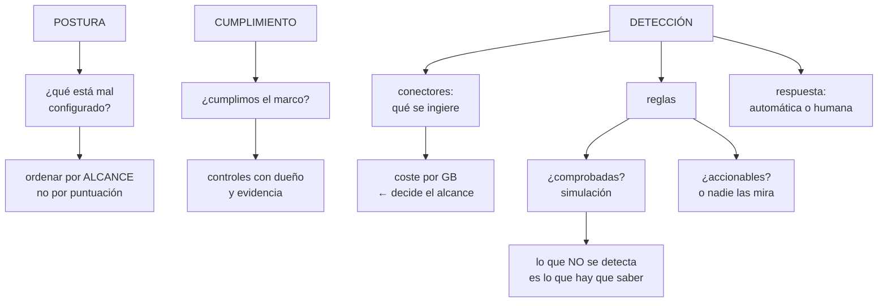

# 226 — Defender for Cloud, Policy y Sentinel

> [← 225 · Azure Monitor, Application Insights y OpenTelemetry](../../part-18-azure-production-architecture/225-azure-monitor-application-insights-y-opentelemetry/README.md) · [Índice de la parte](../README.md) · [227 · Cost Management, Advisor, resiliencia y Chaos Studio →](../../part-18-azure-production-architecture/227-cost-management-advisor-resiliencia-y-chaos-studio/README.md)

**Parte:** 18 — Azure: arquitectura empresarial y operación en producción<br>
**Nivel:** avanzado · **Horas estimadas:** 4<br>
**Laboratorio:** `security` · **Estado:** `EXECUTABLE_CORE`

## 🎯 Propósito

Montar la seguridad operativa de Azure: la evaluación continua de la postura, el cumplimiento medido contra un marco, y la detección con su parte incómoda. La clase separa lo que cada herramienta hace de verdad, ordena las recomendaciones por alcance en vez de por su puntuación, y desarrolla el asunto que decide si un centro de operaciones funciona: **una detección que nadie ha comprobado no detecta, y una que genera mil alertas al día no se mira**.

## 📚 Resultados de aprendizaje

Al finalizar podrás:

1. **Distinguir** postura, cumplimiento y detección, y qué resuelve cada uno.
2. **Priorizar** recomendaciones por alcance real, no por la puntuación.
3. **Medir** el cumplimiento contra un marco sin convertirlo en trámite.
4. **Configurar** detección con reglas propias y comprobarlas.
5. **Controlar** el coste de la ingesta de seguridad.

## 🧩 Conceptos centrales

| Concepto | Comprensión verificable |
|---|---|
| `postura de seguridad` | Evaluación continua de la configuración frente a buenas prácticas. Dice qué está mal configurado. |
| `puntuación de seguridad` | Cifra agregada de la postura. Útil como tendencia, engañosa como prioridad. |
| `cumplimiento normativo` | Medida de la configuración contra un marco concreto, con sus controles. |
| `detección` | Reglas que generan incidentes a partir de señales. Requiere ingesta, reglas y quien las atienda. |
| `simulación de ataque` | Ejecución controlada de una técnica conocida para comprobar si se detecta. |
| `conector de datos` | Origen de señales que se ingiere para detectar. Cada uno tiene su volumen y su coste. |

## 🧠 Modelo mental

La arquitectura Azure nace del tenant y las políticas heredables, y llega al workload mediante identidades administradas y redes privadas.

Aplicado a esta clase, separa siempre cuatro planos: **intención** (qué necesita el usuario),
**configuración** (qué declaramos), **estado observado** (qué existe de verdad) y
**evidencia** (cómo sabemos que cumple). Confundirlos produce diseños que se ven correctos
en un diagrama pero fallan al operar.

## 🗺️ Flujo de razonamiento



## 📖 Desarrollo

### 1. Postura, cumplimiento y detección

Tres cosas distintas que se mezclan y responden preguntas diferentes.

```text
POSTURA
  ¿qué está mal configurado, ahora mismo?
  evaluación continua contra buenas prácticas
  produce   recomendaciones
  ejemplo   «esta base tiene acceso público»

CUMPLIMIENTO
  ¿cumplimos este marco concreto?
  la misma información, agrupada por controles de una norma
  produce   evidencia para auditoría
  ejemplo   «el control A.9.4 está cubierto por estas 12
             políticas»

DETECCIÓN
  ¿está ocurriendo algo ahora?
  reglas sobre señales que generan incidentes
  produce   incidentes que alguien atiende
  ejemplo   «esta identidad ha accedido desde dos países en
             10 minutos»
```

Y la relación entre las tres, que ordena el trabajo:

```text
la POSTURA reduce lo que hay que detectar
  → un almacén sin acceso público no puede ser accedido
    desde internet
  → arreglar configuración es más barato que detectar su
    explotación

el CUMPLIMIENTO no mejora la seguridad por sí mismo
  → mide y da evidencia; no cierra nada
  → y perseguir el porcentaje produce trámite   ley 17

la DETECCIÓN cubre lo que la configuración no puede
  → uso legítimo de credenciales robadas, abuso de
    permisos concedidos, comportamiento anómalo
```

**La puntuación de seguridad**, con su trampa:

```text
es una cifra agregada y ponderada
  + útil como TENDENCIA: si baja, algo se ha degradado
  − engañosa como prioridad: la recomendación que más
    sube la puntuación no es la que más riesgo reduce

  ejemplo típico
    «activar cifrado en 400 discos de desarrollo»
      +6 puntos, riesgo bajo
    «una identidad con Propietario en producción»
      +0,2 puntos, riesgo máximo         clase 218

→ ordena por ALCANCE desde el punto comprometido, no por
  puntos                                        clase 189
```

### 2. Postura: priorizar bien

La herramienta produce cientos de recomendaciones. El trabajo es ordenarlas.

```text
LAS PREGUNTAS QUE ORDENAN
  1  ¿está expuesto a internet?
  2  ¿tiene datos sensibles?
  3  ¿hasta dónde se llega desde ahí?     ← la que decide
  4  ¿existe ya explotación conocida de esa vulnerabilidad?
  5  ¿cuántos recursos afecta?

→ y las herramientas modernas calculan CAMINOS DE ATAQUE:
  «desde esta máquina expuesta se llega, por esta
   identidad, a esta base con datos de clientes»
→ eso vale más que cualquier lista ordenada por puntos
```

Y las categorías de recomendación, con lo que cuesta cada una:

```text
CONFIGURACIÓN (acceso público, cifrado, versión de TLS)
  → se resuelven con política, en masa           clase 217
  → y lo nuevo se impide con denegación

IDENTIDAD (permisos amplios, sin segundo factor)
  → las de más alcance y las más difíciles de arreglar
                                                clase 218

VULNERABILIDADES (software sin parchear)
  → parcheo y actualización de imágenes         clase 254
  → y con exploración continua, no solo al construir
                                                clase 212

DATOS (almacenes sin clasificar, sin cifrado propio)
  → hay que saber dónde están los datos sensibles primero
```

Y el orden de trabajo que funciona:

```text
1  cerrar lo expuesto a internet con datos detrás
2  reducir el alcance de las identidades más amplias
3  impedir por política que lo arreglado vuelva a ocurrir
4  remediar el resto por lotes, con tareas automáticas
5  y aceptar por escrito lo que no compensa arreglar
                                                clase 189
```

Y una advertencia sobre las exenciones:

```text
una recomendación se puede marcar como exenta
→ y sin dueño ni fecha, desaparece del radar para siempre
                                                    ley 25
→ toda exención con motivo, nombre y caducidad, y un panel
  de las que vencen                             clase 217
```

**El cumplimiento**, con la disciplina que lo hace útil:

```text
se elige el marco que aplica de verdad, no todos
cada control tiene DUEÑO y evidencia
lo que la herramienta no puede comprobar se documenta
  aparte
  → una parte importante de cualquier marco es
    organizativa, no técnica

y la medida honesta
  no «cumplimos el 94 %»
  sino «de los 114 controles, 71 automatizados y verdes,
  22 automatizados con excepciones, 21 manuales con
  evidencia, y estos 3 no los cumplimos, con este plan»
```

### 3. Detección: lo que cuesta y lo que hay que comprobar

Un centro de operaciones de seguridad tiene tres partes y las tres tienen que existir.

```text
1  INGESTA        qué señales entran
2  REGLAS         qué se considera sospechoso
3  RESPUESTA      quién actúa, y cómo

→ si falta cualquiera, no hay detección: hay una consola
```

**La ingesta**, que decide el coste y el alcance:

```text
CONECTORES HABITUALES, por valor y por volumen
  registros de identidad y de inicio de sesión
    valor ALTO, volumen medio      ← el primero, siempre
  registro de actividad de la nube
    valor alto, volumen bajo       ← barato y útil
  alertas de la propia herramienta de postura
    valor alto, volumen muy bajo
  registros de dispositivos y puntos finales
    valor alto, volumen alto
  registros de red (flujos, cortafuegos)
    valor medio, volumen MUY alto  ← el que dispara la
                                     factura
  registros de aplicación
    valor variable

→ y la decisión no es «todo»: es qué se ingiere para
  detectar, qué se guarda barato para investigar y qué no
  se guarda                                     clase 225
```

Y el patrón que resuelve el coste:

```text
lo que alimenta REGLAS      → plan analítico
lo que solo se consulta al
  investigar                → plan básico o archivo
lo que hay que conservar
  por norma                 → archivo

→ y las reglas de detección sobre datos en plan básico no
  se pueden hacer: por eso hay que decidir antes
```

**Las reglas**, con las dos preguntas que deciden si valen:

```text
¿ESTÁ COMPROBADA?
  simular la técnica que dice detectar
  → en la clase 179, 2 de 6 técnicas simuladas NO se
    detectaban, y las reglas existían            ley 22
  → y en la clase 189, 3 de 14 pruebas fallaron sobre
    controles documentados como implantados

¿ES ACCIONABLE?
  ¿qué hace quien la recibe?
  → si no hay respuesta posible, la regla genera ruido
  → y el ruido esconde lo real                  clase 125
```

Y la calibración, que es trabajo continuo:

```text
una regla nueva se despliega en modo de observación
se mide cuántas veces se dispararía y sobre qué
se ajustan las exclusiones legítimas
  → el escáner de vulnerabilidades propio
  → la cuenta de la copia de seguridad
  → los rangos de la sede
y solo entonces genera incidentes

→ es el mismo orden de las clases 200, 209 y 217
```

Y la medida de si el centro funciona:

```text
incidentes al día, y proporción que resulta ser algo
tiempo hasta la primera acción
y —la que más dice— PROPORCIÓN DE TÉCNICAS SIMULADAS QUE SE
DETECTAN
  → esa cifra es la única que mide la detección de verdad
```

### 4. Respuesta y coste

**La respuesta**, con la decisión de qué se automatiza:

```text
SE AUTOMATIZA
  enriquecer el incidente: quién es esa identidad, qué
    recursos toca, de dónde viene esa dirección
  aislar un dispositivo comprometido
  revocar sesiones de una identidad
  bloquear una dirección
  → acciones reversibles y de bajo daño si el aviso es
    falso

NO SE AUTOMATIZA
  apagar producción
  borrar recursos
  bloquear cuentas de administración
  → un falso positivo con esas acciones es un incidente
    peor que el que se intentaba evitar

Y EN CUALQUIER CASO
  toda acción automática deja registro y es reversible
  y hay una forma de desactivar la automatización
    rápidamente                                clase 259
```

Y el procedimiento, con lo que este programa exige:

```text
cada regla con procedimiento enlazado          clase 125
probado por alguien que no lo escribió           ley 22
y con el paso de contención al principio, no al final
                                                clase 216
```

**El coste**, que en seguridad se dispara con facilidad:

```text
LAS DOS PARTIDAS
  planes de protección por recurso: por servidor, por
    base, por almacén
  ingesta y retención de las señales

Y LAS DECISIONES
  activar la protección donde hay datos o exposición, no
    en todo
  ingerir para detectar solo lo que alimenta reglas
  el resto, en plan barato para investigar
  y compromiso de capacidad si el volumen es estable

→ y hay que revisarlo cada trimestre, como el resto
                                                clase 214
```

Y una comprobación honesta que conviene hacer:

```text
¿cuántos incidentes reales ha detectado este centro en el
último año?
¿y cuántos se detectaron por otra vía —un usuario, una
factura, un socio—?
→ la segunda cifra dice qué no cubre la detección
→ en la clase 200, la exfiltración de 14 meses la
  encontró un inventario, no una alerta
```

Y la lista de comprobación de la clase:

```text
☐ las recomendaciones se ordenan por alcance, no por
  puntuación
☐ se usan los caminos de ataque para priorizar
☐ lo arreglado se impide por política para que no vuelva
☐ toda exención tiene motivo, dueño y caducidad
☐ el marco de cumplimiento elegido es el que aplica
☐ cada control tiene dueño y evidencia
☐ lo manual está documentado aparte, sin inflar el
  porcentaje
☐ los conectores se eligieron por valor y volumen
☐ lo que alimenta reglas está en plan analítico
☐ las reglas se calibraron en modo observación antes
☐ cada regla tiene procedimiento enlazado
☐ se simulan técnicas periódicamente y se mide qué
  proporción se detecta
☐ las acciones automáticas son reversibles y registradas
☐ hay forma rápida de desactivar la automatización
☐ se mide cuántos incidentes se detectaron por otra vía
☐ el coste de protección e ingesta se revisa cada
  trimestre
```

Y el cierre que enlaza con la clase siguiente: con seguridad, observabilidad y datos en pie, quedan el coste y la resiliencia, que en esta nube tienen herramientas propias y una para provocar fallos de forma controlada. Es la materia de la clase 227.

## 🔬 Ejemplo trabajado

**CloudShop monta la seguridad operativa de Azure. Lo que sigue son las recomendaciones ordenadas por alcance en vez de por puntos, la simulación que reveló que la mitad de las técnicas no se detectaban, y la factura que hubo que recortar.**

**La postura, al empezar:**

```text
recomendaciones abiertas                           1.847
puntuación de seguridad                              47 %

ordenadas por PUNTOS, las cinco primeras
  1  cifrado en discos de máquinas               +7,2 pts
     412 recursos, casi todos de desarrollo
  2  copias de seguridad habilitadas             +6,1 pts
  3  versión de TLS mínima                       +5,4 pts
  4  agente de supervisión instalado             +4,8 pts
  5  cifrado en tránsito en almacenes            +4,1 pts

ordenadas por ALCANCE, las cinco primeras
  1  una máquina expuesta a internet con puerto de
     administración abierto, y desde su identidad se
     alcanza la base de pedidos
  2  3 identidades con Propietario en producción
                                                clase 218
  3  2 cuentas de almacenamiento públicas con datos de
     clientes
  4  una base de datos con acceso público y contraseña de
     administrador antigua
  5  una identidad de canalización que puede asignar
     papeles

→ ninguna de las cinco de alcance estaba entre las 40
  primeras por puntos
```

Y el camino de ataque que la herramienta calculó:

```text
internet
  → máquina de salto con puerto de administración abierto
    → su identidad administrada tiene Colaborador en la
      suscripción
      → alcanza la base de pedidos y el almacén de copias
        → 2,3 M de registros de clientes

pasos                                                 4
recursos comprometibles                          11.400
tiempo estimado de explotación                  minutos

→ ese único camino concentraba más riesgo que las 1.800
  recomendaciones restantes juntas
```

**El orden de trabajo que se siguió:**

```text
semana 1   los 5 caminos de ataque: cerrados
           puerto de administración cerrado; acceso por
           servicio de administración temporal  clase 256
           identidades reducidas de ámbito      clase 218
           almacenes públicos cerrados
semana 2   políticas de denegación para que no vuelvan
                                                clase 217
semanas 3-9 remediación por lotes del resto
           tareas automáticas para lo que se puede
semana 10  exenciones escritas para lo que no compensa
           41 exenciones, todas con motivo, dueño y fecha

puntuación de seguridad          47 % → 81 %
recomendaciones abiertas       1.847 → 214
caminos de ataque con datos al final    5 → 0
```

Y la observación:

```text
la puntuación subió 34 puntos
y los 34 puntos NO son la medida de lo que mejoró
→ lo que mejoró fue cerrar 5 caminos, que valían 0,9 puntos
  entre los cinco                                 ley 17
```

**El cumplimiento, medido con honestidad:**

```text
marco elegido   el que exige el contrato con el mayor
                cliente empresarial; no se activaron los
                otros cuatro que ofrecía la herramienta

resultado presentado a auditoría
  controles del marco                                114
    automatizados y conformes                         71
    automatizados con excepciones documentadas        22
    manuales, con evidencia adjunta                   18
    NO cumplidos                                       3
      · rotación de claves de cifrado propias
      · segregación de funciones en dos procesos
      · registro de acceso físico (fuera de alcance:
        es del proveedor)

  y un plan con fecha para los 3

→ lo que la herramienta mostraba como «94 % conforme»
  ocultaba que 18 controles eran manuales y que 3 no se
  cumplían
```

**La detección: la simulación que dolió.**

```text
se montaron 61 reglas de detección
la mayoría, plantillas del proveedor

la simulación, con 14 técnicas conocidas
  técnica                                    ¿detectada?
  fuerza bruta contra identidad                   sí
  inicio de sesión desde país inhabitual          sí
  creación de identidad con permisos altos        sí
  exfiltración a almacén externo                  NO  ←
  desactivación de registro de auditoría          sí
  acceso a secretos desde identidad inusual       NO  ←
  enumeración de recursos                         NO  ←
  uso de credencial de emergencia                 sí
  movimiento lateral por identidad administrada   NO  ←
  borrado masivo de recursos                      sí
  cambio de política de seguridad                 sí
  consultas de nombres anómalas                   NO  ←
  ejecución en contenedor con privilegios         NO  ←
  persistencia por credencial federada nueva      NO  ←

  detectadas                                    7 de 14
```

Y el análisis de las siete que no:

```text
3  la regla existía y no se disparaba
   · umbral demasiado alto (enumeración: exigía 500
     llamadas en 1 min; el ataque hizo 80 en 10 min)
   · consulta con un error de campo
   · regla en estado deshabilitado desde su creación

3  no había regla
   · movimiento lateral por identidad administrada
   · persistencia por credencial federada nueva
   · ejecución en contenedor con privilegios

1  la señal NO SE INGERÍA
   · consultas de nombres: el conector estaba desactivado
     por coste                                clase 200
```

Y las correcciones:

```text
umbrales ajustados con datos reales
reglas escritas para las 3 técnicas sin cobertura
conector de nombres activado, con plan básico para el
  volumen y regla sobre un resumen agregado
  → coste 340 €/mes en vez de 2.100 €
y simulación trimestral, con la cifra publicada

segunda simulación, 3 meses después     13 de 14
  la que falta: exfiltración a almacén externo por un canal
  que se decidió no cubrir; aceptada por escrito, con la
  mitigación de que el perímetro de datos lo impide
                                                clase 200
```

**El ruido, calibrado:**

```text
al activar las 61 reglas de golpe
  incidentes el primer día                          890
  reales                                              2

calibración
  modo observación durante 3 semanas
  exclusiones legítimas
    · el escáner de vulnerabilidades propio
    · la cuenta de copias, que accede a todo por diseño
    · los rangos de las 11 oficinas
    · una integración de un socio
  reglas retiradas por no accionables                14

incidentes al día                             890 → 6
  que resultan ser algo                             1,4
  tiempo hasta la primera acción              8 min
```

**El coste, recortado:**

```text                                        antes     después
planes de protección por recurso           4.100 €     1.900 €
  → activados en todo; se dejaron donde hay datos o
    exposición
ingesta de señales de seguridad            5.800 €     1.240 €
  → registros de red: de analítico a básico, con
    resúmenes agregados para las reglas
  → identidad y actividad: analítico, sin cambios
retención                                  1.100 €       380 €
───────────────────────────────────────────────────────────
total                                     11.000 €     3.520 €
```

**La comprobación honesta, al año:**

```text
incidentes reales detectados por el centro             9
incidentes detectados por OTRA vía                     4
  · una factura anómala (una prueba de carga olvidada)
  · un socio que avisó de un correo sospechoso
  · un inventario de destinos de salida       clase 200
  · un usuario que reportó un comportamiento raro

→ 4 de 13: casi un tercio no lo vio la detección
→ y las cuatro vías son las de siempre: coste, terceros,
  inventarios y personas
```

**La lección que esta clase deja**: ordenar por puntuación habría hecho al equipo cifrar cuatrocientos doce discos de desarrollo mientras **un camino de cuatro pasos llevaba de internet a dos millones trescientos mil registros de clientes**. Y la simulación reveló que **siete de catorce técnicas no se detectaban**, aunque las reglas existían: tres tenían umbrales o errores, tres no existían y una dependía de una señal que se había desactivado por coste.

## 🧪 Laboratorio guiado

Ejecuta desde la raíz:

```bash
python classes/part-18-azure-production-architecture/226-defender-for-cloud-policy-y-sentinel/lab.py
```

El laboratorio selecciona el motor de práctica **`security`** y produce
`lab_result.json`. El escenario, sus comprobaciones y el artefacto esperado corresponden a
esta clase; no requiere credenciales y deja explícito qué debe revalidarse en un sandbox real.

1. Lee `exercise.steps` y formula una predicción antes de ejecutar.
2. Ejecuta la práctica y verifica todos los elementos de `checks`.
3. Provoca el caso de `negative_test` y explica la señal observada.
4. Materializa `azure-security-operations` en `evidence/` usando la plantilla indicada.
5. Para proveedor real, sigue `sandbox.requires`, registra costo y ejecuta `destroy`.

### Evidencia esperada

El artefacto principal es un control con amenaza, mitigación y evidencia. Además, la entrega debe incluir el comando ejecutado,
la salida estructurada y una conclusión que no exceda lo observado.

## 🏆 Reto verificable

Construye **`azure-security-operations`** para el caso CloudShop. Incluye una alternativa descartada,
un supuesto que pueda falsarse, una prueba de fallo y una decisión de rollback.

## ✅ Criterio de aceptación

- [ ] `lab.py` termina con código 0 y genera JSON válido.
- [ ] La entrega conecta al menos tres requisitos con mecanismos verificables.
- [ ] Existe una prueba positiva y una prueba negativa con evidencia.
- [ ] Seguridad, costo y operación aparecen como decisiones, no como anexos.
- [ ] Se declara una limitación y una condición que obligaría a revisar el diseño.
- [ ] Otra persona puede repetir el recorrido sin conocimiento tácito.

## ⚠️ Errores frecuentes

| Síntoma | Causa probable | Corrección |
|---|---|---|
| El equipo trabaja mucho en seguridad y el riesgo real no baja | Las recomendaciones se priorizan por la puntuación agregada | Ordena por alcance desde el punto comprometido y usa los caminos de ataque calculados. |
| Una recomendación resuelta reaparece meses después | Se corrigió el recurso pero nada impide crearlo mal otra vez | Tras remediar, impide por política que vuelva a ocurrir. |
| El informe dice que se cumple el 94 % y la auditoría encuentra huecos | El porcentaje incluye controles manuales sin evidencia y oculta los no cumplidos | Presenta el desglose por tipo de control, con dueño y evidencia, y un plan con fecha para los no cumplidos. |
| Las reglas de detección existen y el ataque no se detecta | Umbrales mal puestos, consultas con errores o reglas deshabilitadas | Simula técnicas conocidas periódicamente y publica qué proporción se detecta; es la única medida real. |
| El centro genera cientos de incidentes al día y nadie los mira | Las reglas se activaron sin calibrar ni excluir lo legítimo | Despliega en modo observación, excluye lo conocido, retira lo no accionable y mide la proporción que resulta ser algo. |
| La factura de seguridad es enorme | Protección activada en todos los recursos e ingesta de señales voluminosas en plan analítico | Protege donde hay datos o exposición, ingiere en plan analítico solo lo que alimenta reglas y usa resúmenes agregados para lo voluminoso. |

## 🛡️ Seguridad, ética y costo

Trabaja con cuentas propias o sandboxes autorizados. No publiques secretos, identificadores
reales ni datos personales. Antes de crear recursos pagos define presupuesto, etiquetas y
comando de destrucción; después verifica que no queden recursos huérfanos. Los ejemplos
locales enseñan contratos, pero no certifican cumplimiento ni disponibilidad de producción.

## ❓ Preguntas de comprobación

1. ¿Qué pregunta responde cada una de las tres herramientas y cómo se relacionan?
2. ¿Por qué la puntuación de seguridad es mala guía de prioridad?
3. ¿Qué debe acompañar a cada control de cumplimiento para que la medida sea honesta?
4. ¿Qué mide de verdad si una detección funciona?
5. ¿Qué acciones de respuesta conviene automatizar y cuáles no?

## 🔗 Referencias

- Microsoft (2025). *Microsoft Defender for Cloud: secure score and attack paths*. <https://learn.microsoft.com/en-us/azure/defender-for-cloud/secure-score-security-controls>
- Microsoft (2025). *Regulatory compliance in Defender for Cloud*. <https://learn.microsoft.com/en-us/azure/defender-for-cloud/regulatory-compliance-dashboard>
- Microsoft (2025). *Microsoft Sentinel: data connectors and analytics rules*. <https://learn.microsoft.com/en-us/azure/sentinel/overview>
- MITRE (2025). *ATT&CK for cloud*. <https://attack.mitre.org/matrices/enterprise/cloud/>
- Microsoft (2025). *Sentinel cost optimization and data tiers*. <https://learn.microsoft.com/en-us/azure/sentinel/billing>
- Documentación oficial vigente del servicio implementado; registra URL y fecha de consulta.

---

> [Evaluación](assessment.md) · [Contrato de clase](lesson.yaml) · [Índice de la parte](../README.md)

**📥 Descargar:** [Parte 18 en PDF](../../../site/downloads/partes/manual-parte-18-azure-production-architecture.pdf) · [Recorrido de Azure en PDF](../../../site/downloads/nubes/manual-azure.pdf) · [Manual integral](../../../site/downloads/multi-cloud-engineering-manual-v2.0.pdf)

| Anterior | Índice | Siguiente |
|---|---|---|
| [← 225 · Azure Monitor, Application Insights y OpenTelemetry](../../part-18-azure-production-architecture/225-azure-monitor-application-insights-y-opentelemetry/README.md) | [Parte 18](../README.md) · [Programa](../../README.md) | [227 · Cost Management, Advisor, resiliencia y Chaos Studio →](../../part-18-azure-production-architecture/227-cost-management-advisor-resiliencia-y-chaos-studio/README.md) |
