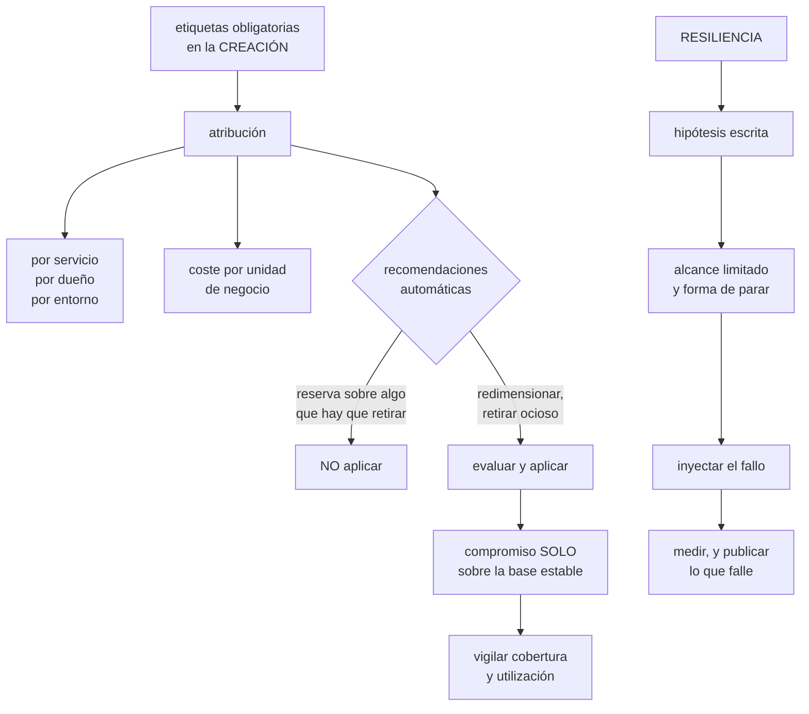

# 227 — Cost Management, Advisor, resiliencia y Chaos Studio

> [← 226 · Defender for Cloud, Policy y Sentinel](../../part-18-azure-production-architecture/226-defender-for-cloud-policy-y-sentinel/README.md) · [Índice de la parte](../README.md) · [228 · Proyecto: CloudShop productivo en Azure →](../../part-18-azure-production-architecture/228-proyecto-cloudshop-productivo-en-azure/README.md)

**Parte:** 18 — Azure: arquitectura empresarial y operación en producción<br>
**Nivel:** avanzado · **Horas estimadas:** 4<br>
**Laboratorio:** `finops` · **Estado:** `EXECUTABLE_CORE`

## 🎯 Propósito

Cerrar la operación de Azure con las dos cosas que se dejan para el final y deciden si el sistema es sostenible: el control del coste y la comprobación de la resiliencia. La clase aplica el método de la clase 214 con las herramientas de esta nube, evalúa las recomendaciones automáticas con escepticismo —**el asesor propone reservas sobre cargas que había que retirar**—, y usa la inyección controlada de fallos para comprobar lo que la clase 215 exige comprobar.

## 📚 Resultados de aprendizaje

Al finalizar podrás:

1. **Atribuir** el coste con etiquetas impuestas en la creación.
2. **Evaluar** las recomendaciones automáticas antes de aplicarlas.
3. **Comprometer** capacidad solo sobre la base estable y vigilar su uso.
4. **Inyectar** fallos de forma controlada para comprobar la resiliencia.
5. **Cerrar** el ciclo: cada hallazgo, una acción con dueño y fecha.

## 🧩 Conceptos centrales

| Concepto | Comprensión verificable |
|---|---|
| `ámbito de facturación` | Nivel al que se agrega el gasto: cuenta de facturación, perfil, sección y suscripción. |
| `etiqueta heredada` | Etiqueta que se propaga del grupo de recursos al recurso. No todos los servicios la respetan. |
| `reserva de capacidad` | Compromiso de uso a uno o tres años a cambio de descuento. Se aplica a la base estable. |
| `plan de ahorro` | Compromiso de gasto por hora, más flexible que la reserva y con menos descuento. |
| `experimento de caos` | Inyección controlada de un fallo, con hipótesis, alcance limitado y forma de parar. |
| `recomendación automática` | Sugerencia de la plataforma sobre coste, fiabilidad o rendimiento. Se evalúa, no se aplica. |

## 🧠 Modelo mental

La arquitectura Azure nace del tenant y las políticas heredables, y llega al workload mediante identidades administradas y redes privadas.

Aplicado a esta clase, separa siempre cuatro planos: **intención** (qué necesita el usuario),
**configuración** (qué declaramos), **estado observado** (qué existe de verdad) y
**evidencia** (cómo sabemos que cumple). Confundirlos produce diseños que se ven correctos
en un diagrama pero fallan al operar.

## 🗺️ Flujo de razonamiento



## 📖 Desarrollo

### 1. Atribuir el coste en esta nube

El método es el de la clase 214 y aquí hay particularidades que hay que conocer.

```text
LA JERARQUÍA DE FACTURACIÓN
  cuenta de facturación → perfil → sección → suscripción
  → el gasto se agrega por ahí, y por eso la separación
    por suscripción de la clase 217 es también una
    decisión de facturación

LAS ETIQUETAS
  obligatorias en la creación, con valores cerrados, por
  política                                     clase 217
  → y la herencia del grupo de recursos NO la respetan
    todos los servicios
  → hay que comprobar cuáles, y para esos, etiquetar el
    recurso directamente
```

Y el gasto que no se puede etiquetar, que aquí es apreciable:

```text
transferencia entre zonas y regiones
servicios compartidos: centro de red, cortafuegos,
  resolutor, área de observabilidad
y los recursos gestionados por la plataforma

→ se reparten por regla escrita y acordada
→ y hay que decir cuánto se reparte y con qué criterio
                                                clase 214
```

**Las cinco vistas** de la clase 214, con lo que suele aparecer en Azure:

```text
POR SERVICIO      el 80 % en 3 o 4 líneas
POR DUEÑO         y cuánto no lo tiene
POR ENTORNO       preproducción por encima del 25 % de
                  producción es señal
POR TIPO DE USO   dentro de cada servicio grande
POR UNIDAD DE
  NEGOCIO         la única cifra comparable

y las partidas que sorprenden en esta nube
  unidades de petición de la base distribuida  clase 223
  ingesta de observabilidad y de seguridad clases 225, 226
  puntos privados e inspección del cortafuegos clase 219
  transferencia entre zonas
  y los planes de servicio con instancias encendidas y sin
    tráfico                                    clase 221
```

Y los presupuestos con acción, igual que antes:

```text
por suscripción y por servicio, sobre previsión
en entornos no productivos, con acción real
en producción, solo aviso
y detección de anomalías por servicio y por dueño
                                                clase 214
```

### 2. Las recomendaciones automáticas, con escepticismo

La plataforma propone mejoras de coste, fiabilidad, rendimiento y seguridad. Son útiles y **no se aplican sin evaluar**.

```text
LAS DE COSTE, y su trampa
  «compra una reserva para estas máquinas»
  → calcula el ahorro suponiendo que ESAS máquinas seguirán
    existiendo tres años
  → y no sabe que estaban en la lista de retirada
  → comprometerse con lo que hay que apagar es la peor
    compra posible                                ley 25

  «redimensiona esta máquina infrautilizada»
  → mira el uso medio, no el pico ni la estacionalidad
  → hay que comprobar el percentil alto antes  clase 212

  «retira este recurso ocioso»
  → suele ser correcta, y aun así: apagar antes de borrar
                                                clase 214
```

Y el orden correcto, que evita comprar lo que hay que tirar:

```text
1  RETIRAR lo que no se usa
2  REDIMENSIONAR lo sobredimensionado
3  APAGAR por horario lo no productivo
4  Y SOLO ENTONCES comprometer capacidad

→ comprometer primero congela el desperdicio durante años
```

**Los compromisos**, con la decisión entre los dos tipos:

```text
RESERVA DE CAPACIDAD
  se compromete un tipo y tamaño concreto
  + descuento mayor
  − rígida: si se cambia de familia, el descuento se pierde
    o hay que intercambiarla

PLAN DE AHORRO
  se compromete un gasto por hora
  + flexible: se aplica a lo que haya
  − descuento menor

CRITERIO
  infraestructura estable y previsible   → reserva
  cargas que van a cambiar de forma      → plan de ahorro
  y en ambos casos, SOLO sobre la base estable medida con
  meses de histórico                            clase 143
```

Y lo que hay que vigilar después:

```text
COBERTURA     qué proporción del uso está cubierta
UTILIZACIÓN   qué proporción de lo comprometido se usa
  → por debajo del 95 %, es dinero tirado
  → y baja sola cuando se apaga algo o se cambia de
    familia

→ alerta si la utilización cae por debajo del umbral
→ y revisión antes de cada renovación
```

Y las recomendaciones de fiabilidad, que merecen más atención que las de coste:

```text
«esta base no tiene redundancia de zona»
«este recurso no tiene copias de seguridad»
«esta configuración no sobrevive a la pérdida de una zona»

→ estas se leen con la aritmética de la clase 185: ¿cambian
  el techo de disponibilidad del flujo crítico?
→ y si sí, se aplican; si no, se aceptan por escrito
```

### 3. Inyectar fallos de forma controlada

La clase 215 exige comprobar la resiliencia. La inyección controlada de fallos es la forma de hacerlo sin esperar a un incidente.

```text
QUÉ PERMITE INYECTAR
  apagar o reiniciar máquinas y nodos
  presión de CPU, memoria o disco
  latencia y pérdida en la red
  bloqueo del acceso a un servicio dependiente
  conmutación forzada de una base
  caída de una zona completa
  y fallos de una dependencia de la plataforma
```

Y la disciplina, que es la de la clase 215:

```text
HIPÓTESIS ESCRITA, antes
  «al perder una zona, el flujo de compra seguirá
   funcionando con latencia menor de 600 ms y sin errores;
   la búsqueda quedará degradada»
  → lo valioso es dónde falla la hipótesis

ALCANCE LIMITADO
  un porcentaje de instancias, una zona, un servicio
  → y el experimento debe poder pararse en segundos

VENTANA Y OBSERVACIÓN
  con negocio avisado y con alguien tomando notas
  → y con tráfico real, no de madrugada la primera vez

ESCALA
  1  en papel: recorrer el procedimiento
  2  en preproducción
  3  en producción con alcance pequeño
  4  en producción completo
```

**Los experimentos que más encuentran**, por orden:

```text
1  PÉRDIDA DE UNA ZONA
   → comprueba que las réplicas están repartidas de verdad
   → y que la capacidad restante aguanta   clases 185, 212

2  DEPENDENCIA QUE RESPONDE LENTO, no que cae
   → el fallo gris; la mayoría de los diseños no lo
     resisten                                   clase 185
   → y es donde se descubre que una dependencia declarada
     blanda es dura                             clase 201

3  CONMUTACIÓN DE BASE DE DATOS
   → cronometra y mide la pérdida real       clase 223

4  PRESIÓN DE RECURSOS
   → descubre límites de memoria mal puestos  clase 213

5  PÉRDIDA DE UN SERVICIO DE PLATAFORMA
   → el almacén de secretos, el resolutor, el registro de
     imágenes
   → y estos son los que nadie prueba y los que paran todo
                                                clase 215
```

Y la disciplina posterior, que es lo que hace útil el ejercicio:

```text
cada hallazgo → una acción con dueño y fecha
el procedimiento se corrige EN EL MOMENTO
y el experimento se repite hasta que pase entero

→ un experimento que encuentra problemas y no se repite ha
  servido para la mitad                        clase 215
```

Y una advertencia sobre el permiso y el alcance:

```text
la herramienta necesita permisos para romper cosas
→ y esos permisos son peligrosos si quedan permanentes
→ elevación temporal para ejecutar experimentos
                                                clase 218
→ y el alcance del experimento, restringido por etiqueta o
  por grupo de recursos
```

### 4. Cerrar el ciclo

Coste y resiliencia comparten una propiedad: **son las dos cosas que se degradan solas si nadie las mira**.

```text
EL COSTE SE DEGRADA PORQUE
  se crean recursos y no se retiran               ley 25
  se sobredimensiona por si acaso
  se acumulan entornos y copias
  y nadie tiene el gasto entre sus señales

LA RESILIENCIA SE DEGRADA PORQUE
  el sistema crece y las comprobaciones no      clase 216
  se añaden dependencias sin recalcular el techo clase 185
  y los procedimientos envejecen                  ley 22
```

Y el ritmo que este programa propone:

```text
SEMANAL
  revisión de anomalías de coste abiertas
  recursos ociosos detectados y retirados

MENSUAL
  coste por unidad de negocio y su tendencia
  cobertura y utilización de compromisos
  cumplimiento de las iniciativas             clase 217

TRIMESTRAL
  un experimento de resiliencia, ejecutado
  simulación de técnicas de ataque            clase 226
  prueba del acceso de emergencia             clase 218
  revisión de accesos
  y revisión de exenciones vencidas

ANUAL
  ejercicio de pérdida de región completo     clase 215
  y revisión de las decisiones registradas    clase 190
```

Y las señales que dicen si el sistema está sano:

```text
COSTE
  proporción de gasto atribuido           > 90 %
  coste por unidad de negocio             tendencia
  utilización de compromisos              > 95 %
  recursos ociosos vivos                  tendencia a cero

RESILIENCIA
  proporción de pruebas negativas que pasan
  plazo de recuperación MEDIDO, no declarado
  proporción de técnicas simuladas detectadas clase 226
  y experimentos ejecutados frente a planificados
```

Y la lista de comprobación de la clase:

```text
☐ las etiquetas obligatorias se imponen en la creación
☐ se comprobó qué servicios no heredan etiquetas
☐ el coste no etiquetable se reparte por regla escrita
☐ hay presupuestos con acción en entornos no productivos
☐ hay detección de anomalías por servicio y por dueño
☐ se retiró y redimensionó ANTES de comprometer capacidad
☐ los compromisos cubren solo la base estable medida
☐ se vigilan cobertura y utilización, con alerta
☐ las recomendaciones automáticas se evalúan, no se aplican
☐ las de fiabilidad se leen con la aritmética del techo
☐ hay experimentos de caos con hipótesis y forma de parar
☐ el alcance de los experimentos está restringido
☐ los permisos para inyectar fallos son temporales
☐ cada hallazgo tiene dueño y fecha, y el experimento se
  repite
☐ existe un calendario semanal, mensual, trimestral y anual
```

Y el cierre que enlaza con la clase siguiente: con todo lo de esta parte montado, queda ponerlo junto en un sistema productivo y comprobarlo. Es la materia de la clase 228, que además cierra la parte 18.

## 🔬 Ejemplo trabajado

**CloudShop cierra la operación de su plataforma en Azure. Lo que sigue es la reserva que casi se compra sobre máquinas que había que retirar, y el experimento de pérdida de zona que encontró seis problemas, ninguno de infraestructura.**

**El coste, al revisar:**

```text
total mensual                               31.400 €

por servicio
  base distribuida                           5.740   18 %
  cómputo (planes y contenedores)            4.900   16 %
  observabilidad y seguridad                 4.780   15 %
  transferencia y red                        4.210   13 %
  bases relacionales                         3.100   10 %
  almacenamiento                             2.840    9 %
  resto                                      5.830   19 %

por dueño
  atribuido                                 19.100   61 %
  sin atribuir                              12.300   39 %
```

Y el detalle de lo no atribuido:

```text
transferencia y servicios compartidos          6.100
recursos sin etiqueta                          3.240
  → de ellos, 1.870 € en servicios que NO HEREDAN las
    etiquetas del grupo de recursos
  → el equipo creía que las heredaban todos
recursos ociosos                               2.960
```

Y el hallazgo de la herencia:

```text
se comprobó servicio por servicio cuáles heredan
  heredan                                        61 %
  NO heredan                                     39 %
    · cuentas de almacenamiento en algunas operaciones
    · discos creados por conjuntos de escalado
    · direcciones públicas creadas automáticamente
    · instantáneas y copias

corrección
  política de tipo MODIFICAR que añade las etiquetas al
  crear, en vez de confiar en la herencia      clase 217
  → 3.240 € pasaron a estar atribuidos en 3 semanas
```

**La reserva que no se compró.**

```text
la recomendación automática decía
  «reserva a 3 años para 22 máquinas de la familia D»
  ahorro estimado                        4.100 €/mes
  coste del compromiso                  38 % del total

lo que el equipo comprobó antes de comprar
  ¿qué son esas 22 máquinas?
    14  nodos del clúster antiguo, en la lista de retirada
        del trimestre siguiente
     5  máquinas del sistema heredado de facturación, con
        migración planificada a 18 meses          clase 223
     3  máquinas de un proyecto terminado en 2024, que
        nadie había apagado                        ley 25

→ 17 de 22 no existirían en un año
→ comprar la reserva habría congelado el desperdicio
  durante tres

lo que se hizo, en el orden correcto
  1  RETIRAR      las 3 del proyecto terminado
                  y 6 más detectadas al inventariar
                                       -1.240 €/mes
  2  REDIMENSIONAR  11 máquinas con uso p95 muy por debajo
                    de su tamaño        -680 €/mes
  3  APAGAR POR HORARIO  no producción
                                       -2.100 €/mes
  4  Y ENTONCES comprometer
     plan de ahorro (no reserva) sobre la base estable
     medida con 4 meses de histórico
     motivo del plan y no la reserva: el clúster antiguo se
     retira y la familia cambiará       clase 143
                                       -1.900 €/mes

ahorro total                           -5.920 €/mes
frente a los 4.100 € de la recomendación, y sin
comprometerse con lo que había que tirar
```

**El experimento de pérdida de zona.**

```text
HIPÓTESIS, escrita
  1  el flujo de compra seguirá funcionando
  2  la latencia p99 subirá por debajo de 600 ms
  3  no habrá errores para el usuario
  4  la búsqueda quedará degradada, no caída
  5  la recuperación al restaurar la zona será automática

ALCANCE   la zona 3 de las 3, en producción, con el 30 %
          del tráfico de un día normal
PARADA    detener el experimento restaura en < 60 s
OBSERVACIÓN  5 personas, 1 tomando notas

EJECUCIÓN, martes 15:00
```

Y lo que ocurrió:

```text
15:00:00  se corta la zona 3

15:00:12  el balanceador retira los destinos de esa zona
          ✓ predicción 1: el flujo sigue

15:00:40  latencia p99                       410 ms
          ✓ predicción 2

15:01:10  aparecen errores 503 en el 3 % de las peticiones
          ✗ predicción 3
          causa   el plan de servicio tenía 6 instancias,
                  2 por zona; al perder 2, las 4 restantes
                  quedaron al 91 % de su codo  clase 186
                  y el escalado tardó 4 minutos
          → faltaba margen para perder una zona de tres
                                                clase 212

15:02:30  la BÚSQUEDA cayó por completo
          ✗ predicción 4
          causa   sus 3 réplicas estaban las tres en la
                  zona 3
                  el reparto entre zonas no estaba
                  configurado                   clase 213
          → y nadie lo sabía porque nunca se había perdido
            una zona

15:04:00  la base distribuida siguió sirviendo
          ✓  (redundancia de zona activada)

15:04:20  el almacén de SECRETOS dejó de responder para 2
          servicios
          ✗ no estaba en la hipótesis
          causa   esos 2 servicios cacheaban el secreto al
                  arrancar; las instancias nuevas no
                  pudieron obtenerlo porque el punto
                  privado del almacén estaba en la zona 3
                                                clase 219

15:09:00  el equipo decide parar
15:09:40  zona restaurada

15:10-15:24  la recuperación NO fue automática
          ✗ predicción 5
          2 servicios quedaron con instancias marcadas como
          no sanas y hubo que reiniciarlas a mano
```

**Los seis hallazgos:**

```text
#  hallazgo                            tipo        acción
1  sin margen para perder una zona     capacidad   6 → 9
                                                   instancias
2  las 3 réplicas del buscador en la
   misma zona                          reparto     restricción
                                                   de reparto
3  punto privado del almacén de
   secretos en una sola zona           red         3 puntos,
                                                   uno por zona
4  2 servicios cachean el secreto y
   no lo renuevan                      código      renovación
                                                   periódica
5  recuperación no automática          proceso     comprobación
                                                   de salud
                                                   corregida
6  nadie sabía qué hacer al ver los
   503: no había procedimiento         proceso     escrito y
                                                   probado

de infraestructura                                       0
de configuración, reparto, código y proceso              6
```

Y la segunda ejecución, dos meses después:

```text
latencia p99 máxima                          380 ms   ✓
errores para el usuario                            0   ✓
búsqueda                                   degradada   ✓
almacén de secretos                        disponible  ✓
recuperación                                automática ✓
duración total del impacto                      0 min
```

**El calendario que quedó:**

```text
semanal      anomalías de coste; ociosos retirados
mensual      coste por pedido; cobertura y utilización;
             cumplimiento de iniciativas
trimestral   1 experimento de resiliencia
             simulación de técnicas de ataque   clase 226
             prueba de acceso de emergencia     clase 218
             revisión de accesos y de exenciones
anual        ejercicio de pérdida de región     clase 215
             revisión de decisiones registradas clase 190
```

**El resultado, seis meses después:**

```text                                        antes     después
coste mensual                            31.400 €    23.100 €
coste atribuido                             61 %        94 %
coste por pedido                          0,071 €     0,049 €
utilización del compromiso                   —          98 %
recursos ociosos                         2.960 €          0 €
réplicas repartidas entre zonas         parcial       total
experimentos ejecutados                      0           3
hallazgos con dueño y fecha                  —          14
  cerrados                                   —          13
```

**La lección que esta clase deja**: la recomendación automática proponía comprometerse tres años con **veintidós máquinas de las que diecisiete no iban a existir en uno**, y hacer las cosas en el orden correcto —retirar, redimensionar, apagar, y solo entonces comprometer— dio un ahorro mayor sin atarse a nada. Y el experimento de pérdida de zona encontró seis problemas, **ninguno de infraestructura**: los tres más graves fueron réplicas mal repartidas, un punto privado en una sola zona y dos servicios que cacheaban un secreto y no lo renovaban.

## 🧪 Laboratorio guiado

Ejecuta desde la raíz:

```bash
python classes/part-18-azure-production-architecture/227-cost-management-advisor-resiliencia-y-chaos-studio/lab.py
```

El laboratorio selecciona el motor de práctica **`finops`** y produce
`lab_result.json`. El escenario, sus comprobaciones y el artefacto esperado corresponden a
esta clase; no requiere credenciales y deja explícito qué debe revalidarse en un sandbox real.

1. Lee `exercise.steps` y formula una predicción antes de ejecutar.
2. Ejecuta la práctica y verifica todos los elementos de `checks`.
3. Provoca el caso de `negative_test` y explica la señal observada.
4. Materializa `azure-optimization` en `evidence/` usando la plantilla indicada.
5. Para proveedor real, sigue `sandbox.requires`, registra costo y ejecuta `destroy`.

### Evidencia esperada

El artefacto principal es un cálculo trazable con unidad, supuesto y sensibilidad. Además, la entrega debe incluir el comando ejecutado,
la salida estructurada y una conclusión que no exceda lo observado.

## 🏆 Reto verificable

Construye **`azure-optimization`** para el caso CloudShop. Incluye una alternativa descartada,
un supuesto que pueda falsarse, una prueba de fallo y una decisión de rollback.

## ✅ Criterio de aceptación

- [ ] `lab.py` termina con código 0 y genera JSON válido.
- [ ] La entrega conecta al menos tres requisitos con mecanismos verificables.
- [ ] Existe una prueba positiva y una prueba negativa con evidencia.
- [ ] Seguridad, costo y operación aparecen como decisiones, no como anexos.
- [ ] Se declara una limitación y una condición que obligaría a revisar el diseño.
- [ ] Otra persona puede repetir el recorrido sin conocimiento tácito.

## ⚠️ Errores frecuentes

| Síntoma | Causa probable | Corrección |
|---|---|---|
| Parte del gasto sigue sin atribuir pese a tener etiquetas obligatorias | Se confía en la herencia del grupo de recursos y hay servicios que no la respetan | Comprueba qué servicios heredan y usa una política de tipo modificar que etiquete al crear. |
| Se compra un compromiso y la utilización cae a los pocos meses | Se comprometió capacidad sobre cargas que iban a retirarse o a cambiar de forma | Retira, redimensiona y apaga primero; compromete solo la base estable medida y usa plan de ahorro si la forma va a cambiar. |
| Aplicar una recomendación de redimensionado degrada el servicio | La recomendación usa el uso medio y no el pico ni la estacionalidad | Comprueba el percentil alto y el comportamiento en campaña antes de aplicar. |
| Al perder una zona el servicio se degrada más de lo previsto | No hay margen de capacidad para perder una zona de tres | Dimensiona para que la capacidad restante quede por debajo del codo, y comprueba con un experimento. |
| Todas las réplicas de un servicio están en la misma zona | No hay restricción de reparto y el planificador las agrupó | Declara restricciones de reparto por zona y compruébalo inyectando la pérdida de una. |
| Un experimento de caos se convierte en un incidente | Alcance amplio, sin hipótesis ni forma de parar, y permisos permanentes para romper cosas | Hipótesis escrita, alcance restringido por etiqueta, parada en segundos y permisos por elevación temporal. |

## 🛡️ Seguridad, ética y costo

Trabaja con cuentas propias o sandboxes autorizados. No publiques secretos, identificadores
reales ni datos personales. Antes de crear recursos pagos define presupuesto, etiquetas y
comando de destrucción; después verifica que no queden recursos huérfanos. Los ejemplos
locales enseñan contratos, pero no certifican cumplimiento ni disponibilidad de producción.

## ❓ Preguntas de comprobación

1. ¿Por qué no todas las etiquetas se heredan y qué hacer al respecto?
2. ¿En qué orden hay que actuar antes de comprometer capacidad?
3. ¿Cuándo conviene una reserva y cuándo un plan de ahorro?
4. ¿Qué cinco experimentos de resiliencia encuentran más problemas?
5. ¿Qué ritmo de revisión propone esta clase y qué se hace en cada periodo?

## 🔗 Referencias

- Microsoft (2025). *Azure Cost Management and Billing*. <https://learn.microsoft.com/en-us/azure/cost-management-billing/>
- Microsoft (2025). *Azure Advisor recommendations*. <https://learn.microsoft.com/en-us/azure/advisor/advisor-overview>
- Microsoft (2025). *Azure savings plans and reservations*. <https://learn.microsoft.com/en-us/azure/cost-management-billing/savings-plan/savings-plan-compute-overview>
- Microsoft (2025). *Azure Chaos Studio*. <https://learn.microsoft.com/en-us/azure/chaos-studio/chaos-studio-overview>
- Microsoft (2025). *Reliability and availability zones in Azure*. <https://learn.microsoft.com/en-us/azure/reliability/availability-zones-overview>
- Documentación oficial vigente del servicio implementado; registra URL y fecha de consulta.

---

> [Evaluación](assessment.md) · [Contrato de clase](lesson.yaml) · [Índice de la parte](../README.md)

| Anterior | Índice | Siguiente |
|---|---|---|
| [← 226 · Defender for Cloud, Policy y Sentinel](../../part-18-azure-production-architecture/226-defender-for-cloud-policy-y-sentinel/README.md) | [Parte 18](../README.md) · [Programa](../../README.md) | [228 · Proyecto: CloudShop productivo en Azure →](../../part-18-azure-production-architecture/228-proyecto-cloudshop-productivo-en-azure/README.md) |
