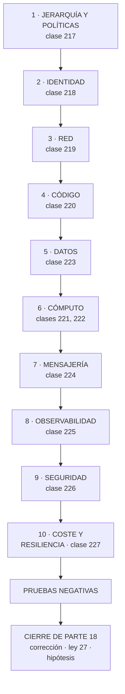

# 228 — Proyecto: CloudShop productivo en Azure

> [← 227 · Cost Management, Advisor, resiliencia y Chaos Studio](../../part-18-azure-production-architecture/227-cost-management-advisor-resiliencia-y-chaos-studio/README.md) · [Índice de la parte](../README.md) · [229 · Resource Manager, folders, Shared VPC y guardrails →](../../part-19-gcp-production-architecture/229-resource-manager-folders-shared-vpc-y-guardrails/README.md)

**Parte:** 18 — Azure: arquitectura empresarial y operación en producción<br>
**Nivel:** avanzado · **Horas estimadas:** 8<br>
**Laboratorio:** `capstone` · **Estado:** `EXECUTABLE_CORE`

## 🎯 Propósito

Poner en producción el sistema completo de CloudShop en Azure con lo de las once clases anteriores, y comprobarlo con las pruebas negativas de toda la parte. La clase da el orden, el entregable y los criterios. Y cierra la parte 18: corrige las cinco predicciones de la clase 216 —tres acertadas y dos a medias—, actualiza el recuento de leyes, añade la ley 27 y escribe la hipótesis de la parte 19, contestando además la pregunta incómoda que la clase 216 se dejó planteada.

## 📚 Resultados de aprendizaje

Al finalizar podrás:

1. **Construir** el sistema completo en el orden que evita rehacer.
2. **Comprobar** con las pruebas negativas de toda la parte.
3. **Comparar** el resultado con el equivalente en AWS, con cifras.
4. **Corregir** las cinco predicciones de la clase 216 con evidencia.
5. **Escribir** la hipótesis de la parte 19 en forma refutable.

## 🧩 Conceptos centrales

| Concepto | Comprensión verificable |
|---|---|
| `ley 27` | Un control solo actúa sobre lo que cambia; lo que ya existe sigue incumpliendo hasta que alguien lo toque. |
| `remediación` | Tarea que corrige recursos existentes que incumplen. Es lo único que cierra la brecha que deja la ley 27. |
| `equivalencia entre nubes` | Correspondencia de conceptos. Alta en lo técnico, baja en el modelo operativo. |
| `coste de traslado` | Lo que cuesta llevar la misma arquitectura a otra nube. Se paga más en operación que en código. |
| `prueba negativa de parte` | Comprobación acumulada de las once clases, ejecutada sobre el sistema entero. |
| `hipótesis de parte` | Afirmación refutable escrita antes de estudiar, que la parte siguiente corrige con evidencia. |

## 🧠 Modelo mental

La arquitectura Azure nace del tenant y las políticas heredables, y llega al workload mediante identidades administradas y redes privadas.

Aplicado a esta clase, separa siempre cuatro planos: **intención** (qué necesita el usuario),
**configuración** (qué declaramos), **estado observado** (qué existe de verdad) y
**evidencia** (cómo sabemos que cumple). Confundirlos produce diseños que se ven correctos
en un diagrama pero fallan al operar.

## 🗺️ Flujo de razonamiento



## 📖 Desarrollo

### 1. El encargo, el orden y el entregable

**El encargo.** Llevar a producción la plataforma de pedidos de CloudShop en Azure, con usuarios reales, guardia, presupuesto y continuidad comprobada.

**El orden**, por coste de cambio:

```text
1  JERARQUÍA Y POLÍTICAS                         clase 217
   grupos de administración, suscripciones por carga y
   entorno, iniciativas en auditoría antes de denegar
   → lo que llega tarde deja recursos incumpliendo
                                                    ley 27

2  IDENTIDAD                                     clase 218
   identidades administradas y federadas, sin secretos
   asignaciones en el ámbito del recurso
   elevación temporal y acceso de emergencia probado

3  RED                                           clase 219
   centro y radios, salida centralizada
   puntos privados con zonas DNS enlazadas a TODAS las
   redes

4  CÓDIGO                                        clase 220
   separado por ciclo de vida y ámbito, con módulos
   verificados y pilas de despliegue

5  DATOS                                         clase 223
   familia por patrones, consistencia por operación,
   índices recortados

6  CÓMPUTO                            clases 221, 222
   la opción gestionada que corresponda; clúster solo donde
   hace falta

7  MENSAJERÍA                                    clase 224
   el servicio que garantiza lo que hace falta, con
   idempotencia y fallidos vigilados

8  OBSERVABILIDAD                                clase 225
   diagnóstico por política, instrumentación estándar

9  SEGURIDAD                                     clase 226
   postura por alcance, detección comprobada con simulación

10 COSTE Y RESILIENCIA                           clase 227
   atribución, compromisos tras retirar, experimentos
```

**El entregable**, con las piezas propias de esta parte:

```text
1  el problema, con su cifra
2  jerarquía y iniciativas, con el estado de cumplimiento
3  inventario de identidades y su ALCANCE medido
4  topología de red, con las zonas DNS y su enlace
5  el código, con lo que gestiona cada pila
6  patrones de acceso y niveles de consistencia por
   operación
7  la lista de VALORES POR DEFECTO cambiados
8  observabilidad: qué se ingiere, en qué plan y qué cuesta
9  detección: qué técnicas se simulan y cuáles se detectan
10 coste atribuido y por unidad de negocio
11 experimentos de resiliencia y sus hallazgos
12 pruebas negativas, con los fallos publicados
13 lo que NO se hace, y por qué
```

**Las pruebas negativas de la parte:**

```text
☐ quitar una política heredada desde una suscripción
☐ crear un recurso sin etiquetas obligatorias
☐ crear un recurso en una región no permitida
☐ obtener la identidad de otro espacio de nombres
☐ asumir una identidad federada desde otro repositorio
☐ activar un papel privilegiado sin aprobación
☐ entrar con la cuenta de acceso de emergencia
☐ alcanzar un radio desde otro radio
☐ resolver un nombre con punto privado desde cada red
☐ alcanzar un servicio con punto privado desde internet
☐ sacar datos a un destino no declarado
☐ desplegar quitando un recurso de la plantilla
☐ borrar la pila y comprobar que los datos sobreviven
☐ enviar el mismo mensaje 50 veces
☐ dejar un mensaje en la cola de fallidos y esperar la
  alerta
☐ perder una zona completa
☐ simular 14 técnicas de ataque
☐ provocar la condición de cada alerta
☐ desplegar el entorno de cero en una suscripción vacía
```

Y los criterios de evaluación, con el peso donde importa:

```text                                                     peso
1  las políticas están en grupos de administración         3
2  se midió el cumplimiento antes de denegar               2
3  ninguna asignación amplia sin justificar                3
4  no quedan secretos de cliente sin excepción             3
5  las zonas DNS están enlazadas a todas las redes         3
6  la consistencia se decide por operación                 2
7  la lista de valores por defecto cambiados es explícita  3
8  la instrumentación es estándar                          2
9  se simulan técnicas y se publica la proporción          3
10 el coste atribuido supera el 90 %                       2
11 hay experimentos de resiliencia ejecutados              3
12 las pruebas negativas se ejecutaron y hay fallos
   publicados                                              3
```

### 2. Cierre de la parte 18: corrección de las cinco predicciones

**Las cinco predicciones de la clase 216, corregidas con la evidencia de las clases 217 a 227.**

```text
1. «los valores por defecto de Azure estarán mal elegidos en
    proporción parecida a los de AWS, pero fallarán en otro
    sitio: los de AWS son permisivos en red y almacenamiento;
    los de Azure lo serán en identidad y ámbito de permisos»

   PRIMERA MITAD CORRECTA: la lista de valores por defecto
   que hubo que cambiar es comparable a la de AWS. SEGUNDA
   MITAD FALLADA. Los peores valores por defecto de Azure no
   fueron de identidad: fueron de COSTE y de OBSERVABILIDAD.
   La consistencia fuerte del asistente costaba 1.720 €/mes;
   la política que indexa todos los campos, otros 1.020; y
   el 93 % de los recursos no enviaba ningún registro porque
   la configuración de diagnóstico no existe si no se crea.
   El problema de identidad fue real y grave, pero no era un
   valor por defecto: era un error de configuración que
   alguien tomó por comodidad.

2. «la jerarquía será el equivalente del plan de direcciones:
    se decide en una tarde, condiciona una década, y
    renumerarla costará meses»

   A MEDIAS, y la diferencia importa. Se decidió mal —47
   suscripciones colgando de la raíz— y condicionó todo,
   como el plan de direcciones. Pero el mecanismo del coste
   es OTRO: mover las 61 suscripciones al grupo correcto fue
   instantáneo y gratis. Lo que costó cuatro meses fue
   corregir los recursos que ya existían, porque las
   políticas de denegación no actúan hacia atrás. En redes,
   lo caro es renumerar; aquí, lo caro es que el control
   nuevo no toca lo viejo. Y eso es una ley distinta.

3. «la identidad será el eje; el error más frecuente será un
    ámbito de asignación demasiado amplio, el equivalente del
    comodín de la clase 206»

   CORRECTA, y de forma casi literal. De 1.940 asignaciones,
   820 estaban en la suscripción y 31 en grupos de
   administración; una sola identidad de canalización
   alcanzaba 14.200 recursos. Y en el clúster, la credencial
   federada atada solo al emisor permitía a cualquier cuenta
   de servicio de cualquier espacio de nombres obtenerla. El
   mecanismo cambia de nombre en cada nube y produce el
   mismo resultado.

4. «la mayoría de los conceptos se corresponderán uno a uno;
    lo que no se corresponderá es el modelo operativo, y
    trasladar la misma arquitectura costará más en operación
    que en código»

   CORRECTA. Se correspondieron: federación de identidad,
   puntos privados, centro y radios, infraestructura como
   código, contenedores, mensajería, observabilidad y coste.
   NO se correspondieron: el modelo de políticas, que aquí
   es mucho más fuerte y no actúa hacia atrás; el modelo de
   ámbitos de asignación; los cinco niveles de consistencia,
   que no tienen equivalente; los modos de despliegue; y la
   necesidad de crear el diagnóstico recurso a recurso. El
   código se tradujo en semanas; entender esas cinco
   diferencias operativas costó los tres primeros meses.

5. «los problemas volverán a ser de las leyes 25, 15 y 22; y
    si acierta por cuarta vez consecutiva, dejará de tener
    mérito y habrá que preguntarse por qué, sabiéndolo, sigue
    ocurriendo»

   CORRECTA por cuarta vez, y toca contestar la pregunta.
   La evidencia: cuatro políticas quitadas por equipos sin
   que nadie se enterara; zonas DNS enlazadas a 4 de 43
   redes durante siete meses; una configuración sin marcar
   como específica de ranura; el 93 % de los recursos sin
   diagnóstico; siete de catorce técnicas sin detectar con
   las reglas creadas; tres máquinas de un proyecto
   terminado en 2024.
```

**Y la respuesta a la pregunta**, que es lo que esta clase debe a la anterior:

```text
las leyes 25, 15 y 22 no describen ERRORES
describen el ESTADO POR DEFECTO de cualquier sistema que
cambia

  lo provisional se queda        porque retirar es trabajo
                                y nadie lo pide
  la señal no se mira           porque mirar es trabajo
                                continuo y no urgente
  el procedimiento no funciona  porque ejecutarlo es
                                trabajo y no hay incidente

→ no hace falta que nadie se equivoque para que se cumplan
→ hace falta que nadie haga algo, y eso ocurre siempre

y por eso saberlas no basta
  el equipo de este programa las conocía en las cuatro
  partes y las cuatro veces volvieron a ocurrir
  → lo único que las contrarresta es que la comprobación
    sea AUTOMÁTICA y PERIÓDICA
  → una persona que conoce la ley 15 sigue sin mirar el
    panel
  → una alerta de antigüedad, no
```

**Marcador: tres correctas, dos a medias.**

### 3. Recuento de leyes, ley 27 e hipótesis de la parte 19

**El recuento de leyes, cerrada la parte 18.**

```text
ley 13  lo que no se mira deja de funcionar en silencio        50
ley 15  la señal existe y nadie la mira                        39
ley 22  un procedimiento nunca ejecutado no funciona           34
ley 14  el coste se decide al crear, no al pagar               31
ley 16  un control que estorba se rodea                        29
ley 20  lo que no tiene dueño se filtra y se desperdicia       28
ley 21  el acoplamiento vive en quién escribe                  23
ley 25  lo provisional sobrevive a su motivo                   18
ley 23  la capacidad la limita lo que ya se mantiene           16
ley 26  el valor por defecto sirve a la demostración           12
ley 24  lo que no está en el diagrama no se analiza            12
ley 17  se optimiza la medida, no el objetivo                  12
ley 19  la compensación hace invisible el fallo                10
ley 18  lo asíncrono traslada la garantía, no la elimina        8
```

Y la parte 18 obliga a escribir una ley nueva, que explica el fallo de la predicción 2:

```text
LEY 27
  un control solo actúa sobre lo que cambia;
  lo que ya existe sigue incumpliendo hasta que alguien
  lo toque

apariciones en esta parte                                      5
  clase 217   mover 61 suscripciones al grupo correcto
              corrigió CERO recursos existentes; 14.200
              siguieron incumpliendo
  clase 219   la automatización de zonas DNS no enlazó las
              creadas antes; 39 radios quedaron fuera
  clase 220   el despliegue incremental nunca borra lo que
              deja de estar declarado: 1.140 huérfanos
  clase 222   activar la política de red no cambia lo ya
              desplegado, y en algunas configuraciones
              exige recrear el clúster
  clase 226   cerrar una recomendación no impide que el
              recurso siguiente nazca igual

y lo que la distingue
  la ley 25 dice que lo provisional se queda
  la ley 26 dice que el valor inicial está mal elegido
  la 27 dice algo distinto: que ARREGLAR LA REGLA no
  arregla lo que ya se hizo con la regla anterior

  → y el remedio no es una política mejor: es una TAREA DE
    REMEDIACIÓN, que es trabajo, y hay que planificarlo
  → toda implantación de un control necesita dos planes:
    el de lo nuevo y el de lo viejo
```

**La hipótesis de la parte 19** (clases 229 a 240, Google Cloud en producción), escrita antes de estudiarla:

```text
1. la tercera nube confirmará la equivalencia conceptual y
   volverá a diferir en el modelo operativo; y esta vez lo
   que más costará no será aprender lo distinto sino
   DESAPRENDER lo de las dos anteriores: los errores serán
   de trasladar suposiciones que aquí no valen

2. la jerarquía de proyectos y la red compartida serán otra
   vez la decisión que condiciona todo, con un matiz: aquí
   el proyecto es una frontera más fuerte que la suscripción,
   y eso hará que el error frecuente sea el CONTRARIO —
   demasiados proyectos, no demasiado pocos

3. la identidad volverá a ser el eje, y el error más
   frecuente volverá a ser el ámbito amplio: una asignación
   en la organización o en la carpeta en vez de en el
   recurso                                       ley 27, 218

4. los valores por defecto volverán a estar mal elegidos para
   producción, y aquí fallarán sobre todo en RED: la red
   global y los servicios con acceso público por defecto
   serán la fuente principal                        ley 26

5. y la predicción que ya no tiene mérito, con su corolario:
   los problemas del proyecto serán otra vez de las leyes
   25, 15 y 22. Lo que sí es refutable es esto: **la
   proporción de hallazgos que detecte una comprobación
   automática y periódica será mayor que en las partes 17 y
   18**, porque en esas dos aprendimos a montarlas. Si no lo
   es, el aprendizaje no se está trasladando
```

Y el cierre de la parte 18: **de once clases, lo que más dinero movió no fue ninguna decisión de arquitectura sino dos casillas de un asistente de creación —el nivel de consistencia y la política de índices—, y lo que más riesgo concentró fue una sola asignación de permisos con el ámbito demasiado alto**. La parte 19 hace el mismo recorrido en Google Cloud, empezando por su jerarquía de recursos y su red compartida. Es la clase 229.

### 4. Comparar las dos nubes, con cifras

Con el mismo sistema montado en dos nubes, se puede comparar de verdad. Y conviene, porque **es la única forma de separar lo que es propio del proveedor de lo que es propio del método**.

```text
LO QUE RESULTÓ EQUIVALENTE
  el techo de disponibilidad se calcula igual   clase 185
  la aritmética de colas y concurrencia         clase 186
  la decisión de consistencia por operación     clase 187
  la idempotencia y la cola de fallidos    clases 210, 224
  la disciplina de despliegue escalonado
  la estructura del código por ciclo de vida
  y las pruebas negativas, una a una

LO QUE NO
  el modelo de gobierno: en Azure las políticas se heredan
    y son fuertes; en AWS las barreras y los controles
    están más repartidos
  el modelo de permisos: papel más ámbito frente a política
    con condiciones
  la observabilidad: aquí hay que crear el diagnóstico
    recurso a recurso
  y la consistencia configurable, que no tiene equivalente
```

Y la comparación de esfuerzo, medida:

```text
                              AWS         Azure
tiempo hasta el primer
  despliegue productivo      9 semanas    7 semanas
  → más rápido la segunda vez, por el método, no por la
    nube

líneas de infraestructura
  como código                 ~4.100      ~3.800

valores por defecto que hubo
  que cambiar                     24          19

pruebas negativas ejecutadas        19          19
  que fallaron la primera vez        7           8

coste mensual del mismo sistema  16.700 €   17.400 €
  → diferencia del 4 %, dentro del ruido

tiempo dedicado a aprender el
  modelo OPERATIVO                 —      3 meses
  → y esto es lo que la predicción 4 acertaba
```

Y las dos conclusiones que se pueden defender:

```text
1  el coste de un sistema equivalente es parecido
   → elegir nube por precio de lista es un error
   → lo que cambia el coste son las decisiones de diseño,
     no el proveedor                       clases 216, 227

2  el coste de OPERAR dos nubes no es el doble: es más
   dos modelos de gobierno, dos de permisos, dos de
   observabilidad, dos calendarios de actualización
   → y por eso la multinube se justifica por requisitos,
     no por preferencia                        clase 157
```

Y una advertencia sobre el traslado:

```text
las suposiciones de la nube anterior son el mayor riesgo
  «esto se hereda» — aquí no
  «esto ya viene activado» — aquí no
  «el borrado no se propaga» — aquí sí
→ y por eso el orden de la parte empieza otra vez por lo
  que condiciona todo, en vez de por lo que ya se sabe
```

Y la lista de comprobación de la clase:

```text
☐ el sistema se construyó en el orden por coste de cambio
☐ hay lista explícita de valores por defecto cambiados
☐ el alcance de cada identidad está medido
☐ las zonas DNS están enlazadas a todas las redes
☐ la consistencia está decidida por operación
☐ la instrumentación es estándar
☐ se simulan técnicas y se publica la proporción detectada
☐ hay plan de remediación de lo existente, no solo de lo
  nuevo
☐ las 19 pruebas negativas se ejecutaron y hay fallos
  publicados
☐ el entorno se despliega de cero desde el código
☐ el coste está atribuido por encima del 90 %
☐ está escrito lo que no se hace
```

Y el cierre que enlaza con la clase siguiente: la parte 19 repite el recorrido en Google Cloud, con el riesgo añadido de trasladar suposiciones que allí no valen. Empieza por la jerarquía de recursos y la red compartida, en la clase 229.

## 🔬 Ejemplo trabajado

**El sistema de CloudShop en producción en Azure. Lo que sigue es la lista de valores por defecto cambiados, el resultado de las diecinueve pruebas negativas —de las que fallaron ocho— y la comparación con el mismo sistema en AWS.**

**La lista de valores por defecto cambiados:**

```text
servicio            por defecto              cambiado a
────────────────────────────────────────────────────────────
base distribuida    consistencia fuerte      acotada 5 s,
                                             sesión y
                                             eventual por
                                             petición
base distribuida    indexa todos los campos  7 de 61
base distribuida    1 región                 2 (lectura)
grupo de seguridad  salida a internet        ruta al
                    permitida                cortafuegos
recursos            sin diagnóstico          por política
registros           retención global         por tabla
registros           plan analítico           básico donde
                                             procede
app service         acceso público           punto privado
app service         salida pública           integración de
                                             red
app service         config no específica     marcada por
                    de ranura                ranura
clúster             política de red          activada
                    desactivada
clúster             red plana (asistente)    superpuesta
bus                 bloqueo 30 s             120-300 s
bus                 sin renovación de        activada
                    bloqueo
flujo               retención 1 día          3 días
flujo               posición antes de        después
                    procesar
despliegue          modo incremental sin     pilas de
                    ciclo de vida            despliegue
políticas           asignadas en             en grupos de
                    suscripción              administración
alertas             grupos por equipo        uno por turno

total                                                    19
que funcionaban sin cambiarlos                           19
```

**Las diecinueve pruebas negativas: ocho fallaron.**

```text
✓  quitar una política heredada desde suscripción  imposible
✓  crear recurso sin etiquetas                     rechazado
✓  crear en región no permitida                    rechazado
✗  obtener la identidad de otro espacio de nombres
   → 1 de 7 credenciales federadas ataba solo el emisor:
     la del operador de base vectorial, añadida después de
     la revisión                                clase 222
✓  asumir identidad federada desde otro repositorio denegado
✗  activar papel privilegiado sin aprobación
   → 2 papeles se habían añadido como elegibles sin exigir
     aprobación, al crear un equipo nuevo
✓  entrar con la cuenta de emergencia              45 s
✓  alcanzar un radio desde otro radio              denegado
✗  resolver nombre con punto privado desde cada red
   → 2 radios creados el mes anterior no tenían las zonas
     enlazadas: la automatización se había desplegado
     DESPUÉS de crearlos                     ley 27, 219
✓  alcanzar servicio con punto privado desde internet
                                                   denegado
✗  sacar datos a un destino no declarado
   → funcionó desde el clúster: la política de red
     restringía entre pods, no la salida a internet
                                                clase 222
✓  desplegar quitando un recurso de la plantilla   borrado
✗  borrar la pila y comprobar los datos
   → una cuenta de almacenamiento de un servicio nuevo no
     tenía bloqueo de borrado ni estaba en la pila de datos
✓  mismo mensaje 50 veces                          1 efecto
✓  mensaje en cola de fallidos → alerta            38 s
✗  perder una zona completa
   → 12 min 40 s de degradación: dos servicios añadidos
     tras el último experimento no tenían restricción de
     reparto                                    clase 227
✗  simular 14 técnicas de ataque                   13 de 14
   → la que falta, aceptada por escrito
✗  provocar la condición de cada alerta
   → 4 de 58 no llegaron; 3 por umbral y 1 en estado de
     error                                      clase 225
✓  desplegar el entorno de cero                    94 min
```

Y el análisis de las ocho:

```text
seis por elementos AÑADIDOS después de la última revisión
  · una credencial federada
  · dos papeles elegibles
  · dos radios sin zonas enlazadas
  · una cuenta de almacenamiento sin bloqueo
  · dos servicios sin restricción de reparto
dos por un control que no cubría lo que se creía
  · política de red que no restringe la salida
  · umbrales de alerta

→ y es el mismo diagnóstico de la clase 216: el sistema
  creció y las comprobaciones no crecieron con él
→ con un matiz nuevo: cuatro de los seis casos son de la
  ley 27, porque la automatización llegó después que el
  recurso
```

Y la corrección de método que salió:

```text
toda automatización nueva se acompaña de una TAREA DE
REMEDIACIÓN sobre lo existente
y una comprobación periódica que compare el estado real
con el esperado, no solo en el momento de crear

→ y esa comprobación encontró, en los tres meses
  siguientes
    5 radios sin zonas enlazadas
    3 recursos sin bloqueo de borrado
    2 credenciales federadas mal atadas
  → todos, creados después de la automatización
    correspondiente
```

**Las cifras del sistema en producción, tras tres meses:**

```text                                     objetivo    medido
p99 del flujo de compra                    < 500 ms    438 ms
disponibilidad observada                     99,8 %    99,84 %
coste mensual                             15.000 €   17.400 €
coste por pedido                            0,050 €    0,051 €
pérdida de una zona: degradación             0 min    12 min 40
  (tras corregir)                                        0 min
coste atribuido                                90 %      94 %
alertas por turno                             < 2        0,9
técnicas simuladas detectadas                > 90 %    13/14
despliegue del entorno de cero                  —      94 min
```

**La comparación con AWS, del mismo sistema:**

```text                                      AWS       Azure
p99 del flujo de compra                  412 ms      438 ms
disponibilidad observada                 99,86 %     99,84 %
coste mensual                          16.700 €    17.400 €
coste por pedido                        0,046 €     0,051 €
valores por defecto cambiados                24          19
pruebas negativas fallidas                    7           8
tiempo hasta producción                9 semanas   7 semanas
líneas de infraestructura                ~4.100      ~3.800
equipo dedicado a la plataforma            2,1        2,4
  → la diferencia está en el modelo operativo, no en la
    tecnología
```

Y las tres cosas que se decidió no hacer:

```text
no operar las dos nubes en activo-activo: el coste de
  operar dos modelos de gobierno no compensa   clase 157
no migrar las cargas de AWS: funcionan
no unificar la observabilidad en un solo proveedor
  todavía: se revisa cuando el volumen lo justifique
```

**La lección que este proyecto deja**: los diecinueve valores por defecto cambiados **funcionaban todos sin cambiarlos**, y dos de ellos —dos casillas de un asistente— costaban dos mil setecientos euros al mes. De las ocho pruebas negativas fallidas, **cuatro fueron por recursos creados antes de que existiera la automatización que los cubriría**, que es la ley 27 en su forma más directa. Y comparado con AWS, el mismo sistema costó un 4 % más y necesitó un 14 % más de equipo: **la diferencia está en operar dos modelos, no en la tecnología**.

## 🧪 Laboratorio guiado

Ejecuta desde la raíz:

```bash
python classes/part-18-azure-production-architecture/228-proyecto-cloudshop-productivo-en-azure/lab.py
```

El laboratorio selecciona el motor de práctica **`capstone`** y produce
`lab_result.json`. El escenario, sus comprobaciones y el artefacto esperado corresponden a
esta clase; no requiere credenciales y deja explícito qué debe revalidarse en un sandbox real.

1. Lee `exercise.steps` y formula una predicción antes de ejecutar.
2. Ejecuta la práctica y verifica todos los elementos de `checks`.
3. Provoca el caso de `negative_test` y explica la señal observada.
4. Materializa `cloudshop-azure` en `evidence/` usando la plantilla indicada.
5. Para proveedor real, sigue `sandbox.requires`, registra costo y ejecuta `destroy`.

### Evidencia esperada

El artefacto principal es un incremento integrado, demostrable y documentado. Además, la entrega debe incluir el comando ejecutado,
la salida estructurada y una conclusión que no exceda lo observado.

## 🏆 Reto verificable

Construye **`cloudshop-azure`** para el caso CloudShop. Incluye una alternativa descartada,
un supuesto que pueda falsarse, una prueba de fallo y una decisión de rollback.

## ✅ Criterio de aceptación

- [ ] `lab.py` termina con código 0 y genera JSON válido.
- [ ] La entrega conecta al menos tres requisitos con mecanismos verificables.
- [ ] Existe una prueba positiva y una prueba negativa con evidencia.
- [ ] Seguridad, costo y operación aparecen como decisiones, no como anexos.
- [ ] Se declara una limitación y una condición que obligaría a revisar el diseño.
- [ ] Otra persona puede repetir el recorrido sin conocimiento tácito.

## ⚠️ Errores frecuentes

| Síntoma | Causa probable | Corrección |
|---|---|---|
| Se implanta un control y los recursos existentes siguen incumpliendo | Los controles actúan sobre creaciones y modificaciones, no hacia atrás | Toda implantación necesita dos planes: el de lo nuevo y una tarea de remediación de lo existente. |
| Una automatización cubre unos recursos y no otros | Los recursos anteriores a la automatización no pasaron por ella | Ejecuta la automatización sobre lo existente y añade una comprobación periódica que compare el estado real con el esperado. |
| Al trasladar la arquitectura a otra nube fallan cosas que en la anterior funcionaban | Se trasladaron suposiciones del modelo operativo anterior | Empieza por lo que condiciona todo en la nube nueva y comprueba explícitamente qué se hereda, qué viene activado y qué se propaga. |
| Las pruebas negativas pasan y aparecen huecos nuevos | El sistema creció y las comprobaciones no crecieron con él | Añade una prueba negativa por cada capacidad nueva y ejecútalas periódicamente, no solo al terminar. |
| Se elige la nube por precio de lista y no se ahorra | El coste lo deciden las decisiones de diseño, no el proveedor | Compara el coste del mismo sistema montado bien en ambas; la diferencia suele estar dentro del ruido. |
| Operar dos nubes consume mucho más equipo del previsto | Se contó el código y no los modelos de gobierno, permisos, observabilidad y actualizaciones | Justifica la multinube por requisitos y no por preferencia, contando el coste operativo real. |

## 🛡️ Seguridad, ética y costo

Trabaja con cuentas propias o sandboxes autorizados. No publiques secretos, identificadores
reales ni datos personales. Antes de crear recursos pagos define presupuesto, etiquetas y
comando de destrucción; después verifica que no queden recursos huérfanos. Los ejemplos
locales enseñan contratos, pero no certifican cumplimiento ni disponibilidad de producción.

## ❓ Preguntas de comprobación

1. ¿Cuál de las cinco predicciones de la clase 216 falló y en qué mitad?
2. ¿Qué dice la ley 27 y en qué se distingue de las leyes 25 y 26?
3. ¿Por qué saber las leyes 25, 15 y 22 no basta para evitar que se cumplan?
4. ¿Qué se correspondió entre las dos nubes y qué no?
5. ¿Cuántas de las pruebas negativas fallidas se deben a la ley 27?

## 🔗 Referencias

- Microsoft (2025). *Azure Well-Architected Framework*. <https://learn.microsoft.com/en-us/azure/well-architected/>
- Microsoft (2025). *Cloud Adoption Framework: Azure landing zones*. <https://learn.microsoft.com/en-us/azure/cloud-adoption-framework/ready/landing-zone/>
- Microsoft (2025). *Azure Policy remediation tasks*. <https://learn.microsoft.com/en-us/azure/governance/policy/how-to/remediate-resources>
- Beyer, B. y otros (2018). *The Site Reliability Workbook*. <https://sre.google/workbook/table-of-contents/>
- Basiri, A. y otros (2016). *Chaos engineering*. <https://ieeexplore.ieee.org/document/7503833>
- Documentación oficial vigente del servicio implementado; registra URL y fecha de consulta.

---

> [Evaluación](assessment.md) · [Contrato de clase](lesson.yaml) · [Índice de la parte](../README.md)

| Anterior | Índice | Siguiente |
|---|---|---|
| [← 227 · Cost Management, Advisor, resiliencia y Chaos Studio](../../part-18-azure-production-architecture/227-cost-management-advisor-resiliencia-y-chaos-studio/README.md) | [Parte 18](../README.md) · [Programa](../../README.md) | [229 · Resource Manager, folders, Shared VPC y guardrails →](../../part-19-gcp-production-architecture/229-resource-manager-folders-shared-vpc-y-guardrails/README.md) |
