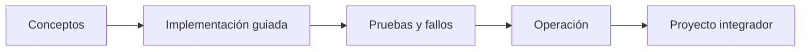

# Parte 18 — Azure: arquitectura empresarial y operación en producción

> [← Parte 17](../part-17-aws-production-architecture/README.md) · [Índice completo](../README.md) · [Parte 19 →](../part-19-gcp-production-architecture/README.md)

**📥 Descargar:** [Esta parte en PDF](../../site/downloads/partes/manual-parte-18-azure-production-architecture.pdf) · [Recorrido de Azure en PDF](../../site/downloads/nubes/manual-azure.pdf) · [Manual integral](../../site/downloads/multi-cloud-engineering-manual-v2.0.pdf)

**Nivel:** avanzado · **Clases:** 12 · **Duración sugerida:** 6–8 semanas

Operar CloudShop sobre landing zones, PaaS, datos, identidad y observabilidad de Azure.

## Resultados de la parte

Al completar esta parte podrás explicar el dominio con lenguaje independiente del proveedor,
implementar sus mecanismos esenciales, diagnosticar fallos y defender decisiones mediante
evidencia, costo, seguridad y objetivos de confiabilidad.

## Modelo mental

La arquitectura Azure nace del tenant y las políticas heredables, y llega al workload mediante identidades administradas y redes privadas.

## Secuencia

## Clases

| ID | Clase | Laboratorio | Horas |
|---:|---|---|---:|
| 217 | [Enterprise-scale landing zones y management groups](217-enterprise-scale-landing-zones-y-management-groups/README.md) | `governance` | 4 |
| 218 | [Entra ID, workload identity, PIM y Conditional Access](218-entra-id-workload-identity-pim-y-conditional-access/README.md) | `iam` | 4 |
| 219 | [Hub-spoke, Virtual WAN, Private Link y DNS privado](219-hub-spoke-virtual-wan-private-link-y-dns-privado/README.md) | `network` | 4 |
| 220 | [Bicep, deployment stacks y Azure Verified Modules](220-bicep-deployment-stacks-y-azure-verified-modules/README.md) | `iac` | 4 |
| 221 | [App Service, Functions y Container Apps en producción](221-app-service-functions-y-container-apps-en-produccion/README.md) | `serverless` | 4 |
| 222 | [AKS, workload identity, ingress y GitOps](222-aks-workload-identity-ingress-y-gitops/README.md) | `kubernetes` | 4 |
| 223 | [Azure SQL, Cosmos DB y consistencia distribuida](223-azure-sql-cosmos-db-y-consistencia-distribuida/README.md) | `data` | 4 |
| 224 | [Service Bus, Event Grid y Event Hubs](224-service-bus-event-grid-y-event-hubs/README.md) | `messaging` | 4 |
| 225 | [Azure Monitor, Application Insights y OpenTelemetry](225-azure-monitor-application-insights-y-opentelemetry/README.md) | `observability` | 4 |
| 226 | [Defender for Cloud, Policy y Sentinel](226-defender-for-cloud-policy-y-sentinel/README.md) | `security` | 4 |
| 227 | [Cost Management, Advisor, resiliencia y Chaos Studio](227-cost-management-advisor-resiliencia-y-chaos-studio/README.md) | `finops` | 4 |
| 228 | [Proyecto: CloudShop productivo en Azure](228-proyecto-cloudshop-productivo-en-azure/README.md) | `capstone` | 8 |

## Evaluación de la parte

- 35 % laboratorios y evidencia reproducible.
- 25 % retos verificables.
- 20 % decisiones y ADR.
- 10 % seguridad, confiabilidad y costo.
- 10 % proyecto integrador de la parte.

Se aprueba con 80 % de clases en nivel B o superior y el proyecto integrador reproducible.

## Pauta bibliográfica

- Azure Architecture Center — Microsoft.
- Exam Ref AZ-305 — Microsoft Press.
- Designing Distributed Systems — Brendan Burns.
