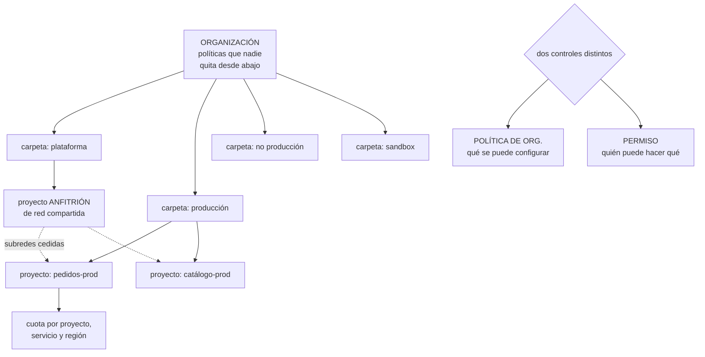

# 229 — Resource Manager, folders, Shared VPC y guardrails

> [← Clase anterior](../../part-18-azure-production-architecture/228-proyecto-cloudshop-productivo-en-azure/README.md) · [Índice de la parte](../README.md) · [Clase siguiente →](../../part-19-gcp-production-architecture/230-workload-identity-federation-iam-conditions-y-pam/README.md)

**Parte:** 19 — Google Cloud: arquitectura de datos y operación en producción<br>
**Nivel:** avanzado · **Horas estimadas:** 4<br>
**Laboratorio:** `governance` · **Estado:** `EXECUTABLE_CORE`

## 🎯 Propósito

Diseñar la jerarquía de Google Cloud —organización, carpetas y proyectos— y su red compartida, con la advertencia que abre la parte: **el mayor riesgo aquí no es lo que se desconoce, sino trasladar suposiciones de las dos nubes anteriores**. La clase explica por qué el proyecto es una frontera más fuerte que una suscripción, qué controlan las políticas de organización frente a los permisos, y por qué la red compartida separa quién opera la red de quién la usa.

## 📚 Resultados de aprendizaje

Al finalizar podrás:

1. **Repartir** cargas entre carpetas y proyectos con criterio.
2. **Distinguir** política de organización de permiso, y usar cada una.
3. **Diseñar** red compartida separando operación de uso.
4. **Evitar** los errores de trasladar suposiciones de otras nubes.
5. **Corregir** una jerarquía con demasiados o muy pocos proyectos.

## 🧩 Conceptos centrales

| Concepto | Comprensión verificable |
|---|---|
| `organización` | Raíz de la jerarquía, ligada al dominio. Donde se aplican las políticas que nadie puede quitar desde abajo. |
| `carpeta` | Agrupación de proyectos y otras carpetas. Nivel intermedio donde se heredan políticas y permisos. |
| `proyecto` | Frontera de recursos, facturación, cuota, API habilitadas y red. Más fuerte que una suscripción. |
| `política de organización` | Restricción sobre qué se puede configurar. Distinta de un permiso: limita el qué, no el quién. |
| `red compartida` | Red de un proyecto anfitrión, usada por proyectos de servicio que no la administran. |
| `cuota` | Límite por proyecto, servicio y región. Se topa antes que la capacidad y se pide con antelación. |

## 🧠 Modelo mental

Google Cloud combina una jerarquía estricta de recursos con una red global y servicios data-first; proyecto, cuota e IAM forman una unidad operativa.

Aplicado a esta clase, separa siempre cuatro planos: **intención** (qué necesita el usuario),
**configuración** (qué declaramos), **estado observado** (qué existe de verdad) y
**evidencia** (cómo sabemos que cumple). Confundirlos produce diseños que se ven correctos
en un diagrama pero fallan al operar.

## 🗺️ Flujo de razonamiento



## 📖 Desarrollo

### 1. La jerarquía, y por qué el proyecto es fuerte

La estructura tiene tres niveles y el del medio es opcional, pero el de abajo tiene más peso que sus equivalentes en otras nubes.

```text
ORGANIZACIÓN
  raíz, ligada al dominio
  aquí van las políticas de organización y los permisos que
  se heredan

CARPETA
  agrupación de proyectos, anidable
  nivel natural para políticas por entorno o por unidad

PROYECTO
  frontera de
    recursos
    facturación
    CUOTAS
    API habilitadas          ← esto no existe en otras nubes
    red (salvo que use una compartida)
    y ámbito natural de muchos permisos
```

Y la diferencia que hay que interiorizar:

```text
UN PROYECTO ES MÁS BARATO Y MÁS FUERTE que una suscripción
  crear uno es inmediato y gratis
  las API se habilitan por proyecto: lo que no está
    habilitado, no existe
  y borrar un proyecto se lleva todo lo de dentro

→ y por eso el error frecuente aquí es el CONTRARIO al de
  Azure: demasiados proyectos, no demasiado pocos
```

Y el criterio de reparto, con la tensión que hay que resolver:

```text
UN PROYECTO POR CARGA Y ENTORNO
  + aislamiento fuerte, cuota propia, facturación clara
  − más proyectos que gestionar: políticas, permisos,
    presupuestos, conexiones de red

UN PROYECTO POR EQUIPO Y ENTORNO
  + menos objetos que gestionar
  − las cargas comparten cuota y se afectan

CRITERIO
  por carga y entorno para producción
  agrupado para desarrollo, si el volumen no lo justifica
  → y con la entrega AUTOMATIZADA, para que crear uno cueste
    minutos y no semanas                          ley 16
```

Y las carpetas, que casi siempre se organizan de una de dos formas:

```text
POR ENTORNO         producción · no producción · sandbox
  + las políticas por entorno son las que más varían
  − las unidades de negocio quedan mezcladas

POR UNIDAD, y dentro por entorno
  + refleja la organización
  − la empresa se reorganiza antes que la nube  clase 183

→ por entorno arriba y por unidad debajo suele envejecer
  mejor
```

Y una advertencia de traslado, la primera de muchas:

```text
✗ «esto se hereda como allí»
  las políticas de organización se heredan, sí
  pero su combinación tiene reglas propias: algunas se
  fusionan y otras se sustituyen
  → hay que leerlas, no suponerlas
```

### 2. Políticas de organización y permisos: dos cosas

Aquí hay una separación que en otras nubes está mezclada, y confundirla produce controles que no controlan.

```text
POLÍTICA DE ORGANIZACIÓN
  restringe QUÉ se puede configurar
  ejemplos
    prohibir direcciones IP externas en máquinas
    restringir las regiones donde se puede crear
    prohibir claves de cuenta de servicio
    exigir que los recursos no sean públicos
    restringir qué dominios pueden recibir permisos
  → se aplica en organización, carpeta o proyecto
  → y NO depende de quién lo intente: ni el dueño puede

PERMISO
  decide QUIÉN puede hacer QUÉ sobre QUÉ recurso
  → y se hereda hacia abajo

→ la política de organización es la barrera; el permiso es
  la puerta
→ y una barrera bien puesta hace que el permiso amplio sea
  menos peligroso                              clase 169
```

Y las políticas que conviene tener desde el primer día:

```text
prohibir claves de cuenta de servicio
  → obliga a usar federación e identidad de carga
                                                clase 230
prohibir IP externas salvo donde se declare
restringir regiones
prohibir que los recursos se hagan públicos
restringir a qué dominios se pueden dar permisos
  → impide dar acceso a una cuenta personal por error
prohibir el reenvío de puertos y el acceso directo
exigir el uso de la red compartida
```

Y la disciplina de implantación, que es la de siempre:

```text
1  aplicar en modo de solo registro donde exista
2  medir el incumplimiento actual
3  corregir o exceptuar, con dueño y fecha
4  aplicar
→ y recordando que no actúa hacia atrás           ley 27
```

**Las API habilitadas**, que son un control que sorprende:

```text
un servicio no se puede usar si su API no está habilitada
en el proyecto
→ es un control de superficie muy efectivo y gratuito
→ habilitar solo lo que se usa reduce el alcance de un
  compromiso                                   clase 189

y la trampa
  habilitar una API es fácil y nadie la deshabilita
  → inventario periódico de API habilitadas y sin uso
                                                    ley 25
```

Y las cuotas, con la lección de la clase 222:

```text
son por proyecto, servicio y región
se topan antes que la capacidad
se piden con antelación y tardan
→ margen del 30 % sobre el máximo del escalado
→ alerta al 80 %                              clase 262
→ y no actualizar ni escalar si el margen no da
```

### 3. Red compartida: separar operar de usar

La red compartida es la pieza que más distingue a esta nube en gobierno, y resuelve un problema real.

```text
EL PROBLEMA
  si cada proyecto tiene su red, hay que conectarlas todas
  entre sí
  → y cada equipo administra su red, con lo que eso implica

LA RED COMPARTIDA
  un PROYECTO ANFITRIÓN contiene la red y sus subredes
  los PROYECTOS DE SERVICIO usan esas subredes
  → los recursos viven en el proyecto de servicio
  → la red la administra el equipo de plataforma

QUÉ SEPARA
  quién OPERA la red: plataforma
  quién la USA: los equipos
  → y un equipo no puede crear rutas, emparejamientos ni
    reglas por su cuenta
```

Y las decisiones que hay que tomar:

```text
¿UNA RED COMPARTIDA O VARIAS?
  una por entorno es lo habitual
  → producción y no producción NUNCA en la misma

¿QUÉ SUBREDES SE CEDEN A QUIÉN?
  se ceden subredes concretas a proyectos concretos
  → un proyecto de servicio solo ve las subredes cedidas
  → y eso es un control de alcance real       clase 199

¿QUIÉN PUEDE CREAR REGLAS DE CORTAFUEGOS?
  plataforma, con etiquetas o cuentas de servicio como
  selector
  → y los equipos piden, no crean
  → si pedir tarda días, crearán recursos con IP pública
                                                    ley 16
```

Y las particularidades de red que hay que conocer para no trasladar suposiciones:

```text
LA RED ES GLOBAL, las subredes son regionales
  → una sola red puede abarcar todas las regiones
  → y por tanto no hace falta emparejar entre regiones
  → es distinto de las otras dos nubes            clase 231

LAS REGLAS DE CORTAFUEGOS SON DE LA RED, no de la subred
  con prioridades y con selectores por etiqueta o por
  cuenta de servicio
  → seleccionar por cuenta de servicio es mucho mejor que
    por etiqueta: la etiqueta la puede poner cualquiera con
    permiso de instancia

LA SALIDA A INTERNET ESTÁ PERMITIDA por defecto
  → y hay que cerrarla explícitamente            ley 26
```

Y el error de traslado más caro en esta parte:

```text
✗ «cada proyecto tendrá su red, como cada cuenta la suya»
  → produce decenas de redes que hay que conectar
  → y pierde la ventaja principal de esta nube
→ la red compartida es la elección por defecto salvo razón
  concreta
```

### 4. Facturación, entrega y corrección

**La facturación**, que se organiza distinto:

```text
una CUENTA DE FACTURACIÓN se asocia a muchos proyectos
  → y el desglose por proyecto es directo y limpio
  → por eso la separación por proyecto es también una
    decisión de atribución                     clase 239

y las etiquetas
  aquí se llaman de otra forma y hay dos mecanismos
    unas sirven para facturación y organización
    otras para condiciones de permiso y políticas
  → y no son intercambiables: hay que saber cuál se usa
    para qué
```

**La entrega de proyectos**, que decide si el gobierno se cumple:

```text
UN PROYECTO ENTREGADO trae
  colocado en la carpeta correcta
  cuenta de facturación asociada
  API habilitadas mínimas
  subredes cedidas de la red compartida
  permisos base y cuentas de servicio
  destinos de registro configurados          clase 238
  presupuesto y alertas
  y las políticas heredadas aplicando

Y EL PLAZO
  si tarda semanas, los equipos usarán proyectos
  personales o pedirán permisos amplios en los que ya
  tienen                                          ley 16
  → automatizar la entrega es lo que hace cumplir el resto
```

**Corregir una jerarquía**, con el problema propio de esta nube:

```text
DEMASIADOS PROYECTOS
  el síntoma: cientos de proyectos, muchos sin uso
  → y cada uno con su presupuesto, permisos y API
  corrección
    inventario con último uso y dueño
    los sin actividad en 90 días, a retirar     ley 25
    y consolidar los de desarrollo por equipo

PROYECTOS EN LA CARPETA EQUIVOCADA
  mover es sencillo y las políticas empiezan a aplicar
  → pero lo ya creado sigue incumpliendo         ley 27
  → hace falta remediación, no solo mover

PROYECTOS SIN CARPETA, colgando de la organización
  → no reciben las políticas por entorno
  → es el hallazgo típico del primer inventario
```

Y lo que hay que vigilar:

```text
proyectos sin carpeta, sin dueño o sin presupuesto
API habilitadas y sin uso
cuotas frente al máximo del escalado
políticas de organización con excepciones, y su antigüedad
subredes cedidas y no usadas
y recursos creados fuera de la red compartida
```

Y la lista de comprobación de la clase:

```text
☐ hay carpetas por entorno, y proyectos por carga
☐ ningún proyecto cuelga directamente de la organización
☐ las políticas de organización están en organización o
  carpeta
☐ están las políticas mínimas: sin claves de cuenta de
  servicio, sin IP externas, regiones, no público, dominios
☐ se midió el incumplimiento antes de aplicar
☐ hay plan de remediación de lo existente
☐ solo están habilitadas las API que se usan
☐ hay red compartida por entorno, con subredes cedidas
☐ las reglas de cortafuegos seleccionan por cuenta de
  servicio, no por etiqueta
☐ la salida a internet está cerrada explícitamente
☐ las cuotas tienen margen y alerta al 80 %
☐ la entrega de un proyecto está automatizada y tarda
  minutos
☐ hay inventario de proyectos con último uso y dueño
```

Y el cierre que enlaza con la clase siguiente: con la jerarquía y la red repartidas, el control que decide el alcance real vuelve a ser la identidad, y aquí hay un elemento que no existe en las otras dos nubes: las condiciones en las asignaciones. Es la materia de la clase 230.

## 🔬 Ejemplo trabajado

**CloudShop monta su organización en Google Cloud, con la experiencia de las dos nubes anteriores. Lo que sigue son los tres errores de traslado que cometió el equipo, el inventario que encontró 214 proyectos, y la red compartida que redujo 41 redes a dos.**

**El punto de partida, tras dos años de uso sin gobierno:**

```text
proyectos                                          214
  colgando de la organización, sin carpeta         189
  con dueño identificable                           94
  sin actividad en 90 días                          71
  sin presupuesto asociado                         203

redes                                               41
  una por proyecto que la necesitaba
  emparejamientos entre ellas                       67

políticas de organización aplicadas                   2
claves de cuenta de servicio                        341
  con más de 1 año                                  218
```

**Los tres errores de traslado, cometidos en las primeras semanas:**

```text
ERROR 1 · «cada proyecto con su red»
  el equipo venía de un modelo de cuenta por carga con red
  propia
  creó 12 redes nuevas antes de que alguien preguntara
  → y la conexión entre ellas exigía emparejamientos, que
    no son transitivos

  al descubrir la red compartida
    12 redes nuevas → 0
    41 redes existentes → 2 (producción y no producción)
    67 emparejamientos → 4
  y una diferencia que no habían previsto
    la red es GLOBAL: una sola red cubre las 3 regiones
    → no hacen falta emparejamientos entre regiones

ERROR 2 · «las reglas de cortafuegos son por subred»
  se crearon reglas asumiendo que aplicaban a la subred
  → aquí son de la RED, con selectores
  → y las primeras se escribieron con selectores por
    ETIQUETA
  → cualquiera con permiso sobre una instancia podía
    ponerle la etiqueta que abría el acceso a la base

  corrección
    selectores por CUENTA DE SERVICIO
    → poner una cuenta de servicio a una instancia exige
      permiso sobre esa cuenta
    → y eso sí es un control                    clase 230

ERROR 3 · «los permisos amplios ya los limita la barrera»
  se asumió el modelo de la nube anterior
  → aquí la política de organización limita QUÉ se
    configura, no QUIÉN accede a los datos
  → una asignación amplia sobre almacenamiento seguía
    dando acceso a los datos, con la barrera puesta

  corrección
    los dos controles, y no uno en lugar del otro
                                                clase 230
```

Y la conclusión que el equipo escribió:

```text
los tres errores fueron de SUPOSICIÓN, no de
desconocimiento
cada uno venía de dar por válido algo de otra nube
→ y los tres se detectaron por casualidad, no por una
  comprobación
→ desde entonces, la primera tarea de cada servicio nuevo
  es leer qué se hereda, qué viene activado y qué se
  propaga                                      clase 228
```

**La jerarquía nueva:**

```text
organización
├── plataforma
│    ├── red-compartida-prod       (proyecto anfitrión)
│    ├── red-compartida-nopro      (proyecto anfitrión)
│    ├── identidad
│    ├── observabilidad
│    └── seguridad
├── produccion
│    ├── pedidos-prod
│    ├── catalogo-prod
│    ├── precios-prod
│    └── ... (14 proyectos, uno por carga)
├── no-produccion
│    ├── pedidos-pre, pedidos-dev
│    └── ... (28 proyectos)
└── sandbox                        con caducidad de 60 días
```

**Las políticas de organización, implantadas por orden:**

```text
política                          incumplimiento inicial
sin claves de cuenta de servicio            341
sin IP externas en máquinas                 118
regiones restringidas a la UE                41
sin recursos públicos                        29
dominios permitidos para permisos            14
sin reenvío de puertos                       62
uso obligatorio de red compartida           n/a (nuevo)

el orden que se siguió
  1  dominios permitidos      ← 14 casos, 2 días
     y encontró 3 permisos concedidos a cuentas personales
     de ex empleados                              ley 25
  2  sin recursos públicos    ← 29 casos, 1 semana
     de ellos, 4 almacenes con datos de clientes
  3  regiones                 ← 41 casos, 3 semanas
  4  sin IP externas          ← 118 casos, 6 semanas
     sustituidas por acceso mediante servicio de
     administración                             clase 256
  5  sin claves de cuenta de servicio ← 341, 4 meses
     el más largo, y el de más valor            clase 230

y la remediación, que no vino sola
  aplicar las políticas corrigió 0 recursos existentes
  → tareas de remediación planificadas aparte    ley 27
```

**El inventario de proyectos:**

```text
214 proyectos, con último uso y dueño

  con actividad y dueño                              94
  con actividad y SIN dueño                          49
    → 12 resultaron ser de equipos que ya no existen
    → 3 tenían cargas en producción que nadie sabía que
      existían                                    ley 20
  sin actividad en 90 días                           71
    → apagados, y borrados 30 días después
    → 2 reclamaciones, ambas restauradas en minutos

proyectos tras la limpieza                          143
  → y consolidando los de desarrollo por equipo:      86

coste liberado                              4.900 €/mes
  de los cuales, en los 71 sin actividad     3.100 €
```

Y el hallazgo más incómodo:

```text
uno de los 71 sin actividad tenía
  una base de datos con una copia de la tabla de clientes
  de 2023
  sin cifrado con clave propia
  sin registro de acceso
  y con permisos de lectura para «todos los usuarios
  autenticados» ← es decir, cualquier cuenta de Google

llevaba así                                    19 meses
lo encontró                          el inventario, no una
                                     alerta      ley 15
```

**La red compartida, montada:**

```text
dos proyectos anfitriones: producción y no producción
red global por entorno; subredes por región
subredes cedidas a proyectos concretos
  → pedidos-prod ve su subred y nada más

reglas de cortafuegos
  denegación por defecto en entrada y en SALIDA
  selectores por cuenta de servicio
  creadas por plataforma, pedidas por los equipos
  → y el plazo de una petición: 40 minutos, automatizado
    con revisión

resultado
  redes                                    41 → 2
  emparejamientos                          67 → 4
  reglas de cortafuegos                   940 → 118
  equipos que pueden crear rutas             41 → 1
```

**La entrega de proyectos, automatizada:**

```text
antes   petición por correo → 2 semanas
        y 189 proyectos creados fuera del proceso
después plantilla que crea el proyecto con
          carpeta, facturación, API mínimas, subred cedida,
          permisos base, destinos de registro, presupuesto
        plazo                                    14 min
        proyectos creados fuera del proceso en 6 meses: 0
```

**El resultado:**

```text                                        antes     después
proyectos                                    214          86
  sin carpeta                                189           0
  sin dueño                                  120           0
  sin presupuesto                             203           0
redes                                          41           2
claves de cuenta de servicio                  341          12
  (las 12, con excepción registrada)
recursos públicos                              29           0
permisos a cuentas fuera del dominio           14           0
coste mensual                            28.700 €    21.400 €
plazo de entrega de un proyecto        2 semanas      14 min
```

**La lección que esta clase deja**: los tres errores del arranque **no fueron por desconocer esta nube, sino por dar por válidas suposiciones de las otras dos**, y ninguno lo detectó una comprobación: se descubrieron por casualidad. Y el inventario de proyectos —que no requería tecnología ninguna— encontró setenta y uno sin actividad, tres con cargas de producción que nadie conocía y **una copia de la tabla de clientes legible por cualquier cuenta de Google desde hacía diecinueve meses**.

## 🧪 Laboratorio guiado

Ejecuta desde la raíz:

```bash
python classes/part-19-gcp-production-architecture/229-resource-manager-folders-shared-vpc-y-guardrails/lab.py
```

El laboratorio selecciona el motor de práctica **`governance`** y produce
`lab_result.json`. El escenario, sus comprobaciones y el artefacto esperado corresponden a
esta clase; no requiere credenciales y deja explícito qué debe revalidarse en un sandbox real.

1. Lee `exercise.steps` y formula una predicción antes de ejecutar.
2. Ejecuta la práctica y verifica todos los elementos de `checks`.
3. Provoca el caso de `negative_test` y explica la señal observada.
4. Materializa `gcp-foundation` en `evidence/` usando la plantilla indicada.
5. Para proveedor real, sigue `sandbox.requires`, registra costo y ejecuta `destroy`.

### Evidencia esperada

El artefacto principal es una jerarquía de política, ownership y evidencia. Además, la entrega debe incluir el comando ejecutado,
la salida estructurada y una conclusión que no exceda lo observado.

## 🏆 Reto verificable

Construye **`gcp-foundation`** para el caso CloudShop. Incluye una alternativa descartada,
un supuesto que pueda falsarse, una prueba de fallo y una decisión de rollback.

## ✅ Criterio de aceptación

- [ ] `lab.py` termina con código 0 y genera JSON válido.
- [ ] La entrega conecta al menos tres requisitos con mecanismos verificables.
- [ ] Existe una prueba positiva y una prueba negativa con evidencia.
- [ ] Seguridad, costo y operación aparecen como decisiones, no como anexos.
- [ ] Se declara una limitación y una condición que obligaría a revisar el diseño.
- [ ] Otra persona puede repetir el recorrido sin conocimiento tácito.

## ⚠️ Errores frecuentes

| Síntoma | Causa probable | Corrección |
|---|---|---|
| Aparecen decenas de redes que hay que conectar entre sí | Se trasladó el modelo de una red por cuenta o suscripción | Usa red compartida por entorno; la red es global y no hacen falta emparejamientos entre regiones. |
| Cualquiera puede abrir un acceso poniendo una etiqueta a su instancia | Las reglas de cortafuegos seleccionan por etiqueta | Selecciona por cuenta de servicio; asignarla exige permiso sobre esa cuenta. |
| Las barreras están puestas y siguen existiendo accesos amplios a los datos | Se confundió política de organización con permiso: la primera limita qué se configura, no quién accede | Usa los dos controles, no uno en lugar del otro. |
| Hay cientos de proyectos y nadie sabe cuáles sirven | Crear un proyecto es inmediato y nadie los retira | Inventario con último uso y dueño; apaga los inactivos, bórralos después y consolida los de desarrollo. |
| Mover proyectos a la carpeta correcta no corrige nada | Las políticas no actúan sobre lo ya creado | Planifica una tarea de remediación además del movimiento. |
| Los equipos crean recursos fuera del proceso | Conseguir un proyecto o una regla de cortafuegos tarda semanas | Automatiza la entrega de proyectos y las peticiones de reglas para que tarden minutos. |

## 🛡️ Seguridad, ética y costo

Trabaja con cuentas propias o sandboxes autorizados. No publiques secretos, identificadores
reales ni datos personales. Antes de crear recursos pagos define presupuesto, etiquetas y
comando de destrucción; después verifica que no queden recursos huérfanos. Los ejemplos
locales enseñan contratos, pero no certifican cumplimiento ni disponibilidad de producción.

## ❓ Preguntas de comprobación

1. ¿Qué hace que un proyecto sea una frontera más fuerte que una suscripción?
2. ¿Qué diferencia hay entre una política de organización y un permiso?
3. ¿Qué separa la red compartida y por qué importa?
4. ¿Por qué los selectores por cuenta de servicio son mejores que por etiqueta?
5. ¿Cuál es el error de reparto de proyectos característico de esta nube?

## 🔗 Referencias

- Google Cloud (2025). *Resource hierarchy*. <https://cloud.google.com/resource-manager/docs/cloud-platform-resource-hierarchy>
- Google Cloud (2025). *Organization policy constraints*. <https://cloud.google.com/resource-manager/docs/organization-policy/org-policy-constraints>
- Google Cloud (2025). *Shared VPC overview*. <https://cloud.google.com/vpc/docs/shared-vpc>
- Google Cloud (2025). *VPC firewall rules and service account targets*. <https://cloud.google.com/firewall/docs/firewalls>
- Google Cloud (2025). *Landing zone design in Google Cloud*. <https://cloud.google.com/architecture/landing-zones>
- Documentación oficial vigente del servicio implementado; registra URL y fecha de consulta.

---

> [Evaluación](assessment.md) · [Contrato de clase](lesson.yaml) · [Índice de la parte](../README.md)
