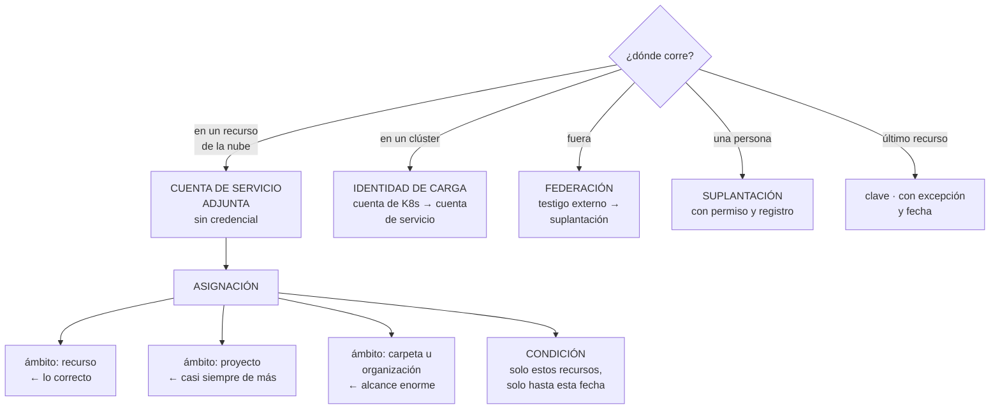

# 230 — Workload Identity Federation, IAM Conditions y PAM

> [← Clase anterior](../../part-19-gcp-production-architecture/229-resource-manager-folders-shared-vpc-y-guardrails/README.md) · [Índice de la parte](../README.md) · [Clase siguiente →](../../part-19-gcp-production-architecture/231-red-global-load-balancing-psc-y-cloud-dns/README.md)

**Parte:** 19 — Google Cloud: arquitectura de datos y operación en producción<br>
**Nivel:** avanzado · **Horas estimadas:** 4<br>
**Laboratorio:** `iam` · **Estado:** `EXECUTABLE_CORE`

## 🎯 Propósito

Resolver la identidad en Google Cloud, donde el mecanismo tiene una pieza que no existe en las otras dos nubes: **las condiciones en las asignaciones**, que permiten conceder un permiso solo sobre ciertos recursos y durante cierto tiempo. La clase cubre la federación y las cuentas de servicio sin claves, la suplantación como sustituto de las credenciales guardadas, el ámbito de asignación —que vuelve a ser el error frecuente— y la elevación temporal con aprobación.

## 📚 Resultados de aprendizaje

Al finalizar podrás:

1. **Eliminar** claves de cuenta de servicio con federación y suplantación.
2. **Asignar** permisos en el ámbito mínimo, con condiciones.
3. **Distinguir** quién actúa de qué identidad se usa, y auditarlo.
4. **Configurar** elevación temporal con aprobación y caducidad.
5. **Detectar** y reducir el alcance de las identidades más amplias.

## 🧩 Conceptos centrales

| Concepto | Comprensión verificable |
|---|---|
| `cuenta de servicio` | Identidad de una carga. Puede usarse sin credenciales si se adjunta al recurso o se suplanta. |
| `clave de cuenta de servicio` | Credencial de larga duración en un fichero. Lo que hay que eliminar. |
| `suplantación` | Obtener un testigo de otra identidad con permiso para ello, sin credencial guardada. |
| `federación de identidad de carga` | Confianza en un emisor externo para que sus testigos suplanten una cuenta de servicio. |
| `condición en la asignación` | Expresión que limita cuándo y sobre qué recursos aplica un permiso. |
| `identidad de carga del clúster` | Vinculación entre una cuenta de servicio de Kubernetes y una de la nube, sin claves. |

## 🧠 Modelo mental

Google Cloud combina una jerarquía estricta de recursos con una red global y servicios data-first; proyecto, cuota e IAM forman una unidad operativa.

Aplicado a esta clase, separa siempre cuatro planos: **intención** (qué necesita el usuario),
**configuración** (qué declaramos), **estado observado** (qué existe de verdad) y
**evidencia** (cómo sabemos que cumple). Confundirlos produce diseños que se ven correctos
en un diagrama pero fallan al operar.

## 🗺️ Flujo de razonamiento



## 📖 Desarrollo

### 1. Eliminar las claves

Una clave de cuenta de servicio es un fichero con una credencial que no caduca. Es lo que hay que eliminar, y aquí hay cuatro formas de no necesitarla.

```text
1  CUENTA DE SERVICIO ADJUNTA — para lo que corre en la nube
   la máquina, la función o el servicio lleva una cuenta de
   servicio asociada
   el código obtiene testigos del servicio de metadatos
   → sin credencial en ningún sitio

   y la regla que se olvida
     NO usar la cuenta de servicio POR DEFECTO del proyecto
     → tiene permisos amplios y la comparten todos los
       recursos del proyecto
     → una cuenta por carga, con sus permisos    ley 26

2  IDENTIDAD DE CARGA — para lo que corre en un clúster
   una cuenta de servicio de Kubernetes se vincula con una
   de la nube
   → el pod obtiene testigos sin claves        clase 234

3  FEDERACIÓN — para lo que corre fuera
   se declara confianza en un emisor externo (canalización,
   otra nube, otro clúster)
   sus testigos suplantan una cuenta de servicio
   → mismo mecanismo y mismos errores que en la clase 206

4  SUPLANTACIÓN — para personas y para encadenar
   una identidad con permiso obtiene un testigo de otra
   → y el registro guarda QUIÉN suplantó a QUIÉN
```

Y la política que lo hace efectivo:

```text
prohibir la creación de claves de cuenta de servicio, como
política de organización                       clase 229
→ y las existentes, inventariadas, migradas y borradas
→ con excepción registrada, dueño y fecha para lo que no se
  pueda                                           ley 25
```

**La suplantación**, que es la pieza que más cambia el día a día:

```text
UNA PERSONA no necesita permisos de producción
  tiene permiso para SUPLANTAR una cuenta de servicio que
  sí los tiene
  → obtiene un testigo de corta duración
  → y queda registrado quién lo hizo             clase 238

Y LAS CANALIZACIONES ENCADENAN
  la identidad federada suplanta una cuenta de despliegue
  → y esa cuenta tiene los permisos, no el testigo externo
  → así se cambian los permisos sin tocar la federación
```

Y el error que hay que evitar:

```text
dar a muchos el permiso de suplantar una cuenta muy
permisiva
→ es equivalente a darles esos permisos, y más difícil de
  ver en un inventario
→ el permiso de suplantar se audita como si fuera el
  permiso suplantado
```

### 2. Ámbito y condiciones

El error frecuente vuelve a ser el mismo de las clases 206 y 218: **el ámbito demasiado amplio**. Aquí hay además una herramienta que no existe en las otras dos.

```text
LOS ÁMBITOS, de mayor a menor
  organización   → todos los proyectos
  carpeta        → todos los de esa rama
  proyecto       → todos sus recursos
  RECURSO        → solo ese

y la costumbre
  asignar «Editor» en el proyecto, porque funciona
  → esa identidad puede crear, modificar y borrar casi todo
  → incluida la base de datos                  clase 218
```

**Las condiciones**, que permiten afinar sin crear papeles a medida:

```text
UNA CONDICIÓN es una expresión que limita cuándo aplica el
permiso

  POR RECURSO
    «solo sobre los almacenes cuyo nombre empiece por
     pedidos-»
    → un permiso de proyecto que en la práctica solo toca
      lo suyo

  POR TIEMPO
    «solo hasta el 31 de marzo»
    → el acceso caduca solo                       ley 25
    → y esto resuelve el problema del acceso temporal sin
      infraestructura adicional

  POR ETIQUETA
    «solo sobre recursos con entorno = desarrollo»

  POR TIPO DE RECURSO
    «solo sobre conjuntos de datos, no sobre trabajos»
```

Y el uso que más aporta:

```text
el acceso concedido durante un incidente, con condición de
tiempo
→ nadie tiene que acordarse de quitarlo
→ y el registro de decisión queda en la propia asignación
```

Y las limitaciones que hay que conocer:

```text
no todos los servicios soportan condiciones por recurso
  → hay que comprobarlo por servicio
las condiciones complican la auditoría: un inventario que
  no las lee muestra permisos que en realidad no aplican
  → y al revés: un permiso que parece limitado puede no
    estarlo si el servicio ignora la condición

→ comprobar con una prueba negativa, no suponer  ley 22
```

**Los papeles**, con la disciplina de siempre:

```text
usar el papel PREDEFINIDO más específico que exista
  no «Editor» sino «Escritor de objetos de almacenamiento»
y papel PERSONALIZADO cuando ninguno encaje
  → con las acciones justas, y mantenido

y los papeles que se conceden con elevación temporal
  Propietario
  Administrador de organización
  Administrador de facturación
  Administrador de seguridad
  → nunca permanentes
```

### 3. Elevación temporal y auditoría

**La elevación temporal** aquí se puede montar de dos formas, y conviene conocer las dos.

```text
CON EL SERVICIO DE GESTIÓN DE ACCESO PRIVILEGIADO
  la persona es ELEGIBLE; solicita, se aprueba, caduca
  → con justificación y registro

CON CONDICIONES DE TIEMPO
  una asignación con condición de caducidad
  → más simple, sin aprobación integrada
  → útil para accesos acordados fuera de línea

Y EN AMBOS CASOS
  activación rápida cuando no requiere aprobación
  aprobadores con turnos cuando sí                ley 16
  y un camino de emergencia sin aprobación, con alerta
    inmediata                                clase 218
```

Y la prueba obligatoria:

```text
usar el acceso de emergencia y cronometrar
→ en la clase 179 estaba creado, documentado y no
  funcionaba                                       ley 22
```

**La auditoría**, con lo que hay que saber leer:

```text
LOS REGISTROS DE ACTIVIDAD DE ADMINISTRACIÓN
  siempre activos y sin coste
  quién creó, modificó o borró qué

LOS REGISTROS DE ACCESO A DATOS
  DESACTIVADOS por defecto, salvo unos pocos    ley 26
  → quién leyó qué
  → y son los que hacen falta para investigar una fuga
  → y los que más volumen generan: hay que elegir
    servicios y coste                          clase 238

Y EL CAMPO QUE HAY QUE MIRAR
  cuando alguien suplanta, el registro guarda la identidad
  ORIGINAL y la suplantada
  → sin leer las dos, la auditoría atribuye la acción a la
    cuenta de servicio y no a la persona
```

**Medir el alcance**, que es lo que ordena el trabajo:

```text
el analizador de políticas responde preguntas concretas
  ¿quién puede leer este almacén?
  ¿a qué recursos puede acceder esta identidad?
  ¿quién puede suplantar esta cuenta de servicio?

→ y esas tres preguntas, ejecutadas periódicamente, son la
  medida de alcance de la clase 133

y las recomendaciones de permisos sobrantes
  la plataforma sugiere reducir papeles poco usados
  → basadas en uso real de 90 días
  → se evalúan, no se aplican a ciegas         clase 227
```

Y una fuente de alcance que se olvida:

```text
LOS GRUPOS
  los permisos se conceden a grupos, y la pertenencia se
  gestiona en el directorio
  → alguien añadido a un grupo hereda permisos que nadie
    revisó
  → hay que auditar la pertenencia efectiva     clase 218
```

### 4. Lo que hay que comprobar

Las pruebas negativas de esta clase, que son las mismas de siempre con otras piezas:

```text
☐ crear una clave de cuenta de servicio      → debe fallar
☐ suplantar una cuenta desde una identidad sin permiso
                                             → debe fallar
☐ usar una identidad federada desde otro repositorio
                                             → debe fallar
☐ acceder a un recurso fuera de la condición → debe fallar
☐ usar un acceso cuya condición de tiempo ha caducado
                                             → debe fallar
☐ activar un papel privilegiado sin aprobación
                                             → debe fallar
☐ entrar con el acceso de emergencia         → debe
                                                funcionar
☐ comprobar que el registro guarda la identidad original
  en una suplantación
☐ y que las tres preguntas de alcance devuelven lo esperado
```

Y las señales que hay que vigilar:

```text
claves de cuenta de servicio existentes         → cero
asignaciones en organización y carpeta          → mínimas
identidades con papeles de administración
permisos concedidos y no usados en 90 días
condiciones de tiempo que vencen este mes
usos del acceso de emergencia                   → alerta
cambios en asignaciones de papeles              → auditados
suplantaciones de cuentas privilegiadas         → alerta
```

Y la disciplina de revisión:

```text
trimestral
  revisión de accesos por dueño
  pertenencia efectiva de grupos
  quién puede suplantar cada cuenta privilegiada
  y prueba del acceso de emergencia

y la regla que la hace útil
  quien no responde a la revisión → se retira el acceso
                                                clase 218
```

**Los errores de traslado**, que esta parte vigila especialmente:

```text
✗ «la barrera limita el acceso a los datos»
  la política de organización limita qué se configura
  → el acceso a los datos lo decide el permiso
                                                clase 229

✗ «con quitar la clave ya está resuelto»
  si la cuenta de servicio conserva permisos amplios, el
  problema sigue: solo cambia cómo se obtiene el testigo

✗ «la condición de recurso funciona en todos los servicios»
  → hay que comprobarlo por servicio, con una prueba
```

Y la lista de comprobación de la clase:

```text
☐ la política prohíbe crear claves de cuenta de servicio
☐ no queda ninguna clave sin excepción registrada
☐ ningún recurso usa la cuenta de servicio por defecto
☐ lo que corre en la nube usa cuenta adjunta
☐ lo que corre fuera usa federación con sujeto exacto
☐ las personas acceden por suplantación, no con permisos
  propios de producción
☐ las asignaciones están en el ámbito del recurso
☐ se usan condiciones por recurso y por tiempo donde
  aportan
☐ se comprobó por servicio que la condición se respeta
☐ los papeles privilegiados requieren elevación temporal
☐ el acceso de emergencia se ha probado este trimestre
☐ los registros de acceso a datos están activados donde
  hacen falta
☐ la auditoría lee la identidad original en las
  suplantaciones
☐ se ejecutan las tres preguntas de alcance periódicamente
```

Y el cierre que enlaza con la clase siguiente: con jerarquía e identidad resueltas, queda la red, que aquí es global y tiene mecanismos de conectividad privada y de balanceo distintos de los de las otras dos nubes. Es la materia de la clase 231.

## 🔬 Ejemplo trabajado

**CloudShop elimina las 341 claves de cuenta de servicio de su organización. Lo que sigue es el inventario, la migración por tipos, y el hallazgo de que quitar las claves no reducía el alcance.**

**El inventario de claves:**

```text
claves de cuenta de servicio                       341
  con más de 1 año                                 218
  con más de 3 años                                 94
  usadas en los últimos 90 días                    127
  NUNCA usadas                                      61
  usadas desde fuera de la organización             14  ←

y las 14 usadas desde fuera
  9   canalizaciones de un repositorio externo
  3   herramientas de proveedores
  1   un script en el portátil de un consultor que
      terminó su contrato en 2023            ley 25, 20
  1   uso desde una dirección que nadie pudo explicar
      → se revocó inmediatamente y se investigó
      → resultó ser un entorno de pruebas de un socio,
        no declarado
```

**La migración, por tipos:**

```text
tipo de uso                    claves    migrado a
cargas en máquinas                 88    cuenta adjunta
cargas en el clúster               64    identidad de carga
canalizaciones internas            41    federación
canalizaciones externas             9    federación
funciones y servicios              52    cuenta adjunta
scripts de personas                43    suplantación
herramientas de terceros           12    9 federadas,
                                          3 con excepción
sin uso                            32    borradas

total migrado                     341 → 3 con excepción
                                    registrada, dueño y
                                    fecha

duración                                       4 meses
```

Y los dos pasos que costaron más:

```text
LAS 43 DE PERSONAS
  cada una tenía su clave para «hacer cosas rápido»
  y muchas con permisos de proyecto
  → sustituidas por suplantación de cuentas de servicio
    concretas
  → y aquí hubo resistencia: suplantar exige un comando más
  → se resolvió con un envoltorio que lo hace transparente
                                                    ley 16

LAS 88 DE MÁQUINAS
  al mirar cuál usaban, 71 usaban la CUENTA DE SERVICIO POR
  DEFECTO del proyecto
  → que tiene permisos amplios y la comparten todos los
    recursos                                       ley 26
  → no bastaba quitar la clave: había que crear una cuenta
    por carga
```

**El hallazgo: quitar las claves no redujo el alcance.**

```text
tras migrar las 341, se midió el alcance con las tres
preguntas del analizador

  ¿a qué recursos llega cada identidad?

    identidad                   antes      después
    cuenta por defecto de
      pedidos-prod              todo el    todo el
                                proyecto   proyecto
    despliegue                  organización organización
    cuenta de análisis          41 conjuntos 41 conjuntos

  → el alcance NO había cambiado
  → solo había cambiado cómo se obtiene el testigo

y la conclusión
  eliminar credenciales resuelve el ROBO de credenciales
  no resuelve el ALCANCE
  → son dos trabajos distintos, y el segundo es el que
    reduce el daño de un compromiso        clases 189, 218
```

**La reducción de alcance, con condiciones:**

```text
asignaciones inventariadas                        2.410
  en organización                                    18
  en carpeta                                        140
  en proyecto                                     1.870
  en recurso                                        382

las tres peores
  1  la cuenta de despliegue con «Editor» en la
     organización
     alcance: 86 proyectos, todo
     corrección: 5 cuentas, una por propósito, con
     asignación en el proyecto y CONDICIÓN por prefijo de
     nombre de recurso
     alcance: entre 4 y 40 recursos cada una

  2  el equipo de análisis con «Visor de datos» en la
     carpeta de producción
     alcance: todos los conjuntos y tablas, incluidos los
     que contienen datos personales completos
     corrección: asignación por conjunto, y para los
     sensibles, seudonimizados          clases 236, 239

  3  17 personas con «Editor» en proyectos de producción
     corrección: suplantación de cuentas concretas, con
     elevación temporal para lo privilegiado
```

Y el uso de las condiciones, con la comprobación que hizo falta:

```text
se usaron condiciones en 61 asignaciones
  por prefijo de recurso                            38
  por tiempo (accesos temporales)                   19
  por etiqueta de entorno                            4

y la prueba negativa, por servicio
  se intentó acceder a un recurso FUERA de la condición
  en cada uno de los 9 servicios implicados

  respetaron la condición                            7
  NO la respetaron                                   2  ←
    → dos servicios ignoraban la condición por recurso
    → esas 2 asignaciones se sustituyeron por papeles
      personalizados y asignación en el recurso

→ y sin esa prueba, dos permisos habrían parecido
  limitados y no lo estaban                        ley 22
```

**La elevación temporal:**

```text
papeles privilegiados retirados como permanentes
  Propietario                                   14 → 0
  Administrador de organización                  6 → 0
  Administrador de facturación                   4 → 0
  Administrador de seguridad                     3 → 0

configurados como elegibles
  con aprobación de 2 personas y caducidad de 4 h
  emergencia: sin aprobación, con alerta inmediata

primeros tres meses
  activaciones                                     186
  de emergencia                                      2
    · 1 incidente real
    · 1 porque el aprobador estaba de baja y nadie cubría
      → turno de aprobadores corregido

y la prueba de emergencia
  primera ejecución: funcionó, en 90 segundos
  segunda (trimestral): la cuenta había perdido un permiso
  al reorganizar la carpeta                        ley 27
  → corregido, y añadida comprobación automática mensual
```

**La auditoría, con el campo que faltaba leer:**

```text
al investigar un borrado accidental de una tabla
  el registro decía: «cuenta de servicio de análisis borró
  la tabla»
  → y el equipo buscó qué carga lo había hecho

al leer el campo de identidad ORIGINAL
  una persona había suplantado esa cuenta y ejecutado el
  borrado a mano
  → 3 horas de investigación por no leer un campo

corrección
  las consultas guardadas incluyen siempre la identidad
  original
  y una alerta: «suplantación de una cuenta privilegiada»
```

**El resultado:**

```text                                        antes     después
claves de cuenta de servicio                  341           3
  usadas desde fuera sin explicar               1           0
recursos con cuenta de servicio por defecto    71           0
asignaciones en organización                   18           4
asignaciones en carpeta                       140          22
alcance de la cuenta de despliegue      86 proyectos   4-40
                                                       recursos
papeles privilegiados permanentes              27           0
asignaciones con condición                      0          59
condiciones que un servicio ignoraba            —           0
tiempo de investigación de una acción       3 horas     4 min
```

**La lección que esta clase deja**: eliminar las trescientas cuarenta y una claves costó cuatro meses y **no redujo el alcance ni un punto**: solo cambió cómo se obtiene el testigo. Reducir el alcance fue un trabajo distinto y posterior, y ahí las condiciones por recurso hicieron el trabajo que en otras nubes exige papeles a medida. Y dos de los nueve servicios **ignoraban la condición**, lo que se descubrió con una prueba negativa y habría dejado dos permisos aparentemente limitados sin estarlo.

## 🧪 Laboratorio guiado

Ejecuta desde la raíz:

```bash
python classes/part-19-gcp-production-architecture/230-workload-identity-federation-iam-conditions-y-pam/lab.py
```

El laboratorio selecciona el motor de práctica **`iam`** y produce
`lab_result.json`. El escenario, sus comprobaciones y el artefacto esperado corresponden a
esta clase; no requiere credenciales y deja explícito qué debe revalidarse en un sandbox real.

1. Lee `exercise.steps` y formula una predicción antes de ejecutar.
2. Ejecuta la práctica y verifica todos los elementos de `checks`.
3. Provoca el caso de `negative_test` y explica la señal observada.
4. Materializa `gcp-identity` en `evidence/` usando la plantilla indicada.
5. Para proveedor real, sigue `sandbox.requires`, registra costo y ejecuta `destroy`.

### Evidencia esperada

El artefacto principal es una matriz de acceso mínimo con prueba de denegación. Además, la entrega debe incluir el comando ejecutado,
la salida estructurada y una conclusión que no exceda lo observado.

## 🏆 Reto verificable

Construye **`gcp-identity`** para el caso CloudShop. Incluye una alternativa descartada,
un supuesto que pueda falsarse, una prueba de fallo y una decisión de rollback.

## ✅ Criterio de aceptación

- [ ] `lab.py` termina con código 0 y genera JSON válido.
- [ ] La entrega conecta al menos tres requisitos con mecanismos verificables.
- [ ] Existe una prueba positiva y una prueba negativa con evidencia.
- [ ] Seguridad, costo y operación aparecen como decisiones, no como anexos.
- [ ] Se declara una limitación y una condición que obligaría a revisar el diseño.
- [ ] Otra persona puede repetir el recorrido sin conocimiento tácito.

## ⚠️ Errores frecuentes

| Síntoma | Causa probable | Corrección |
|---|---|---|
| Se eliminan las claves y el riesgo apenas baja | Quitar la credencial resuelve el robo, no el alcance de la identidad | Trata reducir alcance como un trabajo aparte: mide qué recursos alcanza cada identidad y baja el ámbito de las asignaciones. |
| Todos los recursos de un proyecto comparten una identidad muy permisiva | Usan la cuenta de servicio por defecto del proyecto | Una cuenta de servicio por carga, con sus permisos, y prohibición de usar la predeterminada. |
| Un permiso parece limitado por una condición y no lo está | El servicio no respeta las condiciones por recurso | Comprueba con una prueba negativa servicio por servicio; donde no se respeten, usa papeles personalizados y asignación en el recurso. |
| La auditoría atribuye una acción a una cuenta de servicio y no a la persona | No se lee el campo de identidad original en las suplantaciones | Incluye siempre la identidad original en las consultas y alerta sobre suplantaciones de cuentas privilegiadas. |
| Dar el permiso de suplantar parece inofensivo y no lo es | Equivale a conceder los permisos de la cuenta suplantada | Audita quién puede suplantar cada cuenta privilegiada como si fuera una asignación directa. |
| El acceso de emergencia funcionó una vez y luego no | Perdió un permiso al reorganizar la jerarquía y nadie lo comprobó | Prueba trimestral del acceso de emergencia y comprobación automática de sus permisos. |

## 🛡️ Seguridad, ética y costo

Trabaja con cuentas propias o sandboxes autorizados. No publiques secretos, identificadores
reales ni datos personales. Antes de crear recursos pagos define presupuesto, etiquetas y
comando de destrucción; después verifica que no queden recursos huérfanos. Los ejemplos
locales enseñan contratos, pero no certifican cumplimiento ni disponibilidad de producción.

## ❓ Preguntas de comprobación

1. ¿Cuáles son las cuatro formas de no necesitar una clave de cuenta de servicio?
2. ¿Qué permiten las condiciones que no permite el ámbito por sí solo?
3. ¿Por qué el permiso de suplantar debe auditarse como el permiso suplantado?
4. ¿Qué registros están desactivados por defecto y por qué hacen falta?
5. ¿Qué campo hay que leer para saber quién ejecutó realmente una acción?

## 🔗 Referencias

- Google Cloud (2025). *Best practices for using service accounts*. <https://cloud.google.com/iam/docs/best-practices-service-accounts>
- Google Cloud (2025). *Workload identity federation*. <https://cloud.google.com/iam/docs/workload-identity-federation>
- Google Cloud (2025). *IAM conditions overview*. <https://cloud.google.com/iam/docs/conditions-overview>
- Google Cloud (2025). *Privileged Access Manager*. <https://cloud.google.com/iam/docs/pam-overview>
- Google Cloud (2025). *Policy Analyzer and IAM recommender*. <https://cloud.google.com/policy-intelligence/docs/policy-analyzer-overview>
- Documentación oficial vigente del servicio implementado; registra URL y fecha de consulta.

---

> [Evaluación](assessment.md) · [Contrato de clase](lesson.yaml) · [Índice de la parte](../README.md)
